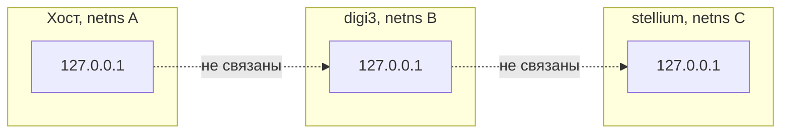
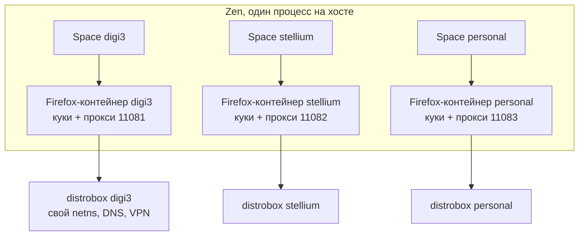
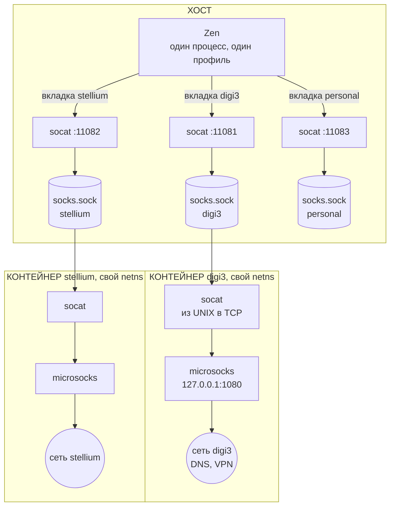
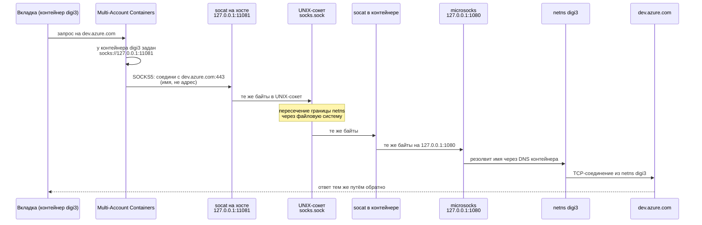
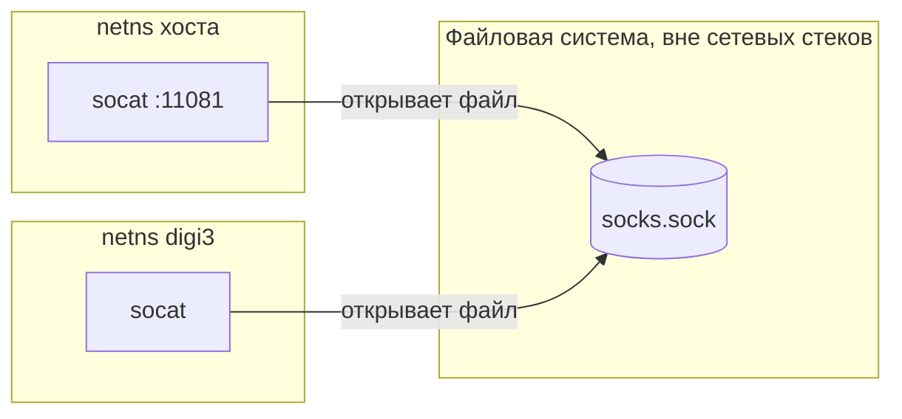
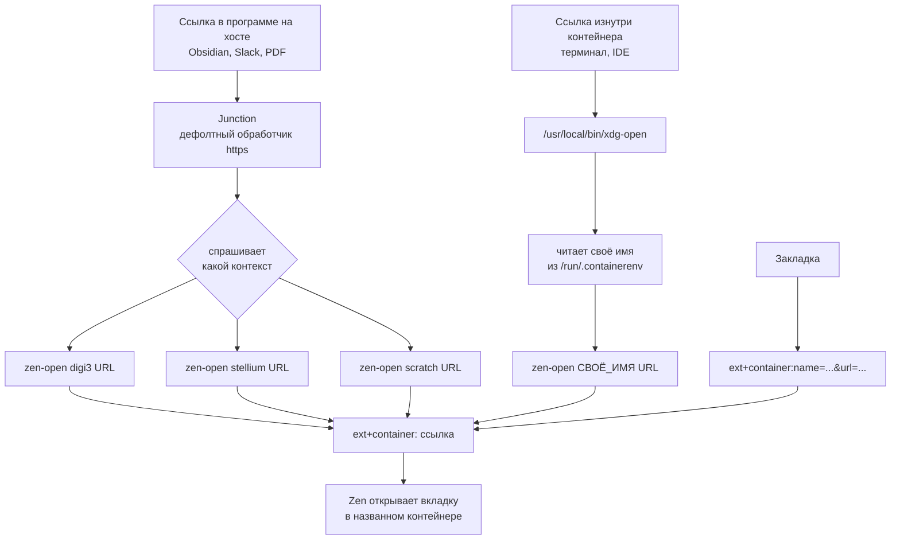

# Изоляция рабочих контекстов в браузере

Разбор механизма от самых основ. Читается сверху вниз: каждый раздел опирается
на предыдущий и ничего не предполагает заранее.

- [1. Задача](#1-задача)
- [2. Словарь](#2-словарь)
- [3. Слово «контейнер» значит две разные вещи](#3-слово-контейнер-значит-две-разные-вещи)
- [4. Общая картина](#4-общая-картина)
- [5. Путь запроса, шаг за шагом](#5-путь-запроса-шаг-за-шагом)
- [6. Почему UNIX-сокет, а не порт](#6-почему-unix-сокет-а-не-порт)
- [7. Кто что приносит](#7-кто-что-приносит)
- [8. Расширения](#8-расширения)
- [9. Настройки user.js](#9-настройки-userjs)
- [10. Маршрутизация ссылок](#10-маршрутизация-ссылок)
- [11. Что изолировано, а что нет](#11-что-изолировано-а-что-нет)
- [12. Как проверить](#12-как-проверить)
- [13. Когда что-то сломалось](#13-когда-что-то-сломалось)

---

## 1. Задача

Есть несколько рабочих контекстов. Требование одно:

> Ни один работодатель не должен получить наблюдаемого свидетельства
> существования других.

Это называется **неатрибутируемость**. Речь не о том, чтобы прятать данные
работодателя от утечки наружу, и не о защите от вирусов. Речь о том, что
наблюдатель, у которого есть только его собственные логи, не должен уметь
связать твою активность у него с активностью где-то ещё.

Что склеивает контексты на практике:

| Признак | Как склеивает |
|---|---|
| IP-адрес | Один и тот же адрес в логах двух организаций |
| DNS-запросы | Резолвер одной работы видит имена другой |
| Куки и сессии | Одна вкладка тянет сессию из другой |
| Вход в общий сервис | `login.microsoftonline.com` общий для всех; вход в чужой тенант попадает в его логи |

Раньше эта задача решалась просто: три distrobox-контейнера, в каждом свой
Firefox. Изоляция отличная, жизнь плохая. Три браузера, три набора вкладок,
трижды память, и переключение между работами это переключение между
приложениями.

Цель нынешней конструкции: **один браузер на хосте, но сеть по-прежнему
выходит через нужный контейнер.**

---

## 2. Словарь

Термины по порядку, каждый опирается на предыдущие.

### Хост

Твоя настоящая машина. Arch Linux, который загрузился при включении. Всё
остальное живёт внутри него.

### Процесс

Запущенная программа. У процесса есть память, открытые файлы и права. Браузер
это процесс (точнее, несколько).

### Namespace

Механизм ядра Linux, который **подменяет процессу его представление о системе**.
Ядро одно, но процесс может видеть только часть того, что в нём есть.

Namespace бывают разных видов, и каждый подменяет что-то своё:

| Вид | Что подменяет |
|---|---|
| `mount` | какие файлы и каталоги видны |
| `pid` | какие процессы видны |
| `net` | какие сетевые интерфейсы, адреса и порты видны |
| `ipc` | общая память между процессами |
| `user` | какой пользователь ты с точки зрения ядра |

Ключевое: это **не виртуальная машина**. Ядро то же самое, процессор тот же,
никакой эмуляции. Просто ядро отвечает на вопросы «какие тут есть сетевые
интерфейсы?» по-разному в зависимости от того, кто спрашивает.

### Контейнер (podman, distrobox)

Процесс (или группа процессов), запущенный в наборе своих namespace.
Слово «контейнер» это просто удобное название для такой группы.

`podman` создаёт и запускает контейнеры. `distrobox` это надстройка над
podman, которая делает контейнер удобным для работы: пробрасывает домашний
каталог, графику, звук, и даёт команду `distrobox enter`.

Проверить, что namespace действительно разные:

```sh
readlink /proc/self/ns/net                          # хост
distrobox enter digi3 -- readlink /proc/self/ns/net # контейнер
```

Числа в скобках будут разные. Это идентификаторы namespace в ядре.

### Network namespace

Самый важный для нас вид. Процесс в своём net namespace имеет:

- собственный набор сетевых интерфейсов;
- собственную таблицу маршрутизации;
- **собственный `127.0.0.1`**;
- собственный набор занятых портов.

Последние два пункта неочевидны и критичны.

### Порт и `127.0.0.1`

**Порт** это число от 1 до 65535. Программа, которая ждёт входящих соединений,
«слушает» какой-то порт. Веб-сервер обычно слушает 80 или 443.

**`127.0.0.1`** (он же `localhost`, он же loopback) это адрес «эта же машина».
Соединение на него никуда не уходит по проводу, оно замыкается внутри.

А теперь важное: **`127.0.0.1` в контейнере и `127.0.0.1` на хосте это разные
вещи.** Разные net namespace, разные loopback-интерфейсы. Если в контейнере
`digi3` что-то слушает `127.0.0.1:8099`, то хост, обратившись к
`127.0.0.1:8099`, туда **не попадёт**. Он попадёт в свой собственный,
где ничего нет.



Это ровно то свойство, которое даёт изоляцию, и ровно то, которое надо было
как-то обойти, чтобы браузер на хосте мог достучаться до контейнера.

### Сокет

**Сокет** это конец канала связи. Программа создаёт сокет, чтобы через него
говорить с другой программой.

Сокеты бывают двух принципиально разных типов, и разница здесь ключевая.

**TCP-сокет** адресуется парой «IP-адрес + порт», например `127.0.0.1:1080`.
Он живёт в сетевом стеке, а значит **внутри своего net namespace**.

**UNIX-сокет** адресуется **путём в файловой системе**, например
`/var/lib/wsproxy/socks.sock`. Это файл особого типа. Посмотреть:

```sh
ls -l ~/.local/share/wsproxy/digi3/socks.sock
# srw------- 1 stsiapan stsiapan 0 ... socks.sock
#  ^ буква s в начале означает socket
```

UNIX-сокет **не находится в сетевом стеке вообще**. Он объект файловой
системы. Из этого следует главное свойство:

> Два процесса могут общаться через UNIX-сокет, даже если они в разных
> network namespace, при условии что оба видят этот файл.

Именно на этом построен весь мост. Про это подробно в разделе 6.

### Прокси

**Прокси** это посредник. Вместо того чтобы соединяться с сайтом самому, ты
соединяешься с прокси и говоришь ему: «сходи на `example.com` и принеси».
Прокси идёт сам, своими маршрутами, со своего адреса.

Ключевое следствие: **сайт видит адрес прокси, а не твой**. И маршрут до сайта
строится из точки, где стоит прокси.

### SOCKS5

**SOCKS5** это конкретный протокол разговора с прокси. Очень простой, работает
на уровне соединений, а не HTTP-запросов, поэтому годится для любого трафика.

Разговор выглядит так:

```
клиент -> прокси:  привет, аутентификация не нужна
прокси -> клиент:  хорошо
клиент -> прокси:  соедини меня с example.com:443
прокси -> клиент:  соединил
                   дальше просто перекладываю байты в обе стороны
```

Слово «5» это номер версии. В настройках Firefox тип называется `socks`, и это
и есть SOCKS5. Строка `socks5://` **не распознаётся** — подробности в разделе 8.

### DNS и proxyDNS

**DNS** превращает имя (`example.com`) в адрес (`93.184.216.34`). Без этого
шага соединиться не с чем.

Вопрос: **кто** делает этот перевод, клиент или прокси?

| Кто резолвит | Что происходит |
|---|---|
| Клиент (браузер на хосте) | Хостовый резолвер видит все имена, которые ты открываешь. Внутренние корпоративные имена не резолвятся вообще, потому что о них знает только DNS внутри контейнера |
| Прокси (внутри контейнера) | Имя уезжает в контейнер как имя, резолвится его резолвером. Хост не видит ничего |

Второй вариант называется **remote DNS**, в Firefox это `proxyDNS`. Он
обязателен: без него утекает список внутренних хостов, а половина рабочих
адресов просто не открывается.

SOCKS5 умеет передавать имя вместо адреса, SOCKS4 и HTTP-прокси — нет. Это ещё
одна причина, почему именно SOCKS5.

### Firefox container

А вот здесь слово «контейнер» означает **совсем другое**.

**Firefox container** это изолированная банка состояния внутри одного браузера:
свои куки, свой localStorage, свои сессии, свой кеш авторизации. Вкладка
принадлежит одному контейнеру.

Две вкладки в разных контейнерах, открывшие один и тот же сайт, для сайта
выглядят как два разных человека. Залогинился в одной — в другой не залогинен.

Технически у каждого контейнера есть `cookieStoreId` вида
`firefox-container-7`. Список хранится в профиле:

```sh
cat ~/.config/zen/*/containers.json
```

### Zen Space

**Space** (он же workspace) это раскладка Zen: свой набор вкладок, своя тема,
свои закреплённые вкладки. Про сеть и куки space не знает **ничего**.

Space можно *привязать* к Firefox-контейнеру. Тогда новые вкладки в этом space
открываются в нём. Эту связь ты создаёшь руками, автоматически её нет.

### Профиль

**Профиль Firefox/Zen** это каталог со всем состоянием браузера целиком:
настройки, расширения, история, все контейнеры. Профиль у нас **один**:

```
~/.config/zen/xjregtnk.Default (release)/
```

Профили видны в `about:profiles`. В интерфейсе Zen кнопка привязки space
называется «Set Profile», но выбирает она **контейнер**, а не профиль. Это
неудачное название в Zen, источник постоянной путаницы.

---

## 3. Слово «контейнер» значит две разные вещи

Это главный источник непонимания, поэтому отдельным разделом.

| | distrobox-контейнер | Firefox-контейнер |
|---|---|---|
| Что это | группа процессов в своих namespace | банка кук внутри браузера |
| Кто сделал | podman / distrobox | Mozilla |
| Что изолирует | сеть, процессы, файловую систему | куки, сессии, localStorage |
| Где живёт | ядро Linux | профиль браузера |
| Пример имени | `digi3` | `digi3` |
| Как посмотреть | `podman ps` | `about:preferences#containers` |

Имена совпадают **намеренно**, и это не случайность, а условие работы схемы.
Firefox-контейнер `digi3` направляет трафик на порт `11081`, а порт `11081`
ведёт в distrobox-контейнер `digi3`. Одно имя, две сущности, связанные вручную
через таблицу портов.



Слева изоляция состояния, справа изоляция сети. Стрелка между ними это и есть
то, что мы построили.

---

## 4. Общая картина



Пять звеньев на контекст. Три из них живут внутри контейнера.

Таблица портов задана в одном месте, `home/.chezmoidata.yaml`:

```yaml
contexts:
  - name: digi3
    socks: 11081
  - name: stellium
    socks: 11082
  - name: personal
    socks: 11083
```

Из неё генерируется всё: секции `distrobox.ini`, юниты `wsproxy-*.service`,
точки монтирования, пункты пикера ссылок, проверки в next-steps. Добавить
четвёртую работу это дописать сюда три строки.

---

## 5. Путь запроса, шаг за шагом

Ты в space `digi3` открываешь `https://dev.azure.com/...`.



Разбор по шагам.

**Шаг 1. Вкладка знает свой контейнер.** Каждая вкладка принадлежит
Firefox-контейнеру. Space `digi3` привязан к контейнеру `digi3`, поэтому все
новые вкладки в нём открываются там.

**Шаг 2. Расширение подставляет прокси.** Multi-Account Containers держит
таблицу «контейнер → прокси» и перехватывает каждый запрос через
`browser.proxy.onRequest`. Для контейнера `digi3` там записано
`socks://127.0.0.1:11081`.

**Шаг 3. Браузер говорит по SOCKS5 с портом 11081 на хосте.** Важно: браузер
передаёт **имя** `dev.azure.com`, а не адрес, потому что включён `proxyDNS`.
Расширение включает его само для любого socks-прокси.

**Шаг 4. `socat` на хосте перекладывает байты в UNIX-сокет.**

```
ExecStart=/usr/bin/socat \
  TCP-LISTEN:11081,bind=127.0.0.1,fork,reuseaddr \
  UNIX-CONNECT:/home/stsiapan/.local/share/wsproxy/digi3/socks.sock
```

`socat` не понимает SOCKS5 и не должен: он тупой перекладыватель байтов.
`TCP-LISTEN` слушает порт, `UNIX-CONNECT` соединяется с файлом-сокетом,
`fork` создаёт отдельный процесс на каждое соединение.

Юнит: `wsproxy-digi3.service`, systemd-юнит пользователя на хосте.

**Шаг 5. Байты пересекают границу netns.** Один и тот же файл-сокет виден с
двух сторон:

```
хост:      ~/.local/share/wsproxy/digi3/socks.sock
контейнер: /var/lib/wsproxy/socks.sock
```

Это один и тот же inode, примонтированный в контейнер как том. Сетевая граница
при этом не тронута вообще — про это раздел 6.

**Шаг 6. `socat` в контейнере перекладывает обратно в TCP.**

```
ExecStart=/usr/bin/socat \
  UNIX-LISTEN:/var/lib/wsproxy/socks.sock,fork,mode=600,unlink-early \
  TCP:127.0.0.1:1080
```

Здесь `127.0.0.1` это уже **loopback контейнера**, не хоста.

Юнит: `wsproxy-bridge.service`, системный юнит внутри контейнера.

**Шаг 7. `microsocks` делает настоящую работу.** Это и есть SOCKS5-сервер. Он
принимает команду «соедини с `dev.azure.com:443`», резолвит имя через DNS
контейнера и открывает исходящее TCP-соединение.

```
ExecStart=/usr/bin/microsocks -i 127.0.0.1 -p 1080
```

Юнит: `wsproxy-socks.service`.

**Шаг 8. Соединение уходит из netns контейнера.** Применяются его маршруты,
его DNS, его VPN. С точки зрения `dev.azure.com` пришёл именно этот контейнер,
ровно как если бы там по-прежнему стоял отдельный Firefox.

### Почему оба юнита работают от пользователя, а не от root

В обоих юнитах стоит `User=stsiapan`. Это не косметика.

distrobox создаёт контейнеры с `--userns keep-id`: пользователь с uid 1000
внутри контейнера это тот же uid 1000 на хосте. А вот **root внутри контейнера
это не root на хосте**, а какой-то subuid вроде 100000.

Если бы `socat` внутри работал от root, он создал бы сокет, принадлежащий этому
subuid. Права `mode=600` означают «только владельцу». Браузер на хосте работает
от uid 1000 и **не смог бы открыть** такой сокет.

---

## 6. Почему UNIX-сокет, а не порт

Это центральное решение всей конструкции.

### Очевидный путь и почему он плохой

Стандартный способ достучаться до порта внутри контейнера это проброс порта
(`-p 11081:1080`). Но проброс порта **пробивает дыру в netns**, и не в одну
сторону: контейнер получает маршрут наружу и способ дотянуться до хоста.
Изоляция, ради которой всё затевалось, слабеет.

### Что делает UNIX-сокет

UNIX-сокет живёт в файловой системе, а не в сетевом стеке. Соединение через
него не проходит ни через какой сетевой интерфейс, ни через таблицу
маршрутизации, ни через firewall. Ядру достаточно, что оба процесса видят один
inode.



Три следствия:

**1. Сетевая граница не ослаблена.** Ни одного нового маршрута, ни одного
открытого порта на границе.

**2. Направление всегда одно.** Хост подключается, контейнер только принимает.
Обратного маршрута нет: контейнер не знает адреса, по которому мог бы
инициировать соединение к хосту.

**3. Каталог у каждого свой.** В `distrobox.ini`:

```ini
additional_flags="--volume ~/.local/share/wsproxy/digi3:/var/lib/wsproxy:rw"
```

Каждому контейнеру монтируется **его подкаталог**, а не общий. Один общий
каталог означал бы, что любой контейнер видит и может набрать сокет соседа, то
есть выйти через чужой VPN. Это и есть корреляция, против которой всё строится.

### Почему `/var/lib`, а не `/mnt`

Сначала точка монтирования была `/mnt/sockets`, и это была ошибка.
`distrobox-init` при каждом старте бинд-монтирует хостовые `/mnt`, `/media`,
`/run/media` и `/var/mnt` внутрь контейнера. Наш том оказывался **под** этим
монтированием и исчезал.

Симптом злой: `/proc/self/mountinfo` показывает том смонтированным, а
`ls /mnt/sockets` говорит «нет такого каталога». Под `/var/lib` distrobox
занимает только `/var/lib/libvirt`, поэтому там безопасно.

---

## 7. Кто что приносит

| Компонент | Откуда | За что отвечает |
|---|---|---|
| Firefox containers | Firefox, встроено в движок | Само существование банок кук, `cookieStoreId` |
| Multi-Account Containers | расширение Mozilla | UI контейнеров, правила «Always Open This Site in…» |
| Work context proxy | **наше** расширение, собирается из `contexts:` | Прокси и `proxyDNS` на контейнер, создание недостающих контейнеров |
| Open external links in a container | расширение | Обработка `ext+container:` ссылок |
| Temporary Containers | расширение | Одноразовые контейнеры для случайных ссылок |
| Bitwarden | расширение | Пароли |
| Zen Spaces | Zen | Раскладка вкладок, привязка space к контейнеру |
| `microsocks` | пакет в контейнере | SOCKS5-сервер, настоящий выход в сеть |
| `socat` | пакет на хосте и в контейнере | Перекладывание байтов между TCP и UNIX-сокетом |
| `podman` / `distrobox` | хост | Namespace, монтирование тома |
| `wsproxy-*.service` | наши скрипты | Запуск и перезапуск socat и microsocks |
| Junction | пакет на хосте | Пикер: спрашивает, в какой контекст открыть ссылку |
| `zen-open` | наш скрипт | Собирает `ext+container:` ссылку |
| `/usr/local/bin/xdg-open` | наш скрипт в контейнере | Перехват ссылок изнутри контейнера |
| политики `/etc/zen/policies/` | наш скрипт | Принудительная установка расширений |
| `user.js` | наш скрипт | Настройки браузера |

Файлы, которые всё это генерируют:

```
home/.chezmoidata.yaml                                   таблица контекстов
home/dot_config/distrobox/distrobox.ini.tmpl             манифест контейнеров
home/.chezmoiscripts/run_onchange_after_34-wsproxy-host.sh.tmpl        мосты на хосте
home/.chezmoiscripts/run_onchange_after_36-wsproxy-container.sh.tmpl   мосты в контейнере
home/.chezmoiscripts/run_onchange_after_37-container-links.sh.tmpl     xdg-open в контейнере
home/.chezmoiscripts/run_onchange_after_38-linkrouting.sh.tmpl         zen-open и пикер
home/.chezmoiscripts/run_onchange_before_32-browser-extensions.sh.tmpl политики
home/.chezmoiscripts/run_onchange_after_40-zen-prefs.sh.tmpl           user.js
```

---

## 8. Расширения

Ставятся не руками, а **политикой предприятия** — файлом, который браузер
читает при старте и исполняет.

```sh
cat /etc/zen/policies/policies.json
```

Каталог политик выводится из имени приложения: `/etc/<MOZ_APP_NAME>/policies`.
У Zen `MOZ_APP_NAME=zen`, поэтому `/etc/zen/`, а **не** `/etc/firefox/`.
Ошибиться здесь легко и последствия молчаливые: браузер стартует нормально и
просто не имеет расширений, то есть границы контекстов нет.

### Multi-Account Containers (`@testpilot-containers`)

Режим установки: **`force_installed`**. Удалить нельзя. Это не настройка, это
сама граница: без него все контексты сливаются в одну банку кук, и ничто в
интерфейсе об этом не скажет.

Что делает у нас:

1. **Даёт сам механизм контейнеров** и интерфейс к ним.
2. **Правила «Always Open This Site in…»** — привязка домена к контейнеру.

Прокси через него мы **не настраиваем**. Он это умеет, но вручную, и на этом
теряется время: строка `socks5://` там не разбирается вообще, а поле прокси не
появляется, пока не выдано отдельное необязательное право. Ни то ни другое
ничего не сообщает при ошибке. Прокси у нас раздаёт своё расширение, ниже.

**Синхронизацию выключить.** Опция *Enable synchronization* заливает имена
контейнеров и привязки сайтов в Firefox Account. Это список всех контекстов и
их доменов в одном месте вне этой машины, прямо против модели угроз.

### Work context proxy (`context-proxy@dotfiles.local`)

Наше собственное расширение, около шестидесяти строк. Собирается при
`chezmoi apply` в `/usr/local/lib/zen-context-proxy.xpi` и ставится политикой
как `force_installed` с `file://`-адресом.

Таблица контекстов зашита внутрь при сборке, из того же `contexts:`, откуда
берутся мосты на хосте и юниты в контейнерах. Порт больше не может разойтись
сам с собой.

Что делает:

```js
browser.proxy.onRequest → для вкладки смотрим её cookieStoreId
                        → { type: "socks", host: "127.0.0.1", port, proxyDNS: true }
```

Контейнеры ищутся **по имени** через `contextualIdentities.query`, а не по
сохранённому id: id раздаются в порядке создания и на другой машине будут
другими. Если контейнера с таким именем нет, расширение его **создаёт**. Это
закрывает последнюю щель ручной настройки: имя, набранное с опечаткой, больше
не даёт контейнер без прокси.

Расширение неподписанное. Это работает, потому что Zen собран с
`MOZ_REQUIRE_SIGNING: false` и `xpinstall.signatures.required = false`. Если
будущая сборка это поменяет, расширение перестанет грузиться — на такой случай
`run_after_zz-next-steps.sh` проверяет, что оно на месте.

Почему конфиг зашит в XPI, а не приходит политикой `3rdparty` через
`storage.managed`: на одну движущуюся часть меньше, а файл всё равно
пересобирается при каждом `apply`. `Policies.sys.mjs:3721` специально не
применяет своё «тот же аддон, не переустанавливать» к `file:`-адресам, поэтому
пересобранный XPI подхватывается при следующем старте сам.

### Контейнеры создаются политикой

Список контейнеров тоже приходит из `contexts:`, штатной политикой Firefox:

```json
"Containers": {
  "Default": [
    { "name": "digi3", "icon": "briefcase", "color": "blue" },
    ...
  ]
}
```

`ContextualIdentityService.sys.mjs:226` присваивает `userContextId`
последовательно, 1..N в порядке массива. Политика заменяет встроенный набор
**только на чистом профиле**: если `containers.json` уже есть, она не делает
ничего. То есть новая машина получает контейнеры сама, а рабочая не страдает.

### Open external links in a container (`{f069aec0-...}`)

Режим: **`force_installed`**.

Регистрирует протокол `ext+container:` и открывает такие ссылки в названном
контейнере:

```
ext+container:name=digi3&url=https%3A%2F%2Fdev.azure.com%2F...
```

Настроек у расширения нет вообще, страницы опций нет.

Важное ограничение, которое надо знать: HMAC-подписей в версии 1.0.3 **нет**.
Значит страница, которая скормит `ext+container:` ссылку, выбирает контейнер
сама. Это ограничено только тем, что враждебные страницы вынесены за рамки
модели угроз.

### Temporary Containers (`{c607c8df-...}`)

Режим: **`normal_installed`** — включено сразу, но удалить можно.

В автоматическом режиме всё, что открывается вне назначенного контейнера,
попадает в одноразовый контейнер, который умирает вместе с вкладкой.
Подстраховка для случайных ссылок, не замена рабочим контейнерам.

### Bitwarden (`{446900e4-...}`)

Режим: **`normal_installed`**.

Настройки, которые важны для изоляции:

- **Auto-fill on page load выключен.** Иначе повторяется ровно сценарий утечки:
  загрузилась страница логина чужого тенанта, форма отправилась, вход попал в
  его логи.
- **URI match detection**: `Never` для общих доменов Microsoft, `Host` для
  уникальных.
- **Один аккаунт на контекст.**

---

## 9. Настройки user.js

Файл лежит в профиле и перечитывается при каждом старте:

```sh
cat ~/.config/zen/*/user.js
```

Почему `user.js`, а не политика: политики покрывают только часть настроек, а
`user.js` применяется заново при каждом запуске. Это не пожелания, а требования.

| Настройка | Зачем |
|---|---|
| `media.peerconnection.ice.proxy_only = true` | WebRTC иначе открывает прямые UDP-потоки мимо прокси, с хостового интерфейса. Это обходит всю схему целиком |
| `network.proxy.allow_hijacking_localhost = true` | По умолчанию браузер **не пускает localhost через прокси**. Тогда `localhost:5000` из рабочей вкладки попадает на **хост**, а не в контейнер: дев-сервер внутри контейнера недоступен из своей же вкладки, зато хостовые порты доступны из любого контекста |
| `permissions.default.desktop-notification = 2` | Уведомления это поверхность утечки во время демонстрации экрана |
| `network.protocol-handler.external.ext+container = true` | Без этого передача ссылки снаружи не работает |
| `security.external_protocol_requires_permission = false` | Без этого каждая передача упирается в диалог подтверждения |
| `signon.rememberSignons = false`, `signon.autofillForms = false` | Пароли живут в Bitwarden. Автозаполнение браузера повторяет сценарий утечки |
| `browser.shell.checkDefaultBrowser = false` | Zen при старте отбирает себе обработчик ссылок и подменяет пикер |
| `browser.tabs.unloadOnLowMemory = true`, `dom.ipc.processCount = 4` | Память |

`fission.autostart` **намеренно не трогается**. Изоляция сайтов стоит памяти,
но ломать её ради пары сотен мегабайт плохой размен.

---

## 10. Маршрутизация ссылок

Самый опасный сценарий — открыть рабочую ссылку не в том контексте. Один клик,
и в логах чужого тенанта появляется твой вход.

Отсюда принцип:

> **Контейнер зашивается в саму ссылку, а не берётся из текущего контекста.**

Три входа.



**Из программы на хосте.** Дефолтным обработчиком `https` стоит Junction, он
спрашивает. В списке `Zen: digi3`, `Zen: stellium`, `Zen: personal`,
`Zen: Scratch`.

Голого пункта «Zen Browser» там нет **намеренно**: `zen.desktop` не объявляет
`MimeType` для http(s). Такой пункт открыл бы ссылку в том контексте, который
сейчас в фокусе.

**Изнутри контейнера.** В контейнере лежит свой `/usr/local/bin/xdg-open`. Он
перехватывает http(s), читает имя контейнера из `/run/.containerenv` и вызывает
на хосте `zen-open <имя> <url>` через `distrobox-host-exec`. Вопрос не
задаётся, потому что ответ известен.

**Закладки.** Обычная закладка открывается в текущем контексте, то есть закладка
stellium, нажатая из space digi3, уедет в digi3. Поэтому рабочие закладки
переписываются в форму `ext+container:`. Собрать строку:

```sh
/usr/local/bin/zen-open stellium 'https://dev.azure.com/org/project'
```

Ссылка будет видна в адресной строке открывшейся вкладки, оттуда её и класть в
закладку.

### Правила «Always Open This Site in…»

Привязка домена к контейнеру. Дальше любая ссылка на этот домен
**вытаскивается** в него, откуда бы её ни открыли.

Отсюда жёсткое правило:

> Такие правила ставятся **только** на домены, уникальные для одного контекста.

Никогда на общие: `dev.azure.com`, `portal.azure.com`, `teams.microsoft.com`,
`login.microsoftonline.com`.

Причина в слове «вытаскивается». Правило на `login.microsoftonline.com` для
digi3 означает, что вход в stellium уедет в контейнер digi3, и в логах чужого
тенанта появится сессия, которой там быть не должно.

Уникальные адреса вида `dev.azure.com/<организация>` правилом не покрываются:
расширение работает по домену, не по пути. Для них закладки с зашитым
контейнером.

---

## 11. Что изолировано, а что нет

Честный разбор. Без него документация бесполезна.

### Изолировано надёжно

| Что | Чем обеспечено |
|---|---|
| Сетевой стек контекстов | Разные net namespace. Проверяется через `readlink /proc/self/ns/net` |
| Исходящий трафик вкладки | Уходит из netns своего контейнера: его маршруты, его VPN |
| DNS-запросы | Резолвятся внутри контейнера благодаря `proxyDNS` |
| Куки, сессии, localStorage | Разные Firefox-контейнеры |
| Порты соседей | Мосты слушают только на `127.0.0.1` хоста. Из контейнера недостижимы ни через его loopback, ни через шлюз, ни через LAN-адрес хоста |
| Список процессов | Свой pid namespace |

### Не изолировано

**Файловая система между контекстами.** distrobox монтирует **весь корень
хоста** в каждый контейнер как `/run/host`. Отсюда следует:

```sh
distrobox enter digi3 -- ls /run/host/home/stsiapan/homes/
# digi3 personal stellium
```

Любой процесс в рабочем контейнере может перечислить все контексты по именам.
Это само по себе то самое «наблюдаемое свидетельство существования других».

Хуже: сокеты соседей лежат там же и доступны. Проверено практически — из
`digi3` поднимается мост на сокет `stellium` и трафик уходит через netns
stellium:

```sh
# в digi3
socat TCP-LISTEN:9999,bind=127.0.0.1,fork \
  UNIX-CONNECT:/run/host/home/stsiapan/.local/share/wsproxy/stellium/socks.sock
curl --socks5-hostname 127.0.0.1:9999 http://127.0.0.1:8099/
# stellium
```

Против кого это важно: против **кода, работающего внутри контейнера**. Против
работодателя, который читает свои логи, — нет. Модель угроз в спеке говорит про
второе, но первое стоит понимать явно.

**`/tmp` общий.** distrobox монтирует хостовый `/tmp` во все контейнеры. Файл,
записанный в `/tmp` из одного контекста, виден из всех и с хоста.

**`/dev/shm` и IPC общие.** Сделано намеренно: `unshare_ipc=true` заменил бы
хостовый `/dev/shm` на 64 МБ по умолчанию у podman, и Electron с JVM перестали
бы работать. Против атрибуции это ничего не даёт, а ломает многое.

**`/dev` общий.** Тоже намеренно: `unshare_devsys=true` снимает проброс `/dev`
и забирает с собой видеокарту и звук.

**Фоновые запросы браузера без вкладки.** Расширение проксирует запрос, только
если у него есть `tabId`. Запросы с `tabId === -1` идут напрямую.

**Один и тот же публичный IP.** Пока ни в одном контексте нет VPN, все три
выходят с одного адреса. Схема к VPN готова, но сама его не создаёт.

**Одна git-личность во всех контейнерах.** Коммиты одним и тем же адресом в
репозиториях разных организаций — прямая корреляция. Решается настройкой
`user.email` в каждом контейнере отдельно.

**Ввод адреса руками из чужого space.** Остаточная дыра. Важна только для
адресов, которые называют конкретную организацию, а такие не набирают руками,
они приходят снаружи и покрыты пикером.

---

## 12. Как проверить

### Быстрая проверка частей

```sh
ss -ltn | grep -E '1108[0-9]'                    # мосты слушают
ls -l ~/.local/share/wsproxy/*/socks.sock        # контейнеры ответили
distrobox enter digi3 -- ls /var/lib/wsproxy     # виден только свой сокет
ls ~/.config/zen/*/extensions/                   # политика сработала
```

Это доказывает, что детали на месте. Не доказывает, что трафик вкладки пошёл
куда надо.

### Настоящая проверка маршрутизации

Сравнение публичных IP ничего не различает, пока нет VPN. Различает
**собственный loopback контейнера**: у каждого он свой, а у хоста там пусто.

Поднять в каждом контейнере ответчик, который называет своё имя:

```sh
for c in digi3 stellium personal; do
  distrobox enter "$c" -- sh -c "printf 'HTTP/1.0 200 OK\r\nContent-Type: text/plain\r\n\r\n%s\n' \"\$(. /run/.containerenv; echo \$name)\" > /var/tmp/whoami.http"
  podman exec -d "$c" sh -c 'socat TCP-LISTEN:8099,bind=127.0.0.1,fork,reuseaddr SYSTEM:"cat /var/tmp/whoami.http"'
done
```

`/var/tmp`, а не `/tmp`: `/tmp` общий, три контейнера писали бы в один файл и
тест показал бы одно имя на всех каналах, то есть выглядел бы как успех.

`podman exec -d`, а не фоновый `distrobox enter`: слушатель умирает вместе с
exec-сессией, `setsid` не спасает.

Проверка с хоста:

```sh
curl -s --max-time 5 http://127.0.0.1:8099/      # должно провалиться
for p in 11081 11082 11083; do
  printf '%s -> ' "$p"
  curl -s --socks5-hostname "127.0.0.1:$p" http://127.0.0.1:8099/
done                                             # digi3, stellium, personal
```

Проверка из браузера: открыть `http://127.0.0.1:8099/` в каждом space.

| Что видно | Что это значит |
|---|---|
| имя своего контекста | канал работает |
| чужое имя | прокси прописан не тому контейнеру |
| «Unable to connect» | прокси не применился: либо вкладка не в контейнере, либо `socks5://` вместо `socks://`, либо не выдано право на прокси |
| открылось в `scratch` | у `scratch` откуда-то взялся прокси |

Убрать после проверки:

```sh
for c in digi3 stellium personal; do
  distrobox enter "$c" -- sh -c 'pkill -f "TCP-LISTEN:8099" || true; rm -f /var/tmp/whoami.http'
done
```

### Разовые проверки

- `about:policies` → Active: должны быть все четыре расширения.
- `browserleaks.com/webrtc` из рабочей вкладки: локальный адрес виден быть не
  должен.
- Значок Multi-Account Containers в открытой вкладке показывает, в каком
  контейнере она находится. Быстрый способ понять, привязан ли space.

---

## 13. Когда что-то сломалось

### Вкладка не открывает `127.0.0.1:8099`, а другие открывают

Скорее всего space не привязан к контейнеру. Открыть новую вкладку в этом
space, нажать значок Multi-Account Containers, посмотреть имя контейнера
сверху. Привязка действует только на **новые** вкладки.

### Ничего не работает ни в одном контексте

```sh
systemctl --user status 'wsproxy-*'              # мосты на хосте
distrobox enter digi3 -- systemctl status 'wsproxy-*'   # мосты в контейнере
```

Если сокета нет, контейнер, скорее всего, остановлен: `distrobox enter <имя>`
поднимет его. Мост на хосте это переживает — слушатель остаётся, падают только
отдельные соединения.

### `podman info` ругается на overlay

Обновление пакета `linux` удаляет модули работающего ядра, и `overlay`
перестаёт существовать до перезагрузки:

```sh
uname -r          # запущенное ядро
pacman -Q linux   # установленный пакет
grep -c overlay /proc/filesystems
```

Версии разошлись и третья строка печатает `0` — перезагрузка, других вариантов
нет.

### Расширений нет после обновления браузера

Проверить, что политика на месте и по верному пути:

```sh
cat /etc/zen/policies/policies.json
ls ~/.config/zen/*/extensions/
```

Если файла нет, `chezmoi apply`. Если файл есть, а расширений нет —
`about:policies` покажет, что браузер реально прочитал.

### Ссылки открываются в случайном контексте

Zen при запуске отбирает себе обработчик `https`:

```sh
xdg-mime query default x-scheme-handler/https    # должно быть Junction
```

Лечится `chezmoi apply` — скрипт next-steps отбирает обработчик обратно.
От повторения защищает `browser.shell.checkDefaultBrowser = false` в `user.js`.

### Добавить четвёртый контекст

```yaml
# home/.chezmoidata.yaml
contexts:
  - name: newjob
    socks: 11084
```

```sh
chezmoi apply
distrobox assemble create --name newjob --file ~/.config/distrobox/distrobox.ini
distrobox enter newjob
sh -c "$(curl -fsSL https://raw.githubusercontent.com/stpntkhnv/dotfiles/main/install.sh)"
```

Firefox-контейнер и прокси появятся сами: расширение пересоберётся с новой
таблицей и создаст недостающий контейнер при следующем старте Zen. Руками
останется только новый space и привязка к контейнеру — засев spaces работает
лишь на нетронутом профиле и рабочий не трогает.

### Новая машина с нуля

```sh
chezmoi apply     # политики, XPI, мосты, контейнеры distrobox
zen-browser       # создаётся профиль: контейнеры из политики, прокси из расширения
                  # закрыть
chezmoi apply     # засев spaces в ещё пустую сессию
```

Второй `apply` нужен потому, что `zen-sessions.jsonlz4` не существует, пока
Zen не запускался ни разу.
