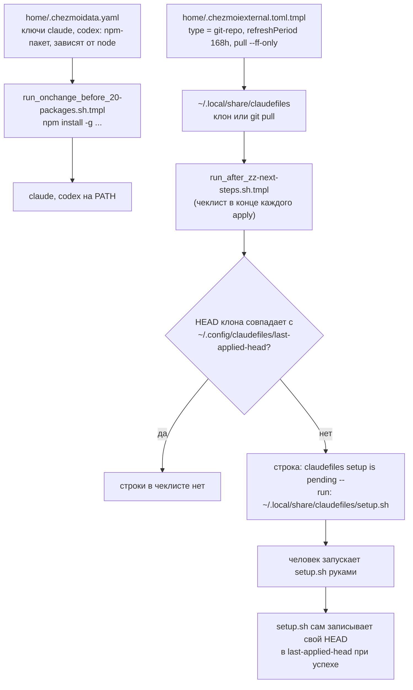

---
covers:
  features: [claude, codex]
  paths:
    - home/.chezmoiexternal.toml.tmpl
---

# Агенты в терминале: Claude Code и Codex

## Что это даёт

На машине появляются две команды: `claude` (Claude Code от Anthropic) и
`codex` (Codex от OpenAI) — программы, которые читают текст в терминале,
пишут и правят код, гоняют команды. Это обычные CLI-инструменты, ставятся
как любой другой npm-пакет.

У Claude Code есть вторая часть, которой нет у Codex: отдельный, чужой
репозиторий `claudefiles` донастраивает его — раскладывает плагины,
MCP-серверы (внешние инструменты, которые агент может вызывать) и скиллы
(заготовленные инструкции под конкретные задачи). Что именно он туда кладёт
и как это устроено внутри — вопрос уже не этого репозитория, а самого
`claudefiles`: отсюда видно только то, что этот репозиторий делает со своей
стороны — подтягивает `claudefiles` на диск и **напоминает** запустить его
`setup.sh`, пока тот не прогнан для текущей ревизии. Сам запуск — руками:
до 1 августа 2026 `setup.sh` вызывался автоматически из `chezmoi apply`
(скрипт 84), но это длинный интерактивный прогон со своими вопросами и
своими сетевыми шагами, и место ему не внутри применения конфигурации.
Дальше граница ответственности заканчивается.

## Как это работает



### Пакеты: `home/.chezmoidata.yaml`

Оба агента — обычные фичи каталога, `scope: both` (ставятся и на хосте, и
внутри каждого [контейнера distrobox](glossary.md#контейнер-distrobox) —
про `scope` подробнее в [how-it-works.md](how-it-works.md#три-вопроса-которые-решают-судьбу-фичи)):

```yaml
- key: claude
  label: "Claude Code CLI"
  scope: both
  default: true
  needs: [node]
  npm:
    - "@anthropic-ai/claude-code"

- key: codex
  label: "OpenAI Codex CLI"
  scope: both
  needs: [node]
  npm:
    - "@openai/codex"
```

`claude` отмечен `default: true` (галочка стоит сразу в чеклисте), `codex` —
по выбору. Оба тянут за собой фичу `node` (`needs: [node]`). Сама установка
npm-пакетов не в этом скрипте: единый установщик собирает списки пакетов из
всех включённых фич и ставит их разом
(`home/.chezmoiscripts/run_onchange_before_20-packages.sh.tmpl`, `npm install
-g --allow-scripts=@anthropic-ai/claude-code ...` — подробнее про npm и
дотнет-инструменты в [dev-tools.md](dev-tools.md)).

То, что `claude` установлен в контейнере рабочего контекста, а не только на
хосте, видно и в другом документе: [multiplexer.md](multiplexer.md)
показывает, что настоящий `claude` работает внутри distrobox-контейнера, а
не на хосте — herdr на хосте лишь видит панель с запущенным `distrobox
enter` и определяет, что внутри агент, по метке `HERDR_AGENT=claude`
(подробности — там же).

### Внешний репозиторий `claudefiles`

`home/.chezmoiexternal.toml.tmpl` подтягивает `claudefiles` как внешний
источник (external) chezmoi типа `git-repo`. Расширение `.tmpl` в имени —
это [шаблон chezmoi](glossary.md#шаблон-chezmoi): условие `{{ if has "claude"
.enabled }}` решает во время рендеринга, попадёт ли блок ниже в итоговый
`.chezmoiexternal.toml` вообще:

```toml
{{ if has "claude" .enabled -}}
[".local/share/claudefiles"]
    type = "git-repo"
    url = "https://github.com/stpntkhnv/claudefiles.git"
    refreshPeriod = "168h"
    [".local/share/claudefiles".pull]
        args = ["--ff-only"]
{{- end }}
```

Если фича `claude` выключена, внешнего источника для `claudefiles` в
итоговом `.chezmoiexternal.toml` вообще нет, и chezmoi его никогда не
клонирует.

Для внешних источников типа `git-repo` у chezmoi два разных действия в
зависимости от того, есть каталог на диске или нет: если каталога ещё нет —
`git clone`; если каталог уже есть — `git pull`, но не чаще, чем раз в
`refreshPeriod`. Здесь `refreshPeriod = "168h"` — то есть ровно 168 часов
(семь суток), а не примерно; проверять обновление чаще одного раза в неделю
незачем, а раз в неделю — достаточно, чтобы не отстать надолго от того, что
лежит в `claudefiles`. `pull.args = ["--ff-only"]` ограничивает `git pull`
только перемоткой вперёд: если локальная копия разошлась с удалённой веткой
настолько, что нужен слияние или ребейз, `git pull --ff-only` откажется и
завершится ошибкой вместо того, чтобы тихо создать merge-коммит или
переписать историю. Поскольку в `~/.local/share/claudefiles` никто на этой
машине руками не коммитит, разойтись локальная копия может только если
апстрим переписал историю (force-push) — тогда `--ff-only` предпочитает
громко упасть, а не молча слить несовместимое.

Начальный клон и `git pull` относятся к фазе «применить состояние», которая
у chezmoi идёт между `run_before_`- и `run_after_`-скриптами
([how-it-works.md, раздел «Порядок применения»](how-it-works.md#порядок-применения);
сам порядок — из официальной документации chezmoi, [Application
order](https://www.chezmoi.io/reference/application-order/)). Это значит,
что к моменту финального чеклиста внешний репозиторий уже на диске.

### Запуск `setup.sh` — руками, по подсказке чеклиста

`chezmoi apply` сам `setup.sh` **не запускает**. Вместо этого финальный
чеклист (`run_after_zz-next-steps.sh.tmpl`, блок под `{{ if has "claude"
.enabled }}`) на каждом применении сравнивает `HEAD` клона
(`git -C ~/.local/share/claudefiles rev-parse HEAD`) с файлом состояния
`~/.config/claudefiles/last-applied-head` и, пока они расходятся — включая
случай, когда файла состояния ещё нет вовсе, то есть свежую машину или
свежий контейнер, — печатает строку:

```
Claude: claudefiles setup is pending -- run: ~/.local/share/claudefiles/setup.sh
```

Файл состояния пишет **сам `setup.sh`** в конце успешного прогона (код
`claudefiles`, конец `setup.sh`: `printf '%s' "$_applied_head" >
"$_state/last-applied-head"`, за гейтом «ни один профиль не упал»). Поэтому
строка исчезает из чеклиста после первого же удачного ручного запуска и
появляется снова, когда еженедельный `git pull` внешнего источника сдвинул
`HEAD` — то есть подсказка не ноет постоянно, а появляется ровно тогда, когда
есть что применять.

До 1 августа 2026 это работало иначе: скрипт
`run_after_84-claudefiles.sh.tmpl` вызывал `setup.sh` автоматически на каждом
`apply` через хелпер `apply_if_changed` из самого `claudefiles`. Убрано по
прямому решению владельца: `setup.sh` — длинный интерактивный прогон со
своими вопросами (флаги, токены, пути), своими сетевыми шагами и своими
способами сломаться, и внутри `chezmoi apply` он превращал применение
конфигурации в заложника чужого установщика. Хелпер `apply_if_changed` в
`claudefiles` остался (им могут пользоваться машины со старой версией
dotfiles), но этот репозиторий его больше не вызывает.

### Где кончается граница с секретами

Фича `bitwarden` ставит три разных клиента Bitwarden не случайно: настольное
приложение для человека, `rbw` для терминала и `bws` — токен машинного
аккаунта Bitwarden Secrets Manager, ограниченный одним dev-проектом
(`home/.chezmoidata.yaml`, комментарий у ключа `bitwarden`; чеклист
`run_after_zz-next-steps.sh.tmpl` напоминает завести токен в
`~/.config/bws/access-token`, если `bws` уже стоит, а токена ещё нет). Смысл
третьего клиента: через `bws` читаются рабочие ключи API, и держатель этого
токена не дотягивается до личного хранилища паролей — это не флаг и не
проверка внутри `claude` или `claudefiles`, а следствие того, какому именно
аккаунту принадлежит токен.

Где проходит граница на самом деле, стоит сказать точно, потому что на хосте
и в контейнере она разная — но дело не в том, есть ли команда `pat` внутри
контейнера: она там есть. `distrobox enter` монтирует дом хоста внутрь
контейнера и наследует хостовый `PATH`, так что `pat` изнутри контейнера — тот
же самый хостовый файл, не копия ([secrets.md](secrets.md)). Агент **внутри
контейнера** до личного хранилища всё равно не дотягивается — не потому, что
команды нет, а потому, что в доме самого контейнера нет
`~/.config/rbw/config.json`, а сокет агента `rbw` в `/run/user/1000` изнутри
контейнера не виден вовсе, у контейнера свой `/run`: запуск падает на `pat:
rbw is not configured`, а не на «command not found». Агент **на хосте**
личное хранилище прочитать может: там `rbw` настроен и агент виден, и при
разблокированном `rbw` `pat` отдаст любой токен из папки `PAT`. Это следствие
того, что хост принадлежит человеку целиком, а не отдельная защита, и писать
иначе было бы самообманом.

Как устроено само хранилище Bitwarden и остальные два клиента — это уже
[secrets.md](secrets.md), не эта тема.

## Что ставится и что меняется

| Что | Куда | Чем | Условие |
|---|---|---|---|
| Пакет `@anthropic-ai/claude-code` | `~/.npm-global` (команда `claude` на PATH) | `run_onchange_before_20-packages.sh.tmpl` | фича `claude`, `scope: both` |
| Пакет `@openai/codex` | `~/.npm-global` (команда `codex` на PATH) | `run_onchange_before_20-packages.sh.tmpl` | фича `codex`, `scope: both` |
| Клон/обновление `claudefiles` | `~/.local/share/claudefiles` | `home/.chezmoiexternal.toml.tmpl`, внешний источник `git-repo` | фича `claude` |
| Строка «claudefiles setup is pending» в чеклисте | вывод `chezmoi apply` | `run_after_zz-next-steps.sh.tmpl` | фича `claude`, пока `HEAD` клона не совпал с `last-applied-head` |
| Файл состояния | `~/.config/claudefiles/last-applied-head` | сам `setup.sh` (код `claudefiles`, не этого репозитория) | в конце успешного ручного прогона |
| Всё, что кладёт `setup.sh` (`~/.claude`, возможно `~/.claude-super`, MCP, плагины, скиллы) | вне этого репозитория | `claudefiles/setup.sh`, запускается руками | не покрывается этим документом — граница ответственности другого репозитория |

## Как проверить

```bash
which claude codex
```
Ожидаемо: путь внутри `~/.npm-global/bin/`, если соответствующая фича
включена — если фича выключена, команды не будет вообще.

```bash
git -C ~/.local/share/claudefiles rev-parse HEAD
cat ~/.config/claudefiles/last-applied-head
```
Ожидаемо: два значения совпадают, если `setup.sh` в последний раз отработал
без ошибки и после этого `claudefiles` не обновлялся заново. Расходятся —
чеклист в конце `chezmoi apply` печатает строку «claudefiles setup is
pending» с командой запуска; проверить это, ничего не применяя, можно
рендером чеклиста: `chezmoi execute-template <
home/.chezmoiscripts/run_after_zz-next-steps.sh.tmpl | grep -A3 claudefiles`.

## Когда сломалось

| Симптом | Причина | Что делать |
|---|---|---|
| `claude`/`codex`: команда не найдена | Фича не включена в `.enabled`, либо `~/.npm-global/bin` не в `PATH` | `chezmoi data \| jq '.enabled'`, проверить фичу; `echo $PATH` |
| `~/.local/share/claudefiles` пуст или отсутствует, хотя `claude` включена | Внешний источник ещё не применялся (например, ждёт первого полного `chezmoi apply` после включения фичи) | `chezmoi apply` (полностью, не по одному файлу) |
| В `claudefiles` вышли новые коммиты, а чеклист не предлагает setup | `git pull` внутри chezmoi ограничен `refreshPeriod = "168h"` — обновление раз в неделю, а не при каждом `apply`; пока клон не обновился, HEAD совпадает с маркером | подождать окно обновления, либо `chezmoi apply --refresh-externals` (форсирует обновление внешних источников, минуя `refreshPeriod`) |
| Строка «claudefiles setup is pending» не исчезает после прогона `setup.sh` | `setup.sh` завершился с ошибкой (маркер пишется только за гейтом «ни один профиль не упал»), либо это старый `setup.sh` без записи маркера | Прочитать вывод `setup.sh`, починить причину и прогнать снова; если клон старый — `chezmoi apply --refresh-externals` |
| `git pull` внешнего источника падает с ошибкой перемотки | `claudefiles` на GitHub переписал историю (force-push) — `--ff-only` не даёт молча слить несовместимое | Разобраться, что произошло в `claudefiles` (это уже её история, не этого репозитория); при необходимости удалить и заново склонировать `~/.local/share/claudefiles` |

## Почему именно так

**Почему `--ff-only`, а не просто `git pull`.** Локальная копия
`claudefiles` на этой машине не редактируется руками — единственный источник
изменений в ней снаружи. Обычный `git pull` при разошедшейся истории делает
слияние с merge-коммитом (или, в зависимости от настроек, ребейз) — в
контексте, где локальных изменений в принципе быть не должно, такое слияние
скорее спрячет проблему, чем решит её. `--ff-only` вместо этого превращает
любое расхождение в понятную, громкую ошибку `git pull`.

**Почему 168 часов, а не чаще.** Число зафиксировано буквально в
`home/.chezmoiexternal.toml.tmpl` (`refreshPeriod = "168h"`) — это ровно семь
суток. Комментариев к самому числу в истории репозитория нет (единственный
коммит, который его вносит — `ad6a10e`, без пояснения выбора именно этого
значения); из кода видна только механика: `chezmoi` не делает `git pull`
внешнего источника чаще, чем раз в `refreshPeriod`, начальный `git clone` при
этом не ограничен ничем и происходит всегда, когда каталога ещё нет.

**Почему проверка HEAD, а не просто «`claudefiles` есть — напомнить про
`setup.sh`».** `setup.sh` — не бесплатная операция (спрашивает, что-то
докатывает), и напоминание о нём на каждом `chezmoi apply` только потому,
что фича `claude` включена, приучило бы игнорировать чеклист. Сравнение
`HEAD` клона с маркером даёт строке появляться ровно тогда, когда есть
основание: клон реально сдвинулся с той ревизии, которую `setup.sh` в
последний раз успешно применил.

**Почему `setup.sh` не запускается из `apply` автоматически.** Так было до
1 августа 2026, и разобрано выше в «Запуск `setup.sh` — руками, по подсказке
чеклиста»: интерактивному установщику с собственными вопросами и сетевыми
шагами не место внутри применения конфигурации — его отказ или зависание
превращали весь `chezmoi apply` в заложника.

## Ссылки

- Апстрим `claude` — [Claude Code](https://github.com/anthropics/claude-code) (Anthropic).
- Апстрим `codex` — [Codex CLI](https://github.com/openai/codex) (OpenAI).
- Официальная документация chezmoi по внешним источникам и порядку
  применения: [Include files from
  elsewhere](https://www.chezmoi.io/user-guide/include-files-from-elsewhere/),
  [Application order](https://www.chezmoi.io/reference/application-order/).
- [multiplexer.md](multiplexer.md) — как herdr опознаёт запущенный `claude`
  внутри контейнера.
- [secrets.md](secrets.md) — устройство самого хранилища Bitwarden и границы
  трёх его клиентов.
- [dev-tools.md](dev-tools.md) — единый npm-установщик и остальные
  инструменты разработчика.
