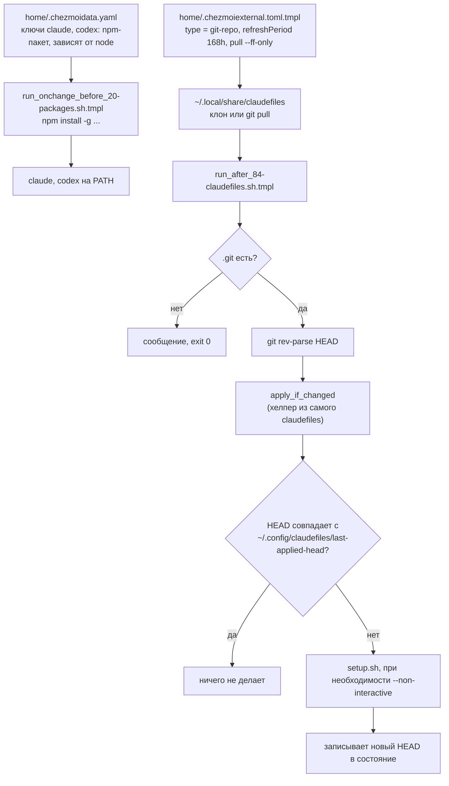

---
covers:
  features: [claude, codex]
  paths:
    - home/.chezmoiscripts/run_after_84-claudefiles.sh.tmpl
    - home/.chezmoiexternal.toml.tmpl
---

# Агенты в терминале: Claude Code и Codex

## Что это даёт

На машине появляются две команды: `claude` (Claude Code от Anthropic) и
`codex` (Codex от OpenAI) — программы, которые читают текст в терминале,
пишут и правят код, гоняют команды. Это обычные CLI-инструменты, ставятся
как любой другой npm-пакет.

У Claude Code есть вторая часть, которой нет у Codex: отдельный, чужой
репозиторий `claudefiles` донастраивает его — раскладывает плагины,
MCP-серверы (внешние инструменты, которые агент может вызывать) и скиллы
(заготовленные инструкции под конкретные задачи). Что именно он туда кладёт
и как это устроено внутри — вопрос уже не этого репозитория, а самого
`claudefiles`: отсюда видно только то, что этот репозиторий делает со своей
стороны — подтягивает `claudefiles` на диск и вызывает его `setup.sh`,
когда есть смысл. Дальше граница ответственности заканчивается.

## Как это работает



### Пакеты: `home/.chezmoidata.yaml`

Оба агента — обычные фичи каталога, `scope: both` (ставятся и на хосте, и
внутри каждого [контейнера distrobox](glossary.md#контейнер-distrobox) —
про `scope` подробнее в [features.md](features.md), раздел о фичах):

```yaml
- key: claude
  label: "Claude Code CLI"
  scope: both
  default: true
  needs: [node]
  npm:
    - "@anthropic-ai/claude-code"

- key: codex
  label: "OpenAI Codex CLI"
  scope: both
  needs: [node]
  npm:
    - "@openai/codex"
```

`claude` отмечен `default: true` (галочка стоит сразу в чеклисте), `codex` —
по выбору. Оба тянут за собой фичу `node` (`needs: [node]`). Сама установка
npm-пакетов не в этом скрипте: единый установщик собирает списки пакетов из
всех включённых фич и ставит их разом
(`home/.chezmoiscripts/run_onchange_before_20-packages.sh.tmpl`, `npm install
-g --allow-scripts=@anthropic-ai/claude-code ...` — подробнее про npm и
дотнет-инструменты в [dev-tools.md](dev-tools.md)).

То, что `claude` установлен в контейнере рабочего контекста, а не только на
хосте, видно и в другом документе: [multiplexer.md](multiplexer.md)
показывает, что настоящий `claude` работает внутри distrobox-контейнера, а
не на хосте — herdr на хосте лишь видит панель с запущенным `distrobox
enter` и определяет, что внутри агент, по метке `HERDR_AGENT=claude`
(подробности — там же).

### Внешний репозиторий `claudefiles`

`home/.chezmoiexternal.toml.tmpl` подтягивает `claudefiles` как внешний
источник (external) chezmoi типа `git-repo`. Расширение `.tmpl` в имени —
это [шаблон chezmoi](glossary.md#шаблон-chezmoi): условие `{{ if has "claude"
.enabled }}` решает во время рендеринга, попадёт ли блок ниже в итоговый
`.chezmoiexternal.toml` вообще:

```toml
{{ if has "claude" .enabled -}}
[".local/share/claudefiles"]
    type = "git-repo"
    url = "https://github.com/stpntkhnv/claudefiles.git"
    refreshPeriod = "168h"
    [".local/share/claudefiles".pull]
        args = ["--ff-only"]
{{- end }}
```

Если фича `claude` выключена, внешнего источника для `claudefiles` в
итоговом `.chezmoiexternal.toml` вообще нет, и chezmoi его никогда не
клонирует.

Для внешних источников типа `git-repo` у chezmoi два разных действия в
зависимости от того, есть каталог на диске или нет: если каталога ещё нет —
`git clone`; если каталог уже есть — `git pull`, но не чаще, чем раз в
`refreshPeriod`. Здесь `refreshPeriod = "168h"` — то есть ровно 168 часов
(семь суток), а не примерно; проверять обновление чаще одного раза в неделю
незачем, а раз в неделю — достаточно, чтобы не отстать надолго от того, что
лежит в `claudefiles`. `pull.args = ["--ff-only"]` ограничивает `git pull`
только перемоткой вперёд: если локальная копия разошлась с удалённой веткой
настолько, что нужен слияние или ребейз, `git pull --ff-only` откажется и
завершится ошибкой вместо того, чтобы тихо создать merge-коммит или
переписать историю. Поскольку в `~/.local/share/claudefiles` никто на этой
машине руками не коммитит, разойтись локальная копия может только если
апстрим переписал историю (force-push) — тогда `--ff-only` предпочитает
громко упасть, а не молча слить несовместимое.

Начальный клон и `git pull` относятся к фазе «применить состояние», которая
у chezmoi идёт между `run_before_`- и `run_after_`-скриптами
(`docs/how-it-works.md`, раздел «Два вида скриптов»; сам порядок — из
официальной документации chezmoi, [Application
order](https://www.chezmoi.io/reference/application-order/)). Это значит,
что при обычном `chezmoi apply` к моменту запуска `run_after_84` внешний
репозиторий должен быть уже на диске. Проверка `[[ ! -d "$CF/.git" ]]`
внутри скрипта 84 (см. ниже) на этот обычный случай не рассчитана — из кода
не видно ни одного пути, которым она срабатывает при штатном полном
`chezmoi apply`; это защитный код на случай нештатного запуска (например,
скрипт вызван не изнутри `chezmoi apply`, а вручную), а не задокументированный
сценарий.

### Скрипт 84: `apply_if_changed`

`home/.chezmoiscripts/run_after_84-claudefiles.sh.tmpl` — не
[`run_onchange`](glossary.md#run_onchange)-скрипт, а обычный `run_after_`, то
есть выполняется на **каждом** `chezmoi apply`, если фича `claude` включена
(проверка `{{- if not (has "claude" .enabled) }} exit 0 {{- else }}` в первых
строках — тот же приём «уровень 1: скрипта нет вообще», разобранный в
`docs/how-it-works.md`).

Дальше, если каталог `~/.local/share/claudefiles/.git` не существует, скрипт
печатает `claudefiles external not present yet, skipping.` и завершается
(`exit 0`) — ничего не вызывает. Если каталог есть, скрипт:

1. читает текущий `HEAD` командой `git -C "$CF" rev-parse HEAD`;
2. подключает `lib/apply-if-changed.sh` — **это файл из самого
   `claudefiles`**, не из этого репозитория: dotfiles лишь исполняет чужой
   хелпер по известному пути внутри уже склонированного внешнего источника;
3. вызывает `apply_if_changed "$head" run`, где `run()` — обёртка вокруг
   `"$CF/setup.sh"`.

`apply_if_changed` (файл `lib/apply-if-changed.sh` внутри `claudefiles`,
функция `apply_if_changed`) хранит последний применённый `HEAD` в
`${CLAUDEFILES_STATE_DIR:-$HOME/.config/claudefiles}/last-applied-head`.
Если в этом файле уже лежит ровно тот же `HEAD`, что передан аргументом,
функция возвращает `0` и ничего не делает; иначе вызывает переданный
колбэк (`run`, то есть `setup.sh`) и только после того, как он отработал
без ошибки, перезаписывает файл состояния новым `HEAD`. Другими словами:
`setup.sh` перезапускается не при каждом `chezmoi apply`, а только когда
`git pull` (или первичный `git clone`) внешнего репозитория реально сдвинул
`HEAD` с прошлого раза, когда `setup.sh` успешно отработал.

### `--non-interactive`

```bash
run() { "$CF/setup.sh"{{ if not stdinIsATTY }} --non-interactive{{ end }}; }
```

`stdinIsATTY` — встроенная функция шаблонов chezmoi, а не что-то из этого
репозитория; она проверяет, есть ли терминал на стандартном вводе **в
момент, когда chezmoi рендерит этот скрипт**. Поскольку скрипт без
`onchange` перерисовывается и тут же исполняется на каждом `chezmoi apply` в
рамках одного и того же процесса, это фактически проверка того, был ли у
самого запуска `chezmoi apply` терминал на stdin: интерактивный запуск
руками — TTY есть, флаг не добавляется; запуск без TTY (например, через
`chezmoi apply` из скрипта, cron, CI) — флаг `--non-interactive`
подставляется в текст рендеринга самого скрипта.

### Где кончается граница с секретами

Фича `bitwarden` ставит три разных клиента Bitwarden не случайно: настольное
приложение для человека, `rbw` для терминала и `bws` — токен машинного
аккаунта Bitwarden Secrets Manager, ограниченный одним dev-проектом
(`home/.chezmoidata.yaml`, комментарий у ключа `bitwarden`; чеклист
`run_after_zz-next-steps.sh.tmpl` напоминает завести токен в
`~/.config/bws/access-token`, если `bws` уже стоит, а токена ещё нет). Смысл
третьего клиента: агент (что бы ни настроил внутри себя `claudefiles`)
может через `bws` прочитать рабочие ключи API, но физически не может дойти
до личного хранилища паролей — это не флаг и не проверка внутри `claude` или
`claudefiles`, а следствие того, какому именно аккаунту принадлежит токен.
Как устроено само хранилище Bitwarden и остальные два клиента — это уже
[secrets.md](secrets.md), не эта тема.

## Что ставится и что меняется

| Что | Куда | Чем | Условие |
|---|---|---|---|
| Пакет `@anthropic-ai/claude-code` | `~/.npm-global` (команда `claude` на PATH) | `run_onchange_before_20-packages.sh.tmpl` | фича `claude`, `scope: both` |
| Пакет `@openai/codex` | `~/.npm-global` (команда `codex` на PATH) | `run_onchange_before_20-packages.sh.tmpl` | фича `codex`, `scope: both` |
| Клон/обновление `claudefiles` | `~/.local/share/claudefiles` | `home/.chezmoiexternal.toml.tmpl`, внешний источник `git-repo` | фича `claude` |
| Файл состояния | `~/.config/claudefiles/last-applied-head` | `apply_if_changed` (код `claudefiles`, не этого репозитория) | после каждого успешного `setup.sh` |
| Всё, что кладёт `setup.sh` (`~/.claude`, возможно `~/.claude-super`, MCP, плагины, скиллы) | вне этого репозитория | `claudefiles/setup.sh` | не покрывается этим документом — граница ответственности другого репозитория |

## Как проверить

```bash
which claude codex
```
Ожидаемо: путь внутри `~/.npm-global/bin/`, если соответствующая фича
включена — если фича выключена, команды не будет вообще.

```bash
git -C ~/.local/share/claudefiles rev-parse HEAD
cat ~/.config/claudefiles/last-applied-head
```
Ожидаемо: два значения совпадают, если `setup.sh` в последний раз отработал
без ошибки и после этого `claudefiles` не обновлялся заново.

```bash
chezmoi execute-template < home/.chezmoiscripts/run_after_84-claudefiles.sh.tmpl
```
Ожидаемо: при включённой фиче `claude` виден вызов `apply_if_changed`; при
выключенной — только `exit 0` (см. `docs/how-it-works.md`, «уровень 1»).

## Когда сломалось

| Симптом | Причина | Что делать |
|---|---|---|
| `claude`/`codex`: команда не найдена | Фича не включена в `.enabled`, либо `~/.npm-global/bin` не в `PATH` | `chezmoi data \| jq '.enabled'`, проверить фичу; `echo $PATH` |
| `~/.local/share/claudefiles` пуст или отсутствует, хотя `claude` включена | Внешний источник ещё не применялся (например, ждёт первого полного `chezmoi apply` после включения фичи) | `chezmoi apply` (полностью, не по одному файлу) |
| `setup.sh` не перезапускается, хотя в `claudefiles` вышли новые коммиты | `git pull` внутри chezmoi ограничен `refreshPeriod = "168h"` — обновление раз в неделю, а не при каждом `apply` | подождать окно обновления, либо `chezmoi apply --refresh-externals` (форсирует обновление внешних источников, минуя `refreshPeriod`) |
| `run_after_84` печатает `claudefiles external not present yet, skipping.` | Каталог `.git` внутри `~/.local/share/claudefiles` не существует в момент запуска скрипта — на штатном `chezmoi apply` (полном) так быть не должно | Полный `chezmoi apply`; если повторяется — смотреть, не запускается ли скрипт 84 вне `chezmoi apply` |
| `git pull` внешнего источника падает с ошибкой перемотки | `claudefiles` на GitHub переписал историю (force-push) — `--ff-only` не даёт молча слить несовместимое | Разобраться, что произошло в `claudefiles` (это уже её история, не этого репозитория); при необходимости удалить и заново склонировать `~/.local/share/claudefiles` |

## Почему именно так

**Почему `--ff-only`, а не просто `git pull`.** Локальная копия
`claudefiles` на этой машине не редактируется руками — единственный источник
изменений в ней снаружи. Обычный `git pull` при разошедшейся истории делает
слияние с merge-коммитом (или, в зависимости от настроек, ребейз) — в
контексте, где локальных изменений в принципе быть не должно, такое слияние
скорее спрячет проблему, чем решит её. `--ff-only` вместо этого превращает
любое расхождение в понятную, громкую ошибку `git pull`.

**Почему 168 часов, а не чаще.** Число зафиксировано буквально в
`home/.chezmoiexternal.toml.tmpl` (`refreshPeriod = "168h"`) — это ровно семь
суток. Комментариев к самому числу в истории репозитория нет (единственный
коммит, который его вносит — `ad6a10e`, без пояснения выбора именно этого
значения); из кода видна только механика: `chezmoi` не делает `git pull`
внешнего источника чаще, чем раз в `refreshPeriod`, начальный `git clone` при
этом не ограничен ничем и происходит всегда, когда каталога ещё нет.

**Почему проверка HEAD, а не просто «`claudefiles` есть — вызвать
`setup.sh`».** `setup.sh` — не бесплатная операция (спрашивает, что-то
докатывает), гонять его на каждом `chezmoi apply` только потому, что фича
`claude` включена, было бы избыточно в подавляющем большинстве запусков,
когда в `claudefiles` со времени прошлого раза ничего не изменилось.
`apply_if_changed` решает именно это: колбэк вызывается только тогда, когда
есть основание — HEAD сдвинулся.

## Ссылки

- Апстрим `claude` — [Claude Code](https://github.com/anthropics/claude-code) (Anthropic).
- Апстрим `codex` — [Codex CLI](https://github.com/openai/codex) (OpenAI).
- Официальная документация chezmoi по внешним источникам и порядку
  применения: [Include files from
  elsewhere](https://www.chezmoi.io/user-guide/include-files-from-elsewhere/),
  [Application order](https://www.chezmoi.io/reference/application-order/).
- [features.md](features.md), раздел `claude` — прежнее, более короткое
  описание той же механики.
- [multiplexer.md](multiplexer.md) — как herdr опознаёт запущенный `claude`
  внутри контейнера.
- [secrets.md](secrets.md) — устройство самого хранилища Bitwarden и границы
  трёх его клиентов.
- [dev-tools.md](dev-tools.md) — единый npm-установщик и остальные
  инструменты разработчика.
