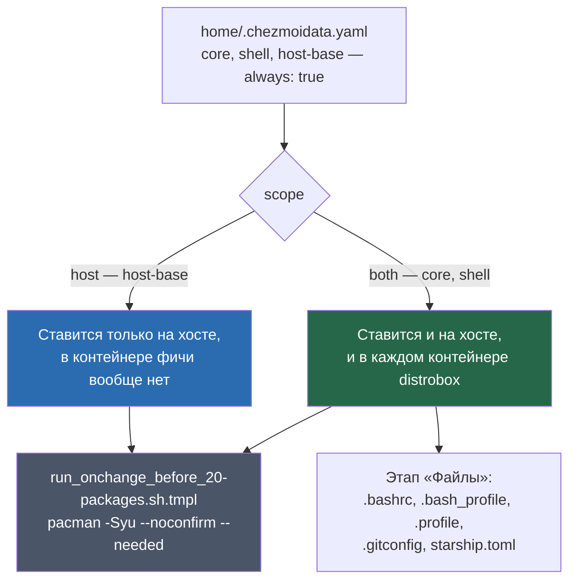
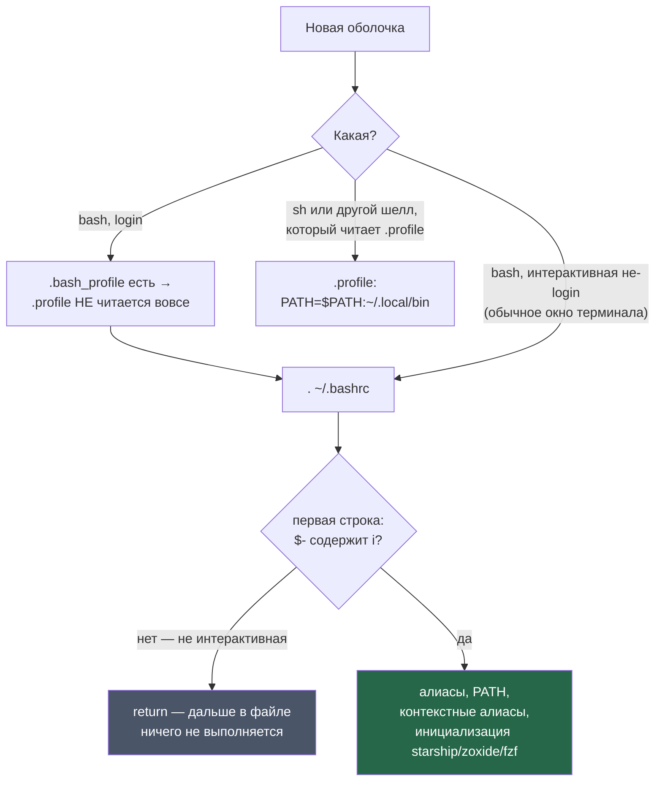

---
covers:
  features: [core, shell, host-base]
  paths:
    - home/dot_bashrc.tmpl
    - home/dot_bash_profile
    - home/dot_profile
    - home/dot_gitconfig.tmpl
    - home/dot_config/starship.toml
---

# Базис: что стоит на любой машине

## Что это даёт

После первого `chezmoi apply` на машине уже есть три вещи, о которых не
спрашивали ни разу — ни на хосте, ни в контейнере распробокса:

- обычный набор инструментов Linux: `git`, `ssh`, архиваторы, утилиты сети
  (`traceroute`, `mtr`, `tcpdump`) и диагностики диска;
- оболочка, в которой приглашение командной строки показывает ветку git и
  версию рантайма прямо в строке, `ls`/`cat`/переход по каталогам заменены
  на более удобные аналоги, а Ctrl-R и Ctrl-T в bash ищут по истории и файлам
  через нечёткий поиск;
- git уже знает твоё имя и почту и не спрашивает пароль от репозитория на
  каждый вызов подряд.

На хосте (не в контейнере) добавляется ещё то, без чего машина просто не
работала бы как рабочая станция: сеть, Bluetooth, файрвол, chezmoi как
обычный системный пакет и половина моста, по которому ссылка, открытая
внутри контейнера, долетает до браузера на хосте.

Ничего из этого нельзя снять галочкой при установке — эти три фичи
(`core`, `shell`, `host-base`) помечены в каталоге `always: true` и ставятся
безусловно, как только подошло `scope`. Что это вообще значит и как чеклист
решает судьбу фичи — в [how-it-works.md](how-it-works.md), раздел «Три
вопроса, которые решают судьбу фичи»; здесь это не повторяется.

## Как это работает

### Три фичи, три версии «безусловно»



`core` и `shell` — `scope: both`, поэтому один и тот же список пакетов уходит
и в `pacman -Syu` на хосте, и в `pacman -Syu` внутри каждого контейнера
distrobox (у контейнера свой pacman, не хостовый). `host-base` —
`scope: host`, в контейнере эта фича не видна вообще: скрипт даже не
спрашивает про неё, `scope` отсекает раньше `always`. Сам механизм трёх
полей (`scope`/`always`/`default`) и то, как определяется, хост это или
контейнер — не тема этого документа, см. how-it-works.md.

### Пакеты: три списка, а не один общий

**`core` (21 пакет)** — то, без чего командная строка вообще не годится
для работы: `git`, `openssh`, `sudo`, утилиты сети и диагностики
(`inetutils`, `mtr`, `tcpdump`, `traceroute`, `lsof`), архиваторы
(`unzip`, `zip`, `pigz`), `rsync`, `wget`, `tree`, `less`, документация
(`man-db`, `man-pages`), `diffutils`, `bc`, `time`.

У `wget` в каталоге нет своего комментария — просто ещё один загрузчик в
базовом наборе. Показательно, что рядом с ним нет `curl`: этот пакет в
`core` вообще не входит, он отдельной строкой прописан в фиче `syncthing`,
с явным объяснением почему — «`curl` is listed explicitly even though git
and pacman drag it in anyway: the configuration script talks to the daemon
over REST, and a dependency that arrives by accident is a dependency that
can leave by accident» (`home/.chezmoidata.yaml`, блок `syncthing`). Так что
`wget` и `curl` не сидят рядом в одном списке — это разные фичи с разными
резонами.

Отдельно среди них — `base-devel`: это пакет для **сборки** пакетов из
AUR, а не для повседневной работы. Он нужен именно поэтому: скрипт
`run_onchange_before_20-packages.sh.tmpl` при первой реальной необходимости
в AUR-пакете собирает `yay` из исходников через `makepkg`, и прямо перед
этим ещё раз явно зовёт `sudo pacman -S --noconfirm --needed base-devel
git` — с `--needed` это не переустановка, а защитная гарантия: `core`
(`always: true`, `scope: both`) уже должен был поставить оба пакета раньше
по общему списку, но скрипт не полагается на это молча.

**`shell` (9 пакетов)** — современная замена привычных утилит:
`starship` (приглашение), `eza` (замена `ls`), `bat` (замена `cat` с
подсветкой), `zoxide` (переход по недавним каталогам), `fzf` (нечёткий
поиск), `ripgrep`, `fd`, `btop`, `lazygit`. Из этих девяти в `.bashrc`
вообще что-то настраивают только пять: `starship`, `eza`, `bat`,
`zoxide`, `fzf` (разбор ниже). `ripgrep`, `fd`, `btop`, `lazygit` — просто
бинарники в `PATH`, без единого алиаса или переменной окружения под них:
фича обеспечивает, что они на месте, а не то, как их вызывать.

**`host-base` (12 пакетов)** — минимум, без которого хост не рабочая
станция, даже если рабочий стол ещё не поставлен: `networkmanager`,
`bluez`/`bluez-utils`, `ufw`, `wpa_supplicant`, `zram-generator`,
`smartmontools`, `xdg-utils`. Четыре пакета в списке заслуживают отдельного
слова:

- **`chezmoi`.** Комментарий рядом с пакетом в каталоге объясняет замысел:
  «chezmoi installs itself so that later updates come from pacman rather
  than the copy install.sh drops in ~/.local/bin» (`home/.chezmoidata.yaml`,
  блок `host-base`). Автор комментария не учёл, что копия в
  `~/.local/bin/chezmoi`, если она уже была создана `install.sh` при первой
  установке, никуда не девается и продолжает выигрывать у пакетной версии
  из-за порядка `PATH` в `.bashrc` (разбор ниже, раздел «PATH: три файла на
  один каталог»). Полный разбор этого расхождения между комментарием и
  реальным поведением — уже в [install.md](install.md), раздел «Что
  ставится и что меняется»; здесь это не повторяется, важно только не
  повторить неверную половину комментария как факт.
- **`nano`.** Запасной редактор на случай, если графическая сессия сломана,
  а `neovim` — отдельная опциональная фича и может быть вообще не выбрана.
  Что-то должно быть в системе в любом случае.
- **`jq`.** Комментарий в каталоге называет причину дословно: `jq` строит
  URI вида `ext+container:name=...&url=...` в `/usr/local/bin/zen-open`
  и остаётся единственным инструментом здесь, который корректно кодирует
  URL целиком — без этого адрес с собственным `&` обрывался бы на
  полуслове. Код подтверждает: `run_onchange_after_38-linkrouting.sh.tmpl`
  делает именно `enc=$(printf '%s' "$url" | jq -sRr @uri)`. Сам скрипт и
  весь маршрут ссылки — тема [isolation-links.md](isolation-links.md), не
  этого документа.
- **`socat`.** Комментарий над блоком `host-base`: «The host half of the
  browser proxy: one socat per work context, republishing that container's
  UNIX socket on a loopback port». Подтверждено кодом:
  `run_onchange_after_34-wsproxy-host.sh.tmpl` пишет юнит с
  `ExecStart=/usr/bin/socat TCP-LISTEN:<порт>,bind=127.0.0.1,fork,reuseaddr
  UNIX-CONNECT:.../socks.sock` — по одному такому `socat` на каждый рабочий
  контекст. Сам мост целиком — тема [isolation-network.md](isolation-network.md).

Отдельная связь, не в этом документе, но стоит знать: скрипт
`run_onchange_before_30-system.sh.tmpl` включает `NetworkManager.service`,
`bluetooth.service` и `ufw.service` (комментарии в самом скрипте помечают
эти три строки как `# host-base`) и настраивает `zram` — без пакетов
`host-base` эти вызовы `systemctl enable` упали бы, а `set -e` уронил бы
весь скрипт. Разбор самого `30-system` целиком — в [keyboard.md](keyboard.md),
которому принадлежит этот файл.

### PATH: три файла на один каталог



`~/.local/bin` в `PATH` нужен по двум причинам сразу: там живёт нативная
установка `claude` (`~/.local/bin/claude` из фичи `claude`) и бинарники,
которые `distrobox` экспортирует из контейнера на хост. Три файла ставят
этот путь по-разному, и разница не случайна:

- **`.bash_profile`** (`[[ -f ~/.bashrc ]] && . ~/.bashrc`) — единственная
  его роль подключить `.bashrc`. Bash для login-оболочки читает **один**
  файл из тройки `~/.bash_profile` / `~/.bash_login` / `~/.profile`, первый
  найденный, и останавливается — это поведение самого bash, не этого
  репозитория. Раз `.bash_profile` есть, `.profile` для bash-login попросту
  не читается никогда; комментарий в `.bashrc` называет это прямым текстом:
  «bash never reads ~/.profile (bash_profile shadows it), so add it here».
- **`.bashrc`** сам добавляет `~/.local/bin` в PATH строкой `export
  PATH="$HOME/.npm-global/bin:$HOME/.local/bin:$HOME/.dotnet/tools:$PATH"`
  — **в начало**, раньше системных путей. Отсюда и растёт находка
  `install.md`: если `chezmoi` когда-то стоял только в `~/.local/bin`
  (бутстрап `install.sh` на чистой машине), эта строка гарантирует, что
  команда `chezmoi` резолвится именно туда, даже когда пакетная версия уже
  стоит рядом в `/usr/bin`.
- **`.profile`** — одна строка, `export PATH="$PATH:$HOME/.local/bin"`, и
  это **не** то же самое действие: путь дописывается **в конец**, после
  системных каталогов, а не перед ними. Файл существует для входов, которые
  bash-login не задействуют вовсе — POSIX-shell и любой другой процесс,
  читающий `~/.profile` по общему соглашению. Старый `docs/features.md`
  (раздел 4, `shell`) утверждает, что `.bash_profile` и `.profile` вместе
  «подхватывают `.bashrc`» — для `.bash_profile` это верно, но `.profile` в
  коде ни разу не упоминает `.bashrc` и не читает его: это расхождение
  между старым текстом и содержимым файла, зафиксировано здесь и в
  дальнейшем не переносится.

Ещё одна деталь именно про порядок строк внутри `.bashrc`: guard `[[ $- !=
*i* ]] && return` стоит **до** строки с `export PATH`, а не после. Значит
сам PATH из `.bashrc` недоступен неинтерактивному вызову (`bash -c
"команда"` и подобному) — там управление выходит раньше, чем PATH вообще
меняется. У `.profile` такого guard нет: если его вообще прочитали, PATH
он допишет всегда.

### Один и тот же `.bashrc` — на хосте и во всех контейнерах

Файл раскладывается одинаково всюду, и написан с расчётом именно на это.
Три строки `eval` — `starship`, `zoxide`, `fzf` — обёрнуты `command -v
инструмент >/dev/null &&` перед собой, а не вызываются напрямую:

```sh
command -v starship >/dev/null && eval "$(starship init bash)"
command -v zoxide   >/dev/null && eval "$(zoxide init bash)"
command -v fzf      >/dev/null && eval "$(fzf --bash)"
```

Смысл именно в том, что окружений несколько: `shell` — `scope: both`,
значит один и тот же `.bashrc` уезжает и на хост, и в контейнер `digi3`, и
в `stellium`, и в `personal`. Если бы строка вызывала `starship init bash`
без проверки, отсутствие бинарника в любом из этих мест (например, до
первого `chezmoi apply` в свежесозданном контейнере) уронило бы всю
оболочку ошибкой `command not found` прямо в интерактивном приглашении.
`command -v` превращает отсутствие инструмента в тихий пропуск одной
строки, а не в сломанный терминал.

Блоки `eza` и `bat` чуть ниже по файлу защищены тем же принципом, только
записаны как `if command -v eza >/dev/null; then ... fi` — обычный `if`, а
не инлайновый `&&`, но исход тот же: без бинарника блок целиком
пропускается.

Ровно одна строка в этом же разделе файла не обёрнута ничем — `export
FZF_DEFAULT_OPTS="..."` в самом конце, тема Nord для `fzf`. Комментарий над
разделом (`# --- modern shell tooling ---`, «The same file is deployed into
the host and into every container... Each line is guarded with
`command -v`...») по формулировке читается как утверждение про весь
раздел, а не только про три строки `eval` сразу под ним — но именно в
конце этого раздела лежит незащищённая строка. Вреда от этого нет:
`FZF_DEFAULT_OPTS` — переменная окружения, а не вызов, и её присутствие без
`fzf` в системе ничего не роняет и ни на что не влияет. Но сама
формулировка правила — «каждая строка» — шире, чем позволяет код: одно
безобидное исключение в этом файле есть.

Тот же файл несёт ещё один блок — алиасы `<контекст>`, `<контекст>-claude`,
`<контекст>-tmux`, генерируемые из списка `contexts:` в `.chezmoidata.yaml`
— но это уже не про базис, а про переключение между рабочими контекстами и
про `herdr`/`tmux`; этот блок целиком разобран в
[multiplexer.md](multiplexer.md), которому эта часть файла принадлежит по
`covers.paths`. Здесь он только назван, чтобы не создалось впечатление,
будто `.bashrc` — исключительно про `core`/`shell`.

Ниже в файле — уже безусловно относящееся к `shell`: алиасы `eza`
(`ls`/`ll`/`la`/`lt` с иконками и группировкой каталогов первыми, если
`eza` есть), `bat` как пейджер для `man` (`MANPAGER`) и тема Nord для
`fzf` через `FZF_DEFAULT_OPTS`. Иконки `eza --icons` и глифы `starship`
рисуются только при установленном Nerd-шрифте — этот шрифт ставит фича
`desktop`, не `shell`, разбор в [desktop.md](desktop.md).

### Имя и почта для git, приглашение — как проверить

`.gitconfig` не спрашивает своё имя и почту сам: обе строки
(`{{ .git_name }}`, `{{ .git_email }}`) читают значения, которые
`home/.chezmoi.toml.tmpl` спрашивает один раз при `chezmoi init`
(`promptStringOnce`), ещё до всякого чеклиста фич — то есть до `core` и
`shell` включительно, эти два вопроса вообще не про фичи. Разбор самого
механизма `promptStringOnce` — в how-it-works.md, раздел «Три вопроса,
которые решают судьбу фичи» и абзац сразу под ним.

Оставшиеся три строки `.gitconfig` не зависят ни от какого вопроса:

- `core.autocrlf = input` — переносы строк остаются как есть при выгрузке
  на диск, но CRLF превращается в LF при коммите;
- `credential.helper = cache` — пароль/токен держится в памяти демона,
  доступного через unix-сокет, и не пишется на диск ни в каком виде;
- `credential.useHttpPath = true` — при поиске сохранённых данных git
  учитывает ещё и путь URL, а не только хост, то есть два разных
  адреса на одном хосте (например, две разные организации Azure DevOps
  под одним доменом) хранят разные учётные данные, а не одну на весь хост.

У `credential.helper = cache` есть значение по умолчанию, которое в этом
`.gitconfig` не переопределено ни разу: таймаут 900 секунд (15 минут), и
запись пропадает раньше, если сам демон-кэш погиб — например, при
перезагрузке машины. Это не обход и не находка этого репозитория, а
документированное поведение `git-credential-cache` (`man git-credential-cache`,
раздел `--timeout`, значение по умолчанию 900); практическое следствие —
git спросит пароль снова, если между двумя обращениями к одному и тому же
удалённому репозиторию прошло больше 15 минут простоя или случилась
перезагрузка.

`starship.toml` определяет вид самого приглашения: палитра — Catppuccin
Latte (`palettes.latte`), формат строки — каталог, ветка и статус git,
затем чипы версии рантайма (`dotnet`, `nodejs`, `python`, `rust`, `golang`,
`c` — показывается только тот, что относится к текущему каталогу),
заполнитель `$fill` и время выполнения последней команды при
`cmd_duration.min_time = 500`. Файл ставится без единого `{{ }}` —
обычный, не шаблонный конфиг, копируется как есть на любую машину.

## Что ставится и что меняется

| Категория | Путь / команда | Когда |
|---|---|---|
| Пакеты `core` (21) | `pacman -Syu --noconfirm --needed <список>` | `run_onchange_before_20-packages.sh.tmpl`, всегда, хост и контейнер |
| Пакеты `shell` (9) | там же | там же, хост и контейнер |
| Пакеты `host-base` (12) | там же | там же, только хост |
| `~/.bashrc` | PATH, алиасы `ls`/`grep`, plain `PS1` как запасной вариант, контекстные алиасы (см. [multiplexer.md](multiplexer.md)), инициализация `starship`/`zoxide`/`fzf`, алиасы `eza`, `bat` как `MANPAGER`, тема Nord для `fzf` | этап «Файлы» каждого `chezmoi apply`, хост и контейнер |
| `~/.bash_profile` | подключает `.bashrc` для bash login-оболочки | этап «Файлы» |
| `~/.profile` | дописывает `~/.local/bin` в конец `PATH` для входов, не проходящих через `.bash_profile` | этап «Файлы» |
| `~/.gitconfig` | `user.name`/`user.email` (из `chezmoi init`), `core.autocrlf`, `credential.helper=cache`, `credential.useHttpPath` | этап «Файлы»; имя и почта — при `chezmoi init` |
| `~/.config/starship.toml` | вид приглашения, палитра Catppuccin Latte | этап «Файлы» |
| `NetworkManager.service`, `bluetooth.service`, `ufw.service` | `systemctl enable` (без `--now`) | `run_onchange_before_30-system.sh.tmpl`, только хост — разбор в [keyboard.md](keyboard.md) |

## Как проверить

Что генератор каталога считает непокрытым — обе команды должны молчать
после этого документа:

```sh
tools/gen-catalog.sh --check | grep -E '^UNCOVERED-FEATURE\s(core|shell|host-base)$'
tools/gen-catalog.sh --check | grep -E 'dot_bashrc|dot_bash_profile|dot_profile|dot_gitconfig|starship'
```

Что реально попадёт в `.bashrc` на этой машине, без применения (в выводе
будут контекстные алиасы — они часть того же файла, но принадлежат
`multiplexer.md`):

```sh
$ chezmoi execute-template < home/dot_bashrc.tmpl | head -12
[[ $- != *i* ]] && return

alias ls='ls --color=auto'
alias grep='grep --color=auto'
PS1='[\u@\h \W]\$ '

# ~/.local/bin holds claude (native install) and distrobox-exported bins;
# bash never reads ~/.profile (bash_profile shadows it), so add it here.
export PATH="$HOME/.npm-global/bin:$HOME/.local/bin:$HOME/.dotnet/tools:$PATH"
```

Что уйдёт в `.gitconfig` — имя и почта здесь свои для каждой машины,
берутся из сохранённых ответов `chezmoi init`:

```sh
$ chezmoi execute-template < home/dot_gitconfig.tmpl
[user]
	name = ...
	email = ...
[core]
	autocrlf = input
[credential]
	helper = cache
	useHttpPath = true
```

Какая копия `chezmoi` реально выполняется (актуально, если машина видела
`install.sh` до появления пакета) — команда и разбор уже в
[install.md](install.md), раздел «Как проверить»; здесь не дублируется.

## Когда сломалось

| Симптом | Причина | Что делать |
|---|---|---|
| Приглашение — голое `[user@host dir]$`, без цветов и без ветки git | `starship` не в `PATH`: пакет ещё не поставлен (первый apply в новом контейнере до его завершения) или бинарник удалили руками | `command -v starship`; если пусто — `chezmoi apply` заново поставит пакет |
| Иконки `eza --icons` и глифы `starship` — пустые квадраты | Нет Nerd-шрифта — это пакет фичи `desktop`, не `shell` | См. [desktop.md](desktop.md) |
| Git спрашивает пароль/токен снова, хотя недавно уже вводили | `credential.helper=cache` держит его в памяти максимум 900 секунд по умолчанию, и запись пропадает, если демон-кэш перезапустился (например, после перезагрузки) | Ввести снова — это ожидаемое поведение `git-credential-cache`, не поломка |
| Алиас `<контекст>` или `<контекст>-claude` ведёт себя не так, как ожидалось, или пропал | Этот блок `.bashrc` принадлежит `herdr`/`tmux`, а не `core`/`shell` | См. [multiplexer.md](multiplexer.md) |
| Команда `claude` — «No such file or directory», хотя бинарник на месте | Обычно про `npm`-установку, не про PATH этого документа — разбор в [install.md](install.md) | Там же |
| Правка в `.bashrc`/`.gitconfig`/`starship.toml` не видна в уже открытом терминале | Эти файлы читаются один раз при старте оболочки, `chezmoi apply` не перечитывает их в уже живых сессиях | Открыть новый терминал/новую вкладку |

## Почему именно так

**Почему `core` и `shell` разделены, если оба `scope: both` и оба
`always: true`.** Разница не в том, где и когда они ставятся — она в
смысле списка. `core` — это то, без чего командная строка вообще не
рабочий инструмент (`ssh`, `git`, архиваторы); `shell` — это выбор
конкретных современных замен привычным утилитам (`eza` вместо `ls`,
`bat` вместо `cat`). Разделение на два ключа, а не один общий список,
даёт `docs/catalog.md` показать это отдельными строками и позволяет
будущей правке одного смысла не задевать шапку `covers` другого документа.

**Почему `host-base` — не часть `core`.** Всё в `host-base` — про то, что
делает хост хостом: сетевой стек, Bluetooth, файрвол, half моста для
браузера. В контейнере ничего из этого не имеет смысла в принципе (у
контейнера нет своего Bluetooth, а сеть — это отдельная фича
`container-base`), поэтому `scope: host` — не техническое ограничение
задним числом, а прямое отражение того, что эти пакеты физически не нужны
там, где нет `scope: host`.

**Почему PATH выставляется трижды (`.bashrc` в начало, `.profile` в
конец), а не один раз в одном месте.** Потому что нет одного места,
которое гарантированно читают все возможные входы в оболочку: bash
login-сессия читает только один файл из `.bash_profile`/`.profile`, а
неinteractive-вызовы `.bashrc` вообще не доходят до строки с PATH из-за
guard в начале файла. Три файла — это не задвоенность, а покрытие трёх
разных путей входа, у каждого из которых свои правила о том, что он
вообще прочитает.

## Ссылки

- [how-it-works.md](how-it-works.md) — сам механизм `always`/`scope`,
  вопросы `git_name`/`git_email` при `chezmoi init` вне чеклиста фич.
- [install.md](install.md) — почему бутстрап-копия `chezmoi` в
  `~/.local/bin` выигрывает у пакетной версии из-за порядка `PATH`; полный
  разбор расхождения с комментарием фичи `host-base`.
- [multiplexer.md](multiplexer.md) — контекстные алиасы в том же
  `.bashrc`, `herdr` и `tmux`.
- [keyboard.md](keyboard.md) — `run_onchange_before_30-system.sh.tmpl`
  целиком, включая три `systemctl enable`, помеченные `host-base`.
- [isolation-links.md](isolation-links.md) — `zen-open` и кодирование URL
  через `jq`.
- [isolation-network.md](isolation-network.md) — мост `socat`, хостовая
  половина которого — пакет из `host-base`.
- [desktop.md](desktop.md) — Nerd-шрифт, от которого зависят иконки `eza`
  и глифы `starship`.
- `man git-credential-cache` — таймаут credential-кэша по умолчанию (900
  секунд) и что происходит с записью при смерти демона.
- GNU Bash Reference Manual, раздел «Bash Startup Files» — какой файл из
  `.bash_profile`/`.bash_login`/`.profile` читает login-оболочка bash и
  почему только один из них.
