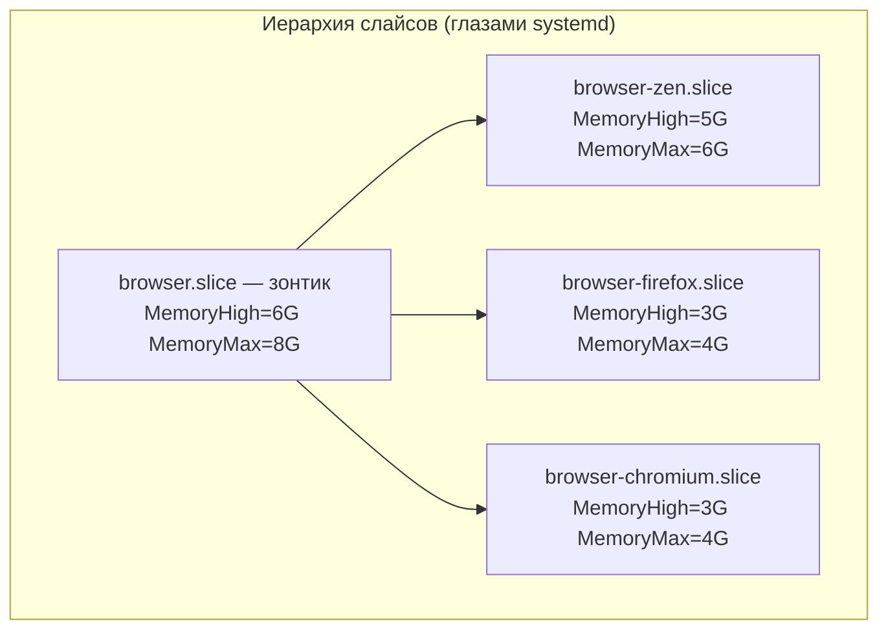
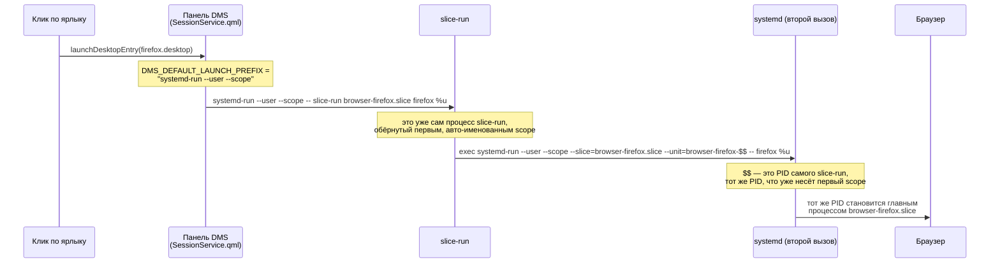

---
covers:
  features: [browsers]
  paths:
    - home/dot_config/systemd/user/browser.slice
    - home/dot_config/systemd/user/browser-chromium.slice
    - home/dot_config/systemd/user/browser-firefox.slice
    - home/dot_config/systemd/user/browser-zen.slice
    - home/dot_local/bin/executable_slice-run
    - home/dot_local/share/applications/firefox.desktop.tmpl
    - home/dot_local/share/applications/chromium.desktop.tmpl
    - home/.chezmoiscripts/run_onchange_after_33-browser-slices.sh.tmpl
---

# Браузеры: потолки памяти через systemd-слайсы

Три браузера стоят на этой машине: [Zen](isolation-browser.md) несёт весь
стек изоляции рабочих контекстов, Firefox и Chromium — обычные браузеры без
контейнеров и прокси, для всего, что не требует разделения по работе. Этот
документ — не про то, зачем нужен именно Zen (это тема
[isolation-browser.md](isolation-browser.md)), а про то, что общее у всех
трёх: сколько памяти каждому положено и как это ограничение технически
устроено через [systemd slice](glossary.md#systemd-slice).

## Что это даёт

Браузер с достаточным числом вкладок способен съесть всю память машины —
вкладок открывается больше, чем закрывается, и рано или поздно система
начинает тормозить целиком, а не только браузер. Здесь у каждого браузера
есть потолок: превысил — сначала браузер сам начинает притормаживать и
разгружать неактивные вкладки, а если это не помогло — ядро убивает что-то
внутри самого браузера, а не первый попавшийся процесс на машине.

Потолки заданы в два слоя: у каждого браузера свой личный, и один общий —
на всех разом, независимо от того, сколько браузеров сейчас открыто. Личный
потолок Zen — самый большой, потому что это единственный процесс, что несёт
все рабочие контексты сразу ([isolation-browser.md](isolation-browser.md)); но
общий потолок ниже, чем сумма личных, — если разом открыты все три браузера,
общий предел сработает раньше, чем каждый успеет упереться в свой.

Всё это ставится и настраивается само: ярлыки запуска в меню приложений уже
показывают браузер, который сам держит себя в потолке, без единого лишнего
клика.

## Как это работает



Дефис в имени — не просто соглашение об именовании, а то, чем сам systemd
определяет вложенность: `foo-bar.slice` считается лежащим внутри `foo.slice`
без единой дополнительной строчки конфига (`man systemd.slice`, раздел про
имена слайсов — «The name consists of a dash-separated series of names, which
describes the path to the slice from the root slice»). Ни один из четырёх
файлов `.slice` в этом репозитории не содержит ключа `Slice=` — вложенность
целиком на совести имени файла. Подтверждено на этой машине, 2026-07-31, без
единой строчки `Slice=` в файлах:

```sh
systemctl --user show browser-zen.slice -p Slice
systemctl --user show browser-firefox.slice -p Slice
systemctl --user show browser-chromium.slice -p Slice
```
```
Slice=browser.slice
Slice=browser.slice
Slice=browser.slice
```

`MemoryHigh` и `MemoryMax` — два разных по смыслу порога
(`man systemd.resource-control`): `MemoryHigh` — «throttling limit»: память
отбирается агрессивно, а процессы «heavily slowed down», но временный
всплеск выше порога допустим, если иначе никак. `MemoryMax` — «absolute
limit»: если использование не удаётся удержать под потолком, «out-of-memory
killer is invoked inside the unit» — убийство происходит внутри слайса,
остальная система (и другие слайсы) об этом не узнаёт. У зонтика `MemoryMax`
ниже суммы `MemoryMax` детей (8G против 6+4+4=14G) — так и задумано: если
открыты сразу все три браузера, первым сработает именно общий потолок, а не
сумма личных.

### Второй слой: как команда запуска браузера доходит до правильного слайса

Ярлыки `firefox.desktop`, `chromium.desktop` в `~/.local/share/applications/`
перекрывают одноимённые файлы из `/usr/share/applications/` (то же имя файла
побеждает в `~/.local`) и меняют одну вещь — строку `Exec`:

```
Exec={{ .chezmoi.homeDir }}/.local/bin/slice-run browser-firefox.slice /usr/lib/firefox/firefox %u
```

Казалось бы, `.desktop`-файл мог бы вызывать `systemd-run --user --scope
--slice=browser-firefox.slice -- /usr/lib/firefox/firefox %u` напрямую, без
отдельного скрипта. Флаг `--scope` заводит вокруг команды
[systemd scope](glossary.md#systemd-scope) — учётную обёртку над уже живым
процессом. Не выходит — панель рабочего стола, из которой реально
происходит клик, уже сама оборачивает `Exec` в `systemd-run --user --scope`
раньше, чем эта строка вообще начинает выполняться:



Механизм подтверждён по коду с обеих сторон.

**Со стороны DMS** (`AvengeMedia/DankMaterialShell`, на этой машине пакет
`dms-shell` версии 1.5.3-1): функция `launchDesktopEntry` в
`/usr/share/quickshell/dms/Services/SessionService.qml` берёт префикс запуска
из настройки `launchPrefix`, а если она пуста — из переменной окружения:

```js
const userPrefix = SettingsData.launchPrefix?.trim() || "";
const defaultPrefix = Quickshell.env("DMS_DEFAULT_LAUNCH_PREFIX") || "";
const prefix = userPrefix.length > 0 ? userPrefix : defaultPrefix;
...
if (prefix.length > 0)
    cmd = prefix.split(" ").concat(cmd);
Quickshell.execDetached({ command: cmd, ... });
```

Этот же код построчно совпадает с исходником на GitHub
(`AvengeMedia/DankMaterialShell`, `quickshell/Services/SessionService.qml`,
проверено 2026-07-31 запросом файла с ветки `master`). Само значение
`DMS_DEFAULT_LAUNCH_PREFIX=systemd-run --user --scope` не приходит из
`dms.service` (юнит `/usr/lib/systemd/user/dms.service`, `ExecStart=/usr/bin/dms
run --session`, без единой строки `Environment=`) — оно зашито буквальной
строкой прямо в бинарник `/usr/bin/dms` (найдено `strings /usr/bin/dms 2>&1 |
grep DMS_DEFAULT_LAUNCH_PREFIX`, вывод — `DMS_DEFAULT_LAUNCH_PREFIX=systemd-run
--user --scope`), то есть сама CLI-часть DMS (Go-бинарник `dms`, тот же
репозиторий, каталог `core/cmd/dms/`) выставляет её сама при запуске
`quickshell`, ещё до того, как QML-код выше её прочитает. Найти точную строку
Go-кода, которая делает это присваивание, за разумное время поиска по
открытым исходникам не удалось — но потребляющий код (QML) и итоговое
поведение подтверждены и на этой машине, и по свежему исходнику GitHub, а
буквальная строка внутри бинарника — прямое доказательство того, что значение
существует и совпадает с тем, что в комментарии `slice-run`.

**Со стороны `slice-run`** (`home/dot_local/bin/executable_slice-run`) — сам
файл, целиком:

```sh
#!/bin/sh
set -eu

slice=$1
shift

exec systemd-run --user --scope \
	--slice="$slice" \
	--unit="${slice%.slice}-$$" \
	--collect -q -- "$@"
```

`exec` заменяет образ процесса самого `slice-run` вторым `systemd-run`, не
порождая новый PID — то есть второй вызов регистрирует новый scope-юнит для
**того же самого** PID, который уже несёт первый, авто-именованный scope от
DMS. Без явного `--unit` второй вызов сам вывел бы имя автоматически по тому
же правилу, что и первый (`run-p<PID>-i<invocation>.scope`, где PID —
буквально тот же), и получил бы отказ «Unit ... was already loaded» — юнит с
таким именем для этого PID уже зарегистрирован первым вызовом. `--unit`
задаёт имя не из PID, а из строки `<слайс без .slice>-<PID>` — оно другое, и
столкновения не происходит.

**Живое подтверждение на этой машине, 2026-07-31, только чтение, без единого
запуска `systemd-run`.** Схема наблюдалась на уже открытом Zen: явно названный
scope реально существует и несёт настоящие процессы браузера:

```sh
systemctl --user list-units 'browser-*.scope' --all
```
```
UNIT                     LOAD   ACTIVE SUB     DESCRIPTION
browser-zen-144496.scope loaded active running [systemd-run] /usr/bin/zen-browser
```

```sh
systemctl --user show browser-zen-144496.scope -p Slice -p MainPID
```
```
Slice=browser-zen.slice
MainPID=144496
```

А рядом на той же машине — процесс, запущенный **без** `slice-run`
(Telegram, у которого нет своего `.desktop` со слайсом), несёт ровно то самое
автоматическое имя, которого `slice-run` избегает:

```sh
systemctl --user list-units 'run-*.scope' --all
```
```
UNIT                    LOAD   ACTIVE SUB     DESCRIPTION
run-p12195-i33600.scope loaded active running [systemd-run] /usr/bin/Telegram --
```

```sh
systemctl --user show run-p12195-i33600.scope -p MainPID
ps -p 12195 -o pid,cmd
```
```
MainPID=12195
    PID CMD
  12195 /usr/bin/Telegram --
```

`MainPID` совпадает с числом в имени юнита (`run-p12195-...`) — это и есть
формат автоматического имени, при котором второй такой же вызов для того же
PID неизбежно просит то же самое имя и получает отказ. Официальная
документация `systemd-run` называет только назначение флага: «Use this unit
name instead of an automatically generated one» (`man systemd-run`, описание
`--unit=`) — то, какое именно имя получается автоматически, в самом
man-описании не расписано; сам формат виден только по факту, как в примере
выше.

### Скрипт 33: перечитать слайсы после правки

Файлы `.slice` — не шаблоны с переменными, а обычные INI-файлы; chezmoi
раскладывает их сам, без отдельного скрипта. Скрипт 33
(`run_onchange_after_33-browser-slices.sh.tmpl`) решает другую задачу:
`systemd` не замечает изменившийся файл юнита сам по себе, пока кто-то не
скажет `systemctl --user daemon-reload`. Скрипт делает ровно это — и ничего
больше:

```sh
systemctl --user daemon-reload
```

Он `run_onchange`, а re-run должен случиться именно тогда, когда изменился
один из четырёх файлов `.slice`, а не когда изменился сам скрипт (текст
скрипта иначе никогда не меняется). chezmoi считает скрипт изменившимся,
когда меняется **текст самого скрипта** после подстановки шаблона
([`run_onchange`](glossary.md#run_onchange)) — поэтому скрипt вставляет в
свой же текст, комментарием, хеш каждого из четырёх файлов слайсов:

```
# browser.slice: {{ include "dot_config/systemd/user/browser.slice" | sha256sum }}
# browser-firefox.slice: {{ include "dot_config/systemd/user/browser-firefox.slice" | sha256sum }}
# browser-chromium.slice: {{ include "dot_config/systemd/user/browser-chromium.slice" | sha256sum }}
# browser-zen.slice: {{ include "dot_config/systemd/user/browser-zen.slice" | sha256sum }}
```

Поменялся байт в любом из четырёх файлов — поменялся хеш в этом комментарии —
поменялся текст скрипта целиком, с точки зрения chezmoi, хотя реальная логика
скрипта (`daemon-reload`) не изменилась ни на символ. Только так правка числа
в `MemoryMax` вообще доходит до `daemon-reload`.

Скрипт запускается, только если включена хотя бы одна из фич `browsers` или
`zen`:

```
{{- if or (has "browsers" .enabled) (has "zen" .enabled) }}
```

## Что ставится и что меняется

| Категория | Путь | Где | Кто создаёт |
|---|---|---|---|
| Слайс-зонтик | `~/.config/systemd/user/browser.slice` | Хост | фича `browsers` или `zen` |
| Слайс Firefox | `~/.config/systemd/user/browser-firefox.slice` | Хост | фича `browsers` |
| Слайс Chromium | `~/.config/systemd/user/browser-chromium.slice` | Хост | фича `browsers` |
| Слайс Zen | `~/.config/systemd/user/browser-zen.slice` | Хост | фича `zen` (тема [isolation-browser.md](isolation-browser.md)) |
| Обёртка запуска | `~/.local/bin/slice-run` (mode 755) | Хост | фича `browsers` или `zen` |
| Ярлык Firefox | `~/.local/share/applications/firefox.desktop` — перекрывает `/usr/share/applications/firefox.desktop` | Хост, в доме | шаблон `firefox.desktop.tmpl`, фича `browsers` |
| Ярлык Chromium | `~/.local/share/applications/chromium.desktop` — перекрывает `/usr/share/applications/chromium.desktop` | Хост, в доме | шаблон `chromium.desktop.tmpl`, фича `browsers` |
| Пакеты | `chromium`, `firefox` (pacman) | Хост | фича `browsers`, `default: true` |
| Пересчитать юниты | `systemctl --user daemon-reload` | — | скрипт 33, при изменении текста (значит и хеша) любого из четырёх `.slice` |

Ярлык Zen (`zen.desktop.tmpl`) собирает те же две вещи — `slice-run
browser-zen.slice ...` вместо голого запуска — но сам файл принадлежит
[isolation-browser.md](isolation-browser.md), а не этому документу, потому
что несёт ещё и вторую, не связанную с памятью правку (`MimeType` без
`x-scheme-handler`).

## Как проверить

Числа слайсов реально применились (снято на этой машине 2026-07-31, живой Zen
уже открыт):

```sh
systemctl --user show browser.slice -p MemoryHigh -p MemoryMax
systemctl --user show browser-zen.slice -p MemoryHigh -p MemoryMax
systemctl --user show browser-firefox.slice -p MemoryHigh -p MemoryMax
systemctl --user show browser-chromium.slice -p MemoryHigh -p MemoryMax
```
```
MemoryHigh=6442450944
MemoryMax=8589934592
MemoryHigh=5368709120
MemoryMax=6442450944
MemoryHigh=3221225472
MemoryMax=4294967296
MemoryHigh=3221225472
MemoryMax=4294967296
```

То же самое, но прямо из файловой системы cgroup, в обход `systemctl` —
числа совпадают побайтово (тот же замер):

```sh
CG=/sys/fs/cgroup/user.slice/user-$(id -u).slice/user@$(id -u).service/browser.slice/browser-zen.slice
cat "$CG/memory.high" "$CG/memory.max" "$CG/memory.current"
```
```
5368709120
6442450944
4841762816
```

Вложенность видна деревом cgroup — все процессы уже открытого Zen нашлись
под `browser.slice/browser-zen.slice`, а не где-то ещё (тот же замер,
вывод обрезан):

```sh
systemd-cgls --user
```
```
├─browser.slice
│ └─browser-zen.slice
│   └─browser-zen-144496.scope
│     ├─ 144496 /opt/zen-browser-bin/zen-bin
│     ├─ 144613 /opt/zen-browser-bin/zen-bin -contentproc ...
│     └─ ... (остальные content-процессы Zen)
```

Ярлыки реально указывают на `slice-run`, а не на голый бинарник:

```sh
grep Exec ~/.local/share/applications/firefox.desktop
```
```
Exec=/home/stsiapan/.local/bin/slice-run browser-firefox.slice /usr/lib/firefox/firefox %u
```

## Когда сломалось

| Симптом | Причина | Что делать |
|---|---|---|
| Правка `MemoryMax`/`MemoryHigh` в `.slice`-файле не действует на уже открытый браузер | `daemon-reload` меняет конфиг юнита, но не трогает уже запущенный scope браузера — новый потолок подхватится только новым запуском | `systemctl --user daemon-reload` (или дождаться `chezmoi apply`, скрипт 33 делает то же самое), затем перезапустить сам браузер |
| Клик по ярлыку браузера падает с «Unit ... was already loaded» в логе панели | `slice-run` не вызван вовсе (кто-то вручную вписал в `Exec` голый `systemd-run --scope`) — тогда авто-имя второго вызова совпадает с первым, который уже поставила панель DMS | Сверить `Exec` в `.desktop` файле: там должен быть `slice-run <slice> <бинарник>`, а не сырой `systemd-run` |
| Браузер не влезает в свой слайс, хотя `.desktop` использует `slice-run` | Браузер запущен не из ярлыка (например, из терминала, из PWA-ярлыка самого браузера, или другим лаунчером), а значит `Exec` этого документа вообще не участвовал | `systemctl --user status <PID>` или `systemd-cgls --user`, посмотреть, в каком слайсе реально оказался процесс; для запуска из терминала — вызвать сам `slice-run <slice> <бинарник>` руками |
| Один браузер регулярно убивается OOM-killer'ом ядра, пока в системе полно свободной памяти | `MemoryMax` личного слайса браузера меньше, чем ему реально нужно | Поднять число в нужном `.slice`-файле, `chezmoi apply`, перезапустить браузер; проверить, не упирается ли в это же время общий `browser.slice` |
| Три браузера разом ощутимо тормозят, хотя у каждого личный потолок не превышен | Сработал общий `browser.slice` — сумма личных `MemoryMax` (6+4+4=14G) больше зонтичного (8G) специально | `systemctl --user show browser.slice -p MemoryCurrent` — если число близко к `MemoryMax` зонтика, дело не в отдельном браузере, а в их сумме |

## Почему именно так

**Зонтик меньше суммы личных потолков — не ошибка, а весь смысл
конструкции.** Если бы `browser.slice` разрешал сумму (14G), три одновременно
открытых тяжёлых браузера тратили бы память до тех пор, пока не упёрлись бы
в физический потолок машины, а не в заранее выбранное число. Зонтик держит
общий расход браузеров под контролем независимо от того, сколько их открыто
и в каком сочетании.

**Explicit `--unit`, а не переименование самого DMS или отказ от системной
панели.** Панель DMS оборачивает `Exec` в `systemd-run --user --scope`
сама, и это её собственное, полезное поведение — оно даёт каждому
запущенному из панели приложению отдельный scope, переживающий выход из
композитора. Отключать это ради одного `.desktop`-файла значило бы терять
это свойство для всех остальных приложений. `slice-run` решает проблему
локально — вторым вызовом с явным именем — не трогая ничего в самой панели.

**Почему нельзя просто прописать `--slice=` в первом, авто-названном
вызове DMS.** Панель сама решает, какой префикс подставить перед `Exec`, и
делать это конфигурируемым на уровне одного приложения (а не глобально для
всех запусков панели) её код не позволяет — читать `Exec` и добавлять к нему
`--slice=` для конкретного бинарника пришлось бы либо в самой панели, либо
после неё; `slice-run` — второй вариант, без правки чужого кода.

## Ссылки

- [isolation-browser.md](isolation-browser.md) — почему Zen несёт все три
  рабочих контекста разом и получает самый большой личный потолок,
  `zen.desktop` и его вторая, не связанная с памятью правка.
- [glossary.md](glossary.md) — термин [systemd slice](glossary.md#systemd-slice)
  и [`run_onchange`](glossary.md#run_onchange).
- `man.archlinux.org/man/systemd.slice.5` — формат имени слайса и то, что
  дефис в имени задаёт вложенность без ключа `Slice=`.
- `man.archlinux.org/man/systemd.resource-control.5` — точные определения
  `MemoryHigh=` (throttling limit) и `MemoryMax=` (absolute limit, OOM
  killer внутри юнита).
- `man.archlinux.org/man/systemd-run.1` — описание флага `--unit=`: «Use
  this unit name instead of an automatically generated one».
- `github.com/AvengeMedia/DankMaterialShell`, файл
  `quickshell/Services/SessionService.qml`, функция `launchDesktopEntry` —
  чтение `DMS_DEFAULT_LAUNCH_PREFIX` и сборка команды запуска; проверено
  запросом файла с ветки `master` 2026-07-31, совпадает построчно с копией
  на этой машине (`/usr/share/quickshell/dms/Services/SessionService.qml`).
- [workarounds.md](workarounds.md) — запись про столкновение двух
  автоматически именуемых scope-юнитов для одного PID.
