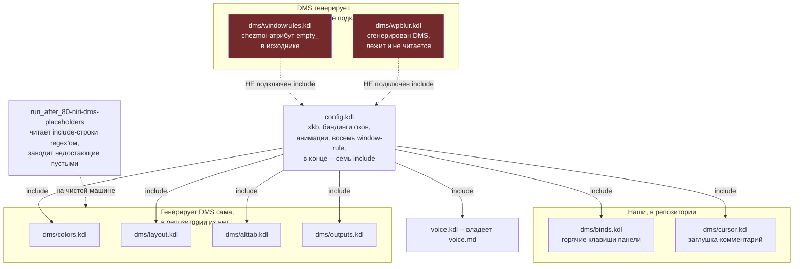

---
covers:
  features: [desktop, wallpapers]
  paths:
    - home/dot_config/niri/config.kdl
    - home/dot_config/niri/dms/**
    - home/dot_config/DankMaterialShell/settings.json
    - home/.chezmoiscripts/run_after_80-niri-dms-placeholders.sh.tmpl
    - home/Pictures/wallpapers/**
---

# Рабочий стол: niri и DankMaterialShell

Этот документ — про рабочую сессию: что рисуется на экране и как себя ведёт
после входа в систему. Три соседних документа берут отсюда одну деталь и
разбирают её отдельно, чтобы не дублировать: [keyboard.md](keyboard.md) —
раскладку клавиатуры (блок `xkb` внутри `config.kdl` описан здесь, но сама
тема раскладки — там), [greeter.md](greeter.md) — экран входа, который рисует
та же оболочка DMS и читает те же файлы темы, и [browsers.md](browsers.md) —
то, как панель DMS оборачивает запуск любой программы (не только браузеров)
в `systemd-run --user --scope`.

## Что это даёт

Рабочий стол здесь — не единый пакет вроде GNOME или KDE, а связка двух
программ.

Первая — **niri**. Она решает, как окна располагаются на экране: не одно
поверх другого, а рядом друг с другом на бесконечной горизонтальной ленте, и
переключение между ними — прокрутка влево-вправо, а не поиск нужного окна в
стопке свёрнутых. Сама по себе niri не рисует ни одной кнопки, ни часов, ни
индикатора батареи — голый оконный менеджер и ничего больше.

Вторая — **DankMaterialShell**, везде дальше DMS. Она рисует всё остальное:
панель вверху экрана, лаунчер программ (`Mod+Space`), список открытых окон,
часы, батарею, центр уведомлений, экран блокировки, меню выключения. DMS —
не часть niri, а отдельная программа, которая с ней разговаривает: слушает
события композитора (так называют программу, которая рисует и двигает окна
на экране, в данном случае — саму niri) и настраивает её конфиг под
текущую тему.

Обои — третья, самостоятельная часть, технически почти не связанная с
первыми двумя: репозиторий просто кладёт три готовые фотографии в
`~/Pictures/wallpapers/`, чтобы было из чего выбрать. Какая из трёх стоит
фоном прямо сейчас — выбор пользователя (`Mod+Y`, «Browse Wallpapers» в
панели DMS), и репозиторий этот выбор не хранит и не навязывает.

Фича `desktop` в чеклисте `chezmoi init` вопроса не задаёт вообще — она
`always: true` в `home/.chezmoidata.yaml` (`- key: desktop`), потому что без
неё на голой машине не во что было бы войти после установки (устройство
чеклиста — [how-it-works.md, раздел «Три вопроса, которые решают судьбу
фичи»](how-it-works.md#три-вопроса-которые-решают-судьбу-фичи)). Фича
`wallpapers`, наоборот, обычная фича с галочкой по умолчанию (`default:
true`) — её единственная работа - пропустить эти три картинки на машине, где
они не нужны, не теряя сам рабочий стол.

## Как это работает

`config.kdl` — конфиг, который читает niri при старте. Формат — KDL
(вложенные блоки без запятых, ближе к JSON, чем к YAML; описание формата — по
ссылке `kdl.dev` в первой же строке самого файла). Это не голый шаблон, а
рабочий файл с настоящими настройками: раскладка клавиатуры (`xkb`, подробно
— [keyboard.md](keyboard.md)), горячие клавиши управления окнами (`Alt+Tab` и
подобное, отдельно от клавиш панели), анимации, тени, восемь блоков
`window-rule` под конкретные программы (WezTerm, приложения GNOME, всплывающие
уведомления Steam, диалоги плавающими окнами) — и, в самом конце, семь строк
`include` на отдельные файлы. Восемь `window-rule` и семь `include` — разные
числа не по ошибке: проверено `grep -c '^window-rule' home/dot_config/niri/config.kdl`
→ `8`, и живой `dms config windowrules list` нумерует их как `rule_0`…`rule_7`.



### Что подключено, а что прошито в самом config.kdl

Шесть из семи `include` смотрят в каталог `dms/`, седьмой — на `voice.kdl`
([voice.md](voice.md), включается безусловно: этот файл — валидный, пусть и
пустой, KDL-документ даже когда фича `voice` выключена). Из шести файлов
`dms/`:

- **`binds.kdl`, `cursor.kdl`** — в репозитории, committed. Это подтверждает
  и живая проверка DMS: `dms config windowrules list` (см. ниже) сама
  показывает семь включений (`"totalIncludes":7`) — ровно столько строк
  `include` и есть в `config.kdl`.
- **`colors.kdl`, `layout.kdl`, `alttab.kdl`, `outputs.kdl`** — генерирует
  сама DMS при каждой смене темы или монитора (в реальном файле — шапка
  `! AUTO-GENERATED BY DMS !`, подтверждено чтением
  `/usr/share/quickshell/dms/Services/NiriService.qml`: функции
  `generateNiriLayoutConfig`, строки записи в `outputsPath` рядом с
  `"niri-write-outputs"`). Их нет в репозитории и не должно быть: держать их
  под chezmoi значило бы переписывать обратно на старое содержимое каждую
  смену обоев.

DMS умеет генерировать в этом же каталоге ещё и пятый файл, `wpblur.kdl` —
но его `config.kdl` не подключает вовсе ни одним `include`. Он разобран не
здесь, а в разделе «Осиротевшие файлы» ниже, вместе со вторым файлом с той же
судьбой, `windowrules.kdl`.

### Скрипт 80: список включаемых файлов не захардкожен

На чистой машине четырёх генерируемых файлов ещё нет: DMS их создаёт только
после первого своего запуска. А `include` в niri без специальной пометки
требует существования файла — без неё разбор конфига падает целиком, и niri
откатывается на свой конфиг по умолчанию. Проверено напрямую на этой машине,
2026-07-31: скопировав `config.kdl` во временный каталог без единого файла
`dms/*.kdl`,

```
$ niri validate -c config.kdl
Error:   × error loading config
  ├─▶ error parsing
  ╰─▶ error parsing KDL
Error:   × failed to read included config from ".../dms/colors.kdl":
  │ No such file or directory (os error 2)
...
```

`run_after_80-niri-dms-placeholders.sh.tmpl` решает это, создавая недостающие
файлы пустыми — пустой KDL-документ валиден сам по себе, что подтверждает та
же команда после того, как все семь файлов (`voice.kdl` и шесть `dms/*.kdl`)
на месте, пусть и пустые:

```
$ niri validate -c config.kdl
INFO niri: config is valid
```

Список файлов при этом не хранится в самом скрипте — он вычитывается прямо
из `config.kdl` регуляркой:

```sh
grep -oP '^\s*include\s+"\K[^"]+' "$CONFIG"
```

По частям: `^\s*` — необязательные пробелы в начале строки; `include\s+"` —
буквальное слово `include`, пробел, открывающая кавычка; `\K` сбрасывает
начало найденного совпадения на этом месте, так что дальше в результат идёт
только `[^"]+` — всё до следующей кавычки. Строка должна начинаться с
`include` (после пробелов) — комментарий вида `// Include dms files` эту
регулярку не заденет, в нём после `Include` нет открывающей кавычки на том же
месте.

Что список не захардкожен — проверено экспериментально 2026-07-31: скопировав
тело скрипта и `config.kdl` с одной дописанной строкой
`include "dms/новый-файл.kdl"`, которую скрипт никогда раньше не видел,
вызов создал `dms/новый-файл.kdl` пустым файлом наравне с остальными шестью
— без единой правки самого скрипта.

### Обход, у которого, возможно, уже нет причины

Комментарий в скрипте объясняет создание пустых файлов тем, что «niri has no
conditional include». Это было верно, но не сегодня. Документация upstream
(`niri-wm/niri`, wiki «Configuration: Include») называет синтаксис
`include optional=true "file.kdl"` доступным «Since 26.04» — версия niri, при
отсутствии файла даёт не ошибку разбора, а одну строку `WARN` в лог. На этой
машине, 2026-07-31, установлена именно эта версия:

```
$ niri --version
niri 26.04 (8ed0da4)
```

Проверено напрямую: тот же временный `config.kdl` без единого файла `dms/`,
но со строкой `include optional=true "dms/colors.kdl"` вместо голого
`include`, проходит `niri validate` с одним предупреждением и без ошибки:

```
$ niri validate -c config.kdl
WARN niri_config: optional include not found: ".../dms/colors.kdl"
INFO niri: config is valid
```

При этом `config.kdl` в репозитории `optional=true` не использует нигде
(`grep -c 'optional=true' home/dot_config/niri/config.kdl` → `0`) — то есть
обход по-прежнему в деле, хотя причина, по которой он появился, для этой
версии niri уже не действует. Запись — в [workarounds.md](workarounds.md).

### Осиротевшие файлы: DMS генерирует, config.kdl не подключает

Два файла в `dms/` существуют (или могут существовать) физически, но ни один
`include` в `config.kdl` на них не смотрит. Общий признак у обоих один:
`grep -n 'windowrules\|wpblur' home/dot_config/niri/config.kdl` в репозитории
— пусто.

**`dms/windowrules.kdl`.** В репозитории лежит `dms/empty_windowrules.kdl` —
пуст (0 байт) не случайно: имя несёт [атрибут chezmoi](glossary.md#шаблон-chezmoi)
`empty_` — «Ensure the file exists, even if is empty» (без него chezmoi «by
default... removes» пустые файлы, `chezmoi.io/reference/source-state-attributes`).
Проверено `chezmoi target-path` на этом файле: цель на диске —
`~/.config/niri/dms/windowrules.kdl`, без `empty_` в имени. Этот файл
существует ровно затем, чтобы DMS не считала его отсутствующим: DMS сама умеет
писать в него настоящие правила окон через раздел настроек «Window Rules»
(`dms config windowrules add/update`, читается
`/usr/share/quickshell/dms/Modals/WindowRuleModal.qml`). Но **`config.kdl` не
подключает `dms/windowrules.kdl` ни одним `include`** — и сама же DMS об этом
знает и сообщает. Проверено на этой машине, 2026-07-31, командой
`dms config windowrules list` (только чтение):

```json
"dmsStatus":{"exists":true,"included":false,"includePosition":-1,
"totalIncludes":7,"rulesAfterDms":0,"effective":false,"overriddenBy":0,
"statusMessage":"dms/windowrules.kdl is not included in config.kdl"}
```

Значит любое правило окна, заведённое через настройки DMS, а не вписанное
руками в сам `config.kdl`, на этой машине не действует. Все восемь
`window-rule`, которые реально работают (WezTerm, приложения GNOME,
плавающие диалоги и так далее), прописаны прямо в `config.kdl`, а не через
раздел настроек DMS.

**`dms/wpblur.kdl`.** Та же болезнь, второй экземпляр. Генерирует его функция
`generateNiriBlurrule` (`/usr/share/quickshell/dms/Services/NiriService.qml`,
строки 1273–1279): копирует бандловый шаблон `niri-wpblur.kdl` в
`dms/wpblur.kdl`, когда в настройках DMS включают размытие обоев. Содержимое —
блок `layer-rule` под своим служебным
namespace:

```
// ! DO NOT EDIT !
// ! AUTO-GENERATED BY DMS !
// ! CHANGES WILL BE OVERWRITTEN !
// ! PLACE YOUR CUSTOM CONFIGURATION ELSEWHERE !

layer-rule {
    match namespace="dms:blurwallpaper"
    place-within-backdrop true
}
```

На этой машине файл лежит на месте: `~/.config/niri/dms/wpblur.kdl`, 219 байт,
содержимое ровно как выше. То есть DMS его уже создала. И тем не менее
**`config.kdl` не подключает `dms/wpblur.kdl` ни одним `include`** — а значит,
размытие обоев, включённое через интерфейс DMS, физически не может
подействовать. Файл написан и лежит, читать его никто не приходит.

Итого DMS умеет писать в каталог `dms/` не четыре файла, а пять: `colors.kdl`,
`layout.kdl`, `alttab.kdl`, `outputs.kdl` подключены и работают,
`wpblur.kdl` — нет. Плюс `windowrules.kdl`, который в репозитории заведён
пустым самим chezmoi и может получить настоящее содержимое от DMS — тоже не
подключён. Это расхождение со старым текстом в двух местах: `README.md` и
`docs/features.md` называли `empty_windowrules.kdl` файлом «правил окон» без
единого слова о том, что он не подключён; а `README.md`, в отличие от более
ранней версии этого документа, всё-таки называл `wpblur.kdl` в числе файлов,
которые генерирует DMS (раздел «niri and DankMaterialShell files») — этот
пробел теперь закрыт.

### Курсор — не такое надёжное «наше», как выглядит

`README.md` и `docs/features.md` относят `dms/cursor.kdl` к «нашим» файлам —
наравне с `binds.kdl`, в отличие от подключённых файлов, которые генерирует
DMS (`colors.kdl`, `layout.kdl`, `alttab.kdl`, `outputs.kdl`). Для `binds.kdl` это
верно без оговорок: в `/usr/share/quickshell/dms/Services/NiriService.qml`
нет ни одной функции, которая писала бы в него содержимое (только общий
цикл «создать пустым, если совсем нет файла» — тот же, что использует и
скрипт 80). Для `cursor.kdl` — не совсем. В том же файле есть функция
`generateNiriCursorConfig`, которая **пишет настоящий блок `cursor { ... }`**
в `dms/cursor.kdl`, если настройки курсора (`cursorSettings` в
`settings.json`) отличаются от значений по умолчанию, а вызывает её
`updateCompositorCursor()` (`SettingsData.qml:2886`) — и не из одного места, а
из двух. Первое — `Component.onCompleted` (`SettingsData.qml:1439`) через
`loadSettings()`: срабатывает при каждом запуске DMS. Второе — `FileView` на
самом `settings.json` с `watchChanges: true` (`SettingsData.qml:3613`): её
`onLoaded` тоже вызывает `updateCompositorCursor()` (`SettingsData.qml:3652`)
и срабатывает при **любом** внешнем изменении файла — включая то, которое
делает сам `chezmoi apply`, переписывая `settings.json` обратно на committed
содержимое. То есть вызовов, способных переписать `cursor.kdl`, не один
эпизод («поменял курсор в настройках»), а минимум два маршрута сразу —
каждый запуск DMS и каждая внешняя правка `settings.json`; единственное, что
пока удерживает файл от переписывания на этой машине, — то, что
`cursorSettings` совпадают со значениями по умолчанию (см. ниже), а не
частота, с которой сам код пытается его перегенерировать.

Сейчас на этой машине `cursorSettings` равны значениям по умолчанию
(`"theme": "System Default", "size": 24`), поэтому `generateNiriCursorConfig`
ни разу не переписала файл — живой `~/.config/niri/dms/cursor.kdl` побайтово
совпадает с версией в репозитории (проверено `diff` 2026-07-31, различий
нет). Но в тот момент, когда пользователь один раз поменяет тему или размер
курсора через настройки DMS, `dms/cursor.kdl` получит настоящее содержимое
с шапкой «AUTO-GENERATED BY DMS», а следующий `chezmoi apply` перепишет файл
обратно на закомментированную заглушку из репозитория — то есть `cursor.kdl`
подвержен ровно тому конфликту, ради которого `colors.kdl`, `layout.kdl`,
`alttab.kdl` и `outputs.kdl` из репозитория демонстративно исключены. На эту
дату конфликт не наблюдался вживую (настройки не менялись), но код,
способный его вызвать, есть и однозначен.

### Обои: три картинки на выбор, а не назначенный фон

Фича `wallpapers` не ставит ни одного пакета — она только решает, попадут ли
в `~/Pictures/wallpapers/` три готовых jpg (около 7 МБ суммарно, проверено
`du -sh`) или нет: `home/.chezmoiignore` вычёркивает весь каталог `Pictures/**`,
если фича выключена. Какая из трёх картинок стоит фоном прямо сейчас,
репозиторий не хранит вовсе: это состояние живёт в
`~/.local/state/DankMaterialShell/session.json` (ключ `wallpaperPath`),
файле, которым управляет сама DMS, а не chezmoi. Тот же каталог `Pictures/**`
целиком, а не только `wallpapers/`, исчезает при выключенной фиче — на этой
машине под `Pictures/` больше ничего и нет.

### Зависимости DMS, которые здесь не необязательны

Комментарий в `home/.chezmoidata.yaml` перед списком пакетов фичи `desktop`
называет шесть пакетов, без которых «the shell still starts, but widgets
silently do nothing»: `cava`, `i2c-tools`, `kimageformats`, `qt6ct`,
`qt6-multimedia`, `tuned-ppd`.

Пакет, который реально ставит фича `desktop` (`- dms-shell-niri` в
`.chezmoidata.yaml`), сам по себе никакого списка `Optional Deps` не несёт:
`pacman -Qi dms-shell-niri` → `Optional Deps : None`. Список стоит на шаг
ниже — у `dms-shell`, зависимости `dms-shell-niri` (`Depends On: dms-shell
niri`), поставленной транзитивно (`Install Reason: Installed as a dependency
for another package`). У `dms-shell` `Optional Deps` перечисляет одиннадцать
пунктов: `cava`, `cups-pk-helper`, `i2c-tools`, `iwd`, `matugen`,
`networkmanager`, `power-profiles-daemon`, `qt6-multimedia`, `qt6ct`,
`systemd`, `wtype`.

Из шести пакетов каталога с этим списком по имени совпадают четыре — `cava`,
`i2c-tools`, `qt6ct`, `qt6-multimedia`. Пятый, `tuned-ppd`, под своим именем
в списке `dms-shell` не встречается: там значится `power-profiles-daemon` —
служба, которую `tuned-ppd` предоставляет (`Provides`), а не одноимённый
пакет. Шестой, `kimageformats`, в `Optional Deps` `dms-shell` не упомянут
вовсе — про него знает только сам `dms doctor` (см. ниже), а не пакетные
метаданные.

Живой `dms doctor -v` (2026-07-31, только чтение) подтверждает не всё
буквально. `cava` и `kimageformats` в его выводе действительно
`Installed` (`● cava ... Installed`, `● kimageformats ... Installed (4
formats)`). У `i2c-tools` отдельной строки с этим именем нет — есть пункт
`I2C/DDC`, и на этой машине он показывает `○ I2C/DDC ... No monitors
detected`: код на месте, но статус не «доступно», а «мониторов не нашлось».
`qt6-multimedia` в выводе `dms doctor` не фигурирует вовсе — там есть
`qt6-imageformats`, другой пакет (доп. форматы изображений Qt: WebP, TIFF,
GIF, JP2, ICNS — а не звуковые эффекты). `qt6ct` отдельной строкой тоже не
проверяется. `tuned-ppd` подтверждается только через
`power-profiles-daemon` (`● power-profiles-daemon ... Available`).

Держать все шесть безусловно вместе с фичей `desktop`, вместо того чтобы
рисковать тихо сломанным виджетом, — решение репозитория остаётся разумным
независимо от точности формулировок. Но сам комментарий в `.chezmoidata.yaml`
неточен вдвойне: он не совпадает с полем `Optional Deps` того пакета, что
реально ставится (`dms-shell-niri`, а не `dms-shell`), и не все шесть
пакетов подтверждаются одинаково прямо — часть из них инструменты DMS вообще
не проверяют по имени.

Пакет `brightnessctl` в этот список не входит и в комментарии не упомянут;
проверка 2026-07-31 не нашла ни одного его вызова ни в репозитории
(`grep -rl brightnessctl home/` → только сама строка в `.chezmoidata.yaml`),
ни в бинарнике DMS (`strings /usr/bin/dms | grep brightnessctl` → пусто) — сам
`dms` управляет яркостью напрямую через i2c/DDC и `sysfs`
(`write i2c`, `max_brightness` — те же строки видны в `strings /usr/bin/dms`).
Практическая необходимость этого пакета не подтвердилась.

### Почему шрифт Nerd не опционален

`ttf-jetbrains-mono-nerd` идёт в списке пакетов `desktop` с собственным
комментарием в `.chezmoidata.yaml`: «The Nerd font is not optional -- without
it starship and `eza --icons` render tofu boxes». Это не про сам рабочий
стол напрямую, а про терминал ([base.md](base.md), раздел «Как это
работает» — иконки `eza --icons` и глифы приглашения `starship` рисуются
только при установленном Nerd-шрифте, который ставит именно фича `desktop`).
Поскольку `desktop` — `always: true`, шрифт гарантированно есть на любой
машине репозитория ещё до того, как `shell` вообще успевает спросить о
чём-либо.

## Что ставится и что меняется

| Что | Где | Подробности |
|---|---|---|
| 32 пакета фичи `desktop` | pacman, хост | `niri`, `dms-shell-niri` (тянет за собой `dms-shell` и `niri` транзитивно), `ghostty`, стек `pipewire`/`wireplumber` для звука, `mesa`+`vulkan-intel`+`vulkan-radeon` для графики, `xdg-desktop-portal-gnome`/`-gtk`, `sddm` (резервный экран входа, включается/выключается — тема [greeter.md](greeter.md)), `ttf-jetbrains-mono-nerd`, шесть «формально необязательных» пакетов DMS (см. выше) |
| `~/.config/niri/config.kdl` | дом | основной конфиг niri: `xkb` ([keyboard.md](keyboard.md)), биндинги окон, анимации, `window-rule`, семь `include` |
| `~/.config/niri/dms/binds.kdl` | дом | горячие клавиши панели DMS; наш, не переписывается DMS |
| `~/.config/niri/dms/cursor.kdl` | дом | заглушка-комментарий; DMS может переписать реальным содержимым при смене настроек курсора (см. выше) |
| `~/.config/niri/dms/windowrules.kdl` | дом | пустой файл (source `empty_windowrules.kdl`); существует, но не подключён `config.kdl` |
| `~/.config/niri/dms/{colors,layout,alttab,outputs}.kdl` | дом, вне репозитория | генерирует и перезаписывает сама DMS; подключены `include` |
| `~/.config/niri/dms/wpblur.kdl` | дом, вне репозитория | генерирует DMS (`generateNiriBlurrule`); на этой машине лежит на месте, 219 байт; не подключён `config.kdl` |
| `~/.config/niri/voice.kdl` | дом, вне этого документа | владеет [voice.md](voice.md) |
| `~/.config/DankMaterialShell/settings.json` | дом | настройки панели: тема, виджеты бара, шрифты, настройки курсора; committed целиком, на этой машине совпадает с репозиторием побайтово |
| `~/Pictures/wallpapers/*.jpg` | дом | три фотографии, ~7 МБ; фича `wallpapers` |
| `run_after_80-niri-dms-placeholders.sh.tmpl` | скрипт, хост | заводит недостающие `dms/*.kdl` пустыми на каждом `chezmoi apply`; схлопывается в `exit 0`, если фича `desktop` выключена |

## Как проверить

```sh
$ niri --version
niri 26.04 (8ed0da4)

$ niri validate -c ~/.config/niri/config.kdl
INFO niri: config is valid

$ ls ~/.config/niri/dms/
alttab.kdl  binds.kdl  colors.kdl  cursor.kdl  layout.kdl  outputs.kdl  windowrules.kdl  wpblur.kdl

$ grep -n 'windowrules\|wpblur' home/dot_config/niri/config.kdl   # из корня репозитория
(пусто -- ни один include на эти два файла не смотрит)

$ dms config windowrules list | python3 -c \
  'import json,sys; print(json.load(sys.stdin)["dmsStatus"])'
{'exists': True, 'included': False, 'includePosition': -1, 'totalIncludes': 7,
 'rulesAfterDms': 0, 'effective': False, 'overriddenBy': 0,
 'statusMessage': 'dms/windowrules.kdl is not included in config.kdl'}

$ dms doctor -v 2>&1 | grep -A1 -E 'cava|I2C|kimageformats|qt6-imageformats|power-profiles'
```

Смотреть надо на вторую команду, а не на первую: наличие `wpblur.kdl` в
листинге само по себе ничего не решает — важно, что `grep` по `config.kdl` не
находит на него ни одной строки `include`. Вывод снят на этой машине
2026-07-31. `niri validate`, `dms config windowrules list` и `dms doctor` —
только чтение, ничего не меняют.

## Когда сломалось

| Симптом | Причина | Что делать |
|---|---|---|
| После установки на чистой машине niri стартует с настройками по умолчанию, панели DMS нет | `dms/*.kdl` ещё не созданы, скрипт 80 не отработал (или отработал раньше первого запуска DMS) | `journalctl --user -u niri` или вывод `chezmoi apply` — искать `Created placeholder ...`; вручную: `niri validate -c ~/.config/niri/config.kdl` покажет точную причину падения |
| Правило окна, заведённое через настройки DMS («Window Rules»), не действует | `dms/windowrules.kdl` существует, но не подключён `include` в `config.kdl` (см. выше, `dms config windowrules list`) | Либо вписать правило вручную блоком `window-rule` в `config.kdl`, либо добавить строку `include "dms/windowrules.kdl"` и прогнать `niri validate` |
| Размытие обоев, включённое переключателем в настройках DMS, визуально ничего не меняет | `dms/wpblur.kdl` генерируется, но не подключён `include` в `config.kdl` | Добавить строку `include "dms/wpblur.kdl"` в `config.kdl` вручную и прогнать `niri validate` |
| Поменял курсор (тему/размер) в настройках DMS, а после следующего `chezmoi apply` он снова стал прежним | `dms/cursor.kdl` реально переписывается DMS (`generateNiriCursorConfig`), а chezmoi считает его «нашим» и возвращает committed-содержимое на каждом apply | Не менять курсор через настройки DMS на этой машине, либо смириться с тем, что apply отменяет выбор; постоянного решения в репозитории нет |
| Иконки `eza --icons` и глифы `starship` — пустые квадраты | Не поставлен `ttf-jetbrains-mono-nerd` (фича `desktop` выключена или пакет удалён руками) | `pacman -Qi ttf-jetbrains-mono-nerd`; при отсутствии — `chezmoi apply` заново поставит пакет |
| Какой-то виджет DMS (аудиовизуализатор, яркость внешнего монитора, темизация Qt6-приложений, звуковые эффекты) тихо ничего не делает | Не поставлен один из шести «формально необязательных» пакетов DMS | `dms doctor -v` — секции `Optional Features` и `Services` покажут, чего не хватает |
| `dms doctor` показывает предупреждения про шрифты `Inter Variable`/`Fira Code` | Эти два шрифта — значения по умолчанию `fontFamily`/`monoFontFamily` в `settings.json`, а пакетов для них в фиче `desktop` нет | Не решается этим репозиторием; либо поставить шрифты руками, либо сменить `fontFamily`/`monoFontFamily` в настройках DMS на что-то из уже поставленного (`noto-fonts`, Nerd-шрифт) |
| Раскладка клавиатуры в сессии не совпадает с ожидаемой | Тема не этого документа | [keyboard.md](keyboard.md#когда-сломалось) |
| Экран входа выглядит иначе, чем рабочий стол | Тема не этого документа | [greeter.md](greeter.md#когда-сломалось) |

## Почему именно так

**Почему `cursor.kdl` до сих пор в репозитории, несмотря на риск.** Прямого
подтверждения решения «оставить как есть» в истории репозитория не нашлось —
похоже на то, что риск для `cursor.kdl` просто не был замечен при заведении
файла: он выглядит так же безобидно, как `binds.kdl`, но код DMS обходится с
ним иначе. Честная формулировка — открытый, не исправленный внутри этой
задачи вопрос, а не сознательное решение.

**Почему обои не назначаются автоматически при `chezmoi apply`.** Активная
картинка — состояние сессии DMS (`session.json`), а не настройка репозитория:
у DMS есть собственный интерфейс выбора (`Mod+Y`), и дублировать его выбором
«по умолчанию» в `chezmoi` значило бы либо молча переопределять то, что
человек уже выбрал сам, либо вести вторую, независимую копию того же
решения — тот же класс проблемы, что и с `dms/colors.kdl`.

**Почему шесть «оптональных» пакетов DMS здесь не по галочке, а безусловно.**
Цена ошибки в одну сторону — лишние ~десятки МБ на диске; цена в другую —
тихо неработающий виджет, который не объясняет, почему он не работает (у DMS
нет всплывающего предупреждения «не найден `cava`», просто пустой график).
Дешевле поставить все шесть всегда, чем разбирать отчёты о «поломке» одного
конкретного виджета.

## Ссылки

- [`niri-wm/niri`](https://github.com/niri-wm/niri) — сам оконный менеджер;
  редирект со старого имени `YaLTeR/niri` подтверждён (`curl -sIL`, `301` →
  `niri-wm/niri`) 2026-07-31.
- [Configuration: Include, niri-wm/niri wiki](https://github.com/niri-wm/niri/wiki/Configuration:-Include) —
  `optional=true` у `include`, «Since 26.04».
- [`AvengeMedia/DankMaterialShell`](https://github.com/AvengeMedia/DankMaterialShell) —
  сама оболочка DMS, включая `Services/NiriService.qml` (генерация `dms/*.kdl`)
  и `Modals/WindowRuleModal.qml` (запись правил окон).
- [chezmoi, атрибуты исходного состояния](https://www.chezmoi.io/reference/source-state-attributes/) —
  атрибут `empty_`: «Ensure the file exists, even if is empty».
- [glossary.md](glossary.md) — [шаблон chezmoi](glossary.md#шаблон-chezmoi).
- [how-it-works.md](how-it-works.md) — устройство чеклиста (`always`,
  `default`), [раздел «Три вопроса, которые решают судьбу
  фичи»](how-it-works.md#три-вопроса-которые-решают-судьбу-фичи).
- [base.md](base.md) — `starship`, `eza --icons` и их зависимость от
  Nerd-шрифта.
- [keyboard.md](keyboard.md), [greeter.md](greeter.md),
  [browsers.md](browsers.md), [voice.md](voice.md) — три соседних документа
  и владелец `voice.kdl`.
- [workarounds.md](workarounds.md) — запись про `include` без `optional=true`
  в общем реестре.
