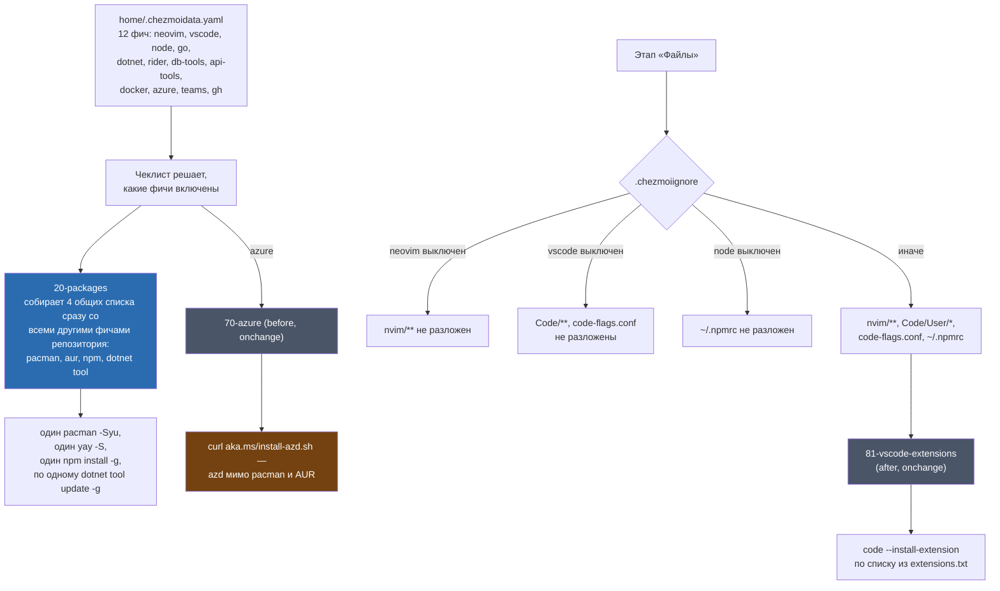

---
covers:
  features: [neovim, vscode, node, go, dotnet, rider, db-tools, api-tools, docker, azure, teams, gh]
  paths:
    - home/dot_config/nvim/**
    - home/dot_config/Code/User/extensions.txt
    - home/dot_config/Code/User/keybindings.json
    - home/dot_config/Code/User/settings.json
    - home/dot_config/code-flags.conf
    - home/dot_npmrc
    - home/.chezmoiscripts/run_onchange_after_81-vscode-extensions.sh.tmpl
    - home/.chezmoiscripts/run_onchange_before_70-azure.sh.tmpl
---

# Инструменты разработки

## Что это даёт

Двенадцать фич, каждая — один инструмент или один язык программирования.
Список того, что за них можно получить:

- **Neovim** — редактор кода прямо в терминале, уже настроенный под C#/.NET:
  автодополнение, подсказки типов, тесты по клавише, отладчик, гит внутри
  редактора, файловый проводник, HTTP-клиент для ручных запросов к API.
- **VS Code** — графический редактор с полусотней расширений, которые
  ставятся сами: Azure, .NET, Python, базы данных, GitHub Copilot.
- **Node.js**, **Go**, **.NET SDK** — три рантайма/SDK, на которых можно
  писать и запускать код.
- **JetBrains Rider** — вторая, платная IDE для .NET, тянет за собой сам
  SDK.
- Клиенты для баз данных (**db-tools**) и HTTP API (**api-tools**) —
  графические и терминальные, без необходимости ставить сами базы или
  сервер на машину.
- **Docker** — контейнеры для запуска чужого софта (в том числе тех самых
  баз данных для db-tools); в рабочем контейнере та же фича даёт только
  docker CLI как клиент к podman хоста — для .NET Aspire.
- **Azure CLI + azd**, **Teams**, **GitHub CLI** — по одному инструменту
  под конкретного вендора или сервис.

Каждая фича — отдельная галочка в чеклисте `chezmoi init` (кроме
`docker`, `vscode`, `go`, `azure`, `teams` — они без галочки по умолчанию,
см. таблицу ниже). Сам механизм галочек, `scope` и `needs` — не тема этого
документа, целиком в [how-it-works.md](how-it-works.md), раздел «Три
вопроса, которые решают судьбу фичи».

## Как это работает



Общий механизм один на все двенадцать фич: у каждой в
`home/.chezmoidata.yaml` есть блок `pacman`/`aur`/`npm`/`dotnet`, и
`run_onchange_before_20-packages.sh.tmpl` при рендере шаблона проходит по
всем **включённым** фичам всего репозитория (не только этим двенадцати),
складывает четыре плоских списка и ставит их одним проходом — один
`pacman -Syu`, один вызов `yay`/`paru`, один `npm install -g`, и по одному
`dotnet tool update -g` на каждый инструмент. Разбор самого скрипта 20 и
почему `run_onchange` перезапускает его при любой правке каталога — в
[how-it-works.md](how-it-works.md), раздел «Два вида скриптов».

Две фичи из двенадцати не укладываются в общий список и получают
собственный скрипт:

**`vscode` → `run_onchange_after_81-vscode-extensions.sh.tmpl`.** Список
расширений не хранится в скрипте как список — он **вшивается в текст
скрипта прямо при рендере шаблона**:

```
{{ $extensions := include "dot_config/Code/User/extensions.txt" | trim | splitList "\n" }}
```

`include` здесь читает файл из исходного дерева chezmoi (`home/dot_config/Code/User/extensions.txt`,
47 строк), а не из уже разложенной копии в `~`. Раз `run_onchange_`
считает хеш **рендеренного** текста скрипта, а не текста шаблона до
подстановки — правка списка расширений меняет этот текст, меняет хеш, и
скрипт перезапускается сам, без отдельного триггера. Дальше скрипт читает
`code --list-extensions`, ставит только то, чего не хватает
(`--install-extension ... --force`), и держит `set -e` только для себя:
у строки установки каждого расширения есть свой `|| echo "!! failed..."
>&2`, так что провал одного расширения не прерывает остальные (файл:
`run_onchange_after_81-vscode-extensions.sh.tmpl`, функция — цикл `for ext
in ...`).

**`azure` → `run_onchange_before_70-azure.sh.tmpl`.** `azure-cli` идёт
через общий список 20 (пакет есть в `extra`, обычный pacman-пакет), а
`azd` — отдельным скриптом до этапа «Файлы»:

```
curl -fsSL https://aka.ms/install-azd.sh | bash
```

Почему отдельно — в разделе «Почему именно так» ниже и в
[docs/workarounds.md](workarounds.md).

Файлы всех трёх фич с собственными файлами (`neovim`, `vscode`, `node`)
гасятся через `home/.chezmoiignore` целиком, не построчно: `.config/nvim/**`,
`.config/Code/** .config/code-flags.conf`, `.npmrc` — каждый блок под
своим условием `{{ if not (has "<фича>" .enabled) }}`. Выключенная фича не
оставляет частично разложенных файлов.

## Что ставится и что меняется

| Фича | Пакеты | Файлы в `~` | Свой скрипт |
|---|---|---|---|
| `neovim` | `neovim` `tree-sitter-cli` | `.config/nvim/**` (29 файлов) | — |
| `vscode` | AUR: `visual-studio-code-bin` | `.config/Code/User/settings.json`, `.config/Code/User/keybindings.json`, `.config/Code/User/extensions.txt`, `.config/code-flags.conf` | `81-vscode-extensions` |
| `node` | `nodejs` `npm` | `.npmrc` | — (guard внутри `20-packages`) |
| `go` | `go` | нет | — |
| `dotnet` | `aspnet-runtime` `aspnet-targeting-pack` `dotnet-sdk` `freetds`; dotnet tool: `dotnet-ef` `csharpier` `dotnet-outdated-tool` | нет своих (`~/.dotnet/tools` в PATH через `.bashrc`, тема [base.md](base.md)) | — |
| `rider` | AUR: `rider` (`needs: [dotnet]`) | нет | — |
| `db-tools` | `dbeaver` + AUR `go-sqlcmd` `lazysql-bin` `usql-bin` | нет | — |
| `api-tools` | AUR: `bruno-bin` `posting` | нет | — |
| `docker` | `docker` `docker-buildx` `docker-compose` `lazydocker` | нет | группа `docker` и `docker.socket` в `run_onchange_before_30-system.sh.tmpl` — только хост, в контейнере пакеты работают клиентами к podman хоста |
| `azure` | `azure-cli` | нет управляемых (`azd` ставится мимо chezmoi, в свою обычную для linux-скрипта location) | `70-azure` |
| `teams` | AUR: `teams-for-linux` | нет | — |
| `gh` | `github-cli` | нет | — |

## Neovim: структура, а не список плагинов

29 файлов, но структура плоская и предсказуемая: `init.lua` подключает три
модуля настроек (`lua/options.lua`, `lua/keymaps.lua`, `lua/autocmds.lua`)
и `lua/plugins.lua`, который при первом запуске сам клонирует менеджер
плагинов `lazy.nvim`, а дальше просто перечисляет 20 строк
`{ import = 'plugins.X' }` — ровно по одной на каждый файл в `lua/plugins/`
(проверить: `git ls-files -- 'home/dot_config/nvim/lua/plugins/**' | wc -l`
даёт `20`, и столько же строк `{ import` в `lua/plugins.lua`). Сами эти
двадцать строк разбиты в файле на семь смысловых групп комментариями —
вот они: тестирование; внешний вид (цветовая схема,
статусбар, вкладки, отступы); навигация и поиск (telescope, сессии,
файловый проводник, which-key); редактирование и treesitter; git
(lazygit + gitsigns, отдельно diffview для ревью всей ветки целиком); LSP
и языковые инструменты (mason ставит сами языковые сервера и отладчики по
требованию, lspconfig, автодополнение, линт, отладка, C# отдельным
файлом); HTTP-клиент.

Не каждый файл — это один плагин на равных: `lua/plugins/mason.lua`
подключает второй, неофициальный реестр `Crashdummyy/mason-registry`
рядом со штатным — с комментарием в коде «For Roslyn language server»,
потому что LSP-сервер Roslyn для C# в официальный реестр mason не входит.
`lua/plugins/csharp.lua` (`seblyng/roslyn.nvim`) и есть тот самый клиент.
`lua/plugins/debug.lua` заводит отладчик `netcoredbg` (тоже через mason)
для .NET и `nvim-dap-go` для Go — ровно те же два языка, что в этом
документе фигурируют как SDK-фичи `dotnet` и `go`.

Одна и та же идея повторяется в двух независимых файлах —
`lua/plugins/git.lua` (`LazyGitCurrentFile`) и
`lua/plugins/diffview.lua` (свой `file_git_root()` через `git -C <каталог
файла> rev-parse --show-toplevel`): все команды берут репозиторий
**текущего файла**, а не текущий рабочий каталог (`cwd`) редактора.
Комментарии в обоих файлах называют причину одинаково: рабочий процесс
этого пользователя — несколько репозиториев микросервисов под одной
общей папкой, и `cwd` редактора в такой раскладке почти никогда не
совпадает с репозиторием, который реально открыт.

`lazy-lock.json` фиксирует точные коммиты всех плагинов — обновление
происходит только руками (`:Lazy update`), а не при каждом `chezmoi
apply`. `private_snippets/cs.json` — сниппеты C#. `dot_stylua.toml` и
`dot_gitignore` — про сам конфиг nvim (форматирование lua-файлов и что не
класть в git), а не про редактирование чужого кода в нём.

Выключенная фича `neovim` — не пустой конфиг, а вся папка `.config/nvim/**`
целиком отсутствует в домашнем каталоге (см. диаграмму выше).

## VS Code: список расширений в тексте скрипта

47 расширений в `extensions.txt` — заметно смещены в сторону Azure
(`ms-azuretools.*`, `ms-mssql.*`) и .NET (`ms-dotnettools.csdevkit`,
`csharp`), плюс Python, Docker, GitHub Copilot и мелкие удобства
(`pkief.material-icon-theme`, `usernamehw.errorlens`). Список не
перечисляется в этом документе построчно — сам файл рядом,
`home/dot_config/Code/User/extensions.txt`. Как этот список превращается
в установку — в разделе «Как это работает» выше.

`settings.json` — обычные личные настройки редактора: формат при
сохранении, линейки, скрытие пробелов, семантическая подсветка C#,
сохранённые подключения MSSQL. Ключи `dotnet.defaultSolution` и
`@azure.argTenant` в файле есть, но оба пустые строки: место под привязку
к конкретному решению и конкретному tenant заведено, а само значение
здесь не хранится и в репозиторий не уезжает. `keybindings.json` — ровно
одна привязка: `Shift+Enter`
во встроенном терминале посылает буквальные `\` + CRLF — приём для
многострочного ввода в шелле одной непрерывной командой.

`code-flags.conf` — не изобретение этого репозитория, а конвенция самой
упаковки VS Code для Linux: и официальный пакет `code`, и AUR-пакет
`visual-studio-code-bin` (тот, что здесь и ставится) читают
`~/.config/code-flags.conf` при каждом запуске и добавляют его содержимое
к аргументам командной строки Electron (ArchWiki, статья «Visual Studio
Code», раздел «Launch configuration» — таблица `code` / `visual-studio-code-bin`
/ `vscodium`, у первых двух путь `~/.config/code-flags.conf`, у
`vscodium` — «Not supported»). Здесь в нём два флага:
`--ozone-platform-hint=auto` и `--enable-features=WaylandWindowDecorations`
— нативный рендеринг под Wayland с собственными оконными декорациями,
вместо запасного пути через XWayland.

## Node: почему `~/.npm-global`, а не системный путь

`npm install -g` в `20-packages` вызывается **без `sudo`** — единственная
из трёх команд установки в этом скрипте (`pacman` и `yay`/`paru` идут с
`sudo` каждый раз). Это возможно только потому, что глобальный префикс
npm заранее переставлен на `~/.npm-global` — каталог, которым владеет сам
пользователь, а не `/usr`. Каталог добавлен в `PATH` в начале
`~/.bashrc` (`home/dot_bashrc.tmpl`, тема [base.md](base.md)).

Строка `--allow-scripts=@anthropic-ai/claude-code` в самом вызове
`npm install -g`, а не только в `~/.npmrc` — потому что `20-packages`
это `before`-скрипт: на чистой машине он выполняется раньше этапа
«Файлы», то есть раньше, чем `~/.npmrc` вообще появится на диске. Без
флага прямо на командной строке npm заблокировал бы postinstall, который
линкует нативный бинарник `claude`, и `~/.npm-global/bin/claude` остался
бы висячей символьной ссылкой.

Обход, отдельная строка в [workarounds.md](workarounds.md): `npm config
set prefix` трогается только тогда, когда `npm config get prefix` реально
расходится с `$HOME/.npm-global`. На этой машине сравнение уже совпадает
(`npm config get prefix` возвращает `/home/stsiapan/.npm-global`, ровно то
же значение с раскрытым `~`), поэтому `npm config set` не вызывается ни
разу — управляемый `~/.npmrc` так и остаётся ровно тем текстом, что несёт
`home/dot_npmrc` в репозитории, с комментариями и буквальной тильдой в
значении `prefix=~/.npm-global`. Без этого guard'а каждый `chezmoi apply`
клал бы файл с тильдой, а следующий вызов `npm config set` (если бы он
выполнялся безусловно) переписывал бы его на абсолютный путь — вечная
рассинхронизация между тем, что пишет chezmoi, и тем, что пишет npm.

## .NET: `tool update`, а не `install`

Три глобальных инструмента (`dotnet-ef`, `csharpier`,
`dotnet-outdated-tool`) ставятся строкой `dotnet tool update -g
<имя>`, а не `install`: начиная с .NET 8 `update` сам ставит
отсутствующий инструмент и ничего не делает для уже актуального — то
есть один и тот же вызов идемпотентен, и скрипту не нужна отдельная
проверка «уже стоит или нет» перед выбором команды (комментарий и код —
`run_onchange_before_20-packages.sh.tmpl`, блок `---- dotnet tools
----`).

Туннели наружу — не забота этой фичи: раньше вместе с ней ставился
`devtunnel-cli-bin` (Microsoft Dev Tunnels CLI из AUR), но он выпилен
2026-08-01 — сборка из AUR регулярно падала, а ту же задачу закрывает
уже стоящий Tailscale (фича `tailscale`, [network.md](network.md)).

## Rider, db-tools, api-tools

`rider` тянет `dotnet` через `needs: [dotnet]` — платная IDE без SDK
бесполезна, поэтому зависимость жёсткая, а не рекомендация в чеклисте.

`db-tools` и `api-tools` — клиенты, не серверы: сами базы данных крутятся
в контейнерах Docker (см. ниже), здесь только то, чем к ним подключаться
— графический DBeaver и три консольных (`go-sqlcmd`, `lazysql-bin`,
`usql-bin`) для баз, графический Bruno и консольный `posting` для HTTP
API. Комментарий в каталоге поясняет выбор DBeaver, а не JetBrains
DataGrip: Rider и так несёт тот же набор инструментов работы с базами
данных, DBeaver здесь — бесплатный универсальный запасной вариант, а не
основной инструмент.

## Docker: на хосте — демон, в контейнере — клиент podman хоста

`docker` — `scope: both`, но две половины фичи делают разное. До 2026-08-02
она была `scope: host`, единственной из двенадцати фич без права на
контейнер — комментарий в каталоге тогда говорил: демон всё равно живёт на
хосте, ставить его вторым слоем внутри [контейнера distrobox](glossary.md#контейнер-distrobox)
незачем. Расширение до `both` — та же мысль, доведённая до конца: раз демон
живёт на хосте, контейнеру нужен только клиент. .NET Aspire (AppHost),
запущенный в рабочем контейнере, требует docker CLI в `PATH` и сам выставляет
`DOCKER_HOST` на API-сокет rootless podman хоста, видимый из контейнера как
`/run/host/run/user/1000/podman/podman.sock`. Как устроен этот канал целиком
— [containers.md](containers.md), раздел «Podman хоста из контейнера».

На хосте `run_onchange_before_30-system.sh.tmpl` включает не сам демон, а
`docker.socket` — сокет-активация, демон стартует по первому обращению и
ничего не ест, пока Docker не нужен — и добавляет пользователя в группу
`docker`. Членство в группе действует только со следующего входа в
систему, не сразу: `run_after_zz-next-steps.sh.tmpl` проверяет
`id -nG "$USER" | grep -qw docker` при **каждом** `chezmoi apply` на хосте и
печатает напоминание, пока перелогин не состоялся.

В контейнере из всего этого не происходит ничего: `30-system` целиком
хостовый (гасится шаблоном на `{{- if ne .env "host" }}`), так что ни
`docker.socket`, ни группа `docker` в контейнере не появляются — демон
не запускается и не должен. Чеклист `zz-next-steps` в контейнере проверяет
вместо группы единственное, что тут может отсутствовать: сокет podman хоста
— и печатает готовую команду для хоста, если его нет.

## Azure: `azure-cli` и `azd` — два разных пути на машину

`azure-cli` едет обычным пакетом в общем списке 20 — он есть в
официальном репозитории Arch `extra`. `azd` — нет, отдельным скриптом,
разбор обхода ниже. Чеклист (`run_after_zz-next-steps.sh.tmpl`) напомнит
про `az login`, если `az account show` не находит активной сессии;
про `azd` отдельного напоминания в чеклисте нет.

## Go, Teams, gh

**`go`** — самая маленькая фича из двенадцати: один пакет `go`, ни файлов,
ни скрипта. **`teams`** — AUR `teams-for-linux`, тоже без файлов и
скрипта; в общем списке 20 идёт как обычный AUR-пакет. **`gh`** — пакет
`github-cli`; свежепоставленный `gh` не авторизован, и чеклист
(`run_after_zz-next-steps.sh.tmpl`) печатает напоминание про `gh auth
login`, пока `gh auth status` не подтвердит сессию.

## Как проверить

Обе команды должны молчать после того, как этот документ занял место в
каталоге:

```sh
tools/gen-catalog.sh --check | grep -E '^UNCOVERED-FEATURE\s(neovim|vscode|node|go|dotnet|rider|db-tools|api-tools|docker|azure|teams|gh)$'
tools/gen-catalog.sh --check | grep -E 'nvim/|Code/User|code-flags|npmrc|81-vscode|70-azure'
```

Что реально попадёт на диск для `neovim`, посчитано напрямую по git, без
применения конфигурации:

```sh
$ git ls-files -- 'home/dot_config/nvim/**' | wc -l
29
```

Что реально выполнится для `vscode` и `azure` на конкретной машине — оба
скрипта рендерятся в двухстрочную заглушку, если фича выключена (на этой
машине выключены обе):

```sh
$ chezmoi execute-template < home/.chezmoiscripts/run_onchange_before_70-azure.sh.tmpl
#!/bin/bash
exit 0
$ chezmoi execute-template < home/.chezmoiscripts/run_onchange_after_81-vscode-extensions.sh.tmpl
#!/bin/bash
exit 0
```

Что реально стоит в npm-конфиге на этой машине — сравнение, от которого
зависит, тронет ли `20-packages` `~/.npmrc`:

```sh
$ npm config get prefix
/home/stsiapan/.npm-global
$ cat ~/.npmrc
registry=https://registry.npmjs.org/
prefix=~/.npm-global
...
```

Значения совпадают после раскрытия `~`, значит `npm config set` не
вызовется, и файл останется ровно тем текстом, что лежит в
`home/dot_npmrc`.

Какие из двенадцати фич включены прямо сейчас, без применения:

```sh
chezmoi data | jq -r '.enabled[]' | grep -E '^(neovim|vscode|node|go|dotnet|rider|db-tools|api-tools|docker|azure|teams|gh)$'
```

## Когда сломалось

| Симптом | Причина | Что делать |
|---|---|---|
| `code --install-extension` не ставится, в выводе `apply` — `!! failed to install <ext>` | Одно расширение не установилось (сеть, маркетплейс), но скрипт не остановился на нём | Повторить `code --install-extension <ext>` руками; `81` перепроверит и остальные при следующем изменении `extensions.txt` |
| Список расширений поправлен, а `81-vscode-extensions` не перезапустился | `run_onchange_` реагирует на изменение **рендеренного** текста скрипта; если правка не попала в `extensions.txt` (например, правили уже разложенный файл в `~`, а не файл репозитория) — хеш не изменился | Проверить, что правка в `home/dot_config/Code/User/extensions.txt`, а не в `~/.config/Code/User/extensions.txt` |
| `claude`-подобная команда из npm — «No such file or directory», хотя бинарник виден в `~/.npm-global/bin` | Постинсталл заблокирован npm (нет `--allow-scripts`) — висячая символьная ссылка | Разбор целиком в [base.md](base.md) и в комментарии `home/dot_npmrc` |
| После `chezmoi apply` меняется `~/.npmrc` каждый раз (теряются комментарии, тильда становится абсолютным путём) | `npm config get prefix` разошёлся с `$HOME/.npm-global` — guard срабатывает на каждом проходе | Проверить `npm config get prefix` и откуда взялось расхождение (например, другой инструмент вроде `nvm` переставил префикс) |
| `azd` не находится в `PATH` после установки фичи `azure` | Установщик `aka.ms/install-azd.sh` кладёт бинарник не через chezmoi и не через pacman — не отслеживается этим документом как управляемый файл | `command -v azd`; при отсутствии — тот же `curl -fsSL https://aka.ms/install-azd.sh \| bash` руками |
| `docker` команды требуют `sudo`, хотя фича включена и `chezmoi apply` прошёл | Членство в группе `docker` действует только со следующего входа в систему | Разлогиниться и зайти заново; чеклист (`zz-next-steps`) напоминает об этом на каждом apply, пока не увидит себя в группе |
| В контейнере `docker version` отвечает «Cannot connect to the Docker daemon at unix:///var/run/docker.sock» | Без `DOCKER_HOST` клиент идёт в локальный демон, которого в контейнере нет намеренно | Проверить канал к хосту: `DOCKER_HOST=unix:///run/host/run/user/1000/podman/podman.sock docker version` — сервер должен ответить как podman; Aspire выставляет `DOCKER_HOST` сам ([containers.md](containers.md)) |
| Rider не устанавливается, `chezmoi apply` падает на AUR-пакете `rider` | AUR-сборка тянет `dotnet` через `needs`; если `dotnet-sdk` не собрался или не установился раньше, зависимая по смыслу, но не по `pacman`-зависимости сборка Rider может провалиться на своих собственных проверках | Проверить, что `dotnet --version` работает, прежде чем разбирать сам Rider |

## Почему именно так

**Почему список расширений VS Code лежит в отдельном `extensions.txt`, а
не прямо в теле скрипта 81 текстом.** Потому что `run_onchange_` следит
за текстом всего файла целиком: если бы список был написан прямо в
шаблоне скрипта, редактирование одной строки терялось бы среди Bash-кода
и было бы неотличимо от правки логики скрипта. Отдельный файл делает
намерение видимым: правишь список расширений — правишь один плоский
текстовый файл, а не Bash с интерполяцией.

**Почему `npm install -g` не под `sudo`, а `pacman`/`yay` — под `sudo`.**
Не стилистический выбор, а прямое следствие того, куда указывает
глобальный префикс npm. `~/.npm-global` принадлежит пользователю, `pacman`
пишет в `/usr`, которым владеет root. Разница видна в самом скрипте 20:
только у вызовов пакетного менеджера есть `sudo` перед командой.

**Почему `azd` идёт в обход обычных путей установки Arch — разобрано
ниже, отдельной строкой реестра [docs/workarounds.md](workarounds.md).**

## Ссылки

- [how-it-works.md](how-it-works.md) — механизм `scope`/`always`/`needs`
  чеклиста фич, порядок скриптов `before`/`files`/`after`, разница
  `run_onchange_` и `run_after_`.
- [base.md](base.md) — `~/.npm-global/bin` и `~/.dotnet/tools` в `PATH`
  через `~/.bashrc`.
- [docs/workarounds.md](workarounds.md) — обходы `npm config set`, `azd`.
- ArchWiki, статья «Visual Studio Code», раздел «Launch configuration» —
  <https://wiki.archlinux.org/title/Visual_Studio_Code#Launch_configuration>,
  таблица путей `code-flags.conf` по пакетам.
- npm CLI docs, `npm config` — <https://docs.npmjs.com/cli/v8/commands/npm-config/>,
  цель записи по умолчанию — пользовательский конфиг.
- `npm/npm#7771`, «`npm config set` always modifies ~/.npmrc» —
  <https://github.com/npm/npm/issues/7771>.
- Microsoft Learn, «Install or update the Azure Developer CLI» —
  <https://learn.microsoft.com/en-us/azure/developer/azure-developer-cli/install-azd>,
  скрипт `curl -fsSL https://aka.ms/install-azd.sh | bash` как
  единственный неупаковочный способ для Linux в этой документации.
