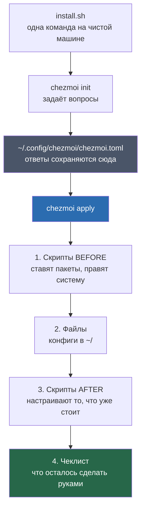
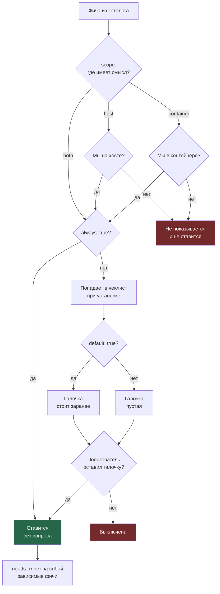
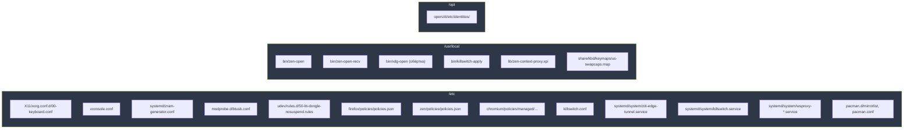
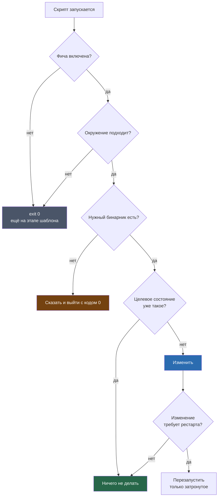
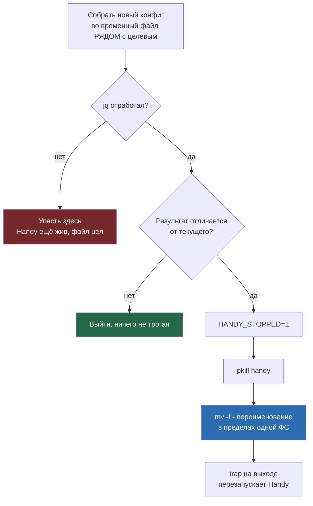
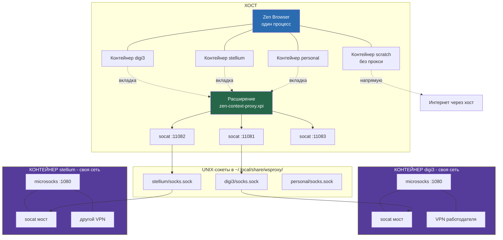
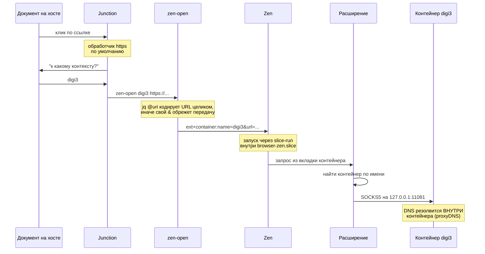

# Что этот репозиторий делает с машиной

Полный разбор: какие пакеты ставятся, какие файлы меняются и при каких условиях.

Документ описывает состояние на коммите `9056f8b`.

---

## Оглавление

1. [Как это работает в целом](#1-как-это-работает-в-целом)
2. [Три вопроса, которые решают всё](#2-три-вопроса-которые-решают-всё)
3. [Порядок применения](#3-порядок-применения)
4. [Базис: ставится всегда, без вопросов](#4-базис-ставится-всегда-без-вопросов)
5. [Фичи по выбору](#5-фичи-по-выбору)
6. [Все скрипты по порядку](#6-все-скрипты-по-порядку)
7. [Все управляемые файлы](#7-все-управляемые-файлы)
8. [Что меняется за пределами домашней папки](#8-что-меняется-за-пределами-домашней-папки)
9. [Защитные условия: как это не ломает систему](#9-защитные-условия-как-это-не-ломает-систему)
10. [Изоляция рабочих контекстов](#10-изоляция-рабочих-контекстов)

---

## 1. Как это работает в целом

Инструмент называется **chezmoi**. Он держит эталонную копию конфигов в git-репозитории и раскладывает их по домашней папке. Плюс умеет запускать скрипты до и после раскладки.



**Ключевая идея:** источник правды один - файл `home/.chezmoidata.yaml`. В нём лежит каталог фич. Оттуда список пакетов попадает в скрипт установки, оттуда же скрипты узнают, что включено.

**Что где лежит:**

| Файл | Что в нём |
|---|---|
| `home/.chezmoidata.yaml` | Каталог фич, рабочие контексты, папки Syncthing, закладки |
| `home/.chezmoi.toml.tmpl` | Вопросы при первой установке |
| `home/.chezmoiignore` | Какие файлы НЕ раскладывать, если фича выключена |
| `home/.chezmoiscripts/` | 26 скриптов |
| `home/dot_*`, `home/bin/` | Собственно конфиги |
| `~/.config/chezmoi/chezmoi.toml` | Ответы на вопросы (не в репозитории, у каждой машины свои) |

---

## 2. Три вопроса, которые решают всё

Попадёт ли фича на машину, определяют три вещи.



**Про `scope`.** Хост это обычная машина. Контейнер это distrobox: изолированное окружение под конкретную работу, со своей сетью. Тот же репозиторий разворачивается и там, и там - скрипт сам понимает, где он, по наличию файла `/run/.containerenv`.

**Про `needs`.** Зависимости раскрываются автоматически, в три прохода (запас на будущее, реальные цепочки в один уровень):

| Фича | Тянет за собой | Почему |
|---|---|---|
| `claude` | `node` | CLI ставится через npm |
| `codex` | `node` | то же самое |
| `rider` | `dotnet` | IDE без SDK бесполезна |
| `voice-postprocess` | `voice` | нечего постобрабатывать без распознавания |

**Про NVIDIA.** Отдельный вопрос, задаётся только если в машине есть карта NVIDIA (читается напрямую из `/sys/bus/pci/devices/`, потому что `lspci` может не быть) и при этом драйвера или Vulkan-рантайма нет. Это свойство железа, а не предпочтение, поэтому не фича в чеклисте.

---

## 3. Порядок применения

chezmoi гоняет скрипты в три захода. Внутри захода порядок алфавитный, отсюда числовые префиксы в именах.

```mermaid
flowchart TD
    subgraph BEFORE["ЭТАП 1: BEFORE - до раскладки файлов"]
        direction TB
        S10["10 bootstrap-pacman<br/>только контейнер"]
        S20["20 packages<br/>ВСЕ пакеты разом"]
        S30["30 system<br/>клавиатура, zram, ufw, сервисы"]
        S32["32 browser-extensions<br/>политики расширений"]
        S35["35 nvidia"]
        S40["40 voice"]
        S50["50 bluetooth"]
        S60["60 ziti"]
        S70["70 azure"]
        S10 --> S20 --> S30 --> S32 --> S35 --> S40 --> S50 --> S60 --> S70
    end

    subgraph FILES["ЭТАП 2: ФАЙЛЫ"]
        F["Конфиги в ~/<br/>шаблоны разворачиваются<br/>.chezmoiignore отсекает лишнее"]
    end

    subgraph AFTER["ЭТАП 3: AFTER - после раскладки"]
        direction TB
        S33["33 browser-slices"]
        S34["34 wsproxy-host"]
        S36["36 wsproxy-container"]
        S37["37 container-links"]
        S38["38 linkrouting"]
        S39["39 killswitch"]
        S40b["40 zen-prefs"]
        S41["41 zen-context-proxy"]
        S43["43 zen-session"]
        S44["44 handy-postprocess"]
        S46["46 syncthing"]
        S80["80 niri-dms-placeholders"]
        S81["81 vscode-extensions"]
        S82["82 ssh-key"]
        S83["83 origin-ssh"]
        S84["84 claudefiles"]
        SZZ["zz next-steps<br/>чеклист"]
        S33 --> S34 --> S36 --> S37 --> S38 --> S39 --> S40b --> S41 --> S43 --> S44 --> S46 --> S80 --> S81 --> S82 --> S83 --> S84 --> SZZ
    end

    BEFORE --> FILES --> AFTER

    style S20 fill:#2b6cb0,color:#fff
    style S30 fill:#2b6cb0,color:#fff
    style SZZ fill:#276749,color:#fff
```



**Почему такой порядок.** Пакеты ставятся первыми, потому что дальше всё на них опирается. Настройка приложений идёт после раскладки файлов, потому что часть скриптов читает разложенные конфиги (например, скрипт 80 читает `~/.config/niri/config.kdl`, чтобы понять, каких включаемых файлов не хватает).

### Два вида скриптов

| Вид | Когда запускается | Сколько таких |
|---|---|---|
| `run_onchange_` | Только когда изменился текст самого скрипта после подстановки переменных | 20 |
| `run_after_` без `onchange` | На каждом `chezmoi apply` | 6 |

Второй вид нужен там, где скрипт следит за состоянием, а не за собственным текстом. Пример: настройки Handy можно сбить из его же интерфейса. `onchange`-скрипт этого не заметит и никогда не перезапустится. `run_after_` перепроверяет каждый раз и молча ничего не делает, если всё на месте.

Список тех, что гоняются всегда: `43-zen-session`, `44-handy-postprocess`, `46-syncthing`, `80-niri-dms-placeholders`, `84-claudefiles`, `zz-next-steps`.

---

## 4. Базис: ставится всегда, без вопросов

Восемь фич с `always: true`. Их нет в чеклисте, отказаться нельзя. Разделены только по `scope`.

### `core` - базовые утилиты (везде)

**Пакеты (21):** `base-devel` `bc` `diffutils` `git` `inetutils` `less` `lsof` `man-db` `man-pages` `mtr` `openssh` `pigz` `rsync` `sudo` `tcpdump` `time` `traceroute` `tree` `unzip` `wget` `zip`

**Файлы:** нет
**Условия:** нет, ставится всегда

### `shell` - современная оболочка (везде)

**Пакеты (9):** `bat` `btop` `eza` `fd` `fzf` `lazygit` `ripgrep` `starship` `zoxide`

**Файлы:**

| Путь | Что делает |
|---|---|
| `~/.bashrc` | PATH, алиасы, инициализация starship/zoxide/fzf, тема Nord для fzf, `bat` как пейджер для man |
| `~/.bash_profile`, `~/.profile` | подхватывают `.bashrc` |
| `~/.config/starship.toml` | вид приглашения командной строки |

**Условия:** каждая строка инициализации обёрнута в `command -v`. Один и тот же `.bashrc` уезжает и на хост, и во все контейнеры, поэтому отсутствие бинарника в одном месте не должно ронять оболочку в другом.

### `container-base` - обвязка контейнера (только контейнер)

**Пакеты (11):** `alsa-plugins` `glibc-locales` `mesa` `microsocks` `nftables` `nss-mdns` `socat` `sox` `vte-common` `words` `xorg-xauth`

**Зачем именно эти:** `glibc-locales` для локалей внутри контейнера, `xorg-xauth` для проброса X11 на хост, `nss-mdns` чтобы резолвились имена `.local`, `sox`/`mesa`/`vte-common` для приложений, экспортированных обратно на хост. `microsocks` и `socat` публикуют выход контейнера в интернет для хостового браузера через UNIX-сокет. `nftables` лежит под опциональный kill-switch и ничего не делает, пока та фича не выбрана.

**Файлы:** нет своих
**Условия:** `scope: container`, на хосте вообще не рассматривается

### `host-base` - без чего хост не машина (только хост)

**Пакеты (12):** `bluez` `bluez-utils` `chezmoi` `jq` `networkmanager` `nano` `smartmontools` `socat` `ufw` `wpa_supplicant` `xdg-utils` `zram-generator`

**Почему тут:**
- `chezmoi` ставит сам себя, чтобы дальше обновляться через pacman, а не через копию из `install.sh`
- `nano` как запасной редактор на случай сломанной графики (neovim это отдельная опциональная фича)
- `jq` собирает URI для передачи ссылок между контейнером и браузером - единственный инструмент, который корректно кодирует URL целиком
- `socat` это хостовая половина браузерного прокси

**Файлы:** нет своих
**Важная связь:** скрипт `30-system` включает `NetworkManager.service` и `bluetooth.service`. Без этих пакетов `systemctl enable` упадёт и утянет весь скрипт за собой (там `set -e`).

### `desktop` - рабочий стол (только хост)

**Пакеты (32):** `brightnessctl` `cava` `dms-shell-niri` `ghostty` `gst-plugin-pipewire` `i2c-tools` `kimageformats` `matugen` `mesa` `niri` `noto-fonts` `noto-fonts-cjk` `noto-fonts-emoji` `pipewire` `pipewire-alsa` `pipewire-jack` `pipewire-pulse` `polkit` `qt6-multimedia` `qt6ct` `quickshell` `sddm` `ttf-jetbrains-mono-nerd` `tuned-ppd` `vulkan-intel` `vulkan-radeon` `wireplumber` `wl-clipboard` `wtype` `xdg-desktop-portal-gnome` `xdg-desktop-portal-gtk` `xwayland-satellite`

Оконный менеджер - **niri** (плиточный, окна выкладываются на бесконечную ленту). Панель и оболочка - **DankMaterialShell** (DMS). Терминал - **ghostty**, специально с `gtk-single-instance=false`: каждое окно отдельный процесс, поэтому пять занятых агентов в пяти окнах не душат друг друга.

Шрифт Nerd не опционален: без него starship и `eza --icons` рисуют квадратики вместо иконок.

**Файлы:**

| Путь | Что это |
|---|---|
| `~/.config/niri/config.kdl` | основной конфиг оконного менеджера |
| `~/.config/niri/dms/binds.kdl` | горячие клавиши панели |
| `~/.config/niri/dms/cursor.kdl` | курсор |
| `~/.config/niri/dms/empty_windowrules.kdl` | правила окон |
| `~/.config/niri/voice.kdl` | биндинги голосового ввода (шаблон, см. фичу `voice`) |
| `~/.config/DankMaterialShell/settings.json` | настройки панели |
| `~/.config/ghostty/config` | терминал |
| `~/.config/ghostty/themes/create_dankcolors` | тема терминала под цвета DMS |
| `~/.config/alacritty/alacritty.toml` | запасной терминал |

**Скрипт `80-niri-dms-placeholders`:** DMS сам генерирует часть включаемых файлов (цвета, раскладка, alttab, мониторы) и перезаписывает их при каждой смене темы. В репозитории их нет и быть не должно. Но у niri нет условного `include`: не найдя файл, он падает при разборе конфига и откатывается на умолчания. Скрипт создаёт недостающие файлы пустыми - пустой KDL-документ валиден, а DMS потом запишет туда настоящее содержимое.

Список включаемых файлов не захардкожен: скрипт вычитывает пути прямо из `config.kdl` регуляркой по строкам `include "..."`.

### `tailscale` - VPN между своими машинами (только хост)

**Пакеты (1):** `tailscale`

**Условия:** безусловно на всех хостах. Это способ, которым машины пользователя видят друг друга (десктоп, ноутбук, телефон), поэтому машина без него недостижима. Демон живёт на хосте, контейнеры пользуются его сетью.

**Что делает `30-system`:** включает и **сразу стартует** `tailscaled.service`. Именно стартует, а не только включает: команде `tailscale up` из чеклиста нужен живой демон, а перезагрузка между ними потеряла бы читателя.

**Ручной шаг:** `sudo tailscale up` с авторизацией в браузере. Чеклист напоминает, пока не сделано.

### `distrobox` - контейнеры (только хост)

**Пакеты (2):** `distrobox` `podman`

**Файлы:** `~/.config/distrobox/distrobox.ini` - шаблон, секции генерируются из списка `contexts`.

Настройки контейнеров:

| Параметр | Значение | Смысл |
|---|---|---|
| `image` | `archlinux:latest` | база |
| `init` | `true` | внутри работает systemd |
| `unshare_netns` | `true` | **своя сеть** - несущая конструкция всей изоляции |
| `unshare_process` | `true` | свой список процессов |
| `unshare_ipc` | `false` | общий `/dev/shm`, иначе Electron и JVM падают на 64 МБ по умолчанию |
| `unshare_devsys` | `false` | общий `/dev`, иначе теряются GPU и звук |
| `--memory` | `8g` | жёсткий потолок, чтобы три контейнера не задавили хост |
| `--volume` | `~/.local/share/wsproxy/<имя>:/var/lib/wsproxy` | единственный канал к хосту, свой у каждого контекста |

Том смонтирован в `/var/lib`, а не в `/mnt`: distrobox при каждом старте примонтирует хостовый `/mnt` поверх контейнерного и спрячет том. Отказ читается как "смонтировано, но директории нет".

### `zen` - браузер рабочих контекстов (только хост)

**Пакеты:** `junction` (репозиторий) + `zen-browser-bin` (AUR)

`always: true`, потому что на нём построена вся изоляция рабочих контекстов. Zen показывает в боковой панели только вкладки текущего пространства, а пространство привязано к контейнеру Firefox, который несёт свой прокси и свою банку с куками.

**Junction** это выбиралка ссылок: становится обработчиком `https` по умолчанию, поэтому ссылка из документа спрашивает, к какому контексту она относится, вместо того чтобы молча упасть в последнее активное окно.

**Файлы:** `~/.config/systemd/user/browser-zen.slice`, `~/.local/share/applications/zen.desktop`

**Скрипты:** `32`, `33`, `38`, `40-zen-prefs`, `41`, `43`. Подробности в разделе [Изоляция рабочих контекстов](#10-изоляция-рабочих-контекстов).

---

## 5. Фичи по выбору

23 фичи в чеклисте. Пробел переключает, стрелки двигают, Enter подтверждает.

### С галочкой по умолчанию

#### `herdr` - мультиплексор с пониманием агентов

| | |
|---|---|
| **Пакеты** | AUR: `herdr-bin` |
| **Файлы** | `~/.local/bin/work` (шаблон), алиасы `<контекст>-claude` в `.bashrc` |
| **Условия** | `~/.local/bin/work` кладётся **только на хост**: он гоняет herdr-сервер, который заходит в контейнеры снаружи. Внутри контейнера `distrobox enter` не существует, и команда сломалась бы на первом запуске |

Мультиплексор это программа, которая делит один терминал на несколько панелей. herdr отличается тем, что понимает: в панели сидит кодовый агент, и показывает его состояние.

Тонкость с `HERDR_AGENT=claude`: herdr определяет агента по группе процессов на **хостовой** стороне. Через `distrobox enter` эта группа - distrobox и podman, а настоящий claude сидит на другом псевдотерминале внутри контейнера, где herdr его не видит. Поэтому метка ставится на входе, в алиасе, а не внутри контейнера.

#### `tmux` - запасной мультиплексор

| | |
|---|---|
| **Пакеты** | `tmux` |
| **Файлы** | `~/.tmux.conf`, алиасы `<контекст>-tmux` в `.bashrc` |
| **Условия** | если выключен, `.tmux.conf` не раскладывается вовсе |

herdr это проект версии 0.x, поэтому tmux остаётся рядом как дорога назад, а не удаляется.

Флаг `-L <имя>` в алиасах обязателен: tmux держит сокет сервера в `/tmp`, а `/tmp` общий у всех контейнеров. Без флага три контекста делили бы один сервер.

#### `neovim` - редактор

| | |
|---|---|
| **Пакеты** | `neovim` `tree-sitter-cli` |
| **Файлы** | вся папка `~/.config/nvim/**`, 29 файлов: `init.lua`, `lua/{options,keymaps,autocmds}.lua`, 20 файлов плагинов, `lazy-lock.json`, сниппеты C# |
| **Условия** | выключен - `.config/nvim/**` целиком в игноре |

#### `node` - Node.js

| | |
|---|---|
| **Пакеты** | `nodejs` `npm` |
| **Файлы** | `~/.npmrc` |
| **Условия** | выключен - `.npmrc` в игноре |

Глобальные пакеты уезжают в `~/.npm-global`, эта папка добавлена в PATH из `.bashrc`. Скрипт `20-packages` трогает `npm config set prefix` только когда текущее значение реально не совпадает: иначе npm переписывает `~/.npmrc` абсолютным путём и создаёт вечный конфликт с управляемым файлом.

#### `browsers` - Firefox и Chromium

| | |
|---|---|
| **Пакеты** | `chromium` `firefox` |
| **Файлы** | `browser-firefox.slice`, `browser-chromium.slice`, `firefox.desktop`, `chromium.desktop` |
| **Скрипты** | `32-browser-extensions`, `33-browser-slices` |

Слайсы (slice) это способ systemd ограничить память группе процессов:

| Слайс | MemoryHigh | MemoryMax |
|---|---|---|
| `browser.slice` (зонтик над всеми) | 6 ГБ | 8 ГБ |
| `browser-zen.slice` | 5 ГБ | 6 ГБ |
| `browser-firefox.slice` | 3 ГБ | 4 ГБ |
| `browser-chromium.slice` | 3 ГБ | 4 ГБ |

`MemoryHigh` тормозит и отбирает память заранее, `MemoryMax` жёсткая стена: ядро убивает процесс внутри слайса, остальная система этого не чувствует. Через дефис в имени systemd делает слайсы дочерними, поэтому цифры зонтика это общий бюджет независимо от количества открытых браузеров.

Файл `~/.local/bin/slice-run` запускает команду в своём временном юните внутри слайса. Он нужен, потому что панель DMS уже оборачивает `Exec` из `.desktop` в `systemd-run --scope`, и второй такой же вызов для того же PID падает с "Unit already loaded". Явное `--unit` обходит столкновение.

#### `printing` - печать

| | |
|---|---|
| **Пакеты** | `cups` `cups-pk-helper` `system-config-printer` |
| **Файлы** | нет |
| **Скрипт `30-system`** | включает `cups.socket` (сокет-активация: демон стартует при первом обращении, вхолостую не работает) и открывает mDNS в ufw |

Про mDNS: сетевые принтеры объявляют себя по udp/5353 **входящим** трафиком, который правило "запрещать всё входящее" режет. Без этого сетевой принтер просто никогда не появится в списке. Для USB-принтера безразлично.

#### `dotnet` - .NET SDK

| | |
|---|---|
| **Пакеты** | `aspnet-runtime` `aspnet-targeting-pack` `dotnet-sdk` `freetds` + AUR `devtunnel-cli-bin` |
| **Инструменты** | `dotnet-ef` `csharpier` `dotnet-outdated-tool` |
| **Файлы** | нет своих; PATH до `~/.dotnet/tools` прописан в `.bashrc` |

Инструменты ставятся через `dotnet tool update -g`, а не `install`: начиная с .NET 8 `update` сам ставит отсутствующее и ничего не делает для актуального, поэтому скрипт остаётся идемпотентным (повторный запуск ничего не меняет).

Пакет называется `devtunnel-cli-bin`, а не `devtunnel`: второго в AUR больше нет, на этом спотыкался старый установочный скрипт.

#### `rider`, `db-tools`, `api-tools`, `bitwarden`, `gh`, `obsidian`

| Фича | Пакеты | Файлы | Особое |
|---|---|---|---|
| `rider` | AUR: `rider` | нет | `needs: [dotnet]` |
| `db-tools` | `dbeaver` + AUR `go-sqlcmd` `lazysql-bin` `usql-bin` | нет | сами базы крутятся в docker, это только клиенты |
| `api-tools` | AUR: `bruno-bin` `posting` | нет | Bruno графический, posting терминальный |
| `bitwarden` | `bitwarden` `rbw` + AUR `bws-bin` | нет | влияет на скрипт `32`: добавляет расширение в браузеры |
| `gh` | `github-cli` | нет | чеклист напомнит про `gh auth login` |
| `obsidian` | `obsidian` | нет | редактор заметок, хранилище синхронизируется через Syncthing |

Три клиента Bitwarden не случайность: настольное приложение для человека, `rbw` для терминала (демон-агент плюс pinentry, мастер-пароль не попадает в историю команд), `bws` для LLM-агентов - токен машинного аккаунта Secrets Manager, ограниченный dev-проектом. Агент читает ключи API, но до личного хранилища не дотягивается.

#### `claude` - Claude Code CLI

| | |
|---|---|
| **Пакеты** | npm: `@anthropic-ai/claude-code` |
| **Зависимости** | `needs: [node]` |
| **Внешний репозиторий** | `~/.local/share/claudefiles` подтягивается как git-external, обновление раз в 168 часов, только `--ff-only` |
| **Скрипт** | `84-claudefiles` |

Плагины, MCP-серверы и скиллы Claude живут в отдельном репозитории. Скрипт `84` вызывает его `setup.sh`, но **только когда HEAD внешнего репозитория реально сдвинулся** - через хелпер `apply_if_changed` из самого claudefiles. Если репозиторий ещё не подтянулся, скрипт молча выходит.

Флаг `--non-interactive` добавляется автоматически, когда stdin не терминал.

#### `syncthing` - синхронизация заметок и фото

| | |
|---|---|
| **Пакеты** | `curl` `syncthing` |
| **Файлы** | нет управляемых - конфиг принадлежит демону |
| **Скрипт** | `46-syncthing`, гоняется на **каждом** apply |
| **`30-system`** | открывает в ufw порты 22000/tcp, 22000/udp, 21027/udp |

`curl` указан явно, хотя его и так тянут git с pacman: скрипт настройки говорит с демоном по REST, а зависимость, пришедшая случайно, может так же случайно уйти.

**Почему конфиг не управляется файлом.** Syncthing переписывает `config.xml` целиком при любом изменении в своём веб-интерфейсе. Если бы chezmoi владел этим файлом, они бы перезаписывали друг друга вечно. Вместо этого скрипт правит объекты по одному через REST API.

**Что синхронизируется:**

| ID | Что | Путь | Тип | Участники | Версии |
|---|---|---|---|---|---|
| `kb` | База знаний | `~/Documents/Notes/kb` | двусторонний | desktop, laptop | ступенчатые, год |
| `personal` | Личное хранилище | `~/Documents/Notes/personal` | двусторонний | desktop, laptop, phone | ступенчатые, год |
| `kb-archive` | Архив базы знаний | `~/Documents/Notes/kb-archive` | двусторонний | desktop, laptop | нет |
| `camera` | Входящие с телефона | `~/Pictures/Camera` | **только приём** | desktop, phone | нет |

`camera` только на приём специально: фотографии оттуда переносятся в постоянное хранилище руками, и удаление не должно уезжать обратно на телефон.

У `personal` в игноре `.obsidian/workspace*.json`: Obsidian переписывает этот файл при каждом переключении вкладки, на двух включённых машинах это конфликт в день. Остальное содержимое `.obsidian/` - плагины, темы, настройки - ровно то, ради чего хранилище и синхронизируется.

**Как машина понимает, кто она.** Не по записанному имени - имя пришлось бы помнить при копировании конфига и оно молча врало бы. Скрипт спрашивает у демона его device ID и ищет совпадение в карте `[data.syncthing.devices]` из `~/.config/chezmoi/chezmoi.toml`. Не нашёл - печатает свой ID и выходит.

**Настройки, которые продавливаются:**

| Опция | Значение | Зачем |
|---|---|---|
| `localAnnounceEnabled` | `true` | поиск в локальной сети |
| `globalAnnounceEnabled` | `false` | не светиться в глобальной сети |
| `relaysEnabled` | `false` | не ходить через чужие релеи |
| `natEnabled` | `false` | не пробивать NAT |
| `urAccepted` | `-1` | явный отказ от телеметрии |
| `crashReportingEnabled` | `false` | не отправлять отчёты о падениях |
| `startBrowser` | `false` | не открывать вкладку при старте сервиса |

#### `wallpapers` - обои

| | |
|---|---|
| **Пакеты** | нет |
| **Файлы** | `~/Pictures/wallpapers/` - три jpg, около 7 МБ |
| **Условия** | единственное назначение фичи - пропустить эти картинки на машине, где они не нужны, не теряя рабочий стол |

### Без галочки по умолчанию

#### `vscode`

| | |
|---|---|
| **Пакеты** | AUR: `visual-studio-code-bin` |
| **Файлы** | `~/.config/Code/User/{settings,keybindings,extensions}.json`, `~/.config/code-flags.conf` |
| **Скрипт** | `81-vscode-extensions` |

Список расширений вшивается в текст скрипта прямо из `extensions.txt`. Поскольку `run_onchange` считает хеш готового текста, правка списка сама перезапускает установку. Скрипт сверяется с `code --list-extensions`, ставит недостающее, а провал одного расширения не роняет остальные.

#### `docker`

| | |
|---|---|
| **Пакеты** | `docker` `docker-buildx` `docker-compose` `lazydocker` |
| **Файлы** | нет |
| **`30-system`** | включает `docker.socket` (не демон) и добавляет пользователя в группу `docker` |
| **Условия** | `scope: host` - единственная фича, которой нет смысла в контейнере: демон всё равно живёт на хосте |

Членство в группе вступает в силу со следующего входа в систему, чеклист об этом напоминает.

#### `go`, `codex`, `azure`, `teams`

| Фича | Пакеты | Скрипт | Заметка |
|---|---|---|---|
| `go` | `go` | нет | |
| `codex` | npm: `@openai/codex` | нет | `needs: [node]` |
| `azure` | `azure-cli` | `70-azure` | `azd` ставится отдельно через `aka.ms/install-azd.sh`, потому что в репозиториях Arch его нет |
| `teams` | AUR: `teams-for-linux` | нет | |

#### `ziti` - туннель OpenZiti

| | |
|---|---|
| **Пакеты** | AUR: `ziti-edge-tunnel` |
| **Файлы** | `~/bin/update-ziti-hosts.sh` (шаблон, тело только при включённой фиче) |
| **Скрипт** | `60-ziti` |

Скрипт создаёт `/opt/openziti/etc/identities`, пишет юнит `/etc/systemd/system/ziti-edge-tunnel.service` с `AmbientCapabilities=CAP_NET_ADMIN` и включает его. Сам файл удостоверения кладётся руками, чеклист напоминает.

#### `killswitch` - блокировка утечки мимо VPN

| | |
|---|---|
| **Пакеты** | нет (`nftables` уже в `container-base`) |
| **Файлы** | `/etc/killswitch.conf` (шаблон, права 600), `/usr/local/bin/killswitch-apply`, `/etc/systemd/system/killswitch.service` |
| **Условия** | `scope: container`, без галочки по умолчанию |

Правило: политика output по умолчанию **drop**, три дыры - loopback, интерфейс туннеля и рукопожатие с самим VPN-сервером. Всё остальное умирает. Смысл в том, что запрос, ушедший не в тот прокси, должен погибнуть, а не уйти напрямую.

**Почему выключен по умолчанию:** без туннеля, который надо разрешить, политика drop заберёт с собой всю сеть. Включается в том контейнере, который получил VPN.

**Защита от пустого конфига:** если `VPN_IF` пуст, `killswitch-apply` отказывается работать с ненулевым кодом и ничего не режет. Kill-switch, сработавший на пустом конфиге, это просто отключение интернета.

**Границы:** ровно один IPv4-адрес сервера. Имена вместо адресов, несколько адресов и IPv6 не поддерживаются - и все три случая падают **закрыто**: `table inet` с политикой drop покрывает и v4, и v6, поэтому необработанная конфигурация означает отсутствие связи, а не связь в открытую.

#### `voice` - голосовой ввод

| | |
|---|---|
| **Пакеты** | `openblas` + AUR `handy-bin` |
| **Файлы** | `~/.config/niri/voice.kdl` (шаблон; сам файл раскладывается всегда, тело появляется только с этой фичей). `~/bin/handy-type.sh` кладётся безусловно, вне зависимости от фичи |
| **Скрипты** | `40-voice` (только печатает подсказку), `35-nvidia` косвенно |

Handy это офлайновое распознавание речи: держишь клавишу, говоришь, текст печатается в активное окно.

`openblas` в каталоге не случайно: `handy-bin` 0.9.4 линкуется с `libopenblas.so.0`, но не объявляет его в зависимостях, и бинарник умирает на старте. Именно `openblas`, а не `blas-openblas` - второй перехватил бы системные blas/cblas/lapack, что Handy не нужно.

**Про GPU:** внутри Handy работает whisper.cpp, чей Linux-бэкенд это **Vulkan, а не CUDA**. Карте нужен обычный драйвер и его ICD, ничего больше. Поэтому в скрипте `35-nvidia` нет пакета `cuda`.

**Горячие клавиши** (`voice.kdl`), зависят от того, включена ли постобработка:

| Комбинация | Без `voice-postprocess` | С `voice-postprocess` |
|---|---|---|
| `Mod+Shift+D` | сырая диктовка | диктовка с вычиткой |
| `Mod+Ctrl+D` | нет | сырая диктовка |

Обычная клавиша всегда даёт желаемый режим, чтобы мышечная память не зависела от набора галочек.

**Почему через CLI, а не сигналы.** Handy умеет принимать SIGUSR1/SIGUSR2, но эти сигналы непригодны: сборщик мусора WebKit внутри того же процесса владеет SIGUSR1. `pkill -USR1` роняет Handy 0.9.4 в libjavascriptcoregtk раньше, чем тот успевает записать в лог получение сигнала. Флаги `--toggle-post-process` и `--toggle-transcription` доходят до тех же двух действий, не трогая путь сигналов.

Файл `voice.kdl` включается из `config.kdl` **безусловно**, поэтому при выключенной фиче он остаётся валидным пустым KDL-документом с комментарием.

#### `voice-postprocess` - вычитка диктовки локальной моделью

| | |
|---|---|
| **Пакеты** | `ollama-vulkan` |
| **Зависимости** | `needs: [voice]` |
| **Модель** | `gemma2:9b`, около 5.4 ГБ весов |
| **Файлы** | правит `~/.local/share/com.pais.handy/settings_store.json` |
| **Скрипт** | `44-handy-postprocess`, на **каждом** apply |
| **`30-system`** | включает и стартует `ollama.service` |

**Зачем.** Whisper выбирает стиль расшифровки на первом токене каждого 30-секундного окна декодирования и держит его до конца окна. Без подсказки, которая закрепила бы стиль, заметная доля диктовок возвращается без знаков препинания. Постобработка работает по готовому тексту, поэтому границы окон перестают иметь значение.

`ollama-vulkan`, а не `ollama-cuda`: тот же стек GPU, который уже кормит whisper.cpp, против 5.7 ГБ CUDA ради неизмеренной выгоды.

**Без галочки по умолчанию** ещё и потому, что галочка на фиче с `needs` затащила бы `voice` на каждую машину, включая те, где нет микрофона.

**Что правит скрипт в настройках Handy** (11 ключей через `jq`):

| Ключ | Значение |
|---|---|
| `post_process_enabled` | `true` |
| `post_process_provider_id` | `custom` |
| `post_process_models.custom` | `gemma2:9b` |
| `post_process_providers[custom].base_url` | `http://127.0.0.1:11434/v1` |
| `post_process_prompts` | промпт вычитки с id `dotfiles_ru_cleanup` |
| `post_process_selected_prompt_id` | `dotfiles_ru_cleanup` |
| `history_limit` | `100` |
| `experimental_enabled` | `true` |
| `paste_method` | `external_script` |
| `external_script_path` | `~/bin/handy-type.sh` |
| `overlay_style` | `none` |

Промпт устроен так, чтобы вычитка не превратилась в пересказ: сохранять дословно технические термины, числа, имена собственные, **отрицания** (не, ни, только, кроме, без) и мат; убирать можно слова-паразиты, запинки и фальстарты; нельзя переводить, сокращать, отвечать на вопросы из текста и дописывать своё.

**Про `overlay_style: none`** - это удерживается специально. Живой оверлей анимирует встроенный webview всё время записи, а это ровно то условие, при котором у разработчиков воспроизводятся фантомные срабатывания: JavaScriptCore использует SIGUSR1 для приостановки своих потоков при сборке мусора, Handy вешает свой обработчик на тот же сигнал, и каждая сборка читается как нажатие горячей клавиши. На переключателе это обрывает реальную диктовку на полуслове. Простаивающий webview собирает мусор редко, поэтому выключенный оверлей и держит машину чистой от этой проблемы.

**Про `paste_method: external_script`** - собственный путь вставки Handy теряет символы на кириллице. Скрипт `~/bin/handy-type.sh` печатает текст сам, порциями, с паузой в 1 мс на клавишу.

#### `bluetooth-fix` - лечение дешёвого USB-донгла

| | |
|---|---|
| **Пакеты** | нет |
| **Файлы** | `/etc/modprobe.d/btusb.conf`, `/etc/udev/rules.d/50-bt-dongle-nosuspend.rules` |
| **Скрипт** | `50-bluetooth` |

Дешёвые донглы не переживают автоусыпление USB. На конкретном устройстве (`10d7:b012`) драйвер `btusb` усыпляет его через 2 секунды после регистрации hci0, то есть посреди инициализации HCI, и оно больше не отвечает. В логах ядра `Bluetooth: hci0: Opcode 0x1004 failed: -110`, а во всех оболочках "адаптеров не найдено", хотя устройство воткнуто.

Лечение двойное: `options btusb enable_autosuspend=0` для драйвера плюс правило udev, прибивающее управление питанием конкретно этого устройства в положение `on`. Второе на случай, если что-то включит автоусыпление обратно уже после привязки драйвера.

Действует со следующей загрузки, скрипт печатает команду для применения прямо сейчас.

---

## 6. Все скрипты по порядку

| № | Этап | Запуск | Условие входа | Что делает | Нужен sudo |
|---|---|---|---|---|---|
| 10 | before | onchange | только контейнер | Чинит пустой mirrorlist и отсутствующий `Include` для `[extra]` в образе archlinux | да |
| 20 | before | onchange | всегда | `pacman -Syu --needed` весь список, сборка yay при первой нужде в AUR, AUR-пакеты, глобальные npm, инструменты dotnet | да |
| 30 | before | onchange | только хост | Раскладка клавиатуры (X11 и консоль), zram, включение сервисов, ufw | да |
| 32 | before | onchange | `browsers` или `zen` | Политики расширений браузеров, контейнеры Firefox, закладки | да |
| 33 | after | onchange | `browsers` или `zen` | `systemctl --user daemon-reload` после изменения слайсов | нет |
| 34 | after | onchange | только хост | Юниты `wsproxy-<контекст>.service`, по одному socat на контекст | нет |
| 35 | before | onchange | `nvidia_driver = true` | Драйвер NVIDIA и Vulkan-рантайм, подбор `nvidia-open` или `-dkms` по ядрам | да |
| 36 | after | onchange | только контейнер | Юниты `wsproxy-socks` (microsocks) и `wsproxy-bridge` (socat на UNIX-сокет) | да |
| 37 | after | onchange | только контейнер | Обёртка `/usr/local/bin/xdg-open`: веб-ссылки уходят на хост через UNIX-сокет своего контекста | да |
| 38 | after | onchange | хост + `zen` | `/usr/local/bin/zen-open`, приёмник `zen-open-recv`, юниты `zenopen-<контекст>.service`, `.desktop` на каждый контекст, Junction обработчиком по умолчанию | да |
| 39 | after | onchange | `killswitch` | Конфиг, скрипт применения и юнит kill-switch | да |
| 40 | before | onchange | `voice` | Только печатает, что осталось скачать модель | нет |
| 40 | after | onchange | `zen` | `user.js` во все профили Zen | нет |
| 41 | after | onchange | `zen` | Собирает расширение-прокси в `/usr/local/lib/zen-context-proxy.xpi` | да |
| 43 | after | **каждый раз** | хост + `zen` | Засевает пространства Zen и закреплённые вкладки | нет |
| 44 | after | **каждый раз** | `voice-postprocess` | Правит 11 ключей в настройках Handy | нет |
| 46 | after | **каждый раз** | `syncthing` | Устройства, папки, опции и игноры через REST API | нет |
| 50 | before | onchange | `bluetooth-fix` | modprobe.d и правило udev | да |
| 60 | before | onchange | `ziti` | Юнит systemd и папка удостоверений | да |
| 70 | before | onchange | `azure` | Ставит `azd` через `aka.ms` | нет |
| 80 | after | **каждый раз** | `desktop` | Создаёт недостающие включаемые файлы niri пустыми | нет |
| 81 | after | onchange | `vscode` | Ставит расширения из `extensions.txt` | нет |
| 82 | after | onchange | всегда | Генерирует ключи ed25519 и RSA-4096, если их нет | нет |
| 83 | after | onchange | всегда | Переключает `origin` с HTTPS на SSH | нет |
| 84 | after | **каждый раз** | `claude` | Вызывает `setup.sh` из claudefiles, если HEAD сдвинулся | нет |
| zz | after | **каждый раз** | всегда | Чеклист незавершённого | нет |

### Два ключа SSH, а не один

Скрипт `82` генерирует **два** ключа:

| Ключ | Для чего | Почему |
|---|---|---|
| `~/.ssh/id_ed25519` | GitHub, GitLab | современный, короткий |
| `~/.ssh/id_rsa` (4096 бит) | Azure DevOps | Azure DevOps до сих пор отказывается принимать ed25519 по SSH |

Оба без пароля (`-N ""`). Публичные части печатаются один раз, при генерации, со ссылками, куда их вставить. Если ключ уже есть, скрипт молчит.

### Что делает `30-system` подробно

Единственный скрипт, который трогает систему широко.

**Клавиатура, две поверхности отдельно:**

| Поверхность | Как настраивается | Раскладка |
|---|---|---|
| Xorg, Xwayland, экран входа sddm | `localectl --no-convert set-x11-keymap` | `us,ru`, Alt+Shift переключает, Caps и левый Control меняются местами |
| Консоль (TTY) | своя карта `/usr/local/share/kbd/keymaps/us-swapcaps.map` | только `us`, Caps и Control меняются местами |

Флаг `--no-convert` обязателен: без него `localectl` попытается вывести и консольную карту, но в `/usr/lib/systemd/kbd-model-map` нет ни одной записи со swapcaps, и он молча остановится на чистом `us`, затерев то, что настраивается ниже.

В консоли русского нет специально: переключение языка там требует отдельной карты вроде `ruwin_ctrl`, чей переключатель конфликтует с этой перестановкой. Смысл настройки консоли в том, чтобы Control был под мизинцем, когда графика не поднялась.

Карта сначала **проверяется на компиляцию** через `loadkeys --mktable`, и только потом `vconsole.conf` начинает на неё показывать. Сломанная карта оставила бы консоль вообще без раскладки.

**zram** - сжатый swap прямо в оперативной памяти вместо раздела или файла на диске. Размер оставлен по умолчанию, меняется только алгоритм сжатия на `zstd`.

**Сервисы** (включаются без `--now`, чтобы не ронять текущую сессию):

`sddm.service`, `NetworkManager.service`, `bluetooth.service`, `ufw.service`, `systemd-timesyncd.service`, `fstrim.timer`, плюс по фичам: `cups.socket`, `tailscaled.service` (со стартом), `docker.socket`, `ollama.service` (со стартом).

**Файрвол ufw:** входящие запрещены, исходящие разрешены, затем точечные разрешения по фичам (mDNS для печати, три порта для Syncthing).

---

## 7. Все управляемые файлы

Файл раскладывается, только если условие в `.chezmoiignore` не совпало. Пустая ячейка "Условие" означает "всегда".

| Файл в `~` | Условие | Шаблон |
|---|---|---|
| `.bashrc` | | да |
| `.bash_profile`, `.profile` | | нет |
| `.gitconfig` | | да |
| `.tmux.conf` | `tmux` | нет |
| `.npmrc` | `node` | нет |
| `.config/starship.toml` | | нет |
| `.config/alacritty/alacritty.toml` | | нет |
| `.config/ghostty/config` | | нет |
| `.config/ghostty/themes/create_dankcolors` | | нет |
| `.config/nvim/**` (29 файлов) | `neovim` | нет |
| `.config/Code/User/*.json`, `.config/code-flags.conf` | `vscode` | нет |
| `.config/niri/config.kdl` | `desktop` | нет |
| `.config/niri/dms/*.kdl` | `desktop` | нет |
| `.config/niri/voice.kdl` | `desktop` | да, тело по `voice` |
| `.config/DankMaterialShell/settings.json` | `desktop` | нет |
| `.config/distrobox/distrobox.ini` | `distrobox` | да, секции из `contexts` |
| `.config/systemd/user/browser.slice` | `browsers` или `zen` | нет |
| `.config/systemd/user/browser-firefox.slice` | `browsers` | нет |
| `.config/systemd/user/browser-chromium.slice` | `browsers` | нет |
| `.config/systemd/user/browser-zen.slice` | `zen` | нет |
| `.local/bin/slice-run` | `browsers` или `zen` | нет |
| `.local/bin/work` | `herdr` **и** хост | да, из `contexts` |
| `.local/share/applications/firefox.desktop` | `browsers` | да |
| `.local/share/applications/chromium.desktop` | `browsers` | да |
| `.local/share/applications/zen.desktop` | `zen` | да |
| `bin/handy-type.sh` | | нет |
| `bin/update-ziti-hosts.sh` | `ziti` | да |
| `Pictures/wallpapers/*.jpg` | `wallpapers` | нет |
| `.local/share/claudefiles/` | `claude` | внешний git-репозиторий |

---

## 8. Что меняется за пределами домашней папки

Всё ниже пишется скриптами через sudo. Это то, что не вернётся само при удалении репозитория.



Плюс изменения состояния:

- `ufw`: политика по умолчанию и точечные правила
- `systemctl enable` для перечисленных сервисов
- членство пользователя в группе `docker`
- `xdg-mime default` для `x-scheme-handler/http` и `https`

Каждый файл, который пишут скрипты, несёт в первой строке комментарий `Managed by chezmoi` с именем создавшего скрипта.

---

## 9. Защитные условия: как это не ломает систему

Здесь собраны приёмы, которыми написан весь репозиторий.



### Уровень 1: скрипт вообще не появляется

Каждый скрипт начинается с проверки на этапе шаблона:

```bash
{{- if not (has "voice" .enabled) }}
exit 0
{{- else }}
```

Если фича выключена, на диск попадает файл из двух строк. Не "скрипт с проверкой внутри", а буквально пустышка.

### Уровень 2: проверка окружения

`{{- if ne .env "host" }}` и `{{- if ne .env "container" }}`. Тот же приём, но по типу машины.

### Уровень 3: проверка перед действием

| Приём | Где встречается |
|---|---|
| `pacman --needed` | не переустанавливает то, что стоит |
| `dotnet tool update` вместо `install` | ставит отсутствующее, молчит про актуальное |
| `if ! systemctl is-enabled` | не дёргает уже включённый сервис |
| `[[ ! -f "$FILE" ]]` | не перезаписывает существующий конфиг |
| `command -v X \|\| bail` | нет инструмента - сказать и выйти с нулём |
| `grep -q` перед записью | не дублирует строку в файле |
| `diff` готового результата с текущим | скрипт Handy сравнивает полностью и выходит, если совпало |

### Уровень 4: ничего не роняет apply

Правило, записанное в шапке скрипта Syncthing прямым текстом: **ничто здесь не имеет права уронить apply**. Демон не поднялся, менеджера пользователя нет, конфиг лежит не там - каждое означает "сказать и уйти", а не ненулевой код возврата, который `set -e` превратит в упавший `chezmoi apply`.

Отсюда `|| true` на каждом присваивании из пайплайна. Тонкость: файл включает `pipefail`, поэтому пайплайн, заканчивающийся `head -1`, **не** вернёт ноль при сбое на ранней стадии. Без `|| true` цикл повторных попыток, написанный ради надёжности, умер бы на первом же промахе вместо того, чтобы поспать секунду.

### Уровень 5: атомарность

Скрипт `44-handy-postprocess` показателен:



Три детали, каждая из которых была ошибкой:

1. **Временный файл рядом с целевым, а не в `/tmp`.** `/tmp` обычно отдельная файловая система (tmpfs). Замена файла файлом с другой ФС это копирование, а не переименование. Копирование можно прервать на середине и оставить обрезанный `settings_store.json` - тогда каждый следующий запуск умирает на невалидном JSON, а настройки Handy потеряны. Одна ФС означает, что последний шаг это переименование, а его ядро делает атомарным: либо целиком, либо никак.

2. **Флаг `HANDY_STOPPED` ставится ДО `pkill`, а не после.** При `set -e` сбой в любом месте отсюда до переименования прыгает прямо в `trap`, и перезапуск не должен зависеть от достижения строк после сбоя.

3. **Права копируются с оригинала** через `chmod --reference`. `mktemp` создаёт файл с правами 0600, а Handy должен увидеть те же права, что записал сам.

### Уровень 6: проверка входных данных

Скрипт `34-wsproxy-host` проверяет таблицу контекстов **до** того, как что-либо сделать:

| Ошибка | Чем грозит |
|---|---|
| Повторяющееся имя | два контейнера делят одну папку с сокетом - прямая утечка между контекстами, ровно то, против чего построена вся архитектура |
| Повторяющийся порт | второй socat не займёт порт, контекст останется без прокси, а браузер продолжит на него показывать |
| Имя `scratch` | столкновение с зарезервированным контейнером Zen для ссылок, которые никому не принадлежат |

Любая из трёх - выход с кодом 1 и сообщением. Это единственное место, которое видит весь список целиком, а все три отказа ниже по течению молчаливые.

### Уровень 7: уборка устаревшего

Скрипты `34` и `38` сначала **удаляют лишнее**, потом создают нужное. Переименованный контекст не должен оставить за собой слушателя на порту, на который до сих пор показывает браузер, или запись в выбиралке ссылок, ведущую в несуществующий контейнер.

---

## 10. Изоляция рабочих контекстов

Самая сложная часть репозитория. Стоит отдельного разбора, потому что её собирают семь скриптов.

**Задача:** три работы (`digi3`, `stellium`, `personal`) не должны видеть друг друга. Корпоративный VPN или DNS-резолвер одной работы не должен видеть домены другой.

**Наивное решение** - три браузера - было заменено на одно: **один браузер, три контейнера, у каждого свой выход в сеть**.



### Кто что делает

| Скрипт | Роль |
|---|---|
| `32-browser-extensions` | Пишет политики: какие расширения ставить, какие контейнеры создать, какие закладки положить |
| `34-wsproxy-host` | На хосте: по одному `socat` на контекст, слушает `127.0.0.1:<порт>`, ходит в UNIX-сокет |
| `36-wsproxy-container` | В контейнере: `microsocks` на loopback плюс `socat`, публикующий его на UNIX-сокет |
| `37-container-links` | В контейнере: подменяет `xdg-open`, чтобы веб-ссылки уходили на хост через UNIX-сокет |
| `38-linkrouting` | На хосте: `zen-open`, приёмник `zen-open-recv` и слушатель `zenopen-<контекст>.service` на каждый контекст, `.desktop` для каждого контекста, Junction обработчиком по умолчанию |
| `41-zen-context-proxy` | Собирает расширение, привязывающее каждый контейнер к своему порту |
| `43-zen-session` | Засевает пространства Zen и закреплённые вкладки на чистом профиле |

### Почему UNIX-сокет, а не порт

Сокет это объект файловой системы. Хост **всегда звонит внутрь**, контейнер никогда не узнаёт маршрута ни до хоста, ни до соседей. Граница сетевого пространства имён остаётся целой.

Папка с сокетом **своя у каждого контекста**, не общая. Одна общая позволила бы любому контейнеру дозвониться до чужого прокси и выйти через чужой VPN, то есть ровно ту корреляцию, против которой всё построено.

### Почему собственное расширение, а не настройка руками

Назначить контейнеру SOCKS-прокси можно вручную в Multi-Account Containers. Это стоило двух молчаливых отказов: строка `socks5://` там разбирается в ничто, а поле прокси вообще не появляется, пока не выдано опциональное разрешение. Ни один из них ничего не сообщает.

В расширении таблица берётся из тех же `contexts`, что и хостовые мосты, и юниты в контейнере. Порт больше не может разойтись сам с собой. Расширение ещё и **создаёт недостающий контейнер**, что закрывает последнюю дыру: имя, набранное руками и ни с чем не совпавшее, раньше молча создавалось без прокси.

Поиск по **имени**, а не по сохранённому id: идентификаторы контейнеров назначаются в порядке создания и на разных машинах разные, поэтому всё, что их закрепляет, тихо протухает.

### Настройки Zen (`user.js`)

| Настройка | Значение | Зачем |
|---|---|---|
| `media.peerconnection.ice.proxy_only` | `true` | иначе WebRTC обходит прокси и открывает прямые UDP-потоки с хостового интерфейса |
| `permissions.default.desktop-notification` | `2` (запретить) | веб-пуш это поверхность утечки во время демонстрации экрана |
| `network.protocol-handler.external.ext+container` | `true` | схема, которой ссылка несёт свой контейнер в себе |
| `security.external_protocol_requires_permission` | `false` | без этого каждая передача упирается в диалог подтверждения |
| `signon.rememberSignons`, `signon.autofillForms` | `false` | пароли живут в Bitwarden; автозаполнение воспроизвело бы точный сценарий утечки - загрузилась страница входа чужого арендатора, данные отправились, вход появился в его логах |
| `browser.tabs.unloadOnLowMemory` | `true` | память |
| `dom.ipc.processCount` | `4` | память |
| `browser.shell.checkDefaultBrowser` | `false` | Zen при первом запуске забирает себе обработчик ссылок и молча подменяет выбиралку |
| `network.proxy.allow_hijacking_localhost` | `true` | иначе рабочая вкладка, запросившая `127.0.0.1`, попадает на **хост**, а не в свой контейнер |

`fission.autostart` намеренно не трогается: изоляция сайтов стоит памяти, но ломать её ради пары сотен мегабайт плохая сделка.

Почему `user.js`, а не корпоративная политика: политики покрывают лишь часть настроек, а Zen прячет профили за `about:profiles`, так что стабильного пути, куда положить файл в репозитории, просто нет. `user.js` перечитывается при каждом старте, что здесь и нужно - это не пожелания.

### Расширения: два режима установки

| Режим | Расширения | Смысл |
|---|---|---|
| `force_installed` | Multi-Account Containers, Open external links, наш context-proxy | это не настройки, это **и есть** граница между контекстами. Удаление одного молча схлопывает все контексты в одну банку с куками, и интерфейс об этом не скажет |
| `normal_installed` | Temporary Containers, Bitwarden | включены при появлении, но удаляемые. Личная машина, не корпоративный парк |

Firefox получает только Bitwarden: он браузер для всего остального. Контейнерный стек уходит в Zen.

Директория политик выводится из имени приложения, а не берётся как литеральный `/etc/firefox`. Zen собран с `MOZ_APP_NAME=zen`, поэтому читает `/etc/zen/policies/policies.json` и файл Firefox игнорирует полностью. Ошибка здесь молчаливая: браузер стартует, не сообщает ничего и просто остаётся без расширений.

### Маршрут одной ссылки



Ключевая мысль: у ссылки, пришедшей извне браузера, **нет правильного контейнера** - сам вопрос поставлен неверно. Поэтому по умолчанию должно быть безопасно, а не удобно: Junction спрашивает, и любой ответ вшивает контейнер прямо в URL.

Из контейнера цепочка та же, только начинается с подменённого `xdg-open`, который пишет URL в UNIX-сокет своего контекста. Неверные аргументы проваливаются в настоящий `xdg-open`, поэтому PDF по-прежнему открывается просмотрщиком внутри контейнера.

### Почему ссылка уходит через сокет, а не через `distrobox-host-exec`

Раньше обёртка звала `distrobox-host-exec /usr/local/bin/zen-open <контекст> <url>`. На этой машине это не работало ни разу, и отказ был идеально молчаливым: код возврата 127, пустой stdout, пустой stderr. Две причины, обе обязательные.

**Хостовая.** `host-spawn`, которым `distrobox-host-exec` и является, вызывает метод `org.freedesktop.Flatpak.Development.HostCommand` на session-шине. Имя даёт `flatpak-session-helper` из пакета `flatpak`, а его тут нет и в каталоге фич никогда не было:

```
busctl --user call org.freedesktop.Flatpak ... HostCommand
Call failed: The name is not activatable
```

**Контейнерная.** `distrobox-create` монтирует хостовый `/run/user/$UID` только при `init -eq 0`, а в `distrobox.ini` стоит `init=true`. Значит хостового рантайм-каталога в контейнере нет вовсе, внутри работает свой systemd-юзер со своим `dbus-broker`, и унаследованный с хоста `DBUS_SESSION_BUS_ADDRESS=unix:path=/run/user/1000/bus` показывает на контейнерную шину. Проверено: с указанием на `/run/host/run/user/1000/bus` контейнер видит хостовую шину, но `host-spawn` всё равно 127, потому что стоит первая причина.

Замена устроена как и всё остальное здесь: UNIX-сокет в том же каталоге на контекст, что и SOCKS-прокси. Контейнер пишет одну строку в `/var/lib/wsproxy/links.sock`, хостовый `zenopen-<контекст>.service` (тот же `socat` с `fork`, что у прокси) отдаёт её `zen-open-recv`, а тот вызывает `zen-open`.

Что стало лучше, а не просто восстановилось:

| | Было | Стало |
|---|---|---|
| Кто называет контекст | контейнер, аргументом из `/run/.containerenv` | хост, по тому, в какой сокет пришла строка |
| Что контейнер может попросить | выполнить **любую** команду на хосте | открыть URL |
| Отказ | 127 без единого слова | одно слово контейнеру и строка в журнале |

Приёмник отказывает по четырём поводам, и каждый отказ и отвечает контейнеру, и попадает в журнал: не URL целиком (`no-url`), длиннее 2048 (`too-long`), схема не http(s) (`bad-scheme`), внутри пробел (`bad-url`). Читается ровно одна строка, поэтому вторую команду в полезной нагрузке пронести некуда. Пробел отбивается потому, что настоящий URL кодирует его процентами, а всё остальное похоже на попытку добавить второй аргумент.

Граница у этого решения та же, что у соседнего сокета: `/run/host` даёт контейнеру дотянуться до `links.sock` соседа по абсолютному пути и открыть ссылку в его контексте. Измерено из `digi3` по сокету `personal` - принято и уехало как `personal`. Контексты разделяет сетевое пространство имён, а не сокет; см. [BROWSER-ISOLATION.md](../BROWSER-ISOLATION.md).

### Засев профиля (`43-zen-session`)

Скрипт умышленно осторожен, потому что пишет в `zen-sessions.jsonlz4` - внутренний формат Zen без обещаний совместимости, в котором лежат ещё и все открытые вкладки.

Отказывается работать в любом из случаев:

| Условие | Причина |
|---|---|
| Zen запущен | он всё равно перезапишет файл при выходе |
| Есть хоть одна вкладка | профиль уже не нетронутый |
| Пространство с именем контекста уже есть | либо сделано, либо сделано руками |
| Нет контейнера под какой-то контекст | Zen ещё не запускался, нечего привязывать |

`containerTabId` читается из `containers.json`, а не предсказывается. Политика действительно нумерует контейнеры 1..N в порядке массива, но чтение надёжнее предсказания, когда профиль может оказаться старше политики.

---

## Приложение: сводка по пакетам

| Источник | Сколько на этой машине |
|---|---|
| Репозитории Arch (pacman) | 103 |
| AUR | 11: `bruno-bin` `bws-bin` `devtunnel-cli-bin` `go-sqlcmd` `handy-bin` `herdr-bin` `lazysql-bin` `posting` `rider` `usql-bin` `zen-browser-bin` |
| npm (глобально) | 1: `@anthropic-ai/claude-code` |
| dotnet tool | 3: `csharpier` `dotnet-ef` `dotnet-outdated-tool` |

Числа считаны для текущего набора фич из `~/.config/chezmoi/chezmoi.toml`. Посмотреть, что развернётся, не применяя:

```bash
cd ~/.local/share/chezmoi/home
chezmoi execute-template < .chezmoiscripts/run_onchange_before_20-packages.sh.tmpl
```

Полезные команды:

```bash
chezmoi status                  # что разошлось
chezmoi diff                    # чем именно
chezmoi apply --dry-run -v      # что произойдёт, без изменений
chezmoi apply                   # применить
chezmoi init --prompt           # переспросить набор фич
```
