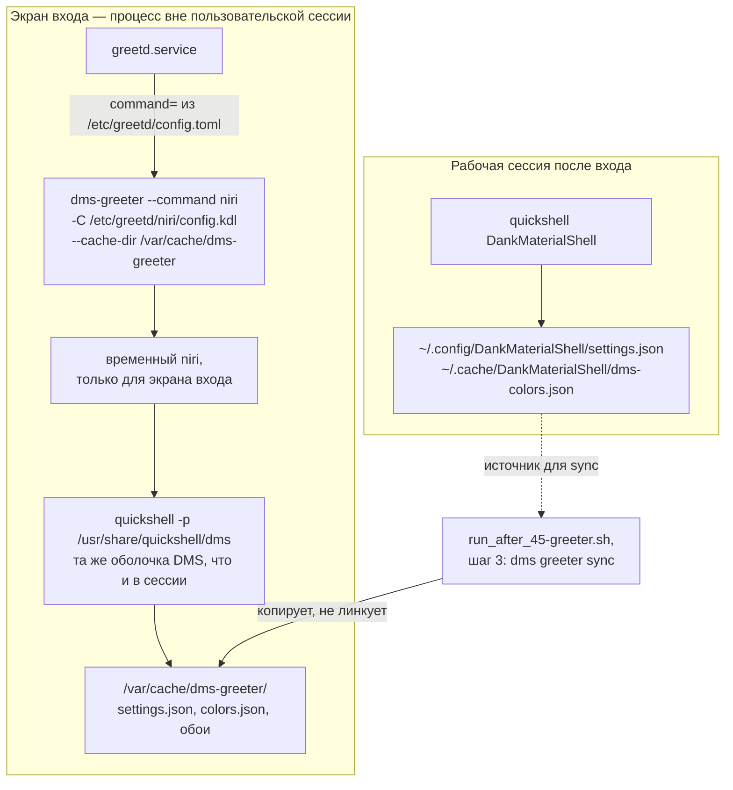
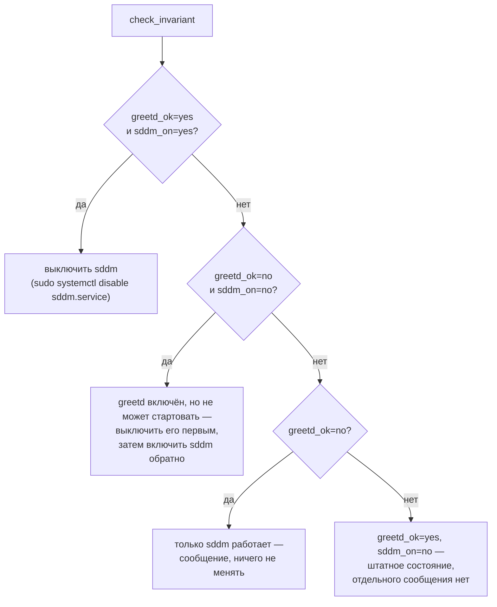

---
covers:
  features: [greeter]
  paths:
    - home/.chezmoiscripts/run_after_45-greeter.sh.tmpl
---

# Экран входа: greetd и оболочка DMS

## Что это даёт

На этой машине экран входа в систему — не отдельная программа со своим
видом, а та же самая оболочка рабочего стола (DankMaterialShell, «DMS»),
которая рисует панель и виджеты уже после входа. Она читает те же файлы темы
и обоев, что и рабочая сессия, поэтому у экрана входа не может быть своего,
рассинхронизированного вида: сменил обои — на следующий `chezmoi apply` та же
картинка появится и на экране входа.

За это отвечает `greetd` — программа-диспетчер логина общего назначения,
которая сама ничего не рисует, а просто запускает то, что ей укажут в
конфиге. Здесь ей указано запускать `dms-greeter` — обёртку, которая поднимает
временный композитор niri и в нём ту же графическую оболочку DMS. Раньше на
этой же роли стоял `sddm` — отдельная программа с собственным оформлением,
для которого пришлось бы отдельно поддерживать тему в двух копиях.

Переключение необратимо только в одну сторону не до конца: `sddm` никуда не
удаляется, он выключен, но остаётся установленным как раз на случай, если
что-то в связке `greetd` + DMS сломается. Скрипт, который держит это
переключение, видит оба варианта и по правилу «лучше рабочий экран входа
любой ценой, чем сломанный `apply`» сам возвращает `sddm`, если `greetd`
не может стартовать.

## Как это работает



Сам переход на `greetd` и вся донастройка живут в одном скрипте —
`home/.chezmoiscripts/run_after_45-greeter.sh.tmpl`. Он [шаблон
chezmoi](glossary.md#шаблон-chezmoi), рендерится только на хосте и только
если в чеклисте включена фича `greeter` (`scope: host`, `default: true` —
общий механизм чеклиста разобран в
[how-it-works.md](how-it-works.md#три-вопроса-которые-решают-судьбу-фичи));
в контейнере и при выключенной фиче всё тело шаблона схлопывается в пустой
`exit 0`.

### Почему `run_after`, а не `run_onchange`

Оба вида скриптов и общий механизм разобраны в
[how-it-works.md](how-it-works.md#два-вида-скриптов) и в
[glossary.md](glossary.md#run_onchange); здесь — только то, что специфично
для этого скрипта. `run_onchange`-скрипт перезапускается, когда меняется
**текст самого скрипта** после подстановки шаблона. Тема и обои меняются не
трогая ни строчки в `run_after_45-greeter.sh.tmpl` — значит `onchange`-версия
этого скрипта просто никогда не перезапустилась бы снова, и экран входа
навсегда остался бы с тем оформлением, с которым его увидели первый раз.
`run_after_` выполняется на каждом `chezmoi apply` безусловно, поэтому шаг 3
ниже может решать заново, устарела ли копия темы в кэше `greetd`, каждый раз.

По очерёдности внутри прохода `after` скрипт идёт под номером 45 — уже после
раскладки всех файлов конфигурации и после `44-handy-settings`, перед
`46-syncthing` (полная схема очереди — [how-it-works.md, раздел «Порядок
применения»](how-it-works.md#порядок-применения)). Это важно: к моменту
запуска `~/.config/niri/config.kdl` и `~/.config/DankMaterialShell/settings.json`
уже лежат на диске в актуальном виде — скрипту есть что читать и с чем
сверять кэш.

### Спасательный инвариант

Экран входа — вещь, которую легко сломать наполовину: применили `chezmoi
apply`, что-то на шаге переключения пошло не так, и человек, у которого прямо
сейчас работает эта же машина под этой же сессией, в следующий раз просто не
сможет войти. Правило скрипта здесь жёсткое: **ничего в нём не имеет права
уронить `apply`**, и любое незавершённое переключение обязано откатиться на
рабочий `sddm`, а не оставить машину без диспетчера логина вовсе.

За это отвечает:

```
trap 'check_invariant; exit 0' EXIT
```

Ловушка на `EXIT` взводится строкой 120 — сразу после того, как определены
`say`, `bail`, `unit_enabled`, `greetd_configured`,
`greetd_conf_present_but_unreadable` и сам `check_invariant`, но **до первой
команды, которая может завершиться неудачей**: до двух проверок `command -v
dms` / `command -v dms-greeter` (строки 122–124), которые сами вызывают
`bail`, то есть `exit 0`. Строки 1–119 — это только объявления функций,
константы (`GREETD_CONF`, `GREETER_CACHE`, `GREETER_NIRI_DIR`) и включение
`set -euo pipefail`; ни одна из них не может провалиться сама по себе, так
что ловушке буквально нечего было бы упустить, взведи её строкой раньше.
Отсюда следствие: ловушка накрывает не только шаги 1–4, но и оба ранних
`bail` — если `dms` вообще не установлен, `check_invariant` всё равно
выполнится и решит, включать ли обратно `sddm`.

Сам `check_invariant` (`home/.chezmoiscripts/run_after_45-greeter.sh.tmpl`,
функция `check_invariant`) начинается с `set +e`. Это не защита отдельной
строки, а свойство всего шелла: `set -e`/`set +e` не привязаны к функции, и
ловушка выполняет `check_invariant; exit 0` как один список команд. Без
`set +e` ненулевой код возврата от любой строки внутри `check_invariant` (а
там есть `sudo systemctl disable/enable`, которые вполне могут отказать)
прервал бы саму ловушку раньше, чем она дойдёт до `exit 0` — единственного,
что скрипт обещает никогда не пропустить. После `set +e` до конца скрипта
не остаётся ни одной строки, которая может вернуть отличный от нуля код и
что-то этим сломать: последняя строка `check_invariant` — это `say
"display-manager -> ..."`, обычный `echo`, а сразу за вызовом самой функции
в ловушке стоит буквальный `exit 0`.

**Четыре условия `greetd_ok`, в этом порядке** (`check_invariant`, условие
перед `greetd_ok=yes`):

1. `unit_enabled greetd.service` — юнит включён, иначе systemd не попытается
   его стартовать при загрузке вообще.
2. `command -v dms-greeter` — бинарник есть в `PATH`, иначе AUR-пакет не
   собрался.
3. `greetd_configured || greetd_conf_present_but_unreadable` — конфиг называет
   `dms-greeter` в строке `command`, либо (второе условие) существует, но
   недоступен на чтение этому пользователю.
4. `[[ -d "$GREETER_CACHE" ]]` — каталог `/var/cache/dms-greeter` существует;
   без него сам `dms-greeter` завершается с ошибкой и не запускается вовсе
   (подробнее — раздел «Почему именно так»).

Это ровно четыре, а не одно условие «юнит включён», потому что «включён»
(`unit_enabled`) отвечает только на вопрос «попробует ли systemd его
стартовать», а не «стартует ли он успешно». Юнит может быть включён и при
этом упасть на любом из трёх остальных условий — и тогда результат не
«вход работает», а чёрный экран.

`unit_enabled` считает включённым только буквальный `enabled`:

```
[[ "$(systemctl is-enabled "$1" 2>/dev/null || true)" == "enabled" ]]
```

`masked`, `static`, `disabled`, `not-found` и всё остальное, что может
вернуть `systemctl is-enabled`, сюда не попадает — сравнение строгое.

По тому же принципу `check_invariant` смотрит на `sddm.service`
(`sddm_on`), и дальше — три ветки:



Четвёртая комбинация (`greetd_ok=yes`, `sddm_on=no`) — рабочее состояние
машины на сегодня, и для неё нет отдельной ветки `elif`: она просто не
попадает ни в одно из трёх условий выше и не порождает предупреждения,
только финальную строку статуса.

В ветке «ни один не работает» `greetd` выключается **первым**, и это не
произвольный порядок: оба юнита претендуют на алиас `display-manager.service`
(проверить, кто именно держит его сейчас: `readlink -e
/etc/systemd/system/display-manager.service`), и включить `sddm` поверх ещё
включённого, но не рабочего `greetd`, значило бы оставить алиас указывающим
не пойми куда — ни один из двух не оказался бы реально «в силе».

#### Вторая половина той же защиты живёт в другом скрипте

Спор за алиас `display-manager.service` разбирается не только здесь. Раньше в
`run_onchange_before_30-system.sh.tmpl` стояла безусловная строка
`enable_unit sddm.service`, и на машине, где экран входа уже переехал на
`greetd`, она обречена: `greetd` держит этот алиас своим собственным
symlink'ом из секции `[Install]`, `systemctl enable sddm` пытается создать
symlink, который уже занят, и падает. А этот скрипт — `before`-стадия под
`set -euo pipefail`, поэтому падение уносит **весь** `chezmoi apply` ещё до
того, как скрипт 45 и его ловушка вообще получат слово. Ловушка не
срабатывает не потому, что плохо написана, а потому, что до неё не доходит
очередь.

Поэтому в том же коммите `55a7329`, что расширил `check_invariant` с трёх
условий до четырёх, строка в скрипте 30 стала условной:

```bash
systemctl is-enabled --quiet display-manager.service || enable_unit sddm.service
```

То есть `sddm` включается только на машине, где алиас вообще никем не занят —
на чистой. Гарантия «хоть один экран входа обязан работать» осталась там же,
где была, в ловушке скрипта 45: она отрабатывает на каждом применении.

Вывод для читателя: `check_invariant` — это страховка, а не единственная
защита. Работает она только при условии, что до неё дошла очередь, и вторая
половина работы сделана раньше, в `before`-стадии.

### Раскладка клавиатуры: теперь проверяется, а не пишется

Более ранняя версия этого скрипта писала `/etc/greetd/niri_overrides.kdl`
своей копией раскладки клавиатуры — той же строкой `layout "us,ru"` и
`options "grp:alt_shift_toggle,ctrl:swapcaps"`, что несут ещё две другие
копии, в `~/.config/niri/config.kdl` и в `30-system`
(коммит `24e19ad`, «carry the us,ru layout with swapped caps onto the login
screen»). Идея была в том, что у экрана входа якобы нет другого способа
узнать раскладку.

Идея оказалась неверной по двум причинам. Во-первых, `dms-greeter sync`
сам вычитывает раскладку из живого `~/.config/niri/config.kdl` и пишет её в
`/etc/greetd/niri/dms.kdl` — третья копия была не нужна вовсе, её роль уже
закрыта штатным механизмом. Во-вторых, порядок, в котором обёртка greetd
собирает конфиг для временного niri, делает написанный вручную override
опасным. Вот что действительно происходит внутри самой обёртки —
`/usr/share/quickshell/dms/Modules/Greetd/assets/dms-greeter`, пакет
`dms-shell` (её же логика подтверждена и в скомпилированном бинарнике
`/usr/bin/dms-greeter` из пакета `greetd-dms-greeter-git`, см. раздел
«Почему именно так»):

1. Раз в `config.toml` указан `-C /etc/greetd/niri/config.kdl`, обёртка
   копирует его целиком в начало временного файла. Сам `config.kdl`
   заканчивается строкой `include "/etc/greetd/niri/dms.kdl"` — то есть
   раскладка из `dms.kdl` уже подключена на этом шаге.
2. Только после этого обёртка проверяет `/etc/greetd/niri_overrides.kdl` и,
   если файл существует, дописывает в конец `include "$override_file"`.

Раскладка из ручного override приходит в конфиг **после** раскладки из
`dms.kdl` — вторым блоком `input`. `niri validate` это принимает без единой
жалобы. Скрипт формулирует последствие с оговоркой «если» — «if niri's
semantics for a duplicated section are last-wins, that second block silently
replaced the first one, dropping numlock, the touchpad, mouse and trackpoint
settings» (`run_after_45-greeter.sh.tmpl`, комментарий перед шагом 1) —
и это осторожная формулировка не просто так: официальная wiki niri по
`include` подтверждает, что часть содержимого `input` (секции про
устройства-указатели — touchpad, mouse, trackpoint) не сливается между
включениями, а полностью заменяется более поздним объявлением, но не
говорит прямо, что происходит с полем `numlock` внутри `keyboard`, когда
override его вовсе не упоминает. Отдельный тикет в трекере `niri-wm/niri`
или `AvengeMedia/dank-greeter` именно про эту комбинацию (override,
подключаемый после сгенерированного конфига, теряющий numlock) не найден —
искали 2026-07-31. Что точно задокументировано в самом репозитории —
последовательность коммитов: `24e19ad` завёл override, `55a7329` расширил
проверку инварианта, а `c0e2d40` убрал запись override целиком и заменил её
на шаг 4 ниже.

Шаг 1 текущей версии скрипта убирает только тот файл, что оставила именно
эта версия скрипта — по первой строке-метке:

```
STALE_OVERRIDES=/etc/greetd/niri_overrides.kdl
if [[ -f "$STALE_OVERRIDES" ]] \
   && head -n1 "$STALE_OVERRIDES" 2>/dev/null | grep -q 'Managed by chezmoi'; then
    say "removing stale $STALE_OVERRIDES"
    sudo rm -f "$STALE_OVERRIDES" || say "!! could not remove $STALE_OVERRIDES"
fi
```

Шаг 4 (последний в скрипте) проверяет результат, а не переписывает его
заново:

```
if ! grep -rq 'xkb' "$GREETER_NIRI_DIR" 2>/dev/null; then
    say "!! no keyboard layout found under $GREETER_NIRI_DIR; ..."
fi
```

`GREETER_NIRI_DIR` (`/etc/greetd/niri`) проверяется целиком через `grep -r`,
а не разбором аргумента `-C` из `config.toml` — если DMS когда-нибудь начнёт
класть синхронизированный конфиг в другое место, эта проверка честно скажет
«раскладка не найдена», а не продолжит смотреть туда, где её больше нет.

### Синхронизация темы и штамп

`dms greeter sync` копирует (не линкует) настройки, палитру и обои из живой
сессии в `/var/cache/dms-greeter`. Копирование требует повышения прав —
фактически `sudo` — поэтому вызывать его на каждом `chezmoi apply` безусловно
означало бы спрашивать пароль каждый раз, даже когда тема не менялась. От
этого — штамп `~/.cache/dms-greeter-sync.stamp` и функция `sync_needed`:

```
sync_needed() {
    [[ -f "$STAMP" ]] || return 0
    if [[ -x "$GREETER_CACHE" ]]; then
        [[ -e "$GREETER_CACHE/colors.json" ]] || return 0
        [[ -e "$GREETER_CACHE/settings.json" ]] || return 0
    fi
    [[ "$SETTINGS" -nt "$STAMP" ]] && return 0
    [[ "$COLORS" -nt "$STAMP" ]] && return 0
    return 1
}
```

Синхронизация запускается, если штампа ещё нет вовсе, либо если исходные
`~/.config/DankMaterialShell/settings.json` или
`~/.cache/DankMaterialShell/dms-colors.json` новее штампа (`-nt`), либо если
в кэше `greetd` не хватает `colors.json`/`settings.json` — то есть кэш кто-то
опустошил без ведома штампа. Из трёх файлов темы проверяются только эти два:
файл обоев в кэше называется по имени исходной картинки, а какое это имя —
отсюда неизвестно, поэтому и не проверяется.

Проверка «кэш опустошили» сама зависит от того, можно ли вообще заглянуть в
каталог: `[[ -x "$GREETER_CACHE" ]]`. Каталог `/var/cache/dms-greeter`
принадлежит `greeter:greeter` с правами `0750` (на этой машине —
`drwxrws--- greeter greeter`, подтверждено `ls -la /var/cache/` 2026-07-31), а
членство обычного пользователя в группе `greeter` появляется только со
следующим входом в систему — то есть сразу после первого переключения на
`greetd` заглянуть в кэш ещё нельзя. Скрипт в этом случае трактует «не могу
посмотреть» как «доверять штампу» и пропускает две проверки на
`colors.json`/`settings.json`: тот же принцип, что уже применён к
`greetd_conf_present_but_unreadable` выше — недоступное не считается
свидетельством поломки. Здесь это осознанный размен, который скрипт признаёт
сам: пока каталог кэша нечитаем, опустошённый кем-то кэш пройдёт
незамеченным, и единственный способ починить — вручную запустить `dms
greeter sync`.

### Переменная `DMS_PRIVESC`

Оба вызова, что меняют состояние системы — `dms greeter enable -y` (шаг 2) и
`dms greeter sync` (шаг 3) — идут с `DMS_PRIVESC=sudo` в окружении. Без неё
`chezmoi apply`, запущенный из терминала (то есть с TTY на стандартном
вводе — а именно так этот скрипт обычно и запускают), зависает насмерть на
вопросе, который `-y` не закрывает. Разбор — в «Почему именно так».

## Что ставится и что меняется

| Что | Где | Подробности |
|---|---|---|
| Пакет `greetd` | pacman, хост | диспетчер логина общего назначения, сам ничего не рисует |
| Пакет `greetd-dms-greeter-git` | AUR, хост | greetd-гример от DMS; собирается из исходников на `chezmoi apply` — долгая сборка, при падении роняет `20-packages` и весь `apply` |
| `/etc/greetd/config.toml` | вне дома | пишет `dms greeter enable` (шаг 2): строка `command = "/usr/bin/dms-greeter --command niri ..."`, пользователь `greeter` |
| `/etc/greetd/niri/config.kdl`, `/etc/greetd/niri/dms.kdl` | вне дома | пишет `dms greeter sync`; `dms.kdl` несёт скопированную раскладку, numlock, touchpad/mouse/trackpoint и мониторы |
| `/etc/greetd/niri_overrides.kdl` | вне дома | больше не пишется; шаг 1 удаляет файл, оставшийся от старой версии скрипта, если его первая строка помечена `Managed by chezmoi` |
| `/var/cache/dms-greeter/` | вне дома | `0750 greeter:greeter`; кэш темы (`colors.json`, `settings.json`, обои), пишет `dms greeter sync` |
| `~/.cache/dms-greeter-sync.stamp` | дом | штамп последней успешной синхронизации темы, пишет шаг 3 |
| systemd unit `greetd.service` | системный | включает `dms greeter enable`; выключает `check_invariant`, если не может стартовать |
| systemd unit `sddm.service` | системный | остаётся установленным (фича `desktop`); `check_invariant` включает/выключает его в зависимости от состояния `greetd` |

Фича `greeter` в `home/.chezmoidata.yaml` (`- key: greeter`): `scope: host`,
`default: true` — то есть в чеклисте `chezmoi init` галочка стоит заранее, но
это не `always`, и её можно снять.

## Как проверить

Все команды ниже только читают состояние, ничего не меняя — их можно
выполнять в любой момент, не рискуя экраном входа.

```sh
systemctl is-enabled greetd.service sddm.service
# enabled
# disabled

readlink -e /etc/systemd/system/display-manager.service
# /usr/lib/systemd/system/greetd.service

cat /etc/greetd/config.toml
# ... command = "/usr/bin/dms-greeter --command niri -p /usr/share/quickshell/dms --cache-dir /var/cache/dms-greeter -C /etc/greetd/niri/config.kdl"

grep -rl xkb /etc/greetd/niri
# /etc/greetd/niri/dms.kdl

ls -la /var/cache/dms-greeter
# Permission denied, если пользователь ещё не входил в систему после
# переключения на greetd (группа greeter подхватывается только следующим
# логином) — это ожидаемо, не ошибка
```

Вывод команд выше снят на этой машине 2026-07-31 и соответствует состоянию
«переключение на `greetd` прошло, `sddm` выключен, раскладка на месте».

## Когда сломалось

| Симптом | Причина | Что делать |
|---|---|---|
| После `apply` в терминале сообщение `!! no usable display manager is enabled` | Ни одно из четырёх условий `greetd_ok` не выполнилось целиком, и `check_invariant` уже сам вернул `sddm` | Прочитать более ранние строки `==> greeter: ...` того же вывода — `check_invariant` печатает статус каждого юнита; проверить конкретное условие (собрался ли AUR-пакет, есть ли строка `command` в `config.toml`, существует ли `/var/cache/dms-greeter`) |
| Сообщение `!! could not enable sddm either; log in from a TTY ...` | И `greetd`, и запасной `sddm` не смогли включиться | Войти с текстовой консоли (`Ctrl+Alt+F2`) под своим пользователем и разобраться руками — это единственный случай, для которого в скрипте нет автоматического пути |
| `chezmoi apply` не завершается, зависает на шаге 45 | Пропала переменная `DMS_PRIVESC=sudo` перед вызовом `dms greeter enable`/`dms greeter sync`, и `dms` ждёт выбора между `sudo`/`run0` на TTY, которого никто не увидит | `Ctrl+C`, проверить, что обе строки в скрипте по-прежнему начинаются с `DMS_PRIVESC=sudo` |
| На экране входа не работает numlock, пароль с цифровой клавиатуры не набрать | Раскладка не попала в `/etc/greetd/niri`, о чём шаг 4 обязан был предупредить сообщением `!! no keyboard layout found` | Проверить `grep -rq xkb /etc/greetd/niri`; если пусто — вручную `dms greeter sync` (спросит sudo-пароль), затем перепроверить |
| Сменил обои/тему, а на экране входа старые | `sync_needed` решила, что синхронизация не нужна — либо штамп новее источников, либо каталог кэша ещё нечитаем и опустошённый кэш остаётся незамеченным | `rm ~/.cache/dms-greeter-sync.stamp && chezmoi apply`, либо сразу вручную `dms greeter sync` |

## Почему именно так

**`DMS_PRIVESC=sudo` — не догадка, а обход задокументированного поведения.**
Логика выбора инструмента повышения прав живёт в самом `dank-greeter`
(`AvengeMedia/dank-greeter`, файл `core/internal/privesc/privesc.go`, пакет
`privesc`). Переменная `DMS_PRIVESC` — это её штатный, предусмотренный автором
способ пропустить интерактивный выбор:

```go
const EnvVar = "DMS_PRIVESC"
...
func PromptCLI(out io.Writer, in io.Reader) (Tool, error) {
    if userSelected {
        return Detect()
    }
    if _, envSet := EnvOverride(); envSet {
        return Detect()
    }
    tools := AvailableTools()
    ...
    if !stdinIsTTY() {
        return Detect()
    }
    fmt.Fprintln(out, "Multiple privilege escalation tools detected:")
    for i, t := range tools {
        fmt.Fprintf(out, "  [%d] %s\n", i+1, t.Name())
    }
    fmt.Fprintf(out, "Choose one [1-%d] (default 1, or set %s=<tool> to skip): ", len(tools), EnvVar)
    reader := bufio.NewReader(in)
    line, err := reader.ReadString('\n')
    ...
```

`PromptCLI` понятия не имеет о флаге `-y`/`--yes` команд `dms greeter
enable`/`dms greeter sync` — этот флаг закрывает другие, отдельные вопросы
самих этих команд, а выбор инструмента privesc целиком в ведении пакета
`privesc`, который проверяет только `$DMS_PRIVESC` и то, TTY ли `stdin`.
`chezmoi apply`, запущенный из терминала, наследует TTY на стандартном вводе,
поэтому без `DMS_PRIVESC` эта функция доходит до `reader.ReadString('\n')` —
блокирующего чтения строки, без какого-либо таймаута или запасного пути —
и виснет, если в этот момент никто физически не сидит и не жмёт `Enter`. На
этой машине установлены и `sudo`, и `run0` (`command -v run0` →
`/usr/bin/run0`), но не `doas` — отсюда и ровно два варианта в подсказке,
которую цитирует комментарий скрипта: `[1] sudo [2] run0`.

**`dms-greeter` действительно отказывается стартовать без каталога кэша.**
Комментарий над четвёртым условием `greetd_ok` ссылается на
`/usr/share/quickshell/dms/Modules/Greetd/assets/dms-greeter` — это
bash-обёртка, часть пакета `dms-shell` (не той же, что реально стоит в
`/usr/bin/dms-greeter` — тот принадлежит отдельному пакету
`greetd-dms-greeter-git` и оказался скомпилированным Go-бинарником, а не
скриптом). Обе версии проверены на этой машине 2026-07-31: в bash-версии
буквально есть

```sh
if [[ ! -d "$CACHE_DIR" ]]; then
    echo "Error: cache directory '$CACHE_DIR' does not exist." >&2
    echo "  Run 'dms greeter sync' to initialize it, or pass --cache-dir to an existing directory." >&2
    exit 1
fi
```

а в скомпилированном `/usr/bin/dms-greeter` та же самая строка находится
через `strings` дословно: `cache directory %q does not exist.\n  Run
'dms-greeter sync' to initialize it, or pass --cache-dir to an existing
directory`. То есть какая бы из двух реализаций ни оказалась на машине
физически, поведение одно и то же, и четвёртое условие `greetd_ok`
проверяет ровно то, что действительно требуется бинарнику для старта — не
на будущее, а по факту.

**Почему `greetd_configured` и `greetd_conf_present_but_unreadable`
расходятся между шагом 2 и `check_invariant`.** На шаге 2 (`if !
greetd_configured; then ... dms greeter enable ...`) нечитаемый
`config.toml` трактуется как «ещё не настроено» — грубее, но безопаснее:
цена ошибки здесь — лишний вызов `dms greeter enable`, а значит лишний
запрос пароля на каждом `apply`, не более того. В `check_invariant` цена
другая: спутать нечитаемый (но рабочий) конфиг с отсутствующим означает
выключить уже работающий `greetd`, оставив человека без экрана входа. Ради
этого `check_invariant` берёт оба условия через `||`, а шаг 2 — только одно.

## Ссылки

- [dank-greeter, AvengeMedia/dank-greeter](https://github.com/AvengeMedia/dank-greeter) —
  апстрим самого greetd-гримера (`dms-greeter`, `dms greeter enable/sync`,
  пакет `privesc`); про override там написано в `README.md`, раздел
  `Configuration` → `Compositor`: «`dms-greeter sync` writes the generated
  greeter config to `/etc/greetd/niri/config.kdl`. Add local manual tweaks in
  `/etc/greetd/niri_overrides.kdl`».
- [DankMaterialShell, AvengeMedia/DankMaterialShell](https://github.com/AvengeMedia/DankMaterialShell) —
  сама оболочка DMS, которую видно и в сессии, и на экране входа; описана в
  [desktop.md](desktop.md).
- [Configuration: Include, niri-wm/niri wiki](https://github.com/niri-wm/niri/wiki/Configuration:-Include) —
  документированное поведение `include` в конфиге niri: позиционный override,
  и отдельно — какие секции не сливаются между включениями.
- [greetd, ~kennylevinsen/greetd](https://git.sr.ht/~kennylevinsen/greetd) —
  сам диспетчер логина, из пакета `greetd`.
- [glossary.md](glossary.md) — термины: [шаблон
  chezmoi](glossary.md#шаблон-chezmoi), [`run_onchange`](glossary.md#run_onchange),
  [Systemd unit](glossary.md#systemd-unit).
- [how-it-works.md](how-it-works.md) — устройство каталога фич и очередь
  скриптов `chezmoi apply`.
- [desktop.md](desktop.md) — сама оболочка DMS и niri рабочей сессии.
- [keyboard.md](keyboard.md) — остальные две копии раскладки клавиатуры
  (`~/.config/niri/config.kdl` и `30-system`) и защита от `localectl`.
- [workarounds.md](workarounds.md) — обход `DMS_PRIVESC=sudo` в общем
  реестре.
