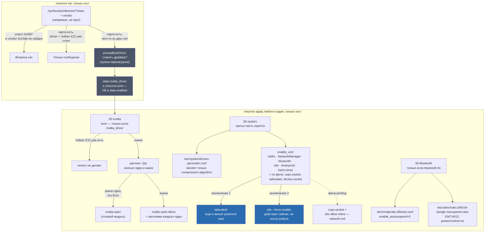

---
covers:
  features: [printing, bluetooth-fix]
  paths:
    - home/.chezmoiscripts/run_onchange_before_35-nvidia.sh.tmpl
    - home/.chezmoiscripts/run_onchange_before_50-bluetooth.sh.tmpl
    - home/.chezmoiscripts/run_onchange_before_30-system.sh.tmpl
---

# Железо: NVIDIA, zram, сервисы, печать и Bluetooth-донгл

## Что это даёт

Пять разных, не связанных друг с другом вещей, которые тем не менее решает
один и тот же слой репозитория:

- **Карта NVIDIA** получает рабочий драйвер и Vulkan сама, без ручного
  `pacman -S nvidia...` и без гадания, какой именно пакет нужен этому
  железу. Спрашивается это один раз, при самой первой настройке машины.
- **Своп** (память на диске, куда сбрасывается то, что не поместилось в
  оперативную) живёт сжатым прямо в оперативной памяти (zram), а не на диске —
  быстрее и не изнашивает SSD.
- **Фоновые сервисы** (сеть, Bluetooth, файрвол, синхронизация времени,
  еженедельная чистка SSD) включаются сами при первой настройке, чтобы не
  держать в голове чеклист «что ещё нужно включить руками».
- **Сетевой принтер** становится видимым в списке принтеров — без этого он
  физически подключён, но программы его не находят.
- **Один конкретный дешёвый USB-адаптер Bluetooth** (`10d7:b012`) перестаёт
  пропадать через пару секунд после каждой загрузки — без фикса он в системе
  виден, но ни с одним устройством не соединяется.

Общее для первых трёх пунктов и печати: за них отвечают всего два скрипта,
`35-nvidia` и большая часть `30-system`. Но `30-system` — не только про это:
тот же файл первым делом настраивает клавиатуру
([keyboard.md](keyboard.md)) и файрвол ([network.md](network.md)), и это уже
не тема этого документа.

## Как это работает



### NVIDIA: вопрос при `init`, а не фича каталога

В `home/.chezmoi.toml.tmpl` есть блок, помеченный комментарием «hardware-dependent
follow-up», который не входит в обычный чеклист фич
(`home/.chezmoidata.yaml`). У него другая механика:

```sh
{{- $hasNvidia := eq (output "sh" "-c" "for d in /sys/bus/pci/devices/*/; do c=$(cat \"$d/class\" 2>/dev/null); v=$(cat \"$d/vendor\" 2>/dev/null); case \"$c\" in 0x030*) [ \"$v\" = 0x10de ] && { echo yes; exit 0; };; esac; done; echo no" | trim) "yes" -}}
{{-   $gpuReady := eq (output "sh" "-c" "[ -e /dev/nvidiactl ] && [ -e /usr/share/vulkan/icd.d/nvidia_icd.json ] && echo yes || echo no" | trim) "yes" -}}
{{-   if and $hasNvidia (not $gpuReady) -}}
{{-     $nvidiaDriver = promptBoolOnce . "nvidia_driver" "Install the NVIDIA driver and Vulkan runtime (needs a reboot)" -}}
```

`0x030*` — класс устройства PCI «Display controller» (VGA-контроллер и его
разновидности), `0x10de` — идентификатор производителя NVIDIA. Комментарий над
блоком объясняет оба выбора буквально:

> Asked at init rather than mid-apply because installing a driver requires a
> reboot, and that has to be said up front. `/sys/bus/pci` is read directly
> because `lspci` lives in `pciutils`, which a minimal install may not have.

Живая проверка на этой машине (2026-07-31, только чтение):

```sh
$ for d in /sys/bus/pci/devices/*/; do c=$(cat "$d/class" 2>/dev/null); v=$(cat "$d/vendor" 2>/dev/null); [ "$c" = 0x030000 ] && [ "$v" = 0x10de ] && echo "$d"; done
/sys/bus/pci/devices/0000:06:00.0/
$ ls /dev/nvidiactl /usr/share/vulkan/icd.d/nvidia_icd.json
/dev/nvidiactl  /usr/share/vulkan/icd.d/nvidia_icd.json
$ pacman -Qi nvidia-open | head -2
Name            : nvidia-open
Version         : 610.43.03-9
```

На этой машине карта уже найдена и готова (`$gpuReady` = true), поэтому вопрос
не задаётся — только сообщение `NVIDIA GPU with a working Vulkan runtime
detected.`.

**Важно, где хранится ответ.** `nvidia_driver` — не элемент `data.enabled` (как
обычные фичи каталога), а отдельное поле `data.nvidia_driver`. Комментарий в
самом файле объясняет почему: «This is not a checklist feature because
whether it is wanted is a property of the machine, not a preference: the probe
answers it». Из этого следует нетривиальное свойство: в отличие от
`data.enabled`, которое `chezmoi init` без `--prompt` не трогает (см.
[install.md](install.md), «Как поменять выбор потом»), `nvidia_driver`
**пересчитывается заново при каждом `chezmoi init`**, а не хранится
неизменно. Переменная `$nvidiaDriver` в шаблоне всегда стартует с `false`;
`promptBoolOnce` вызывается — и может вернуть сохранённый ответ — только если
в момент этого конкретного рендера `$hasNvidia` истинно и `$gpuReady` ложно.
Как только драйвер и Vulkan ICD появились (после перезагрузки и первого
успешного прогона `35-nvidia`), следующий голый `chezmoi init` эту ветку не
войдёт вовсе, и `data.nvidia_driver` в перезаписанном `chezmoi.toml` тихо
станет `false` — не потому что кто-то передумал, а потому что поле не
«помнит» прошлый ответ, а каждый раз заново спрашивает железо. Практических
последствий это не несёт: `35-nvidia` и так не сделал бы ничего лишнего
(у него собственная проверка на файл ICD ниже), но это ключевое отличие от
устройства обычных фич каталога, о котором стоит знать, если когда-нибудь
понадобится читать это поле напрямую.

### `35-nvidia`: nvidia-open против nvidia-open-dkms

Скрипт входит в тело только если `.nvidia_driver` истинно
(`{{- if not .nvidia_driver }} exit 0 {{- else }}`), и первым делом
перепроверяет то же самое, что уже проверял `init`:

```sh
if [[ -e /usr/share/vulkan/icd.d/nvidia_icd.json ]]; then
    echo "==> NVIDIA Vulkan runtime already present, nothing to do."
    exit 0
fi
```

Комментарий объясняет пустое место в списке пакетов: «Note what is NOT here:
the `cuda` package. Nothing in this setup uses CUDA — both the desktop and
Whisper inside Handy reach the GPU through Vulkan». `docs/features.md` (раздел
`voice`) подтверждает то же самое с другой стороны: whisper.cpp внутри Handy
на Linux работает через Vulkan-бэкенд, не CUDA.

Выбор между `nvidia-open` и `nvidia-open-dkms`:

```sh
mapfile -t kernels < <(pacman -Qq 2>/dev/null | grep -xE 'linux|linux-lts|linux-zen|linux-hardened' || true)
if [[ ${#kernels[@]} -eq 1 && ${kernels[0]} == linux ]]; then
    pkgs+=(nvidia-open)
else
    pkgs+=(nvidia-open-dkms)
    for k in "${kernels[@]}"; do pkgs+=("${k}-headers"); done
fi
```

Признак простой: ровно один установленный пакет ядра, и это именно `linux`
(обычное, не LTS/zen/hardened) — тогда `nvidia-open`, чей собранный модуль
целится в стоковое ядро. Во всех остальных случаях (несколько ядер сразу,
либо единственное ядро — не `linux`) идёт `nvidia-open-dkms` плюс пакет
заголовков для каждого найденного ядра, чтобы DKMS было из чего собирать
модуль при каждом обновлении ядра. Живая проверка на этой машине (2026-07-31):

```sh
$ pacman -Qq | grep -xE 'linux|linux-lts|linux-zen|linux-hardened'
linux
$ pacman -Qi nvidia-open | head -1
Name            : nvidia-open
$ pacman -Qi nvidia-open-dkms 2>&1
error: package 'nvidia-open-dkms' was not found
```

Ровно один пакет ядра, и это `linux` — ветка `nvidia-open` сработала,
подтверждено фактическим составом пакетов на машине.

### zram: меняется только алгоритм сжатия

```sh
ZRAM_CONF=/etc/systemd/zram-generator.conf
if [[ ! -f "$ZRAM_CONF" ]] || ! grep -q 'compression-algorithm = zstd' "$ZRAM_CONF"; then
    sudo tee "$ZRAM_CONF" >/dev/null <<'ZRAM'
[zram0]
compression-algorithm = zstd
ZRAM
fi
```

Файл содержит ровно одну настройку помимо секции `[zram0]` — алгоритм
сжатия. Размер устройства нигде не задан, значит действует значение по
умолчанию самого `zram-generator`: по `zram-generator.conf(5)`, опция
`zram-size=` — «Defaults to `min(ram / 2, 4096)`» (мегабайт). Проверено вживую
2026-07-31 — на машине с 31 ГиБ оперативной памяти получившееся устройство:

```sh
$ zramctl
NAME       ALGORITHM DISKSIZE  DATA COMPR TOTAL STREAMS MOUNTPOINT
/dev/zram0 zstd            4G 62.9M 12.4M 15.8M         [SWAP]
```

`min(31/2, 4)` ГиБ = `min(15.5, 4)` = `4` ГиБ — ровно то, что показывает
`DISKSIZE`. Формула по умолчанию подтверждена и результатом на реальном
железе, а не только текстом мануала.

### Сервисы: полный список и два отступления от «без `--now`»

```sh
enable_unit() {
    if ! systemctl is-enabled --quiet "$unit" 2>/dev/null; then
        sudo systemctl enable "$unit"
    fi
}
```

Комментарий над функцией объясняет общее правило: «enable without `--now`:
there is no reason to bounce sddm in the middle of a running session,
everything comes up on the next boot». Полный список того, что проходит через
`enable_unit`:

- всегда: `sddm.service` (только если `display-manager.service` ещё ничем не
  занят — иначе занял `greetd`, см. ниже), `NetworkManager.service`,
  `bluetooth.service`, `ufw.service`, `systemd-timesyncd.service`,
  `fstrim.timer`;
- по фиче `printing`: `cups.socket`;
- по фиче `tailscale` (`always: true`, см. [network.md](network.md)):
  `tailscaled.service`;
- по фиче `docker`: `docker.socket`.

Из всей группы **ровно два** пункта не ждут следующей перезагрузки:

1. **`tailscaled.service`** получает не только `enable`, но и явный
   `systemctl start`, если ещё не `active`. Причина — прямая зависимость по
   данным, а не по коду: следующий шаг установки, ручной `sudo tailscale up`,
   не может авторизоваться без уже работающего демона (разобрано подробно в
   [network.md](network.md), раздел «Tailscale: безусловно»).
2. **`ufw`** включается не через `enable_unit`, а собственной командой:
   `sudo ufw --force enable` — она меняет действующие правила ядра
   немедленно, а не только юнит для следующей загрузки (подробности и
   идемпотентность — тоже в [network.md](network.md)).

Комментарий отдельно объясняет, почему `set -e` в начале скрипта не рискует
уронить весь `apply` на первом же `enable_unit`: «Every unit below is backed
by a package in the catalogue — `systemctl enable` on a missing unit fails».
Действительно, все шесть безусловных юнитов приходят пакетами из каталога
или напрямую из `base`: `NetworkManager.service`/`bluetooth.service`/
`ufw.service`/`sddm.service` — из фич `host-base`/`desktop`, а
`systemd-timesyncd.service` (пакет `systemd`) и `fstrim.timer` (пакет
`util-linux`) в каталоге вообще не упомянуты — оба входят транзитивно вместе
с метапакетом `base`, тем же путём, что и `kbd` в [keyboard.md](keyboard.md)
(проверено на этой машине: `pacman -Qi base` перечисляет и `systemd`, и
`util-linux` прямо в `Depends On`).

**Отдельно про `sddm`.** Строка `systemctl is-enabled --quiet
display-manager.service || enable_unit sddm.service` не включает `sddm`
безусловно — только если ничто ещё не держит алиас `display-manager.service`.
На этой машине греетер уже переключён на `greetd` ([greeter.md](greeter.md)),
и живая проверка (2026-07-31, см. также [keyboard.md](keyboard.md)) это
подтверждает:

```sh
$ systemctl is-enabled greetd.service sddm.service
enabled
disabled
```

### Печать: сокет-активация CUPS

Фича `printing` (`scope: host`, `default: true`) ставит три пакета —
`cups`, `cups-pk-helper`, `system-config-printer`. Комментарий в каталоге
объясняет, зачем здесь `cups-pk-helper`, хотя это не сам демон печати: «это
также то, что позволяет DankMaterialShell управлять принтерами из
собственного интерфейса, поэтому пакет здесь, а не в фиче рабочего стола».

Сама активация в `30-system`:

```sh
{{- if has "printing" .enabled }}
enable_unit cups.socket
```

`cups.socket` — сокет-активация: systemd слушает Unix-сокет CUPS и запускает
демон `cups.service` только при первом реальном обращении, а не держит его в
памяти вхолостую. Проверено вживую 2026-07-31:

```sh
$ systemctl status cups.socket --no-pager | head -6
● cups.socket - CUPS Scheduler
     Loaded: loaded (/usr/lib/systemd/system/cups.socket; enabled; preset: disabled)
     Active: active (running)
   Triggers: ● cups.service
     Listen: /run/cups/cups.sock (Stream)
```

Следом идёт открытие mDNS в `ufw`, без которого сетевой принтер физически
подключён, но не появляется в списке — это уже собственность
[network.md](network.md) (раздел «Файрвол: закрыто снаружи, открыто изнутри»,
включая находку, что `ufw allow mdns` открывает не только udp, как говорит
соседний комментарий, но и tcp/5353 тоже), здесь не повторяется.

### Bluetooth: лечение донгла `10d7:b012`

Фича `bluetooth-fix` (`scope: host`, без `default` — включается вручную) не
ставит ни одного пакета — только два конфига. Комментарий в начале скрипта
описывает симптом и диагноз буквально:

> Cheap USB Bluetooth dongles do not survive USB runtime autosuspend. On this
> host (`10d7:b012` "Actions general adapter") `btusb` suspends the device 2s
> after `hci0` registers — i.e. in the middle of HCI initialisation — and it
> never answers again. The kernel logs `Bluetooth: hci0: Opcode 0x1004
> failed: -110`.

Опкод `0x1004` (OGF 4, OCF 4) в спецификации HCI — команда «Read Local
Extended Features», один из первых запросов при инициализации контроллера;
код `-110` — это `ETIMEDOUT`. То есть контроллер перестаёт отвечать
буквально посреди штатного диалога инициализации, а не до и не после него.

Лечение двойное:

```sh
sudo tee "$MODPROBE_CONF" >/dev/null <<'EOF'
options btusb enable_autosuspend=0
EOF

sudo tee "$UDEV_RULE" >/dev/null <<'EOF'
ACTION=="add", SUBSYSTEM=="usb", ATTR{idVendor}=="10d7", ATTR{idProduct}=="b012", TEST=="power/control", ATTR{power/control}="on"
EOF
sudo udevadm control --reload
```

Первое — параметр модуля `btusb`, второе — правило udev, которое подкладывает
`power/control=on` конкретно этому устройству на случай, если что-то другое
включит автоусыпление обратно уже после того, как `btusb` привязался к
устройству. Оба — задокументированные, штатные механизмы ядра, а не патч
самого драйвера: `modinfo btusb` на этой машине подтверждает существование и
смысл параметра —

```sh
$ modinfo btusb | grep autosuspend
parm:           enable_autosuspend:Enable USB autosuspend by default (bool)
```

— то есть репозиторий не обходит баг `btusb`, а использует его собственную,
предусмотренную ручку. Что здесь всё же является обходом чужого поведения —
сама необходимость трогать эту ручку из-за конкретно этого дешёвого чипа —
разобрано в [реестре обходов](workarounds.md).

Действует со следующей загрузки; скрипт печатает готовую команду, чтобы
применить прямо сейчас без перезагрузки:

```sh
sudo systemctl stop bluetooth && sudo modprobe -r btusb && sudo modprobe btusb && sudo systemctl start bluetooth
```

Эта команда не выполнялась в рамках этой задачи — она трогает загруженные
модули ядра и сам донгл, что здесь под запретом; поведение проверено только
чтением кода и текущего состояния уже исправленной машины ниже.

## Что ставится и что меняется

| Что | Где | Когда |
|---|---|---|
| Пакеты `nvidia-utils`, `libva-nvidia-driver`, `vulkan-icd-loader` + (`nvidia-open` или `nvidia-open-dkms` и заголовки ядер) | хост, pacman | `35-nvidia`, только если `data.nvidia_driver = true` и ICD ещё нет |
| `data.nvidia_driver` | `~/.config/chezmoi/chezmoi.toml`, поле `[data]` | пересчитывается на каждом `chezmoi init` по живому состоянию железа, не хранится как обычная фича |
| `/etc/systemd/zram-generator.conf` | вне дома | `30-system`, если строки `compression-algorithm = zstd` ещё нет |
| Устройство `/dev/zram0`, 4 ГиБ на этой машине | ядро, через `zram-generator` | создаётся при загрузке из конфига выше, chezmoi его не трогает напрямую |
| Юниты `sddm.service`\*, `NetworkManager.service`, `bluetooth.service`, `ufw.service`, `systemd-timesyncd.service`, `fstrim.timer` | системные | `30-system`: `enable`, без `--now`, при каждом прогоне |
| Юнит `cups.socket` | системный | `30-system`, если выбрана `printing`: `enable`, без `--now` |
| Юнит `tailscaled.service` | системный | `30-system`, всегда (`tailscale` — `always: true`): `enable` + явный `start` |
| Юнит `docker.socket` | системный | `30-system`, если выбрана `docker`: `enable`, без `--now` |
| Политика `ufw`: `deny incoming`, `allow outgoing`, `--force enable` | хост | `30-system`, один раз — действует немедленно, не после ребута |
| Пакеты `cups`, `cups-pk-helper`, `system-config-printer` | хост, pacman | фича `printing`, `default: true` |
| `/etc/modprobe.d/btusb.conf` | вне дома | `50-bluetooth`, только если выбрана `bluetooth-fix` |
| `/etc/udev/rules.d/50-bt-dongle-nosuspend.rules` | вне дома | там же |

\* `sddm.service` включается условно — только если ничто ещё не держит
`display-manager.service` (см. «Сервисы» выше и [greeter.md](greeter.md)).

Тот же скрипт `30-system` первой третью настраивает раскладку клавиатуры
([keyboard.md](keyboard.md)) и последней третью — файрвол `ufw` и туннели
([network.md](network.md)); в этой таблице — только его средняя часть
(zram, сервисы) плюс печать и Bluetooth из соседних скриптов.

## Как проверить

Все команды ниже только читают состояние. Сняты на этой машине 2026-07-31.

NVIDIA:

```sh
$ pacman -Qi nvidia-open | head -2
Name            : nvidia-open
Version         : 610.43.03-9
$ ls /dev/nvidiactl /usr/share/vulkan/icd.d/nvidia_icd.json
/dev/nvidiactl  /usr/share/vulkan/icd.d/nvidia_icd.json
```

zram:

```sh
$ cat /etc/systemd/zram-generator.conf
[zram0]
compression-algorithm = zstd
$ zramctl
NAME       ALGORITHM DISKSIZE  DATA COMPR TOTAL STREAMS MOUNTPOINT
/dev/zram0 zstd            4G 62.9M 12.4M 15.8M         [SWAP]
$ cat /proc/swaps
Filename                                Type            Size            Used            Priority
/dev/zram0                              partition       4194300         67848           100
```

Сервисы:

```sh
$ systemctl is-enabled NetworkManager.service bluetooth.service ufw.service \
    systemd-timesyncd.service fstrim.timer cups.socket docker.socket tailscaled.service
enabled
enabled
enabled
enabled
enabled
enabled
enabled
enabled
$ systemctl is-active tailscaled.service
active
```

Печать:

```sh
$ systemctl status cups.socket --no-pager | head -5
● cups.socket - CUPS Scheduler
     Loaded: loaded (/usr/lib/systemd/system/cups.socket; enabled; preset: disabled)
     Active: active (running)
   Triggers: ● cups.service
     Listen: /run/cups/cups.sock (Stream)
```

Bluetooth-донгл (машина, где фикс уже применён — донгл сейчас является
основным контроллером и работает):

```sh
$ cat /etc/modprobe.d/btusb.conf
options btusb enable_autosuspend=0
$ cat /etc/udev/rules.d/50-bt-dongle-nosuspend.rules
ACTION=="add", SUBSYSTEM=="usb", ATTR{idVendor}=="10d7", ATTR{idProduct}=="b012", TEST=="power/control", ATTR{power/control}="on"
$ cat /sys/class/bluetooth/hci0/device/uevent | grep PRODUCT
PRODUCT=10d7/b012/8891
$ bluetoothctl list
Controller F4:4E:FC:51:C5:AA tsikhanau-pc [default]
```

`hci0` на этой машине — именно этот донгл (`PRODUCT=10d7/b012/...`), и он
успешно зарегистрирован как контроллер по умолчанию — фикс действует.

## Когда сломалось

| Симптом | Причина | Что делать |
|---|---|---|
| При установке не спросило про драйвер NVIDIA, хотя карта есть | Вопрос задаётся, только если `/dev/nvidiactl` **и** Vulkan ICD ещё не оба на месте — если что-то из этого уже стоит (например, драйвер ставили руками раньше), вопроса не будет | `ls /dev/nvidiactl /usr/share/vulkan/icd.d/nvidia_icd.json` — если оба уже есть, драйвер и не нужен |
| `35-nvidia` ничего не поставил, хотя ответили «да» | Вулкан ICD уже был на диске в момент прогона — скрипт видит готовый файл и молча выходит | `ls /usr/share/vulkan/icd.d/nvidia_icd.json`; если он есть, всё уже поставлено |
| DKMS-сборка `nvidia-open-dkms` падает на нестандартном ядре | Скрипт узнаёт только четыре имени пакета ядра (`linux`, `linux-lts`, `linux-zen`, `linux-hardened`); ядро с другим именем (например, из AUR) не попадёт в список, и заголовки для него не будут добавлены в `pkgs` вовсе | Поставить `<имя-ядра>-headers` руками: `sudo pacman -S <ядро>-headers` |
| Один из юнитов не включился, `apply` упал на `30-system` | Пакет, дающий этот юнит, ещё не установлен (например, `docker` выбрали, но фича не успела поставить пакет из-за сетевого сбоя на `20-packages`) | Проверить `systemctl status <юнит>`; при отсутствии юнита — `pacman -Qo` на его файл, переустановить пакет, повторить `chezmoi apply` |
| Сетевой принтер не виден | Правило `mdns` не открыто в `ufw`, либо принтер сетевой, а не USB | Разобрано в [network.md](network.md#когда-сломалось) |
| Bluetooth: «no adapters found», хотя донгл виден в системе | `enable_autosuspend=0` ещё не применился (машина не перезагружалась после `chezmoi apply` с этой фичой) | `cat /etc/modprobe.d/btusb.conf` — если строка уже там, но не подействовала: `sudo systemctl stop bluetooth && sudo modprobe -r btusb && sudo modprobe btusb && sudo systemctl start bluetooth` (команда из вывода самого скрипта) |
| Тот же симптом на другом донгле (не `10d7:b012`) | Правило udev жёстко привязано к `idVendor`/`idProduct` этого конкретного устройства и на другой донгл не сработает | Добавить отдельное правило udev для нового `idVendor:idProduct`, по образцу существующего |

## Почему именно так

### `/sys/bus/pci` вместо `lspci` — обоснование не подтвердилось для этой машины

Комментарий в `home/.chezmoi.toml.tmpl` называет причину: «`lspci` lives in
`pciutils`, which a minimal install may not have». Проверка по факту, на этой
же машине (2026-07-31):

```sh
$ pacman -Qi pciutils | grep -E 'Required By|Install Reason'
Required By     : base  chromium
Install Reason  : Installed as a dependency for another package
$ pacman -Qi base | grep 'Depends On'
Depends On      : filesystem  gcc-libs  glibc  bash  coreutils  file  findutils  gawk  grep  procps-ng  sed  tar  gettext  pciutils  psmisc  shadow  util-linux  bzip2  gzip  xz  licenses  pacman  archlinux-keyring  systemd  systemd-sysvcompat  iputils  iproute2
```

`pciutils` — прямая, обязательная зависимость самого метапакета `base`
(подтверждено и страницей пакета, [archlinux.org/packages/core/any/base](https://archlinux.org/packages/core/any/base/)).
Эта же машина ставилась именно через `base`
(`/var/log/pacman.log`: `pacman -Sy --noconfirm --needed ... base sudo
linux-firmware mkinitcpio linux amd-ucode`) — значит `lspci` был гарантированно
доступен уже на этапе `chezmoi init`, и обоснование «минимальная установка
может не иметь `lspci`» для машины, поставленной штатным способом из
[install.md](install.md), не подтверждается. Это не значит, что сам приём
плох: чтение `/sys/bus/pci` напрямую работает без единой внешней зависимости
и ничем не хуже `lspci` для этой узкой задачи (определить наличие и вендора
одной карты), но конкретная причина в комментарии проверке не прошла для
штатного пути установки этого репозитория. Отдельная строка про это — в
[реестре обходов](workarounds.md).

### `--now` — только там, где без него следующий шаг не может сработать

Общее правило («никого не перезапускать посреди сессии, всё доедет до
перезагрузки») ломается ровно там, где следующий шаг чеклиста физически не
может обойтись без работающего сервиса прямо сейчас (`tailscaled`, чтобы
`tailscale up` было к чему подключаться) или где сама программа не разделяет
«включено» и «действует» (`ufw enable` — это не юнит, который можно
отложить, а команда, которая меняет таблицы ядра тут же). У всех остальных
юнитов такой немедленной зависимости нет.

### zram: почему меняют только алгоритм, а не размер

Формула размера по умолчанию (`min(ram/2, 4096)` МБ,
[zram-generator.conf(5)](https://man.archlinux.org/man/zram-generator.conf.5))
на этой машине даёт 4 ГиБ при 31 ГиБ оперативной памяти — этого достаточно
для сжатого свопа без отдельной настройки. Алгоритм меняют, потому что
`zstd` даёт заметно лучшее сжатие, чем `lzo-rle` по умолчанию, ценой
процессора, которая рядом со свопом на диск не имеет значения.

## Ссылки

- [`zram-generator.conf(5)`, man.archlinux.org](https://man.archlinux.org/man/zram-generator.conf.5) —
  синтаксис конфига, формула размера по умолчанию.
- [`archlinux.org/packages/core/any/base`](https://archlinux.org/packages/core/any/base/) —
  зависимости метапакета `base`, включая `pciutils`, `systemd`, `util-linux`.
- `modinfo btusb` (локальная команда, не веб-ссылка) — параметр
  `enable_autosuspend`, официальное описание модуля.
- [Bluetooth: Fix issue with Actions Semi ATS2851 based devices, linux-bluetooth](https://www.spinics.net/lists/linux-bluetooth/msg102121.html) —
  патч апстрима для этого же устройства (`10d7:b012`), другая проблема
  (ошибочно заявленная поддержка erroneous data reporting), но подтверждает,
  что модель известна разработчикам ядра.
- [Bluetooth: btusb: Make the CSR clone chip force-suspend workaround more generic, linux-bluetooth](https://yhbt.net/lore/all/906e95ce-b0e5-239e-f544-f34d8424c8da@gmail.com/) —
  прецедент того же класса бага (автоусыпление рвёт инициализацию HCI) на
  другом дешёвом чипе, тот же класс проблемы, не то же устройство.
- [Bug #2056800, Ubuntu launchpad](https://bugs.launchpad.net/bugs/2056800),
  [Arch Linux Forums #280693](https://bbs.archlinux.org/viewtopic.php?id=280693),
  [damentz/liquorix-package#120](https://github.com/damentz/liquorix-package/issues/120) —
  независимые отчёты про этот же `10d7:b012` (UGREEN CM591 / ATS2851) с
  другими опкодами ошибок (`0x204b`, `0xc5a`), не автоусыплением — картина
  устройства с историей разных проблем на Linux, а не одной.
- [`torvalds/linux`, `drivers/bluetooth/btusb.c`](https://github.com/torvalds/linux/blob/master/drivers/bluetooth/btusb.c) —
  запись `USB_DEVICE(0x10d7, 0xb012)` с квирком `BTUSB_ACTIONS_SEMI` (не
  связан с автоусыплением) и функция `btusb_setup_csr` (детектор поддельных
  CSR-чипов, не относится к этому устройству).
- [workarounds.md](workarounds.md) — обходы: чтение `/sys/bus/pci` вместо
  `lspci`, лечение донгла `10d7:b012`.
- [keyboard.md](keyboard.md) — первая треть скрипта `30-system` (клавиатура)
  и приём проверки состояния перед `sudo`.
- [network.md](network.md) — последняя треть того же скрипта (firewall,
  Tailscale, Ziti), включая полный разбор `ufw allow mdns`.
- [greeter.md](greeter.md) — почему `sddm.service` включается условно.
- [install.md](install.md) — как эта машина была установлена (`base` через
  `pacstrap`-подобный вызов, откуда берётся `pciutils`).
- [features.md](features.md) — исходное описание фич `printing`,
  `bluetooth-fix` и раздела про NVIDIA/zram, из которого эта тема выделена в
  отдельный документ.
