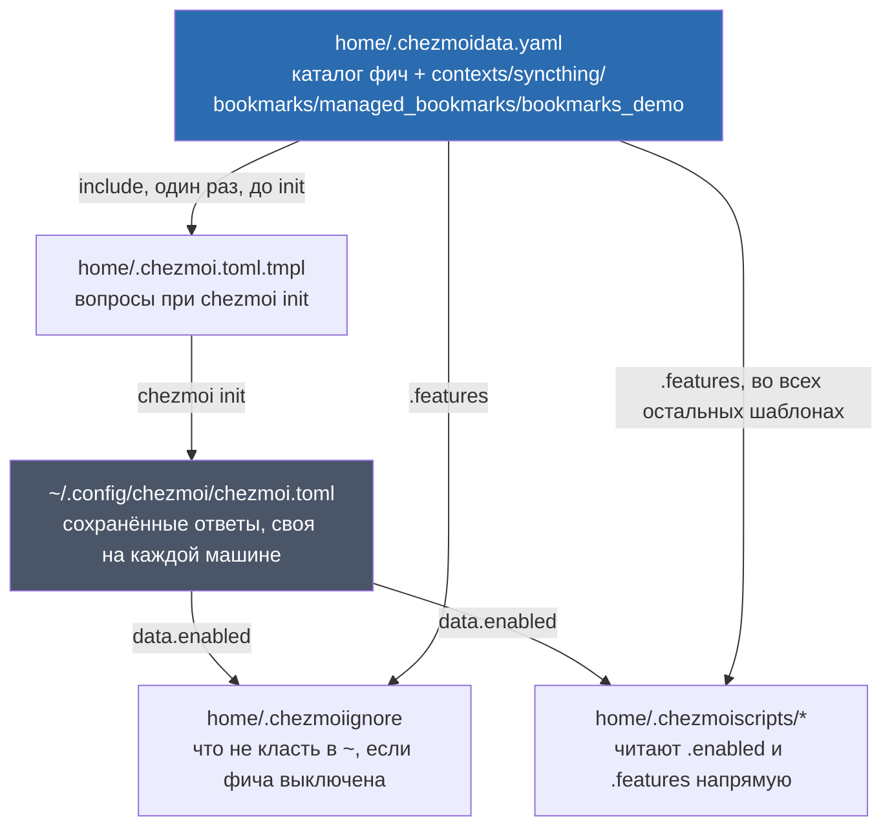
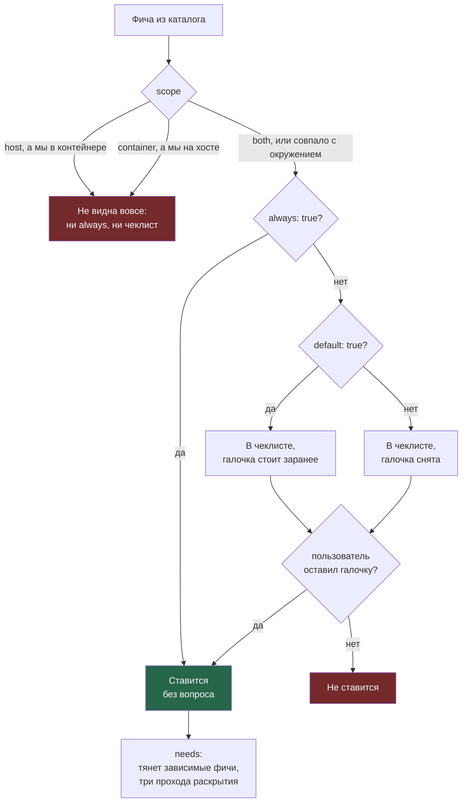
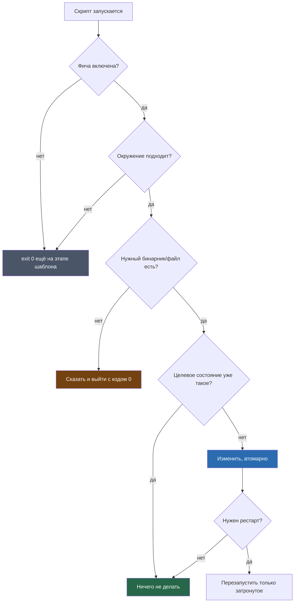
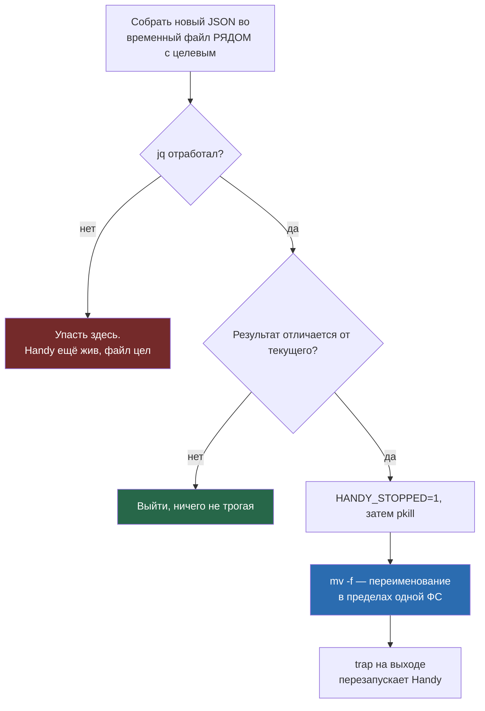

---
covers:
  features: []
  paths:
    - home/.chezmoidata.yaml
    - home/.chezmoi.toml.tmpl
    - home/.chezmoiignore
---

# Как chezmoi применяет эту конфигурацию

Одиннадцать документов в этом каталоге уже сослались на «каталог фич», на
«`run_onchange`-скрипт» и на «этап before/after» как на что-то само собой
разумеющееся. Этот документ — то, на что они опираются: сам механизм,
общий для всего репозитория, без привязки к конкретной фиче.

## Что это даёт

Инструмент называется **chezmoi**. Идея простая: у тебя есть настоящая
домашняя папка `~`, в которой живут конфиги программ, и есть отдельная
папка-эталон (этот git-репозиторий), где те же конфиги хранятся под
присмотром version control. chezmoi берёт эталон и раскладывает его в `~`,
запуская до и после этого ещё и обычные shell-скрипты, которые делают то,
что одним лишь копированием файлов не сделать: ставят пакеты, включают
сервисы, донастраивают то, что уже стоит.

Всё это запускается одной командой:

```sh
chezmoi apply
```

Ничего магического: команда сравнивает то, что должно быть (эталон плюс
твои ответы на вопросы при первой установке), с тем, что есть сейчас, и
доводит второе до первого. Повторный запуск, если ничего не поменялось,
ничего не делает — это одно из правил, на котором построен весь
репозиторий, разобрано ниже в «Защитных приёмах».

## Как это работает

### Единственный источник правды

Всё, что вообще можно поставить на машину — программы, пакеты, конфиги —
описано в одном файле: `home/.chezmoidata.yaml`. У него есть блок `features`
— список фич, и у каждой фичи свои поля: `key` (короткое имя, то, что
хранится в ответах и то, на что ссылаются скрипты), `label` (текст для
человека в чеклисте), `scope`, `always`, `default`, `needs` и списки пакетов
(`pacman`, `aur`, `npm`, `dotnet`).

Кроме `features`, в этом же файле лежат ещё пять независимых списков верхнего
уровня:

- `bookmarks` — закладки, которые кладутся в панель каждого контекста, с
  контекстом, вшитым в саму ссылку.
- `managed_bookmarks` — второй, отдельный механизм закладок: не закладки, а
  кнопка-меню на панели, читаемая из политики при каждом старте, зато с
  вложенностью любой глубины.
- `bookmarks_demo` — демонстрационная папка обычных закладок, чтобы разница
  между двумя механизмами была видна руками; удаляется одной правкой.
- `contexts` — рабочие контексты изоляции (`digi3`, `stellium`, `personal`).
- `syncthing` — папки синхронизации.

У них нет ни `scope`, ни `always`, ни `default` — это не фичи, а данные,
которые читают конкретные скрипты напрямую. Что из них растёт — тема
[isolation.md](isolation.md) и [sync.md](sync.md), а не этого документа: здесь
важно только то, что это тот же самый файл, с той же ролью «единственный
источник правды».

Дальше всё остальное в репозитории — вопрос при установке, что попадёт в
пакетный менеджер, какой конфиг доедет до `~`, — производится из этого
файла, а не задаётся в нескольких местах порознь.



### Почему файл читается дважды

Верхний комментарий `home/.chezmoidata.yaml` (первые строки файла) утверждает,
что чтение файла в двух местах — не случайная задвоенность, а обход
ограничения порядка внутри самого chezmoi: `.chezmoi.toml.tmpl` рендерится
**до** того, как chezmoi вообще загружает `.chezmoidata.*`, поэтому обычный
`.features` там ещё не существует.

Код подтверждает это буквально. Верхний комментарий самого
`home/.chezmoi.toml.tmpl` говорит то же самое своими словами и показывает
обход:

```
This template is rendered BEFORE chezmoi loads .chezmoidata.*, so the
catalogue has to be read as a file here. Every other template gets it as
`.features`
```

и следом:

```
{{- $catalog := (include ".chezmoidata.yaml" | fromYaml).features -}}
```

`include ".chezmoidata.yaml" | fromYaml` — это ручной разбор файла как
текста, в обход обычного механизма источников данных chezmoi. Все остальные
[шаблоны chezmoi](glossary.md#шаблон-chezmoi) в репозитории — скрипты,
`.chezmoiignore` — рендерятся уже после того, как каталог загружен штатно, и
обращаются к нему просто как `.features` (пример:
`home/.chezmoiscripts/run_onchange_before_20-packages.sh.tmpl`, `{{- range
.features }}`). Расхождений между этим объяснением и кодом не нашлось: оба
комментария и оба места чтения (`.chezmoi.toml.tmpl` через `include`, все
остальные — через `.features`) согласованы друг с другом.

### Три вопроса, которые решают судьбу фичи

При `chezmoi init` каталог фич превращается в чеклист. Судьбу конкретной
строки решают по очереди три поля.



**`scope`** (`both | host | container`) отсекает фичи, которые физически не
имеют смысла в этом окружении. Окружение chezmoi определяет само, по наличию
файла `/run/.containerenv` (`home/.chezmoi.toml.tmpl`: `{{- $isContainer :=
stat "/run/.containerenv" | not | not -}}`) — человека об этом не
спрашивают. host — обычная машина, [контейнер distrobox](glossary.md#контейнер-distrobox)
— изолированное окружение под конкретную работу.

**`always`** — фича ставится без единого вопроса, как только `scope`
пропустил её для этого окружения. В каталоге на сегодня восемь таких фич:
`core`, `shell`, `container-base`, `host-base`, `desktop`, `tailscale`,
`distrobox`, `zen` (посчитано `awk` по `home/.chezmoidata.yaml`, не
переписано со старого текста).

**`default`** имеет смысл только у фич без `always` — это те, что попадают в
чеклист. `default: true` значит «галочка стоит заранее», её надо снять
руками, чтобы отказаться. Таких фич сейчас семнадцать: `herdr`, `tmux`,
`neovim`, `node`, `browsers`, `printing`, `greeter`, `dotnet`, `rider`,
`db-tools`, `api-tools`, `bitwarden`, `claude`, `gh`, `syncthing`, `obsidian`,
`wallpapers`. Ещё десять — в чеклисте, но без галочки: `vscode`,
`docker`, `go`, `codex`, `azure`, `teams`, `ziti`, `killswitch`, `voice`,
`bluetooth-fix`. Восемь плюс семнадцать плюс
десять — все тридцать пять фич каталога.

Код читает необязательные поля только через `hasKey` (`home/.chezmoi.toml.tmpl`,
комментарий перед циклом по каталогу: «Optional fields are only ever read
through hasKey: chezmoi executes templates with missingkey=error»), то есть
голое `.always` на фиче без этого поля не тихо даёт пусто, а роняет весь
рендер — отсюда `{{- if hasKey . "always" }}` в каждом месте, а не прямое
обращение к полю.

**`needs`** разворачивается уже после того, как чеклист собран: то, что
пользователь и `always` вместе включили, дополняется зависимостями. В
каталоге сейчас три такие связи, и все — глубиной в один уровень: `claude`
и `codex` тянут `node` (CLI ставится через npm), `rider` тянет `dotnet`
(IDE без SDK бесполезна). Код это разворачивает так:

```
{{- range $pass := until 3 -}}
{{-   range $catalog -}}
{{-     if and (has .key $enabled) (hasKey . "needs") -}}
{{-       range .needs -}}
{{-         if not (has . $enabled) -}}{{ $enabled = append $enabled . }}{{- end -}}
{{-       end -}}
{{-     end -}}
{{-   end -}}
{{- end -}}
```

Комментарий рядом называет три прохода «намеренным избытком» ровно потому,
что реальные цепочки в один уровень: за один проход зависимость уже
добавляется в `$enabled`, а следующий проход обработал бы уже её собственные
`needs`, будь они у неё. Три прохода — это запас на цепочку глубиной в три
звена, которой сегодня в каталоге просто нет; ничего не стоит держать этот
запас и дальше. Отдельно: раскрытие `needs` не перепроверяет `scope` —
зависимость просто дописывается в `$enabled`, каким бы ни был её `scope`.
Сегодня это неважно (у `node`, `dotnet`, `voice` тот же `both`/`host`, что и
у того, что их тянет), но само правило этого не гарантирует.

Отдельно от каталога, `home/.chezmoi.toml.tmpl` задаёт ещё два вопроса вне
описанной здесь схемы: имя и почту для git (`promptStringOnce`, до всякого
чеклиста) и, только на хосте и только если физически найдена карта NVIDIA
без готового драйвера (проверка читает `/sys/bus/pci/devices` напрямую, а не
через `lspci` — тот может отсутствовать на минимальной установке), — ставить
ли драйвер и Vulkan-рантайм. Это свойство железа, а не фича каталога, и
хранится отдельным полем `data.nvidia_driver`, а не в `data.enabled`.

### Порядок применения

`chezmoi apply` гоняет скрипты в три захода: сначала все `before`, потом
раскладка файлов, потом все `after`. Внутри одного захода порядок —
по числовому префиксу в имени файла (алфавитный порядок, так как имена
двузначные), и это не соглашение из старой документации, а прямое следствие
того, как chezmoi сортирует. Разбор скрипта на атрибуты (`internal/chezmoi/attr.go`
в исходнике chezmoi, функция `parseFileAttr`) отрезает от имени файла
токены `run_`, `once_`/`onchange_`, `before_`/`after_` и оставляет то, что
после них, — например, `run_onchange_after_33-browser-slices.sh.tmpl`
превращается в `33-browser-slices.sh`. Именно этот остаток, а не исходное
имя файла с префиксами, участвует в сортировке внутри своего этапа. Отсюда
важное следствие: **условие `once`/`onchange` не создаёт отдельного места в
очереди** — оно решает только, выполнится ли тело скрипта в этот момент,
а не когда этот момент наступит. `run_after_43-zen-session.sh.tmpl` (без
`onchange`) и `run_onchange_after_41-zen-context-proxy.sh.tmpl` стоят в одной
и той же последовательности, просто под номерами 43 и 41.

```mermaid
flowchart TD
    subgraph BEFORE["BEFORE — до раскладки файлов"]
        direction TB
        B10["10 bootstrap-pacman<br/>только контейнер"]
        B20["20 packages<br/>все pacman/aur/npm/dotnet разом"]
        B30["30 system"]
        B32["32 browser-extensions"]
        B35["35 nvidia"]
        B40b["40 voice"]
        B50["50 bluetooth"]
        B60["60 ziti"]
        B70["70 azure"]
        B10 --> B20 --> B30 --> B32 --> B35 --> B40b --> B50 --> B60 --> B70
    end

    FILES["ФАЙЛЫ<br/>конфиги в ~, .chezmoiignore решает что не класть"]

    subgraph AFTER["AFTER — после раскладки файлов"]
        direction TB
        A33["33 browser-slices"]
        A34["34 wsproxy-host"]
        A36["36 wsproxy-container"]
        A37["37 container-links"]
        A38["38 linkrouting"]
        A39["39 killswitch"]
        A40a["40 zen-prefs"]
        A41["41 zen-context-proxy"]
        A43["43 zen-session"]
        A44["44 handy-settings"]
        A45["45 greeter"]
        A46["46 syncthing"]
        A80["80 niri-dms-placeholders"]
        A81["81 vscode-extensions"]
        A82["82 ssh-key"]
        A83["83 origin-ssh"]
        A84["84 claudefiles"]
        AZZ["zz next-steps<br/>чеклист что осталось руками"]
        A33 --> A34 --> A36 --> A37 --> A38 --> A39 --> A40a --> A41 --> A43 --> A44 --> A45 --> A46 --> A80 --> A81 --> A82 --> A83 --> A84 --> AZZ
    end

    BEFORE --> FILES --> AFTER

    style B20 fill:#2b6cb0,color:#fff
    style AZZ fill:#276749,color:#fff
```



Число `40` встречается дважды — в `before` (`voice`) и в `after`
(`zen-prefs`) — и это не коллизия: сортировка отдельная в каждом этапе, они
никогда не сравниваются друг с другом напрямую.

**Почему пакеты и файлы разведены так, а не иначе.** Пакеты ставятся первыми
(этап `before`), потому что всё остальное на них опирается — начиная с того,
что сами `after`-скрипты часто вызывают только что поставленные бинарники.
Настройка уже стоящих программ идёт после раскладки файлов, потому что
часть `after`-скриптов читает то, что раскладка только что положила:
`run_after_80-niri-dms-placeholders.sh.tmpl` читает `~/.config/niri/config.kdl`
(`grep -oP '^\s*include\s+"\K[^"]+' "$CONFIG"`), чтобы понять, каких
инклюдов DankMaterialShell ещё не хватает, — и без файла на месте скрипту
нечего было бы читать.

### Два вида скриптов

В `home/.chezmoiscripts/` двадцать семь файлов, и делятся они по признаку
`once`/`onchange` в имени на два вида, а не по этапу `before`/`after`.

| Вид | Когда выполняется тело скрипта | Сколько сейчас |
|---|---|---|
| `run_onchange_before_*` / `run_onchange_after_*` | Только когда изменился текст самого скрипта после подстановки переменных шаблона | 19 |
| `run_before_*` / `run_after_*` без `onchange` | На каждом `chezmoi apply`, безусловно | 8 |

(посчитано по `ls home/.chezmoiscripts` — 19 файлов с `onchange` в имени, 8
без него; в этом репозитории `run_before_*` без `onchange` не встречается,
только `run_after_*`).

Список тех, что гоняются каждый раз: `run_after_40-zen-prefs.sh.tmpl`,
`run_after_43-zen-session.sh.tmpl`, `run_after_44-handy-settings.sh.tmpl`,
`run_after_45-greeter.sh.tmpl`, `run_after_46-syncthing.sh.tmpl`,
`run_after_80-niri-dms-placeholders.sh.tmpl`,
`run_after_84-claudefiles.sh.tmpl`, `run_after_zz-next-steps.sh.tmpl`.

Зачем нужен второй вид, если первый и так покрывает почти всё: `onchange`
следит за **текстом скрипта**, а не за состоянием машины. Если настройку
можно сбить из интерфейса самой программы, `onchange`-скрипт этого не
заметит никогда — его текст не менялся, значит для chezmoi ничего не
произошло. Четыре реальных примера из этого репозитория; первые три сами
объясняют это в комментарии над собой, четвёртый попал сюда через сломанную
установку:

- `run_after_44-handy-settings.sh.tmpl` — «Handy's settings file belongs
  to the application: it is read at startup and rewritten whole whenever
  anything changes in its own UI... run_after_ rather than run_onchange_: ...
  a setting clobbered from Handy's UI would never be restored». Скрипт
  сравнивает через `jq` желаемое с текущим (`diff -q <(jq -S . "$NEW")
  <(jq -S . "$STORE")`) и молча выходит, если ничего не разошлось.
- `run_after_46-syncthing.sh.tmpl` — то же самое про `config.xml`
  демона Syncthing, тем же текстом в комментарии, и с явным правилом
  «NOTHING HERE MAY FAIL THE APPLY» — сбой демона, отсутствие
  systemd user-сессии или неожиданное расположение конфига должны сказать и
  выйти нулём, а не уронить весь `chezmoi apply`.
- `run_after_43-zen-session.sh.tmpl` — «run_after_ rather than run_onchange_:
  what it does depends on the state of the profile, not on the state of this
  file, and it has to re-evaluate that on every apply». Профиль Zen меняется
  сам по себе (открытые вкладки, новые контейнеры), а не по правке этого
  скрипта.
- `run_after_40-zen-prefs.sh.tmpl` — был `run_onchange_after_40-...` и из-за
  этого не работал вовсе. `onchange` хеширует отрендеренный текст скрипта, а
  на свежей машине скрипт первый раз отрабатывает тогда, когда Zen ещё ни
  разу не запускали и профиля не существует: скрипт печатал «Zen has not
  created a profile yet, skipping prefs.» (строка `((found)) || echo ...`),
  chezmoi записывал состояние — текст скрипта не менялся, значит выполнять
  нечего — и `user.js` не появлялся уже никогда. Переименование в `run_after`
  чинит это по той же причине, что и у скрипта 43: результат зависит от
  состояния профиля, а не от текста скрипта, и проверять это надо на каждом
  `apply`.

### `.chezmoiignore`

Файл решает не «класть этот конфиг на хосте, а этот в контейнере», а «класть
этот конфиг, если фича выбрана». Разница принципиальна: конфиг VS Code
появится там, где выбран `vscode`, независимо от того, хост это или
контейнер. Собственный комментарий-заголовок файла это подчёркивает: «the
old host/environment split was exactly what stopped one program from
reaching both environments».

Из этого правила есть исключения, и на сегодня их два: `.local/bin/work` и
`.local/bin/pat` вырезаются не только по фиче, но и по окружению (`ne .env
"host"`). Обе — команды, которые в контейнере либо сломались бы, либо
потребовали бы отдельной настройки: `work` входит в контейнеры снаружи через
`distrobox enter`, которого внутри контейнера нет, а `pat` опирается на вход
`rbw`, живущий в домашнем каталоге и умирающий вместе с ним. Шапка самого
файла и комментарии над обоими блоками называют эти причины поимённо.

Гейт управляет тем, что chezmoi разложит при следующих запусках, а не тем,
что уже лежит в доме: файл, оказавшийся там до появления такого условия,
остаётся на месте — `.chezmoiignore` не удаляет уже применённое, а только
перестаёт раскладывать заново. `work` в контейнерах — ровно этот случай: файл
попал туда до того, как для него завели проверку по `.env`, и с тех пор так и
остаётся физически на месте, хотя гейт больше не даёт chezmoi положить его
туда снова.

Условия внутри — прямые проверки `.enabled`:

```
{{ if not (has "neovim" .enabled) }}
.config/nvim/**
{{ end }}
```

Скриптов в файле нет вообще, и это тоже не пропуск, а осознанное решение —
комментарий объясняет: скрипты живут в `.chezmoiscripts/`, целями (targets)
не являются и гасят себя сами внутри шаблона (`exit 0` первой же строкой),
так что отдельно вычёркивать их из раскладки не нужно.

Живая проверка на этой машине сегодня (`chezmoi execute-template < home/.chezmoiignore`,
только рендер, без применения):

```
.config/nvim/**
.config/Code/**
.config/code-flags.conf
bin/update-ziti-hosts.sh
```

Значит на момент проверки в сохранённых ответах этой машины не выбраны
`neovim`, `vscode` и `ziti` — список меняется вместе с `data.enabled` и
будет другим на другой машине или после другого выбора; это не свойство
кода, а просто текущее состояние.

### Защитные приёмы: семь уровней

Ниже — то, чем на самом деле написан весь репозиторий: цепочка проверок,
каждая из которых имеет смысл сама по себе и все вместе не дают одному
неудачному `chezmoi apply` испортить машину.



**Уровень 1: скрипта нет вообще.** Проверка на этапе шаблона превращает
выключенный скрипт в файл из двух строк, а не в «скрипт с проверкой внутри»:

```
{{- if not (has "claude" .enabled) }}
exit 0
{{- else }}
```

(`home/.chezmoiscripts/run_after_84-claudefiles.sh.tmpl`, первые строки).

**Уровень 2: проверка окружения.** Тот же приём, но по `.env`:
`{{- if ne .env "host" }}` (`run_onchange_after_34-wsproxy-host.sh.tmpl`) и
`{{- if ne .env "container" }}` (`run_onchange_before_10-bootstrap-pacman.sh.tmpl`)
гасят скрипт для чужого окружения ещё до первой строки shell.

**Уровень 3: проверка перед действием.**

| Приём | Где |
|---|---|
| `pacman -Syu --noconfirm --needed` | не переустанавливает то, что уже стоит (`run_onchange_before_20-packages.sh.tmpl`) |
| `dotnet tool update -g` вместо `install` | ставит отсутствующее, не трогает актуальное (там же) |
| функция `enable_unit()` с `systemctl is-enabled --quiet` | не дёргает уже включённый юнит (`run_onchange_before_30-system.sh.tmpl`) |
| `[[ ! -f "$HOME/.ssh/id_ed25519" ]]` | не перегенерирует существующий ключ (`run_onchange_after_82-ssh-key.sh.tmpl`) |
| `diff -q <(jq -S . "$NEW") <(jq -S . "$STORE")` | выходит, если настройка Handy и так совпадает с желаемой (`run_after_44-handy-settings.sh.tmpl`) |

**Уровень 4: ничего не роняет apply.** Правило записано прямым текстом в
комментарии `run_after_46-syncthing.sh.tmpl`: «NOTHING HERE MAY FAIL THE
APPLY». Демон не поднялся, нет пользовательской сессии systemd, конфиг не
там, где ждали — каждое из этого должно сказать и уйти кодом `0`, а не
уронить `chezmoi apply` ненулевым выходом, который подхватит `set -e`.

**Уровень 5: атомарность.** Показательнее всего `run_after_44-handy-settings.sh.tmpl`:



Три детали кода, каждая из которых объяснена в самом скрипте: временный файл
создаётся в той же папке, что и цель (`mktemp
"$(dirname "$STORE")/.settings_store.XXXXXX"`), а не в `/tmp` — иначе
`mv` стал бы копированием между файловыми системами, которое можно прервать
на середине; права копируются с оригинала (`chmod --reference="$STORE"
"$NEW"`), потому что `mktemp` сам создаёт файл с правами `0600`; флаг
`HANDY_STOPPED` выставляется до `pkill`, а не после, потому что при `set -e`
сбой в любом месте между этой строкой и переименованием прыгает прямо в
`trap`, и перезапуск не должен зависеть от того, дошло ли выполнение до
следующей строки.

**Уровень 6: проверка входных данных до всякого действия.**
`run_onchange_after_34-wsproxy-host.sh.tmpl` целиком проверяет таблицу
`contexts` из `.chezmoidata.yaml`, прежде чем создать хоть один юнит:

```
names=$(printf '%s\n'{{ range .contexts }} {{ .name | quote }}{{ end }})
ports=$(printf '%s\n'{{ range .contexts }} {{ .socks }}{{ end }})
dup_names=$(sort <<<"$names" | uniq -d | tr '\n' ' ')
dup_ports=$(sort <<<"$ports" | uniq -d | tr '\n' ' ')
reserved=$(grep -ix 'scratch' <<<"$names" | tr '\n' ' ' || true)
```

Повторяющееся имя означало бы, что два контейнера делят одну папку с
сокетом — прямая утечка между рабочими контекстами; повторяющийся порт —
второй `socat` не займёт порт молча, и браузер продолжит показывать на
проксёр, которого нет; имя `scratch` столкнулось бы с зарезервированным
именем no-proxy контейнера Zen. Любое из трёх — выход кодом `1` до единого
`systemctl` или `mkdir`.

**Уровень 7: уборка устаревшего раньше создания нужного.** Тот же
`run_onchange_after_34-wsproxy-host.sh.tmpl` сначала снимает и удаляет
юниты `wsproxy-*.service`, которых больше нет в `contexts`, и только потом
создаёт актуальные («Prune first: renaming or dropping a context must not
leave a listener behind on a port that Multi-Account Containers still
points at»). `run_onchange_after_38-linkrouting.sh.tmpl` делает то же самое
для `.desktop`-записей выбиралки ссылок («Prune first, same reason as the
proxy units»). Переименованный или удалённый контекст не должен оставить
после себя ни слушателя на старом порту, ни пункт меню, ведущий в
несуществующий контейнер.

### Как добавить программу, фичу и контекст

**Добавить пакет к уже включённой фиче** — просто дописать его в
соответствующий список (`pacman`/`aur`/`npm`/`dotnet`) блока в
`.chezmoidata.yaml`. Ничего больше редактировать не нужно: следующий
`chezmoi apply` перерендерит `run_onchange_before_20-packages.sh.tmpl` с
новым списком, текст скрипта изменится, и `onchange` сработает сам.

**Добавить новую фичу** — новый блок `- key: ...` в каталоге, с нужными
полями. Здесь есть ловушка, и она касается уже установленных машин: чеклист
из `.chezmoi.toml.tmpl` рендерится только при `chezmoi init`, а не при
каждом `apply` — то есть новая фича не появится в `data.enabled` сама по
себе, каким бы полем (`always`, `default`) её ни описали.

Для `always: true` фичи это чинится одним `chezmoi init` без `--prompt`: он
пересчитывает `$always` заново и не трогает уже сохранённые ответы на
чеклист. Для **асканной** фичи (даже с `default: true`) это не помогает —
`$selected` читается через `promptMultichoiceOnce`, а эта функция, если
ключ `enabled` уже сохранён в `chezmoi.toml`, возвращает сохранённое
значение как есть и *не сверяет* его со свежим списком `choices`: новая
фича просто не с чем сравнивать, её не было в списке, из которого читали.
Это задокументированное поведение chezmoi, а не баг этого репозитория —
разобрано отдельной строкой в [реестре обходов](workarounds.md).

`chezmoi init --prompt` тоже не тот путь, которым кажется: он честно
переспрашивает всё заново, но чеклист при этом собирается из
`default: true` каталога, а не из того, что уже отмечено на этой машине —
принять предложенные галочки означает молча потерять любую асканную фичу
без `default`, которую когда-то включили руками.

Рабочий путь для уже установленной машины — прямая правка списка
`data.enabled` в `~/.config/chezmoi/chezmoi.toml` и затем `chezmoi apply`.
Полная процедура установки с нуля, неинтерактивный режим и разбор ловушек
`--promptMultichoice` — в [install.md](install.md).

**Добавить рабочий контекст** (`digi3`, `stellium`, `personal`) — это не
фича, а запись в отдельном списке `contexts:` того же файла: `name` плюс
`socks` (порт, на котором на хосте слушает мост до контейнера). Эта запись
одним именем тянет за собой секцию `distrobox.ini`, папку UNIX-сокета,
юниты моста, Zen-контейнер и пространство, пункт в выбиралке ссылок — то,
как именно она прорастает во все эти места, разобрано в
[isolation.md](isolation.md) и соседних документах изоляции, а не здесь.

Третье поле, `route: true`, необязательное (стоит у `digi3` и `stellium`, не
стоит у `personal`). Оно включает штатное Space Routing браузера: правило
«адрес содержит имя контекста — открыть в спейсе этого контекста». Спейс
привязан к контейнеру, поэтому вместе со спейсом приезжает и прокси.
Ставить флаг стоит не всякому контексту: правило не подсказывает, а
**вытаскивает** ссылку, поэтому имя контекста должно быть редкой подстрокой
в адресах. У `personal` флага нет намеренно — слово встречается в обычных
адресах вроде `github.com/settings/personal-access-tokens`.

## Что ставится и что меняется

| Категория | Путь / команда | Когда |
|---|---|---|
| Сохранённые ответы на чеклист | `~/.config/chezmoi/chezmoi.toml` — своя для каждой машины, в репозиторий не входит | `chezmoi init`; вручную при правке `data.enabled` |
| Пакеты из официальных репозиториев | `pacman -Syu --noconfirm --needed <список из .chezmoidata.yaml>` | `run_onchange_before_20-packages.sh.tmpl`, когда меняется набор фич |
| Пакеты AUR | `yay`/`paru -S --noconfirm --needed <список>` (`yay` собирается сам при первой необходимости) | там же |
| Глобальные npm-пакеты | `~/.npm-global` (в `PATH` через `.bashrc`) | там же, для фич с полем `npm` (`claude`, `codex`) |
| Глобальные dotnet-инструменты | `~/.dotnet/tools` (в `PATH` через `.bashrc`) | там же, для фич с полем `dotnet` |
| Конфиги в `~` | всё под `home/dot_*`, `home/bin/`, за вычетом того, что вырезал `.chezmoiignore` | этап «Файлы» каждого `chezmoi apply` |
| Пакетный источник контейнера | `/etc/pacman.d/mirrorlist`, `Include` в `/etc/pacman.conf` | `run_onchange_before_10-bootstrap-pacman.sh.tmpl`, только контейнер, один раз до первого `pacman -Syu` |

Что именно ставит и меняет конкретная фича — в документе, который её
покрывает (`docs/catalog.md`, «фича → документ»); эта таблица — только про
сам механизм.

## Как проверить

Число фич в каталоге:

```sh
$ grep -c '^  - key:' home/.chezmoidata.yaml
35
```

Скрипты по видам:

```sh
$ ls home/.chezmoiscripts | wc -l
27
$ ls home/.chezmoiscripts | grep -c onchange
19
$ ls home/.chezmoiscripts | grep -vc onchange
8
```

Превью того, что реально попадёт в пакетный менеджер, без применения:

```sh
$ chezmoi execute-template < home/.chezmoiscripts/run_onchange_before_20-packages.sh.tmpl
```

Вывод начинается с комментария `# Selected features: ...` — списком ключей
из твоего `data.enabled`, — и дальше идёт готовый вызов `pacman -Syu`, а
если что-то из выбранного тянет AUR/npm/dotnet — ещё и эти блоки. Список
всегда зависит от того, что отмечено именно на этой машине, поэтому
конкретные ключи и число пакетов не приведены здесь как фиксированное
значение: это единственная часть проверки, которая обязана меняться от
машины к машине.

Превью `.chezmoiignore` для текущего выбора:

```sh
$ chezmoi execute-template < home/.chezmoiignore
```

Печатает список путей, которые не попадут в `~` при следующем `apply` —
пустые строки означают «фича выбрана, путь остаётся».

## Когда сломалось

| Симптом | Причина | Что делать |
|---|---|---|
| Новая фича из `.chezmoidata.yaml` не появилась в чеклисте на уже установленной машине | `data.enabled` сохранён при прошлом `init`; `promptMultichoiceOnce` возвращает его как есть, без сверки со свежим списком `choices` | Для `always: true` — `chezmoi init` без `--prompt`. Для асканной — вручную дописать ключ в `data.enabled` в `~/.config/chezmoi/chezmoi.toml`, см. [install.md](install.md) |
| После `chezmoi init --prompt` пропали фичи, которые точно были включены | `--prompt` переспрашивает с нуля, предлагая галочки по `default: true` из каталога, а не по текущему выбору машины | Не гонять `--prompt` для рутинной правки; редактировать `data.enabled` руками |
| Правка пакета в существующей фиче не подтянулась | Изменение должно попасть в **рендер** скрипта, а не только в файл — если правка не в `.chezmoidata.yaml`, `run_onchange` хеш не увидит разницы | Проверить `chezmoi execute-template < home/.chezmoiscripts/run_onchange_before_20-packages.sh.tmpl` — новый пакет должен быть виден в выводе |
| Конфиг не появился в `~`, хотя фича включена | Ключ в `.chezmoiignore` не совпал с ключом в `.chezmoidata.yaml` (опечатка, регистр) — `has "X" .enabled` требует точного совпадения строки | `chezmoi execute-template < home/.chezmoiignore`, сверить с `data.enabled` |
| `chezmoi apply` упал посреди `after`-скриптов | Один из скриптов вернул ненулевой код при включённом `set -e` — раскладка файлов к этому моменту уже прошла, часть `after`-скриптов после упавшего не выполнилась | Прочитать вывод, поправить причину, `chezmoi apply` ещё раз — идемпотентность приёмов из «Защитных приёмов» это допускает |
| Настройка приложения (Handy, Syncthing) откатилась сама | Не откат репозитория — это его собственный интерфейс переписал файл; следующий `run_after_*` тихо вернёт нужные ключи на месте, ничего разрушая | `chezmoi apply`; если не помогло — искать причину в самом приложении, не в chezmoi |

## Почему именно так

**Почему `run_onchange` хеширует именно рендер, а не файл на диске.**
Если бы хеш считался по исходному `.tmpl`-файлу, изменение одной единственной
фичи в `.chezmoidata.yaml` не поменяло бы ни байта в тексте самого
`run_onchange_before_20-packages.sh.tmpl` — и пакеты новой фичи не
поставились бы никогда без ручного перезапуска. Хеш по **результату**
подстановки переменных — единственный способ заставить скрипт реагировать
на состав каталога, а не на правки собственного текста.

**Почему три прохода раскрытия `needs`, а не один.** Разобрано выше: реальные
цепочки в один уровень покрыл бы и один проход. Три — это дешёвый запас,
разработчик прямо называет это «намеренным избытком» в комментарии; переход
на два уровня зависимостей в будущем не потребует трогать шаблон вообще.

**Комментарий про голые ключи в чеклисте — и где он расходится с кодом.**
Блок в `home/.chezmoi.toml.tmpl` объясняет, зачем чеклист показывает
пользователю голые `key`, а не `label`: смена текста описания не должна
терять сохранённый ответ, и голые ключи (без пробелов и запятых) годятся для
неинтерактивной установки. Первый довод подтверждён кодом и остаётся в
силе. Второй довод в комментарии заканчивается примером:

```
chezmoi init --promptMultichoice enabled=neovim,node,claude
```

Этот конкретный пример проверен прямым запуском
(`chezmoi execute-template --init --promptMultichoice
'enabled=neovim,node,claude'`) и не работает — падает с `invalid choice`.
Причина в самом флаге chezmoi (`chezmoi.io/reference/commands/init/`):
`--promptMultichoice` принимает список пар `подсказка=значение[/значение]`,
запятая разделяет разные ПОДСКАЗКИ, а не значения одной и той же. Несколько
значений одной подсказки нужно перечислять через `/`: тот же запуск с
`enabled=neovim/node/claude` отрабатывает и возвращает
`["neovim","node","claude"]`. Комментарий в коде путает разделитель — это
третий найденный за эту волну документации случай, когда код репозитория
содержит верное по существу решение, но неверный частный пример в
собственном комментарии. Полный разбор неинтерактивной установки — в
[install.md](install.md); этот документ комментарий не правит, только
фиксирует расхождение.

**Почему нет отдельного `during`-скрипта в этом репозитории.** chezmoi
поддерживает и такой (без `before_`/`after_` в имени — выполняется в
процессе раскладки файлов), но ни один из 27 скриптов им не пользуется:
каждый либо ставит пакеты и правит систему до раскладки, либо донастраивает
уже разложенное после. Середины, где нужно было бы прервать саму раскладку
файлов, здесь просто не возникло.

## Ссылки

- [chezmoi.io — Application order](https://www.chezmoi.io/reference/application-order/)
  — официальный порядок применения (`before` → файлы → `after`), проверено
  по исходнику `internal/chezmoi/attr.go` (функция `parseFileAttr`, тег
  `v2.71.1` — совпадает с `chezmoi version`, установленной на этой машине).
- [chezmoi.io — promptMultichoiceOnce](https://www.chezmoi.io/reference/templates/init-functions/promptMultichoiceOnce/),
  [chezmoi.io — init command, флаг --promptMultichoice](https://www.chezmoi.io/reference/commands/init/).
- [github.com/twpayne/chezmoi, issue #2184](https://github.com/twpayne/chezmoi/issues/2184)
  — происхождение семейства `prompt*Once`: «only prompt if the config value
  is currently unset».
- [workarounds.md](workarounds.md) — запись про `promptMultichoiceOnce`.
- [install.md](install.md) — установка с нуля, неинтерактивный режим,
  полная процедура добавления фичи на уже установленной машине.
- [isolation.md](isolation.md) — что растёт из списка `contexts:` в том же
  `.chezmoidata.yaml`.
- [sync.md](sync.md) — что растёт из списка `syncthing:`.
- [multiplexer.md](multiplexer.md), [voice.md](voice.md),
  [killswitch.md](killswitch.md),
  [isolation-network.md](isolation-network.md), [isolation-browser.md](isolation-browser.md),
  [containers.md](containers.md) — документы, которым принадлежат конкретные
  скрипты, упомянутые здесь как примеры механики.
