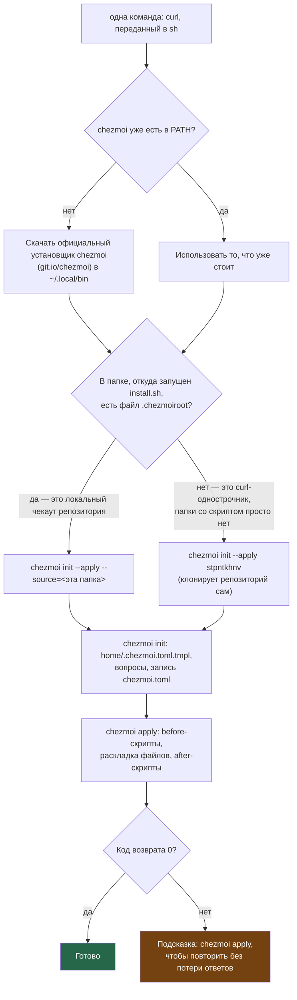
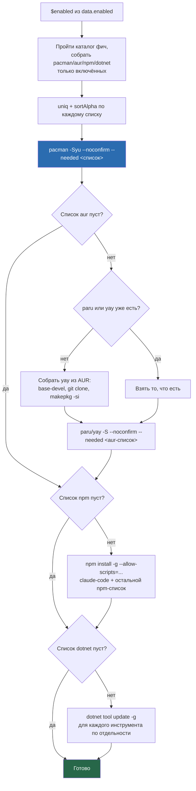

---
covers:
  features: []
  paths:
    - install.sh
    - home/.chezmoiscripts/run_onchange_before_20-packages.sh.tmpl
---

# Установка на чистой машине

[how-it-works.md](how-it-works.md) разобрал сам механизм chezmoi — каталог
фич, `chezmoi.toml`, порядок скриптов. Этот документ про другое: что
буквально происходит, когда на голой машине (или в свежем контейнере)
выполняешь одну команду, и как повторить то же самое без единого вопроса —
например, для установки, запущенной из скрипта, а не руками.

## Что это даёт

Одна команда в терминале разворачивает рабочее место с нуля: скачивает
инструмент, который всё это умеет (`chezmoi`), спрашивает пару вопросов
(имя для git, что из списка программ ставить) и дальше сам ставит пакеты и
раскладывает конфиги. Ничего не нужно клонировать руками заранее — команда
сама скачивает репозиторий с этим кодом.

То же самое одинаково работает и на настоящей машине, и внутри изолированной
песочницы ([контейнер distrobox](glossary.md#контейнер-distrobox)) — команда
сама определяет, где её запустили, и меняет только список вопросов (в
контейнере не будет вопроса про рабочий стол или клавиатуру, он там не нужен).

Команда:

```sh
sh -c "$(curl -fsSL https://raw.githubusercontent.com/stpntkhnv/dotfiles/main/install.sh)"
```

Если CDN отдаёт устаревший `install.sh` (GitHub кеширует raw-файлы),
запасной путь — через API, который кеш обходит:

```sh
sh -c "$(curl -fsSL https://api.github.com/repos/stpntkhnv/dotfiles/contents/install.sh -H 'Accept: application/vnd.github.raw')"
```

## Как это работает



### Шаг 1. `install.sh`: как chezmoi попадает на машину

Сам файл — 39 строк POSIX-совместимого `sh`, без единой внешней зависимости
кроме `curl` или `wget`. Первым делом он проверяет, есть ли `chezmoi` в
`PATH` (`if [ ! "$(command -v chezmoi)" ]`); если нет — качает официальный
установщик chezmoi (`git.io/chezmoi`, это ссылка самого проекта twpayne,
не этого репозитория) и кладёт бинарник в `~/.local/bin`, не трогая
системные пакеты.

Дальше скрипт смотрит, откуда сам запущен, и выбирает один из двух путей:

- **Локальный чекаут.** Если рядом со скриптом лежит файл `.chezmoiroot`
  (`script_dir="$(cd -P -- "$(dirname -- "$(command -v -- "$0")")" && pwd -P)"`,
  затем `if [ -f "$script_dir/.chezmoiroot" ]`) — значит `install.sh` запущен
  из git-клона этого репозитория, а не через `curl | sh`. Тогда chezmoi
  берёт источник конфигов прямо из этой папки: `chezmoi init --apply
  "--source=$script_dir"`. Сам `.chezmoiroot` в корне репозитория содержит
  ровно одну строку — `home` — это говорит chezmoi, что настоящие шаблоны
  лежат не в корне, а в подпапке `home/`.
- **Однострочник через curl.** При `curl -fsSL ... | sh` скрипт выполняется
  не из файла на диске, а из процесса подстановки — папки со скриптом просто
  нет, `.chezmoiroot` не находится, и chezmoi получает вместо `--source`
  имя пользователя GitHub: `chezmoi init --apply stpntkhnv`. В этом случае
  клонирует репозиторий сам chezmoi, по умолчанию в
  `~/.local/share/chezmoi`.

Скрипт намеренно снимает `set -e` перед вызовом chezmoi
(`# Drop set -e so we can give the user a useful retry hint instead of just
vanishing on script failure`) и сам проверяет код возврата: если `chezmoi
init --apply` упал (например, один из `after`-скриптов вернул ненулевой код),
`install.sh` не проглатывает ошибку молча, а печатает, что переспрашивать всё
заново не нужно — `chezmoi apply` без потери уже сохранённых ответов сделает
то же самое, продолжив с того места, где скрипты идемпотентны (см. «Защитные
приёмы» в [how-it-works.md](how-it-works.md)).

### Шаг 2. `chezmoi init`: чеклист и его вопросы

`chezmoi init` рендерит `home/.chezmoi.toml.tmpl`, который спрашивает имя и
почту для git, затем показывает чеклист (пробел переключает пункт, стрелки
двигают, Enter подтверждает) и пишет ответы в
`~/.config/chezmoi/chezmoi.toml` как `data.enabled`. Какие поля каталога
фич (`scope`, `always`, `default`, `needs`) решают, что вообще попадёт в этот
чеклист и что молча поставится без вопроса — разобрано в
[how-it-works.md](how-it-works.md), раздел «Три вопроса, которые решают
судьбу фичи»; здесь это не повторяется.

### Шаг 3. `chezmoi apply`: пакеты, файлы, донастройка

Дальше — обычный порядок применения: все `before`-скрипты, потом раскладка
файлов в `~`, потом все `after`-скрипты (полный список и почему порядок
именно такой — там же, раздел «Порядок применения»). Из тридцати с лишним
скриптов этот документ разбирает только один — `20-packages`: это тот
скрипт, который ставит собственно программы, и на самой первой установке он
гарантированно отрабатывает по-настоящему — сравнивать `onchange`-хеш ещё не
с чем, прежнего запуска не было. (Скрипты вида `run_after_*` без `onchange`
тоже выполняются на каждом `apply`, но по другой причине — им запуск вообще
не гейтится числом хешей; какие это скрипты и почему так — разобрано в
[how-it-works.md](how-it-works.md), раздел «Два вида скриптов».)

`chezmoi apply` не доводит машину до готовности в одиночку — часть шагов
(создание базы KeePassXC, `tailscale up`, первый запуск Zen и Handy и так
далее)
chezmoi выполнить не может в принципе, потому что они требуют интерфейса или
живого решения человека. Построчный список того, что остаётся сделать
руками после самого первого `apply` — [operations.md](operations.md#ручные-шаги-после-установки),
раздел «Ручные шаги после установки»; здесь эти шаги не повторяются.

### Скрипт 20: от списка фич до вызовов пакетных менеджеров

`run_onchange_before_20-packages.sh.tmpl` не содержит своей логики выбора —
он **собирает** плоские списки пакетов из фич, отмеченных в `data.enabled`,
и вызывает четыре пакетных менеджера по очереди:



Четыре детали, каждая объяснена комментарием в самом скрипте:

- **`pacman -Syu --noconfirm --needed`**, а не голый `-S` — `--needed`
  пропускает уже стоящее, так что повторный `chezmoi apply` без изменений в
  списке фич ничего не переустанавливает.
- **`yay` собирается из исходников только при первой реальной нужде в AUR**
  (`if ! command -v paru &>/dev/null && ! command -v yay &>/dev/null`) —
  если фичи без AUR-пакетов, шаг `base-devel` + `git clone` +
  `makepkg -si` не выполняется вовсе; если уже стоит `paru`, скрипт
  предпочитает его.
- **npm ставится с явным `--allow-scripts=@anthropic-ai/claude-code`
  в командной строке, а не через `~/.npmrc`.** Комментарий скрипта объясняет
  почему: это `before`-скрипт, значит на чистой машине `~/.npmrc` в момент
  его выполнения ещё не существует; без `--allow-scripts` npm по умолчанию
  блокирует `postinstall`, который линкует нативный бинарник `claude`, и
  результат — рабочий, но битый симлинк `~/.npm-global/bin/claude`,
  сообщающий `No such file or directory` про файл, который на самом деле на
  месте. Поведение npm (жизненный цикл: скрипты `preinstall`/`install`/`postinstall`
  заблокированы, пока пакет не назван явно во `allow-scripts`, синтаксис
  `--allow-scripts=пакет1,пакет2`) подтверждено официальной документацией
  npm (`npm-install-scripts`, `allow-scripts` в `definitions.js`) — это не
  особенность этого репозитория, а стандартное поведение npm с версии,
  где появился флаг.
- **`dotnet tool update -g`, а не `dotnet tool install -g`.** Комментарий
  скрипта утверждает, что с .NET 8 `update` ставит отсутствующий инструмент и
  ничего не делает с уже актуальным, то есть идемпотентен там, где `install`
  падал бы на уже стоящем. Документация .NET подтверждает `dotnet tool
  update -g <пакет>` как рабочую команду «поставить или обновить» (пример
  из официальных доков .NET: `dotnet tool update -g dotnet-counters` как
  «Install or Update»); версию SDK, с которой это стало именно так, документация
  явно не называет — эта часть утверждения проверена только по комментарию
  скрипта (`home/.chezmoiscripts/run_onchange_before_20-packages.sh.tmpl`,
  блок `---- dotnet tools ----`), а не независимо.

## Что ставится и что меняется

| Категория | Путь / команда | Когда |
|---|---|---|
| Бутстрап-копия chezmoi | `~/.local/bin/chezmoi`, только если chezmoi ещё не было в `PATH` | `install.sh`, один раз, до всего остального |
| Пакет chezmoi через pacman | `chezmoi` в списке `host-base` (`always: true`, только хост) | `run_onchange_before_20-packages.sh.tmpl` |
| Клон репозитория | `~/.local/share/chezmoi` по умолчанию, либо папка, откуда запущен `install.sh`, если рядом есть `.chezmoiroot` | `chezmoi init` |
| Сохранённые ответы на чеклист | `~/.config/chezmoi/chezmoi.toml`, `data.enabled` | `chezmoi init` |
| Пакеты pacman/AUR выбранных фич | `pacman -Syu` / `paru\|yay -S` | `run_onchange_before_20-packages.sh.tmpl` |
| `yay` (если ещё не было `paru`/`yay` и есть AUR-пакеты) | собирается в `mktemp -d`, устанавливается через `makepkg -si` | там же |
| Глобальные npm-пакеты | `~/.npm-global` (в `PATH` через `.bashrc`), в т.ч. `@anthropic-ai/claude-code` | там же, для фич с полем `npm` |
| Глобальные dotnet-инструменты | `~/.dotnet/tools` (в `PATH` через `.bashrc`) | там же, для фич с полем `dotnet` |
| Конфиги в `~` | всё под `home/dot_*`, `home/bin/`, за вычетом `.chezmoiignore` | этап «Файлы» |

Отдельно стоит пункт про сам chezmoi: `host-base` — фича `always: true`,
значит пакет `chezmoi` из официальных репозиториев ставится на хосте всегда,
без вопроса. Комментарий рядом с ним в каталоге объясняет замысел: «chezmoi
installs itself so that later updates come from pacman rather than the copy
install.sh drops in ~/.local/bin» (`home/.chezmoidata.yaml`, блок
`host-base`, поле `pacman`). Автор комментария уже знает про копию в
`~/.local/bin` — но не про то, что она перебивает пакетную версию. Уточнение
по коду: `home/dot_bashrc.tmpl` ставит `~/.local/bin`
**раньше** системных путей в `PATH` (`export PATH="$HOME/.npm-global/bin:
$HOME/.local/bin:$HOME/.dotnet/tools:$PATH"`). Ни один скрипт репозитория не
удаляет бутстрап-копию из `~/.local/bin` после того, как пакет `chezmoi`
появился в системе. Значит на машине, где `install.sh` один раз ставил
chezmoi через `~/.local/bin` (первый запуск на чистой системе), именно эта
копия и дальше выигрывает у пакетной — обновления `pacman -Syu` для пакета
`chezmoi` тихо копятся в `/usr/bin/chezmoi`, а команда `chezmoi` в терминале
продолжает резолвиться в более старую копию из `~/.local/bin`, пока её не
удалить руками. Это не поломка процесса, а прямое следствие порядка `PATH`;
комментарий описывает намерение, а не гарантированный результат.

## Неинтерактивная установка

Без TTY (запуск из скрипта, CI, автоматизация контейнера) chezmoi сам
переключается с интерактивного чеклиста на построчный ввод: одна строка —
один ответ, пустая строка — сигнал «хватит» для списка. Это подтверждено не
только README, но и исходником chezmoi (`internal/cmd/prompt.go`, функция
`readMultichoice`, ветка `case c.noTTY`): для булевых и строковых вопросов —
одна строка на ответ (`readString`/`readBool`, `c.noTTY` в `readLineRaw`),
для списка — строки читаются одна за другой, пока не встретится пустая
(если что-то уже выбрано) или значение `[]` (сбросить выбор).

```sh
printf 'Name\nme@example.com\nneovim\nnode\nclaude\n\n' | chezmoi init --apply --no-tty stpntkhnv
```

Строки идут в порядке вопросов: имя для git, почта для git, дальше по одной
строке на каждую отмеченную фичу (`neovim`, `node`, `claude`), и последняя
пустая строка завершает чеклист. Если на машине физически найдена карта
NVIDIA без готового драйвера, `.chezmoi.toml.tmpl` вставляет перед чеклистом
ещё один булев вопрос (ставить ли драйвер) — на такой машине список строк
нужно удлинить на одну.

Отдельно от построчного ввода, `chezmoi init` и `chezmoi execute-template
--init` умеют получать конкретные ответы через флаги `--promptString`,
`--promptBool`, `--promptMultichoice`. У них два подводных камня.

### Ловушка 1: ключ — текст вопроса, а не имя поля

`--promptString`, `--promptBool` и `--promptMultichoice` требуют пару
`подсказка=значение`, где подсказка — это **текст вопроса**, который видит
человек (`"Git user name"`), а не имя поля в `[data]` (`git_name`). Подставить
не то ключа не роняет команду ошибкой — она просто не срабатывает: значение
не подставляется, а вместо него в шаблон уходит либо повторный запрос, либо
(без TTY) сам текст подсказки как есть. Проверено напрямую:

```sh
$ chezmoi execute-template --init --promptString 'Git user name=Foo Bar' <<'EOF'
{{- promptString "Git user name" -}}
EOF
Foo Bar

$ chezmoi execute-template --init --promptString 'git_name=Foo Bar' <<'EOF'
{{- promptString "Git user name" -}}
EOF
Git user name
```

Ключ `git_name` (имя поля) не совпал с подсказкой `"Git user name"` — значение
не подставилось.

### Ловушка 2: разделитель в `--promptMultichoice` — это `/`, а не запятая

Старый `README.md` (раздел «Non-interactive install») утверждает: «`--promptMultichoice` in chezmoi 2.71 does not split its value into a
list — whatever separator you use, it arrives as one string». **Это
утверждение не подтвердилось.** Комментарий-пример в самом
`home/.chezmoi.toml.tmpl` (`chezmoi init --promptMultichoice
enabled=neovim,node,claude`) тоже не работает, но по другой причине — не
потому, что список не разбивается, а потому, что использован не тот
разделитель.

Проверено напрямую, тем же `chezmoi execute-template --init`, версия
`v2.71.1` (та же, что установлена на этой машине):

```sh
$ chezmoi execute-template --init --promptMultichoice 'enabled=neovim,node,claude' <<'EOF'
{{- promptMultichoice "enabled" (list "neovim" "node" "claude" "vscode") (list) | toJson -}}
EOF
chezmoi: ... error calling promptMultichoice: neovim,node,claude: invalid choice

$ chezmoi execute-template --init --promptMultichoice 'enabled=neovim/node/claude' <<'EOF'
{{- promptMultichoice "enabled" (list "neovim" "node" "claude" "vscode") (list) | toJson -}}
EOF
["neovim","node","claude"]
```

Официальная документация chezmoi (`chezmoi.io/reference/commands/init/`,
флаг `--promptMultichoice`) описывает синтаксис точно: «_pairs_ is a
comma-separated list of _prompt_=_value_[/_value_] pairs» — запятая
разделяет **разные пары** `подсказка=значение` (если задаёшь несколько
вопросов одним флагом), а несколько значений **одной и той же** подсказки —
через `/`. Исходник (`internal/cmd/interactivetemplatefuncs.go`, функция
`promptMultichoiceInteractiveTemplateFunc`) подтверждает это буквально:
`strings.Split(valueStr, "/")`. Комментарий разделителя не знает и путает
его с запятой — та же ошибка, что и в `README.md`, только там она усилена
до «не разбивает вообще, с любым разделителем», что неверно ещё сильнее.

Рабочая форма для этого репозитория:

```sh
chezmoi init --apply --promptString 'Git user name=Имя' \
  --promptString 'Git user email=почта' \
  --promptMultichoice 'What to install=neovim/node/claude' \
  stpntkhnv
```

Это не ошибка upstream и не обход: `chezmoi` делает ровно то, что
документирует. Строка в [реестр обходов](workarounds.md) сюда не идёт — там
регистрируют обходы чужого поведения в коде репозитория, а здесь никакого
обхода в коде нет, есть только неверный пример в собственном комментарии
`.chezmoi.toml.tmpl` и неверное, более широкое утверждение в `README.md`.
Оба поправить не в этом документе (не входят в `covers.paths` этой задачи).

## Переустановка машины

Отличие переустановки от чистой установки одно: у тебя уже есть прошлое —
база паролей `personal.kdbx` (в ней же эталоны SSH-ключей, см.
[secrets.md](secrets.md), раздел «Эталоны ключей в базе»). Порядок такой,
и каждая команда готова к копированию:

1. Обычная установка с нуля, как описано выше (`install.sh` → чеклист →
   apply). Скрипт 82 сгенерирует свежие SSH-ключи — это нормально: они
   нигде не зарегистрированы, и затирать их не жалко.
2. Доставить базу. Любой способ годится — это один файл:

   ```sh
   # со старой машины или ноутбука по сети:
   scp <другая-машина>:Documents/Passwords/personal.kdbx ~/Documents/Passwords/
   # или с флешки:
   cp /run/media/$USER/<флешка>/personal.kdbx ~/Documents/Passwords/
   # или подождать Syncthing: спарить устройства по чеклисту NEXT STEPS —
   # файл приедет сам
   ```

3. Вернуть старые ключи из базы (спросит мастер-пароль; `-f` затирает
   свежесгенерированные):

   ```sh
   ssh-restore -f host
   ssh-restore digi3      # и так для каждого контекста из NEXT STEPS
   ```

4. Сверить, что вернулись именно зарегистрированные ключи — отпечаток
   должен совпасть с тем, что показывает сервис в списке ключей
   (GitHub: Settings → SSH and GPG keys, отпечатки написаны под ключами):

   ```sh
   ssh-keygen -lf ~/.ssh/id_ed25519.pub
   ```

5. `chezmoi apply` — чеклист NEXT STEPS перечитает живое состояние и
   покажет, что осталось (вход в сервисы, Syncthing-пары и т.д.).

Если базы больше нет нигде (потеряны все копии) — старые ключи не
восстановить; тогда честный путь — зарегистрировать свежие ключи заново по
подсказкам NEXT STEPS.

## Как поменять выбор потом

Машина уже установлена, чеклист один раз пройден, и теперь нужно добавить
или убрать одну-две фичи — не переустанавливать всё заново.

**Безопасный и универсальный способ, годится для любой фичи:** открыть
`~/.config/chezmoi/chezmoi.toml`, дописать или убрать ключ прямо в списке
`data.enabled`, сохранить, выполнить `chezmoi apply`. Ничего не
переспрашивается, ничего постороннее не трогается.

```sh
$EDITOR ~/.config/chezmoi/chezmoi.toml   # поправить data.enabled
chezmoi apply
```

**Второй безопасный способ, но только для фичи с `always: true`.** Такая
фича не в чеклисте — её видимость зависит только от `scope`, а вопросов о
ней не бывает вообще. Здесь достаточно голого `chezmoi init` без `--prompt`:
он пересчитывает список always-фич заново из каталога, а сохранённый
чеклист-ответ (`data.enabled` для асканных фич) не трогает — это уже разобрано
в [how-it-works.md](how-it-works.md), раздел «Три вопроса, которые решают
судьбу фичи», и в [реестре обходов](workarounds.md) (строка про
`promptMultichoiceOnce`); здесь не повторяется.

### Почему `chezmoi init --prompt` опасен на уже настроенной машине

`--prompt` заставляет chezmoi переспросить чеклист заново — это подтверждено
самим `chezmoi init --help`: «`--prompt` Force prompt*Once template functions
to prompt». Формулировка из плана этой работы («переспрашивает от каталожных
умолчаний, а не от того, что реально выбрано сейчас») проверена не по
пересказу, а по коду, и подтвердилась буквально.

Проверка по коду, в две части.

Во-первых, что именно предлагается пре-отмеченным в чеклисте. Список
`$defaults` в `home/.chezmoi.toml.tmpl` строится единственным проходом по
каталогу фич, и ничем больше:

```
{{- range $catalog -}}
{{-   if or (eq .scope "both") (eq .scope $env) -}}
{{-     if hasKey . "always" -}}
{{-       $always = append $always .key -}}
{{-     else -}}
{{-       $choices = append $choices .key -}}
{{-       if hasKey . "default" -}}
{{-         $defaults = append $defaults .key -}}
```

`$catalog` — это `home/.chezmoidata.yaml`, прочитанный заново на этом самом
рендере (`{{- $catalog := (include ".chezmoidata.yaml" | fromYaml).features -}}`,
самая первая строка после комментария). Ни здесь, ни где-либо ещё в этом
блоке нет ни одного обращения к уже существующему `chezmoi.toml` — `$defaults`
не знает и не может знать, что реально отмечено на машине сейчас. Пре-тики
чеклиста — это в точности набор `default: true` из каталога **на момент
запуска**, независимо от истории этой конкретной машины.

Во-вторых, что происходит с этим списком при `--prompt`. В самом chezmoi
(`internal/cmd/interactivetemplatefuncs.go`,
`promptMultichoiceOnceInteractiveTemplateFunc`) есть проверка:

```go
if !c.interactiveTemplateFuncs.forcePromptOnce {
    if value, ok := nestedMap[lastKey]; ok {
        return mustValue(anyToStringSlice(value))
    }
}
return c.promptMultichoiceInteractiveTemplateFunc(prompt, choices, args...)
```

`--prompt` — это и есть `forcePromptOnce = true`. При нём ветка «вернуть уже
сохранённое значение» не выполняется вообще, chezmoi идёт сразу к обычному
`promptMultichoice`, и предлагает выбор ровно из `$choices`/`$defaults` —
то есть из каталога, а не из сохранённого `data.enabled`. Молчаливое согласие
с пре-отмеченным чеклистом (или line-based ответ, повторяющий только
`default: true` пункты) даёт `$selected = $defaults`, и это идёт прямиком в
`enabled = {{ $enabled | toJson }}` — а `chezmoi init` перезаписывает весь
файл `chezmoi.toml` заново по шаблону, так что новый, обеднённый список
подменяет старый целиком. Любая асканная фича без `default: true`,
включённая когда-то вручную, из этого списка выпадает без единого
предупреждения. `promptStringOnce` для git-имени и почты подчиняется тому
же `forcePromptOnce`, так что заодно переспрашивается и это.

Расхождений с формулировкой плана не нашлось — она подтвердилась и по
`--help`, и по обоим местам кода.

**Как использовать `--prompt` безопасно, если он всё же нужен** (например,
осознанно затеяли пересобрать выбор с нуля): перед тем как соглашаться с
пре-отмеченным чеклистом, вручную дотикать каждую фичу, которая была включена
раньше, но не несёт `default: true` в каталоге — сверяться удобно прямо по
`home/.chezmoidata.yaml`, либо по текущему `data.enabled` в
`~/.config/chezmoi/chezmoi.toml` до пересборки. Для любой другой цели —
просто не трогать `--prompt`: он не инструмент для точечного изменения
выбора, а инструмент «начать чеклист заново, глазами каталога, а не глазами
машины».

## Как проверить

Что реально уйдёт в пакетные менеджеры при следующем `apply`, без применения:

```sh
chezmoi execute-template < home/.chezmoiscripts/run_onchange_before_20-packages.sh.tmpl
```

Вывод начинается со строки `# Selected features: ...` — список ключей из
текущего `data.enabled` — и дальше готовый вызов `pacman -Syu`, плюс блоки
AUR/npm/dotnet, если что-то из выбранного их требует. Список пакетов и их
число зависят от того, что отмечено на конкретной машине, поэтому здесь не
приведены как фиксированное значение.

Какая копия chezmoi реально выполняется (актуально после первого бутстрапа —
см. «Что ставится и что меняется» выше, про порядок `PATH`):

```sh
which chezmoi
pacman -Q chezmoi 2>/dev/null
chezmoi --version
```

Если `which chezmoi` показывает `~/.local/bin/chezmoi`, а `pacman -Q
chezmoi` при этом тоже что-то выводит — на машине два chezmoi, и работает
более старая, бутстрап-копия.

Полный чеклист незакрытых шагов после установки печатает сам репозиторий —
последний скрипт применения, `run_after_zz-next-steps.sh.tmpl`, выполняется
на каждом `apply` и не требует отдельной команды.

## Когда сломалось

| Симптом | Причина | Что делать |
|---|---|---|
| `install.sh` напечатал «Setup did not complete» и подсказку про `chezmoi apply` | Один из скриптов `chezmoi init --apply` вернул ненулевой код | Прочитать вывод выше подсказки, исправить причину, выполнить `chezmoi apply` (`~/.local/bin/chezmoi`, если ещё не в `PATH`) — ответы на вопросы уже сохранены и не переспрашиваются |
| `claude` в `PATH`, но при запуске «No such file or directory», хотя файл на месте | Битый симлинк: пакет ставили без `--allow-scripts`, поэтому npm заблокировал `postinstall`, который линкует нативный бинарник (в штатном скрипте флаг уже стоит — это симптом ручной переустановки в обход него) | `npm install -g --allow-scripts=@anthropic-ai/claude-code @anthropic-ai/claude-code` руками, либо `chezmoi apply`, чтобы `run_onchange_before_20-packages.sh.tmpl` сделал это правильно |
| Неинтерактивный `--promptMultichoice` падает с `invalid choice` | Значения перечислены через запятую вместо `/` | Использовать `/`: `--promptMultichoice 'What to install=neovim/node/claude'` |
| `--promptString`/`--promptBool` не подставляют значение, вопрос всё равно всплывает (или получает пустую заглушку без TTY) | Ключ — имя поля (`git_name`) вместо точного текста вопроса (`Git user name`) | Скопировать подсказку дословно из `home/.chezmoi.toml.tmpl` (учитывая регистр) |
| После переустановки `chezmoi --version` не совпадает с `pacman -Q chezmoi` | `~/.local/bin/chezmoi` (бутстрап-копия) стоит раньше системных путей в `PATH` и не удаляется автоматически | `rm ~/.local/bin/chezmoi`, если пакетная версия уже стоит и её достаточно |

## Почему именно так

**Почему `install.sh` не клонирует репозиторий сам, а поручает это
`chezmoi init`.** У самого chezmoi уже есть логика клонирования по имени
пользователя/репозитория с угадыванием SSH/HTTPS
(`chezmoi init --help`, таблица паттернов `user`/`user/repo`/`site/user/repo`)
— дублировать её в 39-строчном POSIX-скрипте было бы лишним кодом ради того,
что уже сделано лучше выше по стеку.

**Почему `set +e` вокруг `chezmoi init --apply`, а не `set -e` до конца.**
Изначальная версия скрипта использовала `exec`, который передавал управление
chezmoi и завершался тем же кодом без какого-либо сообщения — на середине
установки (например, если сеть моргнула на скрипте пакетов) человек просто
видел голый код ошибки shell без объяснения, что делать дальше. Сохранённые
ответы к этому моменту уже лежат в `chezmoi.toml`, и подсказка «просто
`chezmoi apply`» экономит человеку повторный ввод git-имени и всего чеклиста.

**Почему `--promptMultichoice` не годится, если задать его один раз без
`/`.** Разобрано выше как «ловушка 2» — это не решение этого репозитория,
это документированный синтаксис самого chezmoi.

## Ссылки

- [chezmoi.io — init command](https://www.chezmoi.io/reference/commands/init/)
  — флаги `--promptString`/`--promptBool`/`--promptMultichoice`, точный
  синтаксис `prompt=value[/value]`.
- [chezmoi.io — Install](https://www.chezmoi.io/install/) — официальный
  установщик `git.io/chezmoi`, который скачивает `install.sh` при отсутствии
  chezmoi в `PATH`.
- Исходник chezmoi, тег `v2.71.1` (совпадает с `chezmoi --version` на этой
  машине): `internal/cmd/interactivetemplatefuncs.go`, функции
  `promptMultichoiceInteractiveTemplateFunc` (`strings.Split(valueStr, "/")`)
  и `promptMultichoiceOnceInteractiveTemplateFunc` (ветка `forcePromptOnce`,
  та же, что включает флаг `--prompt`); `internal/cmd/prompt.go`, функции
  `readMultichoice`/`readLineRaw` (построчный ввод без TTY).
- npm: `npm-install-scripts`, поле `allow-scripts` в
  `workspaces/config/lib/definitions/definitions.js` — жизненный цикл: скрипты
  заблокированы, пока пакет не назван явно.
- [how-it-works.md](how-it-works.md) — сам механизм chezmoi: каталог фич,
  три вопроса, порядок применения, защитные приёмы; раздел «Как добавить
  программу, фичу и контекст» — что делать на уже установленной машине.
- [operations.md](operations.md#ручные-шаги-после-установки) — раздел
  «Ручные шаги после установки»: построчно то, что `chezmoi apply` не может
  сделать сам.
- [workarounds.md](workarounds.md) — реестр обходов; запись про
  `promptMultichoiceOnce` — смежный сценарий той же функции: там про то, что
  новая асканная фича не появляется в чеклисте сама, здесь — про то, что
  `--prompt` отбрасывает эту же защиту и предлагает пере-отметить чеклист с
  нуля от каталожных умолчаний.
