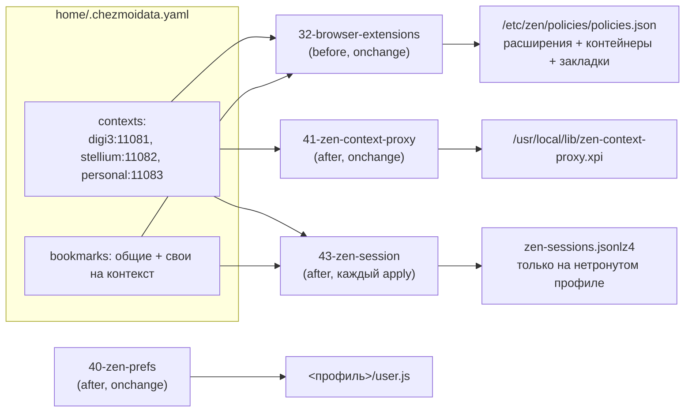
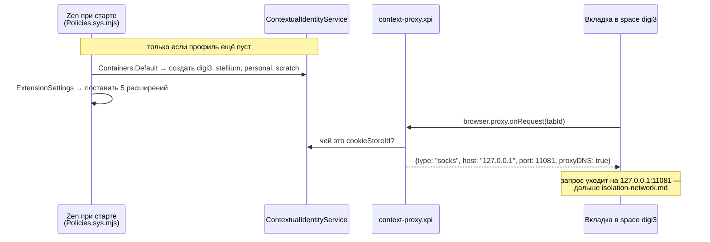

---
covers:
  features: [zen]
  paths:
    - home/.chezmoiscripts/run_onchange_before_32-browser-extensions.sh.tmpl
    - home/.chezmoiscripts/run_onchange_after_40-zen-prefs.sh.tmpl
    - home/.chezmoiscripts/run_onchange_after_41-zen-context-proxy.sh.tmpl
    - home/.chezmoiscripts/run_after_43-zen-session.sh.tmpl
    - home/dot_local/share/applications/zen.desktop.tmpl
---

# Изоляция в браузере: Zen, контейнеры и расширения

[isolation.md](isolation.md) объяснил общую картину: одно окно Zen, три рабочих
контекста, каждый со своей сетью. Этот документ — про браузерную половину этой
картины: как [space в Zen](glossary.md#space-в-zen) оказывается привязан к
[контейнеру Firefox](glossary.md#контейнер-firefox), как контейнер получает
свой прокси, и что для этого ставится в браузер автоматически. Начинается
ровно там, где обрывается [isolation-network.md](isolation-network.md) —
на портах `1108x` на хосте; что происходит дальше моста, туда и за
`killswitch.md`. Куда именно попадает ссылка, кликнутая снаружи браузера —
тема соседнего [isolation-links.md](isolation-links.md).

## Что это даёт

У тебя одно окно браузера Zen. Внутри него несколько раскладок вкладок
(«spaces»): одна для одной работы, другая для другой, третья для личного.
Переключаешь раскладку — и браузер показывает только вкладки этой работы,
а не вообще все.

Каждая такая раскладка привязана к отдельной «банке» состояния браузера:
свои куки, свой вход на сайты, своя история. Сайт, открытый в одной раскладке,
не видит, что ты залогинен в тот же сайт под другим аккаунтом в другой
раскладке — как будто это два разных человека за двумя разными компьютерами.
И — это уже касается сети, а не браузера — трафик каждой раскладки уходит в
интернет через отдельный, свой собственный сетевой канал (как именно, разобрано
в [isolation-network.md](isolation-network.md)).

Всё это: сами эти «банки» с куками, распределение имени работы по цвету и
значку, привязка каждой банки к своему сетевому каналу — ставится и настраивается
само, при `chezmoi apply`, без единого клика по меню браузера. Три вещи из
этого при этом обязательны и их нельзя выключить, не сломав саму изоляцию;
остальное можно было бы делать и руками, просто автоматом надёжнее.

Часть настроек браузер применяет, только когда он ни разу ещё не запускался
на этой машине — то есть **новая машина получает всё сама, а уже работающая
не переписывается заново на каждом `apply`.**

## Как это работает

Работа устроена в два такта: один раз при каждом `chezmoi apply` — раскладываются
файлы; и каждый раз при старте Zen — сам браузер их читает и раскладывает
контейнеры, расширения и прокси.



А вот что происходит при самом запуске Zen — это уже не наш код, а движок
Gecko, читающий то, что разложили скрипты выше:



### Политика: расширения, контейнеры, закладки — скрипт 32

Расширения в Zen (и в Firefox — он тоже есть на машине, для всего остального)
ставятся не через магазин, а через **политику предприятия**: файл, который
браузер читает при старте и исполняет сам, без диалогов и подтверждений.

Файл называется `policies.json`, и первое, что здесь легко сделать неправильно:
каталог, куда его класть, не литеральный `/etc/firefox/`. Gecko вычисляет
каталог из имени приложения текущей сборки, а не берёт его литералом — как
именно, откуда берётся имя и почему это не `RemotingName`, как можно было бы
подумать по аналогии с реестром Windows, разобрано в «Почему именно так». У
Zen это имя — `zen`, значит каталог `/etc/zen/policies/policies.json`, а
`/etc/firefox/policies/` браузер Zen вообще не открывает. Ошибка здесь
**молчаливая**: положи файл не в тот каталог — браузер стартует как ни в чём
не бывало, не пишет ни строки в лог, и просто не имеет ни одного из
перечисленных в политике расширений. На этой машине оба каталога существуют
одновременно и с разным содержимым — `/etc/zen/policies/policies.json` несёт
весь стек контейнеров, `/etc/firefox/policies/policies.json` только запись про
Bitwarden, — что и доказывает, что дерево `/etc/firefox/` для Zen не значит
ничего:

```sh
cat /etc/firefox/policies/policies.json
```
```json
{
  "policies": {
    "DisableAppUpdate": true,
    "DefaultSerialGuardSetting": 3,
    "ExtensionSettings": {
      "{446900e4-71c2-419f-a6a7-df9c091e268b}": {
        "installation_mode": "normal_installed",
        "install_url": "https://addons.mozilla.org/firefox/downloads/latest/bitwarden-password-manager/latest.xpi"
      }
    }
  }
}
```

Скрипт строит политику для Firefox и для Zen одним и тем же кодом
(`write_gecko_policy`, `run_onchange_before_32-browser-extensions.sh.tmpl`),
перебирая пару `(dir, extensions, containers, bookmarks)` — Firefox получает
только Bitwarden (он тут браузер для всего, что не требует контекстов), Zen —
весь стек. Это единственное, что этот скрипт делает для Firefox; остальное в
этом документе — только про Zen.

Каждое расширение в `ExtensionSettings` ставится в одном из двух режимов:

| Режим | Что позволяет | Расширения у Zen |
|---|---|---|
| `force_installed` | нельзя ни выключить, ни удалить | Multi-Account Containers, Open external links in a container, наш `context-proxy` |
| `normal_installed` | можно выключить (официальная формулировка Mozilla: «allows it to be disabled by the user»); удаление тем же кодом политики тоже придерживается — `disallowFeature('uninstall-extension:…')` в `Policies.sys.mjs` вызывается для обоих режимов одинаково, различие именно в «выключить» | Temporary Containers, Bitwarden |

Три `force_installed` — это не настройка на вкус, это **сама граница**
изоляции контекстов:

- **Multi-Account Containers** даёт сам механизм банок кук и интерфейс к ним.
  Без него никаких контейнеров нет вообще — всё сливается в одну обычную
  сессию браузера.
- **Open external links in a container** обрабатывает протокол `ext+container:`,
  которым передаётся ссылка вместе с именем контейнера (закладки, `zen-open` —
  подробнее [isolation-links.md](isolation-links.md)). Без него такая ссылка
  просто ничего не открывает.
- **`context-proxy`** — собственное расширение, ниже — раздаёт прокси по
  контейнерам. Без него у контейнеров есть куки, но нет сети: весь трафик
  тихо идёт напрямую с хоста, никак не показывая, что что-то не так.

Удаление любого из этих трёх не сообщает об этом нигде в интерфейсе — вкладки
продолжают открываться, просто без изоляции того слоя, за который отвечало
удалённое расширение.

**Контейнеры** тоже приходят политикой, ключ `Containers.Default`, по одному
на каждую запись `contexts:`, плюс `scratch` последним, без пары в
`contexts:` и без прокси (это зарезервированное имя для ссылок, которые не
принадлежат ни одной работе — см. [isolation.md](isolation.md)):

```json
"Containers": {
  "Default": [
    { "name": "digi3", "icon": "briefcase", "color": "blue" },
    { "name": "stellium", "icon": "briefcase", "color": "green" },
    { "name": "personal", "icon": "briefcase", "color": "purple" },
    { "name": "scratch", "icon": "circle", "color": "gray" }
  ]
}
```

Это подхватывает движок Gecko сам: `ContextualIdentityService.sys.mjs`,
метод `init()`, читает `Containers.Default` из активной политики и
присваивает `userContextId` последовательно, 1..N, в порядке массива — но
**только если у профиля ещё нет своего `containers.json`** (механизм отката
на чтении файла — в «Почему именно так»). Отсюда: новая машина получает
контейнеры сама, а работающая машина не переписывается на каждый `apply`.

На практике это значит, что реальные `userContextId` на работающем профиле
почти никогда не идут 1, 2, 3, 4 подряд — они текут вместе с историей профиля
(удалённые и заново созданные контейнеры оставляют дыры; живой пример с этой
машины — в разделе «Как проверить» ниже). Это и есть главная причина, почему
расширение `context-proxy` ищет контейнер по имени, а не полагается на номер
— подробности в следующем разделе.

**Закладки** — тоже политика, ключ `Bookmarks`, по записи на каждую пару
«работа × закладка», с `Folder` равным имени контекста и адресом вида
`ext+container:name=<контекст>&url=<encoded>`. Это отдельный, самостоятельный
слой: `BookmarksPolicies.sys.mjs` (searchfox,
`browser/components/enterprisepolicies/helpers/BookmarksPolicies.sys.mjs`)
хранит свои закладки с префиксом `PolB-`/`PolF-` и на **каждом** старте
сверяет то, что реально лежит в Places, с тем, что сейчас в политике,
добавляя и удаляя записи, чтобы совпадало — правка закладки руками в браузере
поэтому не держится, править нужно `bookmarks:`/`contexts[].bookmarks` в
`.chezmoidata.yaml`. Что именно происходит с такой ссылкой при клике — тема
[isolation-links.md](isolation-links.md); здесь только то, что закладку туда
кладёт и снимает политика.

### Расширение context-proxy: сборка и подмена прокси — скрипт 41

Назначение прокси конкретному контейнеру Multi-Account Containers умеет
делать сама, руками, через «Advanced proxy settings» — но там два отказа, и
ни один не называет настоящую причину: строка `socks5://…` не парсится
(`parseProxy` принимает только `http`/`https`/`socks`/`socks4`), а поле
прокси не появляется без отдельного необязательного права `proxy`; разбор
обоих — в «Почему именно так».

Вместо этого прокси на контейнер раздаёт собственное расширение,
`context-proxy@dotfiles.local`, около шестидесяти строк. Оно собирается
заново при каждом `chezmoi apply` в `/usr/local/lib/zen-context-proxy.xpi` и
ставится политикой как `force_installed` с `install_url`
`file:///usr/local/lib/zen-context-proxy.xpi`.

Таблица контекстов **зашивается прямо внутрь `background.js`** при сборке —
из того же `contexts:` в `.chezmoidata.yaml`, откуда берутся мосты на хосте
и юниты в контейнере (см. [isolation-network.md](isolation-network.md)):

```js
const CONTEXTS = [
  { name: "digi3", port: 11081, color: "blue", icon: "briefcase" },
  { name: "stellium", port: 11082, color: "green", icon: "briefcase" },
  { name: "personal", port: 11083, color: "purple", icon: "briefcase" },
];
const SCRATCH = { name: "scratch", color: "gray", icon: "circle" };
```

(реальное содержимое собранного файла на этой машине, распаковано из
`/usr/local/lib/zen-context-proxy.xpi` 2026-07-30 — совпадает со скриптом
дословно). Порт больше не может разойтись сам с собой: он один и тот же и в
`.chezmoidata.yaml`, и в юните моста на хосте, и здесь.

Внутри — единственный слушатель, `browser.proxy.onRequest`:

```js
async function handler(info) {
    if (info.tabId < 0) { return {}; }      // нет вкладки — некому назначить прокси
    ...
    tab = await browser.tabs.get(info.tabId);
    return byStore.get(tab.cookieStoreId) || {};
}
```

Для каждой вкладки расширение смотрит её `cookieStoreId` (тот самый
идентификатор Firefox-контейнера) и отдаёт объект прокси
`{ type: "socks", host: "127.0.0.1", port, proxyDNS: true }` — `"socks"` в
терминах `browser.proxy` и есть SOCKS5 (`"socks4"` — старая версия), а
`proxyDNS: true` значит, что имя резолвится не на хосте, а уже внутри
контейнера, той же машиной, что и сам прокси (это и обеспечивает
[remote DNS](glossary.md#dns-и-remote-dns), на который ссылается
[isolation.md](isolation.md) в таблице «Что изолировано надёжно»). Запроса
без вкладки (`tabId < 0`) точно так же нет — расширение возвращает пустой
объект, и Firefox шлёт такой запрос напрямую с хоста; это тот же зазор, что и
у Multi-Account Containers, разобранный в [isolation.md](isolation.md),
раздел «Что не изолировано».

**Контейнеры ищутся по имени, а не по сохранённому id** — функция `resolve`:

```js
async function resolve(spec) {
    let found = await browser.contextualIdentities.query({ name: spec.name });
    if (found.length) { return found[0]; }
    return await browser.contextualIdentities.create({ ... });
}
```

Причина ровно та, что разобрана в предыдущем разделе: `userContextId`
раздаются в порядке создания и накапливают дыры от удалённых и заново
созданных контейнеров, так что на другой машине — да и на этой же машине
спустя полгода — числа будут другими. Имя единственное, что остаётся
стабильным.

**Если контейнера с таким именем нет — расширение его создаёт само**,
`contextualIdentities.create({ name, color, icon })`, с цветом и значком из
таблицы `CONTEXTS`, а не из чего-либо, что уже могло существовать под
похожим именем. Это закрывает последнюю дыру ручной настройки: имя, набранное
с опечаткой при заведении контекста, больше не даёт контейнер без прокси —
расширение при следующем срабатывании (запуск браузера, либо создание/
удаление/переименование любого контейнера — на все три события подписан
`rebuild()`) заведёт правильно названный контейнер заново. Обратная сторона
этого же поведения: если контейнер переименовать руками в интерфейсе Zen, а
не в `contexts:`, расширение при следующей сборке карты создаст **ещё один**
контейнер со старым именем и без истории — оно не умеет мигрировать, только
искать и создавать.

Расширение неподписанное, и это работает благодаря паре условий, а не одной:
Zen собран с `AppConstants.MOZ_REQUIRE_SIGNING = false` (подтверждено на этой
машине — строка `MOZ_REQUIRE_SIGNING: false` внутри
`modules/AppConstants.sys.mjs` распакованного `/opt/zen-browser-bin/omni.ja`,
zen-browser-bin 1.21.9b-1), и это снимает *обязательность* проверки подписи
как жёсткую константу кода (`AddonSettings.sys.mjs`: если
`MOZ_REQUIRE_SIGNING` истинно, `REQUIRE_SIGNING` захардкожен в `true` без
возможности переопределить; если ложно — следует за настройкой
`xpinstall.signatures.required`). Сама настройка `xpinstall.signatures.required`
у этой сборки по умолчанию `false` (`greprefs.js` внутри того же `omni.ja`) —
и наш `user.js` (скрипт 40, ниже) её не трогает вовсе, полагаясь на этот
дефолт сборки. Поменяется любое из двух — сборка Zen станет требовать подпись,
либо дефолт настройки — и расширение перестанет грузиться без единого
предупреждения в интерфейсе; на этот случай `run_after_zz-next-steps.sh`
(не тема этого документа) при каждом apply проверяет, что файл
`context-proxy@dotfiles.local.xpi` реально лежит среди установленных
расширений профиля.

Конфиг зашит внутрь XPI, а не приходит отдельной политикой `3rdparty` через
`storage.managed`: на одну движущуюся часть меньше, а файл и так пересобирается
заново при каждом `apply`. Это работает потому, что функция
`installAddonFromURL` специально исключает адреса `file:` из проверки «тот же
аддон — не переустанавливать» — код, условие и разбор того, гарантированно ли
это работает при простой смене порта, — в «Почему именно так».

### Настройки user.js — скрипт 40

Часть решений не выразить политикой — политика Zen покрывает только
подмножество настроек, а сами профили Zen прячет за `about:profiles`, так что
стабильного пути «положить файл сюда» для конкретного профиля просто нет.
Вместо этого скрипт 40 кладёт `user.js` в каждый найденный профиль:
файл, который Gecko перечитывает **при каждом старте**, а не один раз при
установке — то, что нужно именно здесь, поскольку каждая из настроек ниже не
пожелание, а требование для изоляции.

Скрипт ищет профили в обоих возможных корнях (`~/.zen` — старые сборки Zen,
`~/.config/zen` — нынешние) и пишет `user.js` в каждый каталог, где уже есть
`prefs.js` или `times.json` (это отличает настоящий профиль от служебного
каталога `Profile Groups`, у которого нет ни того ни другого). Если профиля
ещё нет вообще — Zen ни разу не запускался — скрипт молча заканчивается
строкой «Zen has not created a profile yet, skipping prefs.»; настройки
появятся после первого запуска и следующего `apply`.

Ровно десять `user_pref`, свеpено построчно со скриптом — расхождений со
старыми текстами не нашлось:

| Настройка | Значение | Зачем |
|---|---|---|
| `media.peerconnection.ice.proxy_only` | `true` | WebRTC/ICE иначе открывает прямые UDP-потоки с хостового интерфейса мимо прокси — это обходит всю схему целиком |
| `network.proxy.allow_hijacking_localhost` | `true` | По умолчанию браузер не пускает `localhost` через прокси: рабочая вкладка, обращаясь к `127.0.0.1:5000`, попадала бы на loopback **хоста**, а не контейнера — дев-сервер внутри контейнера был бы недоступен из своей же вкладки, а хостовые порты, наоборот, доступны из любого контекста. Это же делает возможным тест с [«ответчиком по имени»](glossary.md#127001) из isolation-network.md |
| `permissions.default.desktop-notification` | `2` (запрещено по умолчанию) | Уведомления — поверхность утечки во время демонстрации экрана |
| `network.protocol-handler.external.ext+container` | `true` | Без этого протокол `ext+container:` не обрабатывается как внешний вовсе — передача ссылки снаружи не работает |
| `security.external_protocol_requires_permission` | `false` | Без этого каждая передача такой ссылки упирается в диалог подтверждения |
| `signon.rememberSignons`, `signon.autofillForms` | `false`, `false` | Пароли живут в Bitwarden. Автозаполнение браузера воспроизводило бы ровно сценарий утечки: форма чужого тенанта загрузилась, данные ушли, вход попал в его журналы |
| `browser.shell.checkDefaultBrowser` | `false` | Zen при первом запуске сам забирает `x-scheme-handler/http(s)` и вписывает себя в `mimeapps.list`, подменяя пикер ссылок — обработчиком по умолчанию должен оставаться Junction ([isolation-links.md](isolation-links.md)) |
| `browser.tabs.unloadOnLowMemory` | `true` | Память — выгружать неактивные вкладки при её нехватке |
| `dom.ipc.processCount` | `4` | Память — потолок числа content-процессов |

`fission.autostart` **намеренно не трогается** нигде в скрипте: изоляция
сайтов внутри Gecko стоит памяти, но ломать её ради нескольких сотен
мегабайт — плохой размен.

### Засев spaces — скрипт 43

Последний штрих — сами `space` в интерфейсе Zen, по одному на контекст, уже
привязанные к контейнеру, плюс закреплённые вкладки-«Essentials» с общими и
контекстными закладками. Без этого шага человек делал бы то же самое руками
после установки: создать space, открыть «Set Profile» (в интерфейсе Zen эта
кнопка выбирает [контейнер, а не профиль](glossary.md#профиль-браузера) —
путаница из-за неудачного названия), закрепить вкладки.

Скрипт **умышленно осторожен**, и вот почему: он пишет прямо в
`zen-sessions.jsonlz4` — внутренний формат Zen без каких-либо обещаний
совместимости между версиями, в котором вдобавок лежат вообще все открытые
вкладки текущей сессии. Файл — это блок LZ4 (заголовок `mozLz40\0` + 4 байта
длины) поверх JSON; скрипт кодирует его сам, ровно одним видом LZ4-блока —
«только литералы, без единого совпадения» (blockToken старшая половина байта
= длина литерала, без последующей пары смещение/длина совпадения) — валидным
по спецификации LZ4, потому что финальная последовательность блока обязана
быть именно такой, и ничего сложнее для записи не требуется; читает его сам
Zen тем же штатным декодером.

Поэтому скрипт пишет **только в нетронутый профиль** и отказывается в любом
из четырёх случаев:

| # | Условие отказа | Почему именно оно |
|---|---|---|
| 1 | `pgrep -x zen-bin` находит живой процесс | Zen всё равно перепишет `zen-sessions.jsonlz4` при выходе — писать поверх работающей сессии бессмысленно и рискованно |
| 2 | Для какого-то контекста ещё нет записи в `containers.json` | Контейнер создаёт политика при первом запуске Zen на чистом профиле — если профиль совсем свежий и Zen ещё ни разу не стартовал, привязывать space не к чему; сообщение прямо называет, каких контекстов не хватает |
| 3 | В сессии уже есть хоть одна вкладка (`data["tabs"]`) | Это уже не нетронутый профиль — есть что потерять |
| 4 | Среди `data["spaces"]` уже есть space с именем одного из контекстов | Либо уже засеяно этим же скриптом раньше, либо сделано руками — в обоих случаях трогать не нужно |

Если что-то из перечисленного сработало — скрипт печатает причину и
завершается кодом `0` (это `run_after`, не `run_onchange`: `chezmoi apply`
должен пройти дальше, а не остановиться из-за того, что Zen уже настроен
руками).

`containerTabId` каждого space читается из `containers.json` по имени
(`userContextId` конкретного, уже реально существующего контейнера), а не
предсказывается по порядку — та же причина, что и у `context-proxy`: политика
действительно нумерует 1..N в порядке массива, но только на чистом профиле, а
скрипту нужно работать и на профиле, который старше самой политики.

Закреплённые вкладки несут **обычный** `url`, в отличие от закладок из
политики, которые несут `ext+container:`. Разница не случайна: закреплённая
вкладка уже сидит в конкретном space, который уже привязан к конкретному
контейнеру, и прямо указывает свой `userContextId` в самой записи вкладки —
контейнер ей задан средой, а не адресом. Закладка, наоборот, может быть
кликнута из любого space, и поэтому обязана нести свой контейнер в самой
ссылке (это уже подробность [isolation-links.md](isolation-links.md)).

### Ярлык запуска — zen.desktop

`~/.local/share/applications/zen.desktop` тем же именем файла перекрывает
`/usr/share/applications/zen.desktop`, поставленный пакетом — и различия с
оригиналом ровно два, оба про то, чтобы это не сломало изоляцию:

- `Exec` идёт через `slice-run browser-zen.slice ...`, а не запускает
  `zen-browser` напрямую — весь Zen целиком ограничен по памяти этим
  [systemd slice](glossary.md#systemd-slice) (сам механизм `slice-run` и
  бюджеты памяти — тема будущего `browsers.md`).
- `MimeType` **не несёт** `x-scheme-handler/http` и `x-scheme-handler/https`.
  Голая запись «Zen Browser» в системном пикере ссылок открывала бы адрес в
  том контейнере, который использует текущая раскладка — ровно то тихое
  попадание не туда, ради недопущения которого всё это существует. Записи
  по одной на контекст, которые пикер реально показывает, генерирует другой
  скрипт (`run_onchange_after_38-linkrouting.sh.tmpl`, вне этого документа —
  см. [isolation-links.md](isolation-links.md)).

## Что ставится и что меняется

| Категория | Путь | Где | Кто создаёт |
|---|---|---|---|
| Пакеты | `junction`, `zen-browser-bin` (AUR) | Хост | фича `zen`, всегда включена |
| Системная политика Zen | `/etc/zen/policies/policies.json` | Хост, вне дома | скрипт 32 |
| Системная политика Firefox (только Bitwarden) | `/etc/firefox/policies/policies.json` | Хост, вне дома | скрипт 32, если включена фича `browsers` |
| Собранное расширение | `/usr/local/lib/zen-context-proxy.xpi` | Хост, вне дома | скрипт 41 |
| Настройки профиля | `<профиль>/user.js` (`~/.zen/*/` или `~/.config/zen/*/`) | Хост, в доме | скрипт 40 |
| Сессия и spaces | `<профиль>/zen-sessions.jsonlz4` | Хост, в доме | скрипт 43 (правит существующий файл, не создаёт с нуля) |
| Ярлык запуска | `~/.local/share/applications/zen.desktop` | Хост, в доме | шаблон `zen.desktop.tmpl` |

Ни один из пяти скриптов не трогает ничего внутри distrobox-контейнеров —
весь этот документ целиком про хост.

## Настроенное руками

Автоматизировать получилось не всё. Ниже — то, что остаётся сделать самому
один раз при установке или поменять по мере необходимости; граница проведена
так, что маршрутизация конкретной ссылки в конкретный контейнер (правила
доменов, `zen-open`, пикер) уходит в [isolation-links.md](isolation-links.md)
целиком, а здесь — только то, что настраивается один раз внутри самого
браузера.

1. **Temporary Containers → автоматический режим.** Всё, что открылось мимо
   назначенного контейнера, попадает в одноразовый контейнер и умирает вместе
   с вкладкой — подстраховка для случайных ссылок, а не замена рабочим
   контекстам.
2. **Синхронизация контейнеров выключена.** Пункт *Enable synchronization* в
   Multi-Account Containers заливает имена контейнеров и привязки доменов в
   Firefox Account — список всех рабочих контекстов и их доменов в одном
   месте вне этой машины, прямо против модели угроз из
   [isolation.md](isolation.md).
3. **Правила «Always Open This Site in…» — только на уникальные домены.**
   Никогда на общие вроде `dev.azure.com`, `portal.azure.com`,
   `teams.microsoft.com` или `login.microsoftonline.com`: правило на домен
   *вытягивает* ссылку из её текущего контейнера в указанный, а не наоборот.
4. **Закладки в виде `ext+container:name=<Контекст>&url=<encoded>`** —
   вручную заведённые, а не через политику; сама механика этого протокола и
   то, как строку собирает `zen-open`, — в [isolation-links.md](isolation-links.md).
5. **Закреплённые вкладки на space, не заведённые скриптом 43** (если он
   отказался засеивать — см. таблицу выше).
6. **Настройки Bitwarden**: автозаполнение при загрузке страницы выключено;
   *URI match detection* — `Never` для общих доменов Microsoft, `Host` для
   уникальных; один аккаунт на контекст.
7. **`about:logins` очищен** — пустой список сохранённых логинов Firefox,
   чтобы автозаполнение браузера (даже выключенное по умолчанию, п. `user.js`
   выше) не оставалось источником соблазна включить его обратно.

## Как проверить

Политика реально применилась и контейнеры реально созданы (снято на этой
машине 2026-07-30, три контекста подняты):

```sh
cat /etc/zen/policies/policies.json | python3 -m json.tool | head -20
```
```
{
    "policies": {
        "DisableAppUpdate": true,
        "DefaultSerialGuardSetting": 3,
        "ExtensionSettings": {
            "@testpilot-containers": {
                "installation_mode": "force_installed",
                ...
```

Собранное расширение несёт актуальную таблицу контекстов:

```sh
unzip -p /usr/local/lib/zen-context-proxy.xpi background.js | head -6
```
```
const CONTEXTS = [
  { name: "digi3", port: 11081, color: "blue", icon: "briefcase" },
  { name: "stellium", port: 11082, color: "green", icon: "briefcase" },
  { name: "personal", port: 11083, color: "purple", icon: "briefcase" },
];
const SCRATCH = { name: "scratch", color: "gray", icon: "circle" };
```

`user.js` реально лежит в профиле (замени `<профиль>` на реальный каталог из
`about:profiles`):

```sh
grep -c '^user_pref' ~/.config/zen/*/user.js
```
Ожидается `10` — по числу строк в таблице выше.

Контейнеры на профиле есть, и их `userContextId` не подряд — что и объясняет,
почему `context-proxy` ищет по имени, а не по номеру (реальный вывод на этой
машине, три работающих контекста плюс `scratch`):

```sh
python3 -c "
import json
d = json.load(open('$HOME/.config/zen/<профиль>/containers.json'))
for i in d['identities']:
    if i.get('public'):
        print(i['userContextId'], i['name'])
"
```
```
1 personal
6 stellium
7 digi3
8 scratch
```

Расширение действительно установлено в профиль (список ID тех, что реально
подцепились — сверить с пятью ожидаемыми: `@testpilot-containers`,
`{f069aec0-43c5-4bbf-b6b4-df95c4326b98}`, `{c607c8df-14a7-4f28-894f-29e8722976af}`,
`{446900e4-71c2-419f-a6a7-df9c091e268b}`, `context-proxy@dotfiles.local`):

```sh
python3 -c "
import json
d = json.load(open('$HOME/.config/zen/<профиль>/extensions.json'))
for a in d['addons']:
    print(a['id'])
" | grep -E 'testpilot|f069aec0|c607c8df|446900e4|context-proxy'
```

На это последнее стоит обратить внимание отдельно: на этой машине, сейчас,
эта команда возвращает **четыре** из пяти ID, без `context-proxy@dotfiles.local`
— расширение в профиль ещё не попало, хотя политика его требует и файл XPI на
месте. Профиль при этом не новый: остальные политикой поставленные расширения
уже стоят. Похоже на самый частый, самый безобидный случай из следующего
раздела — Zen не перезапускался с момента последнего изменения политики, а не
на что-то более серьёзное; проверить это можно, только реально закрыв и заново
открыв браузер и повторив команду выше.

## Когда сломалось

| Симптом | Причина | Что делать |
|---|---|---|
| Вкладка в контексте не открывает сайты | Расширение `context-proxy` не поставилось, или мост на этот порт не поднят (уже тема isolation-network.md) | Проверить командой из раздела выше, что `context-proxy@dotfiles.local` есть среди расширений профиля; если нет — перезапустить Zen (не свернуть, а закрыть все окна и открыть заново) |
| После `chezmoi apply` в браузере нет ни одного из ожидаемых расширений | Политика легла не в тот каталог, либо профиль не тот, что читает Zen | `grep RemotingName /opt/zen-browser-bin/application.ini`, убедиться что каталог политики — `/etc/<это самое имя>/policies/`, а не `/etc/firefox/` |
| Контейнер существует, но без прокси и без своей сети | Имя контейнера в интерфейсе Zen разошлось с именем в `contexts:` (переименовали руками) | `context-proxy` при следующем запуске создаст ещё один контейнер с именем из `contexts:` — старый, переименованный, остаётся сиротой без прокси; либо вернуть имя как в `contexts:`, либо перенести данные в новый |
| Ссылка вида `ext+container:...` открывается с диалогом подтверждения на каждый клик | `security.external_protocol_requires_permission` не попал в `user.js` — профиль ещё не получал prefs (Zen не запускался ни разу после установки) или их стёрли вручную | `grep external_protocol ~/.config/zen/*/user.js`; при пустом выводе — запустить Zen один раз, затем `chezmoi apply` заново |
| Space засеялся не на всех машинах одинаково, либо не засеялся вообще | Один из четырёх отказов скрипта 43 — чаще всего «профиль ещё не видел все нужные контейнеры» на самой первой установке | Порядок для новой машины: `chezmoi apply` → запустить Zen один раз, чтобы политика создала контейнеры и профиль → закрыть Zen → `chezmoi apply` ещё раз |
| Расширение, помеченное `force_installed`, пропало после обновления Zen | Обновление сборки могло включить обязательную проверку подписи (`MOZ_REQUIRE_SIGNING`) — тогда неподписанный `context-proxy` перестаёт грузиться молча | Проверить `grep MOZ_REQUIRE_SIGNING` в распакованном `omni.ja` новой версии; если стало `true` — расширению нужна подпись AMO, здесь эта проблема не решается |

## Почему именно так

**Каталог политики выводится из имени приложения, а не берётся литералом** —
потому что так устроен сам движок Gecko, в две ступени. `_getLocalConfigurationFile`
(searchfox, `toolkit/components/enterprisepolicies/EnterprisePoliciesParent.sys.mjs`)
берёт каталог по ключу `SysConfD` (`Services.dirsvc.get("SysConfD", ...)`) и
дописывает к нему `policies/policies.json`; сам ключ `SysConfD` разворачивает в
реальный путь функция `GetUnixSystemConfigDir` (searchfox,
`xpcom/io/SpecialSystemDirectory.cpp`) — она берёт `/etc` и приписывает к нему
**имя приложения в нижнем регистре**, а имя приложения — это `nsIXULAppInfo.name`,
то есть поле `Name` из `application.ini` (`XREAppData.name`), а не `RemotingName`.
У каждой форк-сборки Firefox это поле своё, и всё, что рассчитывает на
буквальный `/etc/firefox/`, тихо промахивается мимо любого форка, включая Zen.
У Zen оба поля совпадают после приведения к нижнему регистру (проверено на
этой машине: `grep -E '^(Name|RemotingName)=' /opt/zen-browser-bin/application.ini`
→ `Name=Zen` и `RemotingName=zen`), поэтому практического расхождения нет, но
причина каталога `/etc/zen/policies/policies.json` — именно `Name`, лишь
случайно совпадающий с `RemotingName` в этой сборке. Официальная документация
Mozilla (`firefox-admin-docs.mozilla.org`) при этом сама называет только
`/etc/firefox/policies` — про форки в ней ни слова, и в этом ровно источник
путаницы: за чужой браузер это можно узнать только чтением его
`application.ini`, чтением исходника Gecko или экспериментом. Запись —
[workarounds.md](workarounds.md).

**Почему не поручить прокси Multi-Account Containers, раз оно само это
умеет** — потому что там ровно два отказа, ни один из которых не называет
настоящую причину. Первый: строка `socks5://…` не парсится вообще. Разбор
происходит в `src/js/proxified-containers.js` (репозиторий
`mozilla/multi-account-containers`, функция `parseProxy`) регулярным
выражением `/(?<type>(https?)|(socks4?)):\/\/…/` — группа `type` допускает
только `http`, `https`, `socks` и `socks4`. `socks5` не совпадает ни с одной
альтернативой, `exec` возвращает `null`, `parseProxy` — `false`, и поле не
сохраняется. Сообщение при этом действительно показывается —
`.proxy-validity`/`invalidProxyAlert`, «Please enter a valid proxy URL»
(`src/css/popup.css`, правило `.invalid .proxy-validity`; текст —
`mozilla-l10n/multi-account-containers-l10n`, `en/messages.json`) — но оно
универсальное и не говорит, что дело в цифре «5»: то же сообщение выскочит и
на опечатку, и на пустой хост, и на схему `socks5`. Кто не знает регулярку
заранее, тот не узнает и после ошибки, что `socks://` без цифры — уже SOCKS5
в терминах этого API, и достаточно её убрать. Ровно эту путаницу поймал
`mozilla/multi-account-containers#2669` — репортёр закрыт с ответом
мейнтейнера `bakulf`: «This bug is invalid. The right scheme for Socks5 URLs
is `socks` and not `socks5`» — то есть для проекта это не баг, а название
схемы, совпадающее с ожиданием только у тех, кто уже читал код или этот
тикет. Второй отказ: поле прокси в интерфейсе не появляется вовсе, пока не
выдано отдельное **необязательное** право `proxy` (оно в
`optional_permissions`, а не в `permissions`, манифест расширения). Пока
право не выдано, панель «Advanced proxy settings» (`src/js/popup.js`, метод
`prepare()`) показывает оверлей с кнопкой «Enable» и блокирует
(`el.disabled = true`) все поля внутри панели. Запись — [workarounds.md](workarounds.md).

**Почему конфиг зашит в XPI, а не идёт отдельной политикой `storage.managed`** —
одной движущейся частью меньше, а файл и так пересобирается заново при каждом
`apply`. Это решение опирается на функцию `installAddonFromURL` — она вызывается
из `Policies.sys.mjs`, а находится в отдельном модуле-помощнике (searchfox,
`toolkit/components/enterprisepolicies/PoliciesHelpers.sys.mjs`):

```js
if (
  addon && addon.sourceURI && addon.sourceURI.spec == url &&
  !addon.sourceURI.schemeIs("file")
) {
  // It's the same addon, don't reinstall.
  return;
}
```

Условие `!addon.sourceURI.schemeIs("file")` буквально означает: для `file:`
этот ранний выход никогда не срабатывает, и `getInstallForURL` вызывается
заново при каждом старте браузера — подтверждено чтением кода. Это
подтверждает первую часть заявления скрипта — «переустановка не пропускается
из-за совпадения адреса». Вторая часть — что пересобранный файл гарантированно
подхватывается — зависит ещё от одной, более поздней проверки той же функции,
которая сравнивает номер версии уже установленного и вновь читаемого аддона и
отменяет установку при совпадении («Installation cancelled because versions
are the same») — проверка добавлена в исправлении бага Mozilla 1715965
(`bugzilla.mozilla.org/show_bug.cgi?id=1715965`, Firefox 92) именно для того,
чтобы не переустанавливать `file:`-расширения без нужды, независимо от схемы
адреса. `manifest.json` нашего расширения несёт версию `"1.0.0"` литералом и
не поднимается при пересборке (проверено — распакованный на этой машине файл
несёт ту же строку). Здесь два подтверждённых чтением кода факта соседствуют с
одним непроверенным выводом из них: возможно, при простой смене порта в
`contexts:` без другого повода перезапускать браузер расширение продолжает
работать со старыми портами до тех пор, пока не сотрётся и не поставится
заново руками, а не подхватывает изменения автоматически, как утверждает
комментарий в скрипте. Проверить эмпирически без риска для рабочей сессии
браузера на этой машине не удалось — стоит перепроверить отдельно, изменив
один порт и последовательно закрыв-открыв Zen.

**Почему контейнеры создаются только на чистом профиле, и почему `context-proxy`
ищет их по имени, а не по id** — политика `Containers.Default` подхватывается
методом `init()` `ContextualIdentityService.sys.mjs` (searchfox,
`toolkit/components/contextualidentity/ContextualIdentityService.sys.mjs`),
который присваивает `userContextId` последовательно, 1..N, в порядке массива
политики — но только когда чтение существующего `containers.json` (метод
`load()`) заканчивается ошибкой и откатывается на `resetDefault()`, а тот и
берёт список из политики. Откат срабатывает при любой ошибке чтения, включая
`NotFoundError` для ещё не созданного файла — `loadError` отдельно проверяет,
что ошибка именно `NotFoundError`, но только чтобы решить, писать ли её в
консоль, а не чтобы решить, откатываться ли. Если файл уже существует и
читается, политика для контейнеров не делает ничего. Отсюда и вторая часть:
`userContextId` раздаётся в порядке создания и расходится между машинами, а на
одной и той же машине — ещё и внутри одного профиля, стоит один раз удалить и
заново завести контейнер. Наблюдаемый на этой машине пример (`personal`=1,
`stellium`=6, `digi3`=7, `scratch`=8) — не синтетический, а то, что реально
получилось после обычной эксплуатации; имя остаётся единственным, что не
плавает.

**Почему `user.js`, а не ещё одна политика** — политики Zen покрывают только
подмножество настроек (например, `network.proxy.allow_hijacking_localhost` в
списке возможностей enterprise-policy попросту нет), а профили Zen спрятаны
за `about:profiles` без стабильного пути, куда чекинить файл per-профиль
заранее. `user.js` при этом перечитывается при каждом старте — это и нужно.

**Почему засев spaces (скрипт 43) настолько осторожен** — формат
`zen-sessions.jsonlz4` внутренний и без обещаний совместимости, а в этом же
файле лежат вообще все открытые вкладки живой сессии. Цена ошибки —
потерянные вкладки пользователя, а не просто неприменённая настройка, отсюда
четыре отдельные проверки перед тем, как хоть что-то записать.

## Ссылки

- [isolation.md](isolation.md) — общая картина, модель угроз, два значения
  слова «контейнер».
- [isolation-network.md](isolation-network.md) — мост от порта на хосте до
  сети внутри контейнера.
- [containers.md](containers.md) — из чего собран сам distrobox-контейнер.
- [isolation-links.md](isolation-links.md) — маршрутизация внешних ссылок,
  `zen-open`, пикер (документ следующей задачи волны).
- [glossary.md](glossary.md) — термины: [space в Zen](glossary.md#space-в-zen),
  [контейнер Firefox](glossary.md#контейнер-firefox),
  [профиль браузера](glossary.md#профиль-браузера),
  [DNS и remote DNS](glossary.md#dns-и-remote-dns),
  [`127.0.0.1`](glossary.md#127001), [systemd slice](glossary.md#systemd-slice).
- [workarounds.md](workarounds.md) — реестр обходов, четыре из них добавлены
  этим документом.
- `firefox-admin-docs.mozilla.org/reference/policies/extensionsettings/` —
  официальное описание `force_installed`/`normal_installed`.
- `searchfox.org/mozilla-central/source/toolkit/components/enterprisepolicies/EnterprisePoliciesParent.sys.mjs` —
  метод `_getLocalConfigurationFile`, каталог `SysConfD` плюс `policies/policies.json`.
- `searchfox.org/mozilla-central/source/xpcom/io/SpecialSystemDirectory.cpp` —
  функция `GetUnixSystemConfigDir`, откуда `SysConfD` реально становится
  `/etc/<имя приложения в нижнем регистре>`.
- `searchfox.org/mozilla-central/source/toolkit/components/enterprisepolicies/PoliciesHelpers.sys.mjs` —
  функция `installAddonFromURL`, исключение `file:` из «тот же аддон — не
  переустанавливать» (вызывается из `browser/components/enterprisepolicies/Policies.sys.mjs`).
- `searchfox.org/mozilla-central/source/toolkit/components/contextualidentity/ContextualIdentityService.sys.mjs` —
  метод `init()`, назначение `userContextId` из политики на чистом профиле.
- `searchfox.org/mozilla-central/source/browser/components/enterprisepolicies/helpers/BookmarksPolicies.sys.mjs` —
  диффинг закладок политики на каждом старте, префиксы `PolB-`/`PolF-`.
- `github.com/mozilla/multi-account-containers` — `src/js/proxified-containers.js`
  (`parseProxy`, версия на 2026-07-30), `src/js/popup.js` (панель
  `advanced-proxy-settings-panel`), `src/manifest.json` (`proxy` в
  `optional_permissions`), `src/css/popup.css` (правило `.invalid .proxy-validity`),
  wiki `Permissions`.
- `github.com/mozilla/multi-account-containers/issues/2669` — «Cannot use
  socks5:// URIs», закрыт мейнтейнером `bakulf` как invalid: правильная схема
  — `socks`, не `socks5`.
- `github.com/mozilla-l10n/multi-account-containers-l10n`, `en/messages.json` —
  тексты `invalidProxyAlert` («Please enter a valid proxy URL») и
  `additionalPermissionNeeded`, реально показываемые в панели прокси.
- `github.com/honsiorovskyi/open-url-in-container`, тег `1.0.3` — исходники
  `opener.js`/`parser.js` без проверки подписи, `manifest.json` без
  `options_ui`; ветка `2.0.0alpha10` того же репозитория — README про
  HMAC-SHA256, добавленный уже после 1.0.3 и никогда не публиковавшийся на AMO.
- `addons.mozilla.org/api/v5/addons/addon/open-url-in-container/` — текущая
  версия на AMO по состоянию на 2026-07-30: `1.0.3`.
- `bugzilla.mozilla.org/show_bug.cgi?id=1715965` — происхождение проверки
  версии в `installAddonFromURL` для `file:`-адресов (пофикшено, Firefox 92).
