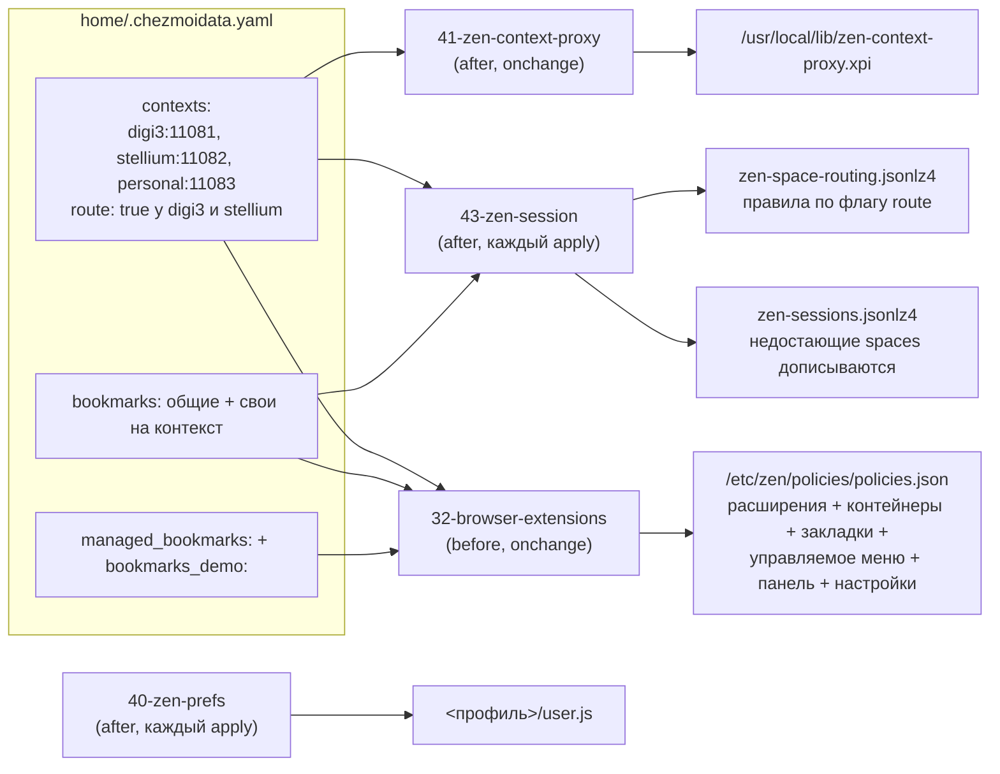

---
covers:
  features: [zen]
  paths:
    - home/.chezmoiscripts/run_onchange_before_32-browser-extensions.sh.tmpl
    - home/.chezmoiscripts/run_after_40-zen-prefs.sh.tmpl
    - home/.chezmoiscripts/run_onchange_after_41-zen-context-proxy.sh.tmpl
    - home/.chezmoiscripts/run_after_43-zen-session.sh.tmpl
    - home/dot_local/share/applications/zen.desktop.tmpl
---

# Изоляция в браузере: Zen, контейнеры и расширения

[isolation.md](isolation.md) объяснил общую картину: одно окно Zen, три рабочих
контекста, каждый со своей сетью. Этот документ — про браузерную половину этой
картины: как [space в Zen](glossary.md#space-в-zen) оказывается привязан к
[контейнеру Firefox](glossary.md#контейнер-firefox), как контейнер получает
свой прокси, и что для этого ставится в браузер автоматически. Начинается
ровно там, где обрывается [isolation-network.md](isolation-network.md) —
на портах `1108x` на хосте; что происходит дальше моста, туда и за
`killswitch.md`. Куда именно попадает ссылка, кликнутая снаружи браузера —
тема соседнего [isolation-links.md](isolation-links.md).

## Что это даёт

У тебя одно окно браузера Zen. Внутри него несколько раскладок вкладок
(«spaces»): одна для одной работы, другая для другой, третья для личного.
Переключаешь раскладку — и браузер показывает только вкладки этой работы,
а не вообще все.

Каждая такая раскладка привязана к отдельной «банке» состояния браузера:
свои куки, свой вход на сайты, своя история. Сайт, открытый в одной раскладке,
не видит, что ты залогинен в тот же сайт под другим аккаунтом в другой
раскладке — как будто это два разных человека за двумя разными компьютерами.
И — это уже касается сети, а не браузера — трафик каждой раскладки уходит в
интернет через отдельный, свой собственный сетевой канал (как именно, разобрано
в [isolation-network.md](isolation-network.md)).

Всё это: сами эти «банки» с куками, распределение имени работы по цвету и
значку, привязка каждой банки к своему сетевому каналу — ставится и настраивается
само, при `chezmoi apply`, без единого клика по меню браузера. Три вещи из
этого при этом обязательны и их нельзя выключить, не сломав саму изоляцию;
остальное можно было бы делать и руками, просто автоматом надёжнее.

Одна часть этого применяется только на профиле, которого браузер ещё не
касался, — сами контейнеры. Остальное пересчитывается на каждом `apply` и
аккуратно уживается с тем, что уже есть: настройки профиля переписываются,
недостающие пространства дописываются рядом с твоими, правила маршрутизации
обновляются на месте и не трогают заведённые руками. **Новая машина получает
всё сама, работающая не теряет ничего своего.**

## Как это работает

Работа устроена в два такта: один раз при каждом `chezmoi apply` — раскладываются
файлы; и каждый раз при старте Zen — сам браузер их читает и раскладывает
контейнеры, расширения и прокси.



А вот что происходит при самом запуске Zen — это уже не наш код, а движок
Gecko, читающий то, что разложили скрипты выше:


### Политика: расширения, контейнеры, закладки — скрипт 32

Расширения в Zen (и в Firefox — он тоже есть на машине, для всего остального)
ставятся не через магазин, а через **политику предприятия**: файл, который
браузер читает при старте и исполняет сам, без диалогов и подтверждений.

Файл называется `policies.json`, и первое, что здесь легко сделать неправильно:
каталог, куда его класть, не литеральный `/etc/firefox/`. Gecko вычисляет
каталог из имени приложения текущей сборки, а не берёт его литералом — как
именно, откуда берётся имя и почему это не `RemotingName`, как можно было бы
подумать по аналогии с реестром Windows, разобрано в «Почему именно так». У
Zen это имя — `zen`, значит каталог `/etc/zen/policies/policies.json`, а
`/etc/firefox/policies/` браузер Zen вообще не открывает. Ошибка здесь
**молчаливая**: положи файл не в тот каталог — браузер стартует как ни в чём
не бывало, не пишет ни строки в лог, и просто не имеет ни одного из
перечисленных в политике расширений. На этой машине оба каталога существуют
одновременно и с разным содержимым — `/etc/zen/policies/policies.json` несёт
весь стек контейнеров, `/etc/firefox/policies/policies.json` только запись про
Bitwarden, — что и доказывает, что дерево `/etc/firefox/` для Zen не значит
ничего:

```sh
cat /etc/firefox/policies/policies.json
```
```json
{
  "policies": {
    "DisableAppUpdate": true,
    "DefaultSerialGuardSetting": 3,
    "ExtensionSettings": {
      "{446900e4-71c2-419f-a6a7-df9c091e268b}": {
        "installation_mode": "normal_installed",
        "install_url": "https://addons.mozilla.org/firefox/downloads/latest/bitwarden-password-manager/latest.xpi"
      }
    }
  }
}
```

Скрипт строит политику для Firefox и для Zen одним и тем же кодом
(`write_gecko_policy`, `run_onchange_before_32-browser-extensions.sh.tmpl`),
принимающим шесть аргументов — `dir`, `extensions`, `containers`, `bookmarks`,
`managed`, `preferences`. Вызовов ровно два, и они выписаны отдельными
строками, а не собраны циклом по списку приложений: Firefox получает только
расширения (`write_gecko_policy /etc/firefox "$ff_exts" '' '' '' ''`), Zen —
весь стек. Данные каталога доезжают до этих строк через heredoc в кавычках,
чтобы апостроф в заголовке закладки не разваливал команду. Firefox тут браузер
для всего, что не требует контекстов; остальное в этом документе — только про
Zen.

Седьмой ключ, `DisplayBookmarksToolbar`, скрипт добавляет сам, без отдельного
аргумента — как только в политике есть хоть один из двух видов закладок.
Почему это обязательно, разобрано ниже, в «Панель закладок спрятана».

Каждое расширение в `ExtensionSettings` ставится в одном из двух режимов:

| Режим | Что позволяет | Расширения у Zen |
|---|---|---|
| `force_installed` | нельзя ни выключить, ни удалить | Multi-Account Containers, Open external links in a container, наш `context-proxy`, uBlock Origin |
| `normal_installed` | можно выключить (официальная формулировка Mozilla: «allows it to be disabled by the user»); удаление тем же кодом политики тоже придерживается — `disallowFeature('uninstall-extension:…')` в `Policies.sys.mjs` вызывается для обоих режимов одинаково, различие именно в «выключить» | Temporary Containers, Bitwarden и восемь инструментов второго слоя (список ниже) |

Шестнадцать расширений делятся на два слоя. Три `force_installed` из четырёх — это
не настройка на вкус, это **сама граница** изоляции контекстов:

- **Multi-Account Containers** даёт сам механизм банок кук и интерфейс к ним.
  Без него никаких контейнеров нет вообще — всё сливается в одну обычную
  сессию браузера.
- **Open external links in a container** обрабатывает протокол `ext+container:`,
  которым передаётся ссылка вместе с именем контейнера (закладки, `zen-open` —
  подробнее [isolation-links.md](isolation-links.md)). Без него такая ссылка
  просто ничего не открывает.
- **`context-proxy`** — собственное расширение, ниже — раздаёт прокси по
  контейнерам. Без него у контейнеров есть куки, но нет сети: весь трафик
  тихо идёт напрямую с хоста, никак не показывая, что что-то не так.

Удаление любого из этих трёх не сообщает об этом нигде в интерфейсе — вкладки
продолжают открываться, просто без изоляции того слоя, за который отвечало
удалённое расширение.

Второй слой к изоляции отношения не имеет, это просто рабочие инструменты,
приезжающие тем же механизмом:

- **uBlock Origin** — блокировщик рекламы; `force_installed` по прямому
  решению: везде и всегда. Он же уходит и в политику Firefox.
- **Obsidian Web Clipper** — страница в Markdown одной кнопкой. Требует одной
  ручной настройки (см. «Настроенное руками»), сам Obsidian не нужен.
- **Auto Tab Discard** — выгрузка неактивных вкладок по таймеру простоя.
  Существует рядом с `browser.tabs.unloadOnLowMemory` из `user.js` не по
  недосмотру: штатный механизм — аварийный тормоз, он срабатывает только когда
  свободной памяти меньше 5% или 200 МБ
  (`AvailableMemoryWatcherLinux.cpp`), и выгружает по одной вкладке. Таймер —
  то, что реально держит стопку фоновых вкладок вне памяти, пока до аварии ещё
  далеко.
- **SponsorBlock** — пропуск рекламных вставок внутри роликов YouTube. Хотелся
  для пространства `home`, но расширения живут на профиле, а не на контейнере,
  поэтому он просто есть везде и заметен только там, где открыт YouTube.
- **User-Agent Switcher and Manager** — подмена агента браузера для сайтов,
  пускающих только «из Edge». Молчит, пока не попросят кнопкой на панели.
- **Consent-O-Matic** — сам отвечает на GDPR-баннеры, причём отказом, а не
  согласием. Расширение исследователей Орхусского университета.
- **Return YouTube Dislike** — возвращает счётчик дизлайков на YouTube.
- **SingleFile** — сохраняет страницу в один html-файл целиком, с картинками и
  стилями. Дополняет клиппер: Markdown — для агента, SingleFile — когда нужна
  точная копия.
- **LanguageTool** — грамматика и орфография в полях ввода. Оговорка: текст
  для проверки по умолчанию уходит на сервер LanguageTool.
- **ClearURLs** — молча срезает следящие параметры (`utm_...`) из ссылок.
- **Refined GitHub** — пара сотен мелких правок интерфейса GitHub: отставание
  ветки PR, фильтр активности в обсуждениях, видимые пробелы в диффах.

**Контейнеры** тоже приходят политикой, ключ `Containers.Default`, по одному
на каждую запись `contexts:`, плюс `home` последним — единственный без пары в
`contexts:` и без прокси. Он описан отдельным ключом каталога,
`plain_context:`, потому что определяется не работой, а её отсутствием, и
второго такого быть не может (подробнее — [isolation.md](isolation.md)):

```json
"Containers": {
  "Default": [
    { "name": "digi3", "icon": "briefcase", "color": "blue" },
    { "name": "stellium", "icon": "briefcase", "color": "green" },
    { "name": "personal", "icon": "briefcase", "color": "purple" },
    { "name": "home", "icon": "chill", "color": "cyan" }
  ]
}
```

Цвета рабочих контекстов раздаются по кругу из списка на семь значений, а
`cyan` из этого списка намеренно вынут и оставлен за `home`: сколько бы работ
ни завелось, «не работа» останется отличимой на глаз. Цвет и значок при этом
берутся из каталога, а не зашиты в скрипт — как и само имя.

Это подхватывает движок Gecko сам: `ContextualIdentityService.sys.mjs`,
метод `init()`, читает `Containers.Default` из активной политики и
присваивает `userContextId` последовательно, 1..N, в порядке массива — но
**только если у профиля ещё нет своего `containers.json`** (механизм отката
на чтении файла — в «Почему именно так»). Отсюда: новая машина получает
контейнеры сама, а работающая машина не переписывается на каждый `apply`.

На свежем профиле номера поэтому идут ровно 1, 2, 3, 4, а на пожившем — уже
как получится: удалённые и заново созданные контейнеры оставляют дыры, и
нумерация течёт вместе с историей профиля. Оба состояния этой машины показаны
в разделе «Как проверить» ниже. Это и есть главная причина, почему расширение
`context-proxy` ищет контейнер по имени, а не полагается на номер —
подробности в следующем разделе.

**Закладки** приходят двумя разными политиками, и разница между ними не
косметическая — они хороши в противоположном.

`Bookmarks` — настоящие закладки на панели, по записи на каждую пару
«работа × закладка», с `Folder` равным имени контекста и адресом вида
`ext+container:name=<контекст>&url=<encoded>`. Сверка на **каждом** старте
браузера, но устроена она не так, как кажется, и от этого зависит, что можно
трогать руками. `calculateLists` (`BookmarksPolicies.sys.mjs:101-185`,
распаковано из `browser/omni.ja` этой сборки) складывает две карты — «что в
политике» и «что уже лежит в Places» — и **ключ у обеих один и тот же:
адрес**, `bookmark.url.href` (`:114-118`). Дальше берётся пересечение: адрес,
который есть в обеих картах, вычёркивается из обеих и не попадает никуда
(`:145-153`). Оставшееся в политике идёт в `toAdd`, оставшееся в Places — в
`toRemove`. Шага «обновить» нет вовсе.

Отсюда всё поведение, и оно приятнее ожидаемого:

| Что сделал руками | Что будет после перезапуска |
|---|---|
| Переименовал закладку | имя останется твоим: адрес совпал, запись в пересечении, её не трогают |
| Перетащил в другую папку | останется там же, по той же причине |
| Удалил | вернётся: адрес пропал из Places, политика видит его только в своей карте и добавляет заново |
| Поменял адрес | старого адреса больше нет — придёт исходная закладка, а исправленная останется рядом как обычная |
| Убрал строку из каталога | закладка исчезнет из браузера: она осталась только в карте Places |

Личные закладки не задеваются: карта Places строится не по всему дереву, а
только по записям с префиксом guid `PolB-` (папки — `PolF-`), которые сама
политика и создала (`:117`). Папки снимаются отдельно и **по заголовку**
(`:172-175`), а не по адресу — переименованная руками папка политики для неё
чужая, и на следующем старте рядом появится папка с исходным именем.

`ManagedBookmarks` — не закладки вовсе, а отдельная кнопка-меню на той же
панели, которую браузер перечитывает из политики при каждом старте. В Places
её содержимое не попадает, поэтому и трогать нечего: ни переименовать, ни
удалить, ни перетащить. Взамен — вложенность любой глубины, единственное,
чего `Bookmarks` не умеет (там ровно один уровень папок, `Folder` это строка,
а не путь).

| | `Bookmarks` | `ManagedBookmarks` |
|---|---|---|
| Что это | настоящие закладки на панели | read-only меню под своей кнопкой |
| Глубина папок | ровно один уровень | любая |
| Переименование, перенос | переживают | невозможны |
| Удаление | отменяется на следующем старте | невозможно |
| Строку убрали из каталога | исчезает из браузера | исчезает из меню |
| Свои закладки | не затрагиваются, у наших префикс `PolB-` | в Places вообще не попадают |

Источник для второй — ключ `managed_bookmarks:` в каталоге, и его форма это
форма самой политики, чтобы не изобретать второй язык описания: элемент с
`toplevel_name` задаёт имя кнопки, остальные — узлы `name`+`url` либо
`name`+`children`. Единственное добавление от нас — необязательное поле
`context` рядом с `url`: оно превращает адрес в `ext+container:`, то есть
вшивает контейнер в саму ссылку, ровно как у `Bookmarks`. Дерево собирает `jq`
(`walk`), он же сначала проверяет, что каждое встреченное имя контекста есть в
`contexts:`. Опечатка здесь валит `apply`, и это сделано нарочно: расширение
`context-proxy` **создаёт** контейнер под ненайденное имя (см. следующий
раздел) и создаёт его без прокси, так что закладка с опечаткой выглядела бы
рабочей и выходила бы в сеть напрямую с хоста.

Разницу между двумя механизмами видно руками: ключи `bookmarks_demo:` и
`managed_bookmarks:` в каталоге несут по демонстрационной папке — «ДЕМО
обычные» с тремя ссылками, чьи заголовки прямо говорят, что с ними делать, и
«ДЕМО read-only» с тремя уровнями вложенности. Оба демо-ключа удаляются одной
правкой каталога, когда надобность отпадёт; ничего кроме них на эти ключи не
смотрит.

Что происходит с закладкой при клике — тема
[isolation-links.md](isolation-links.md); здесь только то, кто её туда кладёт.

**Панель закладок спрятана**, и это не мелочь: оба механизма живут на ней.
Zen выставляет `browser.toolbars.bookmarks.visibility` в `"never"`
(`browser/omni.ja` → `defaults/preferences/firefox.js:1520`), перебивая
`"newtab"`, который ставит сам Firefox строкой выше по тому же файлу (`:1140`).
Закладки политики поэтому были невидимы на этой машине ровно столько, сколько
существовали, а управляемое меню — хуже чем невидимо: оно существует
**только** как кнопка на панели — `browser-init.js:717-779` создаёт её и
кладёт в `CustomizableUI.AREA_BOOKMARKS`, и другого места для неё в коде нет, —
так что спрятанная панель означает, что до меню нет вообще никакого способа
добраться. Отсюда
`DisplayBookmarksToolbar: "always"` в политике. Политика эта
`runOncePerModification`, то есть применяется один раз на каждое изменение
своего значения, а не на каждый старт — спрятать панель обратно руками
по-прежнему можно, и это переживёт перезапуск.

### Расширение context-proxy: сборка и подмена прокси — скрипт 41

Назначение прокси конкретному контейнеру Multi-Account Containers умеет
делать сама, руками, через «Advanced proxy settings» — но там два отказа, и
ни один не называет настоящую причину: строка `socks5://…` не парсится
(`parseProxy` принимает только `http`/`https`/`socks`/`socks4`), а поле
прокси не появляется без отдельного необязательного права `proxy`; разбор
обоих — в «Почему именно так».

Вместо этого прокси на контейнер раздаёт собственное расширение,
`context-proxy@dotfiles.local`, около шестидесяти строк. Оно собирается
заново при каждом `chezmoi apply` в `/usr/local/lib/zen-context-proxy.xpi` и
ставится политикой как `force_installed` с `install_url`
`file:///usr/local/lib/zen-context-proxy.xpi`.

Таблица контекстов **зашивается прямо внутрь `background.js`** при сборке —
из того же `contexts:` в `.chezmoidata.yaml`, откуда берутся мосты на хосте
и юниты в контейнере (см. [isolation-network.md](isolation-network.md)):

```js
const CONTEXTS = [
  { name: "digi3", port: 11081, color: "blue", icon: "briefcase" },
  { name: "stellium", port: 11082, color: "green", icon: "briefcase" },
  { name: "personal", port: 11083, color: "purple", icon: "briefcase" },
];
const PLAIN = { name: "home", color: "cyan", icon: "chill" };
```

(реальное содержимое собранного файла на этой машине, распаковано из
`/usr/local/lib/zen-context-proxy.xpi` 2026-07-30 — совпадает со скриптом
дословно). Порт больше не может разойтись сам с собой: он один и тот же и в
`.chezmoidata.yaml`, и в юните моста на хосте, и здесь.

Внутри — единственный слушатель, `browser.proxy.onRequest`:

```js
async function handler(info) {
    if (info.tabId < 0) { return {}; }      // нет вкладки — некому назначить прокси
    ...
    tab = await browser.tabs.get(info.tabId);
    return byStore.get(tab.cookieStoreId) || {};
}
```

Для каждой вкладки расширение смотрит её `cookieStoreId` (тот самый
идентификатор Firefox-контейнера) и отдаёт объект прокси
`{ type: "socks", host: "127.0.0.1", port, proxyDNS: true }` — `"socks"` в
терминах `browser.proxy` и есть SOCKS5 (`"socks4"` — старая версия), а
`proxyDNS: true` значит, что имя резолвится не на хосте, а уже внутри
контейнера, той же машиной, что и сам прокси (это и обеспечивает
[remote DNS](glossary.md#dns-и-remote-dns), на который ссылается
[isolation.md](isolation.md) в таблице «Что изолировано надёжно»). Запроса
без вкладки (`tabId < 0`) точно так же нет — расширение возвращает пустой
объект, и Firefox шлёт такой запрос напрямую с хоста; это тот же зазор, что и
у Multi-Account Containers, разобранный в [isolation.md](isolation.md),
раздел «Что не изолировано».

**Контейнеры ищутся по имени, а не по сохранённому id** — функция `resolve`:

```js
async function resolve(spec) {
    let found = await browser.contextualIdentities.query({ name: spec.name });
    if (found.length) { return found[0]; }
    return await browser.contextualIdentities.create({ ... });
}
```

Причина ровно та, что разобрана в предыдущем разделе: `userContextId`
раздаются в порядке создания и накапливают дыры от удалённых и заново
созданных контейнеров, так что на другой машине — да и на этой же машине
спустя полгода — числа будут другими. Имя единственное, что остаётся
стабильным.

**Если контейнера с таким именем нет — расширение его создаёт само**,
`contextualIdentities.create({ name, color, icon })`, с цветом и значком из
таблицы `CONTEXTS`, а не из чего-либо, что уже могло существовать под
похожим именем. Это закрывает последнюю дыру ручной настройки: имя, набранное
с опечаткой при заведении контекста, больше не даёт контейнер без прокси —
расширение при следующем срабатывании (запуск браузера, либо создание/
удаление/переименование любого контейнера — на все три события подписан
`rebuild()`) заведёт правильно названный контейнер заново. Обратная сторона
этого же поведения: если контейнер переименовать руками в интерфейсе Zen, а
не в `contexts:`, расширение при следующей сборке карты создаст **ещё один**
контейнер со старым именем и без истории — оно не умеет мигрировать, только
искать и создавать.

**Расширение неподписанное, и до 30 июля 2026 это означало, что оно не
устанавливалось вообще.** Отказ был идеально молчаливым: браузер стартовал, в
профиле лежали четыре расширения с AMO, а нашего не было ни в `extensions/`, ни
в `extensions.json`, ни в `about:addons`. Единственный след — строка в консоли
браузера:

    Download failed - ERROR_SIGNEDSTATE_REQUIRED - file:///usr/local/lib/zen-context-proxy.xpi

Ловушка в том, что условий здесь два, а выглядят они как одно. Первое —
`AppConstants.MOZ_REQUIRE_SIGNING = false` в сборке Zen (подтверждено:
`modules/AppConstants.sys.mjs` в распакованном `/opt/zen-browser-bin/omni.ja`,
zen-browser-bin 1.21.9b-1). Оно **не отключает проверку подписи**, а лишь
переводит её из константы кода в обычную настройку: `AddonSettings.sys.mjs:32-48`
при истинном `MOZ_REQUIRE_SIGNING` жёстко пишет `REQUIRE_SIGNING = true` без
возможности переопределить, а при ложном — навешивает
`defineLazyPreferenceGetter` на `xpinstall.signatures.required`.

Второе условие — значение самой этой настройки, и вот здесь всё и ломалось.
Toolkit действительно ставит её в `false` (`greprefs.js:1157` в
`/opt/zen-browser-bin/omni.ja`), но дефолты **приложения** читаются позже и
перебивают дефолты toolkit, а Zen выставляет её в `true` — дважды, в
`browser/omni.ja` → `defaults/preferences/firefox.js:27` и `:1611`. Итог:
`REQUIRE_SIGNING` истинно, `XPIInstall.sys.mjs:1667` отклоняет установку с
`ERROR_SIGNEDSTATE_REQUIRED`, и никто об этом не узнаёт.

Поэтому политика Zen выставляет настройку сама:

```json
"Preferences": {
  "xpinstall.signatures.required": { "Value": false, "Status": "locked" }
}
```

Политикой, а не через `user.js`: политика читается **до** создания профиля,
поэтому расширение приезжает при первом же запуске браузера, а не после
второго `apply`. `locked` — чтобы значение нельзя было сбить из `about:config`
и чтобы оно не вернулось после обновления Zen.

Право поставить именно эту настройку политике даёт то самое первое условие:
`Policies.sys.mjs:2464-2466` добавляет `xpinstall.signatures.required` в список
разрешённых префиксов **только** при `!AppConstants.MOZ_REQUIRE_SIGNING`. То
есть сборка, которая когда-нибудь включит флаг, разом и потребует подпись, и
запретит политике её отключать — и расширение снова перестанет грузиться.

Каталог приложения как обходной путь не годится: неподписанное там разрешено
(`AppConstants.sys.mjs:117`, `MOZ_UNSIGNED_APP_SCOPE: true`), но сканирование
каталогов вне профиля выключено (`:121`, `MOZ_ALLOW_ADDON_SIDELOAD: false`), да
и pacman стирал бы файл при каждом обновлении Zen.

На случай, когда это всё-таки сломается, `run_after_zz-next-steps.sh` (не тема
этого документа) при каждом `apply` проверяет, что расширение **загружено** — по
полю `active` в `extensions.json`, а не по наличию `.xpi` на диске. Разница
принципиальная: файл, оставшийся от прошлой установки, не говорит ничего, да и
у отключённого расширения файл тоже на месте.

Разбор того, как это выглядело и как искалось, —
[docs/issues/2026-07-30-zen-extension-never-installed.md](issues/2026-07-30-zen-extension-never-installed.md).

Конфиг зашит внутрь XPI, а не приходит отдельной политикой `3rdparty` через
`storage.managed`: на одну движущуюся часть меньше, а файл и так пересобирается
заново при каждом `apply`. Это работает потому, что функция
`installAddonFromURL` специально исключает адреса `file:` из проверки «тот же
аддон — не переустанавливать» — код, условие и разбор того, гарантированно ли
это работает при простой смене порта, — в «Почему именно так».

### Настройки user.js — скрипт 40

Часть решений не выразить политикой — политика Zen покрывает только
подмножество настроек, а сами профили Zen прячет за `about:profiles`, так что
стабильного пути «положить файл сюда» для конкретного профиля просто нет.
Вместо этого скрипт 40 кладёт `user.js` в каждый найденный профиль:
файл, который Gecko перечитывает **при каждом старте**, а не один раз при
установке — то, что нужно именно здесь, поскольку каждая из настроек ниже не
пожелание, а требование для изоляции.

Скрипт ищет профили в обоих возможных корнях (`~/.zen` — старые сборки Zen,
`~/.config/zen` — нынешние) и пишет `user.js` в каждый каталог, где уже есть
`prefs.js` или `times.json` (это отличает настоящий профиль от служебного
каталога `Profile Groups`, у которого нет ни того ни другого). Если профиля
ещё нет вообще — Zen ни разу не запускался — скрипт молча заканчивается
строкой «Zen has not created a profile yet, skipping prefs.»; настройки
появятся после первого запуска и следующего `apply`.

Ровно девять `user_pref`, сверено построчно со скриптом:

| Настройка | Значение | Зачем |
|---|---|---|
| `network.proxy.allow_hijacking_localhost` | `true` | По умолчанию браузер не пускает `localhost` через прокси: рабочая вкладка, обращаясь к `127.0.0.1:5000`, попадала бы на loopback **хоста**, а не контейнера — дев-сервер внутри контейнера был бы недоступен из своей же вкладки, а хостовые порты, наоборот, доступны из любого контекста. Это же делает возможным тест с [«ответчиком по имени»](glossary.md#127001) из isolation-network.md. У прохода `localhost` через прокси есть и контейнерная половина — IPv4-первый резолв в `/etc/gai.conf`, шаг 5 «Пути запроса» в [isolation-network.md](isolation-network.md) |
| `permissions.default.desktop-notification` | `2` (запрещено по умолчанию) | Уведомления — поверхность утечки во время демонстрации экрана |
| `network.protocol-handler.external.ext+container` | `true` | Без этого протокол `ext+container:` не обрабатывается как внешний вовсе — передача ссылки снаружи не работает |
| `security.external_protocol_requires_permission` | `false` | Без этого каждая передача такой ссылки упирается в диалог подтверждения |
| `signon.rememberSignons`, `signon.autofillForms` | `false`, `false` | Пароли живут в Bitwarden. Автозаполнение браузера воспроизводило бы ровно сценарий утечки: форма чужого тенанта загрузилась, данные ушли, вход попал в его журналы |
| `browser.shell.checkDefaultBrowser` | `false` | Zen при первом запуске сам забирает `x-scheme-handler/http(s)` и вписывает себя в `mimeapps.list`, подменяя пикер ссылок — обработчиком по умолчанию должен оставаться Junction ([isolation-links.md](isolation-links.md)) |
| `browser.tabs.unloadOnLowMemory` | `true` | Память — выгружать неактивные вкладки при её нехватке |
| `dom.ipc.processCount` | `4` | Память — потолок числа content-процессов |

`fission.autostart` **намеренно не трогается** нигде в скрипте: изоляция
сайтов внутри Gecko стоит памяти, но ломать её ради нескольких сотен
мегабайт — плохой размен.

Одна настройка **намеренно отсутствует**, и это решение, а не забывчивость:
`media.peerconnection.ice.proxy_only`. Она стояла здесь до 31 июля 2026 и
закрывала честную дыру — звонковый трафик (WebRTC) идёт мимо прокси, напрямую
с хоста. Но закрывала ценой полной смерти звонков во всём браузере: настройки
общие на все контейнеры, в контейнерах без прокси у звонка не оставалось ни
одного разрешённого пути, а через SOCKS Firefox медиапотоки гнать не умеет.
Чат работал, звонок не начинался никогда, с сообщением «не удалось
соединиться». Владелец счёл домашний IP неконфиденциальным и снял настройку;
последствие записано в [isolation.md](isolation.md), раздел «Что не
изолировано».

### Spaces и маршруты — скрипт 43

Последний штрих делится на две стадии, и обе пишут в бинарные файлы профиля.
Стадия 1 заводит сами `space` в интерфейсе Zen, по одному на контекст, уже
привязанные к контейнеру, плюс закреплённые вкладки-«Essentials» с общими и
контекстными закладками. Стадия 2 пишет правила Space Routing. Без этого шага
человек делал бы то же самое руками после установки: создать space, открыть
«Set Profile» (в интерфейсе Zen эта кнопка выбирает
[контейнер, а не профиль](glossary.md#профиль-браузера) — путаница из-за
неудачного названия), закрепить вкладки, завести правила.

Space получает и `plain_context`, то есть `home`, — он идёт последним и
отличается ровно одним: в его плитки общий список `bookmarks:` не приезжает,
только собственный список `plain_context.bookmarks` — какие плитки несёт home,
решается там, а не общим списком.
В **папку закладок** home общий список при этом кладётся, как и всем (скрипт
32): с тех пор как общий список это почта и календарь, а не рабочие адреса,
ему место во всех четырёх пространствах. Правил Space Routing у `home` нет и
быть не может: флаг `route` живёт на записи в `contexts:`, а `home` там не
значится.

Отказ одной стадии заканчивает только её саму, а не весь скрипт, поэтому
каждая строка вывода называет стадию, из которой пришла. Это `run_after`, а не
`run_onchange`: что скрипт делает, зависит от состояния профиля, а не от
содержимого самого скрипта, и пересчитывать это надо на каждом `apply`.

Обе стадии пишут внутренние форматы Zen без каких-либо обещаний совместимости
между версиями, и в первом из них вдобавок лежат вообще все открытые вкладки
текущей сессии. Файл — это блок LZ4 (заголовок `mozLz40\0` + 4 байта длины)
поверх JSON; скрипт кодирует его сам, ровно одним видом LZ4-блока — «только
литералы, без единого совпадения» (blockToken старшая половина байта = длина
литерала, без последующей пары смещение/длина совпадения) — валидным по
спецификации LZ4, потому что финальная последовательность блока обязана быть
именно такой, и ничего сложнее для записи не требуется; читает его сам Zen тем
же штатным декодером.

**Стадия 1 дописывает, а не замещает.** Раньше она писала только в профиль,
где нет вообще ни одной вкладки. Звучало осторожно, а на деле было мёртвым
кодом: измерено 30 июля 2026 — первый запуск Zen, тот самый шаг, который
создаёт нужные этой стадии контейнеры, оставляет после себя четыре вкладки и
space с именем «Space». Проверка срабатывала на любой реальной машине, и засев
не отработал **ни разу за всё время существования**. Дописывание убирает
причину для такой проверки; осталась честная — контекст, для которого space уже
есть, пропускается по имени.

| # | Условие отказа | Что именно происходит |
|---|---|---|
| 1 | `pgrep -x zen-bin` находит живой процесс | Единственный отказ, который по-прежнему кончает весь скрипт: Zen перепишет оба файла из памяти при выходе, так что записанное сейчас всё равно не переживёт закрытия браузера |
| 2 | Для какого-то контекста ещё нет записи в `containers.json` | Контейнер создаёт политика при первом запуске Zen на чистом профиле — если Zen ещё ни разу не стартовал, привязывать space не к чему; сообщение прямо называет, каких контекстов не хватает |
| 3 | Файл сессии не читается или имеет не ту форму | Профиль пропускается целиком, `apply` идёт дальше. Проверяется и то, что `tabs` и `spaces` — списки, и то, что внутри `spaces` лежат объекты: без этого битый файл ронял бы `apply` исключением, а не сообщением |
| 4 | У всех контекстов space уже есть | Печатается «every context already has a space», стадия заканчивается, стадия 2 всё равно отрабатывает |

`containerTabId` каждого space читается из `containers.json` по имени
(`userContextId` конкретного, уже реально существующего контейнера), а не
предсказывается по порядку — та же причина, что и у `context-proxy`: политика
действительно нумерует 1..N в порядке массива, но только на чистом профиле, а
скрипту нужно работать и на профиле, который старше самой политики.

Закреплённые вкладки несут **обычный** `url`, в отличие от закладок из
политики, которые несут `ext+container:`. Разница не случайна: закреплённая
вкладка уже сидит в конкретном space, который уже привязан к конкретному
контейнеру, и прямо указывает свой `userContextId` в самой записи вкладки —
контейнер ей задан средой, а не адресом. Закладка, наоборот, может быть
кликнута из любого space, и поэтому обязана нести свой контейнер в самой
ссылке (это уже подробность [isolation-links.md](isolation-links.md)).

**Стадия 2: Space Routing.** Штатная фича Zen, не наша выдумка: правило вида
«адрес содержит такой-то текст → открыть в таком-то пространстве». Поскольку
пространство привязано к контейнеру, вместе с пространством приезжает и прокси
(`ZenSpaceRoutingManager.sys.mjs:101-112` — открывающаяся вкладка берёт
`userContextId` из `containerTabId` целевого space). Правила лежат в
`<профиль>/zen-space-routing.jsonlz4`, в том же формате mozLz4:

```json
{
  "routes": [
    { "id": "<uuid>", "reference": "digi3", "matchType": "contains", "openIn": "<id space>" }
  ],
  "defaultRouteExternal": "most-recent-space"
}
```

Скрипт собирает их из `contexts:` по флагу `route`, проверяя **значение**, а не
наличие ключа: `route: false` должно означать «выключено», а не «включено».
`reference` — имя контекста, `matchType` — `contains`.

Сравнение идёт по **всему адресу**, а не только по хосту — `isRouteMatching`
для `contains` делает буквально `uri.includes(reference)` по всей строке,
приведённой к нижнему регистру (`:313-319`), — и это единственное, чем такое
правило лучше «Always Open This Site in…»: путь
`dev.azure.com/<организация>` покрывается путём, а не доменом. Всё остальное
про эти правила ровно такое же, и главное — то же самое: правило не
подсказывает, а **вытаскивает** ссылку. Поэтому под флагом только имена
контекстов, только достаточно редкие в качестве подстроки — `digi3` и
`stellium` да, а `personal` нет, слово попадается в обычных адресах вроде
`github.com/settings/personal-access-tokens`, — и никогда общие домены
Microsoft, по той же причине, по которой на них нельзя ставить правила
Multi-Account Containers. Отказ выглядит так: чужая страница, в адресе которой
случайно оказалось имя контекста, уедет в его пространство и выйдет в сеть
через его VPN.

Важное следствие, которое стоит знать до того, как заводить новое правило:
**правило перебивает контейнер, выбранный явно.** Проверка
`#shouldSkipProcessing` пропускает маршрутизацию только для закреплённых
вкладок, вкладок в группе, восстановления сессии и явного `skipRoute` — того,
что у вкладки уже задан `userContextId`, среди причин нет. А при совпадении
правила строка `userContextId = targetWorkspace.containerTabId` (`:106-112`)
просто перезаписывает его. То есть ссылка, открытая через
`zen-open personal <адрес>`, но содержащая в адресе слово `digi3`, приедет в
контейнер digi3 — несмотря на то, что контейнер был назван в самой ссылке.

Закреплённые вкладки от этого защищены по построению: `pinned` — первое, что
проверяет тот же метод, так что Essentials, разложенные стадией 1, остаются
там, где их положили.

Файл не только наш: рукописные правила и `defaultRouteExternal` при записи
сохраняются, а не затираются. Свои правила скрипт держит по детерминированному
`id` (`uuid5` от имени контекста), чтобы второй `apply` обновлял их на месте, а
не подкладывал копию: Zen берёт **первое** совпадение в порядке массива
(`routeUri`, `:276-295`, с комментарием ровно об этом в самом коде), так что
дубль на один `reference` — это молчаливая смена поведения, а не просто мусор. Рукописное правило с тем же `reference` скрипт не трогает и говорит об
этом вслух. Пишется файл только при реальном изменении, через временный файл и
`os.replace`.

### Ярлык запуска — zen.desktop

`~/.local/share/applications/zen.desktop` тем же именем файла перекрывает
`/usr/share/applications/zen.desktop`, поставленный пакетом — и различия с
оригиналом ровно два, оба про то, чтобы это не сломало изоляцию:

- `Exec` идёт через `slice-run browser-zen.slice ...`, а не запускает
  `zen-browser` напрямую — весь Zen целиком ограничен по памяти этим
  [systemd slice](glossary.md#systemd-slice) (сам механизм `slice-run` и
  бюджеты памяти разобраны в [browsers.md](browsers.md)).
- `MimeType` **не несёт** `x-scheme-handler/http` и `x-scheme-handler/https`.
  Голая запись «Zen Browser» в системном пикере ссылок открывала бы адрес в
  том контейнере, который использует текущая раскладка — ровно то тихое
  попадание не туда, ради недопущения которого всё это существует. Записи
  по одной на контекст, которые пикер реально показывает, генерирует другой
  скрипт (`run_onchange_after_38-linkrouting.sh.tmpl`, вне этого документа —
  см. [isolation-links.md](isolation-links.md)).

## Что ставится и что меняется

| Категория | Путь | Где | Кто создаёт |
|---|---|---|---|
| Пакеты | `junction`, `zen-browser-bin` (AUR) | Хост | фича `zen` — `default: true`: предвыбрана в чеклисте, потому что на ней стоит вся изоляция контекстов, но её можно снять, и каждый её скрипт закрыт проверкой ключа (комментарий над `key: zen` в `home/.chezmoidata.yaml`) |
| Системная политика Zen | `/etc/zen/policies/policies.json` | Хост, вне дома | скрипт 32 |
| Системная политика Firefox (uBlock Origin, плюс Bitwarden при фиче `bitwarden`) | `/etc/firefox/policies/policies.json` | Хост, вне дома | скрипт 32, если включена фича `firefox` |
| Собранное расширение | `/usr/local/lib/zen-context-proxy.xpi` | Хост, вне дома | скрипт 41 |
| Настройки профиля | `<профиль>/user.js` (`~/.zen/*/` или `~/.config/zen/*/`) | Хост, в доме | скрипт 40 |
| Сессия и spaces | `<профиль>/zen-sessions.jsonlz4` | Хост, в доме | скрипт 43, стадия 1 (дописывает в существующий файл, не создаёт с нуля) |
| Правила Space Routing | `<профиль>/zen-space-routing.jsonlz4` | Хост, в доме | скрипт 43, стадия 2 (сливает со своим содержимым файла) |
| Ярлык запуска | `~/.local/share/applications/zen.desktop` | Хост, в доме | шаблон `zen.desktop.tmpl` |

Ни один из пяти скриптов не трогает ничего внутри distrobox-контейнеров —
весь этот документ целиком про хост.

## Настроенное руками

Автоматизировать получилось не всё. Ниже — то, что остаётся сделать самому
один раз при установке или поменять по мере необходимости; граница проведена
так, что маршрутизация конкретной ссылки в конкретный контейнер (правила
доменов, `zen-open`, пикер) уходит в [isolation-links.md](isolation-links.md)
целиком, а здесь — только то, что настраивается один раз внутри самого
браузера.

1. **Temporary Containers → автоматический режим.** Всё, что открылось мимо
   назначенного контейнера, попадает в одноразовый контейнер и умирает вместе
   с вкладкой — подстраховка для случайных ссылок, а не замена рабочим
   контекстам.
2. **Синхронизация контейнеров выключена.** Пункт *Enable synchronization* в
   Multi-Account Containers заливает имена контейнеров и привязки доменов в
   Firefox Account — список всех рабочих контекстов и их доменов в одном
   месте вне этой машины, прямо против модели угроз из
   [isolation.md](isolation.md).
3. **Правила «Always Open This Site in…» — только на уникальные домены.**
   Никогда на общие вроде `dev.azure.com`, `portal.azure.com`,
   `teams.microsoft.com` или `login.microsoftonline.com`: правило на домен
   *вытягивает* ссылку из её текущего контейнера в указанный, а не наоборот.
4. **Свои закладки на ссылки вне каталога** `bookmarks:`/`contexts[].bookmarks`
   — например, на страницу конкретной задачи в Azure DevOps, которую нет
   смысла держать в общем списке `.chezmoidata.yaml`. Рабочий процесс: открыть
   ссылку через `zen-open <контекст> <url>` (или кликом из уже открытой
   вкладки нужного контекста), скопировать получившийся адрес вида
   `ext+container:name=<Контекст>&url=<encoded>` из адресной строки и добавить
   закладку обычным способом браузера. Такая закладка политикой не
   отслеживается вовсе — диффинг `BookmarksPolicies.sys.mjs` идёт только по
   записям с префиксом `PolB-`/`PolF-`, которые сама же создала, — и живёт как
   обычная закладка Firefox/Zen. Что можно и чего нельзя делать руками с
   каталожными закладками, разобрано выше, в разделе «Политика»: удаление
   отменяется, переименование и перенос переживают. Сама механика протокола
   `ext+container:` и то, как строку собирает `zen-open`, — в
   [isolation-links.md](isolation-links.md).
5. **Закреплённые вкладки сверх тех, что кладёт скрипт 43** — он заводит
   только общие и контекстные закладки из каталога и никогда не трогает
   пространство, которое уже есть.
6. **Настройки Bitwarden**: автозаполнение при загрузке страницы выключено;
   *URI match detection* — `Never` для общих доменов Microsoft, `Host` для
   уникальных; один аккаунт на контекст.
7. **`about:logins` очищен** — пустой список сохранённых логинов Firefox,
   чтобы автозаполнение браузера (даже выключенное по умолчанию, п. `user.js`
   выше) не оставалось источником соблазна включить его обратно.
8. **Obsidian Web Clipper → Save behavior → Copy to clipboard.** Один
   переключатель в настройках расширения; после него главная кнопка попапа
   превращается в «копировать Markdown в буфер», и Obsidian для этого не
   нужен. Настройки расширений живут в профиле, политика их не задаёт.

## Как проверить

Политика реально применилась и контейнеры реально созданы (снято на этой
машине 2026-07-30, три контекста подняты):

```sh
cat /etc/zen/policies/policies.json | python3 -m json.tool | head -20
```
```
{
    "policies": {
        "DisableAppUpdate": true,
        "DefaultSerialGuardSetting": 3,
        "ExtensionSettings": {
            "@testpilot-containers": {
                "installation_mode": "force_installed",
                ...
```

Собранное расширение несёт актуальную таблицу контекстов:

```sh
unzip -p /usr/local/lib/zen-context-proxy.xpi background.js | head -6
```
```
const CONTEXTS = [
  { name: "digi3", port: 11081, color: "blue", icon: "briefcase" },
  { name: "stellium", port: 11082, color: "green", icon: "briefcase" },
  { name: "personal", port: 11083, color: "purple", icon: "briefcase" },
];
const PLAIN = { name: "home", color: "cyan", icon: "chill" };
```

`user.js` реально лежит в профиле (замени `<профиль>` на реальный каталог из
`about:profiles`):

```sh
grep -c '^user_pref' ~/.config/zen/*/user.js
```
Ожидается `9` — по числу строк в таблице выше (строки с двумя настройками
`signon.*` считаются за две).

Контейнеры на профиле есть:

```sh
python3 -c "
import json
d = json.load(open('$HOME/.config/zen/<профиль>/containers.json'))
for i in d['identities']:
    if i.get('public'):
        print(i['userContextId'], i['name'])
"
```
```
1 digi3
2 stellium
3 personal
4 scratch
```

Это вывод на профиле, созданном заново 30 июля 2026, и номера идут подряд —
ровно тот случай, который описывает политика. Контейнер без прокси назывался
тогда `scratch`; переименование в `home` сделано 31 июля, и на этом профиле
оно проявится не заменой строки, а **пятой** строкой. Причина в том же
свойстве: политика на непустом профиле не делает ничего, поэтому `home` заведёт
расширение `context-proxy` — по имени, которого не нашло, — и получит следующий
свободный номер. Осиротевший `scratch` останется, пока его не удалят руками
через настройки контейнеров; он безвреден, но номер занимает навсегда.

На прежнем профиле той же машины номера шли `1 personal`, `6 stellium`,
`7 digi3`, `8 scratch` — те же дыры, накопленные обычной работой.

Именно поэтому и `context-proxy`, и скрипт 43 ищут контейнер по имени:
предсказывать номер можно, но только пока профиль свежий, а работать надо и на
том, который старше самой политики.

Расширения действительно **загрузились** — не просто лежат файлами, а активны
(сверить с шестнадцатью ожидаемыми — пять из таблицы режимов выше плюс
второй слой; полный список id лежит в `$zenExts` скрипта 32):

```sh
jq -r '[.addons[]|select(.active)|.id]|sort|.[]' ~/.config/zen/*/extensions.json \
  | grep -E 'testpilot|f069aec0|c607c8df|446900e4|context-proxy|uBlock0|clipper|c2c003ee|sponsorBlocker|a6c4a591|gdpr@cavi|762f9885|531906d3|languagetool|74145f27|a4c4eda4'
```

Ожидается шестнадцать строк. Пять первых сняты на этой машине 31 июля, до
добавления второго слоя расширений; три новых проверяются тем же способом
после следующего перезапуска Zen.

Фильтр по `.active`, а не список всех записей `addons` и не `ls` каталога
`extensions/` — по причине, разобранной в разделе про подпись: файл на диске не
доказывает ничего, отключённое расширение выглядит так же, как рабочее.

Правила маршрутизации на месте. Файл в формате mozLz4, поэтому `cat` покажет
двоичный мусор — смотреть надо через декодер, тот же, которым его пишет сам
скрипт 43 (`mozlz4_decompress` в
`run_after_43-zen-session.sh.tmpl`). Содержимое на этой машине:

```json
{
  "routes": [
    { "id": "21e11147-…", "reference": "digi3",    "matchType": "contains", "openIn": "{434572b3-…}" },
    { "id": "b0e3412f-…", "reference": "stellium", "matchType": "contains", "openIn": "{04dc3795-…}" }
  ],
  "defaultRouteExternal": "most-recent-space"
}
```

Два правила, по числу контекстов с `route: true`; `personal` здесь быть не
должно.

Обе половины закладок видны глазами, и это единственная проверка, которую
нельзя сделать из терминала: панель закладок открыта сама (не пришлось жать
Ctrl+Shift+B), на ней папки по числу контекстов, папка «ДЕМО обычные» и кнопка
«Управляемые» с вложенным меню. Если панели нет — не сработал
`DisplayBookmarksToolbar`, и управляемого меню на этой машине не существует
вовсе.

Живая проверка того, что space действительно ходит через свой контейнер, а не
через хост, — раздел «Проверка маршрута» в
[isolation-network.md](isolation-network.md): открыть в каждом space
ответчик на `127.0.0.1:8099`, поднятый внутри контейнеров, и убедиться, что
каждый space называет своё имя, а `home` не открывает страницу вообще — у него
нет прокси, и до сети контейнера ему не дотянуться. Это и есть самая наглядная
проверка того, что «без прокси» тут значит именно то, что написано.

## Когда сломалось

| Симптом | Причина | Что делать |
|---|---|---|
| Вкладка в контексте не открывает сайты | Расширение `context-proxy` не загрузилось, или мост на этот порт не поднят (уже тема isolation-network.md) | Проверить командой из раздела выше, что `context-proxy@dotfiles.local` есть среди **активных** расширений профиля; если нет — перезапустить Zen (не свернуть, а закрыть все окна и открыть заново), а если и после этого нет — смотреть на подпись, см. следующую строку |
| После `chezmoi apply` в браузере нет ни одного из ожидаемых расширений | Политика легла не в тот каталог, либо профиль не тот, что читает Zen | `grep -E '^(Name|RemotingName)=' /opt/zen-browser-bin/application.ini`, убедиться что каталог политики — `/etc/<поле Name в нижнем регистре>/policies/`, а не `/etc/firefox/` |
| Контейнер существует, но без прокси и без своей сети | Имя контейнера в интерфейсе Zen разошлось с именем в `contexts:` (переименовали руками) | `context-proxy` при следующем запуске создаст ещё один контейнер с именем из `contexts:` — старый, переименованный, остаётся сиротой без прокси; либо вернуть имя как в `contexts:`, либо перенести данные в новый |
| Ссылка вида `ext+container:...` открывается с диалогом подтверждения на каждый клик | `security.external_protocol_requires_permission` не попал в `user.js` — профиль ещё не получал prefs (Zen не запускался ни разу после установки) или их стёрли вручную | `grep external_protocol ~/.config/zen/*/user.js`; при пустом выводе — запустить Zen один раз, затем `chezmoi apply` заново |
| Space не завёлся | Отказ стадии 1 скрипта 43 — чаще всего «профиль ещё не видел все нужные контейнеры» на самой первой установке; скрипт называет причину вслух | Порядок для новой машины: `chezmoi apply` → запустить Zen один раз, чтобы политика создала контейнеры и профиль → закрыть Zen → `chezmoi apply` ещё раз |
| Правило маршрутизации не появилось, хотя `route: true` стоит | Либо space для этого контекста ещё нет (стадия 2 пишет только по существующим), либо правило с тем же `reference` уже заведено руками — скрипт такое не трогает и говорит об этом | Прочитать вывод `apply`: строки стадии `routing` называют обе причины поимённо |
| Адрес уезжает не в тот space сам собой | Имя контекста оказалось подстрокой обычного адреса, и правило его вытащило | Убрать `route: true` у этого контекста в `contexts:` — правило исчезнет на следующем `apply`; ручные правила Zen при этом сохранятся |
| Логин CLI-инструмента (`az login`, `codex login`) доходит до провайдера, а редирект на `http://localhost:<порт>` падает с «Unable to connect» — при том что мост жив и та же схема у другого инструмента работает | Вкладка со входом оказалась не в том Firefox-контейнере, в чьём distrobox-контейнере запущен CLI: `localhost` через прокси ведёт в контейнер **того space, где живёт вкладка**, и на его порту никто не слушает. Вкладку уводит либо привязка домена провайдера («Always open in...» в Multi-Account Containers — у Microsoft и OpenAI домены входа общие для всех контекстов), либо ручной переход в другую вкладку по ходу SSO. Проверено воспроизведением 2026-08-01: callback-сервер `az login` в digi3 через прокси digi3 отвечает `400`, через прокси соседних контекстов — отказ соединения | Смотреть на бейдж контейнера в адресной строке вкладки входа: он должен называть тот же контекст, где запущен CLI. Увело привязкой — снять её в меню Multi-Account Containers у этой вкладки; довести логин можно и не трогая привязку: скопировать адрес и открыть его вкладкой нужного контейнера |
| `context-proxy` пропал после обновления Zen | Обновление сборки могло включить `MOZ_REQUIRE_SIGNING` — тогда неподписанное расширение перестаёт грузиться, и **политике заодно запрещается** снимать требование подписи (`Policies.sys.mjs:2464-2466`) | `unzip -p /opt/zen-browser-bin/omni.ja modules/AppConstants.sys.mjs \| grep MOZ_REQUIRE_SIGNING`; если стало `true` — расширению нужна подпись AMO, здесь эта проблема не решается |
| `context-proxy` не встал на свежей машине, консоль браузера пишет `ERROR_SIGNEDSTATE_REQUIRED` | Политика не донесла `Preferences` с `xpinstall.signatures.required` — например, `policies.json` перезаписан старой версией скрипта 32 | `jq '.policies \| keys' /etc/zen/policies/policies.json` — если `Preferences` в списке нет, `chezmoi apply` и перезапустить Zen; разбор — [issues/2026-07-30-zen-extension-never-installed.md](issues/2026-07-30-zen-extension-never-installed.md) |

## Почему именно так

**Каталог политики выводится из имени приложения, а не берётся литералом** —
потому что так устроен сам движок Gecko, в две ступени. `_getLocalConfigurationFile`
(searchfox, `toolkit/components/enterprisepolicies/EnterprisePoliciesParent.sys.mjs`)
берёт каталог по ключу `SysConfD` (`Services.dirsvc.get("SysConfD", ...)`) и
дописывает к нему `policies/policies.json`; сам ключ `SysConfD` разворачивает в
реальный путь функция `GetUnixSystemConfigDir` (searchfox,
`xpcom/io/SpecialSystemDirectory.cpp`) — она берёт `/etc` и приписывает к нему
**имя приложения в нижнем регистре**, а имя приложения — это `nsIXULAppInfo.name`,
то есть поле `Name` из `application.ini` (`XREAppData.name`), а не `RemotingName`.
У каждой форк-сборки Firefox это поле своё, и всё, что рассчитывает на
буквальный `/etc/firefox/`, тихо промахивается мимо любого форка, включая Zen.
У Zen оба поля совпадают после приведения к нижнему регистру (проверено на
этой машине: `grep -E '^(Name|RemotingName)=' /opt/zen-browser-bin/application.ini`
→ `Name=Zen` и `RemotingName=zen`), поэтому практического расхождения нет, но
причина каталога `/etc/zen/policies/policies.json` — именно `Name`, лишь
случайно совпадающий с `RemotingName` в этой сборке. Комментарий в самом
скрипте (`run_onchange_before_32-browser-extensions.sh.tmpl`, строки 9-11)
называет источником каталога `MOZ_APP_NAME` и ссылается на `RemotingName` в
`application.ini` — по правилу 8 этого репозитория такие комментарии не
вычищаются, но по чтению исходника Gecko выше это не то поле: рантайм читает
`Name` (`nsIXULAppInfo.name`), а `MOZ_APP_NAME` — это define времени сборки,
до `application.ini` вообще не доходящий. У Zen `Name` и `RemotingName`
совпадают лексически, поэтому комментарий не врёт по результату, но объясняет
его не тем полем. Официальная документация
Mozilla (`firefox-admin-docs.mozilla.org`) при этом сама называет только
`/etc/firefox/policies` — про форки в ней ни слова, и в этом ровно источник
путаницы: за чужой браузер это можно узнать только чтением его
`application.ini`, чтением исходника Gecko или экспериментом. Запись —
[workarounds.md](workarounds.md).

**Почему не поручить прокси Multi-Account Containers, раз оно само это
умеет** — потому что там ровно два отказа, ни один из которых не называет
настоящую причину. Первый: строка `socks5://…` не парсится вообще. Разбор
происходит в `src/js/proxified-containers.js` (репозиторий
`mozilla/multi-account-containers`, функция `parseProxy`) регулярным
выражением `/(?<type>(https?)|(socks4?)):\/\/…/` — группа `type` допускает
только `http`, `https`, `socks` и `socks4`. `socks5` не совпадает ни с одной
альтернативой, `exec` возвращает `null`, `parseProxy` — `false`, и поле не
сохраняется. Сообщение при этом действительно показывается —
`.proxy-validity`/`invalidProxyAlert`, «Please enter a valid proxy URL»
(`src/css/popup.css`, правило `.invalid .proxy-validity`; текст —
`mozilla-l10n/multi-account-containers-l10n`, `en/messages.json`) — но оно
универсальное и не говорит, что дело в цифре «5»: то же сообщение выскочит и
на опечатку, и на пустой хост, и на схему `socks5`. Кто не знает регулярку
заранее, тот не узнает и после ошибки, что `socks://` без цифры — уже SOCKS5
в терминах этого API, и достаточно её убрать. Ровно эту путаницу поймал
`mozilla/multi-account-containers#2669` — репортёр закрыт с ответом
мейнтейнера `bakulf`: «This bug is invalid. The right scheme for Socks5 URLs
is `socks` and not `socks5`» — то есть для проекта это не баг, а название
схемы, совпадающее с ожиданием только у тех, кто уже читал код или этот
тикет. Второй отказ: поле прокси в интерфейсе не появляется вовсе, пока не
выдано отдельное **необязательное** право `proxy` (оно в
`optional_permissions`, а не в `permissions`, манифест расширения). Пока
право не выдано, панель «Advanced proxy settings» (`src/js/popup.js`, метод
`prepare()`) показывает оверлей с кнопкой «Enable» и блокирует
(`el.disabled = true`) все поля внутри панели. Запись — [workarounds.md](workarounds.md).

**Почему конфиг зашит в XPI, а не идёт отдельной политикой `storage.managed`** —
одной движущейся частью меньше, а файл и так пересобирается заново при каждом
`apply`. Это решение опирается на функцию `installAddonFromURL` — она вызывается
из `Policies.sys.mjs`, а находится в отдельном модуле-помощнике (searchfox,
`toolkit/components/enterprisepolicies/PoliciesHelpers.sys.mjs`):

```js
if (
  addon && addon.sourceURI && addon.sourceURI.spec == url &&
  !addon.sourceURI.schemeIs("file")
) {
  // It's the same addon, don't reinstall.
  return;
}
```

Условие `!addon.sourceURI.schemeIs("file")` буквально означает: для `file:`
этот ранний выход никогда не срабатывает, и `getInstallForURL` вызывается
заново при каждом старте браузера — подтверждено чтением кода. Это
подтверждает первую часть заявления скрипта — «переустановка не пропускается
из-за совпадения адреса». Вторая часть — что пересобранный файл гарантированно
подхватывается — зависит ещё от одной, более поздней проверки той же функции,
которая сравнивает номер версии уже установленного и вновь читаемого аддона и
отменяет установку при совпадении («Installation cancelled because versions
are the same») — проверка добавлена в исправлении бага Mozilla 1715965
(`bugzilla.mozilla.org/show_bug.cgi?id=1715965`, Firefox 92) именно для того,
чтобы не переустанавливать `file:`-расширения без нужды, независимо от схемы
адреса. `manifest.json` нашего расширения несёт версию `"1.0.0"` литералом и
не поднимается при пересборке (проверено — распакованный на этой машине файл
несёт ту же строку). Здесь два подтверждённых чтением кода факта соседствуют с
одним непроверенным выводом из них: возможно, при простой смене порта в
`contexts:` без другого повода перезапускать браузер расширение продолжает
работать со старыми портами до тех пор, пока не сотрётся и не поставится
заново руками, а не подхватывает изменения автоматически, как утверждает
комментарий в скрипте. Проверить эмпирически без риска для рабочей сессии
браузера на этой машине не удалось — стоит перепроверить отдельно, изменив
один порт и последовательно закрыв-открыв Zen.

**Почему контейнеры создаются только на чистом профиле, и почему `context-proxy`
ищет их по имени, а не по id** — политика `Containers.Default` подхватывается
методом `init()` `ContextualIdentityService.sys.mjs` (searchfox,
`toolkit/components/contextualidentity/ContextualIdentityService.sys.mjs`),
который присваивает `userContextId` последовательно, 1..N, в порядке массива
политики — но только когда чтение существующего `containers.json` (метод
`load()`) заканчивается ошибкой и откатывается на `resetDefault()`, а тот и
берёт список из политики. Откат срабатывает при любой ошибке чтения, включая
`NotFoundError` для ещё не созданного файла — `loadError` отдельно проверяет,
что ошибка именно `NotFoundError`, но только чтобы решить, писать ли её в
консоль, а не чтобы решить, откатываться ли. Если файл уже существует и
читается, политика для контейнеров не делает ничего. Отсюда и вторая часть:
`userContextId` раздаётся в порядке создания и расходится между машинами, а на
одной и той же машине — ещё и внутри одного профиля, стоит один раз удалить и
заново завести контейнер. Наблюдаемый на этой машине пример (`personal`=1,
`stellium`=6, `digi3`=7, `scratch`=8 — контейнер без прокси назывался тогда
`scratch`, переименование в `home` сделано позже) — не синтетический, а то, что
реально получилось после обычной эксплуатации; имя остаётся единственным, что
не плавает.

**Почему `user.js`, а не ещё одна политика** — политики Zen покрывают только
подмножество настроек (например, `network.proxy.allow_hijacking_localhost` в
списке возможностей enterprise-policy попросту нет), а профили Zen спрятаны
за `about:profiles` без стабильного пути, куда чекинить файл per-профиль
заранее. `user.js` при этом перечитывается при каждом старте — это и нужно.

**Почему скрипт 43 так осторожен** — оба файла, в которые он пишет, внутренние
и без обещаний совместимости, а в `zen-sessions.jsonlz4` лежат вдобавок все
открытые вкладки живой сессии. Цена ошибки — потерянные вкладки пользователя, а
не просто неприменённая настройка.

Осторожность при этом пришлось переставить с места на место. Изначально она
выражалась запретом писать в профиль, где есть хоть одна вкладка, — и это
оказалось не осторожностью, а мёртвым кодом: первый запуск Zen, без которого
контейнеров не существует, сам оставляет четыре вкладки. Проверка срабатывала
всегда, засев не отработал ни разу, и заметить это было нечем — скрипт печатал
разумную причину отказа и завершался успешно. Сейчас безопасность обеспечивается
не отказом, а формой записи: дописывать недостающее, никогда не трогать
существующее, обновлять только то, что помечено нашим собственным id, и не
записывать файл вовсе, если ничего не изменилось. Разбор этого и двух
однотипных случаев —
[issues/2026-07-30-zen-extension-never-installed.md](issues/2026-07-30-zen-extension-never-installed.md).

## Ссылки

- [isolation.md](isolation.md) — общая картина, модель угроз, два значения
  слова «контейнер».
- [isolation-network.md](isolation-network.md) — мост от порта на хосте до
  сети внутри контейнера.
- [containers.md](containers.md) — из чего собран сам distrobox-контейнер.
- [isolation-links.md](isolation-links.md) — маршрутизация внешних ссылок,
  `zen-open`, пикер (документ следующей задачи волны).
- [glossary.md](glossary.md) — термины: [space в Zen](glossary.md#space-в-zen),
  [контейнер Firefox](glossary.md#контейнер-firefox),
  [профиль браузера](glossary.md#профиль-браузера),
  [DNS и remote DNS](glossary.md#dns-и-remote-dns),
  [`127.0.0.1`](glossary.md#127001), [systemd slice](glossary.md#systemd-slice).
- [workarounds.md](workarounds.md) — реестр обходов, шесть из них добавлены
  этим документом.
- [issues/2026-07-30-zen-extension-never-installed.md](issues/2026-07-30-zen-extension-never-installed.md)
  — разбор того, почему `context-proxy` не устанавливался ни разу, и ещё двух
  тихих отказов, найденных тем же прогоном.
- `firefox-admin-docs.mozilla.org/reference/policies/extensionsettings/` —
  официальное описание `force_installed`/`normal_installed`.
- `/opt/zen-browser-bin/omni.ja` этой сборки (`zen-browser-bin 1.21.9b-1`),
  распаковывается любым `unzip -p` — `modules/AppConstants.sys.mjs:115,117,121`
  (`MOZ_REQUIRE_SIGNING`, `MOZ_UNSIGNED_APP_SCOPE`, `MOZ_ALLOW_ADDON_SIDELOAD`),
  `modules/addons/AddonSettings.sys.mjs:32-48` (константа против настройки),
  `modules/addons/XPIInstall.sys.mjs:1667` (`ERROR_SIGNEDSTATE_REQUIRED`),
  `greprefs.js:1157` (дефолт toolkit).
- `/opt/zen-browser-bin/browser/omni.ja` — `defaults/preferences/firefox.js:27`
  и `:1611` (дефолт приложения, перекрывающий toolkit), `:1140` и `:1520`
  (видимость панели закладок), `modules/policies/Policies.sys.mjs:2464-2466`
  (какие настройки политике разрешено ставить) и ключ `DisplayBookmarksToolbar`,
  `modules/policies/BookmarksPolicies.sys.mjs:101-185` (`calculateLists`),
  `chrome/browser/content/browser/browser-init.js:717-779` (кнопка
  `managed-bookmarks` и её единственное место жительства),
  `modules/zen/spacerouting/ZenSpaceRoutingManager.sys.mjs:101-112,276-319`
  (наследование контейнера, первое совпадение, сравнение по всему адресу),
  `modules/zen/spacerouting/ZenSpaceRoutingDialog.mjs:305-309` (три типа
  сравнения).
- `searchfox.org/mozilla-central/source/toolkit/components/enterprisepolicies/EnterprisePoliciesParent.sys.mjs` —
  метод `_getLocalConfigurationFile`, каталог `SysConfD` плюс `policies/policies.json`.
- `searchfox.org/mozilla-central/source/xpcom/io/SpecialSystemDirectory.cpp` —
  функция `GetUnixSystemConfigDir`, откуда `SysConfD` реально становится
  `/etc/<имя приложения в нижнем регистре>`.
- `searchfox.org/mozilla-central/source/toolkit/components/enterprisepolicies/PoliciesHelpers.sys.mjs` —
  функция `installAddonFromURL`, исключение `file:` из «тот же аддон — не
  переустанавливать» (вызывается из `browser/components/enterprisepolicies/Policies.sys.mjs`).
- `searchfox.org/mozilla-central/source/toolkit/components/contextualidentity/ContextualIdentityService.sys.mjs` —
  метод `init()`, назначение `userContextId` из политики на чистом профиле.
- `searchfox.org/mozilla-central/source/browser/components/enterprisepolicies/helpers/BookmarksPolicies.sys.mjs` —
  диффинг закладок политики на каждом старте, префиксы `PolB-`/`PolF-`.
- `github.com/mozilla/multi-account-containers` — `src/js/proxified-containers.js`
  (`parseProxy`, версия на 2026-07-30), `src/js/popup.js` (панель
  `advanced-proxy-settings-panel`), `src/manifest.json` (`proxy` в
  `optional_permissions`), `src/css/popup.css` (правило `.invalid .proxy-validity`),
  wiki `Permissions`.
- `github.com/mozilla/multi-account-containers/issues/2669` — «Cannot use
  socks5:// URIs», закрыт мейнтейнером `bakulf` как invalid: правильная схема
  — `socks`, не `socks5`.
- `github.com/mozilla-l10n/multi-account-containers-l10n`, `en/messages.json` —
  тексты `invalidProxyAlert` («Please enter a valid proxy URL») и
  `additionalPermissionNeeded`, реально показываемые в панели прокси.
- `github.com/honsiorovskyi/open-url-in-container`, тег `1.0.3` — исходники
  `opener.js`/`parser.js` без проверки подписи, `manifest.json` без
  `options_ui`; ветка `2.0.0alpha10` того же репозитория — README про
  HMAC-SHA256, добавленный уже после 1.0.3 и никогда не публиковавшийся на AMO.
- `addons.mozilla.org/api/v5/addons/addon/open-url-in-container/` — текущая
  версия на AMO по состоянию на 2026-07-30: `1.0.3`.
- `bugzilla.mozilla.org/show_bug.cgi?id=1715965` — происхождение проверки
  версии в `installAddonFromURL` для `file:`-адресов (пофикшено, Firefox 92).
