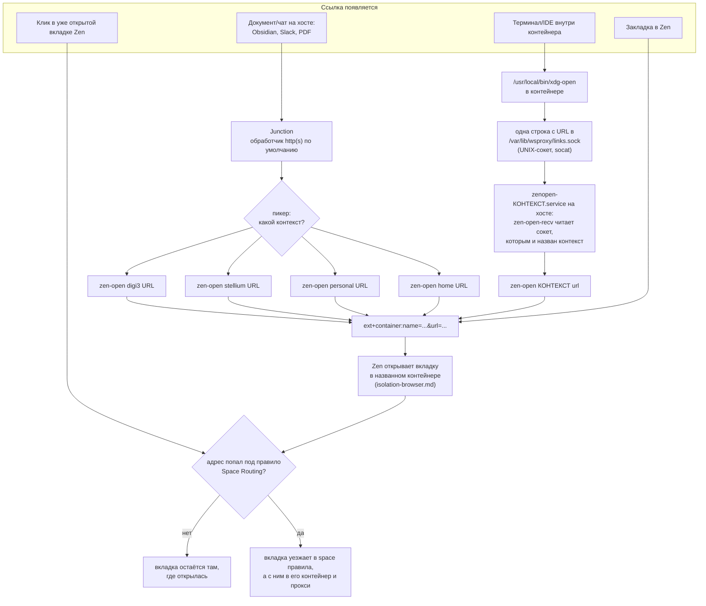

---
covers:
  features: []
  paths:
    - home/.chezmoiscripts/run_onchange_after_37-container-links.sh.tmpl
    - home/.chezmoiscripts/run_onchange_after_38-linkrouting.sh.tmpl
---

# Маршрутизация ссылок между контекстами

[isolation.md](isolation.md) объяснил, зачем у каждого рабочего контекста своя
сеть и своя банка кук, и показал картину целиком.
[isolation-browser.md](isolation-browser.md) разобрал, как расширение
`context-proxy` раздаёт прокси по [контейнерам Firefox](glossary.md#контейнер-firefox)
и как протокол `ext+container:` открывает вкладку в названном контейнере. Этот
документ — про шаг перед всем этим: откуда вообще берётся `ext+container:`
ссылка, если клик произошёл не в самом Zen, а где-то снаружи — в Obsidian, в
Slack, в терминале внутри distrobox-контейнера. Механику `ext+container:` и
расширение `Open external links in a container`, которое его понимает, здесь
не повторяем — за этим в [isolation-browser.md](isolation-browser.md).

## Что это даёт

У тебя открыт документ или чат вне браузера, и в нём есть рабочая ссылка. Ты
по ней кликаешь. Вопрос — в каком из трёх рабочих контекстов (или вовсе без
контекста, «просто в интернет») эта ссылка должна открыться — и здесь у
системы **нет способа угадать правильно**: ссылка из Obsidian ничего не знает,
какая раскладка вкладок сейчас на экране, а раскладка на экране — какая
работа, к которой относится ссылка. Поэтому вместо того чтобы гадать (и
рисковать открыть чужую работу в контейнере не той работы — а это ровно то,
чего вся эта конструкция избегает), система переспрашивает: маленькое окно
предлагает выбрать, какому контексту это принадлежит, и дальше уже не путает.

Если ссылка приходит из терминала или программы, запущенной внутри одного из
рабочих контейнеров, спрашивать не нужно — у неё и так есть один-единственный
разумный ответ, и она получает его автоматически.

Закладки в браузере устроены иначе: их заводят один раз с уже вшитым
контейнером, и дальше клик по такой закладке никогда ничего не спрашивает.

Всё это настраивается само при `chezmoi apply` и не требует ничего руками,
кроме двух вещей: самих закладок и одного правила браузера, привязывающего
конкретный сайт намертво к контейнеру («Always Open This Site in…», разобрано
ниже) — их заводят руками и один раз.

## Как это работает

Центральная идея зашита прямо в комментарий скрипта 38
(`run_onchange_after_38-linkrouting.sh.tmpl`, шапка файла):

> A URL arriving from outside the browser has no correct container — the
> question is malformed. So the default must be harmless rather than
> dangerous: Junction asks, and every answer pins the container into the URL
> itself.

Другими словами: у ссылки, пришедшей извне браузера, **нет правильного
контейнера** — сам вопрос «в каком она контексте» поставлен неверно, потому
что до клика ссылка ни к какому контексту не привязана. Поэтому контейнер не
берут из того, что сейчас на экране (это было бы удобно, но опасно — молчаливо
попадёт не туда), а **зашивают в саму ссылку** в момент, когда ответ на вопрос
«какой контейнер» наконец есть — то есть в момент клика или заведения
закладки.



Четыре входа. Первые три начинаются с клика человека и заканчиваются
`ext+container:` ссылкой. Четвёртый, [Space Routing](glossary.md#space-routing),
стоит особняком: это единственный вход, который ничего не спрашивает и
срабатывает сам, уже внутри Zen, по адресу открывающейся вкладки. Он разобран
ниже, рядом с правилом «Always Open This Site in…», потому что предупреждение
у них общее.

### Вход 1: программа на хосте, через Junction

`Junction` — сторонний пикер ссылок (пакет `junction`, фича `zen` в
`home/.chezmoidata.yaml`), назначенный обработчиком по умолчанию для
`x-scheme-handler/http` и `x-scheme-handler/https` последними строками скрипта
38:

```sh
junction_desktop=$(pacman -Ql junction \
    | awk '/\/usr\/share\/applications\/.*\.desktop$/{print $2}' \
    | head -1 | xargs -r basename)
...
xdg-mime default "$junction_desktop" x-scheme-handler/http x-scheme-handler/https
```

Проверено на этой машине 2026-07-30:

```sh
xdg-mime query default x-scheme-handler/https
```
```
re.sonny.Junction.desktop
```

Скрипт читает id ярлыка Junction из пакета (`pacman -Ql`), а не пишет его
литералом — если апстрим переименует свой `.desktop`-файл, скрипт всё равно
найдёт актуальное имя, а не молча оставит старый обработчик по умолчанию.

Клик по ссылке открывает пикер Junction, а в списке — не голый «Zen Browser»,
а по одному пункту на контекст: `Zen: digi3`, `Zen: stellium`, `Zen: personal`,
`Zen: Home`. Первые три — отдельные `.desktop`-файлы, которые создаёт цикл
`{{ range .contexts }}` в скрипте 38:

```
Exec=/usr/local/bin/zen-open digi3 %u
```

Четвёртый пункт пишется отдельным блоком того же скрипта, из ключа
`plain_context:` каталога, а не из `contexts:`
(`run_onchange_after_38-linkrouting.sh.tmpl`, строки 208-220):

```
Exec=/usr/local/bin/zen-open home %u
```

Выбор пункта — это и есть ответ на вопрос «какой контекст», и он тут же
уходит в `zen-open`.

**Куда попадает ссылка, не принадлежащая ни одной работе.** Пункт `Zen: Home`
— это не одноразовая свалка: у `home` есть свой space в сайдбаре, своя папка
закладок и свои закреплённые вкладки (`plain_context.bookmarks` в каталоге —
YouTube, Claude, почта и прочее личное), то есть
пространство, в котором человек залогинен под личными учётками. Ссылка,
отправленная туда из пикера, попадает ровно в тот же контейнер, а значит в
одну банку кук с этими залогиненными сайтами — со всем, что из этого следует
при переходе по чужой ссылке. От рабочих контекстов она по-прежнему отделена
полностью; размен целиком внутри `home` и выбран владельцем репозитория
осознанно.

### Вход 2: изнутри контейнера, через подменённый `xdg-open`

Внутри каждого рабочего контейнера скрипт 37
(`run_onchange_after_37-container-links.sh.tmpl`) кладёт свой
`/usr/local/bin/xdg-open`:

```sh
#!/bin/sh
case "${1:-}" in
    http://*|https://*) ;;
    *) exec /usr/bin/xdg-open "$@" ;;
esac

SOCK=/var/lib/wsproxy/links.sock

if [ ! -S "$SOCK" ]; then
    echo "xdg-open: no link socket at $SOCK -- is zenopen-<context>.service running on the host?" >&2
    exit 1
fi

if ! command -v socat >/dev/null 2>&1; then
    echo "xdg-open: socat is missing in this container, cannot reach the host" >&2
    exit 1
fi

reply=$(printf '%s\n' "$1" | socat -T5 - "UNIX-CONNECT:$SOCK" 2>/dev/null || true)
case "$reply" in
    ok) ;;
    '') echo "xdg-open: the host did not answer on $SOCK" >&2; exit 1 ;;
    *)  echo "xdg-open: the host refused the link ($reply)" >&2; exit 1 ;;
esac
```

`/usr/local/bin` идёт в `PATH` раньше `/usr/bin`, поэтому эта обёртка
перекрывает настоящий `xdg-open` из `xdg-utils` для всего, что запущено внутри
контейнера, без переустановки самого пакета.

**Обёртки в PATH мало: часть программ открывает ссылки мимо неё.** Всё, что
зовёт GLib (`gio open`, `GAppInfo` — так делают многие CLI, включая
логин-потоки Claude Code и Codex), в `PATH` не смотрит вовсе: GLib берёт
обработчик по умолчанию из `mimeapps.list`, а когда умолчания нет — первый
попавшийся `.desktop`-файл, объявивший схему. Этот репозиторий браузеров в
контейнер не ставит, но стороннее наполнение контейнера — может: claudefiles
ставит туда `chromium` как браузер для Playwright MCP, и до 1 августа 2026
логин-ссылка из CLI внутри контейнера молча открывала **контейнерный
chromium** — окно на экране хоста, но чужой профиль, без Junction и без
маршрута в Zen (найдено пользователем на живом логине; подтверждено: `gio
mime x-scheme-handler/https` внутри контейнера отвечал `chromium.desktop`).
Поэтому скрипт 37, кроме обёртки, кладёт ей `.desktop`-запись
`/usr/local/share/applications/container-link.desktop`
(`Exec=/usr/local/bin/xdg-open %u`, `NoDisplay=true`) и назначает её
обработчиком `x-scheme-handler/http(s)` по умолчанию через `xdg-mime default`
— после этого и PATH-путь, и GLib-путь сходятся в одной и той же обёртке.

**До 30 июля 2026 эта обёртка читала имя контейнера из `/run/.containerenv` и
передавала его на хост как аргумент `distrobox-host-exec` — и `distrobox-host-exec`
не доезжал до хоста вообще, ни разу.** Разбор поломки — ниже, в «Почему было
заменено», и полностью в
[docs/issues/2026-07-29-distrobox-host-exec-broken.md](issues/2026-07-29-distrobox-host-exec-broken.md)
(закрыт 30 июля 2026). Текущий код вообще не читает `/run/.containerenv` и не
вызывает `distrobox-host-exec` — контейнер больше не называет себя, вместо
этого он пишет одну строку с URL в UNIX-сокет `/var/lib/wsproxy/links.sock`, и
хост узнаёт контекст по тому, в какой сокет пришла строка, а не по тому, что
сказал контейнер.

`/var/lib/wsproxy` внутри контейнера — не отдельный путь, а точка, в которую
`distrobox.ini.tmpl` монтирует хостовый каталог сокетов этого же контекста:

```
additional_flags="--memory=8g --volume {{ $.chezmoi.homeDir }}/.local/share/wsproxy/{{ .name }}:/var/lib/wsproxy:rw"
```

(`home/dot_config/distrobox/distrobox.ini.tmpl`) — тот же каталог, где рядом с
`links.sock` живёт `socks.sock` [SOCKS-моста](isolation-network.md). Хостовый
конец — `zenopen-<контекст>.service`, юнит `socat`, который слушает именно
этот файл; какой файл, тот и контекст, потому что каждый контекст получает
свой собственный каталог и свой собственный юнит (подробности в «Вход 2:
хостовый приёмник» ниже).

**Что происходит с аргументами, которые обёртка не понимает.** Верхний
`case` — единственная развилка: только `http://*` и `https://*` идут дальше по
телу скрипта, всё остальное (пути к файлам, флаги вроде `--version`, пустой
вызов) сразу же уходит в `exec /usr/bin/xdg-open "$@"` — тот же самый
настоящий `xdg-open` из пакета `xdg-utils`, с теми же самыми аргументами,
без изменений. Проверено:

```sh
distrobox enter digi3 -- xdg-open --version
```
```
xdg-open 1.2.1
```

Это версия настоящего `xdg-open`, а не нашей обёртки — значит проваливание
в `case *)` действительно работает, и PDF, открытый изнутри контейнера,
по-прежнему открывается просмотрщиком **внутри контейнера**, тем же способом,
каким открывался бы без всей этой обвязки. Комментарий в скрипте называет
причину, по которой это в принципе возможно: с `init=true` distrobox **не**
подменяет `xdg-open` сам (симлинк в `distrobox-init` стоит под условием
`init -eq 0`), так что вставать в этот путь целиком приходится собственному
скрипту 37, а не полагаться на то, что distrobox сделает это сам.

Комментарий в скрипте объясняет и то, почему отказ на этой ветке **не**
проваливается дальше в настоящий `xdg-open`. Сам репозиторий браузер в
контейнер не ставит (все браузерные фичи — `firefox`, `chromium`, `zen` — со
`scope: host`), но chromium там может оказаться со стороны claudefiles (см.
выше) — и тогда проваливание открыло бы ссылку в нём, ровно та тихая посадка
не туда, от которой обёртка и защищает. А без браузера провал ещё и шумный:
полтора десятка строк «command not found», за которыми теряется настоящая
причина. Одна строка, называющая, чего именно не хватает, полезнее.

### Вход 2: хостовый приёмник

Хостовая часть — скрипт 38 (`run_onchange_after_38-linkrouting.sh.tmpl`),
тот же, что ставит `zen-open`. Он же кладёт `/usr/local/bin/zen-open-recv`:

```sh
#!/bin/sh
ctx=${1:-}
[ -n "$ctx" ] || { printf 'no-context\n'; exit 0; }

IFS= read -r url || true
[ -n "${url:-}" ] || { printf 'no-url\n'; exit 0; }

reject() {
    printf '%s\n' "$1"
    echo "zen-open-recv: refused a link from $ctx: $1" >&2
    exit 0
}

[ "${#url}" -le 2048 ] || reject too-long
case "$url" in
    http://*|https://*) ;;
    *) reject bad-scheme ;;
esac
case "$url" in
    *[[:space:]]*) reject bad-url ;;
esac

if /usr/local/bin/zen-open "$ctx" "$url"; then
    printf 'ok\n'
else
    printf 'failed\n'
    echo "zen-open-recv: zen-open failed for $ctx" >&2
fi
```

и по одному юниту `systemd --user` на каждый контекст из `contexts:`:

```
ExecStart=/usr/bin/socat -T10 UNIX-LISTEN:.../wsproxy/{{ .name }}/links.sock,fork,mode=600,unlink-early "EXEC:/usr/local/bin/zen-open-recv {{ .name }}"
```

Контекст `{{ .name }}` попадает в командную строку `zen-open-recv` при
генерации юнита — то есть на этапе `chezmoi apply`, а не когда контейнер
пишет в сокет. Отсюда и главное свойство: **контекст больше не аргумент,
который приносит контейнер** — это то, какой сокет слушает, а слушателя
создаёт и называет хост. Подделать его контейнер не может: ему просто нечего
подставить в это поле.

`read -r url` — ровно одна строка: вторую команду или второй URL в той же
посылке пронести некуда, `read` останавливается на первом переводе строки.
Четыре пути отказа, и каждый одновременно отвечает контейнеру одним словом
**и** уходит в журнал через stderr юнита — раньше молчаливый `127` не
оставлял вообще никакого следа:

| Ответ | Когда |
|---|---|
| `no-context` | юнит вызван без аргумента контекста — не должно случаться при штатной генерации |
| `no-url` | пиринг закрылся, не прислав строку |
| `too-long` | длиннее 2048 символов |
| `bad-scheme` | не `http://`/`https://` |
| `bad-url` | внутри есть пробел — настоящий URL кодирует пробелы процентами, значит это либо ошибка, либо попытка второго аргумента |
| `ok` / `failed` | `zen-open` вызван, отработал или нет |

`fork` в юните — по клиенту на подключение, чтобы одна отказавшая строка не
положила весь слушатель. `-T10` — таймаут неактивности: приёмник блокируется
на `read`, и подключение, которое ничего не прислало, повисло бы навсегда,
а открыть подключение может любой контейнер. `unlink-early` нужен, чтобы
`socat` не отказался перепривязаться к сокету, оставшемуся от прошлого
старта юнита.

**Живая проверка на этой машине, 2026-07-31, только чтение и один безобидный
запрос без открытия браузера.** Юниты подняты и слушают:

```sh
systemctl --user is-active zenopen-digi3.service zenopen-stellium.service zenopen-personal.service
```
```
active
active
active
```

Прямой запрос к приёмнику с заведомо неверной схемой — проверяет весь путь
приёмника (чтение строки, проверки, ответ), не трогая браузер:

```sh
printf 'ftp://example.com\n' | socat -T5 - UNIX-CONNECT:$HOME/.local/share/wsproxy/digi3/links.sock
```
```
bad-scheme
```

Тот же запрос изнутри самого контейнера, через смонтированный `/var/lib/wsproxy`
— то есть ровно тот путь, которым идёт настоящая обёртка `xdg-open`:

```sh
distrobox enter digi3 -- sh -c 'printf "ftp://example.com\n" | socat -T5 - UNIX-CONNECT:/var/lib/wsproxy/links.sock'
```
```
bad-scheme
```

Хостовая половина маршрута подтверждена рабочей. Контейнерная — тоже:
контейнеры пересозданы 1 августа 2026, обёртка в них текущей версии (пишет в
сокет, `distrobox-host-exec` не зовёт), а сквозная проверка `gio open
https://example.com` изнутри `digi3` в тот же день дошла до
`zenopen-digi3.service` и открыла вкладку в Zen.

### Почему было заменено

Раньше вторая половина цепочки шла через `distrobox-host-exec /usr/local/bin/zen-open
<контекст> <url>` — команду distrobox, которая должна выполнить процесс на
хосте из-под контейнера. На этой машине она не доезжала до хоста ни разу, и
отказ был идеально молчаливым: код `127`, ни строки на stdout, ни строки на
stderr. Причин было две, обе обязательные (полный разбор с командами —
[docs/issues/2026-07-29-distrobox-host-exec-broken.md](issues/2026-07-29-distrobox-host-exec-broken.md)):

1. **Хостовая.** `distrobox-host-exec` — это `host-spawn`
   (`1player/host-spawn`), и его код (`command.go`) стучится в фиксированное
   имя на шине D-Bus: `org.freedesktop.Flatpak`, объект
   `/org/freedesktop/Flatpak/Development`, метод `.HostCommand`, с
   комментарием «talk with flatpak-session-helper process». Эту точку на шине
   регистрирует `flatpak-session-helper` из пакета `flatpak`, которого на
   хосте нет и не было — ни в `home/.chezmoidata.yaml`, ни руками.
2. **Контейнерная.** `distrobox-create` монтирует хостовый `/run/user/$UID`
   (а вместе с ним и доступ к хостовой сессионной шине) только при
   `init -eq 0`, а в `distrobox.ini.tmpl` этого репозитория стоит `init=true`
   ([containers.md](containers.md)) — так что контейнер живёт со своим
   собственным `dbus-broker`, и унаследованный `DBUS_SESSION_BUS_ADDRESS`
   указывает на него, а не на хост.

Обе причины нужны разом: указание контейнеру на хостовую шину лечит вторую,
но `host-spawn` всё равно возвращает `127`, потому что упирается в первую —
`flatpak` на хосте по-прежнему нет.

Замена — не восстановление старого поведения, а более узкий канал:

| | Было (`distrobox-host-exec`) | Стало (сокет) |
|---|---|---|
| Кто называет контекст | контейнер, аргументом из `/run/.containerenv` | хост, по тому, в какой сокет пришла строка |
| Что контейнер может попросить хост сделать | выполнить **любую** команду на хосте (это ровно то, что даёт `HostCommand`) | открыть один URL в одном контексте |
| Отказ | код `127`, ни строки вывода | одно слово контейнеру и строка в журнале юнита |

**Эта замена не убирает исходную дыру: она её сужает.** distrobox монтирует
весь корень хоста в контейнер как `/run/host`, а значит контейнер может
дотянуться до `links.sock` **соседнего** контекста по абсолютному пути и
открыть ссылку от его имени — это не отличается от того, что уже сказано про
`socks.sock` в [isolation-network.md](isolation-network.md): контексты
разделяет [network namespace](glossary.md#network-namespace), а не сам факт
существования отдельного сокета. Проверено здесь же (2026-07-31, тем же
безобидным `bad-scheme`-запросом, без реального URL):

```sh
distrobox enter digi3 -- sh -c 'printf "ftp://example.com\n" | socat -T5 - UNIX-CONNECT:/run/host/home/stsiapan/.local/share/wsproxy/personal/links.sock'
```
```
bad-scheme
```

Строка дошла до приёмника `personal`, а не `digi3` — запрос из `digi3`
принят и обработан от имени чужого контекста. Разница с `distrobox-host-exec`
в том, что раньше контейнер мог попросить хост выполнить произвольную
команду, а теперь — только открыть URL, и только в каком-то контексте
(своём или чужом), но не сделать что-то ещё. Строго уже, чем было, но не
идеально.

`distrobox-host-exec` сам по себе как был нерабочим, так и остался —
починка не в нём, а в том, что маршрут ссылок больше на него не полагается.
Если он когда-нибудь понадобится репозиторию для чего-то ещё, нужны оба шага
сразу: пакет `flatpak` на хосте и явное указание контейнеру на хостовую шину.

### Вход 3: закладка

Обычная закладка привязана не к ссылке, а к тому, в каком контексте её
открыли: закладка `stellium`, нажатая из space `digi3`, уедет в `digi3` — ей
неоткуда взять правильный ответ, кроме текущей вкладки. Поэтому рабочие
закладки заводят в форме, которая несёт свой контейнер сама:

```
ext+container:name=stellium&url=https%3A%2F%2Fdev.azure.com%2Forg%2Fproject
```

Собрать такую строку самому незачем — тот же `zen-open` строит её
автоматически:

```sh
/usr/local/bin/zen-open stellium 'https://dev.azure.com/org/project'
```

и итоговый адрес виден в адресной строке открывшейся вкладки — оттуда его и
кладут в закладку руками (это уже настраиваемое руками, тема
[isolation-browser.md](isolation-browser.md), раздел «Настроенное руками»,
пункт 4).

### Как `zen-open` кодирует URL

Оба входа с хоста сходятся в одном месте — `/usr/local/bin/zen-open` (скрипт
38):

```sh
enc=$(printf '%s' "$url" | jq -sRr @uri)
uri="ext+container:name=${ctx}&url=${enc}"
```

Комментарий в самом скрипте объясняет зачем:

> `@uri` encodes ':' '/' '&' '?' too, which is what makes it safe as a query
> parameter value. Without this a URL carrying its own '&' would truncate.

`-sR` у `jq` значит: прочитать весь ввод как один сырой текст (`-R`, raw),
собрав в одну строку (`-s`, slurp), не пытаясь распарсить его как JSON.
`@uri` дальше кодирует всё, кроме «безопасных» символов (буквы, цифры,
`-_.~`), процентами — в том числе `:`, `/`, `&` и `?`, которые обычный
percent-encoding иногда оставляет как есть, потому что они «безопасны» в
пути или домене, но не безопасны здесь, внутри значения параметра `url=`.

Комментарий в каталоге фич (`home/.chezmoidata.yaml`, пакет `jq` в фиче
`host-base`) говорит то же самое своими словами:

> jq builds the ext+container: URIs in /usr/local/bin/zen-open: it is the
> only tool here that URL-encodes a whole URL correctly, and a URL of its own
> '&' would otherwise truncate the hand-off.

Проверено на этой машине, что это не пустые слова:

```sh
printf '%s' 'https://dev.azure.com/org/project?query=a&b=c' | jq -sRr @uri
```
```
https%3A%2F%2Fdev.azure.com%2Forg%2Fproject%3Fquery%3Da%26b%3Dc
```

Без этого шага итоговая строка выглядела бы так:
`ext+container:name=stellium&url=https://dev.azure.com/org/project?query=a&b=c`
— и расширение `Open external links in a container`, разбирая её как
`key=value` пары через `&`, увидело бы `url=https://dev.azure.com/org/project?query=a`
и отдельный, никому не нужный параметр `b=c`: хвост адреса потерялся бы молча,
ровно как и говорит комментарий. С `@uri` этот `&` внутри значения превращается
в `%26` и весь адрес остаётся одним куском.

### Почему `zen.desktop` не объявляет `MimeType` для http(s)

`~/.local/share/applications/zen.desktop` (тема [isolation-browser.md](isolation-browser.md))
намеренно не несёт `x-scheme-handler/http` и `x-scheme-handler/https` в своём
`MimeType` — сама эта строка отсутствует. Комментарий в файле называет
причину прямо:

> A bare "Zen Browser" entry in the link picker would open the URL in
> whatever container the current workspace happens to use, which is the
> exact silent mis-landing this setup exists to prevent.

Если бы `MimeType` эти схемы объявлял, в пикере Junction рядом с четырьмя
пунктами `Zen: digi3` / `Zen: stellium` / `Zen: personal` / `Zen: Home`
появился бы пятый, голый — «Zen Browser», без имени контекста в `Exec`.
Выбор этого пункта запустил бы `zen-browser` с сырым URL, без
`ext+container:` вообще, и Zen открыл бы вкладку там, где сейчас в фокусе
раскладка — то есть ровно тот случайный, немаркированный переход между
контекстами, ради недопущения которого весь этот документ существует.

Пункты по одному на контекст, которые пикер реально показывает, генерирует
не `zen.desktop`, а скрипт 38 — `.desktop`-файлы из раздела «Вход 1» выше.

Проверено на этой машине: реальный обработчик по умолчанию — `re.sonny.Junction.desktop`
(команда `xdg-mime query default` выше), а не `zen.desktop` — то есть защита
работает не только на бумаге.

### Правило «Always Open This Site in…»

Multi-Account Containers (расширение из [isolation-browser.md](isolation-browser.md))
умеет само, без всякого кода этого репозитория, привязать домен к контейнеру
через правой клик по ссылке → «Always Open This Site in…». Это отдельный,
четвёртый механизм маршрутизации — не через `zen-open`, не через закладку, не
через правило Space Routing, а через сам домен.

Ключевое слово — **вытаскивается**. Правило на домен действует не там, где
ссылка была кликнута, а там, куда правило указывает, **безусловно**: обычная
вкладка, обычный клик из любого space, любой источник — правило перехватывает
переход и вытаскивает его в назначенный контейнер, поверх любой логики выше
в этом документе.

Отсюда жёсткий запрет: такие правила ставятся **только** на домены, уникальные
для одного контекста, и никогда — на общие: `dev.azure.com`,
`portal.azure.com`, `teams.microsoft.com`, `login.microsoftonline.com`.

Причина в самом слове «вытаскивается». Правило на `login.microsoftonline.com`,
поставленное для контекста `digi3`, означает: вход в тенант `stellium` —
залогинься он через тот же общий домен `login.microsoftonline.com` из своего
собственного space `stellium` — будет вытащен в контейнер `digi3`. Сессия
входа в чужой тенант окажется в сетевом канале и куках `digi3`, и в логах
тенанта `stellium` появится вход, пришедший оттуда, где ему быть не положено
— это прямое попадание в модель угроз [isolation.md](isolation.md):
работодатель, читающий свои журналы, увидит IP и активность, привязанные не
к тому контексту.

**Space Routing: то же предупреждение, другое сравнение.** У самого Zen есть
свой механизм с точно таким же поведением, штатная фича
[Space Routing](glossary.md#space-routing): правило «адрес совпал, открыть его
в таком-то space», а вместе со space вкладке достаётся его контейнер, а с
контейнером и его прокси. Ключевое слово здесь то же самое: правило не
подсказывает, а **вытаскивает** ссылку из её текущего контейнера, где бы по
ней ни кликнули. Поэтому запрет на общие домены Microsoft (`dev.azure.com`,
`portal.azure.com`, `teams.microsoft.com`, `login.microsoftonline.com`)
действует здесь ровно так же и по той же причине. Отличие одно: сравнивается
вся строка адреса целиком, а не только домен.

И отдельно то, что переворачивает главный принцип этого документа. Контейнер,
зашитый в ссылку, здесь **не последнее слово**: правило Space Routing
перебивает его. Ссылка, открытая через `zen-open personal <адрес>`, но
содержащая в адресе слово `digi3`, приедет в контейнер digi3. Механизм прямой —
при совпадении правила Zen перезаписывает `userContextId` вкладки
идентификатором контейнера целевого space, и то, что контейнер уже был выбран,
поводом пропустить маршрутизацию не считается
(`ZenSpaceRoutingManager.sys.mjs`, метод `#shouldSkipProcessing` — среди причин
пропуска только закреплённая вкладка, вкладка в группе, восстановление сессии и
явный `skipRoute`). Закреплённые вкладки поэтому в безопасности, обычные — нет. В этом репозитории такие правила
не заводят руками, их генерирует скрипт 43 из `contexts:` по флагу
`route: true`, и под флагом только достаточно редкие имена контекстов
(подробный разбор, включая то, почему у `personal` флага намеренно нет, в
[isolation-browser.md](isolation-browser.md), раздел «Spaces и маршруты —
скрипт 43»).

Уникальные адреса вида `dev.azure.com/<организация>` правилом Multi-Account
Containers не покрываются: оно смотрит только на домен, не на путь. Ровно
здесь и проходит граница между двумя правилами. Space Routing такой адрес
покрыть может: он сравнивает всю строку, поэтому организация в пути годится
ему так же, как домен. Выбор между двумя способами такой: закладка с зашитым
контейнером (вход 3 выше) действует только на саму себя, а правило Space
Routing уводит в свой space любой адрес, в котором встретилась эта подстрока,
кем бы и откуда он ни был открыт.

## Что ставится и что меняется

| Категория | Путь | Где | Кто создаёт |
|---|---|---|---|
| Обёртка `xdg-open` | `/usr/local/bin/xdg-open` (mode 755) | Контейнер, вне дома | `run_onchange_after_37-container-links.sh.tmpl`, только при `.env == container` |
| Ярлык обёртки для GLib | `/usr/local/share/applications/container-link.desktop` (`NoDisplay=true`) | Контейнер, вне дома | скрипт 37, там же |
| Обработчик по умолчанию в контейнере | `xdg-mime default container-link.desktop x-scheme-handler/http` `x-scheme-handler/https` | Контейнер, `~/.config/mimeapps.list` дома контекста | скрипт 37, там же |
| Роутер ссылок | `/usr/local/bin/zen-open` (mode 755) | Хост, вне дома | `run_onchange_after_38-linkrouting.sh.tmpl`, только при `.env == host` и включённой фиче `zen` |
| Приёмник ссылок из контейнера | `/usr/local/bin/zen-open-recv` (mode 755) | Хост, вне дома | скрипт 38, там же |
| Сокет приёма ссылок | `~/.local/share/wsproxy/<контекст>/links.sock`, виден в контейнере как `/var/lib/wsproxy/links.sock` | Хост создаёт каталог и юнит; сам сокет создаёт `socat` при старте юнита | скрипт 38 (каталог, юнит), монтирование — `distrobox.ini.tmpl` ([containers.md](containers.md)) |
| Юнит приёма ссылок | `~/.config/systemd/user/zenopen-<контекст>.service` | Хост | скрипт 38, по одному на каждую запись `contexts:`, пруниг устаревших первым шагом |
| Ярлыки пикера | `~/.local/share/applications/zen-<контекст>.desktop`, `zen-home.desktop` | Хост, в доме | скрипт 38, генерируются по `contexts:` и `plain_context:` из `home/.chezmoidata.yaml`, пруниг устаревших первым шагом — список `keep=` собирается из тех же двух ключей |
| Обработчик по умолчанию | `xdg-mime default <junction>.desktop x-scheme-handler/http` `x-scheme-handler/https` | Хост, `~/.config/mimeapps.list` | скрипт 38, только если текущий обработчик ещё не Junction |
| Зависимость: кодирование URL | пакет `jq` | Хост | фича `host-base`, `always: true` |
| Зависимость: пикер | пакет `junction` | Хост | фича `zen`, `default: true` — предвыбрана в чеклисте, но отключаема |
| Зависимость: канал наружу из контейнера | `socat` | Контейнер | фича `container-base`, `always: true` — обёртка `xdg-open` явно проверяет его наличие и называет причину отказа, если его вдруг нет |

Ни один из двух скриптов этого документа не трогает файлы браузера напрямую
— это тема [isolation-browser.md](isolation-browser.md); здесь только то, что
превращает клик снаружи Zen в `ext+container:` ссылку.

## Как проверить

Обработчик по умолчанию — Junction, а не голый Zen (снято на этой машине
2026-07-30):

```sh
xdg-mime query default x-scheme-handler/https
```
```
re.sonny.Junction.desktop
```

Ярлыки на все рабочие контексты и на `home` реально созданы:

```sh
ls ~/.local/share/applications/zen-*.desktop
```
```
zen-digi3.desktop  zen-home.desktop  zen-personal.desktop  zen-stellium.desktop
```

(Ярлык `zen-scratch.desktop` со старым именем контекста, отмечавшийся здесь
как временное расхождение 2026-07-31, снесён прунингом — на 2026-08-01 список
совпадает с каталогом.)

`zen-open` внутри себя действительно кодирует URL через `jq @uri` (сверить
файл дословно со скриптом 38):

```sh
grep -A1 'jq -sRr' /usr/local/bin/zen-open
```

Обёртка `xdg-open` внутри контейнера установлена и перекрывает системную:

```sh
distrobox enter digi3 -- which xdg-open
```
```
/usr/local/bin/xdg-open
```

GLib-путь тоже ведёт в обёртку, а не в контейнерный chromium (снято внутри
`digi3` 2026-08-01):

```sh
distrobox enter digi3 -- gio mime x-scheme-handler/https
```
```
Default application for “x-scheme-handler/https”: container-link.desktop
```

Приёмники ссылок на хосте подняты, по одному на контекст:

```sh
systemctl --user is-active zenopen-digi3.service zenopen-stellium.service zenopen-personal.service
```
```
active
active
active
```

**Вход 2 — сквозная проверка без открытия браузера.** Заведомо неверная схема
доходит до хостового приёмника и получает содержательный отказ вместо
молчания — сначала с хоста, затем тем же путём, которым идёт настоящий
`xdg-open`, изнутри контейнера:

```sh
printf 'ftp://example.com\n' | socat -T5 - UNIX-CONNECT:$HOME/.local/share/wsproxy/digi3/links.sock
distrobox enter digi3 -- sh -c 'printf "ftp://example.com\n" | socat -T5 - UNIX-CONNECT:/var/lib/wsproxy/links.sock'
```
```
bad-scheme
bad-scheme
```

Оба ответа означают, что путь `контейнер → сокет → приёмник` жив. Если
`ls ~/.local/share/wsproxy/<контекст>/links.sock` не находит файла или
`systemctl --user is-active zenopen-<контекст>.service` не отвечает `active` —
вход 2 не работает, см. «Когда сломалось» ниже.

## Когда сломалось

| Симптом | Причина | Что делать |
|---|---|---|
| Ссылка из терминала/IDE внутри контейнера не открывается, обёртка печатает `no link socket at ...` | `zenopen-<контекст>.service` не поднят на хосте, либо контейнер собран без монтирования `/var/lib/wsproxy` | На хосте: `systemctl --user status zenopen-<контекст>.service`; если юнит не существует вовсе — `chezmoi apply` не докатился |
| Все юниты мостов (`wsproxy-*`, `zenopen-*`) разом «failed» или стоят после пересоздания контейнеров | Снос контейнеров остановил юниты, а скрипты 34 и 38 — `onchange`: их текст не менялся, `enable --now` не перевыполнился, и остановленный юнит никто не поднял. Случилось на этой машине 2026-08-01. «failed» вместо «inactive» — socat ловит SIGTERM и выходит кодом 143; с 2026-08-01 юниты несут `SuccessExitStatus=143`, и обычный stop больше не выглядит поломкой | С 2026-08-01 это чинит сам `chezmoi apply`: `run_after_35-bridges-up.sh.tmpl` гоняется каждый раз и стартует лежащие юниты мостов ([isolation-network.md](isolation-network.md)); руками — `systemctl --user start` по всем шести юнитам |
| Логин-ссылка из CLI внутри контейнера открылась в chromium, без Junction и без маршрута в Zen | CLI открыл ссылку через GLib (`gio`/`GAppInfo`) мимо PATH-обёртки, а дефолтный обработчик в контейнере не назначен — GLib взял единственный зарегистрированный браузер, контейнерный chromium от claudefiles. Контейнер создан до 2026-08-01, когда скрипт 37 ещё не ставил `container-link.desktop` | `chezmoi apply` внутри контейнера (свежий скрипт 37 назначит дефолт); проверить: `gio mime x-scheme-handler/https` → `container-link.desktop` |
| Обёртка печатает `the host did not answer` или `the host refused the link (...)` | Приёмник получил строку, но отверг её (`too-long`, `bad-scheme`, `bad-url`) либо сам `zen-open` не смог открыть браузер (`failed`) | `journalctl --user -u zenopen-<контекст>.service` — там же слово, что напечатано в контейнере, и причина рядом |
| Ссылка из терминала/IDE внутри контейнера ведёт себя как ссылка из соседнего контекста | Контейнер обратился не к своему `links.sock`, а к чужому — `/run/host` открывает соседский каталог `wsproxy` по абсолютному пути; это известное сужение модели угроз, а не баг конкретной ссылки — см. «Почему было заменено» | Убедиться, что вызывающий код обращается к `/var/lib/wsproxy/links.sock` (свой, через штатное монтирование), а не строит путь через `/run/host` руками |
| Пикер Junction не появляется, ссылка сразу открывается в текущей вкладке Zen | Обработчик по умолчанию — не Junction: либо браузер перехватил его сам, либо скрипт 38 не отработал | `xdg-mime query default x-scheme-handler/https`; если не `re.sonny.Junction.desktop` — `chezmoi apply` заново (скрипт меняет обработчик, только когда он ещё не Junction) |
| Пунктов «Zen: …» в пикере нет вообще | Скрипт 38 не выполнялся: `.env` не `host`, либо фича `zen` выключена | `ls ~/.local/share/applications/zen-*.desktop`; переприменить `chezmoi apply` |
| Ссылка на общий домен уезжает не в тот контейнер, хотя закладка или пункт пикера правильные | На этот домен стоит правило «Always Open This Site in…», которое вытаскивает переход в другой контейнер поверх любой другой маршрутизации | `about:preferences#containers` в Zen → найти домен среди привязок → снять правило либо перепроверить, что оно стоит только на уникальном для контекста домене |
| PDF или другой файл внутри контейнера открылся не тем, чем раньше | Маловероятно из-за этой обёртки — верхний `case` строгий (`http://*|https://*` — единственные две ветки, что не проваливаются в настоящий `xdg-open`) | `distrobox enter <контекст> -- cat /usr/local/bin/xdg-open`, сверить `case` дословно |

## Почему именно так

**Контейнер зашивается в ссылку, а не выводится из текущего окна — прямое
следствие модели угроз [isolation.md](isolation.md).** Любой способ угадывать
контекст по текущему фокусу гарантированно один раз ошибётся именно тогда,
когда это важнее всего — рабочая ссылка попадёт в личный контекст или,
хуже, в контекст другой работы. Баг в коде роутера здесь стоил бы утечки, а
не просто неудобства, поэтому дизайн выбирает более многословный, но
безопасный путь: спросить (вход 1), либо взять то единственное значение,
которое уже точно известно (вход 2 — своё имя контейнера; вход 3 — то, что
вшито при заведении закладки).

**`zen-open` лежит в `/usr/local/bin`, а не в `~/.local/bin`.** До замены
маршрута причиной было то, что контейнеры вызывали `zen-open` через
`distrobox-host-exec`, а `HOME` внутри контейнера — не то же самое значение,
что `HOME` хоста ([containers.md](containers.md)), так что путь вида
`~/.local/bin/zen-open`, посчитанный внутри контейнера, указывал бы не туда.
Эта причина отпала вместе с самим `distrobox-host-exec`, но путь остался —
комментарий в скрипте 38 называет уже другую: `zen-open` пишется через
`sudo`, как и остальные помощники в `/usr/local/bin`, а оба его вызывающих
— `.desktop`-записи пикера и юниты `zenopen-<контекст>.service` — обращаются
к нему по абсолютному пути в любом случае.

**`slice-run`, а не голый `systemd-run`.** Комментарий в `zen-open`:
вызов идёт из `.desktop`-файла через панель рабочего стола, а не из терминала,
и в этом пути второй автоматически названный
[systemd scope](glossary.md#systemd-scope) на тот же самый PID конфликтует с
уже существующим. `slice-run` — обёртка этого же репозитория, которая
раскладывает процесс по нужному [systemd slice](glossary.md#systemd-slice)
без этой коллизии; сам механизм `slice-run` разобран в
[browsers.md](browsers.md).

**Имя контекста в `Exec` — ровно то, что записано в каталоге, без смены
регистра.** Комментарий в скрипте 38 (строки 206-207) объясняет:
`contextualIdentities.query` внутри `context-proxy`
([isolation-browser.md](isolation-browser.md)) регистронезависимо не ищет —
поэтому `zen-home.desktop` вызывает `zen-open home %u`, взяв имя из
`plain_context.name` как есть. С заглавной буквы делается только видимая
строка `Name=Zen: Home`, фильтром `title` при генерации, и в браузер она
никогда не попадает. Разойдись регистр в `Exec`, расширение не нашло бы
контейнер `home` и создало бы второй, пустой, с именем на другой регистр —
тихая, накопительная поломка, а не ошибка на старте.

**Обработчик Junction ставится через `pacman -Ql`, а не как литеральный путь
к `.desktop`.** Так же, как и с id пункта пикера выше — переименование
`.desktop`-файла апстримом иначе оставило бы старый, уже не существующий
`.desktop` назначенным обработчиком, и `xdg-mime default` тихо не сработал бы
при следующем `apply`.

**Вход 2 больше не полагается на `distrobox-host-exec`.** До 30 июля 2026 он
был сломан не из-за кода этого репозитория, а из-за необъявленной
зависимости `distrobox-host-exec`/`host-spawn` от пакета `flatpak` на хосте —
разобрано в «Почему было заменено» выше. Вместо починки чужой зависимости
маршрут переписан так, чтобы вообще не нуждаться в ней: собственный код этого
репозитория (сокет плюс приёмник) корректно работает уже сегодня, живой
проверкой на этой машине (см. «Как проверить»), а `distrobox-host-exec`
как был нерабочим на этой машине, так и остаётся — просто им больше никто не
пользуется.

## Ссылки

- [isolation.md](isolation.md) — общая картина, модель угроз, два значения
  слова «контейнер».
- [isolation-browser.md](isolation-browser.md) — расширения Zen,
  `context-proxy`, механика `ext+container:` и протокола `Open external links
  in a container`; там же — запись в реестре обходов про отсутствие HMAC у
  версии `1.0.3` этого расширения ([workarounds.md](workarounds.md)), здесь не
  повторяется.
- [isolation-network.md](isolation-network.md) — что происходит с трафиком
  после того, как вкладка открылась в правильном контейнере.
- [containers.md](containers.md) — из чего собран сам distrobox-контейнер,
  домашний каталог `~/homes/<контекст>`.
- [docs/issues/2026-07-29-distrobox-host-exec-broken.md](issues/2026-07-29-distrobox-host-exec-broken.md) —
  находка, разбор двух причин, дата обнаружения (29 июля 2026) и дата закрытия
  через замену маршрута сокетом (30 июля 2026).
- `github.com/89luca89/distrobox/issues/1692` — «flatpak on host requirement
  not documented?», открыт, автор `45mg`: `distrobox-host-exec` требует
  `flatpak` на хосте, нигде это не документируя, и падает молча без него.
- `github.com/1player/host-spawn`, файл `command.go` — вызов
  `org.freedesktop.Flatpak.Development.HostCommand`, комментарий «talk with
  flatpak-session-helper process».
- `distrobox.it/usage/distrobox-host-exec/` — официальная страница,
  называющая единственной зависимостью `host-spawn`; `flatpak` встречается
  там только в примере запуска приложения, не как задокументированная
  зависимость на стороне хоста.
- `glossary.md` — термины: [Контейнер Firefox](glossary.md#контейнер-firefox),
  [Контейнер distrobox](glossary.md#контейнер-distrobox),
  [systemd slice](glossary.md#systemd-slice).
