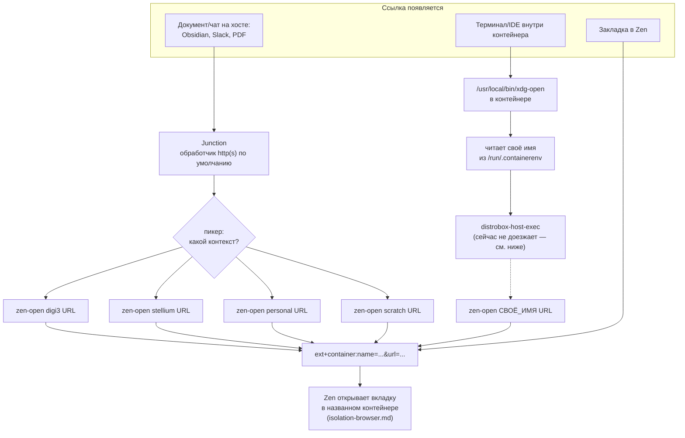

---
covers:
  features: []
  paths:
    - home/.chezmoiscripts/run_onchange_after_37-container-links.sh.tmpl
    - home/.chezmoiscripts/run_onchange_after_38-linkrouting.sh.tmpl
---

# Маршрутизация ссылок между контекстами

[isolation.md](isolation.md) объяснил, зачем у каждого рабочего контекста своя
сеть и своя банка кук, и показал картину целиком.
[isolation-browser.md](isolation-browser.md) разобрал, как расширение
`context-proxy` раздаёт прокси по [контейнерам Firefox](glossary.md#контейнер-firefox)
и как протокол `ext+container:` открывает вкладку в названном контейнере. Этот
документ — про шаг перед всем этим: откуда вообще берётся `ext+container:`
ссылка, если клик произошёл не в самом Zen, а где-то снаружи — в Obsidian, в
Slack, в терминале внутри distrobox-контейнера. Механику `ext+container:` и
расширение `Open external links in a container`, которое его понимает, здесь
не повторяем — за этим в [isolation-browser.md](isolation-browser.md).

## Что это даёт

У тебя открыт документ или чат вне браузера, и в нём есть рабочая ссылка. Ты
по ней кликаешь. Вопрос — в каком из трёх рабочих контекстов (или вовсе без
контекста, «просто в интернет») эта ссылка должна открыться — и здесь у
системы **нет способа угадать правильно**: ссылка из Obsidian ничего не знает,
какая раскладка вкладок сейчас на экране, а раскладка на экране — какая
работа, к которой относится ссылка. Поэтому вместо того чтобы гадать (и
рисковать открыть чужую работу в контейнере не той работы — а это ровно то,
чего вся эта конструкция избегает), система переспрашивает: маленькое окно
предлагает выбрать, какому контексту это принадлежит, и дальше уже не путает.

Если ссылка приходит из терминала или программы, запущенной внутри одного из
рабочих контейнеров, спрашивать не нужно — у неё и так есть один-единственный
разумный ответ, и она получает его автоматически.

Закладки в браузере устроены иначе: их заводят один раз с уже вшитым
контейнером, и дальше клик по такой закладке никогда ничего не спрашивает.

Всё это настраивается само при `chezmoi apply` и не требует ничего руками,
кроме двух вещей: самих закладок и одного правила браузера, привязывающего
конкретный сайт намертво к контейнеру («Always Open This Site in…», разобрано
ниже) — их заводят руками и один раз.

## Как это работает

Центральная идея зашита прямо в комментарий скрипта 38
(`run_onchange_after_38-linkrouting.sh.tmpl`, шапка файла):

> A URL arriving from outside the browser has no correct container — the
> question is malformed. So the default must be harmless rather than
> dangerous: Junction asks, and every answer pins the container into the URL
> itself.

Другими словами: у ссылки, пришедшей извне браузера, **нет правильного
контейнера** — сам вопрос «в каком она контексте» поставлен неверно, потому
что до клика ссылка ни к какому контексту не привязана. Поэтому контейнер не
берут из того, что сейчас на экране (это было бы удобно, но опасно — молчаливо
попадёт не туда), а **зашивают в саму ссылку** в момент, когда ответ на вопрос
«какой контейнер» наконец есть — то есть в момент клика или заведения
закладки.



Три входа.

### Вход 1: программа на хосте, через Junction

`Junction` — сторонний пикер ссылок (пакет `junction`, фича `zen` в
`home/.chezmoidata.yaml`), назначенный обработчиком по умолчанию для
`x-scheme-handler/http` и `x-scheme-handler/https` последними строками скрипта
38:

```sh
junction_desktop=$(pacman -Ql junction \
    | awk '/\/usr\/share\/applications\/.*\.desktop$/{print $2}' \
    | head -1 | xargs -r basename)
...
xdg-mime default "$junction_desktop" x-scheme-handler/http x-scheme-handler/https
```

Проверено на этой машине 2026-07-30:

```sh
xdg-mime query default x-scheme-handler/https
```
```
re.sonny.Junction.desktop
```

Скрипт читает id ярлыка Junction из пакета (`pacman -Ql`), а не пишет его
литералом — если апстрим переименует свой `.desktop`-файл, скрипт всё равно
найдёт актуальное имя, а не молча оставит старый обработчик по умолчанию.

Клик по ссылке открывает пикер Junction, а в списке — не голый «Zen Browser»,
а по одному пункту на контекст: `Zen: digi3`, `Zen: stellium`, `Zen: personal`,
`Zen: Scratch`. Каждый пункт — отдельный `.desktop`-файл, который создаёт цикл
`{{ range .contexts }}` в скрипте 38:

```
Exec=/usr/local/bin/zen-open digi3 %u
```

Выбор пункта — это и есть ответ на вопрос «какой контекст», и он тут же
уходит в `zen-open`.

### Вход 2: изнутри контейнера, через подменённый `xdg-open`

Внутри каждого рабочего контейнера скрипт 37
(`run_onchange_after_37-container-links.sh.tmpl`) кладёт свой
`/usr/local/bin/xdg-open`:

```sh
#!/bin/sh
case "${1:-}" in
    http://*|https://*) ;;
    *) exec /usr/bin/xdg-open "$@" ;;
esac

ctx=$(. /run/.containerenv 2>/dev/null; printf '%s' "${name:-}")
[ -n "$ctx" ] || exec /usr/bin/xdg-open "$@"

exec distrobox-host-exec /usr/local/bin/zen-open "$ctx" "$1"
```

`/usr/local/bin` идёт в `PATH` раньше `/usr/bin`, поэтому эта обёртка
перекрывает настоящий `xdg-open` из `xdg-utils` для всего, что запущено внутри
контейнера, без переустановки самого пакета.

**Как обёртка узнаёт своё имя.** `/run/.containerenv` — файл, который podman
кладёт в каждый контейнер, и он написан в синтаксисе `KEY="value"`, валидном
как POSIX shell. Строка `ctx=$(. /run/.containerenv 2>/dev/null; printf '%s'
"${name:-}")` в подоболочке **исполняет** этот файл через `.` (source), а не
парсит его — после чего переменная `name` (одна из строк файла) становится
обычной переменной оболочки. Проверено на этой машине живьём:

```sh
distrobox enter digi3 -- cat /run/.containerenv
```
```
engine="podman-6.0.2"
name="digi3"
id="9646d6d6bf39f892599063496ab933841cb73c2a6ae183df4bf3e021bac72001"
image="docker.io/library/archlinux:latest"
...
```
```sh
distrobox enter digi3 -- sh -c 'ctx=$(. /run/.containerenv 2>/dev/null; printf "%s" "${name:-}"); echo "ctx=[$ctx]"'
```
```
ctx=[digi3]
```

**Что происходит с аргументами, которые обёртка не понимает.** Верхний
`case` — единственная развилка: только `http://*` и `https://*` идут дальше по
телу скрипта, всё остальное (пути к файлам, флаги вроде `--version`, пустой
вызов) сразу же уходит в `exec /usr/bin/xdg-open "$@"` — тот же самый
настоящий `xdg-open` из пакета `xdg-utils`, с теми же самыми аргументами,
без изменений. Проверено:

```sh
distrobox enter digi3 -- xdg-open --version
```
```
xdg-open 1.2.1
```

Это версия настоящего `xdg-open`, а не нашей обёртки — значит проваливание
в `case *)` действительно работает, и PDF, открытый изнутри контейнера,
по-прежнему открывается просмотрщиком **внутри контейнера**, тем же способом,
каким открывался бы без всей этой обвязки. Комментарий в скрипте называет
причину, по которой это в принципе возможно: с `init=true` distrobox **не**
подменяет `xdg-open` сам (симлинк в `distrobox-init` стоит под условием
`init -eq 0`), так что вставать в этот путь целиком приходится собственному
скрипту 37, а не полагаться на то, что distrobox сделает это сам.

Если же аргумент — веб-ссылка, обёртка читает имя контейнера и вызывает на
хосте `zen-open <имя> <url>` через `distrobox-host-exec` — команду distrobox,
которая должна выполнить процесс на хосте из-под контейнера. Вопрос «какой
контекст» здесь вообще не задаётся, потому что ответ уже известен: это имя
самого контейнера.

#### Этот вход сейчас не работает

Честно: на этой машине, сегодня (2026-07-30), вторая часть цепочки —
`distrobox-host-exec` — не доезжает до хоста вообще. Отказ **молчаливый**:
никакого сообщения, никакого диалога, просто ничего не происходит.

```sh
distrobox enter digi3 -- distrobox-host-exec echo hi
```
```
(пусто, код возврата 127)
```

Воспроизведено так же на `stellium` и `personal` — не особенность одного
контейнера. Разобрано чтением кода и прямой проверкой, шаг за шагом:

1. `/usr/bin/distrobox-host-exec` внутри контейнера сам знает про эту
   ситуацию — комментарий в его коде:

   > This makes host-spawn work on initful containers, where the dbus session
   > is separate from the host, we point the dbus session straight to the
   > host's socket in order to talk with the
   > org.freedesktop.Flatpak.Development.HostCommand on the host

   и переписывает адрес шины перед вызовом `host-spawn`:

   ```sh
   DBUS_SESSION_BUS_ADDRESS="unix:path=/run/host/$(echo "${DBUS_SESSION_BUS_ADDRESS}" | cut -d '=' -f2-)"
   ```

   Шина сообщений между процессами (D-Bus) — механизм Linux для вызова одной
   программой метода у другой по имени, без общего файла или сокета,
   известного заранее; у каждого пользователя есть своя «сессионная» шина.
   Этот код специально нацелен на контейнеры с собственным `init` (у нас
   именно такие, `init=true` в `distrobox.ini.tmpl` — [containers.md](containers.md)),
   где своя, отдельная от хоста D-Bus-сессия — и он честно правильно
   перенаправляет вызов на хостовую шину через `/run/host`.
2. Дальше вызывается `host-spawn` — маленький бинарник на Go
   (`1player/host-spawn`). Его код (`command.go`) стучится в фиксированное имя
   на шине: `org.freedesktop.Flatpak`, объект
   `/org/freedesktop/Flatpak/Development`, метод `.HostCommand`. Комментарий в
   том же файле называет, с кем он разговаривает: «Connect to the dbus session
   to talk with flatpak-session-helper process.»
3. `flatpak-session-helper` — это часть пакета `flatpak`, и именно она
   регистрирует это имя на шине. На этой машине `flatpak` не установлен вовсе
   — ни в `home/.chezmoidata.yaml`, ни руками:

   ```sh
   pacman -Q flatpak
   ```
   ```
   error: package 'flatpak' was not found
   ```
4. Значит вызывать там реально некому — проверено прямо на настоящей,
   хостовой сессионной шине, без всякого контейнера:

   ```sh
   dbus-send --session --print-reply --dest=org.freedesktop.Flatpak.Development \
     /org/freedesktop/Flatpak/Development org.freedesktop.DBus.Peer.Ping
   ```
   ```
   Error org.freedesktop.DBus.Error.ServiceUnknown: The name is not activatable
   ```
5. `host-spawn` трактует любой отказ этого вызова как «команда не найдена» и
   завершается молча — отсюда голый код `127` без единой строки, который и
   видно в обёртке `xdg-open`.

Это не особенность именно этого репозитория: `89luca89/distrobox`
issue [#1692](https://github.com/89luca89/distrobox/issues/1692) («flatpak on
host requirement not documented?», открыт, автор `45mg`) описывает ровно то
же самое — жёсткая зависимость `distrobox-host-exec`/`host-spawn` от
установленного на хосте `flatpak`, нигде не задокументированная и падающая
без единого слова. Официальная страница
`distrobox.it/usage/distrobox-host-exec/` называет единственной зависимостью
сам `host-spawn` — про `flatpak` там ни слова.

**Практическое следствие: вход 2 сейчас мёртв.** Ссылка, кликнутая изнутри
`digi3`, `stellium` или `personal`, никуда не уходит и не даёт знать, что она
никуда не ушла. Единственный способ узнать — прогнать команду проверки из
раздела «Как проверить» ниже. Подробнее о находке и её датировке —
[docs/issues/2026-07-29-distrobox-host-exec-broken.md](issues/2026-07-29-distrobox-host-exec-broken.md).
Запись в реестре обходов — [workarounds.md](workarounds.md).

### Вход 3: закладка

Обычная закладка привязана не к ссылке, а к тому, в каком контексте её
открыли: закладка `stellium`, нажатая из space `digi3`, уедет в `digi3` — ей
неоткуда взять правильный ответ, кроме текущей вкладки. Поэтому рабочие
закладки заводят в форме, которая несёт свой контейнер сама:

```
ext+container:name=stellium&url=https%3A%2F%2Fdev.azure.com%2Forg%2Fproject
```

Собрать такую строку самому незачем — тот же `zen-open` строит её
автоматически:

```sh
/usr/local/bin/zen-open stellium 'https://dev.azure.com/org/project'
```

и итоговый адрес виден в адресной строке открывшейся вкладки — оттуда его и
кладут в закладку руками (это уже настраиваемое руками, тема
[isolation-browser.md](isolation-browser.md), раздел «Настроенное руками»,
пункт 4).

### Как `zen-open` кодирует URL

Оба входа с хоста сходятся в одном месте — `/usr/local/bin/zen-open` (скрипт
38):

```sh
enc=$(printf '%s' "$url" | jq -sRr @uri)
uri="ext+container:name=${ctx}&url=${enc}"
```

Комментарий в самом скрипте объясняет зачем:

> `@uri` encodes ':' '/' '&' '?' too, which is what makes it safe as a query
> parameter value. Without this a URL carrying its own '&' would truncate.

`-sR` у `jq` значит: прочитать весь ввод как один сырой текст (`-R`, raw),
собрав в одну строку (`-s`, slurp), не пытаясь распарсить его как JSON.
`@uri` дальше кодирует всё, кроме «безопасных» символов (буквы, цифры,
`-_.~`), процентами — в том числе `:`, `/`, `&` и `?`, которые обычный
percent-encoding иногда оставляет как есть, потому что они «безопасны» в
пути или домене, но не безопасны здесь, внутри значения параметра `url=`.

Комментарий в каталоге фич (`home/.chezmoidata.yaml`, пакет `jq` в фиче
`host-base`) говорит то же самое своими словами:

> jq builds the ext+container: URIs in /usr/local/bin/zen-open: it is the
> only tool here that URL-encodes a whole URL correctly, and a URL of its own
> '&' would otherwise truncate the hand-off.

Проверено на этой машине, что это не пустые слова:

```sh
printf '%s' 'https://dev.azure.com/org/project?query=a&b=c' | jq -sRr @uri
```
```
https%3A%2F%2Fdev.azure.com%2Forg%2Fproject%3Fquery%3Da%26b%3Dc
```

Без этого шага итоговая строка выглядела бы так:
`ext+container:name=stellium&url=https://dev.azure.com/org/project?query=a&b=c`
— и расширение `Open external links in a container`, разбирая её как
`key=value` пары через `&`, увидело бы `url=https://dev.azure.com/org/project?query=a`
и отдельный, никому не нужный параметр `b=c`: хвост адреса потерялся бы молча,
ровно как и говорит комментарий. С `@uri` этот `&` внутри значения превращается
в `%26` и весь адрес остаётся одним куском.

### Почему `zen.desktop` не объявляет `MimeType` для http(s)

`~/.local/share/applications/zen.desktop` (тема [isolation-browser.md](isolation-browser.md))
намеренно не несёт `x-scheme-handler/http` и `x-scheme-handler/https` в своём
`MimeType` — сама эта строка отсутствует. Комментарий в файле называет
причину прямо:

> A bare "Zen Browser" entry in the link picker would open the URL in
> whatever container the current workspace happens to use, which is the
> exact silent mis-landing this setup exists to prevent.

Если бы `MimeType` эти схемы объявлял, в пикере Junction рядом с пятью
пунктами `Zen: digi3` / `Zen: stellium` / `Zen: personal` / `Zen: Scratch`
появился бы шестой, голый — «Zen Browser», без имени контекста в `Exec`.
Выбор этого пункта запустил бы `zen-browser` с сырым URL, без
`ext+container:` вообще, и Zen открыл бы вкладку там, где сейчас в фокусе
раскладка — то есть ровно тот случайный, немаркированный переход между
контекстами, ради недопущения которого весь этот документ существует.

Пункты по одному на контекст, которые пикер реально показывает, генерирует
не `zen.desktop`, а скрипт 38 — `.desktop`-файлы из раздела «Вход 1» выше.

Проверено на этой машине: реальный обработчик по умолчанию — `re.sonny.Junction.desktop`
(команда `xdg-mime query default` выше), а не `zen.desktop` — то есть защита
работает не только на бумаге.

### Правило «Always Open This Site in…»

Multi-Account Containers (расширение из [isolation-browser.md](isolation-browser.md))
умеет само, без всякого кода этого репозитория, привязать домен к контейнеру
через правой клик по ссылке → «Always Open This Site in…». Это отдельный,
третий механизм маршрутизации — не через `zen-open`, не через закладку, а
через сам домен.

Ключевое слово — **вытаскивается**. Правило на домен действует не там, где
ссылка была кликнута, а там, куда правило указывает, **безусловно**: обычная
вкладка, обычный клик из любого space, любой источник — правило перехватывает
переход и вытаскивает его в назначенный контейнер, поверх любой логики выше
в этом документе.

Отсюда жёсткий запрет: такие правила ставятся **только** на домены, уникальные
для одного контекста, и никогда — на общие: `dev.azure.com`,
`portal.azure.com`, `teams.microsoft.com`, `login.microsoftonline.com`.

Причина в самом слове «вытаскивается». Правило на `login.microsoftonline.com`,
поставленное для контекста `digi3`, означает: вход в тенант `stellium` —
залогинься он через тот же общий домен `login.microsoftonline.com` из своего
собственного space `stellium` — будет вытащен в контейнер `digi3`. Сессия
входа в чужой тенант окажется в сетевом канале и куках `digi3`, и в логах
тенанта `stellium` появится вход, пришедший оттуда, где ему быть не положено
— это прямое попадание в модель угроз [isolation.md](isolation.md):
работодатель, читающий свои журналы, увидит IP и активность, привязанные не
к тому контексту.

Уникальные адреса вида `dev.azure.com/<организация>` этим правилом не
покрываются — оно смотрит только на домен, не на путь. Для них — закладка с
зашитым контейнером (вход 3 выше), не правило.

## Что ставится и что меняется

| Категория | Путь | Где | Кто создаёт |
|---|---|---|---|
| Обёртка `xdg-open` | `/usr/local/bin/xdg-open` (mode 755) | Контейнер, вне дома | `run_onchange_after_37-container-links.sh.tmpl`, только при `.env == container` |
| Роутер ссылок | `/usr/local/bin/zen-open` (mode 755) | Хост, вне дома | `run_onchange_after_38-linkrouting.sh.tmpl`, только при `.env == host` и включённой фиче `zen` |
| Ярлыки пикера | `~/.local/share/applications/zen-<контекст>.desktop`, `zen-scratch.desktop` | Хост, в доме | скрипт 38, генерируются по `contexts:` из `home/.chezmoidata.yaml`, пруниг устаревших первым шагом |
| Обработчик по умолчанию | `xdg-mime default <junction>.desktop x-scheme-handler/http` `x-scheme-handler/https` | Хост, `~/.config/mimeapps.list` | скрипт 38, только если текущий обработчик ещё не Junction |
| Зависимость: кодирование URL | пакет `jq` | Хост | фича `host-base`, `always: true` |
| Зависимость: пикер | пакет `junction` | Хост | фича `zen`, `always: true` |
| Зависимость: выход на хост из контейнера | `distrobox-host-exec`, `host-spawn` | Контейнер | приносит сам `distrobox` (host-spawn скачивается по требованию тем же скриптом distrobox, не через фичи этого репозитория) — сейчас не работает, см. выше |

Ни один из двух скриптов этого документа не трогает файлы браузера напрямую
— это тема [isolation-browser.md](isolation-browser.md); здесь только то, что
превращает клик снаружи Zen в `ext+container:` ссылку.

## Как проверить

Обработчик по умолчанию — Junction, а не голый Zen (снято на этой машине
2026-07-30):

```sh
xdg-mime query default x-scheme-handler/https
```
```
re.sonny.Junction.desktop
```

Ярлыки на все контексты и `scratch` реально созданы:

```sh
ls ~/.local/share/applications/zen-*.desktop
```
```
zen-digi3.desktop  zen-personal.desktop  zen-scratch.desktop  zen-stellium.desktop
```

`zen-open` внутри себя действительно кодирует URL через `jq @uri` (сверить
файл дословно со скриптом 38):

```sh
grep -A1 'jq -sRr' /usr/local/bin/zen-open
```

Обёртка `xdg-open` внутри контейнера установлена и перекрывает системную:

```sh
distrobox enter digi3 -- which xdg-open
```
```
/usr/local/bin/xdg-open
```

**Вход 2 сейчас сломан** — эта проверка должна была бы печатать имя
пользователя, а вместо этого падает молча (снято 2026-07-30, воспроизведено
на `digi3`, `stellium`, `personal`):

```sh
distrobox enter digi3 -- distrobox-host-exec id -un
```
```
(пусто, код возврата 127)
```

Диагностика на один уровень глубже — жива ли сама причина (отсутствие
`flatpak` на хосте):

```sh
pacman -Q flatpak
dbus-send --session --print-reply --dest=org.freedesktop.Flatpak.Development \
  /org/freedesktop/Flatpak/Development org.freedesktop.DBus.Peer.Ping
```

Пока первая команда отвечает «package not found», а вторая —
«ServiceUnknown: The name is not activatable», вход 2 не работает и
работать не будет.

## Когда сломалось

| Симптом | Причина | Что делать |
|---|---|---|
| Ссылка из терминала/IDE внутри контейнера не открывается — без ошибки, без вкладки | `distrobox-host-exec`/`host-spawn` не могут достучаться до `flatpak-session-helper` на хосте — на эту дату так **всегда**, см. раздел выше | `distrobox enter <контекст> -- distrobox-host-exec id -un`; код `127` и пустой вывод подтверждают диагноз; чинится установкой `flatpak` на хосте (сейчас не входит в фичи репозитория, вне рамок этого документа) |
| Пикер Junction не появляется, ссылка сразу открывается в текущей вкладке Zen | Обработчик по умолчанию — не Junction: либо браузер перехватил его сам, либо скрипт 38 не отработал | `xdg-mime query default x-scheme-handler/https`; если не `re.sonny.Junction.desktop` — `chezmoi apply` заново (скрипт меняет обработчик, только когда он ещё не Junction) |
| Пунктов «Zen: …» в пикере нет вообще | Скрипт 38 не выполнялся: `.env` не `host`, либо фича `zen` выключена | `ls ~/.local/share/applications/zen-*.desktop`; переприменить `chezmoi apply` |
| Ссылка на общий домен уезжает не в тот контейнер, хотя закладка или пункт пикера правильные | На этот домен стоит правило «Always Open This Site in…», которое вытаскивает переход в другой контейнер поверх любой другой маршрутизации | `about:preferences#containers` в Zen → найти домен среди привязок → снять правило либо перепроверить, что оно стоит только на уникальном для контекста домене |
| PDF или другой файл внутри контейнера открылся не тем, чем раньше | Маловероятно из-за этой обёртки — верхний `case` строгий (`http://*|https://*` — единственные две ветки, что не проваливаются в настоящий `xdg-open`) | `distrobox enter <контекст> -- cat /usr/local/bin/xdg-open`, сверить `case` дословно |

## Почему именно так

**Контейнер зашивается в ссылку, а не выводится из текущего окна — прямое
следствие модели угроз [isolation.md](isolation.md).** Любой способ угадывать
контекст по текущему фокусу гарантированно один раз ошибётся именно тогда,
когда это важнее всего — рабочая ссылка попадёт в личный контекст или,
хуже, в контекст другой работы. Баг в коде роутера здесь стоил бы утечки, а
не просто неудобства, поэтому дизайн выбирает более многословный, но
безопасный путь: спросить (вход 1), либо взять то единственное значение,
которое уже точно известно (вход 2 — своё имя контейнера; вход 3 — то, что
вшито при заведении закладки).

**`zen-open` лежит в `/usr/local/bin`, а не в `~/.local/bin`.** Комментарий в
скрипте 38 называет причину: контейнеры вызывают `zen-open` через
`distrobox-host-exec`, а внутри контейнера `HOME` — не то же самое значение,
что `HOME` хоста (у контейнера свой домашний каталог,
`~/homes/<контекст>` — [containers.md](containers.md)), значит путь вида
`~/.local/bin/zen-open`, посчитанный внутри контейнера, указывал бы не туда.
`/usr/local/bin` не зависит от того, чей `HOME` сейчас считается.

**`slice-run`, а не голый `systemd-run`.** Комментарий в `zen-open`:
вызов идёт из `.desktop`-файла через панель рабочего стола, а не из терминала,
и в этом пути второй автоматически названный scope на тот же самый PID
конфликтует с уже существующим. `slice-run` — обёртка этого же репозитория,
которая раскладывает процесс по нужному [systemd slice](glossary.md#systemd-slice)
без этой коллизии; сам механизм `slice-run` — вне темы этого документа.

**Имя контекста в `zen-open` — строго нижний регистр.** Комментарий в
скрипте 38 объясняет: `contextualIdentities.query` внутри `context-proxy`
([isolation-browser.md](isolation-browser.md)) регистронезависимо не ищет —
поэтому `zen-scratch.desktop` вызывает `zen-open scratch %u`, а не `Scratch`,
хотя в отображаемом имени пункта пикера — «Zen: Scratch» с большой буквы.
Разойдись регистр в `Exec`, расширение не нашло бы контейнер `scratch` и
создало бы второй, пустой, с именем на другой регистр — тихая, накопительная
поломка, а не ошибка на старте.

**Обработчик Junction ставится через `pacman -Ql`, а не как литеральный путь
к `.desktop`.** Так же, как и с id пункта пикера выше — переименование
`.desktop`-файла апстримом иначе оставило бы старый, уже не существующий
`.desktop` назначенным обработчиком, и `xdg-mime default` тихо не сработал бы
при следующем `apply`.

**Вход 2 сломан не из-за кода этого репозитория, а из-за необъявленной
зависимости `distrobox-host-exec`/`host-spawn` от пакета `flatpak` на хосте**
— разобрано выше и зафиксировано отдельной строкой в [workarounds.md](workarounds.md).
Собственный код этого репозитория (обёртка `xdg-open`) устроен ровно так, как
и должен: он корректно читает своё имя и корректно вызывает
`distrobox-host-exec` — поломка на уровень ниже, в самом `distrobox`.

**Расхождения со старыми текстами.** `BROWSER-ISOLATION.md` (раздел 10) и
`docs/features.md` (раздел «Маршрут одной ссылки») описывают эту же цепочку,
и всё проверяемое в них подтвердилось дословно: комментарий про `jq @uri`,
причина отсутствия `MimeType` у `zen.desktop`, чтение имени из
`/run/.containerenv`, провал непонятных аргументов в настоящий `xdg-open`,
слово «вытаскивается» для доменных правил. Единственное существенное
расхождение — не в тексте, а в умолчании: оба старых документа описывают вход
через контейнер как рабочий, не упоминая, что `distrobox-host-exec` не
доезжает до хоста. Это не текстовая ошибка (находка из
`docs/issues/2026-07-29-distrobox-host-exec-broken.md` датирована днём
позже последней правки `BROWSER-ISOLATION.md`), но именно это умолчание и
делает нынешний отказ молчаливым уже дважды — сначала в самом коде, потом и
в документации, которая его раньше не называла.

## Ссылки

- [isolation.md](isolation.md) — общая картина, модель угроз, два значения
  слова «контейнер».
- [isolation-browser.md](isolation-browser.md) — расширения Zen,
  `context-proxy`, механика `ext+container:` и протокола `Open external links
  in a container`; там же — запись в реестре обходов про отсутствие HMAC у
  версии `1.0.3` этого расширения ([workarounds.md](workarounds.md)), здесь не
  повторяется.
- [isolation-network.md](isolation-network.md) — что происходит с трафиком
  после того, как вкладка открылась в правильном контейнере.
- [containers.md](containers.md) — из чего собран сам distrobox-контейнер,
  домашний каталог `~/homes/<контекст>`.
- [docs/issues/2026-07-29-distrobox-host-exec-broken.md](issues/2026-07-29-distrobox-host-exec-broken.md) —
  первая запись находки, дата обнаружения.
- [workarounds.md](workarounds.md) — реестр обходов, включая запись про
  `distrobox-host-exec`/`host-spawn`, добавленную этим документом.
- `github.com/89luca89/distrobox/issues/1692` — «flatpak on host requirement
  not documented?», открыт, автор `45mg`: `distrobox-host-exec` требует
  `flatpak` на хосте, нигде это не документируя, и падает молча без него.
- `github.com/1player/host-spawn`, файл `command.go` — вызов
  `org.freedesktop.Flatpak.Development.HostCommand`, комментарий «talk with
  flatpak-session-helper process».
- `distrobox.it/usage/distrobox-host-exec/` — официальная страница,
  называющая единственной зависимостью `host-spawn`, без упоминания `flatpak`.
- `glossary.md` — термины: [Контейнер Firefox](glossary.md#контейнер-firefox),
  [Контейнер distrobox](glossary.md#контейнер-distrobox),
  [systemd slice](glossary.md#systemd-slice).
