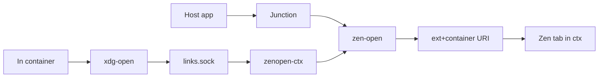

---
covers:
  features: []
  paths:
    - home/.chezmoiscripts/run_onchange_after_37-container-links.sh.tmpl
    - home/.chezmoiscripts/run_onchange_after_38-linkrouting.sh.tmpl
---

# Link routing between contexts

## What it does

Turns a link clicked outside Zen into an `ext+container:` URI naming a
container, so it lands in the right context, not the focused space. Host half
gated on `.env == host` + feature `zen`, container half on `.env == container`.
Past the URI: [isolation-browser.md](isolation-browser.md).

## Files

| Path | Role |
|---|---|
| `home/.chezmoiscripts/run_onchange_after_37-container-links.sh.tmpl` | Container half |
| `home/.chezmoiscripts/run_onchange_after_38-linkrouting.sh.tmpl` | Host half |
| `/usr/local/bin/xdg-open` | Container. Shadows `xdg-utils` via PATH |
| `/usr/local/share/applications/container-link.desktop` | Container. Its `NoDisplay` entry, default http(s) handler |
| `/usr/local/bin/zen-open`, `zen-open-recv` | Host. URI builder; receiver reads one URL, answers one word |
| `~/.config/systemd/user/zenopen-<ctx>.service` | Host. `socat` listener per context |
| `~/.local/share/wsproxy/<ctx>/links.sock` | Host, dir 700; in-container `/var/lib/wsproxy/links.sock` ([containers.md](containers.md)) |
| `~/.local/share/applications/zen-<ctx>.desktop`, `zen-home.desktop` | Host. Picker items per context, plus `home` |

## How it works

A URL from outside the browser has no correct container - the question is
malformed until a human answers it. So it is never inferred from focus, only
pinned into the URL once the answer exists.



- Junction (pacman `junction`, feature `zen`) becomes default http(s) handler
  only if unset; its desktop id comes from `pacman -Ql`, so an upstream rename
  cannot pin a dead handler. Entries and units of renamed contexts are pruned
  first.
- The wrapper forwards only `http(s)`, else `exec`s the real
  `/usr/bin/xdg-open`, so PDFs still open in-container. PATH misses GLib
  callers (`gio open`) reading `mimeapps.list` - hence
  `container-link.desktop` plus `xdg-mime default`.
- The context is the socket, not an argument: `{{ .name }}` is baked into
  `ExecStart` at apply time, so a container cannot forge it. `zen-open-recv`
  answers `no-context`, `no-url`, `too-long` (>2048), `bad-scheme`, `bad-url`
  (whitespace), `ok` or `failed`, logging refusals.
- `zen-open` encodes with `jq -sRr @uri` (escapes `&`, which would otherwise
  truncate the URL), then `setsid slice-run browser-zen.slice`.
- Bypassing the picker: hand-saved bookmarks holding an `ext+container:`
  string, and Space Routing rules written by
  `run_after_43-zen-session.sh.tmpl` for contexts with `route` true.

## Constraints

- Never rule a shared Microsoft domain (`dev.azure.com`, `portal.azure.com`,
  `teams.microsoft.com`, `login.microsoftonline.com`) with "Always Open This
  Site in…" or Space Routing: the rule *pulls* every match into one container,
  so another tenant's sign-in runs on the wrong cookies and egress IP
  ([isolation.md](isolation.md)). `personal` has no `route: true` either: the
  word occurs in ordinary URLs.
- `Exec=` carries the catalogue name, case unchanged:
  `contextualIdentities.query` is case-sensitive and the extension *creates* a
  proxy-less container for a name it misses. Only `Name=` is titled.
- `zen.desktop` must not declare `x-scheme-handler/http(s)`: a bare "Zen
  Browser" picker item opens the URL in the focused space's container.
- A container can reach a *neighbour's* `links.sock` through `/run/host`
  (measured `digi3` -> `personal`, 2026-07-31), same as `socks.sock`
  ([isolation-network.md](isolation-network.md)): the netns separates
  contexts, not the socket.

## Decisions

| Decision | Why | Rejected |
|---|---|---|
| One UNIX socket per context | Host owns the mapping; the ask narrows from "run any command" to "open a URL" | `distrobox-host-exec` |
| Wrapper errors out, no fall-through | Fall-through opens the link in the container's chromium, put there by claudefiles | - |
| `slice-run`, not `systemd-run` | A second auto-named scope on one PID collides ([browsers.md](browsers.md)) | - |

`distrobox-host-exec` returned 127 with empty output here (2026-07-29, replaced
2026-07-30): `host-spawn` calls `org.freedesktop.Flatpak.Development.HostCommand`
and `flatpak` is absent; `init=true` makes `distrobox-create` skip the host
`/run/user/$UID` mount (gated on `init -eq 0`). Both had to be fixed, so neither
was. [issues/2026-07-29-distrobox-host-exec-broken.md](issues/2026-07-29-distrobox-host-exec-broken.md),
`github.com/89luca89/distrobox/issues/1692` (open).

## Verify

```sh
xdg-mime query default x-scheme-handler/https   # re.sonny.Junction.desktop
distrobox enter digi3 -- gio mime x-scheme-handler/https   # container-link.desktop
# Whole route, no browser:
distrobox enter digi3 -- sh -c 'printf "ftp://x\n" | socat -T5 - UNIX-CONNECT:/var/lib/wsproxy/links.sock'
                                                # bad-scheme
```

## Failure modes

| Symptom | Cause | Fix |
|---|---|---|
| `no link socket at ...` | Unit down, or container built without the mount | `systemctl --user status zenopen-<ctx>` |
| Bridge units stopped after a container rebuild | `onchange` scripts did not re-run (2026-08-01) | `chezmoi apply`; script 35 restarts them |
| CLI login link opened the container's chromium | GLib bypassed the wrapper; container predates `container-link.desktop` (2026-08-01) | `chezmoi apply` in the container |
| `the host refused the link (...)` | Receiver rejected it, or `zen-open` failed | `journalctl --user -u zenopen-<ctx>.service` |

## See also

[isolation.md](isolation.md), [isolation-browser.md](isolation-browser.md),
[isolation-network.md](isolation-network.md), [containers.md](containers.md)
