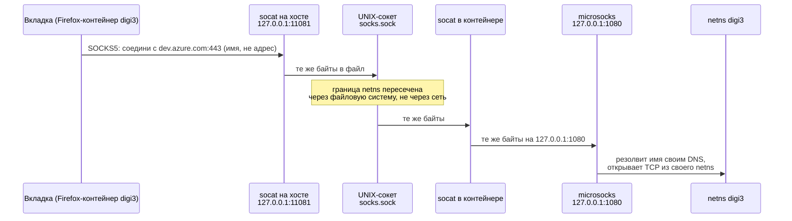

---
covers:
  features: []
  paths:
    - home/.chezmoiscripts/run_onchange_after_34-wsproxy-host.sh.tmpl
    - home/.chezmoiscripts/run_onchange_after_36-wsproxy-container.sh.tmpl
---

# Мост wsproxy: как трафик вкладки попадает в сеть контейнера

[isolation.md](isolation.md) объяснил, зачем каждому рабочему контексту нужна
своя сеть, и показал цепочку целиком, от вкладки до [netns](glossary.md#network-namespace)
контейнера. Этот документ — про среднюю часть этой цепочки: пять звеньев,
которыми байты физически пересекают границу [network namespace](glossary.md#network-namespace),
и два скрипта, которые эти звенья собирают. Что до моста (расширения браузера,
привязка [space](glossary.md#space-в-zen) к контейнеру) — [isolation-browser.md](isolation-browser.md);
что после (killswitch при упавшем VPN) — [killswitch.md](killswitch.md); из чего физически
собран сам контейнер, который несёт свою половину моста, — [containers.md](containers.md).

## Что это даёт

У тебя открыта вкладка в рабочем пространстве `digi3`. Она хочет сходить на
`dev.azure.com`. Вкладка физически исполняется в браузере на хосте — это тот
же процесс, что и все остальные вкладки. Но запрос должен уйти так, будто его
отправил отдельный компьютер `digi3`: со своим DNS, своими маршрутами, своим
VPN, если он есть.

Мост wsproxy — это то, что делает эту подмену возможной. Работает он всегда,
без участия человека: браузер настроен ходить не в интернет напрямую, а на
локальный порт, дальше запрос сам проходит пять шагов и выходит в сеть именно
того контейнера, к которому приписана вкладка. Если контейнер `digi3` выключен,
вкладки `digi3` просто перестают открывать сайты — это ожидаемо, не баг.

## Как это работает

### Сборка мостов при `chezmoi apply`

Два скрипта строят каждый свою половину моста и запускаются в разных
окружениях — узнают, где они, по переменной `.env` шаблона chezmoi:

- `run_onchange_after_34-wsproxy-host.sh.tmpl` — только на хосте (`{{- if ne
  .env "host" }} exit 0 {{- else }}`), пишет по одному юниту-мосту `socat` на
  контекст.
- `run_onchange_after_36-wsproxy-container.sh.tmpl` — только внутри контейнера
  (`{{- if ne .env "container" }} exit 0 {{- else }}`), пишет `microsocks` и
  второй `socat` внутри того контейнера, где выполняется.

Оба генерируют юниты из шаблона, а не хранят их в репозитории готовыми: имена
и порты приходят из `contexts:` в `home/.chezmoidata.yaml`, и захардкоженный
юнит дублировал бы этот список, расходясь с ним при первой правке.

**Скрипт 34 сначала проверяет весь список контекстов, и только потом
что-либо делает.** Это единственное место всей конструкции, которое видит
таблицу `contexts:` целиком: всё остальное ниже по цепочке работает по одному
контексту за раз — сам скрипт 34 генерирует юниты в цикле `{{ range .contexts
}}` по одному, а скрипт 36 вообще не знает про соседние контексты, он
выполняется внутри уже одного конкретного контейнера. Три проверки
(`run_onchange_after_34-wsproxy-host.sh.tmpl`, комментарий «Validate the table
before acting on it», строки 20-44):

```sh
names=$(printf '%s\n'{{ range .contexts }} {{ .name | quote }}{{ end }})
ports=$(printf '%s\n'{{ range .contexts }} {{ .socks }}{{ end }})
dup_names=$(sort <<<"$names" | uniq -d | tr '\n' ' ')
dup_ports=$(sort <<<"$ports" | uniq -d | tr '\n' ' ')
reserved=$(grep -ix {{ .plain_context.name | quote }} <<<"$names" | tr '\n' ' ' || true)
```

| Проверка | Чем грозит, если пропустить |
|---|---|
| Дубль имени | Два живых контейнера с одним именем никогда не появятся: имена в podman уникальны, а `distrobox-assemble` идемпотентен — вторая попытка создать контейнер с уже занятым именем печатает `already exists` и молча возвращается, ничего не создав (`/usr/bin/distrobox-assemble`, фрагмент `already exists`). Опасность не в гонке, а в детерминированном затирании на хостовой стороне: скрипт 34 разворачивается chezmoi в один линейный проход, и цикл `{{ range .contexts }}` для второй записи с тем же `.name` безусловно перезаписывает `cat > $UNITDIR/wsproxy-<имя>.service`, оставшийся от первой (та же логика — для каталога `$SOCKDIR/<имя>` и секции `--volume` в `distrobox.ini.tmpl`, тоже ключуется по имени). Побеждает не тот, кто первым ответит на старте, а тот, чья запись в `contexts:` идёт последней — какой порт и какой каталог сокета останутся привязаны к этому имени, решает порядок строк в yaml, а не время выполнения. Каталог сокета и том при этом действительно общие для обоих контекстов — межконтекстная утечка реальна, только механизм её не гонка, а перезапись |
| Дубль порта | Оба юнита `wsproxy-<имя>.service` попытались бы забрать один и тот же TCP-порт — тоже не гонка, а порядок: юниты включаются строго последовательно, в том порядке, в котором `{{- range .contexts }} systemctl --user enable --now wsproxy-{{ .name }}.service {{- end }}` проходит список, а он совпадает с порядком записей в `contexts:`. Первый по списку контекст с этим портом получает `bind()`, следующий с тем же портом гарантированно его теряет (адрес занят) и остаётся в цикле `Restart=always`/`RestartSec=2`, не поднимаясь никогда. Firefox по-прежнему настроен на этот порт — значит либо тишина (контекст без прокси вообще), либо, что хуже, трафик уходит через контейнер того контекста, что идёт раньше в `contexts:` |
| Имя из `plain_context` | Имя берётся не из литерала, а из ключа `plain_context:` в `home/.chezmoidata.yaml` (сейчас `home`) — это Firefox-контейнер без прокси, для ссылок, не принадлежащих ни одной работе (см. [isolation.md](isolation.md)). Если бы `contexts:` завёл distrobox-пару с этим именем, скрипт честно построил бы ей мост и сокет — то есть выдал прокси и сеть контейнеру, у которого по определению не должно быть ни того ни другого. Сверка идёт `grep -ix`, без учёта регистра: столкновение происходит в контейнере, и имя в другом регистре построило бы второй контейнер рядом, а не упало |

При срабатывании любой из трёх скрипт печатает список нарушений в `stderr` и
завершается кодом `1`, не создав и не удалив ни одного юнита — `chezmoi apply`
останавливается на этом шаге.

**Уборка устаревшего идёт до создания нового** (строки 43-55, `keep` строится
из актуального списка контекстов):

```sh
keep=" {{ range .contexts }}wsproxy-{{ .name }}.service {{ end }}"
for unit in "$UNITDIR"/wsproxy-*.service; do
    ...
    case "$keep" in
        *" $base "*) ;;
        *)  systemctl --user disable --now "$base" 2>/dev/null || true
            rm -f "$unit" ;;
    esac
done
```

Порядок важен на конкретном примере: контекст `digi3` переименовали в `digi4`,
оставив тот же порт `11081` (например, чтобы не трогать привязку в Multi-Account
Containers). Юнит `wsproxy-digi3.service` всё ещё активен и держит порт `11081`
через `socat ... TCP-LISTEN:11081,bind=127.0.0.1,fork,reuseaddr`. Флаг
`reuseaddr` здесь — это `SO_REUSEADDR`: он ускоряет повторный `bind()` тем же
процессом после перезапуска, а не позволяет двум разным живым процессам слушать
один и тот же порт одновременно. Если бы создание нового юнита `wsproxy-digi4.service`
на том же порту случилось раньше остановки старого, `bind()` второго `socat`
вернул бы «Address already in use», и `digi4` остался бы без моста — ровно тот
же отказ, что и при дубле порта из таблицы выше, только выращенный руками через
неверный порядок операций. Прунинг first освобождает порт `11081`, прежде чем
что-либо новое попробует на него сесть.

### Путь запроса, шаг за шагом



Пять звеньев на контекст:

1. **`socat` на хосте.** Юнит `wsproxy-<контекст>.service`
   (`run_onchange_after_34-wsproxy-host.sh.tmpl:66`):
   `TCP-LISTEN:{{ .socks }},bind=127.0.0.1,fork,reuseaddr UNIX-CONNECT:.../socks.sock`.
   Слушает порт из `contexts:`, перекладывает байты в UNIX-сокет. `fork`
   означает отдельный процесс на каждое соединение — юнит переживает падение
   контейнера, рвётся только текущее соединение.
2. **UNIX-сокет.** Файл `~/.local/share/wsproxy/<контекст>/socks.sock` на
   хосте — тот же самый inode, что и `/var/lib/wsproxy/socks.sock` внутри
   контейнера: том смонтирован через `--volume` в `distrobox.ini.tmpl`
   ([containers.md](containers.md)). Механика самого UNIX-сокета — в
   [словаре](glossary.md#unix-сокет).
3. **`socat` в контейнере.** Юнит `wsproxy-bridge.service`
   (`run_onchange_after_36-wsproxy-container.sh.tmpl:55`):
   `UNIX-LISTEN:/var/lib/wsproxy/socks.sock,fork,mode=600,unlink-early
   TCP:127.0.0.1:1080`. `127.0.0.1` здесь — [loopback контейнера](glossary.md#127001),
   отдельный от хостового.
4. **`microsocks`.** Юнит `wsproxy-socks.service`: `microsocks -i 127.0.0.1 -p
   1080` — настоящий [SOCKS5](glossary.md#socks5)-сервер. Он и только он
   понимает протокол; оба `socat` — тупые перекладыватели байтов, протокола не
   разбирают.
5. **Выход из netns контейнера.** `microsocks` резолвит имя через DNS
   контейнера ([remote DNS](glossary.md#dns-и-remote-dns), включённый
   расширением на стороне браузера — [isolation-browser.md](isolation-browser.md))
   и открывает исходящее TCP-соединение уже из [netns](glossary.md#network-namespace)
   контейнера — его маршруты, его DNS, его VPN, если есть ([killswitch.md](killswitch.md)).

`wsproxy-bridge.service` требует `wsproxy-socks.service` (`Requires=`, `After=`
в `run_onchange_after_36-wsproxy-container.sh.tmpl:50`) — мост не поднимется
раньше, чем есть кому передавать байты дальше.

### Почему UNIX-сокет, а не проброс порта

Очевидный способ достучаться до порта `1080` внутри контейнера снаружи — это
проброс порта (`-p 11081:1080`). Его здесь нет, и это центральное решение всей
конструкции. У [UNIX-сокета](glossary.md#unix-сокет) — файла файловой системы,
а не объекта сетевого стека — три следствия, которых проброс порта не даёт:

1. **Граница netns не ослаблена.** Ни одного нового маршрута, ни одного
   открытого порта на границе между хостом и контейнером. Соединение через файл
   не проходит ни через один сетевой интерфейс.
2. **Направление всегда одно.** Хост подключается (`UNIX-CONNECT` на хосте,
   `UNIX-LISTEN` в контейнере) — контейнер никогда не набирает хост в ответ, у
   него для этого и адреса-то нет.
3. **Каталог у каждого контекста свой.** `--volume
   ~/.local/share/wsproxy/<контекст>:/var/lib/wsproxy:rw` монтирует
   контейнеру ровно его подкаталог, а не общий. Общий каталог позволил бы
   любому контейнеру набрать чужой `socks.sock` и выйти через чужой VPN — сама
   корреляция, против которой строится всё остальное. Это тот же периметр, у
   которого есть известная дыра: сокеты соседей всё равно достижимы через
   `/run/host`, потому что distrobox монтирует туда домашний каталог хоста
   целиком, — разобрано в [isolation.md](isolation.md), раздел «Что не
   изолировано», и здесь не повторяется.

### Почему юниты работают от пользователя, а не от root

Оба юнита-моста — `wsproxy-<контекст>.service` на хосте и
`wsproxy-socks.service`/`wsproxy-bridge.service` в контейнере — несут
`User={{ .chezmoi.username }}`. Это не косметика, а прямое следствие того, как
distrobox создаёт контейнер.

Проверено на живом контейнере `digi3` (карта UID из `/proc/<pid>/uid_map`
запущенного контейнера — колонки «UID в контейнере / UID на хосте /
длина диапазона»):

```
         0     100000       1000
      1000       1000          1
      1001     101000      64535
```

Это `--userns keep-id`: UID `1000` (обычный пользователь) отображается в UID
`1000` хоста — один в один, «keep id». А вот UID `0` (root контейнера)
отображается в `100000` — subuid из `/etc/subuid` (`stsiapan:100000:65536`),
никак не связанный с реальным пользователем хоста.

`socat` внутри контейнера создаёт файл сокета с `mode=600` — «читать и писать
может только владелец». Если бы `wsproxy-bridge.service` работал от root
контейнера, файл `socks.sock` на хосте принадлежал бы UID `100000`. Хостовый
`socat` (юнит `wsproxy-<контекст>.service`) работает от обычного пользователя,
UID `1000`, и `open()` файла с `mode=600`, принадлежащего чужому UID, вернул бы
`EACCES` — тот самый крайний UNIX-сокет из шага 2 стал бы недостижим именно
той стороной, которая должна его набирать. Отсюда `User={{ .chezmoi.username
}}` в обоих юнитах: только когда сокет создаётся от UID `1000` контейнера,
который `keep-id` отображает в UID `1000` хоста, обе стороны видят один и тот
же файл с правами на запись.

Юниты в контейнере — системные (`/etc/systemd/system/`), а не
пользовательские: комментарий в
`run_onchange_after_36-wsproxy-container.sh.tmpl` объясняет это отдельно —
контейнер поднимает systemd как `init` (`init=true` в `distrobox.ini.tmpl`), а
`logind`-сессии внутри него нет, значит пользовательского менеджера systemd
попросту неоткуда взяться.

## Что ставится и что меняется

| Категория | Путь | Где | Кто создаёт |
|---|---|---|---|
| Каталог сокета | `~/.local/share/wsproxy/<контекст>/` (`mode 700`) | Хост | `run_onchange_after_34-wsproxy-host.sh.tmpl` |
| UNIX-сокет | `~/.local/share/wsproxy/<контекст>/socks.sock` = `/var/lib/wsproxy/socks.sock` в контейнере, тот же inode | Хост и контейнер | `wsproxy-bridge.service` при старте (создаёт файл), том — [containers.md](containers.md) |
| Юнит пользователя | `~/.config/systemd/user/wsproxy-<контекст>.service` | Хост | `run_onchange_after_34-wsproxy-host.sh.tmpl` |
| Системный юнит | `/etc/systemd/system/wsproxy-socks.service` | Контейнер | `run_onchange_after_36-wsproxy-container.sh.tmpl` |
| Системный юнит | `/etc/systemd/system/wsproxy-bridge.service` | Контейнер | `run_onchange_after_36-wsproxy-container.sh.tmpl` |
| Список контекстов и портов | `contexts:` в `home/.chezmoidata.yaml` | Хост, источник данных | Правится руками |

Пакеты `socat` (хост и контейнер) и `microsocks` (контейнер) отдельно не
заявлены этим документом — они часть фич `host-base` и `container-base`,
описанных в [containers.md](containers.md); здесь только механика того, что
эти два бинарника делают вместе.

## Как проверить

Быстрые проверки того, что детали на месте (реально выполнено на этой машине
2026-07-30, три контекста подняты):

```sh
ss -ltn | grep -E ':1108[0-9]'
```
```
LISTEN 0      5      127.0.0.1:11081  0.0.0.0:*
LISTEN 0      5      127.0.0.1:11082  0.0.0.0:*
LISTEN 0      5      127.0.0.1:11083  0.0.0.0:*
```

```sh
ls -l ~/.local/share/wsproxy/*/socks.sock
distrobox enter digi3 -- ls -l /var/lib/wsproxy
```
Оба показывают `srw-------`, владелец — обычный пользователь; второе — только
`socks.sock` своего контекста, ничего чужого не смонтировано в эту точку.

Это доказывает, что детали на месте. **Не доказывает, что трафик вкладки
физически ушёл через нужный netns** — прокси мог быть прописан не тому
контейнеру, а мосты при этом всё равно будут «слушать» и выглядеть здоровыми.
Различает это только собственный loopback контейнера: `127.0.0.1` внутри
`digi3` и `127.0.0.1` внутри `stellium` — два разных адреса в двух разных
netns ([словарь](glossary.md#127001)). Поднимаем в каждом контейнере
ответчик, называющий своё имя:

```sh
for c in digi3 stellium personal; do
  distrobox enter "$c" -- sh -c "printf 'HTTP/1.0 200 OK\r\nContent-Type: text/plain\r\n\r\n%s\n' \"\$(. /run/.containerenv; echo \$name)\" > /var/tmp/whoami.http"
  podman exec -d "$c" sh -c 'socat TCP-LISTEN:8099,bind=127.0.0.1,fork,reuseaddr SYSTEM:"cat /var/tmp/whoami.http"'
done

curl -s --max-time 3 http://127.0.0.1:8099/; echo "exit=$?"        # с хоста напрямую
for p in 11081 11082 11083; do
  printf '%s -> ' "$p"
  curl -s --max-time 5 --socks5-hostname "127.0.0.1:$p" http://127.0.0.1:8099/
done
```

Реальный вывод этой команды на этой машине, сейчас:

```
exit=7
11081 -> digi3
11082 -> stellium
11083 -> personal
```

`exit=7` — «не удалось соединиться»: у хоста на `8099` никто не слушает,
ответчики есть только внутри контейнеров. Дальше порт `11081` называет
`digi3`, `11082` — `stellium`, `11083` — `personal`: каждый мост действительно
выходит в сеть своего, а не чужого или общего контейнера.

Две детали в этом тесте неочевидны:

**Почему `/var/tmp`, а не `/tmp`.** Проверено напрямую на этой машине:
`/proc/self/mountinfo` хоста и `distrobox enter digi3 -- cat
/proc/self/mountinfo` показывают для `/tmp` один и тот же номер устройства
(`0:44`, один tmpfs с общей propagation-группой `shared:111`/`master:111`) — файл,
записанный с хоста в `/tmp`, немедленно виден внутри контейнера. Практическая
проверка: `echo x > /tmp/маркер` на хосте, затем `distrobox enter digi3 --
cat /tmp/маркер` — виден. Тот же маркер в `/var/tmp` внутри `digi3` из
контейнера не виден с хоста и наоборот — это отдельная, несмонтированная
точка. Если бы ответчик писал маркер в `/tmp`, все три контекста писали бы в
один и тот же файл, и тест показывал бы одно и то же имя на всех трёх портах
— выглядело бы как успех, доказывая на самом деле только то, что `/tmp` общий.

**Почему `podman exec -d`, а не фоновый `distrobox enter ... &`.** `-d` у
`podman exec` документирован именно как «выполнить сессию exec в отсоединённом
(фоновом) режиме» — жизнь процесса внутри контейнера с этого момента никак не
привязана к клиенту, который его запустил. `distrobox enter`, наоборот, всегда
держит клиента: `generate_enter_command` в `/usr/bin/distrobox-enter`
формирует `podman exec --interactive` (и добавляет `--tty`, если не в
headless-режиме), то есть команда обязана либо остаться на переднем плане,
либо быть корректно отсоединена именно этим клиентским процессом на всё время
жизни слушателя. Прямая проверка на этой машине 2026-07-30 (distrobox 1.8.2.5,
podman 6.0.2) не подтвердила буквальную формулировку «умирает вместе с
сессией»: запущенный через `distrobox enter digi3 -- sh -c 'sleep 30' &` и
затем убитый снаружи клиент (проверено и без псевдотерминала, и с ним через
`script`) не убивал процесс `sleep 30` внутри контейнера — тот доживал до
естественного конца. Возможно, дело в деталях конкретной версии или в способе
завершения клиента, которые не воспроизведены. Что остаётся практически верным
и проверяемым по документации `podman exec --help` — это то, что `-d` не
требует вообще никаких предположений о жизни клиента, а фоновый `distrobox
enter` требует; для теста, где нужен гарантированно живущий слушатель, это и
есть причина выбирать `-d`.

Убрать за собой после проверки:

```sh
for c in digi3 stellium personal; do
  podman exec "$c" pkill -f 'TCP-LISTEN:8099' || true
done
```

Пометка: слушатель, поднятый через `podman exec -d` без `--user`, работает от
root контейнера — убить его снаружи от обычного пользователя (`distrobox enter
... -- pkill ...`) не получится, нужен `podman exec` (тоже от root) или `sudo`
изнутри контейнера.

## Когда сломалось

| Симптом | Причина | Что делать |
|---|---|---|
| Вкладка в конкретном контексте не открывает сайты, ошибка вида «Unable to connect» | Мост не поднят: либо хостовый юнит, либо один из контейнерных | `systemctl --user status wsproxy-<контекст>.service` на хосте; `distrobox enter <контекст> -- systemctl status wsproxy-socks.service wsproxy-bridge.service` в контейнере; `podman ps` — сам контейнер вообще запущен? |
| `chezmoi apply` останавливается с `!! Bad contexts in .chezmoidata.yaml` | Дубль имени, дубль порта или контекст, занявший в `contexts:` имя из `plain_context:` (сейчас `home`, сверка без учёта регистра) | Поправить `home/.chezmoidata.yaml`, см. таблицу проверок выше — что именно сломается, зависит от того, какая из трёх строк напечаталась |
| После `chezmoi apply` мост для контекста не поднялся, но команда завершилась без ошибки | Контейнер собран до появления тома `/var/lib/wsproxy` в `distrobox.ini.tmpl`: скрипт 36 печатает `!! /var/lib/wsproxy is not mounted...` и выходит кодом `0`, ничего не устанавливая — `run_onchange` не считает это сбоем | Пересобрать контейнер: `distrobox rm <контекст> && distrobox assemble create --name <контекст> --file ~/.config/distrobox/distrobox.ini`, затем `chezmoi apply` заново |
| Контекст переименовали или поменяли ему порт, а браузер всё ещё лезет на старый порт молча — без ошибки, но и без ответа | Прунинг в скрипте 34 определяет «устаревшее» по имени юнита. Если поменять **порт** у контекста, оставив имя тем же, `wsproxy-<имя>.service` не признаётся устаревшим и не проходит через `disable --now` — файл юнита перезаписывается новым портом, но **уже запущенный** процесс `socat` не перезапускается: `systemctl --user enable --now` на уже активном юните не делает `restart`. Проверено воспроизведением на этой машине: после подмены `ExecStart` в тестовом юните и повторного `enable --now` `MainPID` не поменялся, хотя `systemctl show` уже показывает новую команду запуска | `systemctl --user restart wsproxy-<контекст>.service` вручную после любой правки порта существующего контекста — `chezmoi apply` сам этого не сделает |
| Все юниты `wsproxy-*` (и `zenopen-*`) разом «failed» или стоят, вкладки всех контекстов без сети | Снос и пересоздание контейнеров остановили юниты, а скрипт 34 — `onchange`: текст не менялся, `enable --now` не перевыполнился. «failed» вместо «inactive» — socat выходит кодом 143 на SIGTERM; с 2026-08-01 юниты несут `SuccessExitStatus=143` (случай разобран в [isolation-links.md](isolation-links.md), «Когда сломалось») | `systemctl --user start wsproxy-<контекст>.service` по всем контекстам; проверка — `ss -ltn \| grep -E ':1108[0-9]'` |
| Юнит `wsproxy-<имя>.service` исчез из списка (переименование/удаление контекста), но что-то по-прежнему слушает его старый порт | Прунинг гасит и удаляет юнит, но `systemctl --user disable --now "$base" 2>/dev/null \|\| true` глотает ошибку остановки; `rm -f` при этом всё равно выполняется. Если `disable --now` не смог реально остановить процесс, осиротевший `socat` остаётся висеть на порту без какого-либо юнита, который его отслеживает | `ss -ltnp \| grep <порт>` — найти PID напрямую и убить руками; затем `chezmoi apply` повторно, чтобы юниты были созданы заново |

## Почему именно так

**Юниты генерируются, а не лежат в репозитории готовыми файлами** — иначе
список имён и портов существовал бы в двух местах: в `contexts:` и в
чекнутых-ин `.service`-файлах, и был обречён рано или поздно разойтись.
Шаблонизация с `{{ range .contexts }}` в одном скрипте — единственный способ
удержать источник истины в одном месте.

**Порядок «сначала прунинг, потом создание» стоит одной конкретной проблемы:
переиспользования порта при переименовании контекста без остановки старого
слушателя** (разобрано в разделе «Как это работает» выше на примере
`digi3` → `digi4`). Обратный порядок ловил бы `EADDRINUSE` ровно там же, где
его ловит дубль порта в исходных данных — только созданный уже не входными
данными, а порядком операций скрипта.

**Формулировка «слушатель умирает вместе с exec-сессией» из более ранних
текстов документации не воспроизвелась при прямой проверке на этой машине
2026-07-30** (см. раздел «Как проверить»). Она может отражать поведение другой
версии distrobox или podman, либо частный случай завершения клиентского
терминала, который не был точно воспроизведён. Практическая рекомендация
(`podman exec -d`) от этого не меняется: `-d` — это документированное,
безусловное отсоединение, а не поведение, зависящее от версии или способа
завершения клиента, поэтому он остаётся правильным выбором независимо от того,
воспроизводится ли конкретно эта поломка `distrobox enter` сегодня.

**Обход с точкой монтирования `/var/lib/wsproxy` вместо `/mnt`** относится к
сборке самого контейнера, не к мосту — он уже занесён в реестр обходов задачей
про `containers.md`. Здесь без повтора: [workarounds.md](workarounds.md).

## Ссылки

- [isolation.md](isolation.md) — общая картина цепочки и модель угроз.
- [containers.md](containers.md) — из чего собран сам контейнер, том `/var/lib/wsproxy`.
- [isolation-browser.md](isolation-browser.md) — что подставляет прокси на стороне браузера.
- [glossary.md](glossary.md) — термины: [network namespace](glossary.md#network-namespace), [UNIX-сокет](glossary.md#unix-сокет), [`127.0.0.1`](glossary.md#127001), [SOCKS5](glossary.md#socks5), [DNS и remote DNS](glossary.md#dns-и-remote-dns).
- [workarounds.md](workarounds.md) — реестр обходов, включая `/mnt` у distrobox.
- `podman exec --help` — документированное поведение `-d`/`--detach`, проверено локально: podman 6.0.2.
- `/usr/bin/distrobox-enter`, функция `generate_enter_command` — как собирается команда входа в контейнер, distrobox 1.8.2.5.
