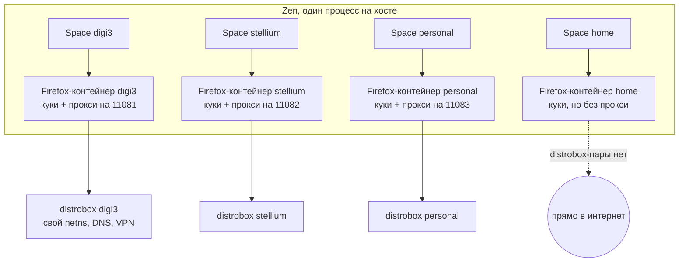
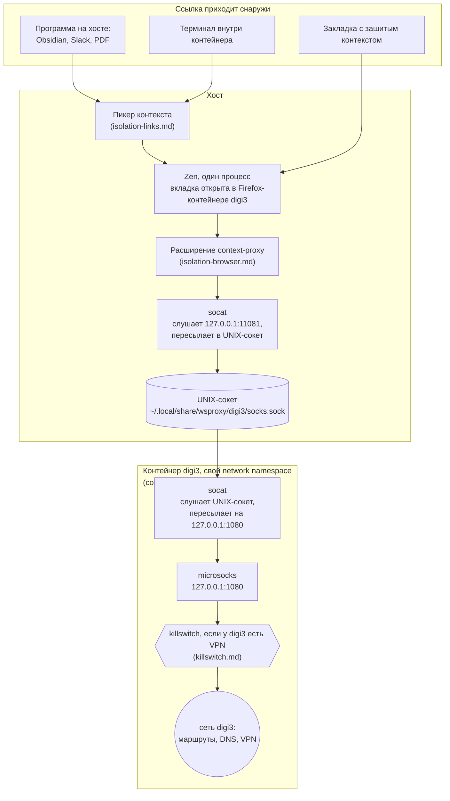

---
covers:
  features: []
  paths: []
---

# Изоляция рабочих контекстов

Общая картина: зачем в этом репозитории вообще есть слой изоляции, как он
устроен на самом верхнем уровне и, самое важное, что из построенного
гарантированно работает, а что нет. Как устроен любой из пяти механизмов
внутри — в частных документах, ссылки на них ниже.

## Зачем это нужно

У тебя несколько работ (в терминах репозитория — «рабочих контекстов»):
`digi3`, `stellium`, `personal`, и ещё обычный личный сёрфинг. Требование одно,
и оно жёстче, чем «не перепутать пароли»:

> Ни один работодатель не должен получить наблюдаемого свидетельства, что у
> тебя есть другие работы.

Это называется неатрибутируемость. Речь не о защите от вирусов и не о том,
чтобы прятать файлы от утечки. Речь о том, что у наблюдателя есть только его
собственные журналы — то, что видно на его серверах, — и по ним он не должен
уметь связать твою активность у него с активностью где-то ещё. Модель угроз
здесь — работодатель, читающий свои собственные журналы, а не враждебный код,
который как-то оказался внутри одного из контекстов; про разницу между ними —
в разделе «Что не изолировано» ниже.

Что на практике склеивает контексты, если не принять мер:

| Признак | Как склеивает |
|---|---|
| IP-адрес | Один и тот же адрес в журналах двух организаций |
| DNS-запросы | Служба перевода имени сайта в адрес одной работы видит имена другой |
| Куки и сессии браузера | Одна открытая вкладка тянет за собой сессию из другой |
| Вход в общий сервис | `login.microsoftonline.com` общий для всех организаций на Microsoft; вход в чужой тенант попадает в его журналы |

Раньше это решалось грубой силой: под каждую работу — свой контейнер (что это
такое, разберём через минуту), и в каждом свой браузер Firefox. Изоляция была
полной, а жить с этим было плохо: три браузера — это трижды открытые вкладки,
трижды память, и переключение между работами превращается в переключение
между приложениями, а не вкладками одного окна.

Цель нынешней конструкции: **один браузер на виду, но сеть каждой вкладки
по-прежнему выходит через то окружение, к которому вкладка приписана.** Дальше
разбирается, что это за окружения, как вкладка находит своё, и, самое важное,
что из этого на самом деле гарантировано.

## Слово «контейнер» значит две разные вещи

Термин «контейнер» дальше встречается постоянно, и означает он две совершенно
разные вещи в зависимости от того, о чём идёт речь. Это главный источник
путаницы во всей конструкции, и разбирается он здесь, до диаграмм, а не в
одном из частных документов ниже.

| | [Контейнер distrobox](glossary.md#контейнер-distrobox) | [Контейнер Firefox](glossary.md#контейнер-firefox) |
|---|---|---|
| Что это | группа процессов в своём наборе namespace | банка состояния внутри одного браузера |
| Кто создаёт | `podman` и `distrobox` | Firefox/Zen, через расширение Multi-Account Containers |
| Что изолирует | сеть, список процессов, отчасти файловую систему | куки, сессии, localStorage |
| Где живёт | ядро Linux | профиль браузера |
| Пример имени | `digi3` | `digi3` |
| Как посмотреть | `podman ps` | `about:preferences#containers` |

Имена совпадают намеренно: Firefox-контейнер `digi3` направляет трафик на порт
`11081` на хосте, а порт `11081` мостом ведёт в distrobox-контейнер `digi3`.
Одно имя, две сущности, связанные вручную через таблицу портов в
`home/.chezmoidata.yaml`.

Пара не обязана существовать в обе стороны. У Firefox-контейнера `home`
distrobox-пары нет вообще: это не работа, а её отсутствие — пространство «без
работы», куда пикер отправляет ссылки, не принадлежащие ни одной работе. Его
определение лежит отдельным ключом `plain_context:` в `home/.chezmoidata.yaml`
— имя, иконка, цвет и свой список закладок; это ровно одна запись, а не список,
потому что второго «отсутствия работы» не бывает. Прокси у него нет намеренно,
distrobox-контейнера и моста тоже, трафик уходит прямо с хоста.

В остальном он устроен как рабочий контекст: свой space в сайдбаре, своя папка
закладок на панели и свои закреплённые вкладки
(`home/.chezmoiscripts/run_onchange_before_32-browser-extensions.sh.tmpl` и
`run_after_43-zen-session.sh.tmpl`). В папку закладок, как и всем, приезжает
общий список `bookmarks:` (почта и календарь — то, что нужно в каждом
пространстве) плюс собственный `plain_context.bookmarks`; в плитки — только
собственный, по прямому решению. Цвет `cyan` намеренно вынут из ротации цветов
рабочих контекстов, чтобы `home` не совпал ни с одной работой, сколько бы их
ни завели.



Слева — изоляция состояния (кто залогинен), справа — изоляция сети (откуда
виден трафик). Стрелка между ними — это и есть то, что построено, и именно её
разбирают частные документы волны.

## Общая картина

Полная цепочка от вкладки до сети — пять звеньев, и три из них живут внутри
контейнера:



У `stellium` и `personal` — та же цепочка на портах `11082` и `11083`. У
`home` моста нет вообще, цепочка обрывается на Zen: трафик уходит прямо с
хоста (раздел выше).

Таблица портов задана в одном месте — блоке `contexts:` в `home/.chezmoidata.yaml`:

```yaml
contexts:
  - name: digi3
    socks: 11081
    route: true
  - name: stellium
    socks: 11082
    route: true
  - name: personal
    socks: 11083
```

`route: true` — необязательное третье поле. Оно включает штатное Space Routing
браузера: правило «адрес содержит имя контекста — открыть в спейсе этого
контекста», а спейс привязан к контейнеру, так что вместе со спейсом приезжает
и прокси. У `personal` флага нет намеренно: правило не подсказывает, а
вытаскивает ссылку, а слово `personal` встречается в обычных адресах вроде
`github.com/settings/personal-access-tokens`.

Комментарий над блоком описывает, что из одного имени порождается всё
остальное: секция в `distrobox.ini`, каталог с UNIX-сокетом, юнит-мост systemd
на хосте, Firefox-контейнер, space и папка закладок, пункт в пикере ссылок, а
для контекстов с `route: true` — ещё и правило маршрутизации спейса.
Добавить четвёртую работу — дописать сюда три строки.

Каждый из пяти документов волны берёт на себя один слой этой картины:

| Документ | Что в нём |
|---|---|
| [containers.md](containers.md) | Из чего собирается сам distrobox-контейнер: образ, домашний каталог, что в нём живёт |
| [isolation-network.md](isolation-network.md) | Мост через UNIX-сокет и `socat`: как байты пересекают границу network namespace |
| [isolation-browser.md](isolation-browser.md) | Расширения Zen: Multi-Account Containers, собственный `context-proxy`, привязка space к контейнеру |
| [isolation-links.md](isolation-links.md) | Маршрутизация внешних ссылок: как ссылка находит нужный контейнер, а не берёт текущий |
| [killswitch.md](killswitch.md) | Что рубит сеть контейнера, если его VPN падает |

Дальше в этом документе — не как это собрано, а что из собранного на самом
деле работает.

## Что изолировано надёжно

| Что | Чем обеспечено |
|---|---|
| Сетевой стек контекста | Отдельный [network namespace](glossary.md#network-namespace) на контейнер: `unshare_netns=true` в `home/dot_config/distrobox/distrobox.ini.tmpl` |
| Исходящий трафик вкладки | Уходит из netns своего контейнера — его маршруты, его DNS, его VPN |
| DNS-запросы | Резолвятся внутри контейнера: расширение `context-proxy` включает `proxyDNS: true` для каждого прокси (`home/.chezmoiscripts/run_onchange_after_41-zen-context-proxy.sh.tmpl`, функция `rebuild`) |
| Куки, сессии, localStorage | Разные [Firefox-контейнеры](glossary.md#контейнер-firefox) — отдельная банка состояния на контекст |
| Список процессов | Отдельный pid namespace: `unshare_process=true` в `distrobox.ini.tmpl` |
| Порты соседей | Мосты слушают только на `127.0.0.1` хоста (`bind=127.0.0.1` в `home/.chezmoiscripts/run_onchange_after_34-wsproxy-host.sh.tmpl`) — недостижимы из контейнера ни через его собственный loopback, ни через шлюз, ни через LAN-адрес хоста |

Проверить первую строку руками: `readlink /proc/self/ns/net` на хосте и
`distrobox enter digi3 -- readlink /proc/self/ns/net` в контейнере — числа
разные (подробнее про namespace — в [словаре](glossary.md#network-namespace)).

## Что не изолировано

Честный разбор. Без него документация бесполезна.

**Контейнер видит файловую систему хоста целиком.** distrobox монтирует весь
корень хоста в каждый контейнер как `/run/host` — это не опция, которую можно
выключить в `distrobox.ini.tmpl`, там такого переключателя нет вообще.
Подтверждено на этом репозитории (`home/dot_bashrc.tmpl`, комментарий про
`--no-workdir`):

```
distrobox enter digi3 -- pwd               -> /run/host/home/stsiapan
```

Значит любой процесс внутри `digi3` может перечислить домашние каталоги всех
контекстов — они лежат рядом, потому что `distrobox.ini.tmpl` кладёт каждый в
`{{ .chezmoi.homeDir }}/homes/{{ .name }}`:

```sh
distrobox enter digi3 -- ls /run/host/home/stsiapan/homes/
# digi3 personal stellium
```

Это само по себе наблюдаемое свидетельство существования других контекстов —
то самое, от чего строится вся защита. Хуже: UNIX-сокеты соседей лежат там же,
в `~/.local/share/wsproxy/<имя>/`, и доступны для набора точно так же, как и
свой собственный — мост, поднятый изнутри `digi3` на сокет `stellium` через
`/run/host/...`, точно так же выпустит трафик через netns `stellium`. Против
кого это важно — против **кода, работающего внутри контейнера**, а не против
работодателя, который читает свои журналы: модель угроз выше про второе, но
про первое стоит знать прямо.

**`/tmp` общий.** Ни у `unshare_netns`, ни у соседних флагов в
`distrobox.ini.tmpl` нет пары «unshare для /tmp» — такого переключателя
distrobox вообще не даёт. Файл, записанный в `/tmp` из одного контекста, виден
из всех и с хоста.

**`/dev/shm` и IPC общие — намеренно.** `unshare_ipc=false` в
`distrobox.ini.tmpl`. Комментарий там же объясняет цену обратного:
`unshare_ipc` заменил бы хостовый `/dev/shm` на 64 МБ по умолчанию у podman, и
приложения на Electron и JVM начали бы падать. Против атрибуции разделение IPC
ничего не даёт — оно ловит утечки между процессами одной машины, а не между
организациями.

**`/dev` общий — тоже намеренно.** `unshare_devsys=false` там же: снятие
проброса `/dev` забрало бы с собой видеокарту и звук.

**Фоновые запросы браузера без вкладки идут мимо прокси.** Расширение
`context-proxy` подставляет прокси только запросу, у которого есть настоящая
вкладка (`home/.chezmoiscripts/run_onchange_after_41-zen-context-proxy.sh.tmpl`,
функция `handler`: `if (info.tabId < 0) { return {}; }`). Firefox иногда шлёт
запросы без вкладки сам — они уходят напрямую с хоста.

**Один и тот же публичный IP, пока нет VPN.** Схема готова принять VPN на
контекст (что в этом случае рубит сеть при его падении — см. `killswitch.md`
из таблицы выше), но сама VPN не настраивает: без неё все контексты выходят в
интернет с одного адреса — с адреса хоста.

**Одна git-личность на все контейнеры по умолчанию.** Имя и почта для коммитов
спрашиваются один раз на установку и сохраняются в `chezmoi.toml`
(`home/.chezmoi.toml.tmpl`, `promptStringOnce . "git_email" "Git user email"`).
У каждого контекста свой домашний каталог, а значит формально свой отдельный
запрос при установке внутри контейнера — но ничто не мешает ответить на него
одинаково везде, и на практике так и происходит. Коммит одним и тем же адресом
в репозиториях разных организаций — прямая корреляция. Лечится вручную: другой
`user.email` в `~/.gitconfig` каждого контекста.

**Ввод адреса руками из чужого space.** Остаточная дыра: вкладка, открытая в
space `digi3`, уходит через netns `digi3` независимо от того, какой адрес в
неё вбили руками. Правила и закладки (см. `isolation-links.md` из таблицы
выше) защищают адреса, которые приходят снаружи, а не то, что напечатано в
адресной строке по памяти.

**В `home` случайные ссылки делят куки с залогиненными сайтами.** У этого
пространства есть свой space, своя папка закладок и свои закреплённые вкладки —
значит, в нём живут и постоянные сессии, тот же вход в YouTube. Ссылка, которую
пикер отправил в `home` просто потому, что она не принадлежит ни одной работе,
попадает в ту же банку кук, что и эта сессия. Размен выбран сознательно:
изоляция между работами от него не страдает — `home` не связан ни с одной из
них, — страдает изоляция внутри самой «не-работы».

## Почему именно так

**Три браузера вместо одного стоили памяти, а не только неудобства.** Сейчас
у одного Zen-процесса, который держит все три работы разом, бюджет 5-6 ГБ
([systemd slice](glossary.md#systemd-slice) `browser-zen.slice`), а зонтичный
бюджет всех браузеров хоста — 6-8 ГБ, независимо от того, сколько браузеров
открыто одновременно. Три отдельных Firefox с тем же набором вкладок не делили
бы процессы между собой и не поместились бы в общий потолок — отсюда «трижды
память» в качественном, а не измеренном виде: старая раскладка не сохранилась,
чтобы измерить её напрямую.

**Почему обмен идёт через UNIX-сокет, а не через проброс порта — отдельный
разбор, см. `isolation-network.md` из таблицы выше.** Коротко: проброс порта
открывает дыру в обе стороны, UNIX-сокет — только в одну, потому что это файл,
а не сетевой объект.

**Жёсткий потолок памяти на контейнер — `--memory=8g` в `additional_flags`
каждой секции `distrobox.ini.tmpl` — не про атрибуцию.** Он не даёт трём
контекстам свалить хост, если что-то в одном из них взбесится; отдельная
причина, отдельная защита, упомянута здесь только чтобы не создавать
впечатление, будто про память в этой конструкции вообще не думали.
