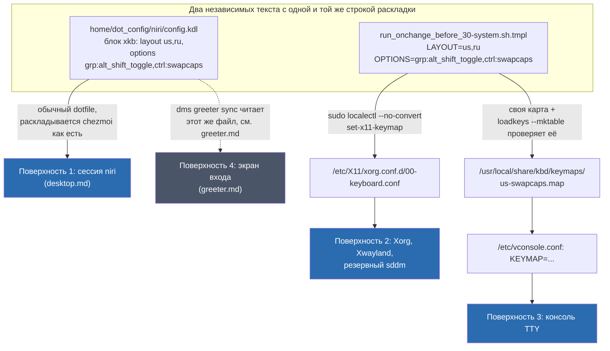

---
covers:
  features: []
  paths:
    - home/.chezmoiscripts/run_onchange_before_30-system.sh.tmpl
---

# Раскладка клавиатуры: три поверхности и защита от localectl

## Что это даёт

Клавиатура работает одинаково в трёх разных местах: в обычной рабочей сессии,
на экране входа в систему и в аварийной чёрно-белой консоли, куда попадаешь,
если графика не поднялась. Везде — английский и русский языки, переключение
**Alt+Shift**, и Caps Lock, поменянный местами с левым Control (Control под
мизинцем, а не под соседним пальцем).

Не `Win+Space` для переключения языка — потому что эта комбинация уже занята
поиском приложений в панели (подробнее — раздел «Почему не Win+Space» ниже).

Само по себе это не одна настройка, а три отдельных: у Wayland-сессии, у
X11/Xorg-стека и у текстовой консоли разное представление о том, что вообще
такое «раскладка клавиатуры», и общего рубильника на всех троих нет. Этот
документ — про две из них, которые настраивает один скрипт,
`home/.chezmoiscripts/run_onchange_before_30-system.sh.tmpl`. Третья
(рабочая Wayland-сессия niri) настраивается отдельным файлом и описана здесь
только для целостности картины — за неё отвечает [desktop.md](desktop.md).
Четвёртая поверхность, экран входа, разобрана отдельно в
[greeter.md](greeter.md).

## Как это работает



Скрипт `30-system` — [шаблон chezmoi](glossary.md#шаблон-chezmoi) с
[`run_onchange`](glossary.md#run_onchange) в имени: перезапускается, только
когда меняется его собственный текст после подстановки переменных. Условие
входа — только хост (`{{- if ne .env "host" }} exit 0 {{- else }}` в самом
начале файла): в контейнере скрипт схлопывается в пустой `exit 0`, потому что
у контейнера нет ни своей X11-сессии, ни своей консоли. Раздел про клавиатуру
идёт в скрипте первым, до zram, сервисов и firewall (см. «Что ставится и что
меняется» ниже, а также [network.md](network.md) и [hardware.md](hardware.md)
про остальные две части того же скрипта).

### Поверхность 2: Xorg, Xwayland, резервный sddm

```sh
current_layout=$(localectl status | awk -F': *' '/X11 Layout/{print $2}')
current_options=$(localectl status | awk -F': *' '/X11 Options/{print $2}')

if [[ "$current_layout" != "$LAYOUT" || "$current_options" != "$OPTIONS" ]]; then
    sudo localectl --no-convert set-x11-keymap "$LAYOUT" "" "" "$OPTIONS"
fi
```

Сравнение с текущим состоянием — не оптимизация, а необходимость: `localectl
set-x11-keymap` спрашивает пароль `sudo`, и без проверки `chezmoi apply`
просился бы на каждый прогон, даже когда раскладка уже верна.

`localectl --no-convert set-x11-keymap` пишет
`/etc/X11/xorg.conf.d/00-keyboard.conf` — секцию `InputClass` с
`XkbLayout`/`XkbOptions`, которую читают `systemd-localed` и `Xorg`
(так буквально сказано в шапке самого файла: «Written by systemd-localed(8),
read by systemd-localed and Xorg»). Xwayland тоже умеет читать этот же
каталог конфигов как обычный X-сервер, но у него нет собственного набора
физических устройств — он получает ввод от композитора, поэтому эта
конфигурация фактически востребована там, где нет niri: голый Xorg-сеанс,
если такой вообще запускается, и `sddm` в роли резервного экрана входа.

**Резервный, а не рабочий.** Сегодня основной экран входа — не `sddm`, а
`greetd` + `dms-greeter` (Wayland, отдельный временный niri) — это переключение
описано в [greeter.md](greeter.md); `sddm` остаётся установленным и
включается обратно только если `greetd` не может стартовать. Проверено на этой
машине 2026-07-31:

```sh
$ systemctl is-enabled greetd.service sddm.service
enabled
disabled
```

### Поверхность 3: консоль (TTY)

Консольная раскладка описывается не набором xkb-опций, а компилируемой картой
клавиш, поэтому `ctrl:swapcaps` в неё напрямую не переносится. Скрипт строит
минимальную карту поверх штатной `us`:

```sh
sudo tee "$CONSOLE_MAP" >/dev/null <<'KEYMAP'
include "/usr/share/kbd/keymaps/i386/qwerty/us.map.gz"
keycode  58 = Control
keycode  29 = Caps_Lock
KEYMAP
```

`keycode 58` физически — клавиша Caps Lock, `keycode 29` — левый Control;
строки переставляют символы, которые эти клавиши шлют, ровно как задумано.

`include` собран **абсолютным путём** намеренно, но не по той причине, которую
можно было бы предположить по способу вызова `loadkeys`. Форма вызова (полный
путь к `$CONSOLE_MAP` против относительного) на разрешение `include` внутри
файла не влияет вообще — проверено экспериментально 2026-07-31:

```sh
$ printf 'include "us.map.gz"\nkeycode 58 = Control\n' > t.map
$ loadkeys --mktable "$PWD/t.map" >/dev/null; echo $?
1
$ loadkeys --mktable t.map >/dev/null; echo $?
1
```

Обе формы падают с одной и той же ошибкой (`cannot open include file
us.map.gz`), и обе начинают проходить, если положить `us.map.gz` рядом с
`t.map` — то есть решает совпадение каталога, а не то, каким путём назвали
сам `$CONSOLE_MAP` в командной строке.

Настоящая причина — в наборе каталогов, которые `loadkeys` вообще просматривает
для `include`. По исходнику `legionus/kbd`
([`src/libkeymap/analyze.l`](https://github.com/legionus/kbd/blob/master/src/libkeymap/analyze.l),
версия пакета на этой машине — `kbd 2.10.0-1`): для нет-абсолютного имени
(`find_incl_file` → `find_standard_incl_file`) перебираются по порядку —
`include_dirpath1` (`../include/`, `../../include/` от текущей рабочей
директории), затем `find_incl_file_near_fn` — каталог, где лежит **сам файл,
который сейчас разбирается** (плюс его же `../include/` и `../../include/`),
и только в конце `include_dirpath3` — три фиксированных системных каталога:

```c
static const char *const include_dirpath3[] = {
	DATADIR "/" KEYMAPDIR "/include/",
	DATADIR "/" KEYMAPDIR "/i386/include/",
	DATADIR "/" KEYMAPDIR "/mac/include/",
	NULL
};
```

На этой машине это разворачивается в `/usr/share/kbd/keymaps/include/` и
`/usr/share/kbd/keymaps/i386/include/` — оба каталога существуют и правда
устроены под вспомогательные инклюды (`compose.*`, `azerty-layout.inc` и
подобное). Ни один из всех перечисленных выше каталогов не покрывает
`/usr/share/kbd/keymaps/i386/qwerty/` — а `us.map.gz` физически лежит именно
там, это обычный каталог с готовыми раскладками, а не каталог для инклюдов.
Голое `include "us.map.gz"` не нашлось бы независимо от того, как вызван сам
`loadkeys` на `$CONSOLE_MAP` — оно не находится вообще ни при каком способе
вызова, потому что нужный каталог не входит ни в один из проверяемых путей.
Отсюда и обязательный полный путь прямо в самой строке `include`.

**Комментарий в скрипте объясняет это неверно.** Тот же вывод (нужен полный
путь) верен, но обоснование в `run_onchange_before_30-system.sh.tmpl`, блок
`# The include deliberately uses an ABSOLUTE path`, звучит как «when invoked
with a file path, loadkeys resolves includes relative to that file rather
than through its compiled-in search directories» — то есть выбор
абсолютного/относительного пути в вызове `loadkeys` будто бы меняет то, как
резолвится `include` внутри файла. Эксперимент выше показывает, что это не
так: обе формы вызова ведут себя идентично. Правка кода не входит в эту
задачу, комментарий не менялся.

Прежде чем `vconsole.conf` начнёт указывать на эту карту, скрипт проверяет,
что она вообще компилируется:

```sh
if ! loadkeys --mktable "$CONSOLE_MAP" >/dev/null 2>&1; then
    echo "!! $CONSOLE_MAP does not compile, leaving the console alone" >&2
else
    ...
    echo "KEYMAP=$CONSOLE_MAP" | sudo tee -a /etc/vconsole.conf >/dev/null
    sudo systemctl restart systemd-vconsole-setup.service || true
fi
```

`loadkeys --mktable` по документации (`man loadkeys`, раздел «CREATE KERNEL
SOURCE TABLE») печатает результат компиляции на stdout **и не трогает текущую
раскладку** — это чистая проверка синтаксиса, а не применение. Сломанная карта
оставила бы консоль вообще без настроенной раскладки, поэтому `vconsole.conf`
переписывается только после успешной проверки.

Русского языка в консоли нет специально: переключение языка там требует
отдельной карты вроде `ruwin_ctrl`, чей переключатель конфликтует именно с
этой перестановкой Caps/Control. Смысл настройки консоли — чтобы Control был
под мизинцем, когда графика ещё не поднялась, а не полный паритет с
графической сессией.

## Что ставится и что меняется

| Что | Где | Подробности |
|---|---|---|
| `/etc/X11/xorg.conf.d/00-keyboard.conf` | вне дома | пишет `localectl --no-convert set-x11-keymap`; секция `InputClass` с `XkbLayout`/`XkbOptions` |
| `/usr/local/share/kbd/keymaps/us-swapcaps.map` | вне дома | своя карта консоли; штатный `us.map.gz` плюс перестановка keycode 58/29; пишется скриптом безусловно при каждом прогоне |
| `/etc/vconsole.conf` | вне дома | строку `KEYMAP=...` дописывает скрипт, только если карта прошла проверку `loadkeys --mktable`; строки `XKBLAYOUT=`/`XKBOPTIONS=` в этом же файле пишет сам `systemd-localed` побочно — разбор в «Почему именно так» |
| `~/.config/niri/config.kdl`, блок `input > keyboard > xkb` | дом, но не этот документ | третья, независимая копия той же строки раскладки; владеет [desktop.md](desktop.md) |
| Пакет `kbd` | pacman, транзитивная зависимость | не отдельная фича каталога — `loadkeys` и `us.map.gz` приезжают вместе с `systemd` (`pacman -Qi kbd` → `Required By: systemd`) на любую Arch-машину без явного упоминания в `home/.chezmoidata.yaml` |
| systemd unit `systemd-vconsole-setup.service` | системный | скрипт перезапускает его (`sudo systemctl restart`) сразу после того, как карта прошла компиляцию |

Тот же скрипт `30-system` дальше настраивает сжатый своп в памяти (zram) и
включает системные сервисы вместе с firewall `ufw` — это уже не про клавиатуру,
темы [hardware.md](hardware.md) и [network.md](network.md) соответственно.

## Как проверить

Все команды только читают состояние.

```sh
$ localectl status
System Locale: LANG=en_US.UTF-8
    VC Keymap: (unset)
   X11 Layout: us,ru
  X11 Options: grp:alt_shift_toggle,ctrl:swapcaps
```

`VC Keymap: (unset)` здесь — не поломка, см. «Почему именно так». Реальную
консольную раскладку показывает сам файл:

```sh
$ cat /etc/vconsole.conf
FONT=default8x16
XKBLAYOUT=us,ru
XKBOPTIONS=grp:alt_shift_toggle,ctrl:swapcaps
KEYMAP=/usr/local/share/kbd/keymaps/us-swapcaps.map
```

```sh
$ cat /etc/X11/xorg.conf.d/00-keyboard.conf
Section "InputClass"
        Identifier "system-keyboard"
        MatchIsKeyboard "on"
        Option "XkbLayout" "us,ru"
        Option "XkbOptions" "grp:alt_shift_toggle,ctrl:swapcaps"
EndSection
```

```sh
$ grep -n xkb ~/.config/niri/config.kdl
20:        xkb {
```

Проверить, что карта консоли всё ещё компилируется, не трогая текущую сессию
(`man loadkeys`: `--mktable` не применяет карту, только печатает результат
компиляции):

```sh
$ loadkeys --mktable /usr/local/share/kbd/keymaps/us-swapcaps.map >/dev/null; echo $?
0
```

Четвёртая поверхность (экран входа) проверяется отдельно, командой из
[greeter.md](greeter.md#как-проверить):

```sh
$ grep -rl xkb /etc/greetd/niri
/etc/greetd/niri/dms.kdl
```

Вывод всех команд выше снят на этой машине 2026-07-31.

## Когда сломалось

| Симптом | Причина | Что делать |
|---|---|---|
| После `apply` раскладка в графической сессии не поменялась, хотя в скрипте всё исправлено (или наоборот) | `niri/config.kdl` и `30-system` — две независимые копии одной строки; `run_onchange` перечитывает только тот файл, чей текст изменился | Свериться напрямую: `grep -n xkb ~/.config/niri/config.kdl` и `localectl status`; поправить руками отставшую копию |
| В консоли (`Ctrl+Alt+F2`) Caps ведёт себя как обычный Caps, Control не под мизинцем | Карта не прошла компиляцию на последнем `apply`, скрипт напечатал `!! .../us-swapcaps.map does not compile, leaving the console alone` и не тронул `vconsole.conf` | Перечитать вывод `chezmoi apply`; прогнать `loadkeys --mktable /usr/local/share/kbd/keymaps/us-swapcaps.map` и посмотреть ошибку компиляции в его stderr |
| `localectl status` показывает `VC Keymap: (unset)` | Не поломка — `localectl` умеет показывать в этом поле только имя из собственного реестра (`localectl list-keymaps`, 252 короткие записи без единого пути), а не произвольный абсолютный путь | Смотреть не в `localectl status`, а прямо в `/etc/vconsole.conf`: строка `KEYMAP=` — вот что реально применяет `systemd-vconsole-setup.service` |
| Alt+Shift не переключает язык на одной из поверхностей | Опечатка в `grp:alt_shift_toggle` в одной из копий, либо опция потерялась при ручной правке | `localectl list-x11-keymap-options \| grep alt_shift` — сверить точное имя опции; проверить обе копии по очереди |
| На экране входа своя раскладка не совпадает с сессией | Это уже не поверхность этого документа | [greeter.md](greeter.md#когда-сломалось) — там отдельная таблица про экран входа |

## Почему именно так

### Почему `--no-convert` обязателен

Без `--no-convert` команда `localectl set-x11-keymap` по документации
(`man localectl`, `systemd 261.2-1-arch` — версия, установленная на этой
машине) сама выводит и подставляет консольную раскладку: «Unless
`--no-convert` is passed, the selected setting is also applied as the system
console keyboard mapping, after converting it to the closest matching console
keyboard mapping». Таблица соответствий — `/usr/share/systemd/kbd-model-map`
(путь подтверждён `pacman -Ql systemd` на этой машине 2026-07-31; комментарий
в самом скрипте называет более старый путь `/usr/lib/systemd/kbd-model-map`,
которого на этой машине не существует вовсе — расхождение в пути, не в сути).
В этом файле (77 строк) нет ни одной записи со `swapcaps` — `grep -i swapcaps
/usr/share/systemd/kbd-model-map` возвращает пусто. Без флага автоконверсия
молча оседает на голой `us` и переписывает то, что скрипт настраивает для
консоли отдельно ниже. Отсюда и первая строка обхода в
[workarounds.md](workarounds.md).

Есть нюанс, который стоит знать, читая `/etc/vconsole.conf` на этой машине:
`--no-convert` отключает только вычисление консольной раскладки из
X11-настроек, но не мешает `systemd-localed` записать сами исходные
X11-значения (`XKBLAYOUT=`, `XKBOPTIONS=`) в тот же `vconsole.conf` — это
видно в выводе `cat /etc/vconsole.conf` выше. Эти два поля не входят в список
опций, которые `vconsole.conf(5)` называет «understood» (только `KEYMAP=`,
`KEYMAP_TOGGLE=`, `FONT=`, `FONT_MAP=`, `FONT_UNIMAP=`), и `systemd-vconsole-setup.service`
их не читает — это инертная копия, которую `localed` держит для себя, а не
часть применяемой консольной раскладки. Применяет консоль только `KEYMAP=`,
которую пишет уже сам скрипт `30-system`, а не `localectl`.

По той же причине `localectl status` показывает `VC Keymap: (unset)`, хотя
`vconsole.conf` явно содержит `KEYMAP=/usr/local/share/kbd/keymaps/us-swapcaps.map`:
`localectl` сверяет записанное имя со своим внутренним реестром установленных
раскладок консоли (в терминах исходника systemd — функции наподобие
`vconsole_read_data`/`vc_context_verify`, которые чистят контекст, если
проверка не прошла, судя по строкам вида `"Keymap %s is not installed."` в
`src/locale/localed-util.c` апстрима), а `localectl list-keymaps` отдаёт
исключительно короткие имена без единого пути (`localectl list-keymaps | grep
-c /` → `0` из 252 строк на этой машине). Абсолютный путь к собственной карте
там просто не найдётся, и поле остаётся пустым — это ограничение отображения,
а не признак того, что раскладка не применена.

### Почему `Xorg / Xwayland / sddm` — один шаг, а не три

`localectl set-x11-keymap` пишет один файл
(`/etc/X11/xorg.conf.d/00-keyboard.conf`), который читает любой X-сервер:
и голый `Xorg`, и `Xwayland`, и `sddm`, когда он в роли резервного экрана
входа сам запускает X11-сессию. Разделять эти три было бы избыточно — у них
общий потребитель конфигурации, а не общий процесс.

### Почему не Win+Space

Комбинация `Mod+Space` уже занята панелью — `home/dot_config/niri/dms/binds.kdl`
биндит её на `hotkey-overlay-title="Application Launcher"` (запуск поиска
приложений DMS). Опция `grp:win_space_toggle` заняла бы ту же комбинацию под
переключение языка и конфликтовала бы с запуском лаунчера. Отсюда выбор в
пользу `grp:alt_shift_toggle` — это подтверждено и комментарием в самом
`niri/config.kdl`, и явным перечислением опции в `localectl
list-x11-keymap-options` на этой машине.

### Почему карта строится с нуля, а не патчится системная

`us.map.gz` из пакета `kbd` не меняется — своя карта только включает его и
добавляет две строки поверх (`keycode 58`, `keycode 29`). Так апдейт пакета
`kbd` никогда не потеряет кастомную перестановку: собственный файл живёт вне
пакетных путей, в `/usr/local/share/kbd/keymaps/`, и не будет переписан ни
одним `pacman -Syu`.

## Ссылки

- [`localectl(1)`](https://www.freedesktop.org/software/systemd/man/latest/localectl.html) —
  команды `set-x11-keymap`, `set-keymap`, флаг `--no-convert`.
- [`vconsole.conf(5)`](https://www.freedesktop.org/software/systemd/man/latest/vconsole.conf.html) —
  список полей, которые реально применяет `systemd-vconsole-setup.service`.
- [`loadkeys(1)`](https://man.archlinux.org/man/loadkeys.1) — режим `--mktable`,
  почему он не трогает текущую раскладку.
- [systemd, `src/locale/localed-util.c`](https://github.com/systemd/systemd/blob/main/src/locale/localed-util.c) —
  исходник `systemd-localed`: откуда в `/etc/vconsole.conf` берутся
  `XKBLAYOUT=`/`XKBOPTIONS=` независимо от `--no-convert`, и почему нераспознанный
  `KEYMAP=` чистится из статуса.
- [Linux console/Keyboard configuration, ArchWiki](https://wiki.archlinux.org/title/Linux_console/Keyboard_configuration) —
  общий разбор консольных карт клавиш и `loadkeys`.
- [`legionus/kbd`, `src/libkeymap/analyze.l`](https://github.com/legionus/kbd/blob/master/src/libkeymap/analyze.l) —
  `find_incl_file`/`find_standard_incl_file`/`find_incl_file_near_fn`: реальный
  список каталогов, где `loadkeys` ищет цель `include`, и почему
  `i386/qwerty/` в него не входит.
- [Xorg/Keyboard configuration, ArchWiki](https://wiki.archlinux.org/title/Xorg/Keyboard_configuration) —
  `/etc/X11/xorg.conf.d/00-keyboard.conf` и кто его читает.
- [glossary.md](glossary.md) — термины: [шаблон chezmoi](glossary.md#шаблон-chezmoi),
  [`run_onchange`](glossary.md#run_onchange).
- [desktop.md](desktop.md) — niri и блок `xkb` в его конфиге, первая поверхность.
- [greeter.md](greeter.md) — четвёртая поверхность, экран входа, и её собственная
  проверка раскладки.
- [network.md](network.md), [hardware.md](hardware.md) — остальные две части
  того же скрипта `30-system` (firewall и сервисы, zram).
- [workarounds.md](workarounds.md) — обход `--no-convert` в общем реестре.
