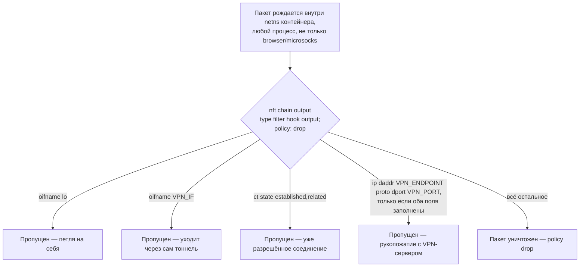

---
covers:
  features: [killswitch]
  paths:
    - home/.chezmoiscripts/run_onchange_after_39-killswitch.sh.tmpl
---

# Kill-switch: блокировка утечки мимо VPN

[isolation.md](isolation.md) объяснил общую картину: у рабочего контекста
(`digi3`, `stellium`, `personal`) есть своя сеть, и если у неё сверху ещё
настроен VPN, вся эта сеть, по идее, должна идти только через него. Но что,
если VPN обрывается — клиент упал, сервер недоступен, интерфейс исчез?
Без дополнительной защиты трафик контейнера просто пойдёт напрямую, в обход
VPN, и покажет тому, кто на другом конце, настоящий адрес. Этот документ — про
механизм, который этого не допускает: он живёт на самом выходе из сети
контейнера, уже после [моста wsproxy и microsocks](isolation-network.md), и
рвёт всё, что пытается выйти в обход VPN.

## Что это даёт

Возьмём контейнер, у которого включена эта фича и настроен VPN. С этого
момента в нём действует одно жёсткое правило: **исходящему пакету запрещено
выходить, если он не подходит ни под одно из трёх исключений.** Исключения:

1. Пакет идёт сам на себя (loopback, [`127.0.0.1`](glossary.md#127001)) —
   разным программам внутри контейнера всё ещё можно говорить друг с другом.
2. Пакет уходит через интерфейс самого VPN-туннеля — это и есть трафик,
   защищённый VPN, ради которого всё затевалось.
3. Пакет — это рукопожатие с самим VPN-сервером: тому нужно достучаться
   снаружи тоннеля, чтобы тоннель вообще смог подняться.

Всё остальное — умирает молча, без ответа. Не «идёт напрямую, раз VPN не
работает», а именно умирает. Разница принципиальна: раньше, при схеме с тремя
отдельными браузерами, это было даром — у каждой работы был физически свой
браузер и, если что-то в её тоннеле отваливалось, взять и просто отправить
трафик через чужую сеть было неоткуда, там её попросту не было рядом. В
нынешней схеме один общий netns со своими маршрутами существует всегда, VPN —
это надстройка над ним, и без отдельного правила у сети всегда есть путь в
обход надстройки. Kill-switch и есть то самое правило: запрос, ушедший не в
тот прокси или в разгар упавшего VPN, должен погибнуть, а не тихо уйти по
запасному пути и засветить адрес.

Фича не включена нигде по умолчанию. Включать её нужно вручную и только в том
контейнере, который реально получает VPN — почему так, разобрано в разделе
«Как это работает» ниже.

## Как это работает

Правило живёт в firewall-подсистеме ядра, [nftables](https://wiki.nftables.org/),
внутри собственного netns контейнера (какой это netns и почему он свой —
[isolation.md](isolation.md), раздел «Что изолировано надёжно»). У nftables
есть таблицы (`table`), у таблицы — цепочки (`chain`), у цепочки — политика по
умолчанию и список правил-исключений. Для egress-фильтра нужна цепочка типа
`filter`, подвешенная на точку `output` (пакет только что родился внутри этого
netns и ещё не покинул его) — это и есть та единственная точка, где можно
поймать вообще всё, что контейнер пытается отправить куда угодно, каким угодно
процессом внутри него, а не только браузерным трафиком через microsocks.



### Почему фича выключена по умолчанию

В каталоге фич (`home/.chezmoidata.yaml`, блок `key: killswitch`) у записи
`scope: container` и нет поля `default`. Общий смысл этих двух полей — как
`chezmoi init --prompt` строит список того, что спросить, и что в этом списке
отмечено галочкой заранее — устройство одно на весь репозиторий и
документируется в how-it-works.md; здесь важно практическое следствие:
галочку killswitch предлагают выбрать только когда `chezmoi init --prompt`
запущен *внутри* контейнера (`{{- if or (eq .scope "both") (eq .scope $env) }}`,
`home/.chezmoi.toml.tmpl`), и она по умолчанию снята — оператор должен
осознанно включить её именно в том контейнере, который получает VPN.

Комментарий над блоком в `.chezmoidata.yaml` называет причину прямо: «off by
default and deliberately so: with no tunnel to allow, a default-drop output
chain takes the whole network with it». Прочитанный ровно так, буквально, этот
довод предполагает, что default-drop цепочка ставится, как только фича
включена. Код же устроен так, что это не совсем так — есть ещё два
независимых внутренних барьера ниже, — но проверить, что барьеры действительно
защищают именно от этого, стоило по факту, а не поверить комментарию на слово.

Живая проверка на этой машине (2026-07-31), контейнер `digi3` — единственный,
где фича вообще выбрана:

```sh
$ distrobox enter digi3 -- sh -c 'test -f /etc/killswitch.conf && echo present; systemctl is-enabled killswitch.service'
present
disabled
$ distrobox enter digi3 -- systemctl status killswitch.service
○ killswitch.service - Drop container egress that bypasses the VPN
     Loaded: loaded (/etc/systemd/system/killswitch.service; disabled; preset: disabled)
     Active: inactive (dead)
```

Конфиг создан (фича включена), юнит существует, но **не активен и не
включён** — конкретно на этой машине VPN в `digi3` не настроен, конфиг так и
остался пустым шаблоном (ниже), а два внутренних барьера ниже не дали дойти до
`nft` вообще. Значит буквальная формулировка кодового комментария
(«default-drop chain takes the whole network with it») описывает не то, что
происходит именно с этим кодом на пустом конфиге сегодня — код от этого как
раз защищён, — а общий класс опасности, ради которого решили не делать фичу
`default: true`: если бы кто-то в будущем убрал один из барьеров ниже как
«лишний», выключенная по умолчанию фича осталась бы последним слоем защиты,
не позволяющим этой опасности реализоваться сразу на всех контейнерах разом.

### Защита от пустого конфига

Первый барьер — в самом сгенерированном `/usr/local/bin/killswitch-apply`,
первым делом после чтения конфига:

```sh
. /etc/killswitch.conf

if [ -z "${VPN_IF:-}" ]; then
    echo "killswitch: VPN_IF is empty in /etc/killswitch.conf, refusing to drop traffic" >&2
    exit 1
fi
```

Это выполняется **до** любого обращения к `nft`. Если `VPN_IF` пуст, скрипт
печатает сообщение в `stderr` и завершается кодом `1`, не вызвав `nft` ни
разу — ни одно правило ядра не тронуто. Смысл именно в порядке: будь этот
запуск обычным `killswitch.service` (`Type=oneshot`), systemd просто пометит
юнит как `failed` и не тронет сеть контейнера — это ровно то состояние
`disabled`/`inactive (dead)`, которое видно в проверке выше.

Второй, более ранний барьер — уже в самом
`run_onchange_after_39-killswitch.sh.tmpl`, после того как он (пере)написал
`killswitch-apply` и юнит:

```sh
if grep -q '^VPN_IF=.\+' "$CONF"; then
    sudo systemctl enable --now killswitch.service
else
    echo "==> /etc/killswitch.conf has no VPN_IF yet; killswitch.service left disabled."
fi
```

Юнит включается автоматически только если в конфиге уже стоит непустой
`VPN_IF` — то есть только если кто-то заполнил его вручную ещё до этого
`chezmoi apply`. На пустом, только что созданном шаблоне юнит остаётся
`disabled`, и включать его — отдельное осознанное действие, о котором сам же
шаблон конфига и напоминает своим первым комментарием (см. ниже). Живая
проверка того же самого шаблона на этой машине (`sudo -n cat`, только
чтение, `nft` не вызывался):

```sh
$ distrobox enter digi3 -- sudo -n cat /etc/killswitch.conf
# Managed by chezmoi -- fill these in, then:
#   sudo systemctl enable --now killswitch.service
#
# VPN_IF        tunnel interface, e.g. wg0 / tun0 (ip -br link)
# VPN_ENDPOINT  server address the client dials, IPv4
# VPN_PROTO     udp or tcp
# VPN_PORT      server port
VPN_IF=
VPN_ENDPOINT=
VPN_PROTO=udp
VPN_PORT=
```

Оба барьера вместе отвечают на вопрос брифинга буквально: kill-switch,
сработавший на пустом конфиге, — это просто отключение интернета (петля
никуда не годится, а больше исключений в default-drop цепочке нет), и именно
поэтому код в двух независимых местах отказывается сработать, а не «срабатывает,
но аккуратно» — разницы между «аккуратным полным отключением» и «случайно
забытым сервисом, который никогда не запускался» для человека, потерявшего
сеть, нет никакой, поэтому проще не запускать вовсе.

### Права на файл конфигурации

`/etc/killswitch.conf` создаётся так:

```sh
sudo tee "$CONF" >/dev/null <<'CONF_TEMPLATE'
...
CONF_TEMPLATE
sudo chmod 600 "$CONF"
```

Живая проверка на `digi3`:

```sh
$ distrobox enter digi3 -- stat -c '%a %U:%G' /etc/killswitch.conf
600 root:root
$ distrobox enter digi3 -- cat /etc/killswitch.conf
cat: /etc/killswitch.conf: Permission denied
```

`600` и владелец `root:root` — даже обычный пользователь контейнера (тот же
`stsiapan`, которому `keep-id` отображает UID `1000` в UID `1000`, см.
[isolation-network.md](isolation-network.md), раздел «Почему юниты работают от
пользователя, а не от root») не может прочитать файл без `sudo`. Причина не в
том, что там секрет в криптографическом смысле — там просто адрес и порт
VPN-сервера работодателя, а это свойство инфраструктуры работодателя, не самих
dotfiles (комментарий в скрипте так прямо и говорит: «the interface and
endpoint are properties of the employer's VPN, not of the dotfiles»). `600`
здесь — обычная гигиена для конфига системной службы, которая правится только
руками администратора контейнера и читается только `root`-процессом
`killswitch-apply`, а не что-то, от чего специально что-то прячут внутри
самого контейнера. Файл создаётся `chmod 600` только один раз, в момент
первого появления (`if [[ ! -f "$CONF" ]]`) — если кто-то потом руками
ослабит права, повторный `chezmoi apply` их не восстановит, потому что ветка
создания уже не выполнится для существующего файла.

### Границы: один IPv4-адрес, и почему остальное не в счёт

`VPN_ENDPOINT` в комментарии самого шаблона конфига описан однозначно: «server
address the client dials, **IPv4**». Дыра для рукопожатия строится так:

```sh
endpoint_rule=""
if [ -n "${VPN_ENDPOINT:-}" ] && [ -n "${VPN_PORT:-}" ]; then
    endpoint_rule="    ip daddr ${VPN_ENDPOINT} ${VPN_PROTO:-udp} dport ${VPN_PORT} accept"
fi
```

`ip daddr` — это выражение nft именно для IPv4-адреса назначения (у IPv6 своё,
`ip6 daddr`), и вся таблица объявлена как `table inet killswitch`: `inet` —
служебное семейство nftables, которое как раз для того и существует, чтобы
одной цепочкой накрыть сразу и IPv4-, и IPv6-трафик (`man nft`, раздел
`TABLES`: «The inet address family is a dummy family which is used to create
hybrid IPv4/IPv6 tables»). Из этого прямо следует то, что было в старых
текстах: политика `drop` в такой цепочке действует одинаково что для IPv4-, что
для IPv6-пакета — исключений на IPv6 в правилах нет вообще (кроме `oifname` и
`ct state`, которые от версии протокола не зависят), значит любой IPv6-пакет,
кроме петли, туннеля и уже установленного соединения, топится тем же `drop`,
что и IPv4.

Дальше — то, что старые тексты (`docs/features.md`) сводили к одной фразе «все
три случая падают закрыто», и что при более внимательном чтении кода и
документации самого nft оказывается не одной историей, а тремя разными:

- **Несколько адресов** (например, случайно вписали `1.2.3.4 5.6.7.8` через
  пробел). Скрипт не проверяет содержимое `VPN_ENDPOINT` вообще — переменная
  подставляется в текст правила как есть. Результат — `ip daddr 1.2.3.4
  5.6.7.8 udp dport ... accept`: два адреса подряд без запятой и без
  фигурных скобок `nft` не разбирает, правило не проходит проверку синтаксиса.
- **IPv6-адрес.** `ip daddr` типизирован как `ipv4_addr` (`man nft`, раздел
  «IPV4 ADDRESS TYPE»), а `2001:db8::1` под эту грамматику не подходит —
  тоже отказ на этапе разбора.
- **Имя вместо адреса.** Тут ровно наоборот тому, что предполагали старые
  тексты: `man nft`, тот же раздел «IPV4 ADDRESS TYPE», прямо говорит — «A host
  name will be resolved using the standard system resolver». То есть `ip
  daddr` **умеет** принимать имя и сам его резолвит в момент применения
  правил. Если имя резолвится, правило встанет как обычно — просто по адресу,
  который в этот момент вернул DNS, а не по буквальному имени; если имя
  резолвится в несколько адресов, дыра для рукопожатия расширится на все они
  разом. Отказ будет, только если резолвинг не удался (например, DNS
  недоступен). Значит для имени «падает закрыто» — не гарантия, а частный
  случай (не смог резолвить), и он же может обернуться неожиданно **более
  широкой** дырой, а не более узкой, если имя резолвится не в один адрес.

Во всех трёх случаях, если разбор всё же провалился, важно, что происходит с
самой политикой `drop`: сборка таблицы — это `delete table inet killswitch`
сразу за которым полное новое определение `table inet killswitch { chain
output { ...} }`, и всё это подаётся `nft -f -` одним вызовом. Разбор ошибки
(некорректный тип адреса, нерезолвящееся имя, лишний токен) происходит в
`nft` целиком на стороне клиента, до всякого обращения к ядру — значит либо
весь блок применяется, либо не применяется вообще ничего, частичного
состояния не бывает. Отсюда два разных исхода в зависимости от того, что было
*до* неудачного запуска:

- **Если до этого уже стояла рабочая таблица** (VPN был настроен правильно, а
  потом кто-то испортил `VPN_ENDPOINT` опечаткой) — старая таблица со старой
  политикой `drop` остаётся как есть, ничего не открывается. Здесь «падает
  закрыто» подтверждается.
- **Если это самый первый запуск** на свежем контейнере, и уже в первом
  заполнении `VPN_ENDPOINT` ошибка — таблицы `inet killswitch` не появится
  вовсе, цепочка `output` с политикой `drop` никогда не будет зарегистрирована,
  и сеть контейнера останется точно такой же незащищённой, какой была до
  включения фичи. Это и есть расхождение со старым текстом: «падает закрыто»
  здесь неверно буквально — падает **в прежнее состояние**, которое на первом
  запуске означает открытую сеть, а не отсутствие связи.

Это рассуждение проверено по документации `nft(8)` (стоит локально,
`nftables v1.1.6`) и по устройству самого скрипта, а не воспроизведено
живым запуском: `nft` — даже в режиме `-c` (`--check`, «только проверить
правила, не применяя») — на этой машине и внутри `digi3` требует привилегий
уровня root даже для чтения (`netlink: Error: cache initialization failed:
Operation not permitted`; `nft list table inet killswitch` внутри `digi3` без
`sudo` — та же ошибка). Поднимать привилегии, чтобы прогнать `nft` хоть в
каком виде, в этом задании запрещено отдельно, поэтому дальше этого разбора
по коду и `man nft` проверка не пошла.

Отдельно от всех троих: **OpenZiti в эту форму не укладывается вообще** —
комментарий в скрипте это отмечает прямо («OpenZiti does not fit this shape
at all and stays without a kill-switch»), и в самом скрипте для него нет ни
одной ветки. Контейнер с Ziti (фича `ziti`, `docs/features.md`) kill-switch не
поддерживает никак, а не «поддерживает частично».

## Что ставится и что меняется

| Категория | Путь | Где | Когда создаётся/меняется |
|---|---|---|---|
| Конфиг (шаблон) | `/etc/killswitch.conf`, права `600`, владелец `root:root` | Контейнер | Один раз, если файла ещё нет; дальше правится вручную |
| Скрипт применения | `/usr/local/bin/killswitch-apply`, права `755` | Контейнер | Перезаписывается при каждом `chezmoi apply`, пока фича включена |
| Юнит systemd | `/etc/systemd/system/killswitch.service` | Контейнер | Перезаписывается при каждом `chezmoi apply`; включается автоматически, только если конфиг уже заполнен |
| Таблица nftables | `table inet killswitch` — объект ядра, не файл | netns контейнера | Создаётся/пересобирается при каждом успешном старте или перезапуске `killswitch.service`; удаляется при `stop` (`ExecStop=/usr/bin/nft delete table inet killswitch`) |
| Пакет | `nftables` | Контейнер | Не заявлен этой фичей — уже часть `container-base` ([containers.md](containers.md)), ничего не делает без включённого killswitch |

## Как проверить

Часть команд ниже реально выполнена на этой машине 2026-07-31: ни в одном из
поднятых контейнеров (`digi3`, `stellium`, `personal`) сейчас нет настроенного
VPN, фича выбрана только в `digi3`, и там она осталась в исходном, пустом
состоянии — живьём проверить сработавшую блокировку не на чем. Эти команды
помечены отдельно; то, что требует настоящего VPN, помечено как непроверенное
и выверено только по коду.

**Проверено вживую (2026-07-31, `digi3`):**

```sh
$ distrobox enter digi3 -- sh -c 'test -f /etc/killswitch.conf && echo present; systemctl is-enabled killswitch.service'
present
disabled
$ distrobox enter digi3 -- stat -c '%a %U:%G' /etc/killswitch.conf
600 root:root
$ distrobox enter digi3 -- systemctl status killswitch.service
○ killswitch.service - Drop container egress that bypasses the VPN
     Loaded: loaded (/etc/systemd/system/killswitch.service; disabled; preset: disabled)
     Active: inactive (dead)
```

Это подтверждает состояние «фича включена, конфиг пуст, служба безопасно
осталась выключенной» — то есть оба барьера из раздела «Защита от пустого
конфига» действительно работают на живом контейнере, а не только в теории.

**Не проверено вживую (нет контейнера с настоящим VPN), но проверено по коду
и синтаксису:**

Когда `VPN_IF`/`VPN_ENDPOINT`/`VPN_PORT` заполнены и служба включена:

```sh
distrobox enter <контекст> -- sudo systemctl status killswitch.service
```
Ожидается `Active: active (exited)` — юнит `Type=oneshot` с
`RemainAfterExit=yes` показывает именно это состояние после успешного
`ExecStart`, а не «running» (процесс `killswitch-apply` к этому моменту уже
завершился).

```sh
distrobox enter <контекст> -- sudo nft list table inet killswitch
```
Ожидаемая форма вывода (собрана из шаблона правил в скрипте, не снята с живой
системы):
```
table inet killswitch {
    chain output {
        type filter hook output priority filter; policy drop;
        oifname "lo" accept
        oifname "wg0" accept
        ct state established,related accept
        ip daddr 203.0.113.10 udp dport 51820 accept
    }
}
```

Проверка, что чужой адрес действительно гибнет, а не открывается напрямую (обе
команды нужно гонять при поднятом VPN — иначе первая же завалит и рукопожатие):
```sh
distrobox enter <контекст> -- curl -s --max-time 3 -o /dev/null -w '%{http_code}\n' https://ifconfig.me
```
Ожидается таймаут (пустой вывод, ненулевой код завершения curl) — пакет к
случайному адресу вне тоннеля не подходит ни под одну из трёх дыр и топится
`policy drop` ещё на выходе, до всякого ответа.

```sh
distrobox enter <контекст> -- curl -s --max-time 5 <адрес, доступный только через сам VPN>
```
Ожидается нормальный ответ — трафик внутрь тоннеля (`oifname VPN_IF`) разрешён.

## Когда сломалось

| Симптом | Причина | Что делать |
|---|---|---|
| Контейнер полностью потерял сеть после включения killswitch, включая сам VPN | `VPN_ENDPOINT`/`VPN_PORT` не заполнены (или заполнены неверно): у рукопожатия с сервером нет дыры, новые пакеты к нему топит та же `policy drop`, тоннель никогда не поднимается | Заполнить `VPN_ENDPOINT`, `VPN_PORT`, `VPN_PROTO` в `/etc/killswitch.conf`, затем `sudo systemctl restart killswitch.service` |
| `killswitch.service` остался `disabled`/`inactive`, хотя конфиг заполнен | Скрипт пишет шаблон конфига один раз (`if [[ ! -f "$CONF" ]]`) и включает юнит по факту содержимого конфига только в момент своего собственного выполнения; правка конфига руками `run_onchange` не перезапускает — это `run_onchange`, он реагирует на изменение текста самого скрипта, а не на файл в `/etc` | Включить руками, как и написано в первой строке самого шаблона конфига: `sudo systemctl enable --now killswitch.service` |
| Сменили интерфейс VPN (переустановили клиент, `wg0` → `wg1`), а killswitch режет всё, включая сам VPN | В `/etc/killswitch.conf` всё ещё старое имя интерфейса, такого интерфейса больше нет — `oifname "${VPN_IF}" accept` не матчит ничего, а других дыр не осталось | Поправить `VPN_IF` в конфиге, `sudo systemctl restart killswitch.service` (юнит уже `enabled`, `restart` пересобирает таблицу заново) |
| Правка `VPN_ENDPOINT` не подействовала, `nft list table inet killswitch` показывает старый адрес | `nft -f -` — одна атомарная транзакция: если новое значение не прошло разбор (см. «Границы» выше — лишний адрес, IPv6-литерал, нерезолвящееся имя), применяется не «частично новое», а ничего, старая таблица остаётся как была | `sudo systemctl status killswitch.service` — если `ExecStart` последний раз завершился с ошибкой, `journalctl -u killswitch.service` покажет причину; поправить конфиг и `restart` заново |
| Нужно временно снять блокировку (например, чтобы обновить VPN-клиент) | Не поломка — предусмотренный путь | `sudo systemctl stop killswitch.service` — `ExecStop=/usr/bin/nft delete table inet killswitch` полностью снимает таблицу и возвращает сеть контейнера к обычному (без-drop) поведению ядра; `start` или `restart` пересобирает её заново |

## Почему именно так

**Один вызов `nft -f -` на весь набор правил, а не несколько отдельных
команд.** Три строки подряд — `table inet killswitch` (создать, если ещё
нет), `delete table inet killswitch` (снести дочиста), затем полное новое
определение таблицы — гарантируют, что скрипт можно гонять повторно на уже
существующей таблице (старые правила не накапливаются поверх новых), и делают
это одной транзакцией: сеть контейнера не проходит через промежуточное
состояние «дыры удалены, новых ещё нет» между двумя отдельными вызовами `nft`.

**Почему нет ветки `default: true` даже как «плюс отдельная будущая
проверка».** Разобрано выше в разделе «Почему фича выключена по умолчанию»:
код и без этого флага дважды отказывается резать сеть на пустом конфиге, но
опция всё равно не выставлена по умолчанию — как дополнительный, независимый
от кода барьер: если бы один из двух внутренних барьеров в будущем сломали
рефакторингом, «фича не включена почти нигде» осталась бы последней линией
защиты.

**Почему граница «падает закрыто» не буквальна для всех трёх нарушений.**
Разобрано в «Границах» выше. Вывод для документации: старая формулировка
`docs/features.md` («все три случая падают закрыто... table inet покрывает и
v4, и v6») верна ровно в одной части — политика `drop` действительно
одинаково душит и IPv4-, и IPv6-трафик, семейство `inet` для того и
существует. Но она смешивает это с другим утверждением — что *ошибка в
значении* `VPN_ENDPOINT` обязательно оставляет сеть закрытой, — а это зависит
от того, была ли до этой ошибки уже рабочая таблица. На первом применении с
плохим значением сеть остаётся открытой, потому что таблица с политикой
`drop` попросту не создаётся. Это расхождение отражено выше и не
воспроизведено живым прогоном `nft` (см. там же, почему).

## Ссылки

- [isolation.md](isolation.md) — общая картина цепочки и модель угроз;
  раздел «Что не изолировано» о том, что без VPN все контексты и так выходят с
  одного адреса хоста.
- [isolation-network.md](isolation-network.md) — мост wsproxy/microsocks,
  чей выход как раз и накрывает killswitch.
- [containers.md](containers.md) — пакет `nftables` в `container-base`,
  `scope: container` у фич.
- [glossary.md](glossary.md) — [`127.0.0.1`](glossary.md#127001).
- `man nft` (локально, `nftables v1.1.6`) — разделы `TABLES` (семейство
  `inet` как гибрид IPv4/IPv6) и `IPV4 ADDRESS TYPE` (тип `ipv4_addr` у `ip
  daddr`, резолвинг имени через системный резолвер).
- `home/.chezmoidata.yaml`, блок `key: killswitch` — комментарий с
  формулировкой, откуда взята фраза «restores a guarantee the old
  three-browser layout had for free».
