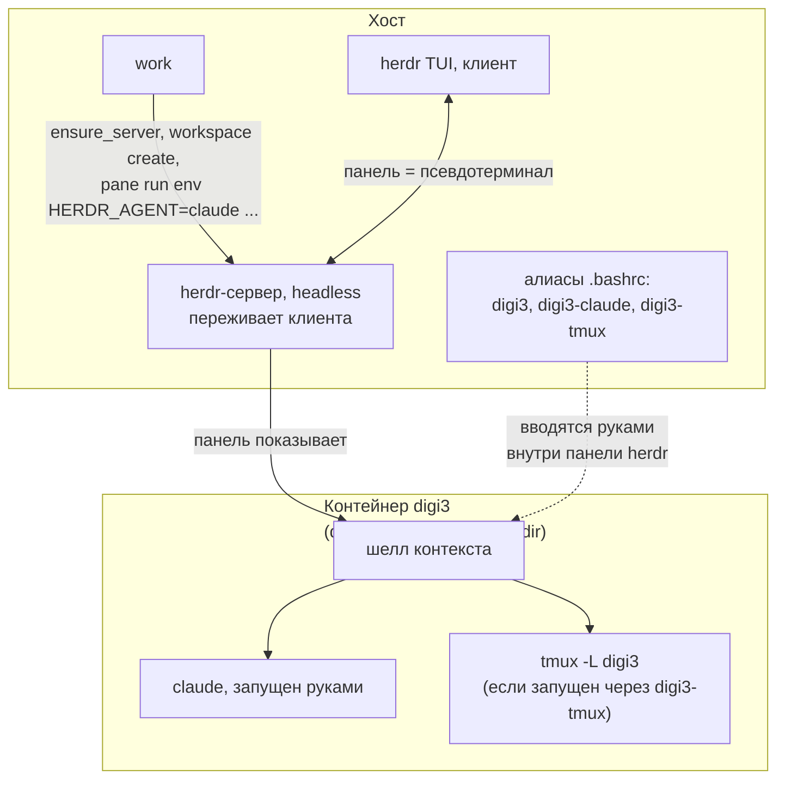
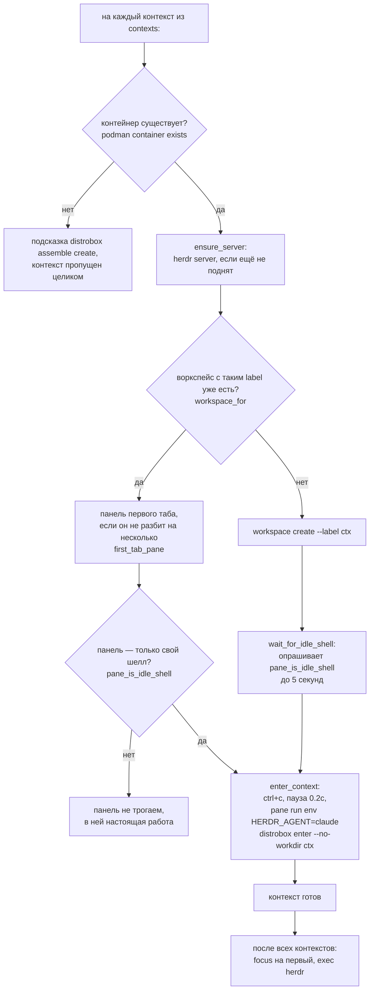

---
covers:
  features: [herdr, tmux]
  paths:
    - home/dot_local/bin/executable_work.tmpl
    - home/dot_tmux.conf
    - home/dot_bashrc.tmpl
---

# Мультиплексор: herdr, tmux и команда `work`

## Что это даёт

Мультиплексор — программа, которая держит несколько отдельных сессий терминала
внутри одной и не закрывает их, когда закрывается терминал. Свернул окно —
сессия работает. Закрыл терминал целиком — она всё равно работает. Вернулся
через час — она на месте, с той же историей на экране, потому что настоящий
процесс всё это время выполнялся не в твоём терминале, а на отдельном
headless-сервере, который переживает клиента.

В этом репозитории мультиплексора два, и это не накладка, а разделение труда:

- **herdr** живёт на хосте (на настоящей машине) и умеет больше, чем обычный
  мультиплексор: он понимает, что в конкретной панели сидит не просто шелл, а
  кодовый агент вроде Claude Code (что это такое и что ещё раскладывается на
  машину для работы с ним — [agents.md](agents.md)), и показывает в боковой
  панели, чем агент занят прямо сейчас — работает, ждёт разрешения или
  закончил.
- **tmux** живёт внутри контейнера рабочего контекста ([контейнер
  distrobox](glossary.md#контейнер-distrobox), рабочие контексты разобраны в
  [isolation.md](isolation.md)) и ничего не знает про агентов — обычный
  мультиплексор без сюрпризов, запасной путь на случай, если herdr подведёт.

Команда `work` одним запуском открывает herdr и даёт каждой работе (`digi3`,
`stellium`, `personal`) отдельную панель, уже внутри своего контейнера, готовую
печатать. Повторный запуск ничего не портит и не открывает лишнего — команда
сама разбирается, что уже сделано.

## Как это работает



herdr и tmux не соединены между собой напрямую: herdr держит панель, которая
физически является псевдотерминалом хоста с запущенным в нём `distrobox enter`;
всё, что происходит глубже — `claude`, `tmux`, обычная работа руками — это уже
содержимое той панели, а не что-то, что герdr отдельно знает.

### `work`: пошагово



**Почему это вообще скрипт, а не восстановление сессии самого herdr.** herdr
умеет восстанавливать раскладку после перезапуска — панели, табы, имена
воркспейсов возвращаются (`~/.config/herdr/session.json`,
`executable_work.tmpl:7-10`). Но команда, которую панель выполняла, в этот файл
не попадает: восстановленная панель — это голый шелл хоста, и `distrobox enter
--no-workdir digi3` пришлось бы набирать заново каждое утро в каждую панель
руками. Список контекстов сам скрипт не хранит отдельно: он рендерится в
скрипт из `contexts:` в `home/.chezmoidata.yaml` при `chezmoi apply`
(`executable_work.tmpl:12-18`, `contexts=({{ range .contexts }}...)`) — том же
списке, что порождает и алиасы, и мосты wsproxy, и Firefox-контейнеры. Второй
список на диске означал бы второе место, где он может разойтись с первым.

**Почему повторный запуск безопасен.** Каждый контекст ищется по имени
воркспейса (`workspace_for`, `herdr workspace list | jq ...`), а не создаётся
заново, и панель получает команду только тогда, когда в ней нет ничего, кроме
собственного шелла — предикат разобран ниже. Панель с редактором, сборкой или
уже выполненным входом в контейнер остаётся как есть.

### Предикат пустой панели

`pane_is_idle_shell` (`executable_work.tmpl`, функция `pane_is_idle_shell`)
задаёт правило нарочно позитивно — «в панели нет ничего, кроме её собственного
шелла», а не «в панели нет podman или distrobox». Отрицательный вариант
оставил бы снаружи весь остальной мир: панель с `vim`, `less`, `ssh` или
сборкой получила бы чужую команду поверх себя.

Проверка идёт по `herdr pane process-info` и смотрит сразу на три вещи:

1. **Ровно один процесс переднего плана.** `($p.foreground_processes | length)
   == 1`.
2. **Его pid совпадает с pid оболочки, которую herdr запомнил при создании
   панели**, `.pid == $p.shell_pid`. Само по себе это не отличает живой bash от
   `exec vim`: `exec` подменяет процесс в том же pid, herdr этот pid не
   обновляет, и `vim`, запущенный через `exec`, читался бы как идле-шелл. От
   этого и следующий пункт.
3. **Имя процесса — известный шелл**: `bash`, `sh`, `zsh`, `fish` или `dash`.
   Только настоящий шелл-промпт достаточно безопасен, чтобы в него что-то
   печатать.

Функция же служит и проверкой готовности свежесозданной панели: сразу после
`workspace create` панель ещё показывает два процесса переднего плана и
устаканивается до одного примерно за 0.12 секунды — одиночная проверка гонялась
бы с этим окном, поэтому есть `wait_for_idle_shell`, повторяющая проверку до 50
раз по 0.1с.

У предиката остаётся одна дыра, которую он в принципе не может закрыть:
набранная, но не отправленная command line читается как один процесс переднего
плана, тот же pid, то же имя — неотличима от настоящего пустого приглашения.
Эта дыра закрывается не здесь, а в `enter_context`, следующим пунктом.

### Почему `enter_context` шлёт `ctrl+c` перед своей командой

Набранная и не отправленная строка выглядит как пустое приглашение для
предиката выше — значит рано или поздно `work` попробует дописать свою команду
поверх чужой. Без явного сброса это склеивает две команды в одну. Замер из
`docs/issues/2026-07-30-herdr-agent-detection-in-containers.md` воспроизводит
это не абстрактно, а конкретной строкой: набранный и не отправленный `echo
DANGEROUS-PARTIAL`, дополненный сверху вызовом `pane run` с `echo
SAFE-MARKER`, приходит в шелл одной командой,
`echo DANGEROUS-PARTIALecho SAFE-MARKER`. Поэтому `enter_context` первым делом
шлёт `ctrl+c` (`herdr pane send-keys "$pane" ctrl+c`), ждёт 0.2 секунды, чтобы
шелл успел перерисовать приглашение, и только потом печатает команду входа.
Пропавшая набранная строка — единственное, чем `work` жертвует ради этого.

### Три алиаса на контекст

Внутри уже открытой панели (не важно, панель herdr это или обычный терминал)
контекст открывается тремя способами, все генерируются из `contexts:` в
`dot_bashrc.tmpl`:

```sh
digi3         # HERDR_AGENT=claude distrobox enter --no-workdir digi3
digi3-claude  # HERDR_AGENT=claude distrobox enter --no-workdir digi3 -- claude
digi3-tmux    # distrobox enter --no-workdir digi3 -- tmux -L digi3 new-session -A -s work
```

Двойники условны: `-claude` рендерится, только пока тикнута фича `herdr`
(`{{- if $herdr }}` вокруг алиаса), `-tmux` — только пока тикнута `tmux`
(`{{- if $tmux }}`). У самого голого имени (`digi3`) метка `HERDR_AGENT=claude`
тоже условна — той же проверкой `{{ if $herdr }}` внутри одной строки — без
herdr метку ставить не для кого. Важная тонкость: метку несёт уже голый алиас,
а не только `-claude`-двойник — значит вход в контейнер обычным `digi3` и
дальнейший ручной запуск `claude` тоже размечен, и `-claude` просто экономит
одно нажатие, а не единственный маркированный путь.

### `--no-workdir` — не косметика

Без этого флага distrobox тащит рабочий каталог хоста внутрь контейнера через
`/run/host`, и шелл оказывается в сетевом пространстве контейнера, но работает
с файлами хоста — худшее из двух миров. Измерено из `~` (комментарий над
блоком алиасов, `dot_bashrc.tmpl`):

```sh
distrobox enter digi3 -- pwd               # /run/host/home/stsiapan
distrobox enter --no-workdir digi3 -- pwd  # /home/stsiapan/homes/digi3
```

Флаг документирован самим distrobox (`distrobox.it/usage/distrobox-enter/`,
`--no-workdir`/`-nw`: «always start the container from container's home
directory») — то есть поведение без флага не баг, а осознанный выбор
distrobox по умолчанию, но достаточно неожиданный, чтобы промахнуться мимо
него один раз и потом гадать, почему шелл видит домашний каталог хоста.
Запись — [workarounds.md](workarounds.md). Флаг стоит на всех трёх алиасах и в
`work` (`executable_work.tmpl`, функция `enter_context`) без исключений.

### Почему `HERDR_AGENT=claude` стоит на команде входа, а не внутри контейнера

Это главное, что нужно понять про склейку herdr и контейнеров, и измерено
целиком на изолированном тестовом сервере вчера —
`docs/issues/2026-07-30-herdr-agent-detection-in-containers.md`, разделы 1-2.

herdr опознаёт, какой агент сидит в панели, по группе процессов переднего
плана **хостовой** стороны этой панели. Панель herdr — это псевдотерминал
хоста, в котором выполняется `distrobox enter`. Через `distrobox enter` эта
группа процессов на хосте — сам `distrobox` и `podman`, которые запускают
контейнер и передают ему управление; настоящий `claude`, запущенный внутри уже
после входа, сидит на **другом** псевдотерминале, целиком внутри контейнера, и
с хостовой стороны его вообще не видно. Отсюда и измеренный результат: панель с
живым `claude` на экране без метки — `agent explain` отвечает
`agent_not_found`, `agent=None`, хотя экран при этом доезжает до herdr
полностью и корректно.

Значит опознание не может стоять внутри контейнера в принципе, только на
команде, которая запускается на хостовой стороне панели, — то есть на самом
`distrobox enter`. Ровно это и делают алиасы и `enter_context` в `work`:
`HERDR_AGENT=claude` стоит перед `distrobox enter --no-workdir <контекст>`, а
не после входа и не в конфиге claude внутри контейнера.

Экспортировать переменную изнутри контейнера бессмысленно ещё до всякого
запуска claude — измерено: `export HERDR_AGENT=claude` в шелле контейнера даёт
`agent=None`, `unknown`, потому что herdr читает окружение процесса, который
**сам** запустил (`podman`/`distrobox` на хосте), а не окружение произвольного
процесса где-то глубже в дереве, тем более за границей pid namespace
контейнера. Экспортировать её глобально, из `.bashrc` — размечало бы вообще
каждую панель машины, включая хостовые шеллы без всякого контейнера внутри,
поэтому метка стоит именно на команде входа и нигде больше
(`dot_bashrc.tmpl`, комментарий над блоком алиасов).

Наблюдаемый результат этой разметки, тот же протокол измерений (реальный
`claude` в контейнерной панели, вход обычным шеллом, `claude` запущен руками
после входа):

| В панели | Что показывает herdr |
|---|---|
| только шелл контекста, ничего больше | `agent=claude`, `status=idle`, правило не сработало ни одно |
| `claude` в своём приглашении | `agent=claude`, `status=idle`, правило `live_prompt_box`, заголовок `✳ Claude Code` |
| `claude` отвечает на запрос | `status=working`, заголовок `⠐ Claude Code`, затем `idle` или `done` |

Ценность одного слова на входе именно в том, что дальше ничего дополнительно
делать не нужно: экран панели пересекает границу контейнера как обычный поток
байтов терминала, и herdr читает состояние с него живьём, а не с чего-то,
единожды отрепорченного. Цена, и она настоящая: панель, в которой нет ничего,
кроме шелла контекста, или в которой открыт `tmux`, или редактор, — уже
числится в сайдбаре как простаивающий агент `claude`. Никто не заявляет, что
она работает, состояние честное, просто строка появляется раньше самого
агента.

## Что ставится и что меняется

| Категория | Путь | Где | Условие |
|---|---|---|---|
| Пакет | `herdr-bin` (AUR) | Хост и контейнер (`scope: both`) | фича `herdr` |
| Пакет | `tmux` (pacman) | Хост и контейнер (`scope: both`) | фича `tmux` |
| Файл | `~/.local/bin/work` | Только хост | фича `herdr` **и** `.env == "host"` — `.chezmoiignore`, блок про `work`; без любого из двух условий файл не разворачивается вовсе |
| Файл | `~/.tmux.conf` | Хост и контейнер | фича `tmux` — `.chezmoiignore`, `{{ if not (has "tmux" .enabled) }}` |
| Алиасы `<контекст>`, `<контекст>-claude`, `<контекст>-tmux` | внутри `~/.bashrc` | Хост (блок рендерится только при `.env == "host"`) | `<контекст>` — всегда, при наличии записи в `contexts:`; `-claude` при тикнутой `herdr`; `-tmux` при тикнутой `tmux`; метка `HERDR_AGENT=claude` на голом алиасе — тоже при тикнутой `herdr` |
| Не управляется этим репозиторием | `~/.config/herdr/session.json`, `~/.config/herdr/herdr-server.log`, `~/.local/state/herdr/agent-detection/remote/claude.toml` | Хост | herdr создаёт и переписывает их сам; репозиторий конфиг herdr не разворачивает вовсе (дефолты устраивают, включая префикс `ctrl+b`, который отличается от `tmux`-префикса этого репозитория, `C-a`) |

## Как проверить

Мультиплексор:

```sh
herdr --version   # herdr 0.7.5 (или новее)
tmux -V           # tmux <версия>
```

Алиасы на месте и несут правильную метку (проверяется чтением, ничего не
запускает):

```sh
type digi3 digi3-claude digi3-tmux
```
Ожидаемо: `digi3` и `digi3-claude` показывают `HERDR_AGENT=claude` в теле
алиаса, если тикнута фича `herdr`; `digi3-tmux` содержит `-L digi3`.

`--no-workdir` действительно нужен — сравнение рабочего каталога:

```sh
distrobox enter digi3 -- pwd
distrobox enter --no-workdir digi3 -- pwd
```
Первая строка начинается с `/run/host`, вторая — с домашнего каталога
контекста (`~/homes/digi3`). Если совпадают — флаг где-то потерян.

Файл `work` разворачивается только там, где должен:

```sh
ls ~/.local/bin/work           # есть на хосте, только если тикнута herdr
distrobox enter digi3 -- ls ~/.local/bin/work 2>&1   # No such file or directory — и это правильно
```

Сам `work` идемпотентен: второй запуск подряд не должен создавать новых
воркспейсов и не должен трогать панель, в которой уже что-то запущено —
`herdr workspace list` до и после второго запуска должен показать тот же набор
воркспейсов, что и после первого.

## Когда сломалось

| Симптом | Причина | Что делать |
|---|---|---|
| `work: no container '<ctx>'. Create it with: ...` | Контекст есть в `contexts:`, но контейнер ещё не собран | Выполнить подсказанную команду `distrobox assemble create --name <ctx> --file ~/.config/distrobox/distrobox.ini` ([containers.md](containers.md)) |
| `work: not one work context is available, not attaching.` | Ни один контейнер из `contexts:` не существует | Собрать хотя бы один контейнер, затем повторить `work` |
| `work: the herdr server did not come up.` | herdr-сервер не поднялся за 10 секунд | Смотреть `~/.config/herdr/herdr-server.log` |
| `work: lost contact with the herdr server.` | Сервер упал между вызовами, уже после того, как `ensure_server` его нашёл живым | Перезапустить `work`; если повторяется — тот же лог сервера |
| `work: '<ctx>' left alone, its first tab is split into N panes.` | Первый таб контекста уже разбит вручную на несколько панелей | Ничего не делать — это не ошибка, `work` намеренно не трогает панель, где явно наведён свой порядок |
| `work: pane <id> never produced a shell, leaving it empty` | Свежесозданная панель не выдала идле-шелл за 5 секунд | Открыть эту панель в herdr руками и проверить, что в ней происходит |
| Панель с `claude`, запущенным вручную (не через алиас и не через `work`), не в сайдбаре | Хостовая команда входа не несла `HERDR_AGENT=claude` — контейнер вошли не через сгенерированный алиас, а как-то иначе (ручной `distrobox enter`, ssh, systemd) | Входить через один из трёх алиасов или через `work`; вручную поставить метку так же, как это делает алиас |
| Панель закрыта, а `claude` внутри контейнера всё ещё жрёт ресурсы | Закрытие панели убивает только `distrobox enter` на хосте; то, что было внутри, осиротевает | `podman top <ctx> -eo pid,ppid,user,tty,args`, затем `podman exec <ctx> kill <pid>` (интерактивный шелл может не отреагировать на обычный `kill` — тогда `kill -9`) |
| Сайдбар DankMaterialShell не видит ни одной сессии herdr | Панель сессий DMS ищет только бинарники `tmux`/`zellij` (`muxType` в `settings.json`), herdr в её коде не упомянут вовсе | Не полагаться на эту панель для herdr; для tmux она работает штатно |
| `chezmoi apply` прошёл чисто, а `work` и `-claude`/`-tmux` не появились на уже настроенной раньше машине | `herdr`/`tmux` — новые фичи с вопросом (`asked`), а сохранённый `data.enabled` не получает новый ключ сам по себе | Дописать `herdr` и/или `tmux` в `data.enabled` вручную (`~/.config/chezmoi/chezmoi.toml`), затем `chezmoi apply` |

## Почему именно так

**herdr — проект 0.x, поэтому tmux не удалён.** Быстро развивающийся ранний
проект — разумный повод держать проверенный запасной путь рядом, а не
избавляться от него при первой возможности. Отсюда `-tmux`-двойник у каждого
контекста и то, что unticking `tmux` не удаляет пакет — `chezmoi apply` только
ставит и никогда не удаляет уже поставленное; уходит лишь алиас `-tmux`,
рендерящийся условно, и управление `~/.tmux.conf`.

**Отвергнутый путь: пуш состояния через `pane.report_agent`.** Herdr также
умеет принимать состояние агента напрямую по сокету, и все предпосылки для
этого выполняются изнутри контейнера — `distrobox enter` передаёт
`HERDR_SOCKET_PATH`, хостовый сокет виден изнутри контейнера по тому же пути,
бинарь `herdr` в контейнере есть. Путь отвергнут не из-за недоступности, а
измеренно: **отрепорченное состояние забирает власть и морозит сайдбар.**
Отрепорченный `idle` держался в `agent list`, пока экран панели уже показывал
`working` — способа «пометить агента, но отдать состояние экрану» нет:
`pane.release_agent` и `pane.clear_agent_authority` не возвращают контроль
экрану, а снимают агента целиком (`agent=None`). Официальная документация
herdr описывает это как задуманное поведение, не баг: `herdr.dev/docs/agents/`,
раздел «Status Authority» — «For agents with complete lifecycle hooks, the
integration is authoritative when it is installed and actively reporting for
the running pane... It does not also run screen manifest fallback for that
same lifecycle authority». Путь через `HERDR_AGENT` документирован там же,
раздел «VMs and Sandbox Wrappers»: «setting it only inside a VM or container
is not visible to Herdr» — ровно измеренное здесь поведение, только со
стороны официальных доков, а не только замера. Побочно измерено и то, что
отрепорченная панель ломает часть агентского API: `agent prompt` отказывает на
ней с `agent_not_ready`, а на панели, размеченной через `HERDR_AGENT`, тот же
вызов работает. Полный протокол — раздел 3 файла
[issues/2026-07-30-herdr-agent-detection-in-containers.md](issues/2026-07-30-herdr-agent-detection-in-containers.md).

**Ловушки CLI herdr 0.7.5**, если когда-нибудь понадобится скриптовать вызовы
напрямую (раздел 4 того же файла, перепроверено на этой машине сегодня —
`herdr --version` по-прежнему `0.7.5`):

- Строка `Usage:` у `herdr pane report-agent --help` печатает `<PANE_ID>`
  последним (`[OPTIONS] --source <ID> --agent <LABEL> --state <STATUS>
  <PANE_ID>`), а реально работает только вызов с `<PANE_ID>` первым. На сайте
  (`herdr.dev/docs/cli-reference/`) usage уже показан с `<pane_id>` первым —
  встроенный `--help` и сайт разошлись.
- Двоеточие в значении `--source` роняет разбор (`--source herdr:claude` →
  `unknown option`), и `--source=herdr:claude` ломается уже на следующей
  опции.
- Отказ разбора аргументов молчаливый и с кодом `0`, если stdout не терминал —
  команда ничего не отправляет серверу, но код возврата не говорит об этом ни
  словом.
- `herdr pane read` принимает `<PANE_ID>` позиционно, `herdr pane
  process-info` — тот же аргумент, но флагом `--pane`.

Апстрим-поиск (issue-трекер `herdrdev/herdr`, `CHANGELOG.md`) не нашёл
отдельного тикета именно про эти несовпадения — записано как измеренное здесь
поведение, не как зарегистрированный где-то баг.

**Два дефекта без починки.** Оба упираются в одну и ту же границу, о которой
уже честно сказано в [isolation.md](isolation.md), раздел [«Что не
изолировано»](isolation.md#что-не-изолировано): модель угроз этого репозитория
— работодатель, читающий свои журналы, а не враждебный код внутри контейнера,
и сокет мультиплексора никогда не был частью периметра, который держит эту
модель.

- *Закрытая панель не убивает агента внутри контейнера.* Закрытие панели или
  всей space обрывает только `distrobox enter` на хостовой стороне; то, что
  происходило внутри контейнера, продолжает работать осиротевшим, без единой
  панели, которая его показывает. Видно только через `podman top`. Измерено:
  `sleep 600`, запущенный через панель, продолжал числиться в `podman top digi3`
  после закрытия space, и обычный `kill` его снял; интерактивный `bash -l`
  обычный `kill` проигнорировал и потребовал `kill -9`.
- *Контейнер может управлять хостовым herdr через его же сокет.* distrobox
  монтирует весь корень хоста в контейнер как `/run/host`, и API-сокет herdr
  достижим изнутри контейнера обычным путём:
  `env HERDR_SOCKET_PATH=/run/host/home/stsiapan/.config/herdr/herdr.sock herdr
  workspace list` изнутри `digi3` отвечает, и это не только чтение — вызов
  `pane.report_agent` изнутри `personal` на хостовую панель поменял её агента
  с `claude/idle` на `codex/blocked`, а созданная так же изнутри контейнера
  space печатает при `readlink /proc/self/ns/net` хостовый namespace, а не
  свой собственный.

**Панель DankMaterialShell не увидит herdr никогда, и это не баг, а
нереализованная фича.** Исходник (`AvengeMedia/DankMaterialShell`,
`quickshell/Services/MuxService.qml`) определяет доступность мультиплексора
двумя процессами, которые проверяют `command -v tmux` и `command -v zellij`
по коду возврата — herdr там не упомянут вовсе, панель физически не смотрит в его
сторону. Апстрим-поиск тикета с запросом такой поддержки ничего не нашёл —
записано как «upstream не найден, искали 2026-07-31». Запись —
[workarounds.md](workarounds.md).

**Три необёрнутых `jq`-выборки — почищено.** До 30 июля 2026 в `count == 1`
ветке `first_tab_pane` извлечение `pane_id` шло без `|| true`, а полный аудит
файла при закрытии нашёл ещё два места того же класса в ветке создания нового
пространства: `ws=$(... jq -r '.result.workspace.workspace_id // empty')` и
`pane=$(... jq -r '.result.root_pane.pane_id // empty')`. Под
`set -euo pipefail` отказ `jq` в любом из трёх мест (`// empty` спасает только
от `null`, не от невалидного JSON) убил бы весь скрипт, оставив дальнейшие
контексты неоткрытыми и `exec herdr` невыполненным. Проверено по коду сейчас
(`executable_work.tmpl`, функции `first_tab_pane` и ветка `herdr workspace
create`) — во всех трёх местах стоит `|| true` без `2>/dev/null`, то есть
собственное сообщение `jq` об ошибке остаётся на stderr, а не глушится.
Синтетическая проверка обеих версий (до/после, с подставным отказывающим `jq`)
— в [issues/2026-07-29-work-unguarded-jq.md](issues/2026-07-29-work-unguarded-jq.md),
которая закрыта 30 июля 2026.

**Необъяснённая странность, не влияющая на выбранное решение.** Одна панель в
контейнерном режиме в какой-то момент перестала принимать
`pane.report_agent` полностью — сервер отвечал `{"type":"ok"}`, а `agent`
оставался `None` при любой комбинации параметров вызова. Причина не найдена, на
свежих панелях та же последовательность вызовов работает всегда. Раз выбранное
решение вообще не использует репорты, на него это не влияет — записано в
разделе 5 файла
[issues/2026-07-30-herdr-agent-detection-in-containers.md](issues/2026-07-30-herdr-agent-detection-in-containers.md),
чтобы не расследовать заново, если случится ещё раз.

## Ссылки

- [isolation.md](isolation.md) — рабочие контексты и модель угроз, на которую
  опираются оба нерешённых дефекта выше.
- [containers.md](containers.md) — из чего собран контейнер, куда входит
  `distrobox enter`.
- [glossary.md](glossary.md) — термины: [контейнер
  distrobox](glossary.md#контейнер-distrobox).
- [workarounds.md](workarounds.md) — реестр обходов, включая все перечисленные
  здесь.
- [issues/2026-07-30-herdr-agent-detection-in-containers.md](issues/2026-07-30-herdr-agent-detection-in-containers.md)
  — полный протокол измерений опознания агента, сделанный на изолированном
  тестовом сервере 2026-07-30.
- [issues/2026-07-29-work-unguarded-jq.md](issues/2026-07-29-work-unguarded-jq.md)
  — необёрнутые `jq`-выборки в `first_tab_pane`; закрыт 30 июля 2026, обход
  снят в коде.
- `herdr.dev/docs/agents/` — официальная документация herdr: разметка агента
  через переменную окружения на команде-обёртке, авторитет hook-репортов над
  скринингом экрана.
- `herdr.dev/docs/cli-reference/` — CLI-референс herdr, версия на сайте
  (сверено с встроенным `--help` версии 0.7.5, установленной на этой машине).
- `github.com/herdrdev/herdr` — репозиторий herdr, issue-трекер и
  `CHANGELOG.md`.
- `distrobox.it/usage/distrobox-enter/` — документация флага `--no-workdir`.
- `github.com/89luca89/distrobox` — исходник distrobox.
- `github.com/AvengeMedia/DankMaterialShell`, файл
  `quickshell/Services/MuxService.qml` — определение доступного мультиплексора
  по бинарнику.
