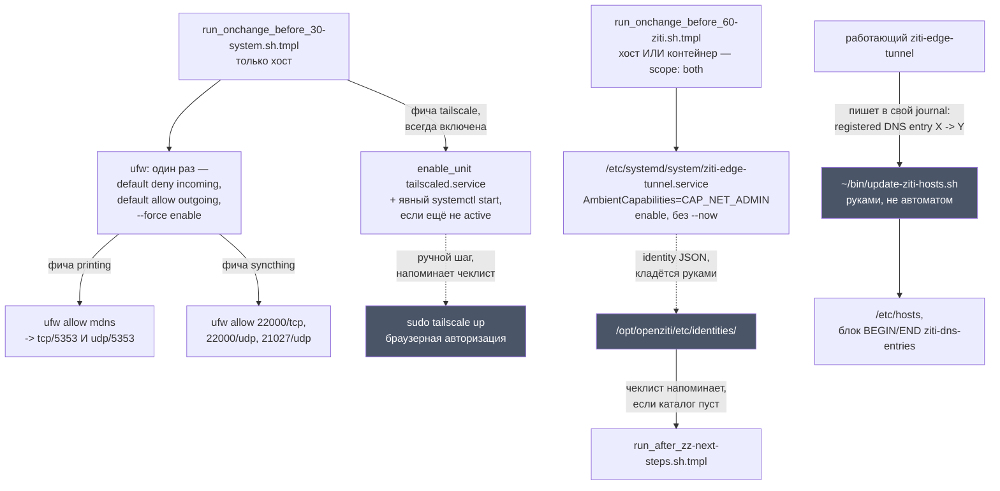

---
covers:
  features: [tailscale, ziti]
  paths:
    - home/.chezmoiscripts/run_onchange_before_60-ziti.sh.tmpl
    - home/bin/executable_update-ziti-hosts.sh.tmpl
    - home/.chezmoiscripts/run_onchange_before_30-system.sh.tmpl
---

# Сеть машины: Tailscale, Ziti и файрвол

## Что это даёт

Свои машины видят друг друга напрямую, даже когда они не в одной домашней
сети: десктоп достаёт до ноутбука и до телефона по одному и тому же адресу,
где бы каждый из них физически ни находился. Это делает
[Tailscale](https://tailscale.com/) — он ставится и включается всегда, без
вопроса в анкете, и требует только один ручной шаг: один раз авторизоваться
в браузере командой `tailscale up`.

[OpenZiti](https://openziti.io/) — отдельный, необязательный туннель другого
рода: не «мои машины друг с другом», а доступ к чужой сети с ограниченным
периметром (например, к сети работодателя), через файл-удостоверение, который
кладут руками. Включается по желанию — и на хосте, и внутри отдельного
рабочего контекста, если туннель нужен только там.

Файрвол защищает машину так: снаружи по умолчанию не достучаться ни до чего,
а изнутри — можно выйти куда угодно. Когда включается фича, которой для
работы нужно, чтобы кто-то мог постучаться к машине первым (принтер в сети,
Syncthing), для неё точечно открывается ровно то, что нужно, — и не больше.

Все три темы этого документа собирает один и тот же скрипт-надзиратель,
`home/.chezmoiscripts/run_onchange_before_30-system.sh.tmpl` — но не он один:
тот же файл первым делом настраивает раскладку клавиатуры
([keyboard.md](keyboard.md)) и сжатый своп в памяти, zram
([hardware.md](hardware.md)). Файрвол — только последняя треть этого скрипта.
OpenZiti настраивает второй, отдельный скрипт, `60-ziti`.

Файрвол внутри distrobox-контейнеров — другая, самостоятельная тема: там сеть
режет не ufw, а [killswitch.md](killswitch.md), и режет не входящее, а
исходящее, когда падает VPN контейнера.

## Как это работает



### Tailscale: безусловно, потому что иначе машина недостижима

В `home/.chezmoidata.yaml`, блок `key: tailscale`, стоит `scope: host` и
`always: true` — этой фичи нет в анкете `chezmoi init --prompt`, галочку не
снять. Комментарий над блоком объясняет причину буквально: это способ, которым
машины пользователя видят друг друга (десктоп, ноутбук, телефон), поэтому
машина без него недостижима.

`30-system` в ветке `{{- if has "tailscale" .enabled }}` делает не одно
действие, а два подряд:

```sh
enable_unit tailscaled.service
if ! systemctl is-active --quiet tailscaled.service; then
    sudo systemctl start tailscaled.service
fi
```

`enable_unit` (см. ниже) только включает юнит — как и все остальные юниты в
этом же скрипте (`sddm`, `NetworkManager`, `bluetooth`, сам `ufw`), которые
специально не получают `--now`, потому что незачем перезапускать что-то
живое посреди сессии, всё равно доедет до следующей перезагрузки. У
`tailscaled` ровно наоборот: следующий шаг чеклиста, ручной `tailscale up`, не
может авторизоваться без уже работающего демона. Комментарий в скрипте
объясняет: «enable AND start — `tailscale up` in the next-steps checklist
needs a running daemon, and a reboot in between would lose the reader». Живая
проверка на этой машине (2026-07-31, только чтение):

```sh
$ systemctl is-enabled tailscaled.service
enabled
$ systemctl is-active tailscaled.service
active
```

Ручной шаг — `sudo tailscale up` с авторизацией в браузере. Чеклист
`run_after_zz-next-steps.sh.tmpl` печатает напоминание, пока не подключено:

```sh
if command -v tailscale &>/dev/null && ! tailscale status &>/dev/null; then
    steps+=("Tailscale: not connected -- 'sudo tailscale up' (browser auth)")
fi
```

Проверено вживую 2026-07-31: `tailscale status` на этой машине отвечает и
видит несколько машин пользователя как online и offline (сам вывод — реальные
имена машин и адрес учётной записи, поэтому дословно в документ не идёт).

Контейнеры distrobox своего Tailscale не заводят — фича `scope: host`, второй
галочки для контекста нет. Как именно трафик вкладки внутри контекста доходит
до реального интернета (а значит и до чужих Tailscale-адресов) через мост
хоста — тема [isolation-network.md](isolation-network.md), здесь не
повторяется.

### OpenZiti: отдельный тоннель, необязательный и не только для хоста

В отличие от Tailscale, у `ziti` (`home/.chezmoidata.yaml`, блок `key: ziti`)
стоит `scope: both` и нет `always` — фичу выбирают руками, и выбрать её можно
что на хосте, что внутри отдельного рабочего контекста (`chezmoi init
--prompt` там же). Пакет ставит общий скрипт `20-packages` (AUR:
`ziti-edge-tunnel`); `60-ziti` не трогает пакеты вовсе — комментарий в начале
скрипта говорит это прямо: «Only the systemd unit and the identity directory
live here, since neither can be expressed in the feature catalogue». Скрипт не
проверяет `.env`, поэтому один и тот же текст выполняется и на хосте, и внутри
контейнера — какое из двух окружений сейчас выполняет скрипт, определяет
только то, включена ли фича `ziti` именно в этом окружении.

Скрипт делает три вещи по порядку:

```sh
sudo mkdir -p /opt/openziti/etc/identities
```
и пишет юнит:
```
[Service]
Type=simple
Environment="ZITI_IDENTITY_DIR=/opt/openziti/etc/identities"
AmbientCapabilities=CAP_NET_ADMIN
ExecStart=/usr/bin/ziti-edge-tunnel run --verbose=${ZITI_VERBOSE} --identity-dir=${ZITI_IDENTITY_DIR}
```
и включает его (`sudo systemctl enable ziti-edge-tunnel`) — тоже без `--now`:
без файла удостоверения демону всё равно нечем поднять туннель, поэтому
`ExecStart` до появления identity просто немедленно завершался бы с ошибкой на
каждой попытке `Restart=always`. Файл удостоверения (JSON) кладётся в
`/opt/openziti/etc/identities/` руками — скрипт этого не делает и содержимого
каталога не проверяет, только его наличие где-то ещё, в чеклисте. Прямо
об этом говорит комментарий в самом `60-ziti`: «The identity reminder lives in
run_after_zz-next-steps.sh», и там действительно:

```sh
if [[ -z "$(ls -A /opt/openziti/etc/identities 2>/dev/null)" ]]; then
    steps+=("OpenZiti: no identity -- 'sudo cp <your-identity>.json /opt/openziti/etc/identities/ && sudo systemctl start ziti-edge-tunnel' (the JSON comes from whoever runs your Ziti network; docs/network.md)")
fi
```

Проверено вживую 2026-07-31: на этой машине `ziti` нигде не выбрана (ни на
хосте, ни в `digi3`/`stellium`/`personal`), поэтому единственный безопасный
способ увидеть, что скрипт вообще делает, — прогнать шаблон, не применяя его:

```sh
$ chezmoi execute-template < home/.chezmoiscripts/run_onchange_before_60-ziti.sh.tmpl
#!/bin/bash
exit 0
```

Это подтверждает саму заглушку (`{{- if not (has "ziti" .enabled) }} exit 0`),
но не построчную логику дальше — та проверена только чтением кода, юнита с
таким именем на этой машине не существует.

### `~/bin/update-ziti-hosts.sh` — ручной инструмент, не автозадача

`home/bin/executable_update-ziti-hosts.sh.tmpl` — тоже шаблон
([`run_onchange`](glossary.md#run_onchange) здесь ни при чём, это не скрипт
apply, а обычный файл в `~/bin`, отсюда и префикс `executable_` в имени, а не
`run_`). Всё тело обёрнуто в `{{ if has "ziti" .enabled }}` — на машине без
`ziti` файл раскладывается пустым:

```sh
$ chezmoi execute-template < home/bin/executable_update-ziti-hosts.sh.tmpl
$ echo $?
0
```
(пустой вывод — проверено вживую 2026-07-31).

Ни один скрипт этого репозитория не вызывает `update-ziti-hosts.sh`
автоматически — поиск по всему дереву `home/` не находит ни одной ссылки на
него, кроме самого файла. Это инструмент, который запускают руками, когда
нужно.

Что он делает: `ziti-edge-tunnel`, работая, регистрирует внутренние DNS-имена
чужой сети и пишет об этом в свой собственный журнал строками вида
`registered DNS entry <имя> -> <адрес>`. Скрипт вычитывает такие строки за
последние 7 дней (`journalctl -u ziti-edge-tunnel --since "7 days ago"`),
сортирует и складывает в `/etc/hosts` одним размеченным блоком между
`# BEGIN ziti-dns-entries` и `# END ziti-dns-entries`, целиком заменяя
предыдущий блок при повторном запуске. Без `sudo` скрипт ничего не пишет —
только печатает, что бы записал (`if [[ $EUID -ne 0 ]]; then ... echo "Run
with sudo to apply." ...`), поэтому прогнать его безопасно и без полномочий,
просто чтобы посмотреть.

### Файрвол: закрыто снаружи, открыто изнутри, дальше — по фиче

Часть скрипта `30-system` после сервисов настраивает `ufw`
([Uncomplicated Firewall](https://wiki.archlinux.org/title/Uncomplicated_Firewall)).
Условие входа в весь скрипт — только хост (`{{- if ne .env "host" }} exit
0 {{- else }}` в самой первой строке, см. [keyboard.md](keyboard.md)): внутри
distrobox-контейнера файрвол хоста ни при чём, у контейнера своя сеть, и его
собственную защиту от утечки описывает [killswitch.md](killswitch.md).

Включение — одноразовое и идемпотентное:

```sh
if ! sudo ufw status | grep -q 'Status: active'; then
    sudo ufw default deny incoming
    sudo ufw default allow outgoing
    sudo ufw --force enable
fi
```

Проверка `Status: active` — не для порядка: `ufw enable` (а тем более
`--force enable`) переспрашивает пароль `sudo`, и без проверки состояния
`chezmoi apply` просился бы на него на каждом прогоне, даже когда файрвол уже
включён. Тот же приём, что и у проверки раскладки в этом же скрипте
([keyboard.md](keyboard.md), «Поверхность 2»).

С этого момента снаружи не достучаться ни до чего, а изнутри — можно выйти
куда угодно (`allow outgoing`). Дальше идут точечные разрешения, каждое —
только если фича включена, и каждое — только если правила ещё нет:

```sh
{{- if has "printing" .enabled }}
if ! sudo ufw status | grep -q '5353.*ALLOW'; then
    sudo ufw allow mdns
fi
{{- end }}
{{- if has "syncthing" .enabled }}
for rule in 22000/tcp 22000/udp 21027/udp; do
    if ! sudo ufw status | grep -q "^${rule%%/*}.*${rule##*/}.*ALLOW"; then
        sudo ufw allow "$rule"
    fi
done
{{- end }}
```

`printing` и `syncthing` — не фичи этого документа (первую документирует
[hardware.md](hardware.md), вторую — [sync.md](sync.md)), но обе точечные
дыры живут в файле, который покрывает именно этот документ, поэтому разобраны
здесь.

**`ufw allow mdns` открывает больше, чем говорит комментарий рядом.**
Комментарий над блоком печати называет только `udp/5353` («Network printers
announce themselves over mDNS, which is INCOMING udp/5353»), но `mdns` —
не отдельный профиль приложения ufw (в `/etc/ufw/applications.d/` записи
`mdns` нет, проверено на этой машине 2026-07-31: `grep -rn -i mdns
/etc/ufw/applications.d/` — пусто), а обычное имя порта из `/etc/services`:

```sh
$ grep -w mdns /etc/services
mdns             5353/tcp
mdns             5353/udp
```

Оба протокола перечислены под одним именем, и `ufw allow mdns` открывает
входящими сразу оба — живая проверка на этой машине (2026-07-31, файлы читаны
напрямую, без интерактивного `sudo`, недоступного в этой сессии):

```sh
$ grep 5353 /etc/ufw/user.rules
### tuple ### allow any 5353 0.0.0.0/0 any 0.0.0.0/0 in
-A ufw-user-input -p tcp --dport 5353 -j ACCEPT
-A ufw-user-input -p udp --dport 5353 -j ACCEPT
```

mDNS как протокол определён только для UDP; входящий tcp/5353 не используется
ничем, что ставит этот репозиторий, — он просто открыт вхолостую, поскольку
за именем `mdns` в `/etc/services` стоят обе записи разом. Это не дыра в
привычном смысле: без слушателя на tcp/5353 соединение туда получает отказ на
уровне ядра, а не доходит до какой-либо программы. Но это ровно тот случай,
когда комментарий в коде и код рядом с ним говорят разное — комментарий не
менялся, само поведение не считается отдельной проблемой этого документа.

**Точечные правила не привязаны к интерфейсу.** Комментарий у блока Syncthing
объясняет почему: `allow in on tailscale0` читался бы аккуратнее, но ломался
бы тихо — имя интерфейса не гарантировано, а домашняя сеть меняется. Разбор,
почему открытый порт Syncthing при этом не превращается в открытую дверь —
ниже.

**Что происходит с правилом, если фичу потом выключить: ничего.** Ни в блоке
`printing`, ни в блоке `syncthing`, ни где-либо ещё в этом скрипте нет ни
одного вызова `ufw delete`. Выключить `syncthing` в анкете — значит, что при
следующем прогоне [`run_onchange`](glossary.md#run_onchange) увидит другой
текст скрипта (ветка `{{- if has "syncthing" .enabled }}` просто исчезнет из
рендера) и перезапустится, но исчезнувшая ветка — это код, который перестал
*проверяться*, а не код, который что-то *снимает*. Уже открытые
`22000/tcp`, `22000/udp`, `21027/udp` (или `mdns`) остаются в `ufw` навсегда,
пока кто-то не снимет их руками (`sudo ufw delete allow ...`). Разница
принципиальна для честности этого документа: «фича выключена» и «порт закрыт»
— два разных факта, и код гарантирует только первый.

## Что ставится и что меняется

| Что | Где | Когда создаётся или меняется |
|---|---|---|
| Пакет `tailscale` | хост, pacman | всегда (`always: true`, `scope: host`) |
| Юнит `tailscaled.service` | хост | `30-system`: `enable` + явный `start`, если не `active`, при каждом прогоне |
| `sudo tailscale up` | хост | руками; напоминает `run_after_zz-next-steps.sh.tmpl`, пока `tailscale status` не отвечает |
| Пакет AUR `ziti-edge-tunnel` | хост или контейнер, где выбрана `ziti` | ставит общий скрипт `20-packages` |
| `/opt/openziti/etc/identities/` | там же | `60-ziti`: `mkdir -p`, пустой каталог |
| `/etc/systemd/system/ziti-edge-tunnel.service` | там же | `60-ziti`: пишется и `enable` (без `--now`) при каждом прогоне, пока фича включена; перекрывает собой одноимённый юнит из `/usr/lib/systemd/system/`, который ставит сам AUR-пакет (в `/etc` побеждает) |
| Файл удостоверения (JSON) | `/opt/openziti/etc/identities/`, там же | руками; чеклист напоминает, пока каталог пуст |
| `~/bin/update-ziti-hosts.sh` | хост или контейнер, где выбрана `ziti` | шаблон chezmoi раскладывает файл при каждом apply; тело пустое, если `ziti` не выбрана; запускается только руками |
| `/etc/hosts`, блок `BEGIN/END ziti-dns-entries` | там же | только когда `update-ziti-hosts.sh` запущен руками с `sudo` |
| Пакет и служба `ufw` | хост | ставит `host-base` ([base.md](base.md) про остальной `host-base`); `30-system` включает `ufw.service` |
| Политика ufw по умолчанию | хост | `deny incoming`, `allow outgoing`, `--force enable` — один раз, пока `ufw status` не показывает `Status: active` |
| Правило ufw `mdns` (tcp+udp/5353) | хост | добавляется, если выбрана `printing`, и правила ещё нет; не снимается при выключении фичи |
| Правила ufw `22000/tcp`, `22000/udp`, `21027/udp` | хост | добавляются, если выбрана `syncthing`, и правила ещё нет; не снимаются при выключении фичи |

## Как проверить

Все команды ниже читают состояние, ничего не меняют.

Tailscale (проверено вживую 2026-07-31):
```sh
$ systemctl is-enabled tailscaled.service
enabled
$ systemctl is-active tailscaled.service
active
$ tailscale status
```
Последняя команда печатает список машин пользователя с адресами вида
`100.x.y.z` и статусом (`-` — на связи, `offline, last seen ...` — нет);
дословный вывод в документ не идёт, там реальные имена машин.

OpenZiti — шаблон, а не живой юнит на этой машине (`ziti` здесь не выбрана):
```sh
$ chezmoi execute-template < home/.chezmoiscripts/run_onchange_before_60-ziti.sh.tmpl
#!/bin/bash
exit 0
$ chezmoi execute-template < home/bin/executable_update-ziti-hosts.sh.tmpl
$
```
Оба вывода сняты вживую 2026-07-31 и подтверждают только заглушку для машины
без этой фичи. Там, где `ziti` включена:
```sh
distrobox enter <контекст, если not host> -- systemctl is-enabled ziti-edge-tunnel.service
```
Ожидается `enabled`; `systemctl status ziti-edge-tunnel.service` до появления
файла удостоверения покажет `activating (auto-restart)` или частые перезапуски
— это ожидаемо, см. «Когда сломалось».

ufw — состояние этой машины на 2026-07-31, собранное чтением файлов напрямую
(`sudo ufw status verbose` в этой сессии недоступен: нужен интерактивный
пароль, которого здесь нет; обычным путём эту же команду и стоит запускать):
```sh
$ grep -E 'ENABLED|IPV6' /etc/default/ufw /etc/ufw/ufw.conf
ufw.conf:ENABLED=yes
/etc/default/ufw:IPV6=yes
$ grep -E '^DEFAULT_(INPUT|OUTPUT)_POLICY' /etc/default/ufw
DEFAULT_INPUT_POLICY="DROP"
DEFAULT_OUTPUT_POLICY="ACCEPT"
$ grep -A1 'tuple' /etc/ufw/user.rules
### tuple ### allow any 5353 0.0.0.0/0 any 0.0.0.0/0 in
-A ufw-user-input -p tcp --dport 5353 -j ACCEPT
...
### tuple ### allow udp 21027 0.0.0.0/0 any 0.0.0.0/0 in
-A ufw-user-input -p udp --dport 21027 -j ACCEPT
```
Это те же сведения, что даёт `sudo ufw status verbose`, но в другом виде:
команда собирает из этих же файлов человекочитаемую пронумерованную таблицу,
а здесь видны сырые строки правил, из которых она её собирает. Порты и
политики по умолчанию совпадают; отличается только оформление.

Какая ветка `30-system` вообще сработала на этой машине (только рендер
шаблона, ничего не применяет):
```sh
$ chezmoi execute-template < home/.chezmoiscripts/run_onchange_before_30-system.sh.tmpl | grep -c 'Syncthing needs'
1
```
Единица означает, что фича `syncthing` на этой машине включена и ветка со
портами реально попала в рендер — соответствует и `ufw allow` записям выше, и
[sync.md](sync.md).

## Когда сломалось

| Симптом | Причина | Что делать |
|---|---|---|
| `tailscale status` отвечает ошибкой или зависает | `tailscaled.service` не запущен | `systemctl is-active tailscaled.service`; если не `active` — `chezmoi apply` ещё не прогонялся с этой фичой, или юнит упал: `journalctl -u tailscaled` |
| Свои же машины не видно в `tailscale status` | Не сделан ручной шаг авторизации | `sudo tailscale up`, откроется браузер |
| `ziti-edge-tunnel.service` в частых перезапусках (`Restart=always`, `RestartSec=3`) | В `/opt/openziti/etc/identities/` нет файла удостоверения — демону нечем поднять туннель | Положить JSON от провайдера Ziti-сети в этот каталог, `sudo systemctl restart ziti-edge-tunnel` |
| Сетевой принтер не появляется в списке | Отсутствует правило `mdns` — либо фича `printing` ещё не была включена в момент рендера этого куска `30-system` (`run_onchange`, задним числом не сработает), либо принтер сетевой, а не USB, для которого mDNS не нужен | `sudo ufw status \| grep 5353`; если пусто — заново пройти этот блок шаблона или добавить правило руками |
| Syncthing показывает устройства, но статус вечно `Disconnected` | Входящие порты `22000/tcp`, `22000/udp`, `21027/udp` закрыты хотя бы на одной из машин | Разобрано в [sync.md](sync.md#когда-сломалось) |
| После выключения `syncthing`/`printing` в анкете порт всё ещё открыт в `ufw` | Ожидаемо, не баг: скрипт умеет только добавлять правило, снимать — нет (см. «Как это работает» выше) | Снять руками: `sudo ufw delete allow 22000/tcp` и так же для остальных |
| `chezmoi apply` виснет на `30-system`, спрашивая пароль на каждом прогоне | Обычно означает, что `ufw` ещё не активен и проверка `Status: active` не срабатывает, поэтому блок enable выполняется заново | `sudo ufw status` — если `Status: inactive`, что-то выключило файрвол руками между прогонами; включить обратно или найти, кто выключил |

## Почему именно так

### Почему `tailscaled` не просто включается, а сразу стартует

Разобрано выше в основном тексте: единственный юнит в этом скрипте, который
получает явный `systemctl start` в дополнение к `enable`, — это `tailscaled`,
и причина — прямая зависимость по данным: следующий шаг чеклиста, ручной
`tailscale up`, физически не может дозвониться до демона, которого ещё нет в
памяти. У всех соседних юнитов (`sddm`, `NetworkManager`, `bluetooth`,
`ufw.service`, `cups.socket`, `docker.socket`) такой немедленной зависимости
нет — они смирно ждут следующей перезагрузки или собственной сокет-активации.

### Почему точечные правила ufw добавляются, а не описываются декларативно

Каждое `if ! sudo ufw status | grep -q ...` — это чтение состояния перед
записью, тот же приём, что и у самого включения файрвола и у проверки
раскладки в этом же скрипте. Без него `ufw allow` не сломался бы (сам `ufw`
идемпотентен на дублирующихся правилах), но каждый `sudo` внутри цикла
спрашивал бы пароль заново на каждом `chezmoi apply`, даже когда правило уже
стоит годами.

### Почему открытый порт Syncthing — не открытая дверь

Порт слушает, но не пускает кого попало. У Syncthing TLS обязателен на каждом
соединении между устройствами, и после рукопожатия проверяется отпечаток
сертификата другой стороны против собственного списка известных устройств —
официальная документация проекта описывает это прямо: «To prevent uninvited
devices from joining a cluster, the certificate fingerprint of each device is
compared to a preset list of acceptable devices at connection establishment»
([docs.syncthing.net, Security](https://docs.syncthing.net/users/security.html)).
Устройство, чей сертификат не значится в списке этой машины, отклоняется на
этапе рукопожатия, до всякого запроса файла; сама документация отдельно
уточняет, что даже дошедший до уровня файлов запрос проверяется по локальному
и глобальному индексу и не может достать произвольный путь. Порт `22000`
без ограничения по адресу здесь означает «сюда может постучаться кто угодно
из интернета», а не «кто угодно может что-то получить» — второе решает
отдельно устроенный протокол поверх порта, а не сам факт, что порт открыт.
Что именно синхронизируется этими портами — тема [sync.md](sync.md).

### Почему `AmbientCapabilities=CAP_NET_ADMIN` у ziti остаётся, хотя юнит и так root

Собственный юнит AUR-пакета `ziti-edge-tunnel` (проверено чтением исходного
`PKGBUILD` и `ziti-edge-tunnel.service` пакета, `aur.archlinux.org`,
2026-07-31) запускает демона не от root, а от отдельного системного
пользователя `ziti` (`User=ziti`, заведённого через `sysusers.d`), и именно
для такого — непривилегированного — процесса `AmbientCapabilities=CAP_NET_ADMIN`
имеет смысл: без неё пользователь `ziti` не смог бы поднимать
tun-интерфейс и маршруты. Юнит, который пишет `60-ziti` в этом репозитории,
той же строкой копирует `AmbientCapabilities=CAP_NET_ADMIN`, но убирает
`User=`/`Group=` и `ExecStartPre=ziti-edge-tunnel-enroll` (шаг регистрации
через polkit) — то есть заменяет собой юнит пакета и запускает демона от root.
Смысл в man-странице `systemd.exec` подтверждает это отдельно: «Ambient
capability sets are useful if you want to execute a process as a
non-privileged user but still want to give it some capabilities» — для
процесса, у которого и так UID 0, эта строка ничего не решает: у root
все возможности ядра есть и без неё. Строка не вредит и не требует правки —
она просто унаследована из upstream-шаблона вместе с остальным юнитом и не
имеет эффекта в том виде, в котором используется здесь. Вручную запускать
`ziti-edge-tunnel-enroll` тоже не нужно: идентичность в этом репозитории
кладут в `/opt/openziti/etc/identities/` уже готовым файлом, а не собирают
через полкит-диалог.

## Ссылки

- [Tailscale, документация](https://tailscale.com/kb/) — `tailscale up`,
  устройство сети между машинами пользователя.
- [OpenZiti](https://openziti.io/) — общая идея zero-trust оверлея, частью
  которого является `ziti-edge-tunnel`.
- [`aur.archlinux.org/packages/ziti-edge-tunnel`](https://aur.archlinux.org/packages/ziti-edge-tunnel) —
  исходный `PKGBUILD` и юнит пакета: `User=ziti`, `sysusers.d`,
  `ExecStartPre=ziti-edge-tunnel-enroll`, с которыми сверен собственный юнит
  `60-ziti`.
- [`man systemd.exec`](https://www.freedesktop.org/software/systemd/man/latest/systemd.exec.html) —
  раздел `AmbientCapabilities=`: для кого эта настройка вообще имеет эффект.
- [Uncomplicated Firewall, ArchWiki](https://wiki.archlinux.org/title/Uncomplicated_Firewall) —
  синтаксис `ufw`, профили приложений, `/etc/services`.
- [Syncthing, Security](https://docs.syncthing.net/users/security.html) —
  проверка сертификата устройства при каждом соединении.
- [glossary.md](glossary.md) — [`run_onchange`](glossary.md#run_onchange).
- [keyboard.md](keyboard.md) — раскладка, первая треть того же скрипта
  `30-system`, и приём с проверкой состояния перед `sudo`.
- [hardware.md](hardware.md) — zram, вторая треть того же скрипта.
- [base.md](base.md) — фича `host-base` целиком, включая пакет `ufw`.
- [sync.md](sync.md) — сама синхронизация Syncthing и полный разбор портов
  со стороны демона.
- [isolation-network.md](isolation-network.md) — как трафик вкладки внутри
  distrobox-контекста доходит до реальной сети хоста (а значит и до
  Tailscale/Ziti), не будучи темой этого документа.
- [killswitch.md](killswitch.md) — файрвол другого рода: исходящий, внутри
  netns контейнера, а не входящий на хосте.
