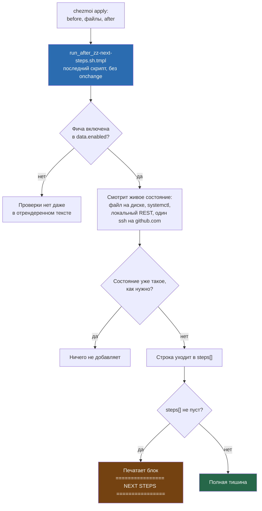

---
covers:
  features: []
  paths:
    - home/.chezmoiscripts/run_after_zz-next-steps.sh.tmpl
---

# Эксплуатация: ручные шаги и диагностика

Двадцать три документа этой волны разобрали устройство репозитория по частям.
Этот — последний, и он не про ещё один механизм, а про то, что делать с
машиной уже после того, как `chezmoi apply` отработал: что доделать руками,
что вообще меняется за пределами домашней папки без явного упоминания в
чеклисте, куда смотреть по конкретному симптому и какими командами chezmoi
проверить себя. Ссылается он на все остальные документы, а не пересказывает
их — детали причины и лечения живут в том документе, который владеет
конкретным механизмом.

## Что это даёт

`chezmoi apply` не может сделать всё сам: часть шагов требует живого человека
за браузером (войти в GitHub, авторизовать Tailscale), часть — пароля,
который нигде не хранится (Bitwarden), часть — файла, который взять неоткуда,
кроме как у провайдера (identity для Ziti). После каждого прогона `apply`
репозиторий сам печатает список того, что из этого ещё не сделано — не
один раз при установке, а на каждом прогоне, пока пункт не закрыт. Это
раздел «Ручные шаги после установки» ниже: буквально построчный разбор того,
что печатает этот чеклист и что с этим делать.

Отдельно — то, что установка меняет вне `~`: файлы в `/etc`, `/usr/local`,
`/opt`, правила firewall, членство в группах, включённые сервисы. Это то, что
не видно, если смотреть только на конфиги в домашней папке, и с чем придётся
столкнуться, если машину придётся администрировать не через chezmoi (например
через полгода, когда половина решений уже забыта).

И, наконец, если что-то в системе ведёт себя не так — раздел «Диагностика»
ниже устроен как указатель по симптому: что похоже на твою ситуацию и в каком
документе искать причину и лечение.

## Как это работает

Механизм чеклиста — один файл,
`home/.chezmoiscripts/run_after_zz-next-steps.sh.tmpl`. Имя без `onchange`
означает: тело скрипта выполняется на **каждом** `chezmoi apply`, безусловно,
а не только когда меняется текст самого скрипта
([run_onchange](glossary.md#run_onchange), разбор обоих видов скриптов —
[how-it-works.md](how-it-works.md), раздел «Два вида скриптов»). Комментарий в
самом файле объясняет зачем прямым текстом: «it inspects live state: an
interactive login cannot happen inside a chezmoi run, so list whichever are
still missing. Prints nothing once everything is authenticated».



Гейт по фиче срабатывает на этапе шаблона (`{{ if has "claude" .enabled }}`),
то есть отключённая фича не оставляет после себя даже мёртвой проверки в
отрендеренном тексте — тот же приём «уровня 1», что и в остальных скриптах
репозитория ([how-it-works.md](how-it-works.md), «Защитные приёмы»). Единственная
проверка без гейта по фиче — SSH-ключ GitHub, и единственный сетевой запрос во
всём файле — тоже она: `ssh -T ... git@github.com` с таймаутом 4 секунды.
Комментарий над ней предупреждает о плате за это: офлайн эта строка появится
в списке ложно, и это не повод для тревоги — она пропадёт сама на следующем
прогоне, когда сеть будет.

### Ручные шаги после установки

Ниже — построчный разбор того, что содержит скрипт, в порядке появления в
файле. Столбец «Сообщение и что сделать» — то, что дословно печатает
`zz-next-steps` (английский язык, ровно та пунктуация, что в скрипте —
двойной дефис `--` как разделитель, одинарные кавычки вокруг команд), с
единственной поправкой: переменные вида `$ext`, `$st_name` заменены на то,
что они означают.

**Проверки без привязки к окружению** (выполняются что на хосте, что в
контейнере, если фича включена):

| Фича | Проверяет | Сообщение и что сделать |
|---|---|---|
| — (всегда) | `ssh -T git@github.com` отвечает «successfully authenticated» | «GitHub SSH: key not registered -- 'cat ~/.ssh/id_ed25519.pub', paste at https://github.com/settings/keys» |
| `claude` | `~/.claude/.credentials.json` существует | «Claude Code: not logged in -- run 'claude', pick 'Log in' (browser opens claude.ai; /login if you skipped it)» |
| `codex` | `~/.codex/auth.json` существует | «Codex: not logged in -- 'codex login' (browser OAuth via chatgpt.com) or 'codex login --api-key <key>'» |
| `gh` | `gh auth status` завершается успешно | «GitHub CLI: not logged in -- 'gh auth login' (device code at https://github.com/login/device)» |
| `azure` | `az account show` завершается успешно | «Azure CLI: no active session -- 'az login'» |
| `ziti` | `/opt/openziti/etc/identities/` не пуст | «OpenZiti: no identity -- copy the JSON to /opt/openziti/etc/identities/ and 'sudo systemctl start ziti-edge-tunnel'» |
| `voice` | Закреплённый файл модели (`whisper-large-v3-Q8_0.gguf` в снапшоте `handy-computer/whisper-large-v3-gguf` кеша HuggingFace) на месте | «Handy: the pinned model is missing -- run 'handy' and download Whisper Large v3 under Settings -> Model» ([voice.md](voice.md)) |
| `voice` | `~/.local/share/com.pais.handy/settings_store.json` существует | «Handy: never started, so its settings are unconfigured -- run 'handy', then 'chezmoi apply' again» |
| `bitwarden` | `~/.config/rbw/config.json` не пуст (если `rbw` установлен) | «Bitwarden: account at https://vault.bitwarden.com (register if new), then 'rbw config set email <email>' and 'rbw login'» |
| `bitwarden` | `~/.config/bws/access-token` не пуст (если `bws` установлен) | «Bitwarden agents: create a Secrets Manager machine account at https://vault.bitwarden.com -> Secrets Manager -> Machine accounts, put its token in ~/.config/bws/access-token (chmod 600)» |
| `tailscale` | `tailscale status` завершается успешно | «Tailscale: not connected -- 'sudo tailscale up' (browser auth)» |
| `docker` | Текущий пользователь состоит в группе `docker` | «Docker: you are not in the docker group yet -- log out and back in to use it without sudo» |

**Только на хосте** (`.env == "host"`; в контейнере блок целиком отсутствует
в отрендеренном тексте):

| Фича | Проверяет | Сообщение и что сделать |
|---|---|---|
| `zen` | Каталог профиля Zen (`~/.zen` или `~/.config/zen`) вообще существует | «Zen: never launched -- run 'zen-browser' once, then 'chezmoi apply' to write user.js» |
| `zen` | В профиле есть `user.js` | «Zen: prefs not applied -- run 'chezmoi apply' with Zen closed» |
| `zen` | Все три расширения на месте: `@testpilot-containers`, `{f069aec0-43c5-4bbf-b6b4-df95c4326b98}`, `context-proxy@dotfiles.local` | По одной строке на каждое отсутствующее: «Zen: extension $ext is missing -- check about:policies, install from addons.mozilla.org if the policy did not take» ([isolation-browser.md](isolation-browser.md)) |
| `zen` | `/usr/local/lib/zen-context-proxy.xpi` существует | «Zen: the context proxy extension was never built -- run 'chezmoi apply'» |
| `zen` | Обработчик `x-scheme-handler/https` — Junction | Если не Junction, но пакет `junction` есть — скрипт сам, без вопроса, выполняет `xdg-mime default $junction_id x-scheme-handler/http x-scheme-handler/https` (единственная строка во всём файле, которая что-то меняет, а не только читает — см. вступление раздела «Что ставится и что меняется» ниже) и печатает «Link handler reclaimed from the browser: $junction_id»; если пакета `junction` нет — «Links: Junction is not the default https handler and the package is missing» ([isolation-links.md](isolation-links.md)) |
| `syncthing` | Конфиг демона существует (`syncthing paths`) | «Syncthing: no configuration yet -- run 'chezmoi apply' once the service has started» |
| `syncthing` | `syncthing.service` активен | «Syncthing: the user service is not running -- 'systemctl --user enable --now syncthing.service'» |
| `syncthing` | Эта машина есть в `[data.syncthing.devices]` | Полный текст, с готовым фрагментом TOML — сноска (†) под таблицей |
| `syncthing` | Каждое устройство из каталога папок имеет ID в карте | «Syncthing: device '…' is named in the catalogue but has no ID in the map -- run 'chezmoi apply' on it and copy the ID it prints» |
| `syncthing` | Каждая папка, где участвует эта машина, реально настроена в демоне | «Syncthing: folder '…' is not configured -- run 'chezmoi apply'» |
| `syncthing` | Каждое чужое устройство хоть раз было на связи (`lastSeen`) | «Syncthing: device '…' has never been seen -- it has to add this machine's ID too (paired from one side only)» |
| `syncthing` | У каждого устройства в карте есть рабочий `tcp://` адрес без плейсхолдеров | Полный текст — сноска (‡) под таблицей |
| `syncthing` | Входящие `22000/tcp`, `22000/udp`, `21027/udp` открыты в ufw (только если есть root без пароля) | «Syncthing: incoming …/tcp is closed -- 'sudo ufw allow …' (30-system only adds these once, when its own text changes, so a later apply will not put them back)» |
| `syncthing` | Нет файлов `*.sync-conflict-*` в папках, где участвует машина | «Syncthing: conflict file … -- resolve with the kb-curate skill, do not delete blindly» |
| `syncthing` | Путь хранилища `kb` совпадает с тем, что видит `claudefiles` (`~/.config/claudefiles/secrets.json`) | «Syncthing: claudefiles syncs the vault at … but the catalogue syncs … -- make them the same» |
| — (все включённые контексты) | Сокет `~/.local/share/wsproxy/<контекст>/socks.sock` существует, по одному на каждую запись `contexts:` | «Proxy <контекст>: no socket -- start the container ('distrobox enter <контекст> -- true') and check wsproxy-bridge.service inside it» ([isolation-network.md](isolation-network.md)) |

(†) «Syncthing: this machine is not in the device map -- add to
~/.config/chezmoi/chezmoi.toml under [data.syncthing.devices]: thismachine =
{ id = "<ID>", addresses = ["dynamic", "tcp://<name>.<tailnet>.ts.net:22000"] },
then add the same line on every other machine and run 'chezmoi apply' there
too»

(‡) «Syncthing: device '…' has no usable static address -- put
"tcp://<name>.<tailnet>.ts.net:22000" beside "dynamic" in
~/.config/chezmoi/chezmoi.toml with the real tailnet name from 'tailscale
status', or the device is only reachable on the local network»

Полное объяснение причин каждой из строк про Zen — в
[isolation-browser.md](isolation-browser.md), про Syncthing — в
[sync.md](sync.md); здесь только инвентарь того, что именно проверяется и
что напечатает скрипт, если проверка не прошла.

## Что ставится и что меняется

Сам `zz-next-steps` почти целиком читает и ничего не решает сам — но не
целиком: строки 113-115 того же файла, разобранные выше в таблице про Zen,
делают ровно одно исключение — `xdg-mime default $junction_id
x-scheme-handler/http x-scheme-handler/https`, когда обработчик ссылок
рассинхронизировался, а пакет `junction` уже стоит. Это единственная строка
во всём файле, которая что-то меняет, а не только смотрит; она уже учтена в
таблице «Изменения состояния» ниже, в строке про `xdg-mime`.

Остальная меняющая часть эксплуатации — то, что делают **другие** скрипты
волны за пределами `~`. Ниже их двенадцать, плюс сам `zz-next-steps` со
своим единственным исключением — тринадцать `.tmpl`-файлов в сумме, все
перечислены в таблицах ниже по одному разу как минимум. Сводка собрана по
коду `home/.chezmoiscripts/*.tmpl` и `home/bin/*.tmpl`, а не по старой
документации.

**`/etc`**

| Путь | Что это | Скрипт | Документ |
|---|---|---|---|
| `/etc/pacman.d/mirrorlist`, `Include` в `/etc/pacman.conf` | Только внутри контейнера, один раз до первого `pacman -Syu` | `run_onchange_before_10-bootstrap-pacman.sh.tmpl` | [containers.md](containers.md#пока-pacman-ещё-не-работает) |
| `/etc/X11/xorg.conf.d/00-keyboard.conf` | Раскладка для Xorg/Xwayland/sddm, пишет `localectl --no-convert set-x11-keymap` | `run_onchange_before_30-system.sh.tmpl` | [keyboard.md](keyboard.md) |
| `/etc/vconsole.conf` (строка `KEYMAP=`) | Раскладка консоли (TTY) | там же | [keyboard.md](keyboard.md) |
| `/etc/systemd/zram-generator.conf` | Сжатый своп в оперативной памяти | там же | [hardware.md](hardware.md) |
| `/etc/modprobe.d/btusb.conf`, `/etc/udev/rules.d/50-bt-dongle-nosuspend.rules` | Обход бага автоусыпления конкретного Bluetooth-донгла | `run_onchange_before_50-bluetooth.sh.tmpl` | [hardware.md](hardware.md) |
| `/etc/zen/policies/policies.json` | Политика Zen: Firefox-контейнеры, force-installed расширения | `run_onchange_before_32-browser-extensions.sh.tmpl` | [isolation-browser.md](isolation-browser.md) |
| `/etc/firefox/policies/policies.json` | Тот же механизм для обычного Firefox, только Bitwarden (фичи `browsers`+`bitwarden`) | там же | [isolation-browser.md](isolation-browser.md) |
| `/etc/chromium/policies/managed/bitwarden-extension.json` | Force-installed Bitwarden в Chromium (фичи `browsers`+`bitwarden`) | там же | [isolation-browser.md](isolation-browser.md) |
| `/etc/systemd/system/wsproxy-socks.service`, `wsproxy-bridge.service` | Мост SOCKS5 внутри distrobox-контейнера | `run_onchange_after_36-wsproxy-container.sh.tmpl` | [isolation-network.md](isolation-network.md) |
| `/etc/killswitch.conf`, `/etc/systemd/system/killswitch.service` | Конфиг и юнит килсвитча (внутри контейнера) | `run_onchange_after_39-killswitch.sh.tmpl` | [killswitch.md](killswitch.md) |
| `/etc/greetd/config.toml`, `/etc/greetd/niri/config.kdl`, `/etc/greetd/niri/dms.kdl` | Экран входа greetd | `run_after_45-greeter.sh.tmpl` | [greeter.md](greeter.md) |
| `/etc/greetd/niri_overrides.kdl` (удаляется, не пишется) | Разовая миграционная уборка: более ранняя версия скрипта писала этот файл сама, но он дублировал раскладку клавиатуры вторым `include` и на нынешней версии не нужен вовсе — скрипт узнаёт свой же файл по строке `Managed by chezmoi` в его первой строке и удаляет один раз | `run_after_45-greeter.sh.tmpl` | [greeter.md](greeter.md) |
| `/etc/systemd/system/ziti-edge-tunnel.service` | Перекрывает одноимённый юнит из `/usr/lib`, чтобы задать `ZITI_IDENTITY_DIR` | `run_onchange_before_60-ziti.sh.tmpl` | [network.md](network.md) |
| `/etc/hosts`, блок `BEGIN/END ziti-dns-entries` | Только когда `~/bin/update-ziti-hosts.sh` запущен руками с `sudo`. Пишет не `run_onchange_before_60-ziti.sh.tmpl` (у него нет ни строки про `/etc/hosts`), а отдельный обычный управляемый файл — `home/bin/executable_update-ziti-hosts.sh.tmpl` (`HOSTS_FILE="/etc/hosts"`). Оба зависят от одной фичи `ziti`, но раскладываются chezmoi независимо друг от друга: файл в `~/bin` — на этапе «Файлы», `60-ziti` — на этапе `before` | `home/bin/executable_update-ziti-hosts.sh.tmpl` | [network.md](network.md) |

**`/usr/local`**

| Путь | Что это | Скрипт | Документ |
|---|---|---|---|
| `/usr/local/share/kbd/keymaps/us-swapcaps.map` | Консольная карта клавиш | `run_onchange_before_30-system.sh.tmpl` | [keyboard.md](keyboard.md) |
| `/usr/local/bin/killswitch-apply` | Скрипт, который собирает таблицу nftables | `run_onchange_after_39-killswitch.sh.tmpl` | [killswitch.md](killswitch.md) |
| `/usr/local/bin/zen-open`, `/usr/local/bin/zen-open-recv` | Роутер и приёмник внешних ссылок на хосте | `run_onchange_after_38-linkrouting.sh.tmpl` | [isolation-links.md](isolation-links.md) |
| `/usr/local/bin/xdg-open` | Обёртка внутри контейнера, перехватывает `http(s)`-ссылки раньше системного `xdg-open` (стоит раньше в `PATH`) | `run_onchange_after_37-container-links.sh.tmpl`, только контейнер | [isolation-links.md](isolation-links.md) |
| `/usr/local/lib/zen-context-proxy.xpi` | Собранное расширение-прокси для Zen | `run_onchange_after_41-zen-context-proxy.sh.tmpl` | [isolation-browser.md](isolation-browser.md) |

**`/opt` и `/var`**

| Путь | Что это | Скрипт | Документ |
|---|---|---|---|
| `/opt/openziti/etc/identities/` | Пустой каталог под identity-файл; сам файл кладётся руками | `run_onchange_before_60-ziti.sh.tmpl` | [network.md](network.md) |
| `/var/cache/dms-greeter/` | Кэш темы экрана входа (обои, цвета), права `0750 greeter:greeter` | `dms greeter sync` внутри `run_after_45-greeter.sh.tmpl` | [greeter.md](greeter.md) |

**Изменения состояния** (не запись файла, а действие над системой)

| Действие | Условие | Скрипт | Документ |
|---|---|---|---|
| `ufw default deny incoming` / `allow outgoing` / `--force enable` | Один раз, пока `ufw status` не покажет `Status: active` | `run_onchange_before_30-system.sh.tmpl` | [network.md](network.md) |
| `ufw allow mdns` (5353) | Фича `printing` | там же | [hardware.md](hardware.md) |
| `ufw allow 22000/tcp 22000/udp 21027/udp` | Фича `syncthing` | там же | [sync.md](sync.md) |
| `systemctl enable` (без `--now`) юнитов `sddm`\*, `NetworkManager`, `bluetooth`, `ufw`, `systemd-timesyncd`, `fstrim.timer`, `cups.socket` (printing), `docker.socket` (docker) | Базовые сервисы хоста, каждый прогон, только если ещё не enabled | там же | [hardware.md](hardware.md) |
| `systemctl enable` **и** `start` юнита `tailscaled.service` | Фича `tailscale`, `always: true` | там же | [network.md](network.md) |
| `usermod -aG docker $USER` | Фича `docker`; действует со следующего входа в систему | там же | [dev-tools.md](dev-tools.md) |
| `localectl --no-convert set-x11-keymap` | Системная смена X11-раскладки (побочно пишет файл из таблицы `/etc` выше) | там же | [keyboard.md](keyboard.md) |
| `sudo systemctl restart systemd-vconsole-setup.service` | После записи `KEYMAP=` в `/etc/vconsole.conf`, только если консольная карта клавиш только что прошла проверку `loadkeys --mktable` | там же | [keyboard.md](keyboard.md) |
| `sudo systemctl enable ziti-edge-tunnel` | Фича `ziti`, каждый прогон, безусловно (без `--now` — юнит запускается уже потом, самим systemd или руками) | `run_onchange_before_60-ziti.sh.tmpl` | [network.md](network.md) |
| `sudo systemctl enable --now killswitch.service` | Фича `killswitch`, только если в `/etc/killswitch.conf` уже заполнен `VPN_IF` (`grep -q '^VPN_IF=.\+' "$CONF"`) — иначе юнит остаётся `disabled` | `run_onchange_after_39-killswitch.sh.tmpl` | [killswitch.md](killswitch.md) |
| Спасательное переключение экрана входа внутри `check_invariant`: `sudo systemctl disable sddm.service` (если `greetd_ok` — четырёхчастная проверка: юнит enabled, бинарник на месте, конфиг настроен, кеш существует — при этом и `sddm.service` тоже enabled), либо `sudo systemctl disable greetd.service` и следом `sudo systemctl enable sddm.service` (если `greetd_ok` нет и `sddm.service` тоже не enabled) | Фича `greeter`, на каждом `apply`, безусловно — это не запись файла, а посмертная проверка того, что хоть один экран входа сможет стартовать | `run_after_45-greeter.sh.tmpl` | [greeter.md](greeter.md) |
| `xdg-mime default <junction>.desktop x-scheme-handler/http(s)` | Только если текущий обработчик ещё не Junction | `run_onchange_after_38-linkrouting.sh.tmpl`; переустанавливает при необходимости и `zz-next-steps` на каждом `apply` (единственная строка, где сам чеклист что-то меняет, а не читает — см. вступление раздела) | [isolation-links.md](isolation-links.md) |

\* `sddm.service` включается условно — см. [greeter.md](greeter.md), там же
объяснение, почему это не безусловный `enable_unit`.

## `tools/gen-catalog.sh`: что проверяет и чего не проверяет

Второй инструмент этой работы, отдельный от `zz-next-steps`: он не смотрит
на машину вообще, он смотрит на сам репозиторий и на документацию —
проверяет, что каждая фича каталога и каждый файл под `home/` (плюс
`install.sh`) упомянуты хоть в одном документе, и что markdown-ссылки внутри
`docs/*.md` не битые. Частью `chezmoi apply` не является (комментарий в
начале самого файла: «Частью `chezmoi apply` НЕ является: это инструмент
репозитория, а не машины»), запускается руками или агентом.

Что он реально делает, по функциям:

| Проверка | Функция | Что значит |
|---|---|---|
| `HEADER-ERROR` | `parse_header()` | Шапка `covers` документа не разобралась: нет frontmatter, нет ключа `covers`, шапка не закрыта |
| `UNCOVERED-FEATURE` | сравнение `CATALOG_KEYS` и `HEADER_FEATURES` | Фича каталога не упомянута ни в одном `covers.features` |
| `DOUBLE-FEATURE` | то же сравнение | Одна фича упомянута в `covers.features` двух документов сразу |
| `UNKNOWN-FEATURE` | то же | Документ упоминает в `covers.features` ключ, которого нет в `home/.chezmoidata.yaml` |
| `EMPTY-PATTERN` | `git ls-files -- pattern` | Шаблон пути в `covers.paths` не совпал ни с одним файлом |
| `UNCOVERED-FILE` | `covered_universe()` | Файл под `home/` (или `install.sh`) не попал ни под один `covers.paths` любого документа |
| `BROKEN-LINK` | `broken_links()` | Markdown-ссылка вида «`[текст]` сразу `(путь)`» в `docs/*.md` ведёт на несуществующий файл |
| `BROKEN-ANCHOR` | `broken_links()` + `heading_slugs()` | Якорь ссылки не совпал ни с одним заголовком файла-цели |

`tools/gen-catalog.sh` без флага дополнительно перезаписывает
`docs/catalog.md` — правкой руками этот файл трогать нельзя, см. правило 4
корневого `CLAUDE.md` этого репозитория.

### Три пробела, которые проверка не ловит

**Первый: упоминание документа простым текстом, а не markdown-ссылкой,
проверке не видно вообще.** `broken_links()` вытаскивает цели ссылок только
регулярным выражением `\]\([^)]*\)` — синтаксисом «квадратные скобки, сразу
за ними круглые». Фраза
вида «см. `docs/isolation-network.md`, раздел про сокеты» этому шаблону не
соответствует и не попадает в список целей ни строкой: не как `BROKEN-LINK`,
не как рабочая ссылка — никак. Ровно так один битый якорь однажды проехал
мимо генератора и был пойман только человеком, читавшим текст глазами.

**Второй: источники ссылок, которые вообще проверяются — это только
верхний уровень `docs/*.md`.** Функция `doc_files()` берёт файлы через
`find docs -maxdepth 1 -name '*.md'`, исключая `catalog.md` и `features.md`,
и `broken_links()` проходит по ссылкам только этих файлов
(`while IFS= read -r doc; do ... done < <(doc_files)`). Корневой `README.md`,
файлы `docs/issues/*.md`, `home/**`, `tools/**` никогда не читаются как
*источник* ссылки — независимо от того, куда эта ссылка ведёт. Если
`README.md` сошлётся на переименованный или удалённый документ, генератор
об этом не узнает никогда.

**Третий, не названный ни в одном брифинге этой волны: `covered_universe()`
видит только то, что уже попало в git.** Строка `git ls-files home/
install.sh` перечисляет исключительно отслеженные файлы — то, что хоть раз
прошло `git add`. Сравни с тем же файлом чуть выше по коду: `doc_files()`
намеренно собран через `find`, а не `git ls-files`, и комментарий рядом
объясняет почему — «find видит неотслеживаемые файлы, а значит фикстуры из
тестов Task 1 работают без плясок с индексом». Для документов это решение
осознанное; для `home/` его никто не принимал так же явно — асимметрия
просто есть в коде. Практическое следствие: новый файл, добавленный под
`home/.chezmoiscripts/` (или любой другой путь под `home/`) и ни разу не
прошедший `git add`, не появится как `UNCOVERED-FILE`, даже если ни один
документ его не покрывает. chezmoi при этом раскладывает `~` из обычного
каталога на диске, а не из индекса git ([how-it-works.md](how-it-works.md)
описывает источник правды как «отдельную папку-эталон», не как git-индекс),
поэтому такой файл вполне реально попадёт на машину при следующем `chezmoi
apply`, пока проверка покрытия документации будет молчать, будто всё
покрыто.

У этого же пробела есть зеркальная, шумная сторона — `git ls-files` в
`covered_universe()` не единственное место, где генератор так делает. Сама
проверка `EMPTY-PATTERN` устроена так же: `if [[ -z "$(git ls-files --
"$pattern")" ]]`, — и список совпавших файлов для `UNCOVERED-FILE`
собирается тем же способом: `git ls-files -- "$pattern" >> "$MATCHED"`. Если
`covers.paths` документа уже правильно называет свежий файл, который просто
ещё не прошёл `git add`, генератор в этом случае не промолчит — он выдаст
ложный `EMPTY-PATTERN`, «шаблон не совпал ни с одним файлом», хотя файл
лежит на диске по указанному пути, а строка в шапке набрана верно. Первое
следствие (тишина `UNCOVERED-FILE`) не поднимает тревогу там, где она
нужна; второе (ложный `EMPTY-PATTERN`) поднимает тревогу там, где её нет —
и оба растут из одной и той же строки кода.

Ни один из трёх пробелов не проверяет сети и не трогает семантику текста —
всё, что описано в разделе «Как проверить» ниже, доступно человеку читать и
проверять руками так же, как это делал бы генератор.

## Как проверить

**Что не закрыто после установки** — просто прочитать хвост вывода последнего
`chezmoi apply`, отдельная команда не нужна: `zz-next-steps` печатает список
на каждом прогоне.

**Покрытие документации.** Тихий выход и код `0` значит «всё покрыто и все
ссылки целы»:

```sh
tools/gen-catalog.sh --check
```

Три строки сводки печатаются в stderr всегда, даже при чистом прогоне —
это не признак проблемы, а фиксированный формат вывода:

```
фич без документа:    0
файлов без документа: 0
прочих замечаний:     0
```

**Полезные команды chezmoi** (разобраны по коду и подтверждены запуском на
этой машине, `chezmoi version v2.71.1`):

| Команда | Для чего |
|---|---|
| `chezmoi apply` | Применить всё: пакеты, файлы, донастройку — разбор порядка в [how-it-works.md](how-it-works.md) |
| `chezmoi diff` / `chezmoi status` | Что изменится при следующем `apply`, без применения |
| `chezmoi data \| jq '.enabled'` | Список включённых на этой машине фич — используется в диагностике [agents.md](agents.md#когда-сломалось) |
| `chezmoi execute-template < home/.chezmoiscripts/run_onchange_before_20-packages.sh.tmpl` | Превью того, что реально уйдёт в пакетные менеджеры, без установки — [install.md](install.md) |
| `chezmoi execute-template < home/.chezmoiignore` | Какие пути не попадут в `~` при текущем выборе фич — [how-it-works.md](how-it-works.md) |
| `chezmoi source-path` | Где реально лежит папка-эталон (по умолчанию `~/.local/share/chezmoi`, либо локальный чекаут — [install.md](install.md)) |
| `chezmoi apply --refresh-externals` | Форсировать обновление внешних источников (`claudefiles`), минуя `refreshPeriod` — [agents.md](agents.md) |
| `which chezmoi` и `pacman -Q chezmoi` рядом | Не работает ли вместо пакетной версии старая бутстрап-копия из `~/.local/bin` — [install.md](install.md) |
| `chezmoi doctor` | Общая самодиагностика самого chezmoi: версия, куда смотрит source/dest, права, найденные проблемы — читает состояние, ничего не чинит |

## Когда сломалось

Указатель по симптому по всем документам волны — не второе изложение причин
и лечения (они остаются в целевом документе), а короткая подсказка, где
искать. Сгруппировано так же, как карта в [README.md](../README.md).

### Механика

| Симптом | Документ |
|---|---|
| Новая фича из `.chezmoidata.yaml` не появилась в чеклисте на уже установленной машине | [how-it-works.md](how-it-works.md#когда-сломалось) |
| После `chezmoi init --prompt` пропали фичи, которые точно были включены | [how-it-works.md](how-it-works.md#когда-сломалось) |
| Правка пакета в существующей фиче не подтянулась | [how-it-works.md](how-it-works.md#когда-сломалось) |
| Конфиг не появился в `~`, хотя фича включена | [how-it-works.md](how-it-works.md#когда-сломалось) |
| `chezmoi apply` упал посреди `after`-скриптов | [how-it-works.md](how-it-works.md#когда-сломалось) |
| Настройка приложения (Handy, Syncthing) откатилась сама | [how-it-works.md](how-it-works.md#когда-сломалось) |
| `install.sh` напечатал «Setup did not complete» | [install.md](install.md#когда-сломалось) |
| `claude`/npm-бинарник — «No such file or directory», хотя файл на месте | [install.md](install.md#когда-сломалось) |
| Неинтерактивный `--promptMultichoice` падает с `invalid choice` | [install.md](install.md#когда-сломалось) |
| `--promptString`/`--promptBool` не подставляют значение | [install.md](install.md#когда-сломалось) |
| После переустановки `chezmoi --version` не совпадает с `pacman -Q chezmoi` | [install.md](install.md#когда-сломалось) |

### Изоляция

| Симптом | Документ |
|---|---|
| Контейнер не стартует: `kernel does not support overlay fs` | [containers.md](containers.md#podman-info-теряет-overlay-после-обновления-ядра) |
| Пакет внутри контейнера не ставится, будто нет `[extra]`/mirrorlist | [containers.md](containers.md#пока-pacman-ещё-не-работает) |
| Вкладка контекста не открывает сайты, «Unable to connect» | [isolation-network.md](isolation-network.md#когда-сломалось) |
| `chezmoi apply` падает с `Bad contexts in .chezmoidata.yaml` | [isolation-network.md](isolation-network.md#когда-сломалось) |
| Мост для контекста не поднялся, но `apply` прошёл без ошибок | [isolation-network.md](isolation-network.md#когда-сломалось) |
| Контекст переименовали/сменили порт — браузер молча лезет не туда | [isolation-network.md](isolation-network.md#когда-сломалось) |
| Юнит моста исчез, но порт всё ещё занят | [isolation-network.md](isolation-network.md#когда-сломалось) |
| Вкладка в контексте не открывает сайты (расширение или профиль) | [isolation-browser.md](isolation-browser.md#когда-сломалось) |
| После `apply` в браузере нет ожидаемых расширений | [isolation-browser.md](isolation-browser.md#когда-сломалось) |
| Контейнер существует, но без прокси и своей сети | [isolation-browser.md](isolation-browser.md#когда-сломалось) |
| `ext+container:` ссылка спрашивает подтверждение на каждый клик | [isolation-browser.md](isolation-browser.md#когда-сломалось) |
| Space засеялся не на всех машинах одинаково | [isolation-browser.md](isolation-browser.md#когда-сломалось) |
| Force-installed расширение пропало после обновления Zen | [isolation-browser.md](isolation-browser.md#когда-сломалось) |
| Ссылка из терминала контейнера не открывается, `no link socket at ...` | [isolation-links.md](isolation-links.md#когда-сломалось) |
| Обёртка печатает `the host did not answer`/`refused the link` | [isolation-links.md](isolation-links.md#когда-сломалось) |
| Ссылка ведёт себя как ссылка соседнего контекста | [isolation-links.md](isolation-links.md#когда-сломалось) |
| Пикер Junction не появляется, ссылка сразу открывается в Zen | [isolation-links.md](isolation-links.md#когда-сломалось) |
| Пунктов «Zen: …» в пикере нет вообще | [isolation-links.md](isolation-links.md#когда-сломалось) |
| Ссылка на общий домен уезжает не в тот контейнер | [isolation-links.md](isolation-links.md#когда-сломалось) |
| PDF/файл внутри контейнера открылся не тем, чем раньше | [isolation-links.md](isolation-links.md#когда-сломалось) |
| Killswitch срезал сеть контейнера целиком, включая сам VPN | [killswitch.md](killswitch.md#когда-сломалось) |
| `killswitch.service` остался `disabled`, хотя конфиг заполнен | [killswitch.md](killswitch.md#когда-сломалось) |
| Сменили интерфейс VPN — killswitch режет всё | [killswitch.md](killswitch.md#когда-сломалось) |
| Правка `VPN_ENDPOINT` не подействовала | [killswitch.md](killswitch.md#когда-сломалось) |
| Нужно временно снять блокировку killswitch | [killswitch.md](killswitch.md#когда-сломалось) |

### Рабочее место

| Симптом | Документ |
|---|---|
| Приглашение — голое, без цветов и ветки git | [base.md](base.md#когда-сломалось) |
| Иконки/глифы — пустые квадраты | [base.md](base.md#когда-сломалось) |
| Git снова спрашивает пароль/токен | [base.md](base.md#когда-сломалось) |
| Алиас контекста ведёт себя не так или пропал | [base.md](base.md#когда-сломалось) |
| Правка `.bashrc`/`.gitconfig` не видна в открытом терминале | [base.md](base.md#когда-сломалось) |
| niri стартует по умолчанию, панели DMS нет | [desktop.md](desktop.md#когда-сломалось) |
| Правило окна или размытие обоев из настроек DMS не действует | [desktop.md](desktop.md#когда-сломалось) |
| Курсор откатывается на прежний после `chezmoi apply` | [desktop.md](desktop.md#когда-сломалось) |
| Виджет DMS тихо ничего не делает | [desktop.md](desktop.md#когда-сломалось) |
| `dms doctor` жалуется на шрифты | [desktop.md](desktop.md#когда-сломалось) |
| `!! no usable display manager is enabled` | [greeter.md](greeter.md#когда-сломалось) |
| `!! could not enable sddm either` | [greeter.md](greeter.md#когда-сломалось) |
| `chezmoi apply` зависает на шаге 45 | [greeter.md](greeter.md#когда-сломалось) |
| На экране входа не работает numlock | [greeter.md](greeter.md#когда-сломалось) |
| Обои/тема на экране входа не обновились | [greeter.md](greeter.md#когда-сломалось) |
| `Mod+T` каждый раз открывает как будто одно и то же окно | [terminal.md](terminal.md#когда-сломалось) |
| Ghostty не подхватывает цвета новой темы | [terminal.md](terminal.md#когда-сломалось) |
| Alacritty не меняет цвета вслед за темой | [terminal.md](terminal.md#когда-сломалось) |
| Копирование/вставка не работает при русской раскладке | [terminal.md](terminal.md#когда-сломалось) |
| Раскладка в графической сессии не совпадает с ожидаемой | [keyboard.md](keyboard.md#когда-сломалось) |
| В консоли Caps/Control ведут себя как обычно | [keyboard.md](keyboard.md#когда-сломалось) |
| `localectl status` показывает `VC Keymap: (unset)` | [keyboard.md](keyboard.md#когда-сломалось) |
| Alt+Shift не переключает язык на одной из поверхностей | [keyboard.md](keyboard.md#когда-сломалось) |
| `work: no container '<ctx>'` | [multiplexer.md](multiplexer.md#когда-сломалось) |
| `work: not one work context is available` | [multiplexer.md](multiplexer.md#когда-сломалось) |
| `work: the herdr server did not come up` | [multiplexer.md](multiplexer.md#когда-сломалось) |
| Панель с `claude`, запущенным вручную, не в сайдбаре | [multiplexer.md](multiplexer.md#когда-сломалось) |
| Панель закрыта, а процесс внутри контейнера ещё жив | [multiplexer.md](multiplexer.md#когда-сломалось) |
| `herdr`/`tmux` не появились на уже настроенной машине после `apply` | [multiplexer.md](multiplexer.md#когда-сломалось) |
| Правка `.slice` не действует на уже открытый браузер | [browsers.md](browsers.md#когда-сломалось) |
| «Unit ... was already loaded» в логе панели | [browsers.md](browsers.md#когда-сломалось) |
| Браузер не влезает в свой слайс | [browsers.md](browsers.md#когда-сломалось) |
| Браузер убивается OOM-killer'ом | [browsers.md](browsers.md#когда-сломалось) |

### Голос

| Симптом | Документ |
|---|---|
| Клавиша ничего не делает, Handy виден в трее | [voice.md](voice.md#когда-сломалось) |
| Handy пропал из трея сам по себе | [voice.md](voice.md#когда-сломалось) |
| Текст печатается с пропущенными буквами | [voice.md](voice.md#когда-сломалось) |
| Диктовка «отправилась» раньше времени | [voice.md](voice.md#когда-сломалось) |
| Handy не печатает вообще ничего | [voice.md](voice.md#когда-сломалось) |
| Handy падает при запуске на свежей машине | [voice.md](voice.md#когда-сломалось) |
| Диктовка выходит без пунктуации | [voice.md](voice.md#когда-сломалось) |
| `chezmoi apply` пишет «Handy did not stop within 10s» | [voice.md](voice.md#когда-сломалось) |
| После `apply` по SSH Handy не перезапустился | [voice.md](voice.md#когда-сломалось) |
| `zz-next-steps` напоминает про модель, хотя что-то уже скачано | [voice.md](voice.md#когда-сломалось) |

### Данные и сеть

| Симптом | Документ |
|---|---|
| Оба устройства видны в Syncthing, но статус вечно `Disconnected` | [sync.md](sync.md#когда-сломалось) |
| Новая асканная фича `syncthing`/`obsidian` не в чеклисте | [sync.md](sync.md#когда-сломалось) |
| `zz-next-steps` пишет, что машина не в карте устройств | [sync.md](sync.md#когда-сломалось) |
| Папка не появляется на новой машине | [sync.md](sync.md#когда-сломалось) |
| Файлы `*.sync-conflict-*` в хранилище заметок | [sync.md](sync.md#когда-сломалось) |
| Заметки расходятся между машинами, хотя всё «синхронизировано» | [sync.md](sync.md#когда-сломалось) |
| На телефоне вторая, пустая, похожая по имени папка | [sync.md](sync.md#когда-сломалось) |
| `tailscale status` отвечает ошибкой или зависает | [network.md](network.md#когда-сломалось) |
| Свои машины не видно в `tailscale status` | [network.md](network.md#когда-сломалось) |
| `ziti-edge-tunnel.service` в частых перезапусках | [network.md](network.md#когда-сломалось) |
| Сетевой принтер не появляется в списке | [network.md](network.md#когда-сломалось) |
| После выключения фичи порт всё ещё открыт в ufw | [network.md](network.md#когда-сломалось) |
| `chezmoi apply` виснет на `30-system`, спрашивая пароль каждый раз | [network.md](network.md#когда-сломалось) |
| `git push` — «Permission denied (publickey)» | [secrets.md](secrets.md#когда-сломалось) |
| То же самое на `dev.azure.com` | [secrets.md](secrets.md#когда-сломалось) |
| SSH-ключи не создались вовсе | [secrets.md](secrets.md#когда-сломалось) |
| `origin` репозитория dotfiles остался HTTPS | [secrets.md](secrets.md#когда-сломалось) |
| `rbw` спрашивает мастер-пароль на каждую команду | [secrets.md](secrets.md#когда-сломалось) |
| `bws` не может прочитать секрет проекта | [secrets.md](secrets.md#когда-сломалось) |

### Инструменты

| Симптом | Документ |
|---|---|
| `code --install-extension` не ставится | [dev-tools.md](dev-tools.md#когда-сломалось) |
| Список расширений VS Code поправлен, а скрипт не перезапустился | [dev-tools.md](dev-tools.md#когда-сломалось) |
| npm-бинарник — «No such file or directory» | [dev-tools.md](dev-tools.md#когда-сломалось) |
| `~/.npmrc` меняется на каждом `apply` | [dev-tools.md](dev-tools.md#когда-сломалось) |
| `azd` не находится в `PATH` | [dev-tools.md](dev-tools.md#когда-сломалось) |
| `docker` требует `sudo`, хотя фича включена | [dev-tools.md](dev-tools.md#когда-сломалось) |
| Rider не устанавливается, падает на AUR-пакете | [dev-tools.md](dev-tools.md#когда-сломалось) |
| `claude`/`codex`: команда не найдена | [agents.md](agents.md#когда-сломалось) |
| `~/.local/share/claudefiles` пуст, хотя фича включена | [agents.md](agents.md#когда-сломалось) |
| `setup.sh` не перезапускается, хотя вышли новые коммиты `claudefiles` | [agents.md](agents.md#когда-сломалось) |
| `git pull` внешнего источника падает на перемотке | [agents.md](agents.md#когда-сломалось) |

### Железо

| Симптом | Документ |
|---|---|
| При установке не спросило про драйвер NVIDIA | [hardware.md](hardware.md#когда-сломалось) |
| Скрипт NVIDIA ничего не поставил, хотя ответили «да» | [hardware.md](hardware.md#когда-сломалось) |
| DKMS-сборка драйвера падает на нестандартном ядре | [hardware.md](hardware.md#когда-сломалось) |
| Один из юнитов не включился, `apply` упал на `30-system` | [hardware.md](hardware.md#когда-сломалось) |
| Bluetooth: «no adapters found», хотя донгл виден | [hardware.md](hardware.md#когда-сломалось) |
| Тот же симптом на другом Bluetooth-донгле | [hardware.md](hardware.md#когда-сломалось) |

## Почему именно так

**Почему `zz-next-steps` — `run_after`, а не `run_onchange`.** Он не
проверяет, поменялся ли его собственный текст, а каждый раз заново смотрит
на живую машину: тот же второй вид скрипта, что разобран в
[how-it-works.md](how-it-works.md), раздел «Два вида скриптов», только это
последний по порядку скрипт всего `apply`, и он единственный, у которого нет
собственной темы (`covers.features: []`) — он про завершение процесса
целиком, а не про одну фичу.

**Почему этот документ не объясняет причины из «Когда сломалось» повторно.**
Причина и лечение каждого симптома живут в документе, который владеет
соответствующим скриптом и его состоянием. Хранить эти объяснения в двух
местах значило бы держать две копии, которые неизбежно разойдутся при первой
же правке одной из них — уже такое случалось с прежними большими документами
этого репозитория, ради чего вся эта волна документации и затевалась.

**Почему `tools/gen-catalog.sh` не делает сетевых запросов и не проверяет
смысл текста.** Внешние ссылки (`http://`, `https://`, `mailto:`) явно
пропускаются в `broken_links()` — строка `case "$target" in
http://*|https://*|mailto:*) continue ;; esac`. Инструмент существует, чтобы
быстро и офлайн ловить структурные расхождения (незакрытая шапка, забытая
фича, битый внутренний якорь), а не чтобы подтверждать, что упомянутый
тикет upstream действительно существует и говорит то, что ему приписано —
это ищется руками, и результат такого поиска попадает в
[workarounds.md](workarounds.md), а не в вывод генератора.

**Почему асимметрия `git ls-files` в `covered_universe()` и `find` в
`doc_files()` не исправлена в рамках этой работы.** Задача этого документа —
описать инструменты как они есть, а не переписывать их: правка `tools/`
принадлежит другим задачам плана, и этот документ её не касается ни строкой.

## Ссылки

- `home/.chezmoiscripts/run_after_zz-next-steps.sh.tmpl` — весь чеклист
  целиком, в порядке проверок.
- `tools/gen-catalog.sh` — функции `parse_header`, `broken_links`,
  `heading_slugs`, `covered_universe`, `doc_files`.
- [chezmoi.io — Command overview](https://www.chezmoi.io/reference/commands/)
  — официальный список команд chezmoi, часть которых собрана в разделе «Как
  проверить» выше.
- [how-it-works.md](how-it-works.md), [install.md](install.md) — механизм
  chezmoi и установка, на которые опирается весь чеклист.
- [workarounds.md](workarounds.md) — реестр обходов чужих багов; сюда, а не
  в диагностику этого документа, попадают строки с доказательством и
  upstream-ссылкой.
