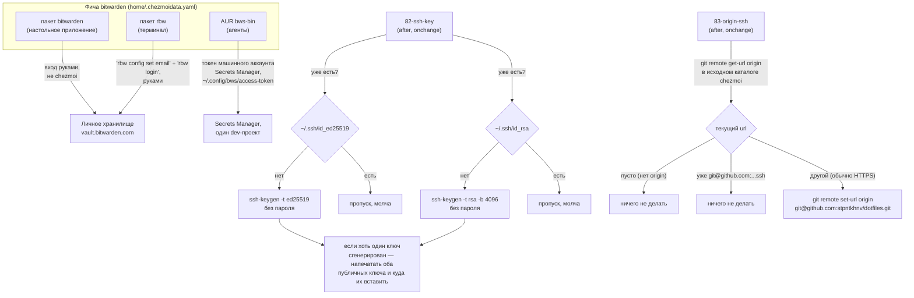

---
covers:
  features: [bitwarden]
  paths:
    - home/.chezmoiscripts/run_onchange_after_82-ssh-key.sh.tmpl
    - home/.chezmoiscripts/run_onchange_after_83-origin-ssh.sh.tmpl
    - home/dot_local/bin/executable_pat
---

# Пароли и ключи: Bitwarden и SSH

## Что это даёт

Пароли живут в одном месте — Bitwarden — а не в браузере и не в текстовом
файле на диске. Открываешь настольное приложение или расширение — видишь и
достаёшь пароль руками. В терминале то же самое хранилище доступно без
мышки: набираешь `rbw get <запись>`, оно спрашивает мастер-пароль один раз в
пин-энтри-окне и потом отдаёт значения, не оставляя ни пароль, ни секрет в
истории команд. А агентам вроде Claude Code, работающим в этом терминале,
Bitwarden выдаёт не то же самое хранилище, а отдельный, урезанный ключ: агент
может прочитать через него рабочие ключи API, но до личных паролей той же
дотянуться не может — это два разных входа в две разные части одного и того
же сервиса.

Отдельно от паролей на машине рождаются SSH-ключи — то, чем git узнаёт тебя
при заходе на GitHub, GitLab и Azure DevOps, чтобы не спрашивать пароль на
каждый `git push`. Ключей два, потому что один из этих трёх сервисов
исторически не умеет говорить на современном протоколе ключа, и подробности
ниже.

## Как это работает



### Три клиента Bitwarden, а не один

Фича `bitwarden` в `home/.chezmoidata.yaml` ставит пакетами сразу три вещи —
`bitwarden` и `rbw` из `pacman`, `bws-bin` из AUR (`home/.chezmoidata.yaml`,
ключ `bitwarden`). Комментарий над этим блоком в каталоге фич называет
причину прямо: три разных потребителя одного хранилища.

- **`bitwarden`** — настольное приложение для человека: открыл, нашёл запись
  глазами, скопировал.
- **`rbw`** — неофициальный клиент для терминала. У него свой демон-агент и
  своё pinentry-окно для мастер-пароля: пароль вводится один раз в отдельном
  окошке, не в самом терминале, и поэтому не оседает ни в истории шелла, ни
  в выводе команды.
- **`bws`** — официальный CLI Bitwarden Secrets Manager, отдельного от
  личного хранилища продукта. У него не мастер-пароль, а токен машинного
  аккаунта, ограниченный одним dev-проектом. Держатель этого токена может
  прочитать секреты только этого проекта — и не может дотянуться до личного
  хранилища паролей вообще, потому что это разные системы с разными правами
  доступа, а не режим одного и того же клиента.

Ни один из трёх клиентов не получает готовой конфигурации от chezmoi: в
`home/` нет ни файла для `rbw`, ни файла для `bws`. Оба настраиваются руками
после установки пакета, и репозиторий об этом только напоминает — скрипт
`run_after_zz-next-steps.sh.tmpl` проверяет вживую, появился ли уже файл
настроек, и если нет, добавляет строку в чеклист:

```sh
if command -v rbw &>/dev/null; then
    [[ -s "$HOME/.config/rbw/config.json" ]] || \
        steps+=("Bitwarden: account at https://vault.bitwarden.com (register if new), then 'rbw config set email <email>' and 'rbw login'")
fi
if command -v bws &>/dev/null && [[ ! -s "$HOME/.config/bws/access-token" ]]; then
    steps+=("Bitwarden agents: create a Secrets Manager machine account at https://vault.bitwarden.com -> Secrets Manager -> Machine accounts, put its token in ~/.config/bws/access-token (chmod 600)")
fi
```

Отсюда и граница агента: то, что Claude Code или Codex физически не может
дойти до личного хранилища, — не флаг где-то в конфигурации `claude` и не
проверка внутри `claudefiles` (внешний репозиторий, [agents.md](agents.md)),
а прямое следствие того, какому аккаунту принадлежит токен в
`~/.config/bws/access-token`. Тот же вопрос с другой стороны — что именно из
этого читает агент — разобран в [agents.md](agents.md), раздел «Где
кончается граница с секретами»; здесь — что это за граница и откуда она
берётся у самого Bitwarden.

Bitwarden как расширение браузера — отдельная, уже описанная тема:
устанавливается той же политикой, что и остальной браузерный стек
([isolation-browser.md](isolation-browser.md), раздел «Политика: расширения,
контейнеры, закладки»). Здесь — только про сами три клиента и хранилище за
ними.

### Папка PAT и команда `pat`

Токены доступа — personal access tokens Azure DevOps, ключи API и всё
остальное, что сервис показывает один раз и больше никогда, — лежат в папке
`PAT` личного хранилища. Одна запись на организацию или сервис: имя записи —
имя организации, сам токен в поле пароля, а в заметке записано, где он выдан,
с какими правами и до какого числа.

Смысл раскладки в том, что токен переживает пересоздание контейнера. Раньше он
существовал в единственном экземпляре, внутри
`~/homes/<контекст>/.config/claudefiles/secrets.json`, и умирал вместе с
домашним каталогом контейнера. Восстановить его было нельзя: Azure DevOps
показывает значение ровно один раз, при создании, и дальше умеет только
выпустить новый.

Достаёт токены команда `pat` (`home/dot_local/bin/executable_pat`):

```sh
pat              # список имён в папке PAT
pat digi3        # печатает токен
pat -c digi3     # кладёт в буфер обмена, на экран не печатает
pat -i digi3     # печатает только заметку: где выдан, когда истекает
```

**Почему обёртка, а не голый `rbw get --folder PAT digi3`.** Первый аргумент
`rbw get` — это NEEDLE: он совпадает по имени, адресу или идентификатору, а не
проверяется на равенство. Ограничения папкой мало: запись в той же папке, у
которой в поле URI лежит строка `digi3`, увела бы чтение на себя, и вернулся
бы чужой токен — молча. Поэтому `pat` разбирает вывод `rbw list --fields
id,folder,name` сам, требует ровно одного точного совпадения по паре «папка
плюс имя» и дальше читает запись **по идентификатору**. Ноль совпадений и два
совпадения одинаково заканчиваются ошибкой, а не выбором наугад.

Режим `-i` устроен так, что не может напечатать токен даже при неожиданном
формате вывода `rbw`: он берёт запись с заметкой и вырезает из неё значение
пароля по содержимому, а не отрезает первую строку по счёту.

**Команда есть только на хосте.** Гейт стоит в `home/.chezmoiignore`, рядом с
таким же для `work`. Это не граница безопасности, и путать одно с другим не
надо: фича `bitwarden` имеет `scope: both`, `rbw` установлен в каждом
контейнере, и чеклист `zz-next-steps` там же напоминает выполнить `rbw
login`. Причина бытовая: вход `rbw` живёт в домашнем каталоге контейнера и
умирает вместе с ним, значит после каждого пересоздания мастер-пароль
пришлось бы вводить заново. Скопировать значение из соседней панели терминала
дешевле.

### Два ключа SSH, а не один — скрипт 82

Существо `run_onchange_after_82-ssh-key.sh.tmpl` (шапка с `#!/bin/bash` и
`set -euo pipefail` опущена, тело печати свёрнуто в одну строку):

```sh
mkdir -p "$HOME/.ssh"
chmod 700 "$HOME/.ssh"

generated=false

if [[ ! -f "$HOME/.ssh/id_ed25519" ]]; then
    echo "==> Generating an ed25519 key (GitHub, GitLab)..."
    ssh-keygen -t ed25519 -C "{{ .git_email }}" -f "$HOME/.ssh/id_ed25519" -N ""
    generated=true
fi

# Azure DevOps still refuses ed25519 over SSH, hence a separate RSA key.
if [[ ! -f "$HOME/.ssh/id_rsa" ]]; then
    echo "==> Generating an RSA-4096 key (Azure DevOps)..."
    ssh-keygen -t rsa -b 4096 -C "{{ .git_email }}" -f "$HOME/.ssh/id_rsa" -N ""
    generated=true
fi

if $generated; then
    cat <<EOF
...обе открытые части и ссылки, куда их вставить...
EOF
fi
```

Две строки `echo` внутри условий стоят отдельного слова, потому что это
единственное место, где вывод `chezmoi apply` показывает, какой именно ключ
создаётся прямо сейчас. Финальный блок печати такого не различает: он
вываливает обе открытые части разом, даже если свежесоздан был только один
ключ. Так что «какой из двух появился» видно по этим строкам выше, а не по
тому, что напечатано в конце.

Каждый ключ проверяется независимо и генерируется независимо: наличие
`id_ed25519` не влияет на решение про `id_rsa`, и наоборот. `{{ .git_email
}}` — значение, введённое один раз в анкете `chezmoi init --prompt` и
сохранённое в `home/.chezmoi.toml.tmpl` под ключом `git_email`; оно попадает
в комментарий ключа (поле после `-C`), а не влияет на сам ключ
криптографически.

Два конкретных ключа:

| Ключ | Тип и длина | Для чего |
|---|---|---|
| `~/.ssh/id_ed25519` | EdDSA на кривой Curve25519, длина ключа фиксирована самим алгоритмом | GitHub, GitLab |
| `~/.ssh/id_rsa` | RSA, явно заданные 4096 бит (`-b 4096`) | Azure DevOps |

Оба генерируются с `-N ""` — пустой парольной фразой, то есть без пароля на
сам файл ключа: `ssh` или git отдают его молча, без запроса пароля на каждое
обращение к серверу.

**Публичные части печатаются один раз, но не по ключу, а по целому запуску
скрипта.** Флаг `generated` общий на оба блока: если хотя бы один из двух
файлов пришлось создать, в конце скрипт печатает содержимое **обоих**
`.pub`-файлов подряд, вместе со ссылками, куда их вставлять (GitHub — в
настройках профиля, Azure DevOps — в настройках пользователя организации), —
даже если фактически создан был только один из двух ключей, а второй уже
существовал раньше. Если на момент запуска существуют уже оба файла —
скрипт не генерирует ничего, не устанавливает `generated`, и не печатает ни
единой строки: он молчит.

Права на каталог (`chmod 700 ~/.ssh`) выставляются каждый раз при запуске
скрипта, до всех проверок — это не зависит от того, будет ли что-то
сгенерировано.

### Переключение `origin` на SSH — скрипт 83

Существо `run_onchange_after_83-origin-ssh.sh.tmpl` (шапка с `#!/bin/bash` и
`set -euo pipefail` опущена):

```sh
cd "{{ .chezmoi.sourceDir }}"

ssh_url="git@github.com:stpntkhnv/dotfiles.git"
current_url=$(git remote get-url origin 2>/dev/null || true)

if [[ -n "$current_url" && "$current_url" != "$ssh_url" ]]; then
    git remote set-url origin "$ssh_url"
fi
```

Важная граница: `cd "{{ .chezmoi.sourceDir }}"` — этот скрипт трогает
`origin` ровно одного репозитория, того самого исходного каталога chezmoi
(клон этого же `dotfiles`), и не трогает `origin` ни одного другого
git-репозитория на машине. `ssh_url` — не переменная, а буквальная строка,
зашитая под конкретный аккаунт (`stpntkhnv`) и конкретный репозиторий
(`dotfiles`).

Условие переключения — `current_url` непустой **и** отличается от
`ssh_url`. Из этого:

- нет `origin` вовсе (`git remote get-url` вернул код ошибки, и `|| true`
  превратил это в пустую строку) — скрипт ничего не делает;
- `origin` уже равен `ssh_url` — тоже ничего не делает, идемпотентно;
- `origin` — что угодно другое, обычно HTTPS-адрес после самого первого
  клонирования — переключает.

Комментарий в начале скрипта объясняет, зачем вообще нужен этот шаг именно
здесь, а не раньше: `install.sh` клонирует репозиторий не сам, а поручает
это `chezmoi init`, у которого есть своя логика выбора между SSH и HTTPS
([install.md](install.md), абзац «Почему `install.sh` не клонирует
репозиторий сам» внутри «Почему именно так»). На чистой машине SSH-ключа
ещё нет, и `chezmoi init`
уходит на HTTPS. Скрипт 83 выполняется позже по нумерации, чем 82 — то есть
уже после того, как `id_ed25519` появился на диске, — и именно поэтому
может безопасно переключить `origin` обратно на SSH, не рискуя оставить
человека без доступа для `git push`.

Поскольку `ssh_url` — литеральная строка, а не что-то, зависящее от машины,
отрендеренный текст скрипта не меняется от повторного запуска на одной и
той же машине. Он относится к `run_onchange`, то есть перезапускается при
изменении текста скрипта после подстановки шаблона
([`run_onchange`](glossary.md#run_onchange)) — а раз текст стабилен, на
практике скрипт реально выполняет переключение один раз в жизни машины
(если не редактировать сам файл скрипта в репозитории).

## Что ставится и что меняется

| Категория | Путь | Где | Кто создаёт |
|---|---|---|---|
| Пакеты | `bitwarden`, `rbw` (pacman), `bws-bin` (AUR) | Хост | фича `bitwarden`, `scope: both`, включена по умолчанию |
| Ключ ed25519 | `~/.ssh/id_ed25519`, `~/.ssh/id_ed25519.pub` | Хост, в доме | скрипт 82, если файла ещё нет |
| Ключ RSA-4096 | `~/.ssh/id_rsa`, `~/.ssh/id_rsa.pub` | Хост, в доме | скрипт 82, если файла ещё нет |
| Права каталога | `~/.ssh` (`700`) | Хост, в доме | скрипт 82, при каждом запуске |
| `origin` репозитория dotfiles | `.git/config` исходного каталога chezmoi | Хост, вне `home/` | скрипт 83, если текущий url не равен целевому SSH-адресу |
| Расширение Bitwarden в браузере | `/etc/zen/policies/policies.json`, `/etc/firefox/policies/policies.json` | Хост, вне дома | скрипт 32, тема [isolation-browser.md](isolation-browser.md) |
| Конфиг `rbw` | `~/.config/rbw/config.json` | Хост, в доме | **не chezmoi** — руками, `rbw config set email` + `rbw login` |
| Токен `bws` | `~/.config/bws/access-token` | Хост, в доме | **не chezmoi** — руками, машинный аккаунт Secrets Manager |
| Команда `pat` | `~/.local/bin/pat` | Хост, в доме | `home/dot_local/bin/executable_pat`, только если фича `bitwarden` включена |

## Как проверить

Пакеты и типы ключей на этой машине (снято 2026-07-31):

```sh
$ pacman -Q openssh rbw bitwarden bws-bin
openssh 10.4p1-3
rbw 1.15.0-2
bitwarden 2026.3.1-2
bws-bin 2.1.0-1
```

Ключи и права на каталог — смотреть можно только листинг, не содержимое
приватных частей:

```sh
$ ls -la ~/.ssh/
-rw-------  1 stsiapan stsiapan  419 ... id_ed25519
-rw-r--r--  1 stsiapan stsiapan  110 ... id_ed25519.pub
-rw-------  1 stsiapan stsiapan 3401 ... id_rsa
-rw-r--r--  1 stsiapan stsiapan  754 ... id_rsa.pub
```

Приватные части — `600` (владелец единственный, кто читает), публичные —
`644` (обычные права `ssh-keygen`, поверх ими не управляет ни один скрипт
этого репозитория).

`origin` уже переключён на SSH (снято на этой машине, `git remote -v` в
исходном каталоге chezmoi):

```sh
$ git remote -v
origin	git@github.com:stpntkhnv/dotfiles.git (fetch)
origin	git@github.com:stpntkhnv/dotfiles.git (push)
```

Если оба ключа уже существуют, скрипт 82 при `chezmoi apply` не печатает
вообще ничего: единственный способ увидеть его текст, не трогая настоящие
ключи и не рискуя перезаписать существующие, — прогнать шаблон отдельно от
применения:

```sh
chezmoi execute-template < home/.chezmoiscripts/run_onchange_after_82-ssh-key.sh.tmpl
```

## Когда сломалось

| Симптом | Причина | Что делать |
|---|---|---|
| `git push` на GitHub/GitLab просит пароль или падает с «Permission denied (publickey)» | Публичная часть `id_ed25519` не добавлена в настройки аккаунта | Взять `cat ~/.ssh/id_ed25519.pub` и добавить на `github.com/settings/keys` (или аналог GitLab) |
| То же самое, но на `dev.azure.com` | Публичная часть `id_rsa` не добавлена в SSH-ключи профиля Azure DevOps, либо клиент предлагает не тот ключ первым | Добавить `id_rsa.pub` в настройках пользователя Azure DevOps; при нескольких ключах — прописать `IdentityFile`/`IdentitiesOnly yes` в `~/.ssh/config` для хоста `ssh.dev.azure.com`, как описывает официальная документация Microsoft (раздел «Ссылки») |
| Ключи не создались вовсе | Скрипт 82 — `run_onchange`, выполняется один раз при появлении/изменении своего отрендеренного текста; если оба файла уже существовали до первого `apply` (перенесены руками с другой машины), скрипт и должен был промолчать — это не поломка | Проверить `ls ~/.ssh/id_ed25519 ~/.ssh/id_rsa` — если оба на месте, ключи уже есть, генерировать нечего |
| `origin` репозитория dotfiles остался HTTPS | Скрипт 83 запускается после 82 по порядку, но если `id_ed25519` появился не через скрипт 82 (например, ключ перенесли с другой машины уже после первого `apply`, когда 83 уже отработал и получил тот же неизменный текст), `run_onchange` может не перезапуститься | Переключить руками: `git remote set-url origin git@github.com:stpntkhnv/dotfiles.git` в исходном каталоге chezmoi (`chezmoi source-path`), либо любой правкой скрипта 83 форсировать `run_onchange` |
| Bitwarden в терминале (`rbw`) спрашивает мастер-пароль на каждую команду | Не запущен или не разблокирован демон-агент `rbw` | `rbw unlock`; проверить, что процесс агента `rbw` жив |
| `bws` не может прочитать секрет проекта | Файла `~/.config/bws/access-token` нет, пуст, или срок токена истёк | Пересоздать машинный аккаунт в Secrets Manager, положить новый токен в файл, `chmod 600` |
| `pat` отвечает «rbw is not configured» | На этой машине ещё не выполнен вход в хранилище | `rbw config set email <почта>`, затем `rbw login` |
| `pat` отвечает «folder PAT is empty or missing» | Папки `PAT` нет, она пуста, или локальная база устарела | Завести папку и записи; если они точно есть — `rbw sync` |
| `pat <имя>` отвечает «ambiguous name» | В папке `PAT` две записи с одинаковым именем, обычно старая и новая после ротации | Удалить или переименовать лишнюю: команда намеренно не выбирает сама |
| Команды `pat` нет внутри контейнера | Так задумано, гейт в `.chezmoiignore` кладёт её только на хост | Взять значение на хосте и вставить руками |

## Почему именно так

**Почему именно RSA-4096, а не ed25519, для Azure DevOps.** Комментарий в
самом скрипте 82 говорит это прямо: «Azure DevOps still refuses ed25519 over
SSH». Официальная документация Microsoft подтверждает это по состоянию на
дату проверки (`learn.microsoft.com`, страница «Use SSH key authentication —
Azure Repos», метаданные страницы показывают `ms.date: 2026-06-17`, то есть
обновлена недавно): «OpenSSH can generate several key types, but Azure
DevOps supports RSA keys for SSH authentication» — про ed25519 или другие
типы ключей документ не говорит ни слова, RSA называется единственным
поддерживаемым. Отдельно там же уточняется, что устаревает не сам тип ключа
RSA, а старая сигнатурная схема `ssh-rsa`: с 2024 года Azure DevOps требует
`rsa-sha2-256`/`rsa-sha2-512` вместо неё, но ключ остаётся RSA в обоих
случаях — современный OpenSSH (в частности `OpenSSH_10.4p1`, версия на этой
машине) уже сам предпочитает `rsa-sha2-*` при подписи, так что этот переход
не требует ничего дополнительного от самого скрипта. Запись —
[workarounds.md](workarounds.md).

Длина 4096 бит — не то, что просит сама документация Microsoft (там
командой из примера идёт `ssh-keygen -t rsa -b 3072`), а собственный выбор
этого репозитория: Azure DevOps ограничивает не длину ключа, а тип и
сигнатурную схему, значит более длинный ключ работает так же, просто
медленнее подписывает — компромисс, который здесь сочли приемлемым.

**Почему ключи без пароля.** `-N ""` убирает шифрование самого файла ключа
парольной фразой. Раз ключей и так два, а не один общий, а мастер-пароль
самого Bitwarden уже защищает всё остальное, здесь выбран путь без запроса
пароля на каждый `git push` — цена этого решения зависит от того, кто ещё
имеет доступ к файлам `~/.ssh/id_*`, а это уже вопрос физической и учётной
защиты самой машины, вне темы этого документа.

**Почему origin переключается отдельным скриптом, а не сразу командой в
самом клонировании.** `install.sh` намеренно не пишет свою логику
клонирования, а пользуется тем, что уже есть внутри `chezmoi init`
([install.md](install.md)) — а та логика решает между SSH и HTTPS до того,
как на машине появился хоть один SSH-ключ. Развести эти два шага по разным
скриптам, которые выполняются в порядке номеров (82 раньше 83), проще, чем
учить один скрипт ждать появления ключа с таймаутом или условием.

## Чего в репозитории нет и не будет

Раздел «Что ставится» выше специально не включает три вещи, которые могли
бы показаться его частью, но принципиально в репозиторий не попадают:

- **Device ID Syncthing.** Идентификатор, которым машина опознаёт сама себя
  в сети синхронизации, не хранится нигде в `.chezmoidata.yaml`: он
  генерируется демоном при первом запуске и живёт только в его собственном
  состоянии на диске. Почему он не в каталоге фич и как скрипт спрашивает
  его у живого демона, а не у файла — [sync.md](sync.md), разделы «Как
  машина понимает, кто она» и «Почему device ID не в каталоге фич».
- **Токены и удостоверение ziti.** Файл-удостоверение (JSON) для OpenZiti
  кладётся в `/opt/openziti/etc/identities/` руками, и ни один скрипт этого
  репозитория его не создаёт и не проверяет содержимое — только сам факт,
  что каталог не пуст. Разбор — [network.md](network.md), раздел «OpenZiti:
  отдельный тоннель, необязательный и не только для хоста».
- **Ключи API и содержимое личного хранилища паролей.** Агент читает рабочие
  секреты через токен `bws`, ограниченный одним dev-проектом Secrets
  Manager, а не через тот же вход, что использует человек в `bitwarden`/
  `rbw` — описано выше в разделе «Три клиента Bitwarden, а не один» и в
  [agents.md](agents.md), раздел «Где кончается граница с секретами».

Общее свойство всех трёх: там, где секрет специфичен для одной машины или
одного человека, репозиторий останавливается на автоматизации механизма
(спросить демона, напомнить в чеклисте, ограничить токен проектом) и
сознательно не пытается унести сам секрет в код, который синхронизируется
между машинами и лежит в git.

## Ссылки

- [isolation-browser.md](isolation-browser.md) — установка расширения
  Bitwarden в браузер политикой, раздел «Политика: расширения, контейнеры,
  закладки».
- [agents.md](agents.md) — раздел «Где кончается граница с секретами»: что
  именно агент может прочитать через `bws` и почему не больше.
- [sync.md](sync.md) — device ID Syncthing и почему его нет в каталоге фич.
- [network.md](network.md) — удостоверение OpenZiti, кладётся руками.
- [install.md](install.md) — почему `install.sh` не решает сам между SSH и
  HTTPS при первом клонировании.
- [workarounds.md](workarounds.md) — запись про RSA вместо ed25519 для
  Azure DevOps.
- `learn.microsoft.com/en-us/azure/devops/repos/git/use-ssh-keys-to-authenticate` —
  официальная документация Microsoft: Azure DevOps поддерживает только RSA
  для SSH-аутентификации (проверено 2026-07-31, метаданные страницы
  показывают `ms.date: 2026-06-17`).
- `devblogs.microsoft.com/devops/ssh-rsa-deprecation` — отдельная тема:
  устаревает сигнатурная схема `ssh-rsa`, а не сам тип ключа RSA; актуальные
  схемы — `rsa-sha2-256`/`rsa-sha2-512`.
