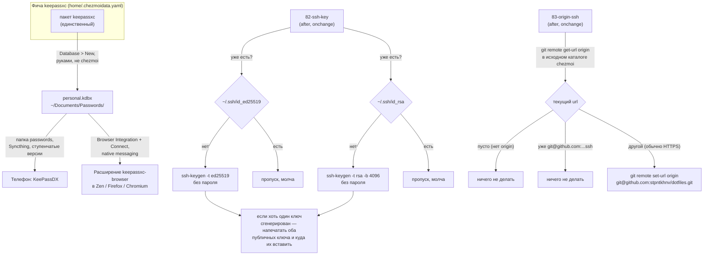

---
covers:
  features: [keepassxc]
  paths:
    - home/.chezmoiscripts/run_onchange_after_82-ssh-key.sh.tmpl
    - home/dot_local/bin/executable_ssh-restore.tmpl
    - home/.chezmoiscripts/run_onchange_after_83-origin-ssh.sh.tmpl
---

# Пароли и ключи: KeePassXC и SSH

## Что это даёт

Пароли живут в одном файле — базе [kdbx](glossary.md#kdbx) `~/Documents/Passwords/personal.kdbx`
— а не в браузере, не в текстовом файле и не в чужом облаке: ни сервера, ни
аккаунта, ни регистрации. Открываешь KeePassXC на компьютере, видишь и
достаёшь пароль руками; в браузере то же самое доступно без переключения окна
— расширение `keepassxc-browser` говорит с запущенным KeePassXC напрямую и
подставляет пароль на странице. Тот же файл открывает и телефон (KeePassDX),
потому что папка, где он лежит, синхронизируется Syncthing на все машины.
Подробнее — ниже, в «Как устроено».

Агентам вроде Claude Code, работающим в этом терминале, до этой базы дела нет
вообще: доступа к паролям и токенам у них нет ни на хосте, ни в контейнере.
Personal access token организации человек копирует вручную с её сайта в
момент, когда он нужен, — раздел «Агенты и токены доступа (PAT)» ниже и
[agents.md](agents.md).

Отдельно от паролей на машине рождаются SSH-ключи — то, чем git узнаёт тебя
при заходе на GitHub, GitLab и Azure DevOps, чтобы не спрашивать пароль на
каждый `git push`. Ключей два, потому что один из этих трёх сервисов
исторически не умеет говорить на современном протоколе ключа, и подробности
ниже.

## Как это работает



### Одна база вместо трёх клиентов

До 2026-08-01 здесь стоял Bitwarden: три разных клиента одного облачного
хранилища (настольное приложение, `rbw` для терминала, `bws` для агентов) —
причина была в том, что хранилище само по себе облачное и разным
потребителям нужны разные права на него. KeePassXC устроен иначе: это не
облако, а один локальный файл, и клиент у него ровно один, тот же, что
десктопное приложение, что источник для расширений браузера. Фича `keepassxc`
в `home/.chezmoidata.yaml` ставит одним пакетом (`pacman: [keepassxc]`)
именно поэтому — незачем разводить по клиентам то, что физически один и тот
же процесс на диске.

Фича — `scope: host` (было `both` у Bitwarden) и `needs: [syncthing]`:
Bitwarden синхронизировал себя сам, через свой облачный аккаунт, а KeePassXC
не может ничего разослать сам — файл на диск кладёт Syncthing, значит без
него у базы нет второй копии ни на одной другой машине. Контейнерам эта фича
не ставится вовсе: у них нет ни человека, читающего пароль глазами, ни
браузера с расширением, которому нужна база.

Саму базу chezmoi не создаёт — это, как и вход в облачный Bitwarden раньше,
разовое ручное действие, о котором напоминает чеклист
`run_after_zz-next-steps.sh.tmpl`:

```sh
if [[ ! -f "$HOME/Documents/Passwords/personal.kdbx" ]]; then
    steps+=("KeePassXC: create the vault -- keepassxc, Database > New, save as ~/Documents/Passwords/personal.kdbx; Tools > Settings > Browser Integration: enable, tick BOTH Firefox (covers Zen) and Chromium; then Connect from the extension icon in each browser")
    steps+=("KeePassXC phone: install KeePassDX, accept the 'passwords' Syncthing folder, open personal.kdbx")
fi
```

Путь `~/Documents/Passwords/personal.kdbx` — не произвольный: это ровно путь
папки Syncthing `passwords` (`home/.chezmoidata.yaml`, `syncthing.folders`,
запись с `id: passwords`, `path: Documents/Passwords`, `type: sendreceive`,
`versioning: staggered`, `devices: [desktop, laptop, phone]`). Сохранить базу
куда-то ещё — значит вывести её из-под синхронизации незаметно для себя: имя
файла `personal.kdbx` при этом не проверяется никаким скриптом, важен только
каталог.

«Ступенчатые» версии (`staggered`) — встроенная в Syncthing схема хранения
старых версий изменённого файла: чем старше версия, тем реже она хранится
(последний час — все, последний день — раз в час и так далее), а не «только
самая свежая копия» и не «храним всё подряд навсегда». Подробности механизма
— [sync.md](sync.md).

### Браузеры и native messaging

Расширение `keepassxc-browser` (`guid` в терминах AMO —
`keepassxc-browser@keepassxc.org`) устанавливается тем же скриптом 32
(`run_onchange_before_32-browser-extensions.sh.tmpl`), что и весь остальной
браузерный стек, — режим `normal_installed` (можно выключить, не
force-installed): у Zen и обычного Firefox через системную политику,
условием `{{- if has "keepassxc" .enabled }}`; у Chromium — отдельным файлом
политики, `/etc/chromium/policies/managed/keepassxc-extension.json`, с
Chrome-идентификатором расширения `oboonakemofpalcgghocfoadofidjkkk`:

```sh
sudo tee /etc/chromium/policies/managed/keepassxc-extension.json >/dev/null <<'EOF'
{
  "ExtensionSettings": {
    "oboonakemofpalcgghocfoadofidjkkk": {
      "installation_mode": "normal_installed",
      "update_url": "https://clients2.google.com/service/update2/crx"
    }
  }
}
EOF
```

Оба файла политики Chromium — старый `bitwarden-extension.json` и сам
`keepassxc-extension.json` — скрипт удаляет безусловно, ещё до проверки
фичи (`sudo rm -f /etc/chromium/policies/managed/bitwarden-extension.json
/etc/chromium/policies/managed/keepassxc-extension.json`), а условный блок
из примера выше переписывает `keepassxc-extension.json` заново, если
`keepassxc`+`chromium` всё ещё включены. Оба файла принадлежат `root` и
переживают и выключение своей фичи, и отключение самого `chromium` —
без безусловного `rm -f` осиротевшая политика продолжала бы ставить
расширение в Chromium вечно, ничего в этом не показывая. Установка описана
подробнее в [isolation-browser.md](isolation-browser.md), раздел «Политика:
расширения, контейнеры, закладки».

Само расширение — только половина дела: оно умеет разговаривать с базой, но
не открывает её само. Соединение — за [native messaging](glossary.md#native-messaging),
и оно настраивается не chezmoi, а внутри самого KeePassXC, руками, один раз
на каждый браузер: Tools > Settings > Browser Integration → включить,
отметить нужные браузеры (галка «Firefox» покрывает и Zen — оба используют
один и тот же стандартный каталог манифестов, `~/.mozilla/native-messaging-hosts/`,
это доказано разведкой перед этой миграцией: `omni.ja`, модуль
`NativeManifests.sys.mjs`, строит путь именно из `XREUserNativeManifests` и
литерала `native-messaging-hosts`, а в `libxul.so` зашита строка `.mozilla`,
а не что-то Zen-специфичное; отдельного каталога под `.zen` в бинарнике нет),
отдельная галка — «Chromium»); затем в каждом браузере нажать «Connect» на
иконке расширения. Файл манифеста native messaging в
`~/.mozilla/native-messaging-hosts/` при этом пишет сам KeePassXC при
включении галки — этот репозиторий его не создаёт, не проверяет и не
раскладывает никаким скриптом: без чекбокса в KeePassXC манифеста не будет,
сколько раз ни примени `chezmoi apply`.

### Конфликты .kdbx — не редактировать вручную

Файл `.kdbx` — не текст, и правка на двух машинах до того, как они успели
связаться через Syncthing, оставляет обычный для Syncthing файл-конфликт
(маркер Syncthing вставляется перед расширением, так что реальное имя —
`personal.sync-conflict-<дата>-<устройство>.kdbx`), только его нельзя лечить
так же, как конфликт заметки: слить построчно бинарный файл не получится. Правильный
путь — открыть KeePassXC и выполнить Database > Merge from database,
указав файл-конфликт источником, а затем удалить сам файл-конфликт.

Детектор конфликтов в `run_after_zz-next-steps.sh.tmpl` знает про эту
разницу и предлагает разные шаги для `.kdbx` и для всего остального:

```sh
case "$st_conflict" in
    *.kdbx*) steps+=("Syncthing: conflict file $st_conflict -- merge in KeePassXC (Database > Merge from database), then delete the conflict copy") ;;
    *) steps+=("Syncthing: conflict file $st_conflict -- resolve with the kb-curate skill, do not delete blindly") ;;
esac
```

Навык `kb-curate`, который годится для конфликтов заметок в базе знаний
([sync.md](sync.md)), для `.kdbx` не подходит вовсе: он рассчитан на текст с
YAML-шапкой и `[[ссылками]]`, а не на зашифрованное бинарное дерево записей.

### Агенты и токены доступа (PAT)

У агента, работающего в этом терминале, нет доступа ни к базе паролей, ни к
personal access token — ни на хосте, ни тем более в контейнере. Раньше
существовала обходная схема: у Bitwarden был отдельный токен `bws` для
Secrets Manager и команда `pat` (`home/dot_local/bin/executable_pat`),
которая на хосте отдавала агенту личные токены из хранилища через `rbw`.
Вся эта схема выпилена 2026-08-01 вместе с самим Bitwarden — не сужена, а
убрана целиком: агент не может прочитать ни один секрет ни одним из старых
способов, потому что ни `rbw`, ни `bws`, ни `pat` на машине больше нет.

Personal access token организаций (Azure DevOps и подобные) живут в папке
`PAT` базы `personal.kdbx`: запись на организацию, сам токен в поле пароля,
в Notes — где выдан, с какими правами и до какого числа. Так токен
переживает и пересоздание контейнера, и переустановку машины — база едет
через Syncthing. Достаёт его человек руками из GUI KeePassXC и вставляет
туда, где он нужен; терминальной обёртки нет намеренно (операция редкая,
посредник ей не окупается). Прежняя схема Bitwarden целиком видна в истории
git этого репозитория, если понадобятся детали устройства (`rbw`, `bws`,
обёртка `pat`) — восстанавливать её не планируется. Разбор того, где вообще
проходит граница доступа агента к секретам сейчас, — в
[agents.md](agents.md).

### Два ключа SSH, а не один — скрипт 82

С 2026-08-02 генерация — только на хосте: контейнерная ветка шаблона
(`{{ if eq .env "container" }}`) вместо `ssh-keygen` печатает напоминание
про `ssh-restore` и выходит — почему, разобрано в разделе «Эталоны ключей в
базе» ниже. Всё дальнейшее в этом разделе — про хостовую ветку.

Существо `run_onchange_after_82-ssh-key.sh.tmpl` (шапка с `#!/bin/bash` и
`set -euo pipefail` опущена, тело печати свёрнуто в одну строку):

```sh
mkdir -p "$HOME/.ssh"
chmod 700 "$HOME/.ssh"

generated=false

if [[ ! -f "$HOME/.ssh/id_ed25519" ]]; then
    echo "==> Generating an ed25519 key (GitHub, GitLab)..."
    ssh-keygen -t ed25519 -C "{{ .git_email }}" -f "$HOME/.ssh/id_ed25519" -N ""
    generated=true
fi

# Azure DevOps still refuses ed25519 over SSH, hence a separate RSA key.
if [[ ! -f "$HOME/.ssh/id_rsa" ]]; then
    echo "==> Generating an RSA-4096 key (Azure DevOps)..."
    ssh-keygen -t rsa -b 4096 -C "{{ .git_email }}" -f "$HOME/.ssh/id_rsa" -N ""
    generated=true
fi

if $generated; then
    cat <<EOF
...обе открытые части и ссылки, куда их вставить...
EOF
fi
```

Две строки `echo` внутри условий стоят отдельного слова, потому что это
единственное место, где вывод `chezmoi apply` показывает, какой именно ключ
создаётся прямо сейчас. Финальный блок печати такого не различает: он
вываливает обе открытые части разом, даже если свежесоздан был только один
ключ. Так что «какой из двух появился» видно по этим строкам выше, а не по
тому, что напечатано в конце.

Каждый ключ проверяется независимо и генерируется независимо: наличие
`id_ed25519` не влияет на решение про `id_rsa`, и наоборот. `{{ .git_email
}}` — значение, введённое один раз в анкете `chezmoi init --prompt` и
сохранённое в `home/.chezmoi.toml.tmpl` под ключом `git_email`; оно попадает
в комментарий ключа (поле после `-C`), а не влияет на сам ключ
криптографически.

Два конкретных ключа:

| Ключ | Тип и длина | Для чего |
|---|---|---|
| `~/.ssh/id_ed25519` | EdDSA на кривой Curve25519, длина ключа фиксирована самим алгоритмом | GitHub, GitLab |
| `~/.ssh/id_rsa` | RSA, явно заданные 4096 бит (`-b 4096`) | Azure DevOps |

Оба генерируются с `-N ""` — пустой парольной фразой, то есть без пароля на
сам файл ключа: `ssh` или git отдают его молча, без запроса пароля на каждое
обращение к серверу.

**Публичные части печатаются один раз, но не по ключу, а по целому запуску
скрипта.** Флаг `generated` общий на оба блока: если хотя бы один из двух
файлов пришлось создать, в конце скрипт печатает содержимое **обоих**
`.pub`-файлов подряд, вместе со ссылками, куда их вставлять (GitHub — в
настройках профиля, Azure DevOps — в настройках пользователя организации), —
даже если фактически создан был только один из двух ключей, а второй уже
существовал раньше. Если на момент запуска существуют уже оба файла —
скрипт не генерирует ничего, не устанавливает `generated`, и не печатает ни
единой строки: он молчит.

Права на каталог (`chmod 700 ~/.ssh`) выставляются каждый раз при запуске
скрипта, до всех проверок — это не зависит от того, будет ли что-то
сгенерировано.

### Эталоны ключей в базе и команда `ssh-restore`

Ключей на машине восемь, а не два: своя пара у хоста и своя пара в каждом из
трёх контейнеров, все с разными отпечатками. Разные ключи на контекст — не
недосмотр, а требование модели угроз: один и тот же публичный ключ,
зарегистрированный у двух работодателей, связывает их между собой.

Раньше при пересоздании контейнера его пара умирала вместе с домашним
каталогом, и публичные части приходилось регистрировать в сервисах заново.
Теперь у каждой пары есть **эталон в базе** `personal.kdbx`, и восстановление
после пересоздания — одна команда на хосте:

```sh
ssh-restore digi3        # спросит мастер-пароль, вернёт пару в ~/homes/digi3/.ssh
ssh-restore -f digi3     # то же, с перезаписью уже существующих файлов
```

Имена записей в базе — **контракт**: по записи на ключ, приватная часть —
вложением с именем из второй колонки, команда ищет имена дословно. Целей у
команды — контексты из каталога плюс зарезервированное слово `host`:
`ssh-restore -f host` возвращает пару самого хоста в `~/.ssh` — это путь
переустановки машины, разобран пошагово в [install.md](install.md), раздел
«Переустановка машины». Имя `host` поэтому запрещено для контекстов:
контекст с таким именем в каталоге роняет рендер шаблона с внятной ошибкой
(guard через `fail` в самом `executable_ssh-restore.tmpl`):

| Запись | Вложение |
|---|---|
| `SSH host github (ed25519)` | `id_ed25519` |
| `SSH host azure (rsa)` | `id_rsa` |
| `SSH digi3 github (ed25519)` | `id_ed25519` |
| `SSH digi3 azure (rsa)` | `id_rsa` |
| …то же для `stellium` и `personal` | |

Публичные части в базе не хранятся: `ssh-restore` порождает их из приватных
(`ssh-keygen -y`) — заодно это проверка, что приватный ключ цел и пароль был
верным. Единственная косметическая потеря при этом — текстовый комментарий
(email) в `.pub`-файле, сервисы на него не смотрят.

Как команда устроена внутри (`home/dot_local/bin/executable_ssh-restore.tmpl`):

- список допустимых контекстов рендерится из `contexts:` каталога — как в
  `work`, второго списка на диске нет;
- защита от запуска в контейнере двойная: гейт раскладки в `.chezmoiignore`
  (файл кладётся только на хосте) и рантайм-проверка `/run/host` в самом
  скрипте — файл-то виден из контейнера через примонтированный дом хоста;
- существующие файлы не перезаписываются молча: без `-f` — стоп с
  перечислением, и эта проверка идёт раньше запроса пароля;
- мастер-пароль спрашивается один раз (`read -rs`) и передаётся
  `keepassxc-cli` через stdin-пайп, в аргументы процессов не попадает;
- выкладка ступенчатая: экспорт и проверка во временном каталоге, права
  (600/644) там же, и только полный комплект переезжает `mv` в целевой
  `.ssh` (у контекста — `~/homes/<контекст>/.ssh`, у `host` — `~/.ssh`);
  сбой или Ctrl-C до финального `mv` не трогает целевой каталог,
  прерванный `mv` чинится повтором с `-f`.

Скрипт 82 в контейнерах при этом **больше не генерирует ключи**: свежий ключ
внутри контейнера выглядел бы починкой, а на деле возвращал бы старую боль —
его не знает ни один сервис. Контейнерная ветка скрипта только напоминает про
`ssh-restore`; похожее (не дословно то же) напоминание держит чеклист
`zz-next-steps` в контейнере, пока ключей нет, — его точный текст в таблице
[operations.md](operations.md).

Почему восстановление ручное, а не из `apply` — причина не изменилась с
прошлой редакции этого раздела: база защищена мастер-паролем и не
разблокируется сама, а `apply` не должен спрашивать секреты. Один запрос
пароля на одно пересоздание контейнера — принятая цена.

**Размен, названный прямо:** приватные ключи теперь лежат (зашифрованными
мастер-паролем) внутри `personal.kdbx`, а тот через папку `passwords`
Syncthing едет на ноутбук и телефон — эталоны существуют на трёх
устройствах, а не на одном. Это сознательное продолжение размена «одна
корзина», уже принятого для этой базы в целом: в ней же живут коды
двухфакторной аутентификации (TOTP) и passkeys, перенесённые с телефона.

### Переключение `origin` на SSH — скрипт 83

Существо `run_onchange_after_83-origin-ssh.sh.tmpl` (шапка с `#!/bin/bash` и
`set -euo pipefail` опущена):

```sh
cd "{{ .chezmoi.sourceDir }}"

ssh_url="git@github.com:stpntkhnv/dotfiles.git"
current_url=$(git remote get-url origin 2>/dev/null || true)

if [[ -n "$current_url" && "$current_url" != "$ssh_url" ]]; then
    git remote set-url origin "$ssh_url"
fi
```

Важная граница: `cd "{{ .chezmoi.sourceDir }}"` — этот скрипт трогает
`origin` ровно одного репозитория, того самого исходного каталога chezmoi
(клон этого же `dotfiles`), и не трогает `origin` ни одного другого
git-репозитория на машине. `ssh_url` — не переменная, а буквальная строка,
зашитая под конкретный аккаунт (`stpntkhnv`) и конкретный репозиторий
(`dotfiles`).

Условие переключения — `current_url` непустой **и** отличается от
`ssh_url`. Из этого:

- нет `origin` вовсе (`git remote get-url` вернул код ошибки, и `|| true`
  превратил это в пустую строку) — скрипт ничего не делает;
- `origin` уже равен `ssh_url` — тоже ничего не делает, идемпотентно;
- `origin` — что угодно другое, обычно HTTPS-адрес после самого первого
  клонирования — переключает.

Комментарий в начале скрипта объясняет, зачем вообще нужен этот шаг именно
здесь, а не раньше: `install.sh` клонирует репозиторий не сам, а поручает
это `chezmoi init`, у которого есть своя логика выбора между SSH и HTTPS
([install.md](install.md), абзац «Почему `install.sh` не клонирует
репозиторий сам» внутри «Почему именно так»). На чистой машине SSH-ключа
ещё нет, и `chezmoi init`
уходит на HTTPS. Скрипт 83 выполняется позже по нумерации, чем 82 — то есть
уже после того, как `id_ed25519` появился на диске, — и именно поэтому
может безопасно переключить `origin` обратно на SSH, не рискуя оставить
человека без доступа для `git push`.

Поскольку `ssh_url` — литеральная строка, а не что-то, зависящее от машины,
отрендеренный текст скрипта не меняется от повторного запуска на одной и
той же машине. Он относится к `run_onchange`, то есть перезапускается при
изменении текста скрипта после подстановки шаблона
([`run_onchange`](glossary.md#run_onchange)) — а раз текст стабилен, на
практике скрипт реально выполняет переключение один раз в жизни машины
(если не редактировать сам файл скрипта в репозитории).

## Что ставится и что меняется

| Категория | Путь | Где | Кто создаёт |
|---|---|---|---|
| Пакет | `keepassxc` (pacman) | Хост | фича `keepassxc`, `scope: host`, `needs: [syncthing]`, включена по умолчанию |
| Расширение в браузере | `/etc/zen/policies/policies.json`, `/etc/firefox/policies/policies.json` | Хост, вне дома | скрипт 32, тема [isolation-browser.md](isolation-browser.md) |
| Политика Chromium | `/etc/chromium/policies/managed/keepassxc-extension.json` (оба файла — этот и старая `bitwarden-extension.json` — сперва удаляются безусловно, затем этот переписывается заново) | Хост, вне дома | скрипт 32, если включены `chromium`+`keepassxc` |
| Папка Syncthing | `~/Documents/Passwords/` (id `passwords`) | Хост, в доме | `home/.chezmoidata.yaml`, `syncthing.folders`; сам файл `personal.kdbx` в неё кладёт человек, не chezmoi |
| Ключ ed25519 | `~/.ssh/id_ed25519`, `~/.ssh/id_ed25519.pub` | Хост, в доме | скрипт 82, если файла ещё нет (в контейнерах не генерирует — см. `ssh-restore`) |
| Ключ RSA-4096 | `~/.ssh/id_rsa`, `~/.ssh/id_rsa.pub` | Хост, в доме | скрипт 82, если файла ещё нет (в контейнерах не генерирует) |
| Команда `ssh-restore` | `~/.local/bin/ssh-restore` | Только хост | `home/dot_local/bin/executable_ssh-restore.tmpl`, гейт: фича `keepassxc` **и** `.env == "host"` (`.chezmoiignore`) |
| Ключи контекстов | `~/homes/<контекст>/.ssh/id_*` | Хост, дома́ контейнеров | `ssh-restore <контекст>` из записей-эталонов базы, руками после пересоздания |
| Права каталога | `~/.ssh` (`700`) | Хост, в доме | скрипт 82, при каждом запуске |
| `origin` репозитория dotfiles | `.git/config` исходного каталога chezmoi | Хост, вне `home/` | скрипт 83, если текущий url не равен целевому SSH-адресу |
| Манифест native messaging | `~/.mozilla/native-messaging-hosts/*.json` | Хост, в доме | **не chezmoi** — пишет сам KeePassXC при включении Browser Integration |
| База паролей | `~/Documents/Passwords/personal.kdbx` | Хост, в доме | **не chezmoi** — руками, KeePassXC, Database > New |

## Как проверить

Пакет и типы SSH-ключей на этой машине (снято 2026-07-31, до миграции — тогда
ещё стоял Bitwarden; актуальный пакет для сверки — `keepassxc`):

```sh
$ pacman -Q openssh
openssh 10.4p1-3
```

После установки фичи `keepassxc` и создания базы ожидается:

```sh
$ pacman -Q keepassxc
$ ls -la ~/Documents/Passwords/
# personal.kdbx и служебные файлы Syncthing (.stfolder и т.п.)
```

Что база действительно попала в папку, которую видит Syncthing, — тем же
способом, что и остальные папки каталога ([sync.md](sync.md), раздел «Как
проверить»):

```sh
$ curl -s -H "X-API-Key: $KEY" http://127.0.0.1:8384/rest/config/folders | jq -r '.[].id'
# среди прочих должен быть id "passwords"
```

Ключи и права на каталог — смотреть можно только листинг, не содержимое
приватных частей:

```sh
$ ls -la ~/.ssh/
-rw-------  1 stsiapan stsiapan  419 ... id_ed25519
-rw-r--r--  1 stsiapan stsiapan  110 ... id_ed25519.pub
-rw-------  1 stsiapan stsiapan 3401 ... id_rsa
-rw-r--r--  1 stsiapan stsiapan  754 ... id_rsa.pub
```

Приватные части — `600` (владелец единственный, кто читает), публичные —
`644` (обычные права `ssh-keygen`, поверх ими не управляет ни один скрипт
этого репозитория).

`origin` уже переключён на SSH (снято на этой машине, `git remote -v` в
исходном каталоге chezmoi):

```sh
$ git remote -v
origin	git@github.com:stpntkhnv/dotfiles.git (fetch)
origin	git@github.com:stpntkhnv/dotfiles.git (push)
```

Если оба ключа уже существуют, скрипт 82 при `chezmoi apply` не печатает
вообще ничего: единственный способ увидеть его текст, не трогая настоящие
ключи и не рискуя перезаписать существующие, — прогнать шаблон отдельно от
применения:

```sh
chezmoi execute-template < home/.chezmoiscripts/run_onchange_after_82-ssh-key.sh.tmpl
```

## Когда сломалось

| Симптом | Причина | Что делать |
|---|---|---|
| `git push` на GitHub/GitLab просит пароль или падает с «Permission denied (publickey)» | Публичная часть `id_ed25519` не добавлена в настройки аккаунта | Взять `cat ~/.ssh/id_ed25519.pub` и добавить на `github.com/settings/keys` (или аналог GitLab) |
| То же самое, но на `dev.azure.com` | Публичная часть `id_rsa` не добавлена в SSH-ключи профиля Azure DevOps, либо клиент предлагает не тот ключ первым | Добавить `id_rsa.pub` в настройках пользователя Azure DevOps; при нескольких ключах — прописать `IdentityFile`/`IdentitiesOnly yes` в `~/.ssh/config` для хоста `ssh.dev.azure.com`, как описывает официальная документация Microsoft (раздел «Ссылки») |
| Ключи не создались вовсе | Скрипт 82 — `run_onchange`, выполняется один раз при появлении/изменении своего отрендеренного текста; если оба файла уже существовали до первого `apply` (перенесены руками с другой машины), скрипт и должен был промолчать — это не поломка | Проверить `ls ~/.ssh/id_ed25519 ~/.ssh/id_rsa` — если оба на месте, ключи уже есть, генерировать нечего |
| `origin` репозитория dotfiles остался HTTPS | Скрипт 83 запускается после 82 по порядку, но если `id_ed25519` появился не через скрипт 82 (например, ключ перенесли с другой машины уже после первого `apply`, когда 83 уже отработал и получил тот же неизменный текст), `run_onchange` может не перезапуститься | Переключить руками: `git remote set-url origin git@github.com:stpntkhnv/dotfiles.git` в исходном каталоге chezmoi (`chezmoi source-path`), либо любой правкой скрипта 83 форсировать `run_onchange` |
| Расширение в браузере не подключается к базе (иконка серая, «Connection failed») | Либо Browser Integration не включён в самом KeePassXC, либо не отмечена галка нужного браузера (Firefox — отдельная от Chromium), либо манифест native messaging ещё не появился в `~/.mozilla/native-messaging-hosts/` | В KeePassXC: Tools > Settings > Browser Integration → включить, отметить нужный браузер, затем нажать «Connect» на иконке расширения; если манифеста всё ещё нет — перезапустить KeePassXC |
| Телефон не видит файл базы | Папка `passwords` ещё не принята в приложении Syncthing на телефоне, либо база ещё не создана на компьютере | Принять папку `passwords` в Syncthing на телефоне ([sync.md](sync.md), раздел «Телефон»); убедиться, что `~/Documents/Passwords/personal.kdbx` уже существует |
| Появился файл `personal.sync-conflict-<дата>-<устройство>.kdbx` | Правка базы на двух устройствах до того, как они успели синхронизироваться друг с другом | Не редактировать конфликтную копию: KeePassXC → Database > Merge from database, слить изменения, затем удалить копию — `run_after_zz-next-steps` подсказывает то же самое |
| `ssh-restore` отвечает `export failed for entry 'SSH … (…)'` | Либо записи с таким именем нет в базе (контракт имён — таблица в разделе «Эталоны ключей в базе»), либо мастер-пароль введён неверно | Сверить имя записи и вложения с контрактом посимвольно (`keepassxc-cli show --show-attachments`), повторить с верным паролем; целевой каталог при этом не тронут |
| `ssh-restore` отвечает `already present (use -f to overwrite)` | В `~/homes/<контекст>/.ssh` уже лежит хотя бы один из четырёх файлов — защита от молчаливой перезаписи живой пары | Если файлы точно мёртвые (контейнер пересоздан со старым домом и т.п.) — повторить с `-f`; если живые — восстанавливать нечего |
| `ssh-restore` отвечает `this is a container; run me on the host` | Команда видна из контейнера через примонтированный дом хоста и запускается, но база и `keepassxc-cli` живут на хосте | Выполнить ту же команду на хосте |
| В контейнере нет SSH-ключей после пересоздания | Так и задумано: скрипт 82 в контейнерах не генерирует (свежий ключ не знал бы ни один сервис), чеклист напоминает про восстановление | `ssh-restore <контекст>` на хосте |

## Почему именно так

**Почему именно RSA-4096, а не ed25519, для Azure DevOps.** Комментарий в
самом скрипте 82 говорит это прямо: «Azure DevOps still refuses ed25519 over
SSH». Официальная документация Microsoft подтверждает это по состоянию на
дату проверки (`learn.microsoft.com`, страница «Use SSH key authentication —
Azure Repos», метаданные страницы показывают `ms.date: 2026-06-17`, то есть
обновлена недавно): «OpenSSH can generate several key types, but Azure
DevOps supports RSA keys for SSH authentication» — про ed25519 или другие
типы ключей документ не говорит ни слова, RSA называется единственным
поддерживаемым. Отдельно там же уточняется, что устаревает не сам тип ключа
RSA, а старая сигнатурная схема `ssh-rsa`: с 2024 года Azure DevOps требует
`rsa-sha2-256`/`rsa-sha2-512` вместо неё, но ключ остаётся RSA в обоих
случаях — современный OpenSSH (в частности `OpenSSH_10.4p1`, версия на этой
машине) уже сам предпочитает `rsa-sha2-*` при подписи, так что этот переход
не требует ничего дополнительного от самого скрипта. Запись —
[workarounds.md](workarounds.md).

Длина 4096 бит — не то, что просит сама документация Microsoft (там
командой из примера идёт `ssh-keygen -t rsa -b 3072`), а собственный выбор
этого репозитория: Azure DevOps ограничивает не длину ключа, а тип и
сигнатурную схему, значит более длинный ключ работает так же, просто
медленнее подписывает — компромисс, который здесь сочли приемлемым.

**Почему ключи без пароля.** `-N ""` убирает шифрование самого файла ключа
парольной фразой. Раз ключей и так два, а не один общий, здесь выбран путь
без запроса пароля на каждый `git push` — цена этого решения зависит от
того, кто ещё имеет доступ к файлам `~/.ssh/id_*`, а это уже вопрос
физической и учётной защиты самой машины, вне темы этого документа.

**Почему origin переключается отдельным скриптом, а не сразу командой в
самом клонировании.** `install.sh` намеренно не пишет свою логику
клонирования, а пользуется тем, что уже есть внутри `chezmoi init`
([install.md](install.md)) — а та логика решает между SSH и HTTPS до того,
как на машине появился хоть один SSH-ключ. Развести эти два шага по разным
скриптам, которые выполняются в порядке номеров (82 раньше 83), проще, чем
учить один скрипт ждать появления ключа с таймаутом или условием.

**Почему один локальный файл, а не облачный менеджер паролей.** Прежняя
схема с Bitwarden требовала живого сервера, аккаунта, регистрации
устройства при каждом пересоздании контейнера и отдельного токена для
агентов — три источника отказа сверх самого пароля. KeePassXC избавляется от
всех трёх разом: файл либо есть на диске, либо нет, синхронизация — тот же
Syncthing, что уже разносит остальные данные между машинами, а агентам
просто нечего дать, потому что читать локальный зашифрованный файл без
мастер-пароля нечем в принципе — не потому, что где-то стоит проверка.

## Чего в репозитории нет и не будет

Раздел «Что ставится» выше специально не включает три вещи, которые могли
бы показаться его частью, но принципиально в репозиторий не попадают:

- **Device ID Syncthing.** Идентификатор, которым машина опознаёт сама себя
  в сети синхронизации, не хранится нигде в `.chezmoidata.yaml`: он
  генерируется демоном при первом запуске и живёт только в его собственном
  состоянии на диске. Почему он не в каталоге фич и как скрипт спрашивает
  его у живого демона, а не у файла — [sync.md](sync.md), разделы «Как
  машина понимает, кто она» и «Карта устройств: отдельный файл».
- **Токены и удостоверение ziti.** Файл-удостоверение (JSON) для OpenZiti
  кладётся в `/opt/openziti/etc/identities/` руками, и ни один скрипт этого
  репозитория его не создаёт и не проверяет содержимое — только сам факт,
  что каталог не пуст. Разбор — [network.md](network.md), раздел «OpenZiti:
  отдельный тоннель, необязательный и не только для хоста».
- **Сама база паролей и мастер-пароль от неё.** Ни файл `personal.kdbx`, ни
  пароль, которым он зашифрован, не хранятся и не могут храниться в этом
  репозитории — файл создаётся руками после установки, не через chezmoi, а
  синхронизируется уже созданным Syncthing'ом как обычные данные (сам файл
  зашифрован, так что Syncthing переносит непрозрачный для себя блоб).
  Агентам, работающим в терминале этой машины, читать оттуда нечего в
  принципе: у них нет ни мастер-пароля, ни какого-либо канала к запущенному
  KeePassXC — раздел «Агенты и токены доступа (PAT)» выше и
  [agents.md](agents.md).

Общее свойство всех трёх: там, где секрет специфичен для одной машины или
одного человека, репозиторий останавливается на автоматизации механизма
(спросить демона, напомнить в чеклисте, положить папку под синхронизацию) и
сознательно не пытается унести сам секрет в код, который синхронизируется
между машинами и лежит в git.

## Ссылки

- [isolation-browser.md](isolation-browser.md) — установка расширения
  `keepassxc-browser` в браузер политикой, раздел «Политика: расширения,
  контейнеры, закладки».
- [agents.md](agents.md) — раздел про границу доступа агента к секретам:
  почему у него нет канала ни к базе, ни к токенам.
- [sync.md](sync.md) — папка `passwords`, ступенчатые версии, device ID
  Syncthing и карта устройств `~/.config/syncthing-devices.yaml`.
- [network.md](network.md) — удостоверение OpenZiti, кладётся руками.
- [install.md](install.md) — почему `install.sh` не решает сам между SSH и
  HTTPS при первом клонировании.
- [workarounds.md](workarounds.md) — запись про RSA вместо ed25519 для
  Azure DevOps.
- `learn.microsoft.com/en-us/azure/devops/repos/git/use-ssh-keys-to-authenticate` —
  официальная документация Microsoft: Azure DevOps поддерживает только RSA
  для SSH-аутентификации (проверено 2026-07-31, метаданные страницы
  показывают `ms.date: 2026-06-17`).
- `devblogs.microsoft.com/devops/ssh-rsa-deprecation` — отдельная тема:
  устаревает сигнатурная схема `ssh-rsa`, а не сам тип ключа RSA; актуальные
  схемы — `rsa-sha2-256`/`rsa-sha2-512`.
