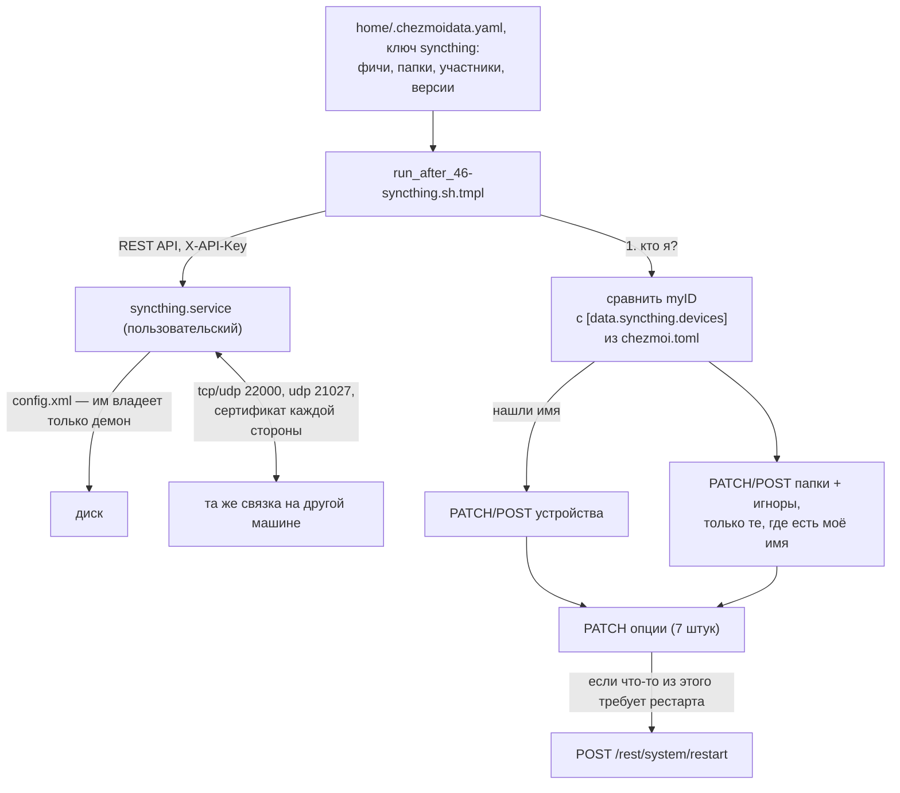

---
covers:
  features: [syncthing, obsidian]
  paths:
    - home/.chezmoiscripts/run_after_46-syncthing.sh.tmpl
---

# Синхронизация заметок и фото

## Что это даёт

На всех машинах, где эта конфигурация установлена, одни и те же заметки: то,
что записал на десктопе, через несколько секунд читается на ноутбуке, и
наоборот. Фотографии с телефона сами скапливаются в отдельной папке на
десктопе — их не нужно скидывать проводом или через мессенджер. Всё это везёт
[Syncthing](https://syncthing.net) — фоновая программа без общего сервера
где-то в интернете: машины находят друг друга напрямую и обмениваются файлами
только между собой.

Заметки открываются в [Obsidian](https://obsidian.md) — обычном редакторе
markdown-файлов; фичи `syncthing` и `obsidian` в
`home/.chezmoidata.yaml` про разные вещи (первая — сам перенос файлов, вторая
— чем их читать), но одна без другой почти бессмысленна, поэтому и документ
на двоих.

## Как это работает



Шаги по порядку, при каждом `chezmoi apply` (скрипт `46-syncthing` —
`run_after_`, а не [`run_onchange_`](glossary.md#run_onchange), и гоняется
всегда, см. «Почему именно так»):

1. Скрипт находит `config.xml` демона (`syncthing paths`, а не жёстко
   зашитый путь — с версии 1.27 путь по умолчанию сменился, см. «Почему путь
   не захардкожен») и, если конфига ещё нет вовсе, создаёт identity машины
   (`syncthing generate`) и печатает её device ID.
2. Убеждается, что `syncthing.service` (пользовательский
   [systemd unit](glossary.md#systemd-unit)) запущен, при необходимости
   включает и стартует его.
3. Достаёт из `config.xml` API-ключ и адрес GUI — это единственное, что
   скрипту нужно прочитать из файла; дальше он говорит с демоном только по
   REST.
4. Дожидается ответа демона (до 30 секунд, по секунде на попытку — на
   холодной машине демону нужно время) и спрашивает `/rest/system/status`
   про свой же device ID.
5. Ищет этот ID в карте `[data.syncthing.devices]` из
   `~/.config/chezmoi/chezmoi.toml` — так скрипт узнаёт, **какая он машина**
   (подробности — «Как машина понимает, кто она» ниже). Не нашёл — печатает
   ID и завершается, ничего больше не трогая.
6. Приводит к каталогу устройства демона (кого он знает), опции демона (что
   разрешено) и папки демона (что и с кем шарится) — каждый блок через
   PATCH существующих записей и POST недостающих.
7. Если что-то из принятого требует перезапуска (демон сам об этом
   сообщает через `/rest/config/restart-required`) — перезапускает.

### Почему конфиг не управляется файлом, а правится через REST

Syncthing переписывает `config.xml` целиком при любом изменении в
собственном веб-интерфейсе. Если бы этим файлом одновременно распоряжался
chezmoi, оба владельца переписывали бы файл друг за другом бесконечно — та
же ошибка, которую `docs/how-it-works.md` разбирает для файлов, которые
генерирует DMS поверх niri. Вместо файла скрипт правит объекты по одному
через REST API демона: устройство, опцию, папку, список игноров — каждый
отдельным вызовом, и только то, что описано в каталоге.

### Как машина понимает, кто она

Не по имени, записанному в файле — такое имя пришлось бы не забыть
перенести при копировании конфига на другую машину, и оно молча соврало бы,
если забыть. Вместо этого скрипт спрашивает у **самого демона** его
device ID (`GET /rest/system/status`, поле `myID`) и ищет совпадение в карте
`[data.syncthing.devices]` (`~/.config/chezmoi/chezmoi.toml`, не в каталоге
фич — см. «Почему device ID не в каталоге фич» ниже). Совпадения нет —
скрипт печатает найденный ID и завершается (`exit 0`) раньше, чем доходит
хоть до одной REST-правки: устройства, опции и папки не трогаются вовсе, ни
одна — без имени невозможно понять, что из каталога вообще относится к этой
машине.

### `|| true` рядом с пайплайнами — и как это связано с `pipefail`

Скрипт открывается строкой `set -euo pipefail`. Здесь важны две части
вместе:

- `-e` — любая команда, вернувшая ненулевой код вне условия (`if`, `&&`,
  `||`), останавливает весь скрипт;
- `pipefail` — код возврата конвейера `a | b | c` — это код **первой**
  команды слева направо, которая вернула не ноль, а не код одной лишь
  последней команды. Без `pipefail` конвейер, где `a` упал, а `b` и `c`
  отработали штатно, вернул бы 0 (код `c`) и провал остался бы незамеченным.

Дальше в шести местах скрипта встречается один и тот же приём:
```sh
API_KEY="$(sed -n 's:.*<apikey>\(.*\)</apikey>.*:\1:p' "$CONF_XML" | head -1 || true)"
```
`|| true` стоит внутри `$( ... )`, после всего конвейера, а не после
присваивания. Присваивание переменной из подстановки команды — это тоже
проверяемая команда: если то, что внутри скобок, вернёт не ноль, `-e` убьёт
скрипт на этой строке, даже без всякого конвейера. Проверено прямо на этой
машине (2026-07-31, изолированный `bash`, ничего из живой системы не
трогалось):
```sh
$ bash -c 'set -euo pipefail; echo before; x="$(false)"; echo after'
before
$ echo $?
1
```
`after` не печатается вовсе — скрипт умер на присваивании. `|| true` в конце
выражения внутри скобок гарантирует, что сама подстановка команды всегда
вернёт 0, что бы ни случилось внутри — а настоящая проверка результата
(«получилось что-то непустое или нет») идёт отдельной строкой сразу после,
через `[[ -n "$ПЕРЕМЕННАЯ" ]] || bail ...` или эквивалент. Без `|| true`
самый частый и самый безобидный повод для ненулевого кода — `grep` или
`sed`, не нашедшие совпадения (это не ошибка данных, это нормальный «пока
такого ещё нет») — останавливал бы весь `chezmoi apply` целиком, а не только
настройку Syncthing. Комментарий в самом скрипте описывает это тем же
образом; сверено с кодом и поведением bash, а не принято на слово.

Все шесть случаев `|| true` в скрипте защищают именно это: три чтения из
`config.xml` (`CONF_XML`, `API_KEY`, `GUI_ADDR`), опрос демона в цикле
ожидания (`myid`, где без защиты первая же неудачная попытка на холодном
демоне убивала бы весь цикл ретраев вместо того, чтобы подождать и
повторить), поиск своего имени (`SELF`) и вычисление того, какие опции
разошлись (`drifted`). Ни один из них не подменяет обработку ошибки — она
идёт следующей строкой; `|| true` только не даёт `set -e` сработать раньше,
чем эта строка выполнится.

## Что ставится и что меняется

| Категория | Путь / пакет | Где | Когда меняется |
|---|---|---|---|
| Пакет | `syncthing`, `curl` | хост | ставятся при выбранной фиче `syncthing`; `curl` перечислен явно, хотя его и так тянут git с pacman, — REST-скрипт зависит от него напрямую |
| Пакет | `obsidian` | хост | ставится при выбранной фиче `obsidian` |
| Файл | нет управляемых | — | `config.xml` Syncthing принадлежит демону целиком, chezmoi его не касается |
| Скрипт | `home/.chezmoiscripts/run_after_46-syncthing.sh.tmpl` → `46-syncthing` | хост | `run_after_` — выполняется на **каждом** `chezmoi apply`, а не только при изменении текста скрипта; чинит устройства, опции, папки и игноры, если что-то разошлось с ветки |
| ufw | входящие `22000/tcp`, `22000/udp`, `21027/udp` | хост | открывается скриптом `run_onchange_before_30-system.sh.tmpl`, веткой `{{- if has "syncthing" .enabled }}`; `run_onchange_`, значит переоткрывается только при изменении текста этой ветки после подстановки шаблона, не на каждом `apply` |
| Служба | `syncthing.service`, пользовательский systemd-юнит | хост | включается и стартуется скриптом `46-syncthing`, если ещё не запущена |
| Конфиг вне chezmoi | `[data.syncthing.devices]` | `~/.config/chezmoi/chezmoi.toml`, по машине | правится руками на каждой машине; в каталоге фич этих данных нет (см. «Почему device ID не в каталоге фич») |

Четыре папки из каталога (`home/.chezmoidata.yaml`, ключ `syncthing.folders`):

| id | путь | тип | участники | версии |
|---|---|---|---|---|
| `kb` | `~/Documents/Notes/kb` | двусторонний | desktop, laptop | ступенчатые |
| `personal` | `~/Documents/Notes/personal` | двусторонний | desktop, laptop, phone | ступенчатые |
| `kb-archive` | `~/Documents/Notes/kb-archive` | двусторонний | desktop, laptop | нет |
| `camera` | `~/Pictures/Camera` | только приём | desktop, phone | нет |

Папка заводится только на тех машинах, что перечислены в её же `devices`:
ноутбука нет в участниках `camera`, поэтому на ноутбуке этой папки не будет
вовсе, а не появится пустой. `id` заданы руками (`kb`, `personal`,
`kb-archive`, `camera`), а не оставлены на волю генератора Syncthing —
приложению на телефоне тот же `id` придётся ввести вручную, и он должен
совпасть посимвольно.

**`camera` — это лоток на входящие, а не архив.** «Только приём» не значит,
что хост игнорирует удаления с телефона — удаление с телефона применяется
здесь как любое другое изменение. Что защищает `receiveonly` — обратное
направление: хост никогда не отправляет свои изменения назад, поэтому фото
можно вручную перенести из `~/Pictures/Camera` в постоянное хранилище, и
галерея телефона этого не заметит. Очистка места в галерее телефона
опустошает и эту папку тоже.

У `personal` в игноре одна строка:
```yaml
ignore:
  - ".obsidian/workspace*.json"
```
(`home/.chezmoidata.yaml`, блок `syncthing.folders`, запись `personal`,
сверено построчно). Остальное содержимое `.obsidian/` — плагины, темы,
настройки — не в игноре и продолжает синхронизироваться: это ровно то, ради
чего хранилище и шарится.

## Как проверить

Все команды ниже — только чтение; никаких POST/PUT/PATCH/DELETE в REST
Syncthing, служба не перезапускается.

Пакеты и служба на месте:
```sh
$ pacman -Q syncthing curl obsidian
$ systemctl --user status syncthing.service
```

Порты действительно открыты (правило появляется один раз, при изменении
текста ветки скрипта `30-system`, не на каждом `apply`):
```sh
$ sudo ufw status | grep -E '22000|21027'
22000/tcp                  ALLOW       Anywhere
22000/udp                  ALLOW       Anywhere
21027/udp                  ALLOW       Anywhere
```

Своя machine-идентичность и список папок демона (использует тот же
API-ключ, что и сам скрипт 46, — только `GET`):
```sh
$ CONF="$(syncthing paths | grep -oE '[^[:space:]]*config\.xml' | head -1)"
$ KEY="$(sed -n 's:.*<apikey>\(.*\)</apikey>.*:\1:p' "$CONF" | head -1)"
$ curl -s -H "X-API-Key: $KEY" http://127.0.0.1:8384/rest/system/status | jq '.myID'
$ curl -s -H "X-API-Key: $KEY" http://127.0.0.1:8384/rest/config/folders | jq -r '.[].id'
```
Второй вызов должен вывести подмножество `kb personal kb-archive camera` —
ровно те id, в чьих `devices` эта машина названа.

Разрешённая ветка шаблона `30-system` рендерится так, как ожидается (только
чтение, `chezmoi execute-template` ничего не применяет):
```sh
$ chezmoi --source . execute-template < home/.chezmoiscripts/run_onchange_before_30-system.sh.tmpl | grep -A3 'Syncthing needs'
```

## Когда сломалось

| Симптом | Причина | Что делать |
|---|---|---|
| В веб-интерфейсе оба устройства видны, но статус вечно `Disconnected` | Входящие порты `22000/tcp`, `22000/udp`, `21027/udp` закрыты в ufw хотя бы на одной стороне — отказ полностью молчаливый, ни ошибки, ни предупреждения | `sudo ufw status \| grep 22000` на обеих машинах; если правил нет — фича `syncthing` не была включена в момент, когда рендерился этот кусок `30-system` (он `run_onchange_`, задним числом не сработает) — добавить правила руками или заново пройти этот блок шаблона |
| Новая асканная фича `syncthing`/`obsidian` не появляется в чеклисте на уже установленной машине | `chezmoi init` без `--prompt` не добавляет новый ключ в уже сохранённый `data.enabled` сам по себе (см. запись в `docs/workarounds.md` про `chezmoi#2184`) | вписать `syncthing: true` и `obsidian: true` в `data.enabled` внутри `chezmoi.toml` руками, затем `chezmoi apply` |
| `run_after_zz-next-steps` пишет, что машина не в карте устройств | Device ID этой машины ещё не вписан в `[data.syncthing.devices]` — либо впервые, либо после переустановки, когда identity сгенерировалась заново | добавить строку с ID (next-steps его печатает) на **всех** уже работающих машинах и применить `chezmoi apply` там тоже — это единственный шаг всей настройки, где действие на одной машине требует действия на другой |
| Папка не появляется на новой машине | Имя машины ещё не вписано в `devices` этой папки в `home/.chezmoidata.yaml`, либо `chezmoi apply` там ещё не прогонялся после правки карты устройств | сверить `syncthing.folders[].devices` в каталоге и повторить `chezmoi apply` |
| Файлы `*.sync-conflict-*` появляются в хранилище заметок | Правка одного и того же файла на двух машинах до того, как они успели связаться и обменяться (или конфликт `.obsidian/workspace.json`, если игнор ещё не применился) | разбирать через навык `kb-curate`, не удалять вслепую — `run_after_zz-next-steps` перечисляет такие файлы явно |
| Заметки в хранилище на одной машине не совпадают с другой, хотя Syncthing показывает всё синхронизированным | Путь хранилища `kb` в каталоге разошёлся с путём, который на самом деле использует `claudefiles` (см. «Развилка с путём хранилища» ниже) | сравнить `~/.config/claudefiles/secrets.json`, поле `kb.vault_path`, с путём папки `kb` в `home/.chezmoidata.yaml` — `run_after_zz-next-steps` делает это сравнение сам и печатает оба пути, если они разошлись |
| На телефоне вместо ожидаемой папки появилась вторая, пустая, с похожим именем | Опечатка при вводе id папки в приложении — Syncthing не считает это ошибкой, а тихо создаёт новый несвязанный id | удалить неверную папку в приложении, ввести id заново, посимвольно как в каталоге |

## Почему именно так

### `run_after_`, а не `run_onchange_`

Настройки Syncthing можно сбить прямо из его собственного веб-интерфейса.
`run_onchange_`-скрипт следит только за текстом самого себя после
подстановки шаблона — сбитую руками настройку он не заметит и не
перезапустится, пока не поменяется сам скрипт. `run_after_` перепроверяет
состояние демона на каждом `apply` и молча ничего не делает, если всё уже
совпадает с каталогом — то же решение, что и у скрипта настроек Handy
(`docs/voice.md`).

### Почему путь `config.xml` не захардкожен

Начиная с версии 1.27 Syncthing путь по умолчанию сменился на
`$XDG_STATE_HOME/syncthing`; машина, где он был установлен раньше, всё ещё
хранит конфиг в `~/.config/syncthing`, а флаг `--config` или переменная
`STCONFDIR` перебивают оба варианта. Скрипт спрашивает путь у самого
демона (`syncthing paths`), а не угадывает его. Ошибка здесь не была бы
громкой: `syncthing generate` при неверно угаданном пути создал бы **вторую**
identity рядом с настоящей, и машина начала бы объявлять сети device ID,
которого ни один пир не знает.

### Почему демон только на хосте, без копии в каждом контейнере

distrobox уже монтирует всё дерево домашней папки хоста внутрь контейнера,
поэтому папка, синхронизированная на хосте, сама становится видна и в
`digi3`, и в `stellium`, и в `personal`. На этом уже стоит кое-что вне этого
документа: собственный индекс базы знаний агентов,
`~/system/.claude/rules/machine-index.md`, — это симлинк внутрь хранилища, и
он разрешается в один и тот же файл что с хоста, что изнутри контейнера.
Демон в каждом контейнере переносил бы те же самые байты ещё раз, завёл бы
свою identity и свой порт, и ему пришлось бы пробивать дырку в собственном
[network namespace](glossary.md#network-namespace) контейнера ради этого —
а выигрыш от этого нулевой.

### Почему пользовательский сервис, а не системный

`syncthing.service` читает `~/Documents` — системный юнит для этого не
годится, ему нужны бы были права конкретного пользователя. Прямое следствие:
включённая, но не залогиненная машина не синхронизируется —
пользовательские юниты systemd не запускаются, пока нет активной сессии
этого пользователя. `loginctl enable-linger` снимает это ограничение; в
этом репозитории он сознательно не включён.

### Почему открытый порт — не открытая дверь

`30-system` открывает три порта без привязки к конкретному сетевому
интерфейсу — `allow in on tailscale0` читался бы аккуратнее, но ломался бы
тихо: имя интерфейса не гарантировано, а домашняя сеть меняется. Открытый
порт здесь не означает, что кто угодно может подключиться: Syncthing
проверяет сертификат подключающегося устройства на каждой попытке связи и
отклоняет всё, о чём не было заранее сказано через device ID.

### Почему device ID не в каталоге фич

`home/.chezmoidata.yaml` — файл этого репозитория, который лежит в открытом
виде. Device ID — устойчивый идентификатор конкретной существующей машины;
опубликовать его вместе с адресом и вместе с тем, сколько всего таких машин,
значит отдать корреляцию бесплатно, ничего не получив взамен. Поэтому
устройства с их ID и адресами живут не в каталоге, а в
`~/.config/chezmoi/chezmoi.toml` — локальном файле каждой машины, которого в
git нет.

### Развилка с путём хранилища, который принадлежит другому репозиторию

Путь папки `kb` (`~/Documents/Notes/kb`) в этом каталоге не совпадает
случайно с путём, который в реальности наполняет другой репозиторий,
`claudefiles`, — тем, что реально кладёт туда файлы базы знаний агентов.
После того как оба репозитория настроены, один и тот же путь существует «с
двух концов»: `claudefiles` пишет и читает хранилище по своему собственному
пути, а этот репозиторий синхронизирует папку с тем же именем рядом.
Разойтись эти два пути могут молча — первый заметный симптом такого
расхождения не ошибка, а пустое хранилище на другой машине, хотя обе
стороны выглядят настроенными и здоровыми. Что именно `claudefiles` хранит
внутри этого пути и как он его получает — вопрос другого репозитория, здесь
не разбирается. Сверку путей этот документ тоже не выполняет: она — часть
чеклиста `run_after_zz-next-steps.sh.tmpl`, который на каждом `apply`
сравнивает путь из `~/.config/claudefiles/secrets.json` (`kb.vault_path`) с
путём папки `kb` из каталога и печатает оба, если они разошлись.

## Ссылки

- [docs/workarounds.md](workarounds.md) — обход с игнором
  `.obsidian/workspace*.json`, разобран там строкой.
- `home/.chezmoidata.yaml`, ключ `syncthing` — сам каталог папок, комментарии
  про `camera` и про игнор Obsidian.
- `home/.chezmoiscripts/run_onchange_before_30-system.sh.tmpl` — ветка,
  открывающая порты для Syncthing.
- `home/.chezmoiscripts/run_after_zz-next-steps.sh.tmpl` — полный чеклист
  диагностики: незалогиненное устройство, закрытый порт, конфликтные файлы,
  расхождение пути хранилища.
- [README.md, раздел Sync](../README.md#sync) — таблица папок, шаги «New
  machine» и «Phone».
- [docs/glossary.md](glossary.md) — термины:
  [systemd unit](glossary.md#systemd-unit),
  [`run_onchange`](glossary.md#run_onchange),
  [network namespace](glossary.md#network-namespace).
- Коммиты этого репозитория: `b619a21` (поиск демона и identity машины),
  `e91bfe9` (устройства и опции), `45c8783` (папки, версии, игноры),
  `290c1ea`, `e8d76b0`, `108710e` (защита каждого присваивания от `set -e` +
  `pipefail`, честность чеклиста при выключенном демоне).
