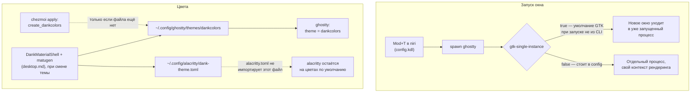

---
covers:
  features: []
  paths:
    - home/dot_config/ghostty/config
    - home/dot_config/ghostty/themes/create_dankcolors
    - home/dot_config/alacritty/alacritty.toml
---

# Терминал: Ghostty и Alacritty

## Что это даёт

Окно, где печатаются команды, в этом репозитории — [Ghostty](https://ghostty.org).
`Mod+T` в niri открывает новое окно, и это всегда новая, полностью отдельная
программа в системе, а не вкладка старой: если в одном окне идёт что-то
тяжёлое (агент печатает длинный ответ), остальные окна это не тормозит — они
не делят между собой ни память, ни видеопамять.

Цвета терминала не выбираются руками и не лежат в этом репозитории: они
рисуются автоматически под текущую тему рабочего стола и меняются сами, когда
меняется тема (сама генерация — тема `desktop.md`; здесь только то, куда
результат попадает и почему).

Второй терминал, Alacritty, ничего не делает сам по себе: его не открывает ни
одна горячая клавиша, он существует просто как альтернатива на случай, если с
Ghostty что-то не так.

## Как это работает



### Каждое окно — свой процесс

Ghostty на Linux — приложение GTK, а GTK-приложения по умолчанию умеют режим
«одного экземпляра»: если он включён, второй запуск не создаёт новый
[процесс](glossary.md#процесс), а просто просит уже работающий процесс открыть
ещё одно окно и сам завершается. По документации самого Ghostty этот режим
включается автоматически именно тогда, когда программа запущена не из CLI —
то есть как раз через `.desktop`-файл или бинд композитора, а не из уже
открытого терминала (`ghostty.org/docs/help/gtk-single-instance`).

В `home/dot_config/ghostty/config` это умолчание явно выключено:

```
gtk-single-instance = false
```

С этой строкой каждый вызов Ghostty — независимо от того, как он запущен —
получает отдельный процесс с собственным контекстом рендеринга, а не окно
внутри чужого. Старая версия README формулировала последствие жёстче: «одно
окно с тяжёлым выводом душит остальные четыре». Это правдоподобное следствие
модели «один процесс на все окна» (общий цикл обработки событий когда-то
должен обслужить и тяжёлое окно, и остальные), но в этом репозитории оно не
измерено: замерять его запуском тяжёлого вывода в открытых окнах этой машины
нельзя, а старая раскладка (по которой можно было бы сравнить) не сохранилась.
Здесь это подаётся как правдоподобная, а не проверенная причина — подробнее в
разделе «Почему именно так» ниже.

Ровно то же самое переключение важно и для мультиплексора: `herdr`
(`multiplexer.md`) держит по одной панели на рабочий контекст в отдельных
окнах Ghostty, и параллельные агенты в них не делят один процесс именно
благодаря этой строке.

Отдельно от процесса — сам композитор: niri рисует собственные рамки окон, и
GTK-титульная строка в плиточной сессии не нужна (`window-decoration = none`).
Правило `home/dot_config/niri/config.kdl`, блок `match app-id="com.mitchellh.ghostty"`
рядом с `wezterm`/`Alacritty`/`kitty`, отключает ещё и фон рамки
(`draw-border-with-background false`) для той же группы терминальных
приложений.

### Откуда берутся цвета

DankMaterialShell — оболочка рабочего стола (`desktop.md`) — считает палитру
через `matugen` при каждой смене темы и перезаписывает файлы конкретных
приложений; `matugenTemplateGhostty` и `matugenTemplateAlacritty` в
`home/dot_config/DankMaterialShell/settings.json` включают этот рендер для
обоих терминалов. Результат для Ghostty ложится в
`~/.config/ghostty/themes/dankcolors`, и `config` ссылается на него по имени:

```
theme = dankcolors
```

Ghostty ищет тему по этому имени сразу при старте, значит файл обязан
существовать ещё до первого запуска DMS — на свежей машине его никто пока не
сгенерировал. Отсюда `home/dot_config/ghostty/themes/create_dankcolors`:
имя файла в исходном дереве chezmoi несёт префикс-атрибут `create_`, и его
смысл точный, а не описательный: по документации chezmoi (`chezmoi.io/reference/target-types/`)
файл с `create_` создаётся в целевом состоянии из содержимого источника
**только если целевого файла ещё нет**; если он уже существует — chezmoi
оставляет содержимое как есть навсегда, при каждом следующем `apply`. Ровно
это и происходит здесь: на чистой машине `chezmoi apply` кладёт заготовку (в
источнике это четыре строки комментария — валидная, но пустая тема, Ghostty в
этом случае просто откатывается на цвета по умолчанию), а как только DMS хоть
раз перезапишет `~/.config/ghostty/themes/dankcolors` настоящей палитрой,
чужого письма это место больше не увидит: `chezmoi apply` находит файл на
месте и не трогает его содержимое ни разу после. Так chezmoi и matugen не
переписывают друг друга по кругу — они пишут в один и тот же путь не более
одного раза каждый, и в разное время. Живая проверка этого механизма — ниже, в
разделе «Как проверить».

У Alacritty параллели с этим механизмом нет вообще: в исходном дереве
chezmoi нет файла-заготовки под `~/.config/alacritty/dank-theme.toml` — DMS
создаёт его с нуля сама, chezmoi этот путь не знает и не управляет им. Так
получилось не просто потому, что про Alacritty «забыли»: `alacritty.toml`
никогда не ссылается на файл темы по имени (в отличие от `theme = dankcolors`
у Ghostty), поэтому Ghostty падает на пустом месте без заготовки, а
Alacritty — нет, ему без темы просто ничего не грозит на старте. Но обратная
сторона того же факта: раз `alacritty.toml` не содержит `import` на
сгенерированный файл, matugen-палитра для Alacritty создаётся, но никогда не
подключается — подробнее в «Когда сломалось» и «Почему именно так».

### Alacritty как запасной терминал

`home/dot_config/alacritty/alacritty.toml` в этом репозитории — три строки, и
все три про одно и то же: `Shift+Enter` вставляет символ новой строки, а не
отправляет команду (тот же приём, что и `keybind = shift+enter=text:\n` у
Ghostty, нужен для многострочного ввода в CLI агентов). Ни автозапуска, ни
темы, ни собственного набора горячих клавиш поверх этой строки в конфиге нет:
единственная кнопка, которая его открывает, — сам бинарник `alacritty` из
командной строки или ярлыка, руками.

Пакет `alacritty` не объявлен ни в одной фиче `home/.chezmoidata.yaml` —
поиск по всему файлу ничего не находит. Значит `chezmoi apply` кладёт файл
конфига в любом случае (он часть безусловной фичи `desktop`, `always: true`),
но откуда на машине берётся сам бинарник `alacritty` — вне области, которую
этот репозиторий отслеживает; это надо ставить отдельно, репозиторий этого
не делает.

## Что ставится и что меняется

| Категория | Путь / пакет | Когда |
|---|---|---|
| Пакет `ghostty` | `pacman`, фича `desktop` (`always: true`, `scope: host`) | `run_onchange_before_20-packages.sh.tmpl` |
| Пакет `alacritty` | не объявлен ни в одной фиче `.chezmoidata.yaml` | не ставится этим репозиторием |
| `~/.config/ghostty/config` | конфиг терминала: `gtk-single-instance = false`, `theme = dankcolors`, шрифт, отступы, `keybind` для копирования/вставки и `shift+enter` | этап «Файлы» каждого `chezmoi apply` |
| `~/.config/ghostty/themes/dankcolors` | заготовка (`create_`) кладётся один раз, если файла ещё нет; дальше файл целиком в руках DMS/matugen | этап «Файлы», только при первом создании |
| `~/.config/alacritty/alacritty.toml` | биндинг `Shift+Enter`, без темы, без импорта сгенерированного файла | этап «Файлы» каждого `chezmoi apply` |
| `~/.config/alacritty/dank-theme.toml` | генерируется DMS/matugen при смене темы; в исходном дереве chezmoi этого пути вообще нет | вне этого репозитория |

## Как проверить

Что реально стоит в конфиге на этой машине (только отличия от дефолта
Ghostty, без запуска нового окна):

```sh
$ ghostty +show-config --changes-only | grep -E 'gtk-single-instance|^theme'
theme = dankcolors
gtk-single-instance = false
```

Файл темы Ghostty уже переписан matugen, а не остался заготовкой из
репозитория (если в выводе — палитра из hex-цветов, а не четыре строки
комментария про placeholder, механизм `create_` отработал так, как описано
выше):

```sh
$ head -3 ~/.config/ghostty/themes/dankcolors
background = #fef7ff
foreground = #1d1b20
cursor-color = #6750a4
```

Файл темы для Alacritty тоже сгенерирован, но `alacritty.toml` его не
подключает — сравни оба факта:

```sh
$ grep -c import ~/.config/alacritty/alacritty.toml
0
$ ls -la ~/.config/alacritty/dank-theme.toml
-rw-r--r-- 1 stsiapan stsiapan 530 ...  dank-theme.toml
```

Пакет `alacritty` действительно нигде не заявлен в каталоге фич:

```sh
$ grep -c alacritty home/.chezmoidata.yaml
0
```

`.chezmoiignore` не содержит ни одной строки про ghostty или alacritty — оба
пути идут безусловно, потому что несущая их фича `desktop` помечена
`always: true` и никаким чеклистом не выключается:

```sh
$ grep -in 'ghostty\|alacritty' home/.chezmoiignore
```
Ожидаемый вывод: пусто.

Критерий готовности этого документа:

```sh
tools/gen-catalog.sh --check | grep -E 'ghostty|alacritty'
```
Ожидаемый вывод: пусто.

## Когда сломалось

| Симптом | Причина | Что делать |
|---|---|---|
| `Mod+T` каждый раз открывает как будто одно и то же окно, а не новое | Строка `gtk-single-instance = false` пропала из конфига, либо запуск идёт таким путём, что Ghostty снова решает, что это не CLI | `ghostty +show-config --changes-only \| grep gtk-single-instance` — пусто или `true` означает возврат к умолчанию GTK |
| Ghostty не подхватывает цвета новой темы | DMS/matugen ещё ни разу не отрендерил `~/.config/ghostty/themes/dankcolors` на этой машине (свежая установка) | Переключить тему в DMS один раз; проверить `matugenTemplateGhostty` в `home/dot_config/DankMaterialShell/settings.json` |
| Alacritty никогда не меняет цвета вслед за темой, сколько тему ни переключай | `alacritty.toml` не содержит `import` на `~/.config/alacritty/dank-theme.toml` — файл генерируется, но не подключён | Добавить вручную `[general]` / `import = ["~/.config/alacritty/dank-theme.toml"]`; в этом репозитории такой строки пока нет |
| На машине нет бинарника `alacritty` | Пакет не объявлен ни в одной фиче `.chezmoidata.yaml` | Поставить `alacritty` вручную (`pacman -S alacritty`) |
| Копирование/вставка (`Ctrl+Shift+C`/`V`) не работает при русской раскладке | Биндинги завязаны на физический код клавиши (`KeyC`/`KeyV`), а не на символ — если раскладка (`keyboard.md`) настроена не так, как ожидает конфиг, код может транслироваться иначе | Проверить раскладку по `keyboard.md` |

## Почему именно так

**`gtk-single-instance = false` — это не обход бага, а сознательный отказ от
задокументированного умолчания GTK.** Сам проект Ghostty называет режим
одного экземпляра «идиоматичным способом, каким полагается вести себя
официальным приложениям Gnome» (`ghostty.org/docs/help/gtk-single-instance`).
Строка в `config` явно отключает именно это умолчание, а не чинит
недокументированное поведение — оценка «баг или нет» здесь предельно
однозначна: это не баг.

**Про «одно тяжёлое окно душит остальные четыре» см. раздел «Как это
работает» выше** — правдоподобно, но не измерено на этой машине, и старая
формулировка из README сюда переносится с этой оговоркой, а не как факт.

**`create_dankcolors` — это не защита от гипотетического конфликта, а
единственный работающий способ дать chezmoi и DMS писать в один путь и не
затирать друг друга.** Обычный (не `create_`) файл chezmoi переписывает на
каждом `apply` — если бы `dankcolors` был обычным managed-файлом с реальной
палитрой в источнике, DMS перезаписывала бы его в промежутках между
`apply`, а следующий `apply` откатывал бы палитру обратно к той, что лежит в
репозитории. `create_` разрывает этот цикл: chezmoi пишет ровно один раз, при
условии что целевого файла ещё нет, и после первой записи DMS — единственный,
кто когда-либо трогает этот путь.

**У Alacritty параллельного `create_`-файла нет, и это не недосмотр, а прямое
следствие того, что `alacritty.toml` не ссылается на тему по имени.** Ghostty
падает на пустом месте без заготовки, потому что `theme = dankcolors`
резолвится сразу при старте; `alacritty.toml` вообще не содержит команды
типа `import`, поэтому ему нечего резолвить и не от чего защищаться. Но по
этой же причине сгенерированная DMS палитра для Alacritty сейчас нигде не
используется — это открытый, неисправленный на сегодня разрыв между тем, что
`matugenTemplateAlacritty: true` генерирует, и тем, что реально читает
Alacritty.

**Пакет `alacritty` не объявлен ни в одной фиче — граница ответственности
этого репозитория здесь заканчивается на конфиге.** `desktop` — фича
`always: true`, значит её пакетный список ставится безусловно на каждом
хосте, но `alacritty` в этом списке просто нет: конфиг развернётся, а
бинарник — нет, если его не поставить отдельно.

## Ссылки

- [ghostty.org/docs/help/gtk-single-instance](https://ghostty.org/docs/help/gtk-single-instance) — что такое GTK single instance mode, когда он включается по умолчанию и что делает `gtk-single-instance = false`.
- [chezmoi.io/reference/target-types/](https://www.chezmoi.io/reference/target-types/) — точная семантика префикса `create_`: создаёт файл, только если целевого ещё нет, и не трогает его дальше.
- [danklinux.com/docs/dankmaterialshell/application-themes](https://danklinux.com/docs/dankmaterialshell/application-themes) — что генерирует matugen для Ghostty и Alacritty и почему Alacritty, в отличие от Ghostty, требует ручной строки `import`.
- [desktop.md](desktop.md) — niri, DankMaterialShell и сама генерация темы через matugen.
- [multiplexer.md](multiplexer.md) — herdr держит панели рабочих контекстов в отдельных окнах Ghostty.
- [keyboard.md](keyboard.md) — раскладка клавиатуры, от которой зависят биндинги копирования/вставки по физическому коду клавиши.
