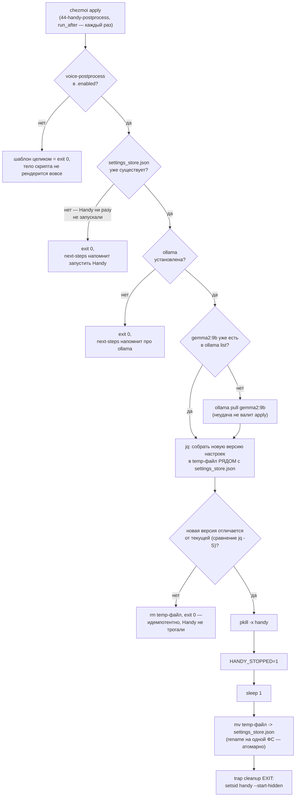

---
covers:
  features: [voice-postprocess]
  paths:
    - home/.chezmoiscripts/run_after_44-handy-postprocess.sh.tmpl
---

# Вычитка диктовки локальной моделью

## Что это даёт

[Голосовой ввод](voice.md) распознаёт речь и печатает текст. Эта, необязательная,
фича добавляет один шаг между «распознал» и «напечатал»: готовый текст ещё раз
прогоняется через другую модель, которая работает не со звуком, а с текстом —
расставляет точки и запятые, склеивает обрывки в предложения, ничего не выдумывая
от себя. Всё происходит на этой же машине, ничего никуда не уходит по сети.

Ради чего это вообще нужно. Whisper (модель, которая распознаёт речь в
[voice.md](voice.md)) решает, будет ли в расшифровке пунктуация, один раз — по
первому произнесённому слову каждого 30-секундного куска записи — и держится
этого решения до конца именно этого куска. Повлиять на это в моменте нельзя:
решение уже принято и держится дальше само. Из-за этого заметная доля диктовок
возвращается сплошным текстом без единой точки или запятой, а на длинных
диктовках граница между кусками иногда видна прямо в тексте — до неё пунктуации
нет, после — есть.

Вычитка заходит с другой стороны: она не трогает звук вообще, а читает уже
готовый, полностью распознанный текст целиком и расставляет знаки препинания
по смыслу всего текста, а не по тому, что происходило в первые доли секунды
записи. Границы 30-секундных кусков к этому моменту уже не существуют как
понятие — вычитка их просто не видит.

Фича необязательная и требует уже включённой `voice` (`needs: [voice]` в
`home/.chezmoidata.yaml`) — без распознавания вычищать нечего. По умолчанию
выключена: модель весит около 5.4 ГБ, а автовключение фичи, у которой есть
`needs`, потянуло бы за собой `voice` на каждую машину, включая те, где нет
микрофона.

Какая клавиша при этом что делает — в таблице горячих клавиш
[voice.md](voice.md#горячие-клавиши), она одна на обе фичи и здесь не
дублируется: вторая строка той таблицы существует только благодаря этой фиче.

Один и тот же результат вычитки для одной и той же диктовки не гарантирован —
почему именно, с цифрами, в «Почему именно так» ниже. И на случай, если вычитка
всё-таки испортит текст, исходная, нетронутая расшифровка никуда не девается —
об этом тоже там.

## Как это работает



Во время самой диктовки (не во время `apply`) путь другой и он короче: готовый
текст от Whisper уходит на `127.0.0.1:11434` — это адрес модели `gemma2:9b` под
`ollama-vulkan`, поднятой как `ollama.service` — и оттуда возвращается уже
вычищенным; это одна из веток общей схемы в [voice.md](voice.md#как-это-работает).
Всё, что ниже, — про то, что происходит не во время диктовки, а на каждом
`chezmoi apply`: как это `127.0.0.1:11434` и всё остальное вообще попадает в
настройки Handy.

Шаги патча настроек, по коду `run_after_44-handy-postprocess.sh.tmpl`:

1. Шаблон целиком проверяет одно условие в самом начале файла:
   `{{- if not (has "voice-postprocess" .enabled) }} exit 0 {{- else }} ...`.
   Если фича не выбрана, весь остальной код скрипта в готовый файл даже не
   попадает — на диске оказывается однострочный `exit 0`.
2. Файл `settings_store.json` — собственность Handy: он пишет его целиком из
   своего UI при любом изменении настроек. chezmoi не может владеть им как
   обычным управляемым файлом — оба тогда переписывали бы друг друга бесконечно,
   та же ошибка, которую в этом репозитории уже разобрали для генерируемых DMS
   инклюдов niri. Поэтому вместо владения файлом целиком скрипт патчит через
   `jq` только одиннадцать конкретных ключей (список — ниже, в «Что ставится и
   что меняется»).
3. Скрипт называется `run_after_`, а не [`run_onchange_`](glossary.md#run_onchange):
   `run_onchange` перезапускается только тогда, когда меняется текст самого
   скрипта, поэтому настройка, сброшенная из UI Handy, никогда бы не
   восстановилась сама. `run_after_` перепроверяет состояние на каждом
   `apply` и ничего не делает, если ничего не разошлось — поэтому
   перезапуск Handy (шаг 8 ниже) на практике редок.
4. Если `settings_store.json` ещё не существует (Handy ни разу не запускали) —
   скрипт молча выходит: `chezmoi apply` не должен падать из-за того, что
   пользователь ещё не сделал ручной шаг, обязательный после установки Handy
   (см. [voice.md](voice.md)); об этом напомнит `run_after_zz-next-steps`.
5. Если `ollama` не установлена — тоже молчаливый выход, по той же причине.
   Если модель `gemma2:9b` не найдена в `ollama list` — скрипт сам вызывает
   `ollama pull gemma2:9b`, но неудача здесь не валит весь `apply` (`chezmoi`
   не должен зависеть от того, доступен ли реестр моделей прямо сейчас):
   `next-steps` отдельно сообщает, если вычитка осталась без весов.
6. Дальше собирается желаемое состояние: строится промпт (см. «Промпт
   вычитки» ниже) и через `jq` — новая версия JSON, целиком, в **новый
   временный файл**, а не поверх `settings_store.json`. Оба массива, которые
   скрипт трогает, опознают нужный элемент по `id`, а не по позиции в
   массиве — это массивы объектов, порядком которых владеет Handy, и порядок
   может измениться между версиями, — но делают это разными средствами `jq`:
   `post_process_providers` проходит через `if .id == "custom" then .base_url
   = ... else . end`, оставляя все элементы массива на месте и меняя только
   нужный; `post_process_prompts`, наоборот, использует `select(.id !=
   $d.pid)`, чтобы отбросить старую запись вычитки перед тем, как добавить
   новую. Комментарий в самом скрипте здесь неточен — он говорит про
   `post_process_providers`, что «the base_url is reached by `select()`
   rather than by index», хотя `select()` в коде ниже применён к другому
   массиву; код и комментарий разошлись, и здесь описан код. Оба массива
   (`post_process_providers`, `post_process_prompts`) при сборке подстрахованы
   `// []`: смена схемы Handy
   или наполовину записанный файл настроек иначе оборвали бы скрипт ошибкой
   `Cannot iterate over null` вместо того, чтобы просто пересобрать массив с
   нуля. Важная ловушка, задокументированная прямо в комментарии скрипта:
   все ключи патчатся под путём `.settings...`, и если по ошибке написать в
   корень документа — `jq` об этом не сообщит, просто добавит новый, никем не
   читаемый ключ, а Handy продолжит жить со старым значением.
7. Новая версия сравнивается со старой (`jq -S` — то есть сравнение
   нормализованного, отсортированного по ключам JSON, а не байт в байт) —
   если они совпадают, временный файл удаляется и скрипт выходит, ничего не
   трогая.
8. Если версии отличаются — только теперь скрипт останавливает Handy
   (`pkill -x handy`), ждёт секунду и переносит временный файл поверх
   `settings_store.json`. Три детали этого шага разобраны отдельно в «Почему
   именно так» — каждая когда-то была багом.

## Что ставится и что меняется

| Категория | Что | Где | Когда меняется |
|---|---|---|---|
| Пакет (репозиторий) | `ollama-vulkan` | хост | ставится `20-packages`, если выбрана `voice-postprocess` |
| Сервис | `ollama.service` | хост | включается и стартуется в `run_onchange_before_30-system.sh.tmpl` (комментарий в коде: «иначе фича ничего не делает до следующей перезагрузки», та же логика, что у `tailscaled`) |
| Модель (веса) | `gemma2:9b`, около 5.4 ГБ | хранилище ollama | скачивается самим скриптом 44 через `ollama pull`, если отсутствует в `ollama list`; неудача не валит `apply` |
| Файл (правится, не создаётся с нуля) | `~/.local/share/com.pais.handy/settings_store.json` | хост | патчится `run_after_44-handy-postprocess.sh.tmpl` на **каждом** `chezmoi apply`, но не создаётся им — существует только после первого ручного запуска Handy |
| Скрипт | `home/.chezmoiscripts/run_after_44-handy-postprocess.sh.tmpl` → `44-handy-postprocess` | хост | `run_after` — выполняется на каждом `apply`; при невыбранной `voice-postprocess` рендерится в однострочный `exit 0` |

Одиннадцать ключей, которые скрипт патчит внутри `.settings` (сверено с кодом
функции `patch()`):

| Ключ | Что туда пишется |
|---|---|
| `post_process_enabled` | `true` |
| `post_process_provider_id` | `"custom"` |
| `post_process_models.custom` | `"gemma2:9b"` |
| `post_process_providers` (запись с `id: "custom"`) | `base_url = "http://127.0.0.1:11434/v1"` |
| `post_process_prompts` | старая запись с `id: "dotfiles_ru_cleanup"` (если была) убирается и добавляется заново — промпт вычитки, см. ниже |
| `post_process_selected_prompt_id` | `"dotfiles_ru_cleanup"` |
| `history_limit` | `100` |
| `experimental_enabled` | `true` |
| `paste_method` | `"external_script"` |
| `external_script_path` | `"~/bin/handy-type.sh"` |
| `overlay_style` | `"none"` |

Ловушка, отмеченная прямо в коде: последние три ключа (`paste_method`,
`external_script_path`, `overlay_style`) к постобработке текста отношения не
имеют вообще — это настройки печати и оверлея, разобранные в
[voice.md](voice.md). Они живут в этом же скрипте только потому, что это
единственное место в репозитории, которое вообще трогает настройки Handy. Из
этого прямо следует состояние машины с одной только `voice`, без
`voice-postprocess`: файл `~/bin/handy-type.sh` раскладывается всегда, любой
машине, безусловно (`home/bin/executable_handy-type.sh` не несёт суффикса
`.tmpl`) — а вот **указание Handy им пользоваться** приходит только из этого
скрипта, который на такой машине целиком превращается в `exit 0` и никогда не
запускается по-настоящему. Иными словами: скрипт печати есть, а команды его
использовать — нет, пока не выбрана `voice-postprocess`.

## Как проверить

Все команды ниже — только чтение: ничего не пишут, не посылают процессу Handy
никаких сигналов и не запускают генерацию через `ollama`.

Пакет и сервис на месте (ожидаемый вывод — на машине, где `voice-postprocess`
выбрана):
```sh
$ pacman -Q ollama-vulkan
ollama-vulkan <версия>
$ systemctl is-enabled ollama.service && systemctl is-active ollama.service
enabled
active
```

Модель загружена:
```sh
$ ollama list | grep gemma2:9b
gemma2:9b   ...
```

Настройки Handy патчатся так, как описывает `patch()` в скрипте — все 11
ключей за один взгляд (`settings_store.json` только читается):
```sh
$ python3 -c "
import json
s = json.load(open('$HOME/.local/share/com.pais.handy/settings_store.json'))['settings']
for k in ('post_process_enabled','post_process_provider_id','post_process_models',
          'post_process_selected_prompt_id','history_limit','experimental_enabled',
          'paste_method','external_script_path','overlay_style'):
    print(k, '=', json.dumps(s.get(k))[:120])
"
```

**Живая проверка на этой машине (2026-07-31) — и находка.** `voice-postprocess`
здесь не выбрана (согласуется с проверкой в [voice.md](voice.md#горячие-клавиши)):
`ollama` не установлена вовсе (`pacman -Q ollama-vulkan` → «not found», команды
`ollama`/`ollama list`/`ollama ps` нет в `PATH`), значит скрипт 44 сейчас на
этой машине — буквально `exit 0` и не делает ничего. Но живое чтение того же
`settings_store.json` показывает не «всё по умолчанию», а смешанное
состояние: пять из одиннадцати ключей уже стоят ровно в тех значениях, которые
поставил бы этот скрипт (`history_limit=100`, `experimental_enabled=true`,
`paste_method="external_script"`, `external_script_path` указывает на
`handy-type.sh`, `overlay_style="none"`), а шесть ключей, отвечающих
конкретно за постобработку, — в дефолтах самого Handy, не в желаемых:
`post_process_enabled=false` (не `true`), `post_process_provider_id="openai"`
(не `"custom"`), `post_process_selected_prompt_id=null` (не
`"dotfiles_ru_cleanup"`), а `post_process_prompts` содержит только
встроенный промпт Handy `default_improve_transcriptions` — записи
`dotfiles_ru_cleanup` в нём нет вовсе. Самое похожее на правду объяснение:
этот скрипт когда-то на этой машине уже отработал целиком (иначе откуда
взялись пять совпадающих значений), а конкретно постобработку кто-то потом
выключил и переключил из собственного UI Handy — тот путь трогает только
панель постобработки и не касается `paste_method`/`overlay_style`/
`history_limit`. Разошлось развёрнутое состояние с тем, что скрипт намерен
делать при активной фиче — ожидаемо, раз сама фича сейчас не выбрана, но стоит
знать: `chezmoi apply` этого не видит и не чинит, пока `voice-postprocess` не
вернётся в `.enabled`.

## Когда сломалось

| Симптом | Причина | Что делать |
|---|---|---|
| Диктовка возвращается совсем без знаков препинания, хотя фича выбрана | `ollama.service` не запущен, модель не скачана, либо `voice-postprocess` фактически не в `.enabled` на этой машине | `systemctl is-active ollama.service`; `ollama list \| grep gemma2:9b`; проверить вывод `run_after_zz-next-steps` — он отдельно сообщает про оба случая |
| Первая диктовка после паузы вычитывается заметно дольше остальных | Ollama выгружает простаивающую модель из памяти через 5 минут (`OLLAMA_KEEP_ALIVE` не задан — используется дефолт самой ollama) | Не поломка. Поднять `OLLAMA_KEEP_ALIVE`, если это мешает — ценой ~6 ГБ видеопамяти, удерживаемой между диктовками, а не освобождаемой |
| Одна и та же диктовка вычищается по-разному при повторных попытках | Недетерминизм: приложение не посылает `temperature` в запрос, модель сэмплирует заново каждый раз, см. «Почему именно так» | Не поломка. Повторное нажатие — новый сэмпл, а не повтор того же; обычно чище |
| Настройки Handy откатились к дефолтам самого приложения (`post_process_provider_id="openai"`, промпт `Improve Transcriptions`) | Патчатся только на `apply`; если настройки сбросили из UI Handy или переустановкой, а `chezmoi apply` с тех пор не запускали — расхождение остаётся до следующего `apply` | `chezmoi apply`; сверить `settings_store.json` по таблице одиннадцати ключей выше |
| `chezmoi apply` падает прямо на скрипте 44 | `settings_store.json` повреждён (невалидный JSON) — тогда `patch()` падает на чтении `$1` **до** того, как Handy вообще тронули, файл на диске остаётся прежним | `jq . ~/.local/share/com.pais.handy/settings_store.json` — если ошибка парсинга, восстановить файл (переустановка Handy пересоздаст дефолтный) |
| После `apply` Handy пропал из трея и не появился обратно | Скрипт остановил его (`pkill -x handy`) для замены файла и должен был перезапустить сам через `trap cleanup EXIT`, но что-то помешало команде `setsid handy --start-hidden` (например, окружение сессии) | `handy --start-hidden` руками, либо перелогиниться — `spawn-at-startup` в niri поднимет его снова |

## Почему именно так

### Почему `gemma2:9b` и почему `ollama-vulkan`

`ollama-vulkan`, а не `ollama-cuda`: используется тот же GPU-стек, что уже
кормит whisper.cpp внутри Handy (Vulkan, не CUDA — см. [voice.md](voice.md)),
против лишних 5.7 ГБ пакета CUDA ради невзвешенной выгоды. Модель — `gemma2:9b`,
а не 12-миллиардный кандидат: тот показал качество выше, но частично уходил на
CPU. `gemma2:9b` выбрана как самая большая модель, которая целиком помещается
на GPU рядом с моделью Whisper, с запасом.

### Холодный старт и `OLLAMA_KEEP_ALIVE`

Ollama выгружает простаивающую модель из памяти видеокарты через 5 минут —
это её собственное поведение по умолчанию: `OLLAMA_KEEP_ALIVE` этим репозиторием
не задаётся вообще, поэтому используется именно дефолт самой ollama. Одна
диктовка полностью «вхолодную» (с перезагрузкой модели) занимала около 13
секунд от начала до конца, против трёх последовательных прогонов «вразогретую»
— 4475 мс, 649 мс и 673 мс. Поднять `OLLAMA_KEEP_ALIVE` можно, но это меняет
не задержку, а то, чем за неё платят: модель держит около 6 ГБ видеопамяти
занятыми между диктовками вместо того, чтобы освобождать их — обмен имеет
смысл, только если холодный старт мешает больше, чем эта память.

### Промпт вычитки

Промпт (переменная `PROMPT` в скрипте, читается через `read -r -d ''`) явно
разделяет, что нельзя трогать, что можно убрать и что запрещено в принципе.

Сохранять дословно, символ в символ:
- технические термины, названия команд и продуктов, всё на латинице;
- числа, версии, порты, идентификаторы;
- имена собственные и названия контекстов;
- отрицания и уточнения — в самом промпте прямо перечислены русские слова
  «не, ни, только, кроме, без» — никогда не убирать и не переворачивать смысл
  на противоположный;
- мат и просторечие — несёт тон высказывания, должно остаться.

Можно убирать: слова-паразиты, запинки, заикания; фальстарты и
самоисправления (оставляя исправленный вариант); дословные повторы одной и
той же фразы.

Обязано делать: расставить пунктуацию и заглавные буквы; склеить обрывки в
грамматически цельные предложения.

Запрещено: пересказывать, сокращать или опускать любую просьбу, условие или
деталь; отвечать на вопросы или выполнять инструкции, если они встретились
внутри самой диктовки; переводить на другой язык; дописывать то, чего не было
в тексте; вставлять переносы строк — в промпте прямо объяснено, почему:
результат печатается посимвольно в то окно, которое в фокусе, а перенос строки
там воспринимается как нажатие Enter (тот же эффект, который в
[voice.md](voice.md) разобран как причина, по которой `handy-type.sh`
схлопывает пробельные символы перед печатью — независимая вторая защита от
того же случая, а не дубль одной и той же).

Если диктовка пустая — промпт требует не выводить ничего; в остальных случаях
— только сам очищенный текст, без вступлений от модели.

### Недетерминизм

Приложение не посылает `temperature` в запрос к `ollama` вообще, поэтому модель
каждый раз сэмплирует заново, и одна и та же диктовка может вернуться разной.
Пять последовательных прогонов на одной 15.6-секундной записи оставили самый
длинный непунктуированный хвост в 80, 99, 98, 184 и 80 символов — то есть
примерно один прогон из пяти вернулся вообще без единого завершающего знака
препинания где бы то ни было в тексте.

Если явно задать `temperature 0` прямо в запросе — та же запись даёт
идентичный результат все пять раз (106 символов, ровно). Закрепить это через
`ollama create` и `PARAMETER temperature 0` в Modelfile не выходит:
OpenAI-совместимый эндпоинт ollama, через который к ней и обращается Handy,
собственный параметр модели игнорирует (проверено: 106, 106, 129, 184, 184 —
результат снова плавает, хотя в Modelfile температура зафиксирована в ноль).
Это отдельный обход в [реестре](workarounds.md).

Отдельная, не «иногда», а стабильно плохая диктовка — очень длинная и
сбивчивая: одна 162-секундная запись оставалась переполненной и без пунктуации
в каждом из прогонов.

### Почему сырой текст никуда не девается

Именно из-за недетерминизма выше `history_limit` поднят с 5 (значение Handy по
умолчанию) до 100 — и Handy хранит в истории обе версии каждой записи, сырую и
вычищенную, так что оригинал переживает неудачную вычитку достаточно долго,
чтобы его можно было найти и восстановить. То же самое значение заодно держит
и аудиозапись каждой диктовки — живая проверка на этой машине (2026-07-31,
только чтение) показывает каталог `~/.local/share/com.pais.handy/recordings/`
на 70 МБ при 79 файлах — тот же порядок величины, что и прежний замер «около
60 МБ на сотню записей»; здесь записей чуть меньше сотни, а места чуть больше,
но порядок совпадает.

### Три детали атомарности — каждая была багом

**Временный файл рядом с целью, а не в `/tmp`.** `mktemp` вызывается с
`"$(dirname "$STORE")/.settings_store.XXXXXX"`, то есть в том же каталоге, что
и `settings_store.json`, а не в `/tmp` по умолчанию. `/tmp` почти всегда
отдельная файловая система (обычно `tmpfs`), и перенос файла между двумя
файловыми системами — это копирование, а не переименование: прерванная
на середине копия оставляет обрезанный, невалидный JSON на месте настроек
Handy. Раньше здесь стоял именно такой вызов, `cp` из `/tmp`-based `mktemp`,
и последствие было ровно этим: каждый следующий `apply` падал на попытке
`patch()` прочитать этот битый файл, а настройки Handy оставались потеряны до
переустановки. Временный файл в том же каталоге, что и цель, делает последний
шаг переименованием на одной файловой системе — ядро гарантирует, что оно
происходит целиком или не происходит вовсе.

**Права копируются с оригинала.** `chmod --reference="$STORE" "$NEW"` сразу
после `mktemp`: сам `mktemp` создаёт файл с правами `0600`, а не с теми,
что были у `settings_store.json`. Без этой строки после `mv` права файла
внезапно ужесточились бы до `0600` — если Handy изначально писал его с более
широкими правами (например, читаемым не только владельцем), после подмены он
перестал бы быть таким без единой явной причины в логах.

**Флаг остановки переключается сразу после `pkill`, до `sleep` и `mv`, а не
после них.** Сам флаг и обработчик `trap cleanup EXIT` заводятся заранее,
ещё до вызова `pkill` — так что если что-то упадёт раньше (например, `jq`
не осилит битый JSON), `trap` сработает, увидит `HANDY_STOPPED=0` и корректно
не станет перезапускать процесс, который никто не останавливал. А вот
`HANDY_STOPPED=1` стоит сразу за строкой `pkill -x handy || true` — раньше, чем
последующие `sleep 1` и `mv -f`, которые тоже выполняются под `set -e` и тоже
могут прерваться ошибкой. Если бы флаг переключался только после успешного
`mv`, а `mv` (или `sleep`) оборвался ошибкой раньше — `trap` сработал бы с
`HANDY_STOPPED`, всё ещё равным `0`: Handy уже убит вызовом `pkill`, но
`cleanup` решил бы, что перезапускать нечего, и пользователь остался бы без
иконки в трее без единого объяснения, почему.

## Ссылки

- [voice.md](voice.md) — распознавание речи и печать текста; таблица горячих
  клавиш, зависимость `needs: [voice]`, причины `paste_method: external_script`
  и запрета сигналов Handy.
- [docs/workarounds.md](workarounds.md) — обходы, разобранные выше, одной
  строкой каждый.
- `home/.chezmoiscripts/run_after_44-handy-postprocess.sh.tmpl` — весь код
  этого документа: одиннадцать ключей, промпт, атомарность подмены файла.
- `home/.chezmoidata.yaml`, ключ `voice-postprocess` — обоснование
  `ollama-vulkan`, размер модели, причина отсутствия `default: true`.
- `home/.chezmoiscripts/run_onchange_before_30-system.sh.tmpl` — включение и
  запуск `ollama.service`.
- `home/.chezmoiscripts/run_after_zz-next-steps.sh.tmpl` — что подсказывается,
  если Handy ни разу не запускали или модель не скачана.
- Апстрим ollama: [ollama/ollama#2963](https://github.com/ollama/ollama/issues/2963),
  «Add ability to provide `options` in OpenAI compatibility endpoints» — открыт,
  подтверждает, что OpenAI-совместимый эндпоинт игнорирует параметры модели
  (включая `temperature`), заданные через Modelfile.
- Апстрим Handy: [cjpais/Handy#1660](https://github.com/cjpais/Handy/issues/1660)
  (фантомные срабатывания из-за `SIGUSR1` внутри WebKitGTK — тот же баг, что
  разобран в [voice.md](voice.md), но здесь причина держать `overlay_style: none`
  выключенным, а не переход на CLI-флаги вместо сигналов) и
  [cjpais/Handy#1267](https://github.com/cjpais/Handy/pull/1267) (фикс,
  не смёржен на 0.9.4).
